# 蒙版配置管理系统

<cite>
**本文档引用的文件**
- [maskConfig.ts](file://client/src/config/maskConfig.ts)
- [useMaskStore.ts](file://client/src/hooks/useMaskStore.ts)
- [MaskEditor.tsx](file://client/src/components/MaskEditor.tsx)
- [MaskCanvas.tsx](file://client/src/components/MaskCanvas.tsx)
- [useWorkflowStore.ts](file://client/src/hooks/useWorkflowStore.ts)
- [useSession.ts](file://client/src/hooks/useSession.ts)
- [sessionService.ts](file://client/src/services/sessionService.ts)
- [sessionManager.ts](file://server/src/services/sessionManager.ts)
- [session.ts](file://server/src/routes/session.ts)
- [Workflow0SettingsPanel.tsx](file://client/src/components/Workflow0SettingsPanel.tsx)
- [Workflow2SettingsPanel.tsx](file://client/src/components/Workflow2SettingsPanel.tsx)
- [index.ts](file://client/src/types/index.ts)
</cite>

## 目录
1. [简介](#简介)
2. [项目结构](#项目结构)
3. [核心组件](#核心组件)
4. [架构概览](#架构概览)
5. [详细组件分析](#详细组件分析)
6. [依赖关系分析](#依赖关系分析)
7. [性能考虑](#性能考虑)
8. [故障排除指南](#故障排除指南)
9. [结论](#结论)

## 简介

蒙版配置管理系统是 CorineKit Pix2Real 项目中的核心功能模块，负责管理图像处理工作流中的蒙版数据。该系统提供了完整的蒙版编辑、存储、持久化和工作流集成能力，支持多种工作流模式下的蒙版操作。

系统采用前端状态管理与后端会话持久化的双重架构，确保蒙版数据在用户会话期间的安全存储和恢复。通过 zustand 状态管理库实现高性能的状态同步，结合本地存储和服务器存储提供完整的数据持久化解决方案。

## 项目结构

蒙版配置管理系统主要分布在以下目录结构中：

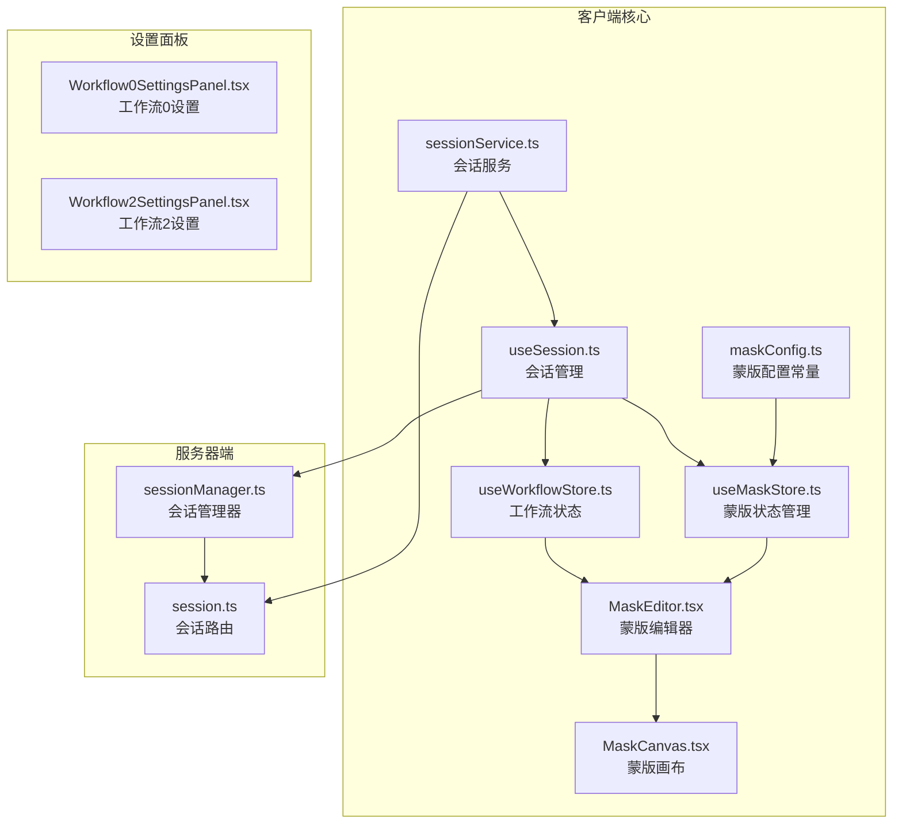

**图表来源**
- [maskConfig.ts:1-20](file://client/src/config/maskConfig.ts#L1-L20)
- [useMaskStore.ts:1-51](file://client/src/hooks/useMaskStore.ts#L1-L51)
- [useSession.ts:1-422](file://client/src/hooks/useSession.ts#L1-L422)

**章节来源**
- [maskConfig.ts:1-20](file://client/src/config/maskConfig.ts#L1-L20)
- [useMaskStore.ts:1-51](file://client/src/hooks/useMaskStore.ts#L1-L51)
- [useSession.ts:1-422](file://client/src/hooks/useSession.ts#L1-L422)

## 核心组件

### 蒙版配置常量

系统定义了工作流级别的蒙版模式配置，通过 `TAB_MASK_MODE` 映射表确定每个工作流是否需要蒙版以及使用的模式：

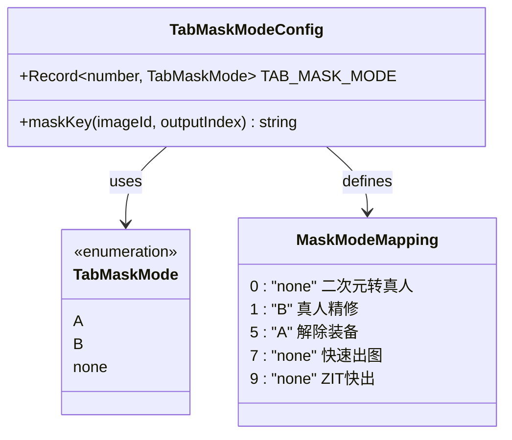

**图表来源**
- [maskConfig.ts:3-16](file://client/src/config/maskConfig.ts#L3-L16)

### 蒙版状态管理

使用 Zustand 创建的高性能状态管理，提供蒙版数据的存储、检索和编辑功能：

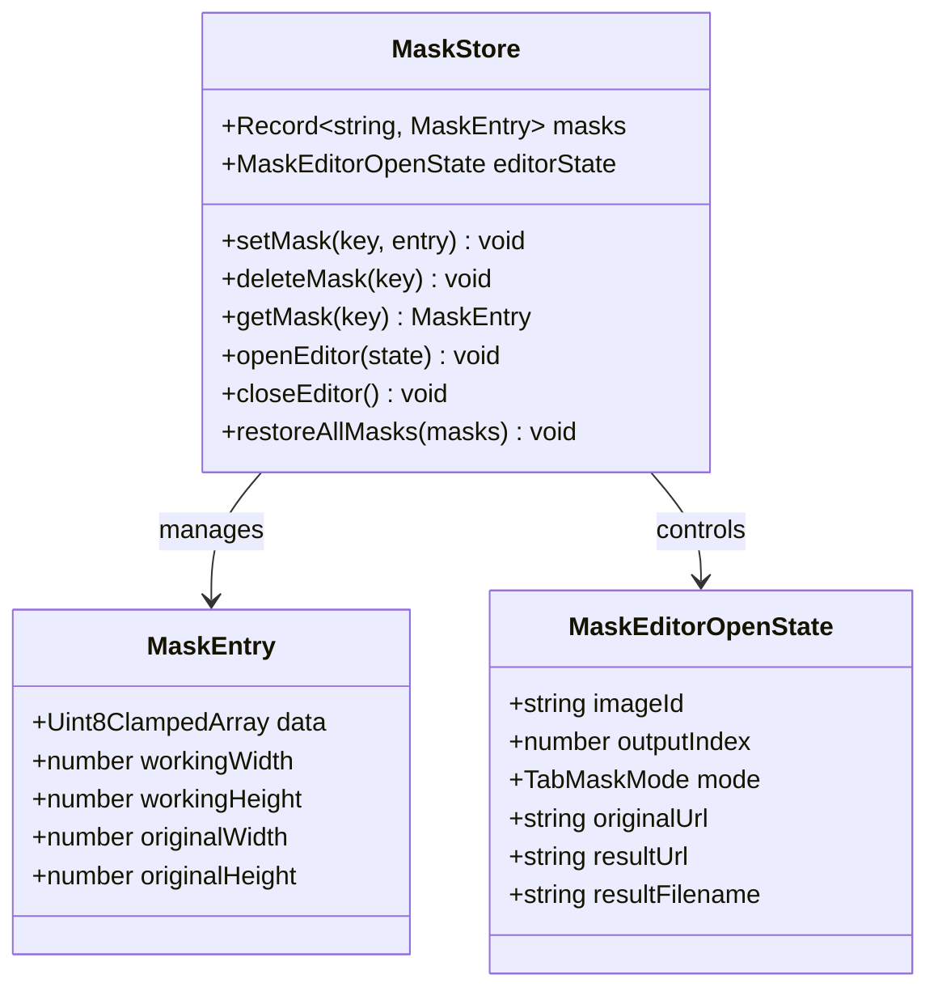

**图表来源**
- [useMaskStore.ts:4-30](file://client/src/hooks/useMaskStore.ts#L4-L30)

**章节来源**
- [maskConfig.ts:1-20](file://client/src/config/maskConfig.ts#L1-L20)
- [useMaskStore.ts:1-51](file://client/src/hooks/useMaskStore.ts#L1-L51)

## 架构概览

蒙版配置管理系统采用分层架构设计，实现了前端状态管理、蒙版编辑、会话持久化和工作流集成的完整闭环：

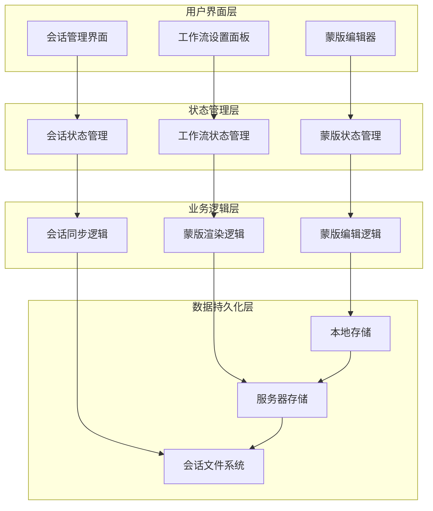

**图表来源**
- [MaskEditor.tsx:141-188](file://client/src/components/MaskEditor.tsx#L141-L188)
- [useSession.ts:137-182](file://client/src/hooks/useSession.ts#L137-L182)
- [sessionManager.ts:10-57](file://server/src/services/sessionManager.ts#L10-L57)

## 详细组件分析

### 蒙版编辑器组件

蒙版编辑器是用户交互的核心界面，提供了完整的蒙版绘制、编辑和导出功能：

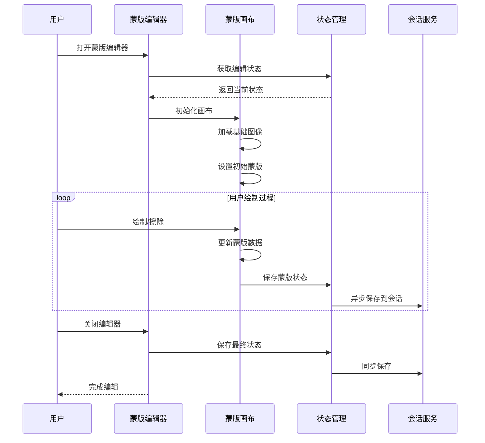

**图表来源**
- [MaskEditor.tsx:180-188](file://client/src/components/MaskEditor.tsx#L180-L188)
- [MaskCanvas.tsx:180-201](file://client/src/components/MaskCanvas.tsx#L180-L201)

#### 编辑器状态管理

编辑器维护着复杂的编辑状态，包括画笔参数、历史记录和视图状态：

| 状态项 | 类型 | 默认值 | 用途 |
|--------|------|--------|------|
| brushSize | number | 40 | 画笔大小（像素） |
| brushHardness | number | 0.8 | 画笔硬度（0-1） |
| brushOpacity | number | 1.0 | 画笔不透明度（0-1） |
| subMode | ModeASubMode | 'dark-overlay' | 模式A子模式 |
| showMaskOverlay | boolean | false | 显示蒙版叠加 |
| autoFilling | boolean | false | 自动填充状态 |

**章节来源**
- [MaskEditor.tsx:149-168](file://client/src/components/MaskEditor.tsx#L149-L168)
- [MaskCanvas.tsx:7-8](file://client/src/components/MaskCanvas.tsx#L7-L8)

### 蒙版画布组件

蒙版画布实现了高性能的图像处理和渲染逻辑，支持多种绘制模式和实时预览：

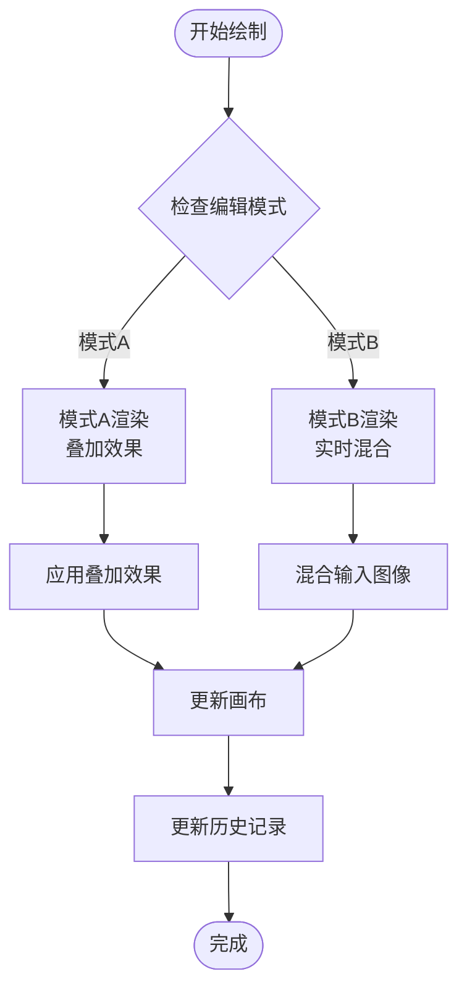

**图表来源**
- [MaskCanvas.tsx:334-384](file://client/src/components/MaskCanvas.tsx#L334-L384)
- [MaskCanvas.tsx:288-302](file://client/src/components/MaskCanvas.tsx#L288-L302)

#### 渲染模式对比

| 模式 | 叠加效果 | 用途 | 性能特点 |
|------|----------|------|----------|
| dark-overlay | 暗色覆盖层 | 调整阴影 | 高性能，实时渲染 |
| brighten | 高亮显示 | 突出区域 | 中等性能 |
| red-overlay | 红色覆盖层 | 警示标记 | 高性能 |

**章节来源**
- [MaskCanvas.tsx:344-359](file://client/src/components/MaskCanvas.tsx#L344-L359)
- [MaskCanvas.tsx:370-383](file://client/src/components/MaskCanvas.tsx#L370-L383)

### 会话持久化系统

系统实现了完整的会话持久化机制，确保蒙版数据在用户会话期间的安全存储：

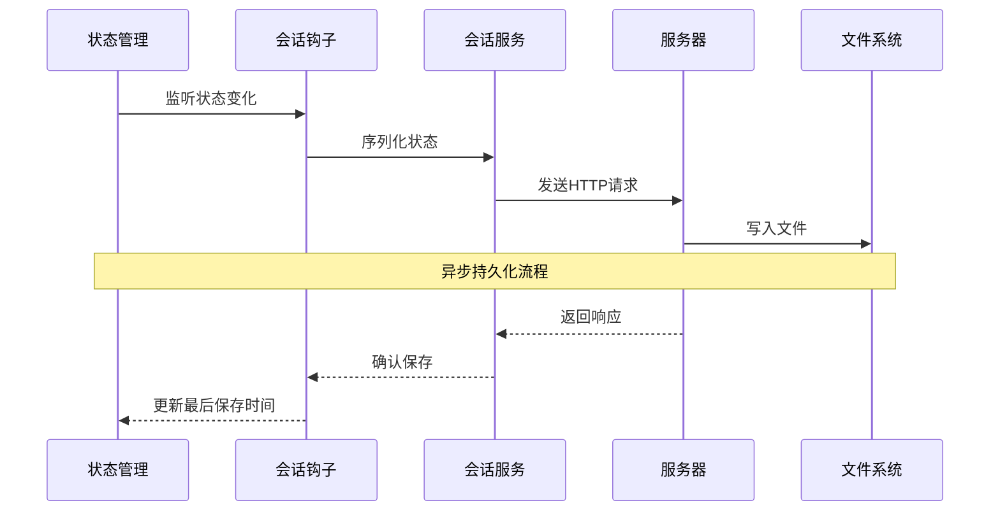

**图表来源**
- [useSession.ts:164-182](file://client/src/hooks/useSession.ts#L164-L182)
- [sessionService.ts:103-113](file://client/src/services/sessionService.ts#L103-L113)

#### 数据序列化结构

会话数据采用分层序列化策略，确保数据的完整性和可恢复性：

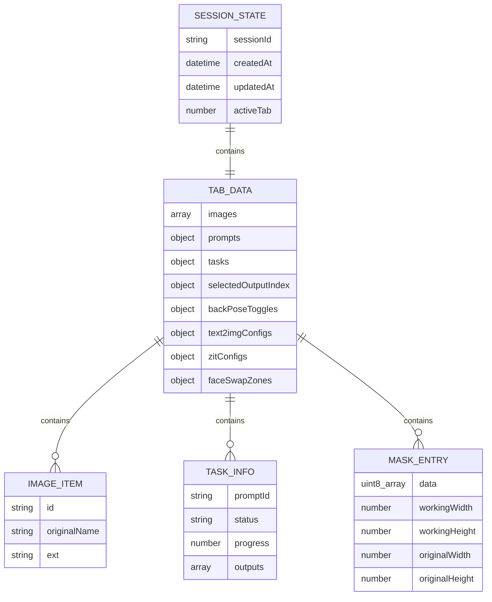

**图表来源**
- [sessionService.ts:61-67](file://client/src/services/sessionService.ts#L61-L67)
- [sessionService.ts:50-59](file://client/src/services/sessionService.ts#L50-L59)

**章节来源**
- [useSession.ts:137-162](file://client/src/hooks/useSession.ts#L137-L162)
- [sessionService.ts:1-134](file://client/src/services/sessionService.ts#L1-L134)

### 工作流集成

系统与多个工作流紧密集成，提供针对不同工作流的蒙版配置：

| 工作流ID | 名称 | 蒙版模式 | 特殊配置 |
|----------|------|----------|----------|
| 0 | 二次元转真人 | none | 无蒙版需求 |
| 1 | 真人精修 | B | 实时混合模式 |
| 5 | 解除装备 | A | 叠加模式 |
| 7 | 快速出图 | none | 文本生成，无蒙版 |
| 9 | ZIT快出 | none | 文本生成，无蒙版 |

**章节来源**
- [maskConfig.ts:5-16](file://client/src/config/maskConfig.ts#L5-L16)
- [useWorkflowStore.ts:6-17](file://client/src/hooks/useWorkflowStore.ts#L6-L17)

## 依赖关系分析

蒙版配置管理系统具有清晰的依赖层次结构，各组件之间的耦合度适中，便于维护和扩展：

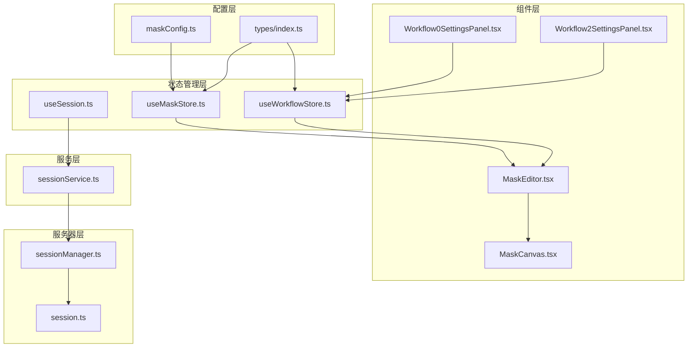

**图表来源**
- [maskConfig.ts:1-20](file://client/src/config/maskConfig.ts#L1-L20)
- [useMaskStore.ts:1-51](file://client/src/hooks/useMaskStore.ts#L1-L51)
- [useSession.ts:1-16](file://client/src/hooks/useSession.ts#L1-L16)

### 组件间通信

系统采用事件驱动的方式实现组件间的松耦合通信：

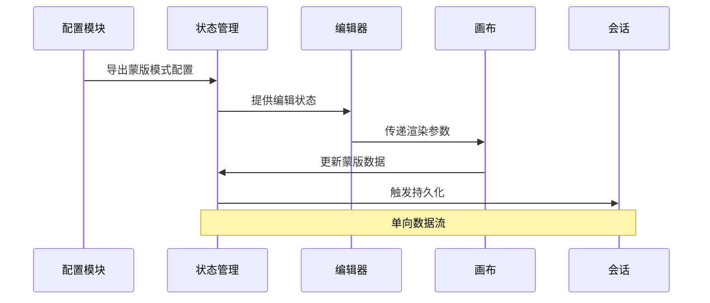

**图表来源**
- [useMaskStore.ts:32-50](file://client/src/hooks/useMaskStore.ts#L32-L50)
- [MaskEditor.tsx:141-147](file://client/src/components/MaskEditor.tsx#L141-L147)

**章节来源**
- [useMaskStore.ts:21-30](file://client/src/hooks/useMaskStore.ts#L21-L30)
- [MaskEditor.tsx:1-375](file://client/src/components/MaskEditor.tsx#L1-L375)

## 性能考虑

### 内存优化策略

系统采用了多项内存优化技术来确保大规模图像处理的性能：

1. **工作尺寸限制**：最大工作尺寸限制为 2048px，防止内存溢出
2. **历史记录优化**：最多保留 30 个历史快照，平衡内存使用和功能需求
3. **增量更新**：仅在状态变化时触发重新渲染，减少不必要的计算

### 渲染性能优化

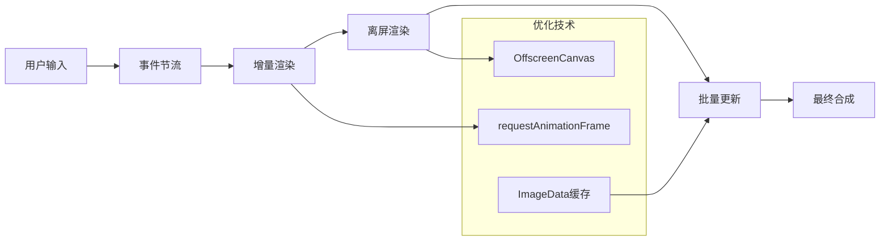

**图表来源**
- [MaskCanvas.tsx:166-178](file://client/src/components/MaskCanvas.tsx#L166-L178)
- [MaskCanvas.tsx:403-454](file://client/src/components/MaskCanvas.tsx#L403-L454)

### 并发处理

系统支持多工作流并发处理，每个工作流拥有独立的状态空间：

| 并发特性 | 实现方式 | 性能影响 |
|----------|----------|----------|
| 多标签页支持 | 独立状态管理 | 无性能损失 |
| 多用户会话 | 服务器隔离 | 服务器资源限制 |
| 异步保存 | 队列化处理 | 减少阻塞 |
| 批量操作 | 增量更新 | 提升响应速度 |

## 故障排除指南

### 常见问题及解决方案

#### 蒙版数据丢失

**症状**：页面刷新后蒙版数据消失

**原因分析**：
- 当前版本设计为内存中存储，刷新即丢失
- 会话持久化功能正在开发中

**解决方案**：
1. 使用会话管理功能保存当前工作
2. 在工作完成后及时执行导出操作
3. 定期手动保存重要蒙版数据

#### 编辑器无法打开

**症状**：点击蒙版按钮无响应

**排查步骤**：
1. 检查工作流是否支持蒙版编辑
2. 验证目标图像是否有有效输出
3. 确认浏览器控制台无错误信息

**解决方案**：
- 对于不支持蒙版的工作流，使用替代编辑方式
- 检查网络连接和API可用性
- 清除浏览器缓存后重试

#### 性能问题

**症状**：大图像处理缓慢或卡顿

**诊断方法**：
1. 检查图像分辨率是否超过建议范围
2. 监控浏览器内存使用情况
3. 查看渲染帧率

**优化建议**：
- 使用较低分辨率进行编辑
- 关闭不必要的浏览器标签页
- 清理浏览器缓存和Cookie

**章节来源**
- [useSession.ts:197-223](file://client/src/hooks/useSession.ts#L197-L223)
- [MaskCanvas.tsx:10-15](file://client/src/components/MaskCanvas.tsx#L10-L15)

### 错误恢复机制

系统内置了多重错误恢复机制：

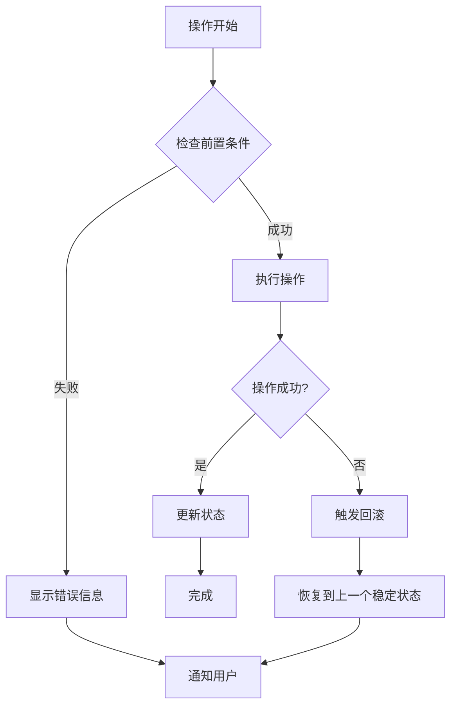

**图表来源**
- [useSession.ts:164-182](file://client/src/hooks/useSession.ts#L164-L182)
- [MaskEditor.tsx:218-235](file://client/src/components/MaskEditor.tsx#L218-L235)

## 结论

蒙版配置管理系统是一个设计精良、功能完整的图像处理工具，具有以下显著特点：

### 技术优势

1. **模块化设计**：清晰的组件分离和职责划分
2. **高性能实现**：基于 WebAssembly 和离屏渲染的优化
3. **可扩展性**：灵活的配置系统支持未来功能扩展
4. **用户体验**：直观的界面设计和流畅的操作体验

### 架构亮点

- **双层持久化**：本地存储保证即时访问，服务器存储确保数据安全
- **事件驱动**：松耦合的组件通信机制
- **类型安全**：完整的 TypeScript 类型定义
- **错误处理**：完善的异常捕获和恢复机制

### 发展方向

1. **会话持久化**：实现真正的跨页面蒙版数据持久化
2. **协作功能**：支持多用户协作编辑蒙版
3. **高级算法**：集成更智能的蒙版生成和编辑算法
4. **移动端支持**：优化移动设备上的使用体验

该系统为图像处理工作流提供了强大的蒙版编辑能力，是整个 CorineKit Pix2Real 项目的重要组成部分，为用户提供了专业级的图像编辑体验。