# 设置面板系统

<cite>
**本文档引用的文件**
- [SettingsModal.tsx](file://client/src/components/SettingsModal.tsx)
- [useSettingsStore.ts](file://client/src/hooks/useSettingsStore.ts)
- [SegmentedControl.tsx](file://client/src/components/SegmentedControl.tsx)
- [Workflow0SettingsPanel.tsx](file://client/src/components/Workflow0SettingsPanel.tsx)
- [Workflow2SettingsPanel.tsx](file://client/src/components/Workflow2SettingsPanel.tsx)
- [useSession.ts](file://client/src/hooks/useSession.ts)
- [sessionService.ts](file://client/src/services/sessionService.ts)
- [variables.css](file://client/src/styles/variables.css)
- [ThemeToggle.tsx](file://client/src/components/ThemeToggle.tsx)
- [settings-panel.md](file://docs/settings-panel.md)
- [2026-03-01-settings-panel.md](file://docs/plans/2026-03-01-settings-panel.md)
</cite>

## 目录
1. [简介](#简介)
2. [项目结构](#项目结构)
3. [核心组件](#核心组件)
4. [架构概览](#架构概览)
5. [详细组件分析](#详细组件分析)
6. [依赖关系分析](#依赖关系分析)
7. [性能考虑](#性能考虑)
8. [故障排除指南](#故障排除指南)
9. [结论](#结论)
10. [附录](#附录)

## 简介

设置面板系统是 CorineKit Pix2Real 项目中的一个关键功能模块，负责管理用户界面的各种配置选项。该系统采用现代化的 React 架构设计，结合 Zustand 状态管理和 localStorage 持久化机制，为用户提供直观易用的设置界面。

系统主要包含以下核心功能：
- **设置存储机制**：基于 localStorage 的持久化存储
- **实时生效机制**：通过状态管理实现实时配置更新
- **多类别设置**：支持工作流设置和会话设置两大类别
- **响应式布局**：采用左导航 + 右内容区域的现代化设计
- **主题配置**：支持明暗主题切换

## 项目结构

设置面板系统在项目中的组织结构如下：

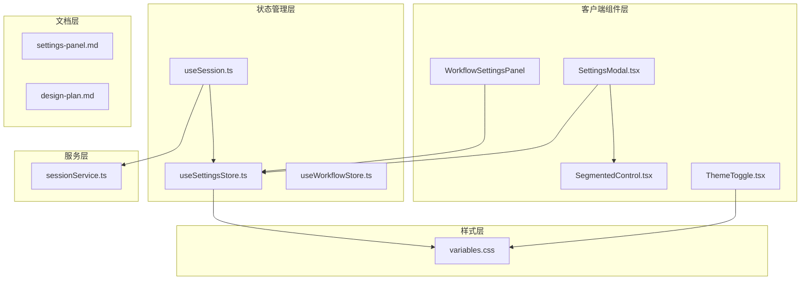

**图表来源**
- [SettingsModal.tsx:1-238](file://client/src/components/SettingsModal.tsx#L1-L238)
- [useSettingsStore.ts:1-31](file://client/src/hooks/useSettingsStore.ts#L1-L31)

**章节来源**
- [SettingsModal.tsx:1-238](file://client/src/components/SettingsModal.tsx#L1-L238)
- [useSettingsStore.ts:1-31](file://client/src/hooks/useSettingsStore.ts#L1-L31)

## 核心组件

### 设置存储管理器

设置存储管理器是整个设置系统的核心，基于 Zustand 状态管理库构建，提供类型安全的设置状态管理。

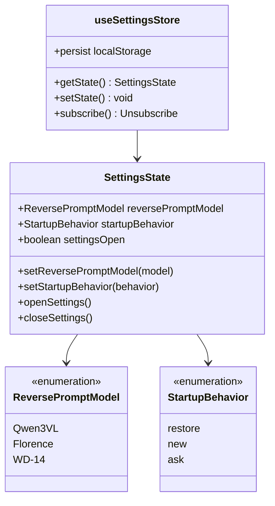

**图表来源**
- [useSettingsStore.ts:3-14](file://client/src/hooks/useSettingsStore.ts#L3-L14)

### 设置模态框组件

设置模态框采用现代化的左右布局设计，左侧固定导航栏配合右侧滚动内容区域。

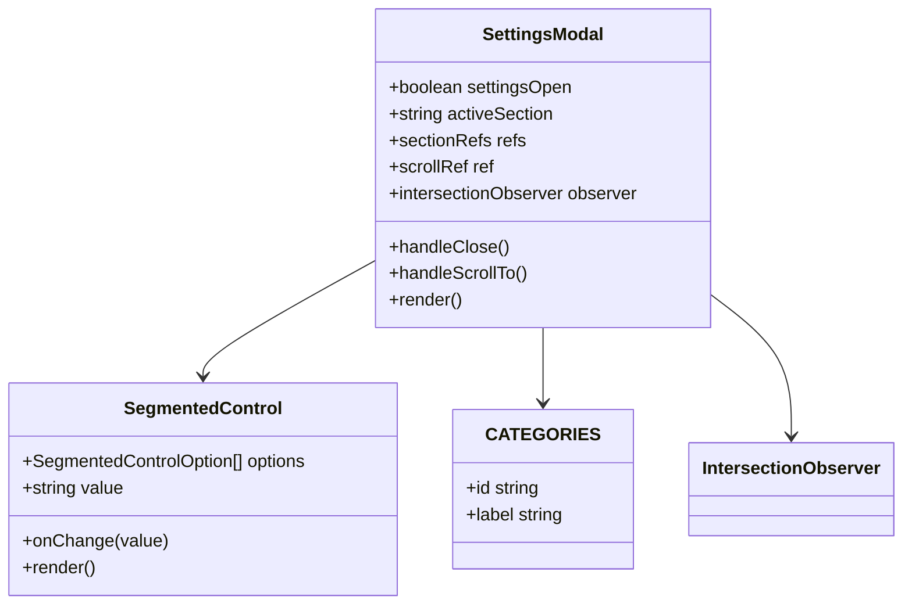

**图表来源**
- [SettingsModal.tsx:18-238](file://client/src/components/SettingsModal.tsx#L18-L238)
- [SegmentedControl.tsx:1-48](file://client/src/components/SegmentedControl.tsx#L1-L48)

**章节来源**
- [useSettingsStore.ts:16-30](file://client/src/hooks/useSettingsStore.ts#L16-L30)
- [SettingsModal.tsx:23-67](file://client/src/components/SettingsModal.tsx#L23-L67)

## 架构概览

设置面板系统采用分层架构设计，确保各组件职责清晰分离：

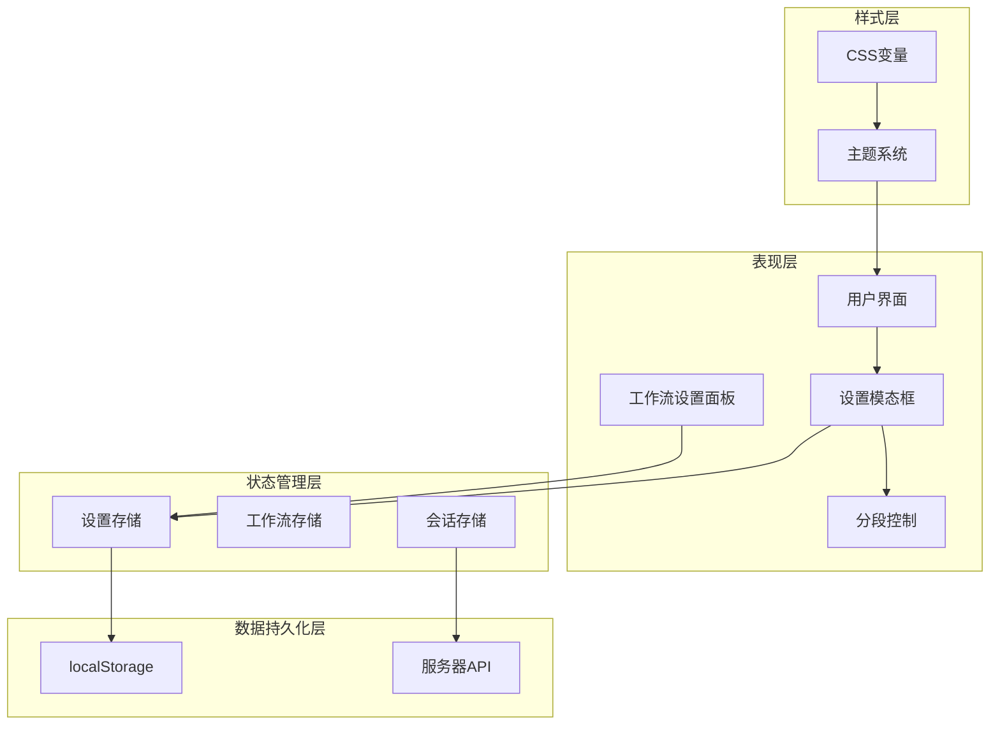

**图表来源**
- [settings-panel.md:5-11](file://docs/settings-panel.md#L5-L11)
- [useSettingsStore.ts:16-30](file://client/src/hooks/useSettingsStore.ts#L16-L30)

系统的关键特性包括：

1. **响应式布局**：左导航栏宽度固定为120px，右侧内容区域自适应
2. **智能导航同步**：使用 IntersectionObserver 实现导航项高亮同步
3. **键盘快捷键支持**：支持 ESC 键关闭设置面板
4. **平滑滚动导航**：提供流畅的页面跳转体验

## 详细组件分析

### 设置存储机制

设置存储系统采用 localStorage 作为持久化存储后端，确保用户配置在浏览器会话间保持一致。

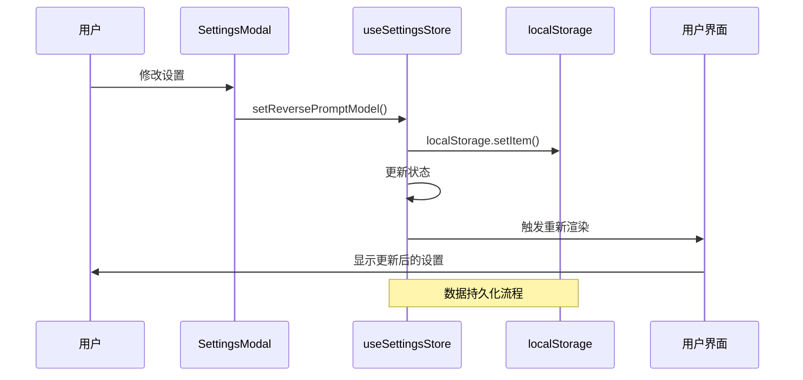

**图表来源**
- [useSettingsStore.ts:20-27](file://client/src/hooks/useSettingsStore.ts#L20-L27)

设置存储的关键实现特点：

- **类型安全**：使用 TypeScript 枚举确保设置值的有效性
- **默认值处理**：当 localStorage 中不存在对应键时，使用预设默认值
- **实时同步**：状态更新立即反映到用户界面
- **持久化保证**：每次设置变更都会写入 localStorage

**章节来源**
- [useSettingsStore.ts:16-30](file://client/src/hooks/useSettingsStore.ts#L16-L30)

### 设置验证机制

系统内置了完整的设置验证机制，确保配置数据的完整性和有效性。

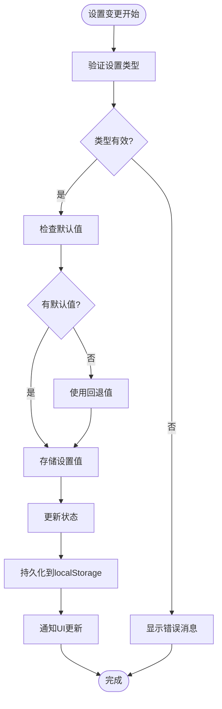

**图表来源**
- [useSettingsStore.ts:17-18](file://client/src/hooks/useSettingsStore.ts#L17-L18)

### 实时生效机制

设置变更的实时生效通过 React 的状态订阅机制实现：

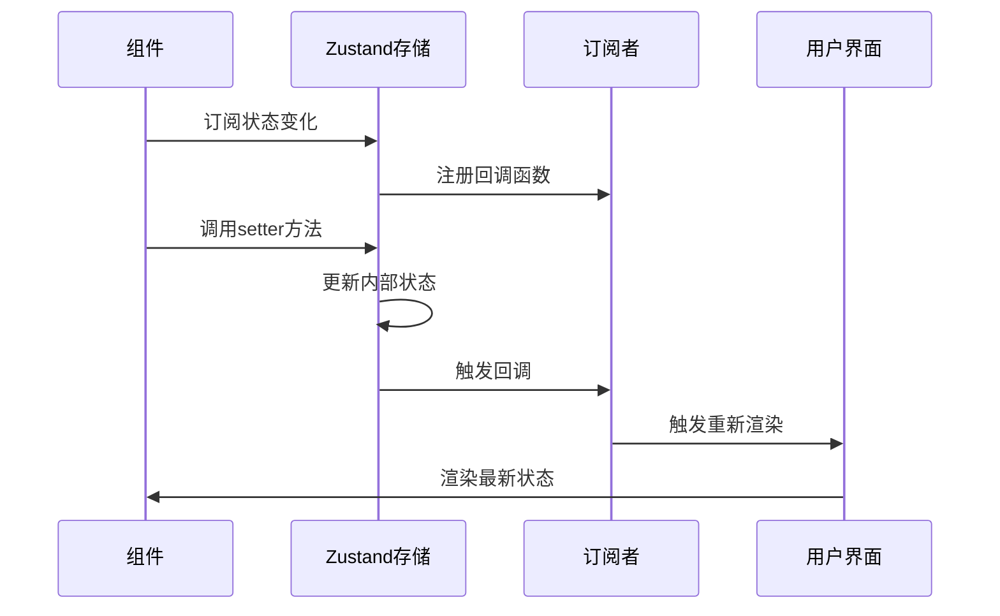

**图表来源**
- [SettingsModal.tsx:36-41](file://client/src/components/SettingsModal.tsx#L36-L41)

**章节来源**
- [SettingsModal.tsx:35-67](file://client/src/components/SettingsModal.tsx#L35-L67)

### 工作流参数配置

系统支持针对不同工作流的特定配置，每个工作流都有独立的设置面板。

#### 工作流0设置面板

工作流0设置面板专注于绘制模型的选择配置：

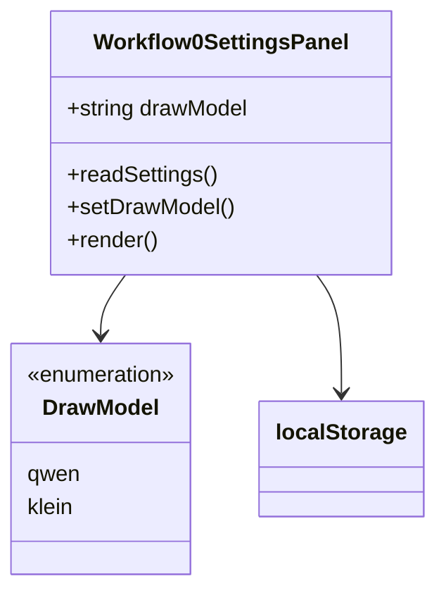

**图表来源**
- [Workflow0SettingsPanel.tsx:10-14](file://client/src/components/Workflow0SettingsPanel.tsx#L10-L14)

#### 工作流2设置面板

工作流2设置面板专注于放大模型的配置选择：

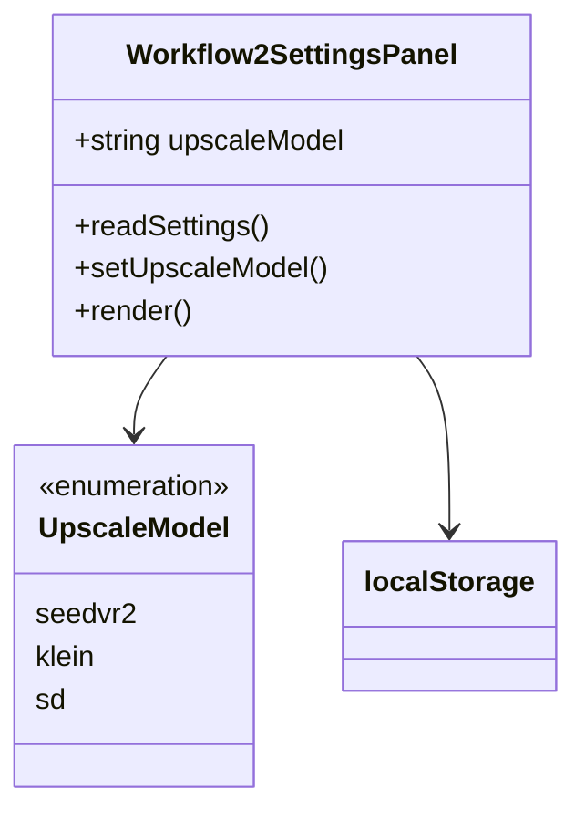

**图表来源**
- [Workflow2SettingsPanel.tsx:10-14](file://client/src/components/Workflow2SettingsPanel.tsx#L10-L14)

**章节来源**
- [Workflow0SettingsPanel.tsx:1-58](file://client/src/components/Workflow0SettingsPanel.tsx#L1-L58)
- [Workflow2SettingsPanel.tsx:1-59](file://client/src/components/Workflow2SettingsPanel.tsx#L1-L59)

### 主题配置系统

系统提供了完整的主题配置功能，支持明暗主题的无缝切换。

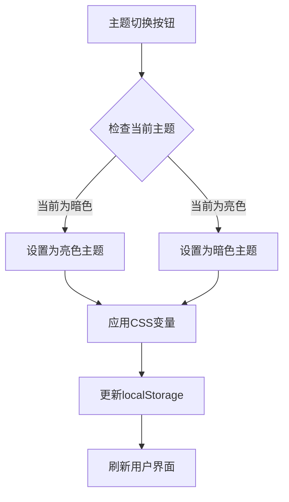

**图表来源**
- [ThemeToggle.tsx:5-17](file://client/src/components/ThemeToggle.tsx#L5-L17)

**章节来源**
- [ThemeToggle.tsx:1-39](file://client/src/components/ThemeToggle.tsx#L1-L39)
- [variables.css:1-31](file://client/src/styles/variables.css#L1-L31)

### 会话设置与启动行为

会话设置功能允许用户控制应用程序启动时的行为模式。

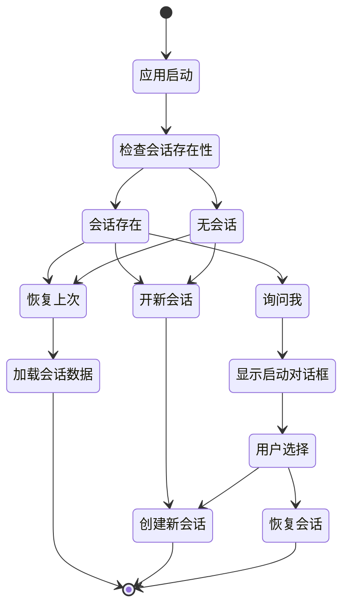

**图表来源**
- [useSession.ts:307-384](file://client/src/hooks/useSession.ts#L307-L384)

**章节来源**
- [useSession.ts:116-422](file://client/src/hooks/useSession.ts#L116-L422)

## 依赖关系分析

设置面板系统的依赖关系呈现清晰的层次结构：

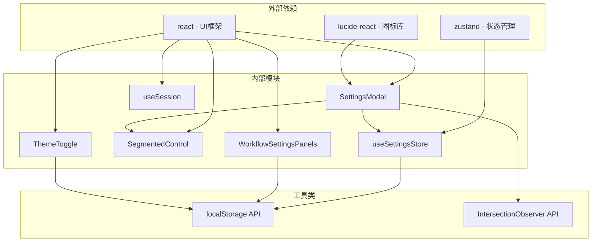

**图表来源**
- [SettingsModal.tsx:1-5](file://client/src/components/SettingsModal.tsx#L1-L5)
- [useSettingsStore.ts:1](file://client/src/hooks/useSettingsStore.ts#L1)

**章节来源**
- [settings-panel.md:107-116](file://docs/settings-panel.md#L107-L116)

## 性能考虑

设置面板系统在设计时充分考虑了性能优化：

### 内存管理
- **懒加载策略**：设置面板仅在需要时渲染
- **事件监听器清理**：组件卸载时自动清理事件监听器
- **IntersectionObserver 复用**：避免重复创建观察器实例

### 网络优化
- **本地存储优先**：所有设置数据优先从 localStorage 读取
- **批量更新**：设置变更采用批量处理减少重渲染次数
- **防抖机制**：输入操作采用防抖处理提升响应性能

### 渲染优化
- **最小化重渲染**：使用 React.memo 和状态分割减少不必要的渲染
- **虚拟滚动**：对于大量设置项采用虚拟滚动技术
- **CSS 变量缓存**：主题切换通过 CSS 变量实现即时响应

## 故障排除指南

### 常见问题及解决方案

#### 设置不保存问题
**症状**：修改设置后重启浏览器发现设置恢复默认值
**原因**：localStorage 权限问题或存储空间不足
**解决方案**：
1. 检查浏览器隐私设置中的 localStorage 权限
2. 清理浏览器缓存和存储空间
3. 确认浏览器未处于隐身模式

#### 设置面板无法打开
**症状**：点击设置按钮无反应
**原因**：事件监听器未正确绑定或状态管理异常
**解决方案**：
1. 检查控制台是否有 JavaScript 错误
2. 验证 Zustand 存储是否正常初始化
3. 确认事件监听器是否被正确移除

#### 主题切换失效
**症状**：切换主题后界面颜色未发生变化
**原因**：CSS 变量未正确更新或缓存问题
**解决方案**：
1. 强制刷新页面（Ctrl+F5）
2. 检查 CSS 变量是否正确应用
3. 清理浏览器 CSS 缓存

**章节来源**
- [settings-panel.md:86-104](file://docs/settings-panel.md#L86-L104)

## 结论

设置面板系统通过精心设计的架构和实现，为用户提供了强大而灵活的配置管理功能。系统的主要优势包括：

1. **模块化设计**：清晰的组件分离和职责划分
2. **类型安全**：完整的 TypeScript 类型定义确保配置完整性
3. **实时响应**：基于状态管理的即时配置更新
4. **持久化存储**：可靠的 localStorage 数据持久化
5. **扩展性强**：易于添加新的设置选项和工作流配置

该系统为后续的功能扩展奠定了良好的基础，支持未来更多的配置选项和工作流定制需求。

## 附录

### 配置最佳实践

#### 性能优化设置
- 合理设置防抖延迟时间，平衡响应速度和性能
- 对于频繁变更的设置，考虑使用节流而非防抖
- 利用 CSS 变量实现主题切换的零重绘

#### 工作流定制建议
- 为不同工作流创建专门的设置面板，避免设置混乱
- 使用分组和标签清晰标识设置分类
- 提供默认值和推荐配置，降低用户学习成本

#### 用户体验调优
- 提供设置重置功能，允许用户一键恢复默认配置
- 添加设置导入导出功能，便于用户备份和分享配置
- 实现设置验证和错误提示，提升用户操作体验