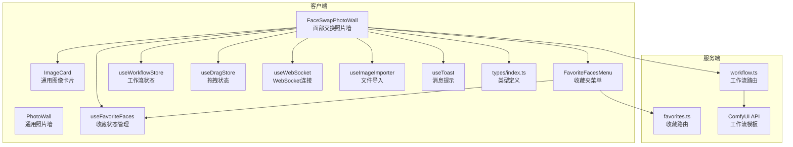
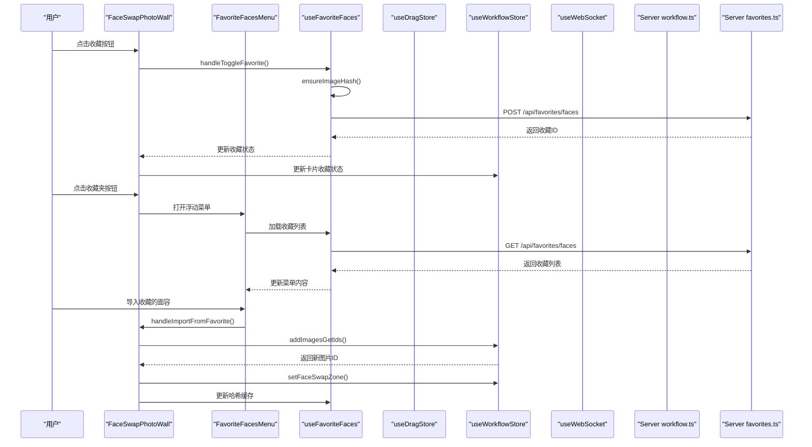
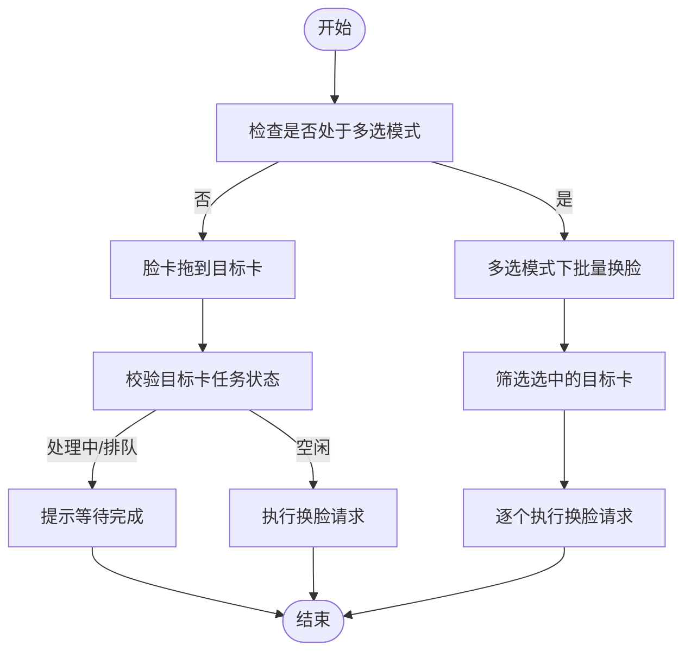
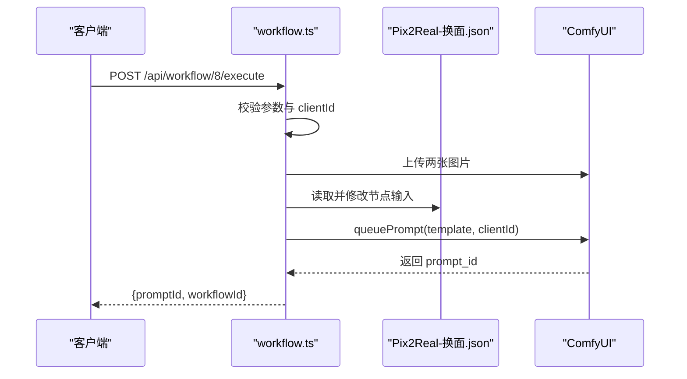
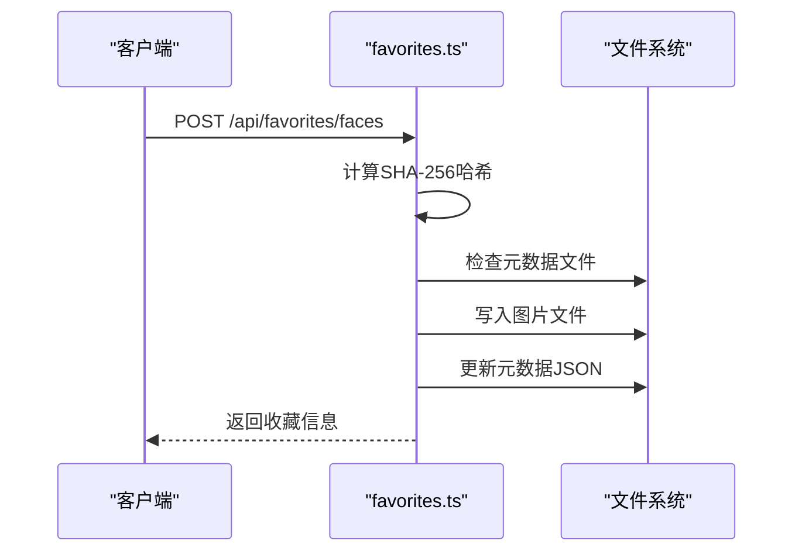
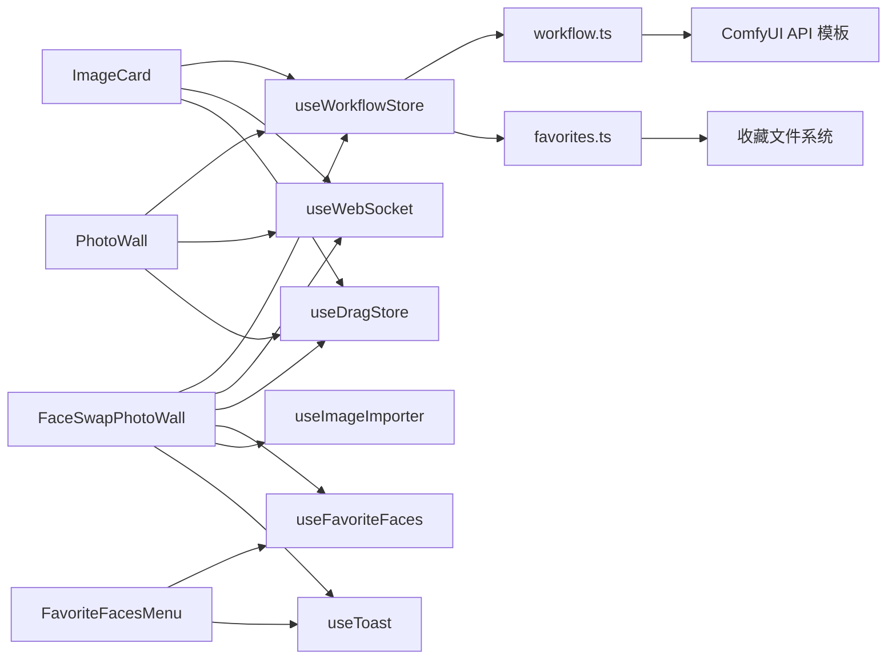

# 面部交换组件

<cite>
**本文档引用的文件**
- [FaceSwapPhotoWall.tsx](file://client/src/components/FaceSwapPhotoWall.tsx)
- [ImageCard.tsx](file://client/src/components/ImageCard.tsx)
- [PhotoWall.tsx](file://client/src/components/PhotoWall.tsx)
- [FavoriteFacesMenu.tsx](file://client/src/components/FavoriteFacesMenu.tsx)
- [useFavoriteFaces.ts](file://client/src/hooks/useFavoriteFaces.ts)
- [useWorkflowStore.ts](file://client/src/hooks/useWorkflowStore.ts)
- [useDragStore.ts](file://client/src/hooks/useDragStore.ts)
- [useWebSocket.ts](file://client/src/hooks/useWebSocket.ts)
- [useImageImporter.ts](file://client/src/hooks/useImageImporter.ts)
- [useToast.ts](file://client/src/hooks/useToast.ts)
- [index.ts](file://client/src/types/index.ts)
- [favorites.ts](file://server/src/routes/favorites.ts)
- [workflow.ts](file://server/src/routes/workflow.ts)
- [Pix2Real-换面.json](file://ComfyUI_API/Pix2Real-换面.json)
</cite>

## 更新摘要
**变更内容**
- 新增收藏功能相关的组件集成，包括收藏状态管理、浮动菜单、SHA-256哈希计算等新功能
- 在FaceSwapPhotoWall组件中集成了收藏功能，支持收藏/取消收藏面部参考图
- 新增FavoriteFacesMenu浮动菜单组件，提供收藏管理界面
- 新增useFavoriteFaces hook，管理收藏列表和哈希缓存
- 新增服务器端收藏路由，支持收藏的面容存储和管理

## 目录
1. [简介](#简介)
2. [项目结构](#项目结构)
3. [核心组件](#核心组件)
4. [架构总览](#架构总览)
5. [详细组件分析](#详细组件分析)
6. [依赖关系分析](#依赖关系分析)
7. [性能考虑](#性能考虑)
8. [故障排除指南](#故障排除指南)
9. [结论](#结论)
10. [附录](#附录)

## 简介
本文件系统性地解析面部交换组件（FaceSwapPhotoWall）的设计与实现，涵盖照片墙布局、图像卡片管理、拖拽交互、批量操作、收藏功能、响应式设计、性能优化与内存管理等关键技术点。同时提供面部交换功能的使用指南与最佳实践，解释组件与工作流系统的集成方式及与其他UI组件的协作机制。

**更新** 新增收藏功能相关的组件集成，包括收藏状态管理、浮动菜单、SHA-256哈希计算等新功能。用户可以通过点击卡片上的星形按钮收藏面部参考图，或通过收藏夹浮动菜单导入已收藏的面容到脸部参考区。收藏功能基于SHA-256哈希值进行去重判断，确保不会重复导入相同的面容。

## 项目结构
该组件位于客户端前端，采用模块化组织：
- 组件层：FaceSwapPhotoWall、ImageCard、PhotoWall、FavoriteFacesMenu
- 状态层：useWorkflowStore（Zustand）、useDragStore、useFavoriteFaces、useWebSocket
- 工具层：useImageImporter、useToast
- 类型定义：types/index.ts
- 服务端路由：server/src/routes/workflow.ts、server/src/routes/favorites.ts
- 工作流模板：ComfyUI_API/Pix2Real-换面.json

**图表来源**
- [FaceSwapPhotoWall.tsx:245-1152](file://client/src/components/FaceSwapPhotoWall.tsx#L245-L1152)
- [ImageCard.tsx:42-1055](file://client/src/components/ImageCard.tsx#L42-L1055)
- [PhotoWall.tsx:103-578](file://client/src/components/PhotoWall.tsx#L103-L578)
- [FavoriteFacesMenu.tsx:12-211](file://client/src/components/FavoriteFacesMenu.tsx#L12-L211)
- [useFavoriteFaces.ts:35-110](file://client/src/hooks/useFavoriteFaces.ts#L35-L110)
- [useWorkflowStore.ts:96-645](file://client/src/hooks/useWorkflowStore.ts#L96-L645)
- [useDragStore.ts:1-17](file://client/src/hooks/useDragStore.ts#L1-L17)
- [useWebSocket.ts:1-99](file://client/src/hooks/useWebSocket.ts#L1-L99)
- [useImageImporter.ts:9-48](file://client/src/hooks/useImageImporter.ts#L9-L48)
- [useToast.ts:1-33](file://client/src/hooks/useToast.ts#L1-L33)
- [index.ts:1-70](file://client/src/types/index.ts#L1-L70)
- [favorites.ts:49-114](file://server/src/routes/favorites.ts#L49-L114)
- [workflow.ts:263-310](file://server/src/routes/workflow.ts#L263-L310)
- [Pix2Real-换面.json:1-369](file://ComfyUI_API/Pix2Real-换面.json#L1-L369)

**章节来源**
- [FaceSwapPhotoWall.tsx:245-1152](file://client/src/components/FaceSwapPhotoWall.tsx#L245-L1152)
- [PhotoWall.tsx:103-578](file://client/src/components/PhotoWall.tsx#L103-L578)

## 核心组件
- FaceSwapPhotoWall：实现双区布局（左脸参考区、右目标区），支持拖拽换脸、跨区导入、多选批量操作、长按进入多选模式、**新增收藏功能**。
- ImageCard：通用图像卡片，负责渲染、进度显示、多选勾选、长按触发、拖拽导出等。
- PhotoWall：通用照片墙，提供批量操作、懒加载、删除区域等能力，作为其他工作流的基础容器。
- FavoriteFacesMenu：收藏夹浮动菜单，提供收藏的面容列表、导入和删除功能。
- useFavoriteFaces：收藏状态管理hook，提供收藏列表、哈希缓存、添加/删除收藏等操作。
- 状态与通信：useWorkflowStore（图像列表、任务状态、选择集、工作流配置）、useDragStore（拖拽状态）、useWebSocket（进度订阅）、useImageImporter（重复名处理）、useToast（全局提示）。

**章节来源**
- [FaceSwapPhotoWall.tsx:245-1152](file://client/src/components/FaceSwapPhotoWall.tsx#L245-L1152)
- [ImageCard.tsx:42-1055](file://client/src/components/ImageCard.tsx#L42-L1055)
- [PhotoWall.tsx:103-578](file://client/src/components/PhotoWall.tsx#L103-L578)
- [FavoriteFacesMenu.tsx:12-211](file://client/src/components/FavoriteFacesMenu.tsx#L12-L211)
- [useFavoriteFaces.ts:35-110](file://client/src/hooks/useFavoriteFaces.ts#L35-L110)
- [useWorkflowStore.ts:96-645](file://client/src/hooks/useWorkflowStore.ts#L96-L645)
- [useDragStore.ts:1-17](file://client/src/hooks/useDragStore.ts#L1-L17)
- [useWebSocket.ts:1-99](file://client/src/hooks/useWebSocket.ts#L1-L99)
- [useImageImporter.ts:9-48](file://client/src/hooks/useImageImporter.ts#L9-L48)
- [useToast.ts:1-33](file://client/src/hooks/useToast.ts#L1-L33)

## 架构总览
组件采用"双区 + 卡片 + 状态 + 收藏"的分层架构：
- 视图层：FaceSwapPhotoWall（左右分区）、ImageCard（单卡）、**新增收藏夹菜单**
- 交互层：拖拽（HTML5 DataTransfer + 自定义数据类型）、长按多选、跨区导入、**收藏/取消收藏**、**浮动菜单**
- 状态层：Zustand Store（图像、任务、选择集、工作区配置）、**收藏状态管理**
- 通信层：WebSocket（进度/完成/错误）、HTTP（执行工作流、收藏管理）
- 服务端：工作流路由（上传两张图，拼接模板，队列执行）、**收藏路由（SHA-256哈希存储）**

**图表来源**
- [FaceSwapPhotoWall.tsx:329-351](file://client/src/components/FaceSwapPhotoWall.tsx#L329-L351)
- [FaceSwapPhotoWall.tsx:354-385](file://client/src/components/FaceSwapPhotoWall.tsx#L354-L385)
- [FavoriteFacesMenu.tsx:13-23](file://client/src/components/FavoriteFacesMenu.tsx#L13-L23)
- [useFavoriteFaces.ts:69-97](file://client/src/hooks/useFavoriteFaces.ts#L69-L97)
- [favorites.ts:62-89](file://server/src/routes/favorites.ts#L62-L89)

## 详细组件分析

### FaceSwapPhotoWall 组件分析
- 布局与视口：双区布局（左脸参考区占固定宽度，右目标区自适应），根据 ViewSize 动态调整卡片尺寸与间距。
- 图像分区：通过 faceSwapZones 字段区分"face"和"target"，过滤渲染。
- 拖拽交互：
  - 脸部卡片拖拽：设置自定义 DataTransfer 类型，effectAllowed='copy'。
  - 目标卡片拖拽：设置自定义 DataTransfer 类型，effectAllowed='move'。
  - 区域级拖拽：外部文件拖入目标区默认导入；拖入脸区导入并标记为 face。
  - 跨区导入：目标卡片拖入脸区复制到脸区；脸卡片拖入目标区复制到目标区。
- 多选与批量：
  - 长按触发多选，支持在目标区批量使用当前脸进行换脸。
  - 多选工具栏显示已选数量与操作按钮（删除、取消选择）。
- **新增收藏功能**：
  - 收藏状态管理：通过useFavoriteFaces hook管理收藏列表和哈希缓存。
  - SHA-256哈希计算：惰性计算并缓存每张脸部参考图的哈希值，用于判断收藏状态和导入去重。
  - 收藏按钮：在FaceZoneCard底部添加星形按钮，支持收藏/取消收藏。
  - 收藏菜单：点击收藏夹按钮打开浮动菜单，显示所有收藏的面容。
  - 导入去重：从收藏菜单导入时，检查脸部参考区是否已存在相同哈希的面容。
- **新增拖拽删除功能**：
  - 底部中央删除区域：当任何卡片被拖拽时激活，显示半透明背景和删除提示。
  - 支持单张删除和批量删除：当多选模式下拖拽卡片时，删除所有选中的图片。
  - 智能检测：通过useDragStore全局状态跟踪拖拽状态，确保删除区域正确显示。
  - 安全保护：拖拽删除区域仅在卡片拖拽过程中显示，避免误触。
- 任务执行：调用 /api/workflow/8/execute，提交 targetImage 与 faceImage，启动任务并注册 WebSocket 监听。

**图表来源**
- [FaceSwapPhotoWall.tsx:428-471](file://client/src/components/FaceSwapPhotoWall.tsx#L428-L471)
- [FaceSwapPhotoWall.tsx:257-282](file://client/src/components/FaceSwapPhotoWall.tsx#L257-L282)

**章节来源**
- [FaceSwapPhotoWall.tsx:245-1152](file://client/src/components/FaceSwapPhotoWall.tsx#L245-L1152)

### ImageCard 组件分析
- 渲染与状态：根据任务状态显示进度、错误、输出覆盖层；支持视频预览与缩略条。
- 拖拽导出：设置 DataTransfer 数据类型，effectAllowed='move'。
- 多选与长按：长按触发回调，点击切换选择。
- 通用性：作为 PhotoWall 的基础卡片，被 FaceSwapPhotoWall 复用。
- **拖拽状态管理**：通过useDragStore统一管理拖拽状态，确保拖拽过程中的视觉反馈一致。

**章节来源**
- [ImageCard.tsx:42-1055](file://client/src/components/ImageCard.tsx#L42-L1055)

### PhotoWall 组件分析
- 懒加载：LazyCard 使用 IntersectionObserver 实现占位与可见时渲染，减少首屏压力。
- 批量操作：全选、批量替换提示词、批量删除蒙版、批量执行。
- 删除区域：拖拽卡片到页面底部删除区域，支持批量删除。

**章节来源**
- [PhotoWall.tsx:18-97](file://client/src/components/PhotoWall.tsx#L18-L97)
- [PhotoWall.tsx:181-240](file://client/src/components/PhotoWall.tsx#L181-L240)
- [PhotoWall.tsx:511-578](file://client/src/components/PhotoWall.tsx#L511-L578)

### FavoriteFacesMenu 组件分析
- **浮动菜单界面**：基于createPortal创建的固定定位菜单，显示在收藏夹按钮附近。
- **收藏列表展示**：网格布局显示所有收藏的面容，支持点击导入到脸部参考区。
- **交互功能**：
  - 点击外部区域自动关闭菜单
  - ESC键关闭菜单
  - 悬停显示删除按钮
  - 导入时调用父组件的导入函数
- **位置计算**：智能计算菜单位置，避免超出视口边界，必要时向上弹出。
- **状态管理**：通过useFavoriteFaces hook获取收藏列表，支持加载状态和错误处理。

**章节来源**
- [FavoriteFacesMenu.tsx:12-211](file://client/src/components/FavoriteFacesMenu.tsx#L12-L211)

### useFavoriteFaces Hook 分析
- **收藏状态管理**：基于Zustand的状态管理，维护收藏列表、加载状态和哈希缓存。
- **SHA-256哈希计算**：使用Web Crypto API计算文件哈希值，作为收藏的唯一标识。
- **惰性计算**：只在需要时计算哈希值，避免不必要的性能开销。
- **缓存机制**：将计算结果缓存在imageHashCache中，避免重复计算。
- **API接口**：
  - load：加载收藏列表
  - add：添加收藏（自动去重）
  - remove：删除收藏
  - ensureImageHash：确保哈希值存在并返回
- **去重机制**：基于SHA-256哈希值进行去重，确保不会重复收藏相同内容。

**章节来源**
- [useFavoriteFaces.ts:35-110](file://client/src/hooks/useFavoriteFaces.ts#L35-L110)

### 状态与通信
- useWorkflowStore：维护每标签页的 images、tasks、prompts、selectedImageIds、faceSwapZones 等，提供 add/remove/startTask/updateProgress 等方法。
- useDragStore：统一记录当前拖拽项，避免拖拽过程中卡片属性变化导致的异常。
- useWebSocket：单例连接，自动重连，接收进度/完成/错误消息并更新 Store。
- useImageImporter：处理重复文件名冲突，提供覆盖或保留两种策略。
- useToast：全局消息提示，统一展示错误与反馈信息。

**章节来源**
- [useWorkflowStore.ts:96-645](file://client/src/hooks/useWorkflowStore.ts#L96-L645)
- [useDragStore.ts:1-17](file://client/src/hooks/useDragStore.ts#L1-L17)
- [useWebSocket.ts:1-99](file://client/src/hooks/useWebSocket.ts#L1-L99)
- [useImageImporter.ts:9-48](file://client/src/hooks/useImageImporter.ts#L9-L48)
- [useToast.ts:1-33](file://client/src/hooks/useToast.ts#L1-L33)

### 服务端工作流集成
- 路由：POST /api/workflow/8/execute 接收 targetImage 与 faceImage，上传至 ComfyUI 并队列执行。
- 模板：Pix2Real-换面.json 定义了换脸工作流节点，动态注入两张图片与随机种子。
- 响应：返回 promptId，前端通过 WebSocket 订阅进度与完成事件。

**图表来源**
- [workflow.ts:267-310](file://server/src/routes/workflow.ts#L267-L310)
- [Pix2Real-换面.json:1-369](file://ComfyUI_API/Pix2Real-换面.json#L1-L369)

### 服务端收藏功能集成
- **路由设计**：提供完整的RESTful API接口，支持收藏列表查询、添加和删除。
- **存储机制**：使用SHA-256哈希值作为文件名，自动去重并保存元数据。
- **元数据管理**：使用JSON文件存储收藏信息，包括原始文件名、添加时间和文件扩展名。
- **API接口**：
  - GET /api/favorites/faces：列出所有收藏的面容
  - POST /api/favorites/faces：添加收藏（以文件内容哈希为ID）
  - DELETE /api/favorites/faces/:id：删除指定收藏
- **安全考虑**：使用multer内存存储，避免临时文件泄露；严格的文件扩展名处理。

**图表来源**
- [favorites.ts:62-89](file://server/src/routes/favorites.ts#L62-L89)

**章节来源**
- [workflow.ts:263-310](file://server/src/routes/workflow.ts#L263-L310)
- [favorites.ts:49-114](file://server/src/routes/favorites.ts#L49-L114)
- [Pix2Real-换面.json:1-369](file://ComfyUI_API/Pix2Real-换面.json#L1-L369)

## 依赖关系分析
- 组件耦合：
  - FaceSwapPhotoWall 依赖 useWorkflowStore（图像/任务/选择集）、useWebSocket（进度）、useDragStore（拖拽状态）、useFavoriteFaces（收藏状态）、useToast（提示）。
  - ImageCard 依赖 useWorkflowStore（任务状态）、useWebSocket（进度）、useMaskStore（蒙版）、useDragStore（拖拽）。
  - FavoriteFacesMenu 依赖 useFavoriteFaces（收藏列表）、useToast（提示）。
- 外部依赖：
  - HTML5 拖拽 API（DataTransfer 自定义类型）。
  - WebSocket 协议（进度/完成/错误）。
  - HTTP API（工作流执行、收藏管理与取消队列）。
  - Web Crypto API（SHA-256哈希计算）。
- 循环依赖：
  - 未发现直接循环依赖；状态与通信通过 Hook 抽象隔离。

**图表来源**
- [FaceSwapPhotoWall.tsx:245-1152](file://client/src/components/FaceSwapPhotoWall.tsx#L245-L1152)
- [ImageCard.tsx:42-1055](file://client/src/components/ImageCard.tsx#L42-L1055)
- [PhotoWall.tsx:103-578](file://client/src/components/PhotoWall.tsx#L103-L578)
- [FavoriteFacesMenu.tsx:12-211](file://client/src/components/FavoriteFacesMenu.tsx#L12-L211)
- [useFavoriteFaces.ts:35-110](file://client/src/hooks/useFavoriteFaces.ts#L35-L110)
- [useWorkflowStore.ts:96-645](file://client/src/hooks/useWorkflowStore.ts#L96-L645)
- [useWebSocket.ts:1-99](file://client/src/hooks/useWebSocket.ts#L1-L99)
- [favorites.ts:49-114](file://server/src/routes/favorites.ts#L49-L114)
- [workflow.ts:263-310](file://server/src/routes/workflow.ts#L263-L310)

**章节来源**
- [FaceSwapPhotoWall.tsx:245-1152](file://client/src/components/FaceSwapPhotoWall.tsx#L245-L1152)
- [ImageCard.tsx:42-1055](file://client/src/components/ImageCard.tsx#L42-L1055)
- [PhotoWall.tsx:103-578](file://client/src/components/PhotoWall.tsx#L103-L578)
- [FavoriteFacesMenu.tsx:12-211](file://client/src/components/FavoriteFacesMenu.tsx#L12-L211)
- [useFavoriteFaces.ts:35-110](file://client/src/hooks/useFavoriteFaces.ts#L35-L110)
- [useWorkflowStore.ts:96-645](file://client/src/hooks/useWorkflowStore.ts#L96-L645)
- [useWebSocket.ts:1-99](file://client/src/hooks/useWebSocket.ts#L1-L99)
- [favorites.ts:49-114](file://server/src/routes/favorites.ts#L49-L114)
- [workflow.ts:263-310](file://server/src/routes/workflow.ts#L263-L310)

## 性能考虑
- 懒加载与滚动锚定：PhotoWall 的 LazyCard 使用 IntersectionObserver 与 scroll anchoring，减少首屏渲染与滚动抖动。
- 内存管理：useWorkflowStore 在移除图片时主动 revokeObjectURL，避免内存泄漏。
- 拖拽优化：useDragStore 统一记录拖拽状态，避免频繁重渲染；拖拽时禁用卡片可拖拽属性，防止浏览器误判。
- 任务并发：服务端路由对每个换脸请求独立队列，前端通过 WebSocket 并发订阅进度，避免轮询。
- 响应式布局：双区宽度与网格列宽随 ViewSize 动态调整，适配不同屏幕尺寸。
- **拖拽删除优化**：删除区域使用固定定位和动画效果，避免影响主界面布局；拖拽状态通过全局store管理，减少组件间通信开销。
- **收藏功能优化**：
  - SHA-256哈希计算使用Web Crypto API，异步处理避免阻塞主线程。
  - 惰性计算和缓存机制，避免重复计算相同文件的哈希值。
  - 收藏列表使用虚拟滚动和懒加载，支持大量收藏内容的高效展示。
  - 浮动菜单使用createPortal，避免DOM层级过深影响性能。
- **拖拽删除优化**：删除区域使用固定定位和动画效果，避免影响主界面布局；拖拽状态通过全局store管理，减少组件间通信开销。

**章节来源**
- [PhotoWall.tsx:18-97](file://client/src/components/PhotoWall.tsx#L18-L97)
- [useWorkflowStore.ts:254-329](file://client/src/hooks/useWorkflowStore.ts#L254-L329)
- [useDragStore.ts:1-17](file://client/src/hooks/useDragStore.ts#L1-L17)
- [FaceSwapPhotoWall.tsx:245-1152](file://client/src/components/FaceSwapPhotoWall.tsx#L245-L1152)
- [useFavoriteFaces.ts:27-33](file://client/src/hooks/useFavoriteFaces.ts#L27-L33)

## 故障排除指南
- 换脸执行失败：
  - 检查 clientId 是否存在，确保 WebSocket 已建立连接。
  - 查看服务端日志与返回的错误信息，确认 targetImage/faceImage 参数完整。
- 目标图正在处理中：
  - 当目标卡任务状态为 processing/queued 时，禁止再次换脸，需等待完成。
- 跨区导入无效：
  - 确认 DataTransfer 类型匹配（application/x-face-swap-face 或 application/x-face-swap-target）。
  - 检查拖拽计数器逻辑，确保 dragEnter/dragLeave 成对触发。
- 重复文件名冲突：
  - 使用 useImageImporter 的对话框选择覆盖或保留策略。
- 进度不更新：
  - 确认 WebSocket 消息类型（progress/complete/error）正确处理，promptId 映射无误。
- **拖拽删除失效**：
  - 检查 useDragStore 中的 dragging 状态是否正确更新。
  - 确认拖拽删除区域的 onDragEnter/onDragLeave 计数逻辑正常。
  - 验证 DataTransfer 中的 application/x-face-swap-face 或 application/x-face-swap-target 类型是否正确设置。
- **收藏功能问题**：
  - 检查SHA-256哈希计算是否成功，确认Web Crypto API可用。
  - 确认收藏路由的文件权限，确保可以写入收藏目录。
  - 验证收藏列表加载状态，检查网络请求是否成功。
  - 检查浮动菜单的位置计算，确保不会超出视口边界。
- **收藏导入去重失败**：
  - 确认哈希缓存是否正确更新，检查ensureImageHash函数调用。
  - 验证收藏列表中的哈希值是否与脸部参考图的哈希值匹配。
  - 检查服务器端的SHA-256计算是否一致。

**章节来源**
- [FaceSwapPhotoWall.tsx:329-351](file://client/src/components/FaceSwapPhotoWall.tsx#L329-L351)
- [useImageImporter.ts:9-48](file://client/src/hooks/useImageImporter.ts#L9-L48)
- [useWebSocket.ts:26-51](file://client/src/hooks/useWebSocket.ts#L26-L51)
- [useWorkflowStore.ts:166-195](file://client/src/hooks/useWorkflowStore.ts#L166-L195)
- [useFavoriteFaces.ts:99-108](file://client/src/hooks/useFavoriteFaces.ts#L99-L108)
- [favorites.ts:62-89](file://server/src/routes/favorites.ts#L62-L89)

## 结论
FaceSwapPhotoWall 通过清晰的双区布局、完善的拖拽交互与多选批量能力，结合状态与通信抽象，实现了高效稳定的面部交换工作流。**新增的收藏功能进一步增强了用户体验，通过SHA-256哈希计算和浮动菜单，为用户提供了便捷的面容管理能力**。配合懒加载、内存管理与响应式设计，组件在复杂场景下仍能保持良好性能与用户体验。建议在实际使用中遵循最佳实践，合理选择图像与提示词，充分利用批量处理能力和收藏功能提升效率。

## 附录

### 使用指南与最佳实践
- 图像选择策略：
  - 脸部参考图应清晰、正面、无遮挡；目标图尽量包含全身或半身，便于融合。
  - 优先选择分辨率适中、格式受支持的图片（组件仅接受 image/* 类型）。
- 质量控制：
  - 使用高质量源图，避免过度压缩；注意光照与色调一致性。
  - 如需精细控制，可在目标图上使用蒙版编辑器（如适用）。
- 批量处理效率：
  - 多选目标图批量换脸时，确保目标图任务状态为空闲；避免同时对同一目标图重复提交。
  - 合理设置 ViewSize，平衡视觉密度与交互流畅性。
- 与工作流系统集成：
  - 确保 WebSocket 连接正常，以便及时接收进度与完成通知。
  - 服务端工作流模板已内嵌，无需额外配置；如需定制，可基于现有模板扩展。
- **拖拽删除最佳实践**：
  - 拖拽删除区域仅在卡片拖拽过程中显示，避免误触删除。
  - 多选模式下拖拽卡片到删除区域可批量删除所有选中图片。
  - 删除操作不可撤销，请谨慎使用拖拽删除功能。
- **收藏功能最佳实践**：
  - 点击卡片底部的星形按钮即可收藏当前面部参考图。
  - 收藏基于SHA-256哈希值，相同内容不会重复收藏。
  - 通过收藏夹浮动菜单可以查看、导入和删除已收藏的面容。
  - 导入收藏的面容时会自动去重，避免重复导入相同内容。
  - 收藏列表支持大量内容，使用虚拟滚动保证性能。

**章节来源**
- [FaceSwapPhotoWall.tsx:245-1152](file://client/src/components/FaceSwapPhotoWall.tsx#L245-L1152)
- [FavoriteFacesMenu.tsx:12-211](file://client/src/components/FavoriteFacesMenu.tsx#L12-L211)
- [useFavoriteFaces.ts:35-110](file://client/src/hooks/useFavoriteFaces.ts#L35-L110)
- [workflow.ts:263-310](file://server/src/routes/workflow.ts#L263-L310)
- [index.ts:1-70](file://client/src/types/index.ts#L1-L70)