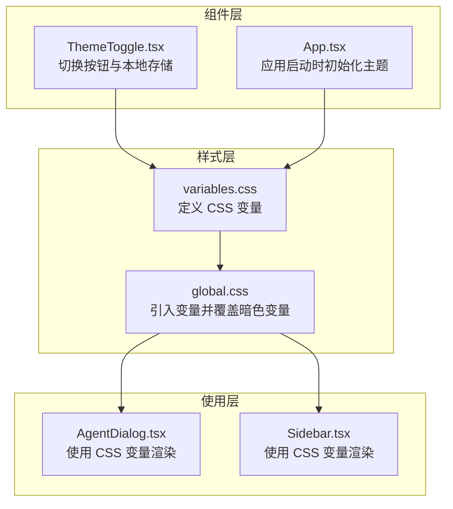
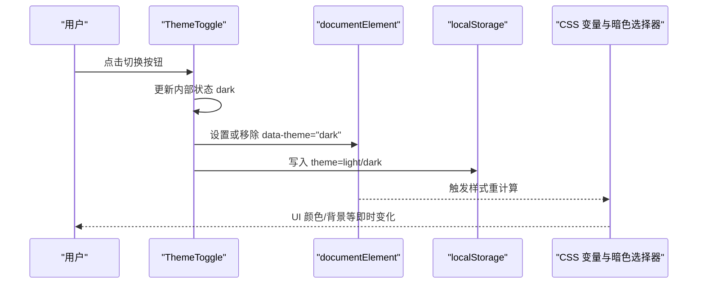
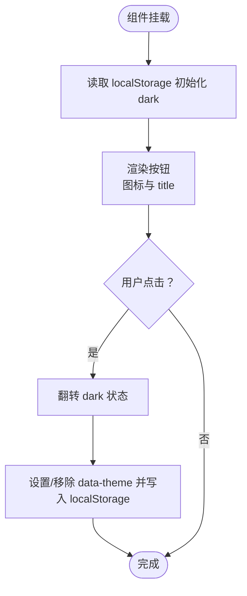
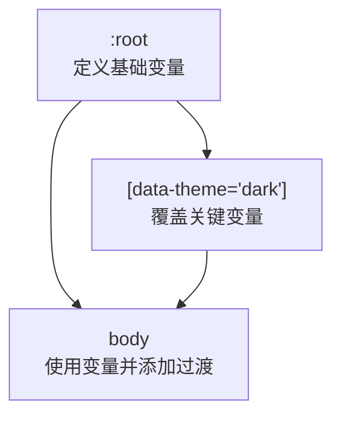
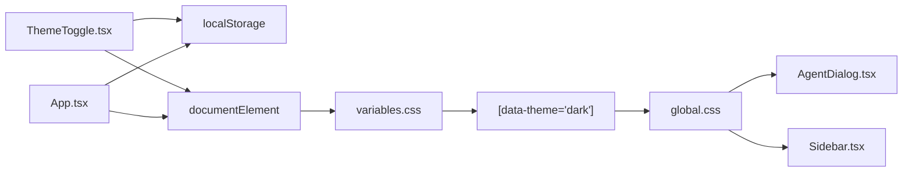

# 主题系统

<cite>
**本文引用的文件**
- [ThemeToggle.tsx](file://client/src/components/ThemeToggle.tsx)
- [variables.css](file://client/src/styles/variables.css)
- [global.css](file://client/src/styles/global.css)
- [App.tsx](file://client/src/components/App.tsx)
- [AgentDialog.tsx](file://client/src/components/AgentDialog.tsx)
- [Sidebar.tsx](file://client/src/components/Sidebar.tsx)
- [useSettingsStore.ts](file://client/src/hooks/useSettingsStore.ts)
</cite>

## 目录
1. [简介](#简介)
2. [项目结构](#项目结构)
3. [核心组件](#核心组件)
4. [架构总览](#架构总览)
5. [详细组件分析](#详细组件分析)
6. [依赖关系分析](#依赖关系分析)
7. [性能考量](#性能考量)
8. [故障排查指南](#故障排查指南)
9. [结论](#结论)
10. [附录](#附录)

## 简介
本主题系统采用“CSS 变量 + data-theme 属性”的轻量级实现，通过在根元素上切换 data-theme="dark" 来驱动全局样式切换，并结合本地存储实现主题状态持久化。系统提供一个可复用的 ThemeToggle 组件用于用户交互，同时大量组件通过 CSS 变量统一消费主题值，确保明/暗两套配色与间距体系的一致性。

## 项目结构
主题系统涉及以下关键文件：
- 样式层：variables.css 定义 CSS 变量；global.css 引入变量并在暗色选择器中覆盖关键变量。
- 组件层：ThemeToggle.tsx 实现切换按钮与状态持久化；App.tsx 在应用启动时读取本地存储并初始化主题。
- 使用层：多数组件（如 AgentDialog、Sidebar 等）直接使用 CSS 变量进行渲染，无需感知当前主题。

图表来源
- [variables.css:1-31](file://client/src/styles/variables.css#L1-L31)
- [global.css:1-300](file://client/src/styles/global.css#L1-L300)
- [ThemeToggle.tsx:1-39](file://client/src/components/ThemeToggle.tsx#L1-L39)
- [App.tsx:131-136](file://client/src/components/App.tsx#L131-L136)
- [AgentDialog.tsx:1050-1070](file://client/src/components/AgentDialog.tsx#L1050-L1070)
- [Sidebar.tsx:1-200](file://client/src/components/Sidebar.tsx#L1-L200)

章节来源
- [variables.css:1-31](file://client/src/styles/variables.css#L1-L31)
- [global.css:1-300](file://client/src/styles/global.css#L1-L300)
- [ThemeToggle.tsx:1-39](file://client/src/components/ThemeToggle.tsx#L1-L39)
- [App.tsx:131-136](file://client/src/components/App.tsx#L131-L136)
- [AgentDialog.tsx:1050-1070](file://client/src/components/AgentDialog.tsx#L1050-L1070)
- [Sidebar.tsx:1-200](file://client/src/components/Sidebar.tsx#L1-L200)

## 核心组件
- ThemeToggle 组件
  - 功能：切换明/暗主题，更新根元素 data-theme 属性，并持久化到本地存储。
  - 交互：点击按钮翻转 dark 状态；根据当前状态显示太阳/月亮图标；title 文案提示切换目标。
  - 状态：内部使用 useState 管理 dark 状态；useEffect 将状态同步到 documentElement 和 localStorage。
  - 依赖：依赖 CSS 变量与暗色选择器，无需额外 props。

- App 启动初始化
  - 功能：应用挂载时从 localStorage 读取主题偏好，若为 dark 则在根元素设置 data-theme="dark"。
  - 位置：在 App.tsx 的 useEffect 中执行，保证首屏即正确主题。

章节来源
- [ThemeToggle.tsx:4-38](file://client/src/components/ThemeToggle.tsx#L4-L38)
- [App.tsx:131-136](file://client/src/components/App.tsx#L131-L136)

## 架构总览
主题切换的关键流程如下：

图表来源
- [ThemeToggle.tsx:9-17](file://client/src/components/ThemeToggle.tsx#L9-L17)
- [variables.css:21-30](file://client/src/styles/variables.css#L21-L30)
- [global.css:24-30](file://client/src/styles/global.css#L24-L30)

## 详细组件分析

### ThemeToggle 组件 API 与实现
- 组件名称：ThemeToggle
- 输入属性（Props）
  - 无外部 props，内部通过 useState 管理状态。
- 事件处理
  - onClick：切换 dark 状态。
- 状态管理
  - 初始值：从 localStorage 读取 theme，若为 "dark" 则初始为深色。
  - 更新策略：useEffect 在 dark 变化时同步到 documentElement 和 localStorage。
- 样式与交互
  - 使用 CSS 变量控制颜色、边框、背景、透明度等。
  - 图标随主题切换而变化，title 文案提示切换目标。

图表来源
- [ThemeToggle.tsx:5-17](file://client/src/components/ThemeToggle.tsx#L5-L17)

章节来源
- [ThemeToggle.tsx:1-39](file://client/src/components/ThemeToggle.tsx#L1-L39)

### 样式变量与暗色覆盖
- 变量定义
  - 在 :root 中定义基础变量，如颜色主色、背景、表面、文本、边框、遮罩、成功/错误色、卡片背景及多种间距。
- 暗色覆盖
  - 在 [data-theme="dark"] 选择器中对关键变量进行覆盖，形成暗色主题。
- 全局过渡
  - body 对背景与文本颜色的过渡动画，提升切换体验。

图表来源
- [variables.css:1-31](file://client/src/styles/variables.css#L1-L31)
- [global.css:24-30](file://client/src/styles/global.css#L24-L30)

章节来源
- [variables.css:1-31](file://client/src/styles/variables.css#L1-L31)
- [global.css:1-300](file://client/src/styles/global.css#L1-L300)

### 组件中使用主题变量
- 大量组件通过内联样式直接使用 var(--color-*) 与 var(--spacing-*)，例如：
  - 背景：var(--color-bg)
  - 文本：var(--color-text)
  - 边框：var(--color-border)
  - 表面：var(--color-surface)
  - 悬停态：var(--color-surface-hover)
  - 占位符：var(--color-text-secondary)
  - 滚动条：var(--color-surface)、var(--color-border)、var(--color-text-secondary)
- 示例文件片段路径：
  - [AgentDialog 背景与边框使用变量:1058-1061](file://client/src/components/AgentDialog.tsx#L1058-L1061)
  - [AgentDialog 文本与占位符使用变量:1082-1144](file://client/src/components/AgentDialog.tsx#L1082-L1144)
  - [Sidebar 使用变量渲染:1-200](file://client/src/components/Sidebar.tsx#L1-L200)

章节来源
- [AgentDialog.tsx:1050-1070](file://client/src/components/AgentDialog.tsx#L1050-L1070)
- [AgentDialog.tsx:1080-1150](file://client/src/components/AgentDialog.tsx#L1080-L1150)
- [Sidebar.tsx:1-200](file://client/src/components/Sidebar.tsx#L1-L200)

### 应用启动时的主题初始化
- App.tsx 在首次挂载时检查 localStorage 中的 theme 偏好，若为 "dark" 则在根元素设置 data-theme="dark"，确保首屏即正确主题。

章节来源
- [App.tsx:131-136](file://client/src/components/App.tsx#L131-L136)

## 依赖关系分析
- ThemeToggle 依赖：
  - CSS 变量与暗色选择器（variables.css、global.css）
  - 浏览器 localStorage API
- App.tsx 依赖：
  - localStorage 读取与 documentElement 属性设置
- 组件使用依赖：
  - 大量组件通过内联样式消费 CSS 变量，耦合度低，便于维护。

图表来源
- [ThemeToggle.tsx:1-39](file://client/src/components/ThemeToggle.tsx#L1-L39)
- [variables.css:1-31](file://client/src/styles/variables.css#L1-L31)
- [global.css:1-300](file://client/src/styles/global.css#L1-L300)
- [App.tsx:131-136](file://client/src/components/App.tsx#L131-L136)
- [AgentDialog.tsx:1050-1070](file://client/src/components/AgentDialog.tsx#L1050-L1070)
- [Sidebar.tsx:1-200](file://client/src/components/Sidebar.tsx#L1-L200)

章节来源
- [ThemeToggle.tsx:1-39](file://client/src/components/ThemeToggle.tsx#L1-L39)
- [variables.css:1-31](file://client/src/styles/variables.css#L1-L31)
- [global.css:1-300](file://client/src/styles/global.css#L1-L300)
- [App.tsx:131-136](file://client/src/components/App.tsx#L131-L136)
- [AgentDialog.tsx:1050-1070](file://client/src/components/AgentDialog.tsx#L1050-L1070)
- [Sidebar.tsx:1-200](file://client/src/components/Sidebar.tsx#L1-L200)

## 性能考量
- 切换成本低：仅修改根元素的 data-theme 属性与少量 localStorage 写入，不触发全量重排。
- 样式计算高效：CSS 变量与选择器覆盖在浏览器层面快速生效，配合 body 的过渡动画提供顺滑体验。
- 组件渲染：多数组件通过内联样式消费变量，避免额外上下文或 Provider 开销。

## 故障排查指南
- 切换无效
  - 检查 localStorage 中是否存在键 "theme"，值是否为 "light" 或 "dark"。
  - 确认 documentElement 上是否存在 data-theme 属性。
  - 参考路径：[ThemeToggle 写入逻辑:10-16](file://client/src/components/ThemeToggle.tsx#L10-L16)、[App 启动初始化:131-136](file://client/src/components/App.tsx#L131-L136)
- 样式未生效
  - 确认 variables.css 已被 global.css 正确引入。
  - 检查 [data-theme="dark"] 是否覆盖了所需变量。
  - 参考路径：[variables.css:1-31](file://client/src/styles/variables.css#L1-L31)、[global.css:1-300](file://client/src/styles/global.css#L1-L300)
- 组件颜色异常
  - 检查组件内联样式是否使用了正确的 CSS 变量名。
  - 参考路径：[AgentDialog 使用变量示例:1058-1061](file://client/src/components/AgentDialog.tsx#L1058-L1061)

章节来源
- [ThemeToggle.tsx:9-17](file://client/src/components/ThemeToggle.tsx#L9-L17)
- [App.tsx:131-136](file://client/src/components/App.tsx#L131-L136)
- [variables.css:1-31](file://client/src/styles/variables.css#L1-L31)
- [global.css:1-300](file://client/src/styles/global.css#L1-L300)
- [AgentDialog.tsx:1058-1061](file://client/src/components/AgentDialog.tsx#L1058-L1061)

## 结论
该主题系统以极简方式实现了明/暗主题切换：通过 CSS 变量与 data-theme 选择器解耦样式与逻辑，借助 ThemeToggle 与 App 启动初始化完成状态持久化与首屏一致性。组件层广泛使用 CSS 变量，降低耦合并提升可维护性。整体架构清晰、性能友好，易于扩展新主题变体。

## 附录

### 主题变量参考（颜色、字体、间距）
- 颜色变量
  - 主色系列：--color-primary、--color-primary-hover
  - 背景与表面：--color-bg、--color-surface、--color-surface-hover
  - 文本与辅助：--color-text、--color-text-secondary
  - 边框与遮罩：--color-border、--color-overlay
  - 成功/错误：--color-success、--color-error
  - 卡片背景：--card-bg
- 字体与排版
  - body 字体族与行高在 global.css 中定义，建议在新增组件中保持继承一致。
- 间距规范
  - --spacing-xs、--spacing-sm、--spacing-md、--spacing-lg、--spacing-xl

章节来源
- [variables.css:1-31](file://client/src/styles/variables.css#L1-L31)
- [global.css:24-30](file://client/src/styles/global.css#L24-L30)

### 如何在组件中使用主题变量
- 在内联样式中使用 var(--color-*) 与 var(--spacing-*)，确保组件在不同主题下自动适配。
- 示例路径：
  - [AgentDialog 背景/边框/文本使用变量:1058-1061](file://client/src/components/AgentDialog.tsx#L1058-L1061)
  - [AgentDialog 占位符/滚动条使用变量:1082-1144](file://client/src/components/AgentDialog.tsx#L1082-L1144)

章节来源
- [AgentDialog.tsx:1058-1061](file://client/src/components/AgentDialog.tsx#L1058-L1061)
- [AgentDialog.tsx:1082-1144](file://client/src/components/AgentDialog.tsx#L1082-L1144)

### 创建自定义主题
- 新增变量
  - 在 variables.css 的 :root 中添加新变量，如 --color-custom-primary。
- 定义暗色覆盖
  - 在 [data-theme="dark"] 中为新变量提供暗色值。
- 组件使用
  - 在组件内联样式中使用新变量，确保明/暗两套值均存在。
- 参考路径：
  - [variables.css 变量定义与暗色覆盖:1-31](file://client/src/styles/variables.css#L1-L31)

章节来源
- [variables.css:1-31](file://client/src/styles/variables.css#L1-L31)

### 扩展指南：添加新的主题变体
- 方案一：基于现有 data-theme
  - 在 ThemeToggle 中扩展状态与切换逻辑，写入新的主题值到 localStorage。
  - 在 variables.css 中新增 [data-theme="your-theme"] 覆盖块。
  - 在组件中使用对应变量。
- 方案二：引入主题配置中心
  - 使用 Zustand/Pinia 等状态库集中管理主题配置，组件通过订阅状态消费变量。
  - 与现有 localStorage 机制并行，逐步迁移。
- 参考路径：
  - [ThemeToggle 切换与持久化:5-17](file://client/src/components/ThemeToggle.tsx#L5-L17)
  - [variables.css 暗色选择器:21-30](file://client/src/styles/variables.css#L21-L30)
  - [useSettingsStore 本地存储模式参考:54-83](file://client/src/hooks/useSettingsStore.ts#L54-L83)

章节来源
- [ThemeToggle.tsx:5-17](file://client/src/components/ThemeToggle.tsx#L5-L17)
- [variables.css:21-30](file://client/src/styles/variables.css#L21-L30)
- [useSettingsStore.ts:54-83](file://client/src/hooks/useSettingsStore.ts#L54-L83)