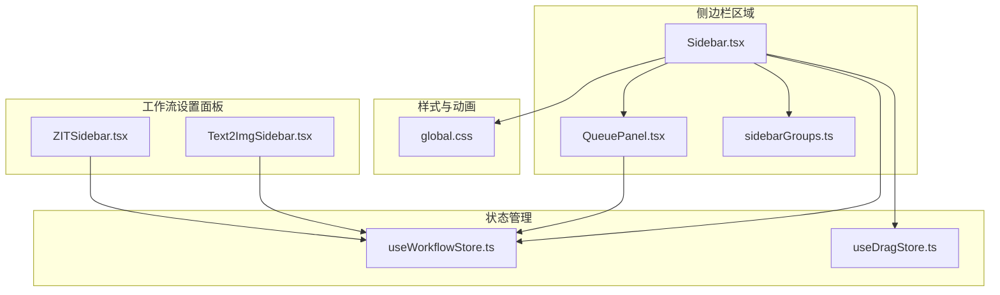
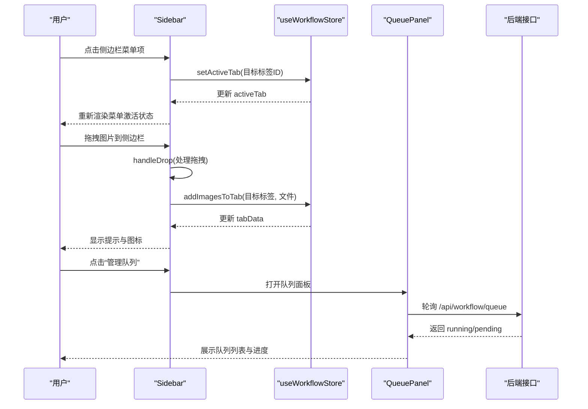
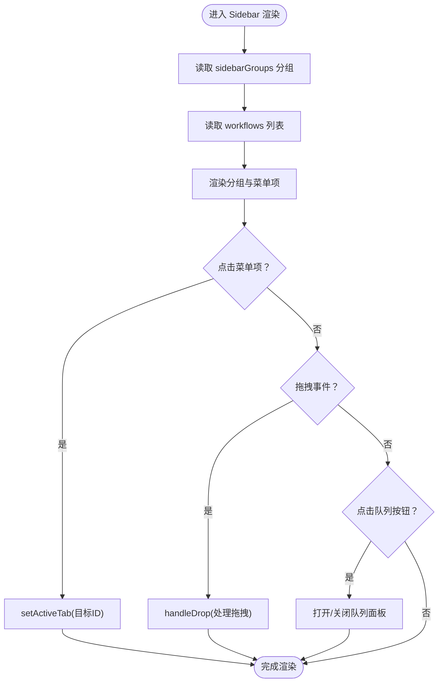
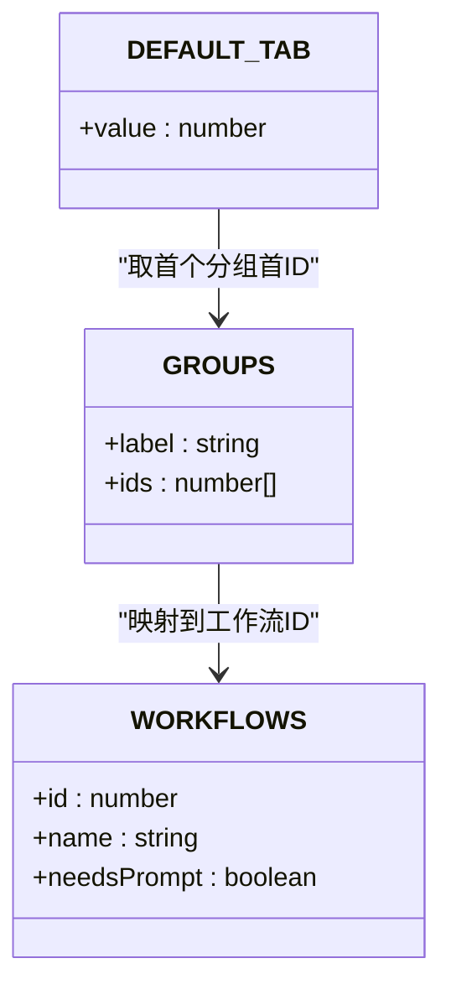
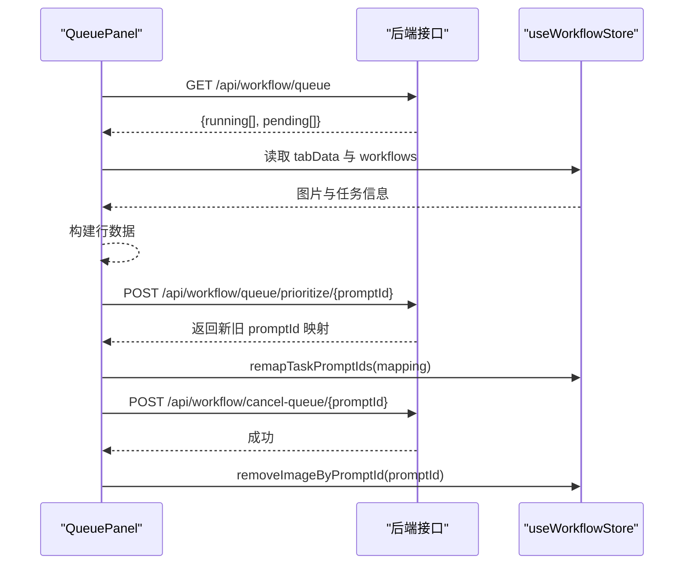
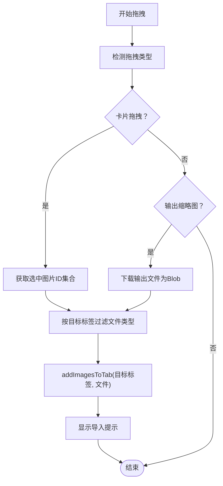
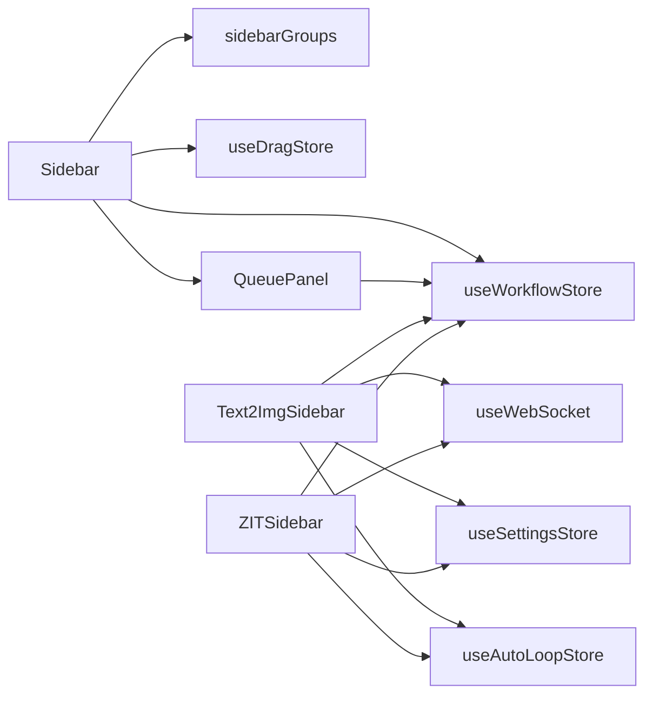

# 侧边栏导航

<cite>
**本文引用的文件**
- [Sidebar.tsx](file://client/src/components/Sidebar.tsx)
- [sidebarGroups.ts](file://client/src/data/sidebarGroups.ts)
- [useWorkflowStore.ts](file://client/src/hooks/useWorkflowStore.ts)
- [QueuePanel.tsx](file://client/src/components/QueuePanel.tsx)
- [useDragStore.ts](file://client/src/hooks/useDragStore.ts)
- [global.css](file://client/src/styles/global.css)
- [Text2ImgSidebar.tsx](file://client/src/components/Text2ImgSidebar.tsx)
- [ZITSidebar.tsx](file://client/src/components/ZITSidebar.tsx)
- [index.ts](file://client/src/types/index.ts)
</cite>

## 目录
1. [简介](#简介)
2. [项目结构](#项目结构)
3. [核心组件](#核心组件)
4. [架构总览](#架构总览)
5. [详细组件分析](#详细组件分析)
6. [依赖关系分析](#依赖关系分析)
7. [性能考量](#性能考量)
8. [故障排查指南](#故障排查指南)
9. [结论](#结论)
10. [附录](#附录)

## 简介
本技术文档围绕侧边栏导航组件进行深入解析，涵盖布局结构、导航逻辑、工作流菜单、设置入口、快捷操作组织方式，以及 Sidebar 组件的 API 接口、菜单项配置、激活状态管理、导航事件处理。同时提供侧边栏数据结构（sidebarGroups.ts）的完整说明、权限控制策略、展开收起动画效果与响应式适配、与主内容区域的交互机制（工作流切换与参数传递）、以及定制化指南（新增导航项与修改菜单结构）。

## 项目结构
侧边栏位于客户端前端目录 client/src/components 下，核心文件包括：
- Sidebar.tsx：侧边栏导航主体，负责菜单渲染、激活指示器、拖拽与队列面板交互
- sidebarGroups.ts：侧边栏菜单分组规则与默认激活标签
- useWorkflowStore.ts：工作流状态与任务管理（激活标签、图片与任务数据）
- QueuePanel.tsx：任务队列面板，支持置顶、取消、定位卡片
- useDragStore.ts：全局拖拽状态（卡片与输出）
- global.css：动画与样式（含侧边栏面板样式与动画）
- Text2ImgSidebar.tsx、ZITSidebar.tsx：对应工作流的设置面板（与侧边栏联动）

图表来源
- [Sidebar.tsx:1-434](file://client/src/components/Sidebar.tsx#L1-L434)
- [sidebarGroups.ts:1-14](file://client/src/data/sidebarGroups.ts#L1-L14)
- [useWorkflowStore.ts:1-923](file://client/src/hooks/useWorkflowStore.ts#L1-L923)
- [QueuePanel.tsx:1-308](file://client/src/components/QueuePanel.tsx#L1-L308)
- [useDragStore.ts:1-17](file://client/src/hooks/useDragStore.ts#L1-L17)
- [global.css:1-300](file://client/src/styles/global.css#L1-L300)
- [Text2ImgSidebar.tsx:1-800](file://client/src/components/Text2ImgSidebar.tsx#L1-L800)
- [ZITSidebar.tsx:1-800](file://client/src/components/ZITSidebar.tsx#L1-L800)

章节来源
- [Sidebar.tsx:1-434](file://client/src/components/Sidebar.tsx#L1-L434)
- [sidebarGroups.ts:1-14](file://client/src/data/sidebarGroups.ts#L1-L14)
- [useWorkflowStore.ts:1-923](file://client/src/hooks/useWorkflowStore.ts#L1-L923)
- [QueuePanel.tsx:1-308](file://client/src/components/QueuePanel.tsx#L1-L308)
- [useDragStore.ts:1-17](file://client/src/hooks/useDragStore.ts#L1-L17)
- [global.css:1-300](file://client/src/styles/global.css#L1-L300)
- [Text2ImgSidebar.tsx:1-800](file://client/src/components/Text2ImgSidebar.tsx#L1-L800)
- [ZITSidebar.tsx:1-800](file://client/src/components/ZITSidebar.tsx#L1-L800)

## 核心组件
- Sidebar：渲染侧边导航菜单、管理激活状态、处理拖拽与队列面板交互、显示任务处理中的指示器
- sidebarGroups：定义菜单分组与默认激活标签，避免循环依赖
- useWorkflowStore：集中管理工作流状态、图片与任务数据、任务生命周期、会话恢复
- QueuePanel：任务队列管理，支持置顶、取消、定位卡片
- useDragStore：统一管理拖拽状态（卡片与输出）
- Text2ImgSidebar/ZITSidebar：对应工作流的设置面板，与侧边栏联动（配置应用、生成触发）

章节来源
- [Sidebar.tsx:26-434](file://client/src/components/Sidebar.tsx#L26-L434)
- [sidebarGroups.ts:4-14](file://client/src/data/sidebarGroups.ts#L4-L14)
- [useWorkflowStore.ts:101-183](file://client/src/hooks/useWorkflowStore.ts#L101-L183)
- [QueuePanel.tsx:26-308](file://client/src/components/QueuePanel.tsx#L26-L308)
- [useDragStore.ts:4-16](file://client/src/hooks/useDragStore.ts#L4-L16)
- [Text2ImgSidebar.tsx:161-754](file://client/src/components/Text2ImgSidebar.tsx#L161-L754)
- [ZITSidebar.tsx:66-419](file://client/src/components/ZITSidebar.tsx#L66-L419)

## 架构总览
侧边栏通过 useWorkflowStore 获取当前激活标签与工作流列表，并结合 sidebarGroups 进行分组渲染。点击菜单项触发 setActiveTab 更新激活状态，同时根据 needsPrompt 控制是否需要提示词。Sidebar 使用原生 dragover 事件绑定保证拖拽体验稳定，并通过 QueuePanel 实现任务队列的可视化管理。

图表来源
- [Sidebar.tsx:26-434](file://client/src/components/Sidebar.tsx#L26-L434)
- [useWorkflowStore.ts:191-215](file://client/src/hooks/useWorkflowStore.ts#L191-L215)
- [QueuePanel.tsx:38-88](file://client/src/components/QueuePanel.tsx#L38-L88)

## 详细组件分析

### Sidebar 组件分析
- 渲染逻辑：基于 sidebarGroups 的分组与 workflows 列表渲染菜单项，每个菜单项对应一个工作流标签 ID
- 激活状态：通过 activeTab 与按钮的 isActive 标记实现视觉激活
- 拖拽支持：原生 dragover 监听确保拖拽事件不被 React 合成事件丢失；handleDrop 支持从其他面板拖入图片或输出缩略图
- 队列面板：底部“管理队列”按钮，点击打开/关闭队列面板，支持置顶、取消、定位卡片
- 指示器动画：根据按钮位置计算浮动指示器 top 与 height，使用过渡动画平滑移动

图表来源
- [Sidebar.tsx:26-434](file://client/src/components/Sidebar.tsx#L26-L434)
- [sidebarGroups.ts:4-14](file://client/src/data/sidebarGroups.ts#L4-L14)
- [useWorkflowStore.ts:191-215](file://client/src/hooks/useWorkflowStore.ts#L191-L215)

章节来源
- [Sidebar.tsx:26-434](file://client/src/components/Sidebar.tsx#L26-L434)
- [sidebarGroups.ts:4-14](file://client/src/data/sidebarGroups.ts#L4-L14)
- [useWorkflowStore.ts:191-215](file://client/src/hooks/useWorkflowStore.ts#L191-L215)

### 侧边栏数据结构与分组规则
- 分组定义：GROUPS 数组包含多个分组对象，每组包含 label 与 ids（工作流标签 ID 数组）
- 默认激活：DEFAULT_TAB 为第一个可见标签 ID，用于初始化 activeTab
- 权限控制：WORKFLOWS 中的 needsPrompt 字段决定工作流是否需要提示词；Sidebar 通过 needsPrompt 控制交互行为

图表来源
- [sidebarGroups.ts:4-14](file://client/src/data/sidebarGroups.ts#L4-L14)
- [useWorkflowStore.ts:71-83](file://client/src/hooks/useWorkflowStore.ts#L71-L83)

章节来源
- [sidebarGroups.ts:4-14](file://client/src/data/sidebarGroups.ts#L4-L14)
- [useWorkflowStore.ts:71-83](file://client/src/hooks/useWorkflowStore.ts#L71-L83)

### 队列面板交互机制
- 轮询：每 2 秒轮询 /api/workflow/queue 获取 running 与 pending 列表
- 行渲染：根据 tabData 与 workflows 映射出 promptId 对应的图片、工作流名称与进度
- 操作：置顶（prioritize）、取消（cancel-queue）、定位卡片（setActiveTab + setFlashingImage）

图表来源
- [QueuePanel.tsx:38-135](file://client/src/components/QueuePanel.tsx#L38-L135)
- [useWorkflowStore.ts:601-702](file://client/src/hooks/useWorkflowStore.ts#L601-L702)

章节来源
- [QueuePanel.tsx:38-135](file://client/src/components/QueuePanel.tsx#L38-L135)
- [useWorkflowStore.ts:601-702](file://client/src/hooks/useWorkflowStore.ts#L601-L702)

### 拖拽与跨标签数据传递
- 拖拽监听：Sidebar 使用原生元素监听 dragover，确保拖拽事件可靠
- 拖拽处理：handleDrop 支持从其他面板拖入图片或输出缩略图，过滤目标标签类型（如文本生成类标签不接受图片）
- 状态管理：useDragStore 统一管理拖拽状态，Sidebar 通过 buttonRefs 与 indicatorStyle 计算激活指示器位置

图表来源
- [Sidebar.tsx:120-218](file://client/src/components/Sidebar.tsx#L120-L218)
- [useWorkflowStore.ts:362-390](file://client/src/hooks/useWorkflowStore.ts#L362-L390)
- [useDragStore.ts:4-16](file://client/src/hooks/useDragStore.ts#L4-L16)

章节来源
- [Sidebar.tsx:120-218](file://client/src/components/Sidebar.tsx#L120-L218)
- [useWorkflowStore.ts:362-390](file://client/src/hooks/useWorkflowStore.ts#L362-L390)
- [useDragStore.ts:4-16](file://client/src/hooks/useDragStore.ts#L4-L16)

### 动画与响应式适配
- 指示器动画：根据按钮位置计算 top 与 height，使用贝塞尔曲线过渡，实现平滑移动
- 队列面板动画：panel-enter-up / panel-exit-up，从底部向上弹出/收起
- 拖拽覆盖层：拖拽进入时显示覆盖层，离开时隐藏
- 响应式：侧边栏固定宽度与弹性布局，配合滚动条与溢出隐藏

章节来源
- [Sidebar.tsx:80-92](file://client/src/components/Sidebar.tsx#L80-L92)
- [global.css:168-179](file://client/src/styles/global.css#L168-L179)
- [global.css:268-277](file://client/src/styles/global.css#L268-L277)

### 与主内容区域的交互机制
- 工作流切换：点击菜单项触发 setActiveTab，Sidebar 与主内容区域（对应工作流设置面板）联动
- 参数传递：Text2ImgSidebar/ZITSidebar 通过 applyConfigToSidebar 将卡片配置应用到对应设置面板
- 任务生命周期：startTask/markTaskStarted/updateProgress/completeTask/failTask/resetTask/removeImageByPromptId 等方法贯穿任务全生命周期

章节来源
- [useWorkflowStore.ts:191-215](file://client/src/hooks/useWorkflowStore.ts#L191-L215)
- [Text2ImgSidebar.tsx:496-561](file://client/src/components/Text2ImgSidebar.tsx#L496-L561)
- [ZITSidebar.tsx:272-307](file://client/src/components/ZITSidebar.tsx#L272-L307)
- [useWorkflowStore.ts:560-702](file://client/src/hooks/useWorkflowStore.ts#L560-L702)

## 依赖关系分析
- Sidebar 依赖：
  - useWorkflowStore：获取 workflows、activeTab、tabData、addImagesToTab、setActiveTab
  - sidebarGroups：分组与默认标签
  - useDragStore：拖拽状态
  - QueuePanel：队列面板
- QueuePanel 依赖：
  - useWorkflowStore：读取 tabData、workflows、sessionId、setActiveTab、setFlashingImage、remapTaskPromptIds、removeImageByPromptId
  - useWebSocket：注册 promptId
- Text2ImgSidebar/ZITSidebar 依赖：
  - useWorkflowStore：startTask、addText2ImgCard/addZitCard、applyConfigToSidebar、setFlashingImage
  - useWebSocket：注册 promptId
  - useSettingsStore/useAutoLoopStore：任务执行模式与循环控制

图表来源
- [Sidebar.tsx:1-11](file://client/src/components/Sidebar.tsx#L1-L11)
- [useWorkflowStore.ts:1-5](file://client/src/hooks/useWorkflowStore.ts#L1-L5)
- [QueuePanel.tsx:1-6](file://client/src/components/QueuePanel.tsx#L1-L6)
- [Text2ImgSidebar.tsx:1-15](file://client/src/components/Text2ImgSidebar.tsx#L1-L15)
- [ZITSidebar.tsx:1-8](file://client/src/components/ZITSidebar.tsx#L1-L8)

章节来源
- [Sidebar.tsx:1-11](file://client/src/components/Sidebar.tsx#L1-L11)
- [useWorkflowStore.ts:1-5](file://client/src/hooks/useWorkflowStore.ts#L1-L5)
- [QueuePanel.tsx:1-6](file://client/src/components/QueuePanel.tsx#L1-L6)
- [Text2ImgSidebar.tsx:1-15](file://client/src/components/Text2ImgSidebar.tsx#L1-L15)
- [ZITSidebar.tsx:1-8](file://client/src/components/ZITSidebar.tsx#L1-L8)

## 性能考量
- 拖拽事件：使用原生 dragover 监听避免 React 合成事件丢失，提升拖拽稳定性
- 轮询频率：队列面板每 2 秒轮询一次，平衡实时性与性能
- 动画：指示器与面板动画采用 CSS 过渡与关键帧，尽量使用 GPU 加速属性（opacity、transform）
- 状态更新：useWorkflowStore 使用 zustand，局部状态更新减少不必要的重渲染

## 故障排查指南
- 拖拽无效：检查原生 dragover 监听是否绑定到 asideRef；确认拖拽类型是否正确（application/x-workflow-image 或 application/x-thumb-output）
- 队列面板不刷新：确认 /api/workflow/queue 是否可达；检查轮询定时器是否正常运行
- 激活指示器不移动：确认 buttonRefs 与 indicatorStyle 的计算逻辑；检查 navRef 与按钮的可见性
- 卡片配置未应用：确认 applyConfigToSidebar 的字段增量更新逻辑；检查 pendingApplyConfig 的清理

章节来源
- [Sidebar.tsx:48-61](file://client/src/components/Sidebar.tsx#L48-L61)
- [QueuePanel.tsx:84-88](file://client/src/components/QueuePanel.tsx#L84-L88)
- [Sidebar.tsx:80-92](file://client/src/components/Sidebar.tsx#L80-L92)
- [Text2ImgSidebar.tsx:496-561](file://client/src/components/Text2ImgSidebar.tsx#L496-L561)

## 结论
侧边栏导航组件通过清晰的数据结构（sidebarGroups）与状态管理（useWorkflowStore）实现了稳定的菜单渲染与激活状态管理；结合拖拽与队列面板，提供了高效的工作流切换与任务管理能力。动画与样式设计提升了用户体验，而与设置面板的联动确保了参数传递与工作流执行的连贯性。遵循本文提供的定制化指南，可安全地扩展新的导航项与修改菜单结构。

## 附录

### Sidebar 组件 API 接口
- 外部依赖
  - useWorkflowStore：activeTab、workflows、setActiveTab、tabData、addImagesToTab
  - useDragStore：dragging
  - GROUPS：菜单分组
- 内部方法
  - openQueue/closeQueue：打开/关闭队列面板
  - handleDrop：处理拖拽事件
  - indicatorStyle 计算：根据按钮位置计算浮动指示器 top 与 height
- 事件处理
  - 点击菜单项：setActiveTab
  - 拖拽进入/离开：更新 dragOverTab 与按钮样式
  - 点击队列按钮：切换 isQueueOpen

章节来源
- [Sidebar.tsx:26-434](file://client/src/components/Sidebar.tsx#L26-L434)
- [useWorkflowStore.ts:191-215](file://client/src/hooks/useWorkflowStore.ts#L191-L215)
- [useDragStore.ts:4-16](file://client/src/hooks/useDragStore.ts#L4-L16)
- [sidebarGroups.ts:4-14](file://client/src/data/sidebarGroups.ts#L4-L14)

### 侧边栏数据结构与权限控制
- GROUPS：分组与标签 ID 映射
- DEFAULT_TAB：默认激活标签
- WORKFLOWS：工作流列表，包含 needsPrompt 字段
- 权限控制：needsPrompt 决定是否需要提示词，影响交互与生成流程

章节来源
- [sidebarGroups.ts:4-14](file://client/src/data/sidebarGroups.ts#L4-L14)
- [useWorkflowStore.ts:71-83](file://client/src/hooks/useWorkflowStore.ts#L71-L83)

### 定制化指南
- 新增导航项
  - 在 WORKFLOWS 中添加新的工作流项（id、name、needsPrompt）
  - 在 sidebarGroups 的对应分组 ids 中添加新 ID
  - 如需图标，可在 WORKFLOW_ICONS 中添加对应图标组件
- 修改菜单结构
  - 调整 GROUPS 的分组顺序与 ids
  - 如需默认激活标签变化，更新 DEFAULT_TAB
- 权限控制
  - 根据 needsPrompt 字段调整交互逻辑（如提示词输入）
- 与设置面板联动
  - 确保设置面板（Text2ImgSidebar/ZITSidebar）与工作流 ID 对应
  - 使用 applyConfigToSidebar 与 addText2ImgCard/addZitCard 完成参数传递与卡片创建

章节来源
- [useWorkflowStore.ts:71-83](file://client/src/hooks/useWorkflowStore.ts#L71-L83)
- [sidebarGroups.ts:4-14](file://client/src/data/sidebarGroups.ts#L4-L14)
- [Text2ImgSidebar.tsx:496-561](file://client/src/components/Text2ImgSidebar.tsx#L496-L561)
- [ZITSidebar.tsx:272-307](file://client/src/components/ZITSidebar.tsx#L272-L307)