# 图像展示组件

<cite>
**本文档引用的文件**
- [ImageCard.tsx](file://client/src/components/ImageCard.tsx)
- [PhotoWall.tsx](file://client/src/components/PhotoWall.tsx)
- [FaceSwapPhotoWall.tsx](file://client/src/components/FaceSwapPhotoWall.tsx)
- [ThumbnailStrip.tsx](file://client/src/components/ThumbnailStrip.tsx)
- [index.ts](file://client/src/types/index.ts)
- [maskConfig.ts](file://client/src/config/maskConfig.ts)
- [global.css](file://client/src/styles/global.css)
- [useFavoriteFaces.ts](file://client/src/hooks/useFavoriteFaces.ts)
- [useImageImporter.ts](file://client/src/hooks/useImageImporter.ts)
- [PromptContextMenu.tsx](file://client/src/components/PromptContextMenu.tsx)
</cite>

## 目录
1. [简介](#简介)
2. [项目结构](#项目结构)
3. [核心组件](#核心组件)
4. [架构概览](#架构概览)
5. [详细组件分析](#详细组件分析)
6. [依赖关系分析](#依赖关系分析)
7. [性能考虑](#性能考虑)
8. [故障排除指南](#故障排除指南)
9. [结论](#结论)
10. [附录](#附录)

## 简介

图像展示组件是 CorineKit Pix2Real 项目中的核心 UI 组件，负责处理和展示图像数据。该组件系统提供了完整的图像管理功能，包括图像预览、缩略图生成、批量操作、换脸功能等。系统采用 React + TypeScript 构建，结合 Zustand 状态管理，实现了高性能的图像处理和展示体验。

## 项目结构

图像展示组件主要位于客户端的 `client/src/components` 目录下，包含以下关键文件：

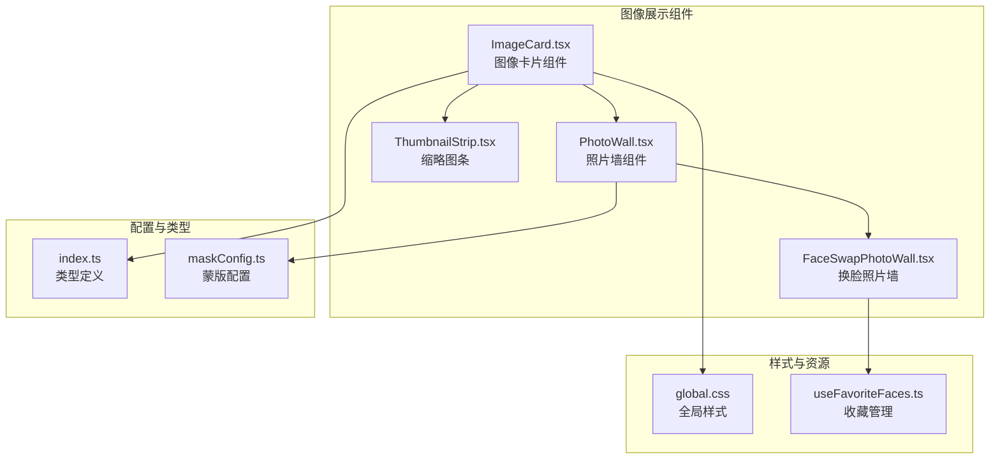

**图表来源**
- [ImageCard.tsx:1-1715](file://client/src/components/ImageCard.tsx#L1-L1715)
- [PhotoWall.tsx:1-781](file://client/src/components/PhotoWall.tsx#L1-L781)
- [FaceSwapPhotoWall.tsx:1-1157](file://client/src/components/FaceSwapPhotoWall.tsx#L1-L1157)

**章节来源**
- [ImageCard.tsx:1-100](file://client/src/components/ImageCard.tsx#L1-L100)
- [PhotoWall.tsx:1-100](file://client/src/components/PhotoWall.tsx#L1-L100)
- [FaceSwapPhotoWall.tsx:1-100](file://client/src/components/FaceSwapPhotoWall.tsx#L1-L100)

## 核心组件

### ImageCard 组件

ImageCard 是图像展示系统的核心组件，提供了完整的图像管理和交互功能：

#### 主要特性
- **图像预览**: 支持静态图片和视频预览
- **缩略图生成**: 自动为视频文件生成缩略图
- **多工作流支持**: 集成多种 AI 工作流程
- **拖拽操作**: 支持卡片拖拽和外部文件导出
- **右键菜单**: 提供丰富的上下文操作

#### 关键属性配置
- `image`: ImageItem 类型，包含图像的完整信息
- `isMultiSelectMode`: 多选模式开关
- `isSelected`: 选中状态
- `isFlashing`: 高亮闪烁效果
- `hidePlayButton`: 隐藏播放按钮
- `onLongPress`: 长按回调函数
- `onToggleSelect`: 选择切换回调

#### 状态管理
组件通过 Zustand 状态管理器订阅多个状态：
- **动作状态**: 工作流操作方法
- **全局状态**: 客户端 ID、会话 ID、活动标签页
- **卡片特定状态**: 任务状态、提示词、输出索引

**章节来源**
- [ImageCard.tsx:23-50](file://client/src/components/ImageCard.tsx#L23-L50)
- [ImageCard.tsx:51-120](file://client/src/components/ImageCard.tsx#L51-L120)

### PhotoWall 组件

PhotoWall 提供了响应式的网格布局，支持大量图像的高效展示：

#### 核心功能
- **响应式网格**: 自适应不同屏幕尺寸
- **懒加载机制**: 使用 IntersectionObserver 实现虚拟滚动
- **批量操作**: 支持多选和批量处理
- **拖拽删除**: 底部拖拽区域实现快速删除

#### 视图配置
组件支持三种视图大小：
- **small**: 180px 宽度，320px 预估高度
- **medium**: 280px 宽度，450px 预估高度  
- **large**: 600px 宽度，600px 预估高度

**章节来源**
- [PhotoWall.tsx:15-20](file://client/src/components/PhotoWall.tsx#L15-L20)
- [PhotoWall.tsx:21-97](file://client/src/components/PhotoWall.tsx#L21-L97)

### FaceSwapPhotoWall 组件

FaceSwapPhotoWall 专为换脸功能设计的特殊布局组件：

#### 特殊功能
- **双区域布局**: 左侧脸部参考区，右侧目标图区
- **智能拖拽**: 支持跨区域拖拽换脸
- **收藏管理**: 集成面部收藏功能
- **批量操作**: 支持多目标批量换脸

#### 布局特点
- **动态宽度**: 脸部参考区占 10-20% 宽度
- **独立滚动**: 两个区域独立滚动
- **视觉反馈**: 拖拽时的高亮提示

**章节来源**
- [FaceSwapPhotoWall.tsx:18-24](file://client/src/components/FaceSwapPhotoWall.tsx#L18-L24)
- [FaceSwapPhotoWall.tsx:246-320](file://client/src/components/FaceSwapPhotoWall.tsx#L246-L320)

## 架构概览

图像展示系统的整体架构采用分层设计，确保组件间的解耦和可维护性：

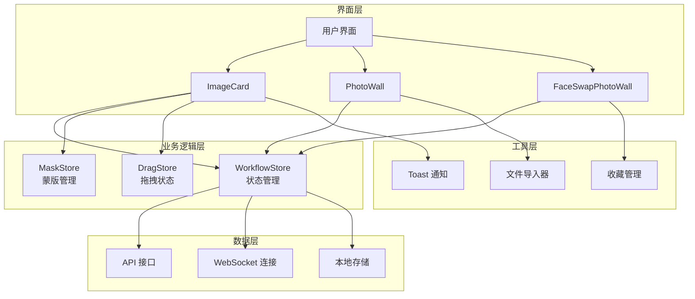

**图表来源**
- [ImageCard.tsx:55-100](file://client/src/components/ImageCard.tsx#L55-L100)
- [PhotoWall.tsx:103-126](file://client/src/components/PhotoWall.tsx#L103-L126)
- [FaceSwapPhotoWall.tsx:246-263](file://client/src/components/FaceSwapPhotoWall.tsx#L246-L263)

## 详细组件分析

### ImageCard 组件深度分析

#### 数据结构设计

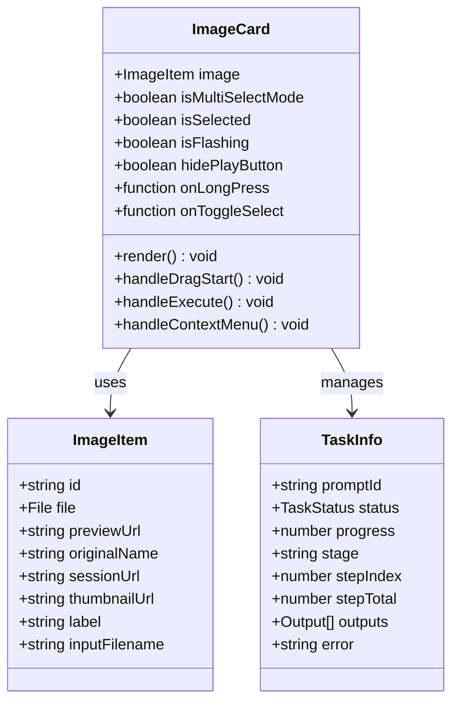

**图表来源**
- [index.ts:1-14](file://client/src/types/index.ts#L1-L14)
- [index.ts:25-37](file://client/src/types/index.ts#L25-L37)
- [ImageCard.tsx:23-31](file://client/src/components/ImageCard.tsx#L23-L31)

#### 图像预览机制

ImageCard 实现了智能的图像预览策略，根据不同工作流类型选择最优的显示方式：

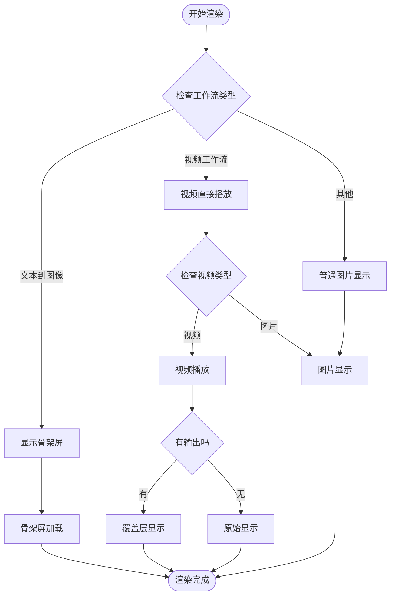

**图表来源**
- [ImageCard.tsx:658-750](file://client/src/components/ImageCard.tsx#L658-L750)
- [ImageCard.tsx:751-772](file://client/src/components/ImageCard.tsx#L751-L772)

#### 右键菜单系统

ImageCard 集成了完整的右键菜单功能，提供丰富的上下文操作：

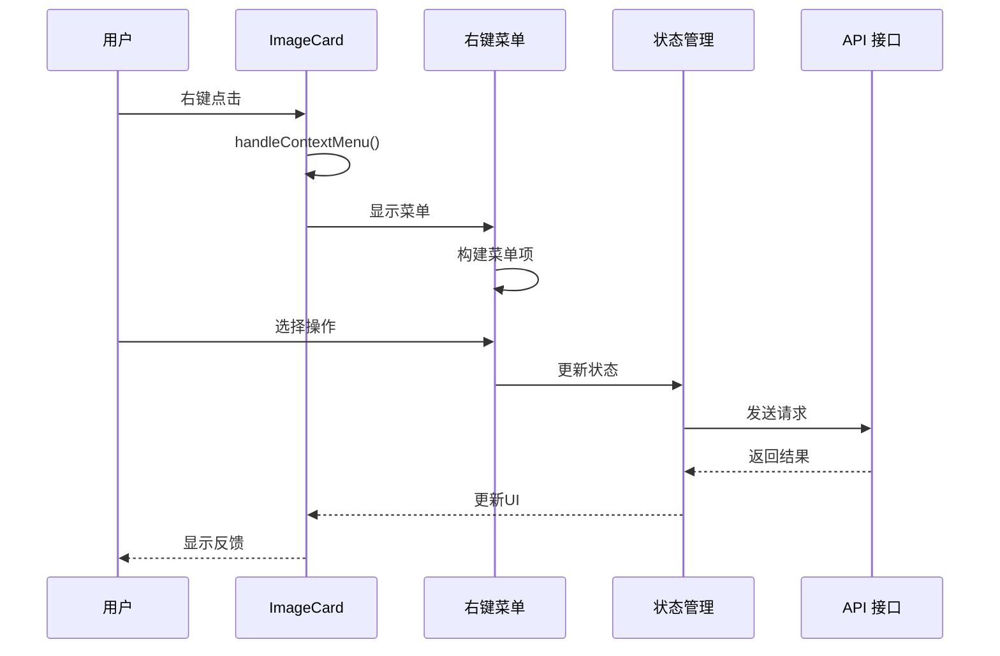

**图表来源**
- [ImageCard.tsx:577-581](file://client/src/components/ImageCard.tsx#L577-L581)
- [ImageCard.tsx:583-599](file://client/src/components/ImageCard.tsx#L583-L599)

**章节来源**
- [ImageCard.tsx:601-800](file://client/src/components/ImageCard.tsx#L601-L800)
- [ImageCard.tsx:800-1715](file://client/src/components/ImageCard.tsx#L800-L1715)

### PhotoWall 组件详细分析

#### 懒加载实现

PhotoWall 使用 IntersectionObserver 实现高效的懒加载机制：

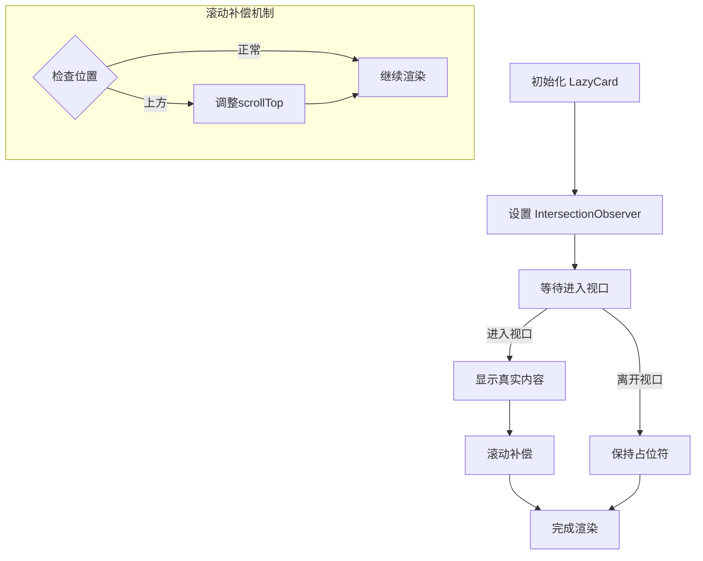

**图表来源**
- [PhotoWall.tsx:21-74](file://client/src/components/PhotoWall.tsx#L21-L74)

#### 批量操作功能

PhotoWall 提供了完整的批量操作能力：

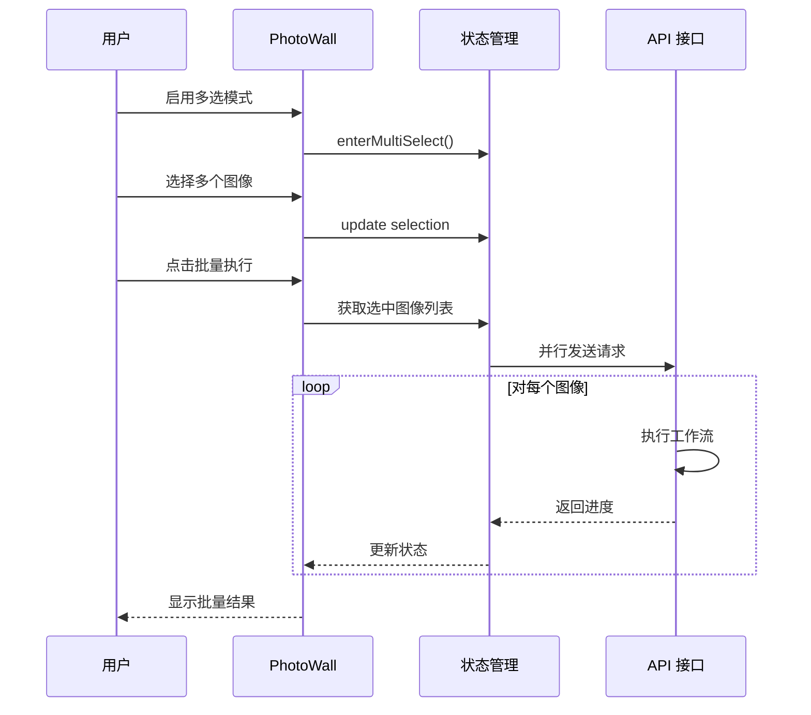

**图表来源**
- [PhotoWall.tsx:201-295](file://client/src/components/PhotoWall.tsx#L201-L295)

**章节来源**
- [PhotoWall.tsx:103-781](file://client/src/components/PhotoWall.tsx#L103-L781)

### FaceSwapPhotoWall 组件分析

#### 换脸工作流程

FaceSwapPhotoWall 实现了复杂的换脸交互逻辑：

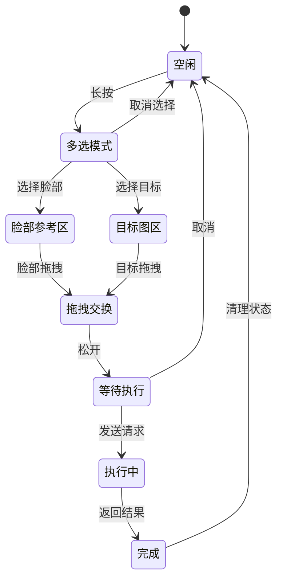

**图表来源**
- [FaceSwapPhotoWall.tsx:448-633](file://client/src/components/FaceSwapPhotoWall.tsx#L448-L633)

#### 收藏管理集成

组件集成了完整的收藏管理系统：

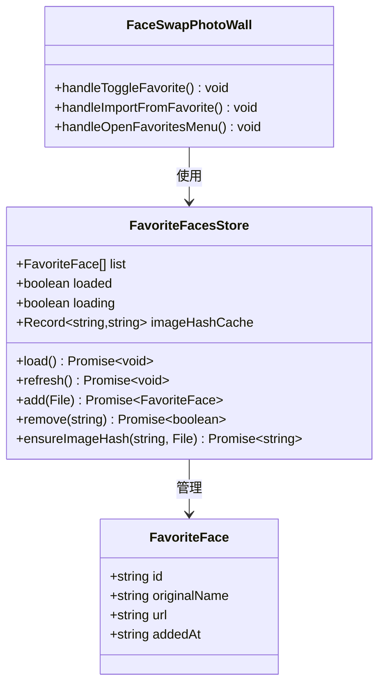

**图表来源**
- [useFavoriteFaces.ts:10-25](file://client/src/hooks/useFavoriteFaces.ts#L10-L25)
- [FaceSwapPhotoWall.tsx:330-352](file://client/src/components/FaceSwapPhotoWall.tsx#L330-L352)

**章节来源**
- [FaceSwapPhotoWall.tsx:246-1157](file://client/src/components/FaceSwapPhotoWall.tsx#L246-L1157)

## 依赖关系分析

图像展示组件之间的依赖关系体现了清晰的分层架构：

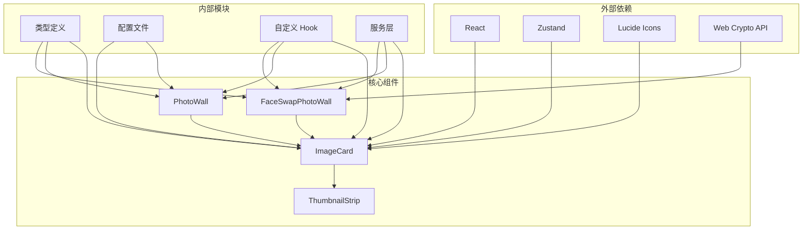

**图表来源**
- [ImageCard.tsx:1-22](file://client/src/components/ImageCard.tsx#L1-L22)
- [PhotoWall.tsx:1-12](file://client/src/components/PhotoWall.tsx#L1-L12)
- [FaceSwapPhotoWall.tsx:1-12](file://client/src/components/FaceSwapPhotoWall.tsx#L1-L12)

**章节来源**
- [index.ts:1-76](file://client/src/types/index.ts#L1-L76)
- [maskConfig.ts:1-21](file://client/src/config/maskConfig.ts#L1-L21)

## 性能考虑

### 懒加载优化

图像展示系统采用了多层次的性能优化策略：

#### IntersectionObserver 懒加载
- **异步根边距**: 上方 200px，下方 1200px，减少向上内容偏移
- **占位符动画**: 使用 GPU 加速的淡入动画
- **滚动补偿**: 自动调整滚动位置防止页面跳动

#### 虚拟滚动实现
- **固定估算高度**: 避免布局抖动
- **可见性检测**: 只渲染可视区域内的卡片
- **内存管理**: 卡片离开视口后停止观察

#### 图像优化策略
- **懒加载属性**: `` 减少初始渲染压力
- **缩略图缓存**: 视频文件异步生成缩略图
- **对象 URL**: 使用 `URL.createObjectURL()` 创建临时 URL

### 内存管理

系统实现了完善的内存管理机制：

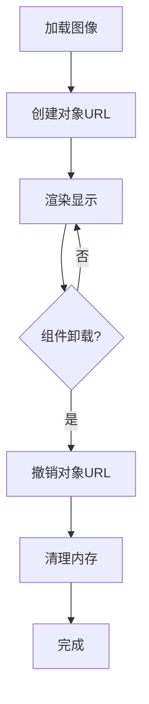

**图表来源**
- [PhotoWall.tsx:21-74](file://client/src/components/PhotoWall.tsx#L21-L74)

**章节来源**
- [PhotoWall.tsx:21-97](file://client/src/components/PhotoWall.tsx#L21-L97)
- [ImageCard.tsx:315-354](file://client/src/components/ImageCard.tsx#L315-L354)

## 故障排除指南

### 常见问题及解决方案

#### 图像无法显示
1. **检查预览 URL**: 确认 `previewUrl` 和 `sessionUrl` 是否有效
2. **验证文件类型**: 确认文件类型是否被正确识别
3. **检查权限**: 确认跨域访问权限设置

#### 拖拽功能异常
1. **浏览器兼容性**: 确认浏览器支持 HTML5 拖拽 API
2. **事件处理**: 检查 `onDragStart` 和 `onDrop` 事件绑定
3. **数据传输**: 验证 `dataTransfer` 数据格式

#### 性能问题
1. **懒加载配置**: 检查 IntersectionObserver 配置参数
2. **内存泄漏**: 确认对象 URL 是否正确撤销
3. **重渲染优化**: 检查组件的 `memo` 使用情况

**章节来源**
- [ImageCard.tsx:252-354](file://client/src/components/ImageCard.tsx#L252-L354)
- [PhotoWall.tsx:27-73](file://client/src/components/PhotoWall.tsx#L27-L73)

## 结论

图像展示组件系统展现了现代前端应用的最佳实践，通过合理的架构设计和性能优化，实现了高效、流畅的图像处理体验。组件系统的主要优势包括：

1. **模块化设计**: 清晰的组件边界和职责分离
2. **性能优化**: 多层次的懒加载和虚拟滚动机制
3. **用户体验**: 丰富的交互功能和直观的操作流程
4. **可扩展性**: 良好的架构支持未来功能扩展

该系统为图像处理应用提供了坚实的技术基础，能够满足从简单图片浏览到复杂 AI 工作流的各种需求。

## 附录

### 扩展指南

#### 自定义图像处理器
1. **接口实现**: 实现 `ImageProcessor` 接口
2. **配置注册**: 在 `ImageCard` 中注册新处理器
3. **UI 集成**: 添加相应的用户界面元素

#### 预览效果定制
1. **CSS 变量**: 通过 CSS 变量定制外观
2. **动画效果**: 添加自定义动画和过渡效果
3. **交互行为**: 扩展鼠标和键盘交互

#### 工作流集成
1. **API 接口**: 实现新的工作流 API
2. **状态管理**: 集成到现有的状态管理系统
3. **用户界面**: 添加工作流特定的 UI 元素

**章节来源**
- [ImageCard.tsx:387-515](file://client/src/components/ImageCard.tsx#L387-L515)
- [PhotoWall.tsx:201-295](file://client/src/components/PhotoWall.tsx#L201-L295)