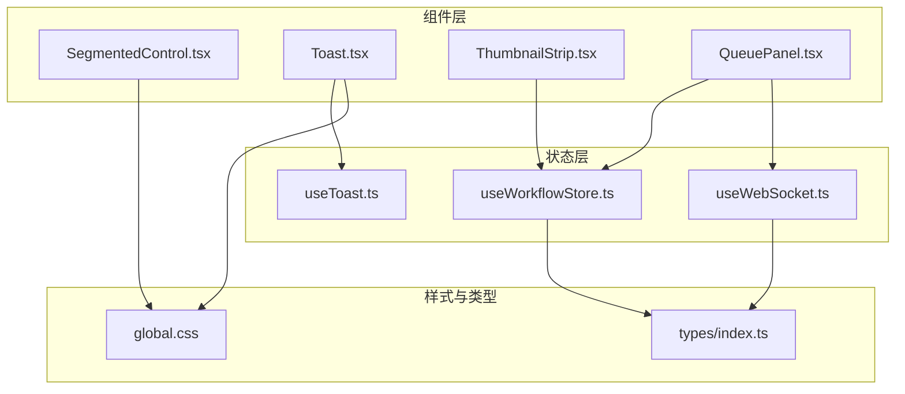
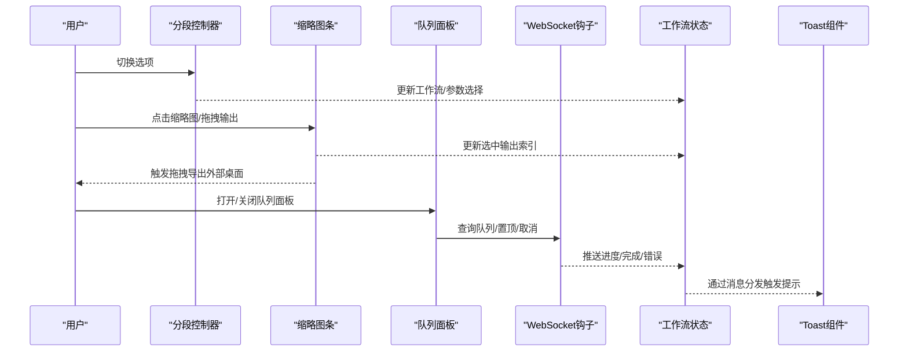
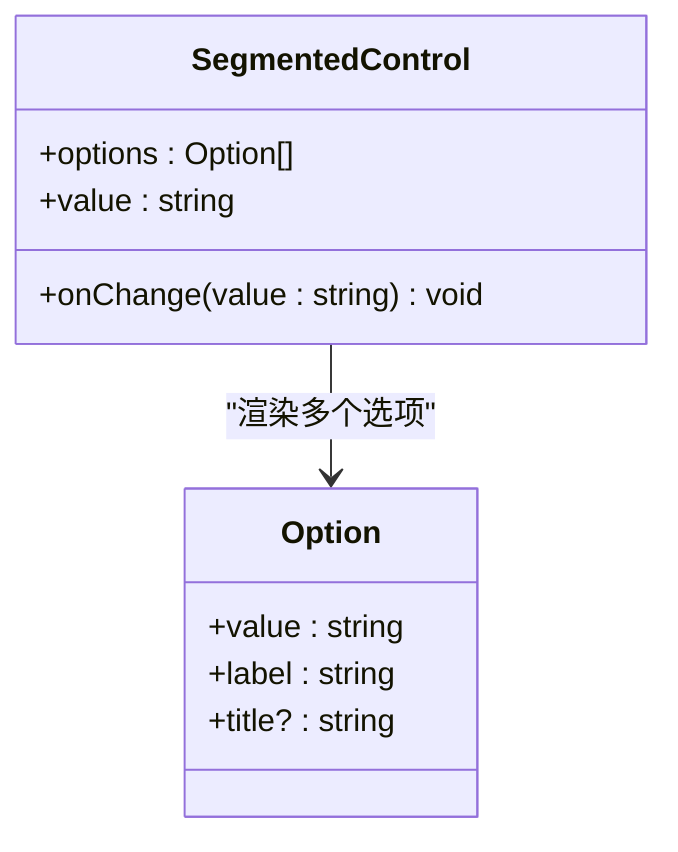
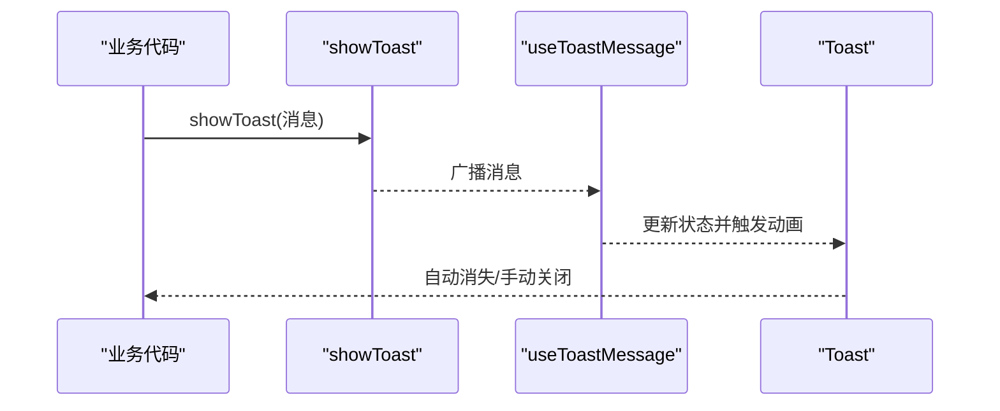
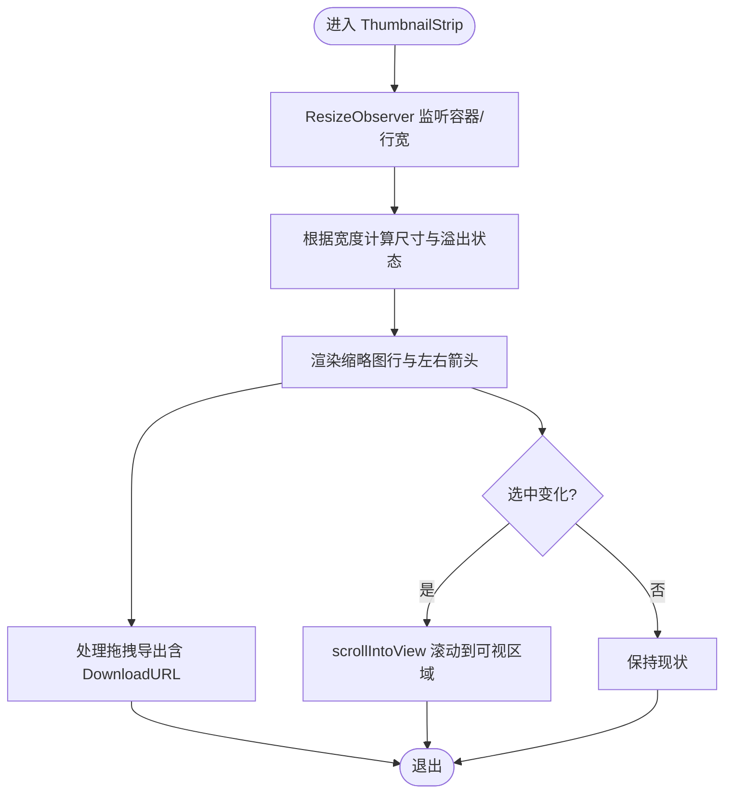
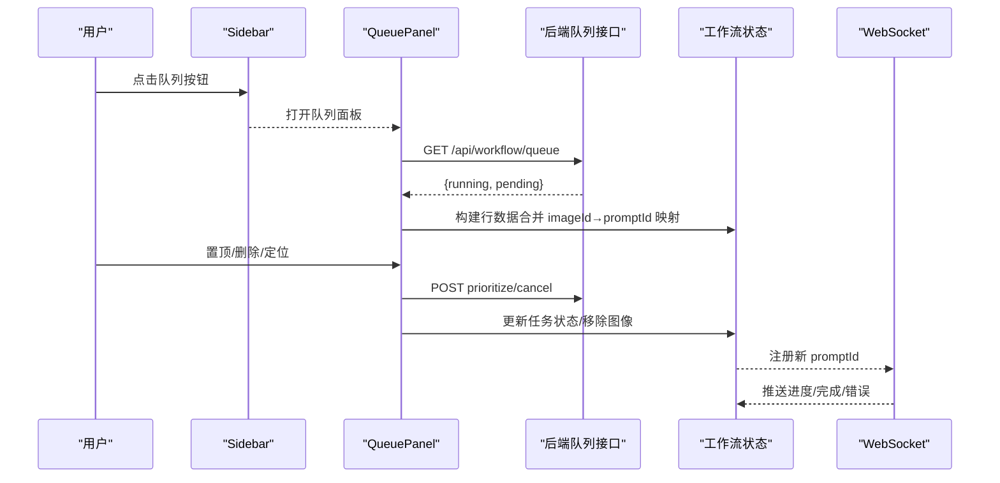
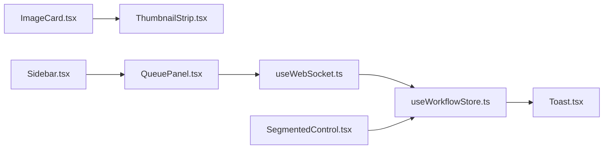
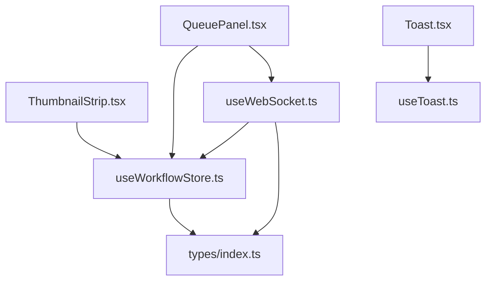

# 实用工具组件

<cite>
**本文引用的文件**
- [SegmentedControl.tsx](file://client/src/components/SegmentedControl.tsx)
- [Toast.tsx](file://client/src/components/Toast.tsx)
- [useToast.ts](file://client/src/hooks/useToast.ts)
- [ThumbnailStrip.tsx](file://client/src/components/ThumbnailStrip.tsx)
- [QueuePanel.tsx](file://client/src/components/QueuePanel.tsx)
- [useWorkflowStore.ts](file://client/src/hooks/useWorkflowStore.ts)
- [useWebSocket.ts](file://client/src/hooks/useWebSocket.ts)
- [ImageCard.tsx](file://client/src/components/ImageCard.tsx)
- [Sidebar.tsx](file://client/src/components/Sidebar.tsx)
- [index.ts](file://client/src/types/index.ts)
- [global.css](file://client/src/styles/global.css)
</cite>

## 目录
1. [简介](#简介)
2. [项目结构](#项目结构)
3. [核心组件](#核心组件)
4. [架构总览](#架构总览)
5. [详细组件分析](#详细组件分析)
6. [依赖关系分析](#依赖关系分析)
7. [性能考量](#性能考量)
8. [故障排查指南](#故障排查指南)
9. [结论](#结论)
10. [附录](#附录)

## 简介
本文件聚焦于四个实用工具组件：分段控制器（SegmentedControl）、消息提示（Toast）、缩略图条（ThumbnailStrip）与队列面板（QueuePanel）。我们将从设计目标、使用场景、API 接口、状态管理、可访问性、性能优化、与应用状态集成以及定制化指南等维度进行系统化技术文档编写，并辅以可视化图表帮助理解。

## 项目结构
这些组件位于客户端源码的 components 与 hooks 目录下，配合全局样式与类型定义共同构成 UI 基础设施：
- 组件层：SegmentedControl、Toast、ThumbnailStrip、QueuePanel
- 状态层：useWorkflowStore（工作流与任务状态）、useWebSocket（WebSocket 通信）、useToast（Toast 消息分发）
- 类型与样式：types/index.ts 定义任务与消息类型；global.css 提供动画与主题变量

**图表来源**
- [SegmentedControl.tsx:1-50](file://client/src/components/SegmentedControl.tsx#L1-L50)
- [Toast.tsx:1-56](file://client/src/components/Toast.tsx#L1-L56)
- [useToast.ts:1-70](file://client/src/hooks/useToast.ts#L1-L70)
- [ThumbnailStrip.tsx:1-240](file://client/src/components/ThumbnailStrip.tsx#L1-L240)
- [QueuePanel.tsx:1-308](file://client/src/components/QueuePanel.tsx#L1-L308)
- [useWorkflowStore.ts:1-923](file://client/src/hooks/useWorkflowStore.ts#L1-L923)
- [useWebSocket.ts:1-278](file://client/src/hooks/useWebSocket.ts#L1-L278)
- [global.css:1-300](file://client/src/styles/global.css#L1-L300)
- [index.ts:1-76](file://client/src/types/index.ts#L1-L76)

**章节来源**
- [SegmentedControl.tsx:1-50](file://client/src/components/SegmentedControl.tsx#L1-L50)
- [Toast.tsx:1-56](file://client/src/components/Toast.tsx#L1-L56)
- [useToast.ts:1-70](file://client/src/hooks/useToast.ts#L1-L70)
- [ThumbnailStrip.tsx:1-240](file://client/src/components/ThumbnailStrip.tsx#L1-L240)
- [QueuePanel.tsx:1-308](file://client/src/components/QueuePanel.tsx#L1-L308)
- [useWorkflowStore.ts:1-923](file://client/src/hooks/useWorkflowStore.ts#L1-L923)
- [useWebSocket.ts:1-278](file://client/src/hooks/useWebSocket.ts#L1-L278)
- [global.css:1-300](file://client/src/styles/global.css#L1-L300)
- [index.ts:1-76](file://client/src/types/index.ts#L1-L76)

## 核心组件
- 分段控制器（SegmentedControl）：用于在一组互斥选项间切换，提供简洁的视觉反馈与无障碍标题提示。
- 消息提示（Toast）：全局轻提示组件，支持可选操作按钮与自动消失，采用集中式消息分发。
- 缩略图条（ThumbnailStrip）：横向滚动的输出预览条，支持原图与结果对比、拖拽导出、溢出指示与平滑滚动。
- 队列面板（QueuePanel）：展示当前运行与排队的任务列表，支持置顶、删除、定位到卡片与进度可视化。

**章节来源**
- [SegmentedControl.tsx:1-50](file://client/src/components/SegmentedControl.tsx#L1-L50)
- [Toast.tsx:1-56](file://client/src/components/Toast.tsx#L1-L56)
- [useToast.ts:1-70](file://client/src/hooks/useToast.ts#L1-L70)
- [ThumbnailStrip.tsx:1-240](file://client/src/components/ThumbnailStrip.tsx#L1-L240)
- [QueuePanel.tsx:1-308](file://client/src/components/QueuePanel.tsx#L1-L308)

## 架构总览
组件与状态的交互关系如下：

**图表来源**
- [useWorkflowStore.ts:1-923](file://client/src/hooks/useWorkflowStore.ts#L1-L923)
- [useWebSocket.ts:1-278](file://client/src/hooks/useWebSocket.ts#L1-L278)
- [QueuePanel.tsx:1-308](file://client/src/components/QueuePanel.tsx#L1-L308)
- [ThumbnailStrip.tsx:1-240](file://client/src/components/ThumbnailStrip.tsx#L1-L240)
- [SegmentedControl.tsx:1-50](file://client/src/components/SegmentedControl.tsx#L1-L50)
- [Toast.tsx:1-56](file://client/src/components/Toast.tsx#L1-L56)
- [useToast.ts:1-70](file://client/src/hooks/useToast.ts#L1-L70)

## 详细组件分析

### 分段控制器（SegmentedControl）
- 设计目的：在少量互斥选项之间提供直观、紧凑的选择控件，常用于工作流切换或参数分组。
- 关键接口
  - 属性
    - options: 选项数组，包含 value、label、可选 title
    - value: 当前选中值
    - onChange: 回调函数，接收新值
  - 行为
    - 点击选项触发 onChange
    - 活跃项高亮显示，非活跃项半透明
- 可访问性
  - 通过 title 属性提供辅助信息
  - 使用标准 button 元素，具备基础键盘可达性
- 性能
  - 渲染为固定数量按钮，O(n) 渲染成本低
  - 无副作用，适合频繁更新

**图表来源**
- [SegmentedControl.tsx:1-50](file://client/src/components/SegmentedControl.tsx#L1-L50)

**章节来源**
- [SegmentedControl.tsx:1-50](file://client/src/components/SegmentedControl.tsx#L1-L50)

### 消息提示（Toast）
- 设计目的：向用户传达短暂状态变更或操作结果，支持可选动作按钮与自动消失。
- 关键接口
  - 组件 Toast
    - 通过 useToastMessage 获取 message、action、isExiting、dismiss
  - Hook useToastMessage
    - 返回当前消息状态与 dismiss 方法
  - 工具 showToast
    - 发布消息给所有监听者
- 行为与动画
  - 默认无动作 2 秒、有动作 8 秒后开始退出动画
  - 使用 fly-in/fly-out 动画，避免布局抖动
- 可访问性
  - 作为全局浮层，建议配合屏幕阅读器朗读机制（当前实现未显式声明 role/aria）
- 性能
  - 单例监听集合，消息广播 O(n)；n 通常很小
  - 动画基于 CSS，GPU 加速友好

**图表来源**
- [useToast.ts:1-70](file://client/src/hooks/useToast.ts#L1-L70)
- [Toast.tsx:1-56](file://client/src/components/Toast.tsx#L1-L56)
- [global.css:135-143](file://client/src/styles/global.css#L135-L143)

**章节来源**
- [useToast.ts:1-70](file://client/src/hooks/useToast.ts#L1-L70)
- [Toast.tsx:1-56](file://client/src/components/Toast.tsx#L1-L56)
- [global.css:135-143](file://client/src/styles/global.css#L135-L143)

### 缩略图条（ThumbnailStrip）
- 设计目的：在图像卡片底部展示原图与生成结果的横向预览，支持左右滚动、溢出指示、选中高亮与拖拽导出。
- 关键接口
  - 属性
    - items: 条目数组（包含 filename、url、isVideo、thumbnailUrl）
    - selectedIndex: 当前选中索引
    - onSelect(index): 回调
    - onOutputDragStart(outputIndex)/onOutputDragEnd(): 回调
    - onMouseEnter/onMouseLeave(): 回调
  - 行为
    - 根据容器宽度动态计算尺寸与间距
    - 检测溢出并控制左右箭头可见性
    - 选中项平滑滚动至可视区域中心
    - 支持视频与图片两种媒体类型
    - 输出项可拖拽导出到桌面，同时设置 DownloadURL
- 可访问性
  - 使用 button 元素承载点击与拖拽行为
  - 建议为关键按钮添加 aria-label 或 title
- 性能
  - ResizeObserver 监听容器与行宽，按需重算尺寸
  - 选中滚动使用 scrollIntoView，避免复杂 DOM 重排
  - 视频首帧预览通过 canvas 截取，注意内存占用

**图表来源**
- [ThumbnailStrip.tsx:1-240](file://client/src/components/ThumbnailStrip.tsx#L1-L240)

**章节来源**
- [ThumbnailStrip.tsx:1-240](file://client/src/components/ThumbnailStrip.tsx#L1-L240)

### 队列面板（QueuePanel）
- 设计目的：在侧边栏底部提供任务队列入口，打开后向上弹出面板，展示运行中与排队中的任务，支持置顶、删除与定位。
- 关键接口
  - 属性
    - onClose: 关闭回调
    - popupStyle: 弹窗样式覆盖
    - closing: 是否处于关闭动画中
  - 内部状态
    - rows: 队列行数据（包含 promptId、isRunning、imageId、tabId、imageName、workflowName、progress）
    - hoveredId: 悬停行标识
  - 依赖
    - useWorkflowStore：工作流与任务状态、会话 ID、提示词映射
    - useWebSocket：注册任务、发送消息
- 行为
  - 定时轮询 /api/workflow/queue 获取运行与排队列表
  - 将 store 中的 imageId → promptId 映射合并为行数据
  - 支持置顶（优先执行）与取消（删除队列并清理 store）
  - 双击行定位到对应卡片并闪烁高亮
- 可访问性
  - 使用 button 与 title 提供交互提示
  - 建议为列表项添加 aria-label 与键盘导航
- 性能
  - 2 秒轮询一次，避免频繁请求
  - 使用 CSS 动画 panel-enter-up/panel-exit-up，减少 JS 动画开销

**图表来源**
- [QueuePanel.tsx:1-308](file://client/src/components/QueuePanel.tsx#L1-L308)
- [useWorkflowStore.ts:1-923](file://client/src/hooks/useWorkflowStore.ts#L1-L923)
- [useWebSocket.ts:1-278](file://client/src/hooks/useWebSocket.ts#L1-L278)

**章节来源**
- [QueuePanel.tsx:1-308](file://client/src/components/QueuePanel.tsx#L1-L308)
- [useWorkflowStore.ts:1-923](file://client/src/hooks/useWorkflowStore.ts#L1-L923)
- [useWebSocket.ts:1-278](file://client/src/hooks/useWebSocket.ts#L1-L278)

### 组件组合使用模式
- 图像卡片与缩略图条
  - 在图像卡片底部渲染 ThumbnailStrip，将原图与生成结果串联展示
  - 通过 onSelect 同步选中输出索引，onOutputDragStart/onOutputDragEnd 与拖拽导出联动
- 侧边栏与队列面板
  - 侧边栏底部按钮触发 QueuePanel 弹出，面板内双击定位卡片并高亮
  - 面板通过 WebSocket 推送进度，Store 状态驱动 Toast 提示
- 分段控制器与工作流
  - 分段控制器切换工作流或参数，Store 状态驱动后续任务队列与输出展示

**图表来源**
- [ImageCard.tsx:1034-1053](file://client/src/components/ImageCard.tsx#L1034-L1053)
- [Sidebar.tsx:410-434](file://client/src/components/Sidebar.tsx#L410-L434)
- [QueuePanel.tsx:1-308](file://client/src/components/QueuePanel.tsx#L1-L308)
- [useWorkflowStore.ts:1-923](file://client/src/hooks/useWorkflowStore.ts#L1-L923)
- [useWebSocket.ts:1-278](file://client/src/hooks/useWebSocket.ts#L1-L278)
- [Toast.tsx:1-56](file://client/src/components/Toast.tsx#L1-L56)
- [SegmentedControl.tsx:1-50](file://client/src/components/SegmentedControl.tsx#L1-L50)

**章节来源**
- [ImageCard.tsx:1034-1053](file://client/src/components/ImageCard.tsx#L1034-L1053)
- [Sidebar.tsx:410-434](file://client/src/components/Sidebar.tsx#L410-L434)

## 依赖关系分析
- 组件对状态的依赖
  - ThumbnailStrip 依赖 useWorkflowStore 的 selectedOutputIndex 与图像列表
  - QueuePanel 依赖 useWorkflowStore 的 workflows、tabData、sessionId、remapTaskPromptIds、removeImageByPromptId
  - Toast 依赖 useToastMessage 的集中式消息分发
  - useWebSocket 与 useWorkflowStore 双向协作：前者推送进度/完成/错误，后者更新任务状态
- 外部依赖
  - WebSocket 服务端连接与消息协议由 useWebSocket 管理
  - 后端队列接口提供运行/排队任务数据

**图表来源**
- [ThumbnailStrip.tsx:1-240](file://client/src/components/ThumbnailStrip.tsx#L1-L240)
- [QueuePanel.tsx:1-308](file://client/src/components/QueuePanel.tsx#L1-L308)
- [useWorkflowStore.ts:1-923](file://client/src/hooks/useWorkflowStore.ts#L1-L923)
- [useWebSocket.ts:1-278](file://client/src/hooks/useWebSocket.ts#L1-L278)
- [useToast.ts:1-70](file://client/src/hooks/useToast.ts#L1-L70)
- [index.ts:1-76](file://client/src/types/index.ts#L1-L76)

**章节来源**
- [useWorkflowStore.ts:1-923](file://client/src/hooks/useWorkflowStore.ts#L1-L923)
- [useWebSocket.ts:1-278](file://client/src/hooks/useWebSocket.ts#L1-L278)
- [index.ts:1-76](file://client/src/types/index.ts#L1-L76)

## 性能考量
- 渲染优化
  - Toast 使用 CSS 动画而非 JS 动画，fly-in/fly-out 基于关键帧，避免布局抖动
  - QueuePanel 使用 panel-enter-up/panel-exit-up 动画，减少重排
  - ThumbnailStrip 使用 ResizeObserver 与 scrollIntoView，避免复杂计算
- 内存管理
  - ThumbnailStrip 对视频首帧生成 canvas 截图，注意及时清理 URL.createObjectURL 与 canvas 上下文
  - QueuePanel 定时器每 2 秒轮询一次，组件卸载时清理定时器
- 网络与状态
  - useWebSocket 单例连接，避免重复握手；断线自动重连
  - useWorkflowStore 通过 remapTaskPromptIds 与注册消息确保任务 ID 一致性

**章节来源**
- [global.css:135-179](file://client/src/styles/global.css#L135-L179)
- [useWorkflowStore.ts:1-923](file://client/src/hooks/useWorkflowStore.ts#L1-L923)
- [useWebSocket.ts:1-278](file://client/src/hooks/useWebSocket.ts#L1-L278)
- [QueuePanel.tsx:84-88](file://client/src/components/QueuePanel.tsx#L84-L88)

## 故障排查指南
- Toast 不显示或不消失
  - 检查 showToast 是否被调用且 listeners 是否存在
  - 确认消息 duration 设置是否为 0 或过短
  - 查看 useToastMessage 的定时器是否被清理
- 队列面板不更新
  - 检查 /api/workflow/queue 接口返回格式与状态码
  - 确认 useWorkflowStore 的 remapTaskPromptIds 与 sendMessage 是否正确调用
- 缩略图条溢出箭头不显示
  - 检查 ResizeObserver 是否生效，容器/行宽是否正确
  - 确认 hasOverflow 计算逻辑与箭头透明度控制
- 拖拽导出失败
  - 确认 onOutputDragStart 中 dataTransfer.setData 与 setDragImage 是否执行
  - 检查 DownloadURL 格式与文件名编码

**章节来源**
- [useToast.ts:1-70](file://client/src/hooks/useToast.ts#L1-L70)
- [QueuePanel.tsx:38-82](file://client/src/components/QueuePanel.tsx#L38-L82)
- [ThumbnailStrip.tsx:49-62](file://client/src/components/ThumbnailStrip.tsx#L49-L62)
- [ThumbnailStrip.tsx:154-173](file://client/src/components/ThumbnailStrip.tsx#L154-L173)

## 结论
这四个实用工具组件围绕“简洁、高效、可组合”的原则构建：SegmentedControl 提供清晰的选项切换；Toast 实现轻量级反馈；ThumbnailStrip 增强输出浏览体验；QueuePanel 则打通任务状态与用户交互。通过集中式状态与 WebSocket 事件驱动，组件在复杂界面中协同良好，具备良好的可维护性与扩展性。

## 附录

### API 接口速查
- 分段控制器（SegmentedControl）
  - 属性：options: Option[], value: string, onChange: (v: string) => void
  - 行为：点击切换、活跃态高亮
- 消息提示（Toast）
  - 组件：Toast（内部使用 useToastMessage）
  - Hook：useToastMessage（返回 message、action、isExiting、dismiss）
  - 工具：showToast(config: string | ToastData)
- 缩略图条（ThumbnailStrip）
  - 属性：items: StripItem[], selectedIndex: number, onSelect, onOutputDragStart, onOutputDragEnd, onMouseEnter, onMouseLeave
  - 行为：动态尺寸、溢出指示、选中滚动、拖拽导出
- 队列面板（QueuePanel）
  - 属性：onClose, popupStyle?, closing?
  - 行为：轮询队列、置顶/删除、定位卡片、进度可视化

**章节来源**
- [SegmentedControl.tsx:1-50](file://client/src/components/SegmentedControl.tsx#L1-L50)
- [useToast.ts:1-70](file://client/src/hooks/useToast.ts#L1-L70)
- [ThumbnailStrip.tsx:1-240](file://client/src/components/ThumbnailStrip.tsx#L1-L240)
- [QueuePanel.tsx:1-308](file://client/src/components/QueuePanel.tsx#L1-L308)

### 可访问性建议
- 为按钮与交互元素补充 title 或 aria-label
- 为列表项提供可读的文本描述
- 确保键盘可达性（Tab 导航、Enter/Space 触发）

### 定制化指南
- 样式调整
  - 使用 CSS 变量覆盖主题色与间距（如 --color-primary、--color-bg 等）
  - 自定义动画时长与缓动曲线
- 功能扩展
  - Toast：增加更多动作按钮或自定义持续时间
  - ThumbnailStrip：支持更多媒体类型或手势缩放
  - QueuePanel：扩展排序规则、筛选条件或批量操作