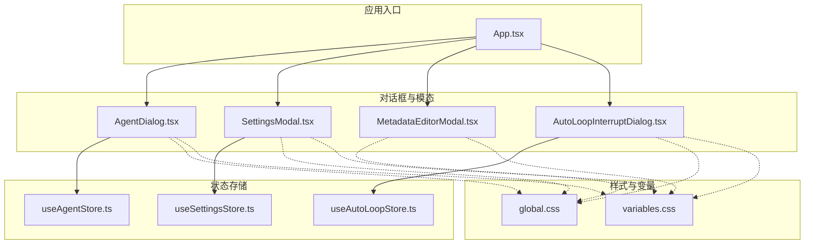
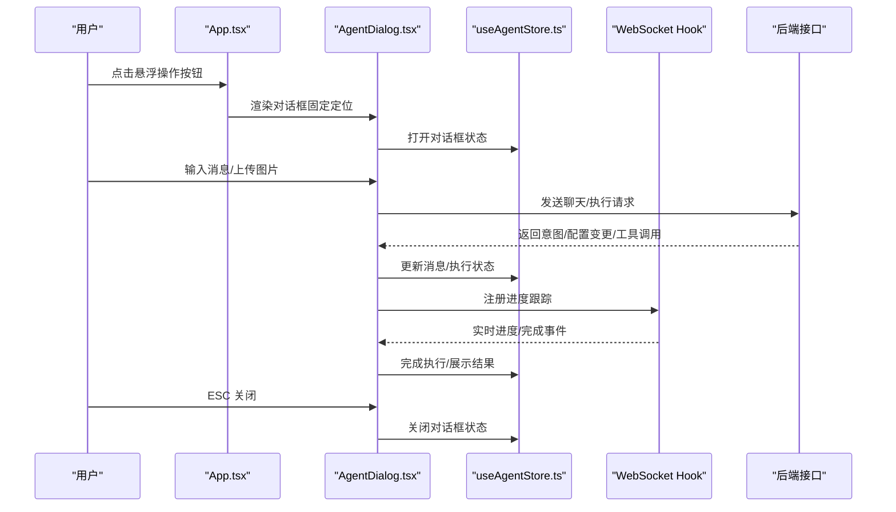
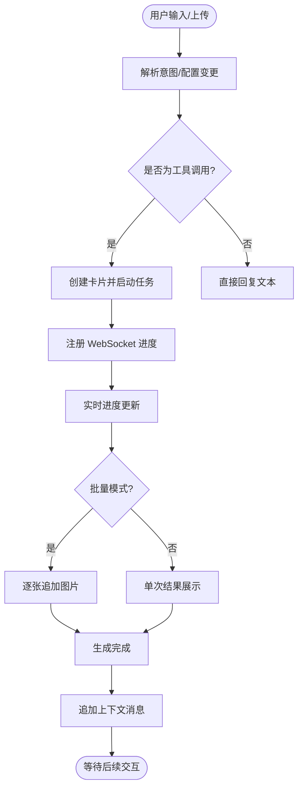
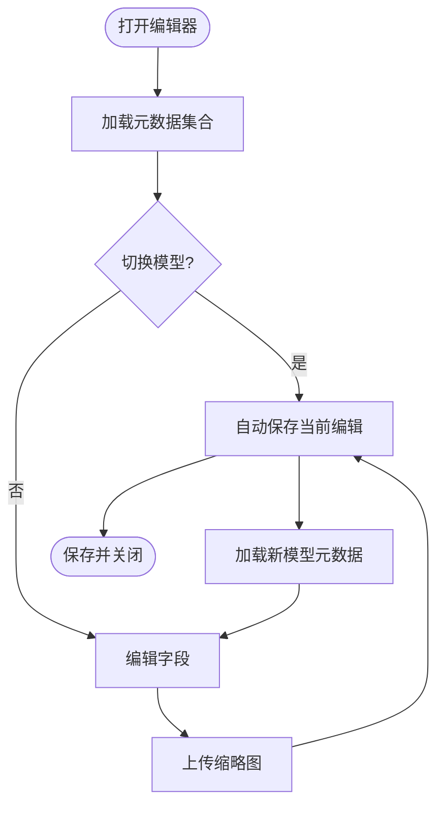
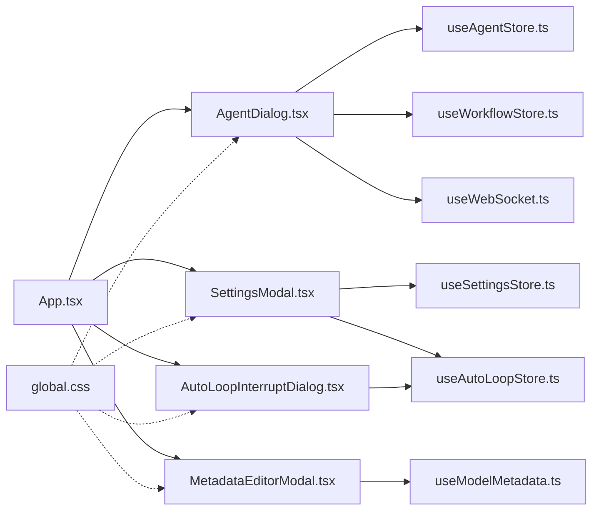

# 对话框和模态组件

<cite>
**本文引用的文件**
- [AgentDialog.tsx](file://client/src/components/AgentDialog.tsx)
- [SettingsModal.tsx](file://client/src/components/SettingsModal.tsx)
- [MetadataEditorModal.tsx](file://client/src/components/MetadataEditorModal.tsx)
- [AutoLoopInterruptDialog.tsx](file://client/src/components/AutoLoopInterruptDialog.tsx)
- [useAgentStore.ts](file://client/src/hooks/useAgentStore.ts)
- [useSettingsStore.ts](file://client/src/hooks/useSettingsStore.ts)
- [useAutoLoopStore.ts](file://client/src/hooks/useAutoLoopStore.ts)
- [App.tsx](file://client/src/components/App.tsx)
- [global.css](file://client/src/styles/global.css)
- [variables.css](file://client/src/styles/variables.css)
- [useModelMetadata.ts](file://client/src/hooks/useModelMetadata.ts)
</cite>

## 目录
1. [简介](#简介)
2. [项目结构](#项目结构)
3. [核心组件](#核心组件)
4. [架构总览](#架构总览)
5. [详细组件分析](#详细组件分析)
6. [依赖关系分析](#依赖关系分析)
7. [性能考量](#性能考量)
8. [故障排查指南](#故障排查指南)
9. [结论](#结论)
10. [附录](#附录)

## 简介
本技术文档聚焦于应用中的对话框与模态组件体系，涵盖以下关键组件：
- AI Agent 对话框：提供智能体聊天、配置助理、问答等多模式交互，支持图片上传、批量生成、实时进度与结果展示。
- 设置模态框：集中管理应用设置，包含工作流、随机生成、会话、通知、提示词管理与个人偏好等分类。
- 元数据编辑器：面向模型元数据的编辑与增强，支持缩略图上传、风格标签、关键词、兼容模型与推荐强度等字段。
- 自动循环中断对话框：在跨标签提交任务时拦截并提示用户停止循环，保障任务一致性与资源控制。

文档将从生命周期管理、动画与焦点、键盘事件、层级与遮罩、与主应用通信、动态加载与异步处理、响应式与移动端适配、以及扩展指南等方面进行系统阐述。

## 项目结构
对话框与模态组件主要位于客户端组件目录，配合全局样式与状态存储实现统一的视觉与交互体验。



图表来源
- [App.tsx:338-339](file://client/src/components/App.tsx#L338-L339)
- [AgentDialog.tsx:33-54](file://client/src/components/AgentDialog.tsx#L33-L54)
- [SettingsModal.tsx:117-119](file://client/src/components/SettingsModal.tsx#L117-L119)
- [MetadataEditorModal.tsx:77-86](file://client/src/components/MetadataEditorModal.tsx#L77-L86)
- [AutoLoopInterruptDialog.tsx:8-11](file://client/src/components/AutoLoopInterruptDialog.tsx#L8-L11)
- [useAgentStore.ts:198-337](file://client/src/hooks/useAgentStore.ts#L198-L337)
- [useSettingsStore.ts:54-177](file://client/src/hooks/useSettingsStore.ts#L54-L177)
- [useAutoLoopStore.ts:35-63](file://client/src/hooks/useAutoLoopStore.ts#L35-L63)
- [global.css:285-295](file://client/src/styles/global.css#L285-L295)
- [variables.css:1-31](file://client/src/styles/variables.css#L1-L31)

章节来源
- [App.tsx:338-339](file://client/src/components/App.tsx#L338-L339)
- [global.css:285-295](file://client/src/styles/global.css#L285-L295)
- [variables.css:1-31](file://client/src/styles/variables.css#L1-L31)

## 核心组件
- AgentDialog：负责 AI Agent 多模式对话、图片上传、意图解析、工作流执行、批量生成与结果展示。
- SettingsModal：集中设置面板，包含多个分类与交互控件，支持自动循环风险确认弹窗。
- MetadataEditorModal：模型元数据编辑器，支持多模型视图、筛选、缩略图上传与增强字段编辑。
- AutoLoopInterruptDialog：跨标签提交任务时的阻断式模态，用于停止自动循环并继续提交。

章节来源
- [AgentDialog.tsx:33-54](file://client/src/components/AgentDialog.tsx#L33-L54)
- [SettingsModal.tsx:117-119](file://client/src/components/SettingsModal.tsx#L117-L119)
- [MetadataEditorModal.tsx:77-86](file://client/src/components/MetadataEditorModal.tsx#L77-L86)
- [AutoLoopInterruptDialog.tsx:8-11](file://client/src/components/AutoLoopInterruptDialog.tsx#L8-L11)

## 架构总览
对话框与模态组件通过状态存储与主应用入口协调工作，采用固定定位与 Portal 挂载实现层级管理与遮罩覆盖，结合 CSS 动画实现进入/退出过渡。



图表来源
- [App.tsx:338-339](file://client/src/components/App.tsx#L338-L339)
- [AgentDialog.tsx:216-225](file://client/src/components/AgentDialog.tsx#L216-L225)
- [useAgentStore.ts:234-238](file://client/src/hooks/useAgentStore.ts#L234-L238)
- [global.css:285-295](file://client/src/styles/global.css#L285-L295)

## 详细组件分析

### AI Agent 对话框
- 设计模式与交互流程
  - 多模式：智能体、配置助理、智能问答。
  - 图片上传：拖拽/粘贴/文件选择，支持预览与移除。
  - 意图解析：后端解析用户输入为工作流意图，支持工具调用与配置变更。
  - 执行与进度：通过 WebSocket 注册任务，实时更新进度与批量输出。
  - 结果展示：消息气泡内嵌图片，支持批量模式逐张追加与最终汇总。
  - 建议与上下文：暖场建议、后续建议、生成完成上下文消息。
- 生命周期管理
  - 打开/关闭：状态切换与淡入/淡出动画。
  - 关闭动画：延迟关闭以保证动画完整。
  - 自动滚动：新消息到达时平滑滚动到底部。
- 键盘事件与焦点
  - ESC 关闭对话框。
  - 文本域自动聚焦与尺寸自适应。
- 与主应用通信
  - 通过 useAgentStore 管理消息、执行状态与意图。
  - 通过 useWebSocket 与后端建立进度跟踪通道。
  - 通过 useWorkflowStore 在目标 Tab 创建卡片并启动任务。
- 动态加载与异步处理
  - 暖场建议懒加载与缓存复用。
  - 批量生成逐张追加图片，完成后统一更新。
  - 生成完成后追加上下文消息，便于后续对话。
- 响应式与移动端适配
  - 对话框宽度与高度随窗口变化自适应。
  - 移动端文本域与按钮尺寸优化。
- 可扩展性
  - 新增聊天模式：扩展 CHAT_MODES 并在 store 中维护模式状态。
  - 新增工作流意图：在后端解析与前端执行之间新增映射。



图表来源
- [AgentDialog.tsx:283-574](file://client/src/components/AgentDialog.tsx#L283-L574)
- [useAgentStore.ts:137-185](file://client/src/hooks/useAgentStore.ts#L137-L185)

章节来源
- [AgentDialog.tsx:27-31](file://client/src/components/AgentDialog.tsx#L27-L31)
- [AgentDialog.tsx:77-80](file://client/src/components/AgentDialog.tsx#L77-L80)
- [AgentDialog.tsx:216-225](file://client/src/components/AgentDialog.tsx#L216-L225)
- [AgentDialog.tsx:227-247](file://client/src/components/AgentDialog.tsx#L227-L247)
- [AgentDialog.tsx:283-574](file://client/src/components/AgentDialog.tsx#L283-L574)
- [AgentDialog.tsx:576-604](file://client/src/components/AgentDialog.tsx#L576-L604)
- [AgentDialog.tsx:606-617](file://client/src/components/AgentDialog.tsx#L606-L617)
- [AgentDialog.tsx:619-639](file://client/src/components/AgentDialog.tsx#L619-L639)
- [AgentDialog.tsx:641-774](file://client/src/components/AgentDialog.tsx#L641-L774)
- [AgentDialog.tsx:776-782](file://client/src/components/AgentDialog.tsx#L776-L782)
- [AgentDialog.tsx:784-800](file://client/src/components/AgentDialog.tsx#L784-L800)
- [useAgentStore.ts:198-337](file://client/src/hooks/useAgentStore.ts#L198-L337)

### 设置模态框
- 设计模式与交互流程
  - 分类导航：工作流、随机生成、会话、通知、提示词管理、我的偏好。
  - 设置项：下拉/开关/滑块/按钮等控件，支持即时反馈与确认。
  - 自动循环风险确认：切换到自动循环前弹窗二次确认。
  - 会话路径管理：浏览选择目录、恢复默认路径、应用后刷新。
- 生命周期管理
  - ESC 关闭。
  - 打开时加载会话路径。
- 键盘事件与焦点
  - ESC 关闭。
- 层级与遮罩
  - 固定定位，z-index 1000，背景半透明遮罩。
- 与主应用通信
  - 通过 useSettingsStore 管理设置状态与持久化。
  - 通过 useAutoLoopStore 控制自动循环模式切换。
- 响应式与移动端适配
  - 宽度与高度自适应，滚动区域独立。
- 可扩展性
  - 新增设置项：在 store 中新增字段并在 UI 中渲染。
  - 新增分类：在分类数组中添加新项并实现对应面板。

```mermaid
sequenceDiagram
participant User as "用户"
participant App as "App.tsx"
participant Modal as "SettingsModal.tsx"
participant Store as "useSettingsStore.ts"
participant Loop as "useAutoLoopStore.ts"
User->>App : 点击设置按钮
App->>Modal : 渲染设置模态框
Modal->>Store : 打开设置面板
User->>Modal : 切换任务执行模式
Modal->>Loop : 触发自动循环确认
User->>Modal : 确认/取消
Modal->>Store : 应用设置变更
User->>Modal : ESC 关闭
Modal->>Store : 关闭设置面板
```

图表来源
- [App.tsx:251-268](file://client/src/components/App.tsx#L251-L268)
- [SettingsModal.tsx:153-159](file://client/src/components/SettingsModal.tsx#L153-L159)
- [SettingsModal.tsx:384-394](file://client/src/components/SettingsModal.tsx#L384-L394)
- [SettingsModal.tsx:686-752](file://client/src/components/SettingsModal.tsx#L686-L752)
- [useSettingsStore.ts:132-139](file://client/src/hooks/useSettingsStore.ts#L132-L139)
- [useAutoLoopStore.ts:46-62](file://client/src/hooks/useAutoLoopStore.ts#L46-L62)

章节来源
- [SettingsModal.tsx:153-159](file://client/src/components/SettingsModal.tsx#L153-L159)
- [SettingsModal.tsx:170-177](file://client/src/components/SettingsModal.tsx#L170-L177)
- [SettingsModal.tsx:179-215](file://client/src/components/SettingsModal.tsx#L179-L215)
- [SettingsModal.tsx:217-234](file://client/src/components/SettingsModal.tsx#L217-L234)
- [SettingsModal.tsx:384-394](file://client/src/components/SettingsModal.tsx#L384-L394)
- [SettingsModal.tsx:686-752](file://client/src/components/SettingsModal.tsx#L686-L752)
- [useSettingsStore.ts:132-139](file://client/src/hooks/useSettingsStore.ts#L132-L139)
- [useAutoLoopStore.ts:46-62](file://client/src/hooks/useAutoLoopStore.ts#L46-L62)

### 元数据编辑器
- 设计模式与交互流程
  - 多模型视图：支持同一元数据集合内的多模型切换。
  - 左侧面板：搜索与分类筛选，支持分组与计数。
  - 右侧面板：基础信息与 AI Agent 增强字段编辑。
  - 缩略图上传：隐藏文件输入与占位图交互。
  - 自动填充：基于昵称提取关键词、基于路径推断兼容模型。
- 生命周期管理
  - 打开/关闭：固定定位，Portal 挂载。
  - 切换模型：自动保存当前编辑并加载新模型数据。
- 键盘事件与焦点
  - 标签输入支持回车添加。
- 层级与遮罩
  - 固定定位，z-index 10010，背景半透明遮罩。
- 与主应用通信
  - 通过 useModelMetadata 管理元数据加载与更新。
  - 通过后端接口上传缩略图与更新字段。
- 响应式与移动端适配
  - 左右布局自适应，滚动区域独立。
- 可扩展性
  - 新增字段：在 UI 中添加输入控件并在保存时序列化。
  - 新增模型：在模型列表中加入新项并实现自动填充逻辑。



图表来源
- [MetadataEditorModal.tsx:269-271](file://client/src/components/MetadataEditorModal.tsx#L269-L271)
- [MetadataEditorModal.tsx:296-304](file://client/src/components/MetadataEditorModal.tsx#L296-L304)
- [MetadataEditorModal.tsx:214-229](file://client/src/components/MetadataEditorModal.tsx#L214-L229)
- [MetadataEditorModal.tsx:273-293](file://client/src/components/MetadataEditorModal.tsx#L273-L293)
- [useModelMetadata.ts:19-33](file://client/src/hooks/useModelMetadata.ts#L19-L33)
- [useModelMetadata.ts:209-233](file://client/src/hooks/useModelMetadata.ts#L209-L233)

章节来源
- [MetadataEditorModal.tsx:406-408](file://client/src/components/MetadataEditorModal.tsx#L406-L408)
- [MetadataEditorModal.tsx:466-498](file://client/src/components/MetadataEditorModal.tsx#L466-L498)
- [MetadataEditorModal.tsx:551-562](file://client/src/components/MetadataEditorModal.tsx#L551-L562)
- [MetadataEditorModal.tsx:269-271](file://client/src/components/MetadataEditorModal.tsx#L269-L271)
- [MetadataEditorModal.tsx:296-304](file://client/src/components/MetadataEditorModal.tsx#L296-L304)
- [MetadataEditorModal.tsx:214-229](file://client/src/components/MetadataEditorModal.tsx#L214-L229)
- [MetadataEditorModal.tsx:273-293](file://client/src/components/MetadataEditorModal.tsx#L273-L293)
- [useModelMetadata.ts:19-33](file://client/src/hooks/useModelMetadata.ts#L19-L33)
- [useModelMetadata.ts:209-233](file://client/src/hooks/useModelMetadata.ts#L209-L233)

### 自动循环中断对话框
- 设计模式与交互流程
  - 跨标签提交任务前拦截，弹出确认对话框。
  - 用户选择“停止循环并继续”或“取消”，决定是否终止循环并放行提交。
- 生命周期管理
  - 由 useAutoLoopStore 触发与关闭。
  - 固定定位，z-index 1200，背景半透明遮罩。
- 与主应用通信
  - 通过 useAutoLoopStore.guardBeforeSubmit() 申请中断请求。
  - 通过 resolveInterrupt() 回传用户选择结果。

```mermaid
sequenceDiagram
participant User as "用户"
participant Tab as "目标标签页"
participant Loop as "useAutoLoopStore.ts"
participant Dialog as "AutoLoopInterruptDialog.tsx"
User->>Tab : 提交任务
Tab->>Loop : guardBeforeSubmit(fromTabId)
alt 有循环且来源不同
Loop->>Dialog : 显示中断对话框
User->>Dialog : 选择停止/取消
Dialog->>Loop : resolveInterrupt(result)
alt 停止循环
Loop->>Loop : 停止循环
Loop-->>Tab : 放行提交
else 取消
Loop-->>Tab : 终止提交
end
else 无冲突
Loop-->>Tab : 允许提交
end
```

图表来源
- [useAutoLoopStore.ts:46-62](file://client/src/hooks/useAutoLoopStore.ts#L46-L62)
- [AutoLoopInterruptDialog.tsx:8-13](file://client/src/components/AutoLoopInterruptDialog.tsx#L8-L13)
- [AutoLoopInterruptDialog.tsx:48-80](file://client/src/components/AutoLoopInterruptDialog.tsx#L48-L80)

章节来源
- [useAutoLoopStore.ts:46-62](file://client/src/hooks/useAutoLoopStore.ts#L46-L62)
- [AutoLoopInterruptDialog.tsx:8-13](file://client/src/components/AutoLoopInterruptDialog.tsx#L8-L13)
- [AutoLoopInterruptDialog.tsx:48-80](file://client/src/components/AutoLoopInterruptDialog.tsx#L48-L80)

## 依赖关系分析
- 组件耦合
  - AgentDialog 与 useAgentStore、useWorkflowStore、useWebSocket 高度耦合，负责核心业务逻辑。
  - SettingsModal 与 useSettingsStore、useAutoLoopStore 耦合，负责设置与循环控制。
  - MetadataEditorModal 与 useModelMetadata 耦合，负责元数据编辑。
  - AutoLoopInterruptDialog 与 useAutoLoopStore 耦合，负责循环中断拦截。
- 外部依赖
  - 全局样式与变量：统一颜色、间距与动画。
  - Portal：将模态框挂载到 document.body，确保层级与遮罩正确。
- 潜在循环依赖
  - 组件间通过 store 解耦，避免直接相互引用，降低循环依赖风险。



图表来源
- [AgentDialog.tsx:3-6](file://client/src/components/AgentDialog.tsx#L3-L6)
- [SettingsModal.tsx:3-7](file://client/src/components/SettingsModal.tsx#L3-L7)
- [MetadataEditorModal.tsx:1-6](file://client/src/components/MetadataEditorModal.tsx#L1-L6)
- [AutoLoopInterruptDialog.tsx](file://client/src/components/AutoLoopInterruptDialog.tsx#L2)
- [App.tsx:30-31](file://client/src/components/App.tsx#L30-L31)
- [global.css:285-295](file://client/src/styles/global.css#L285-L295)

章节来源
- [AgentDialog.tsx:3-6](file://client/src/components/AgentDialog.tsx#L3-L6)
- [SettingsModal.tsx:3-7](file://client/src/components/SettingsModal.tsx#L3-L7)
- [MetadataEditorModal.tsx:1-6](file://client/src/components/MetadataEditorModal.tsx#L1-L6)
- [AutoLoopInterruptDialog.tsx](file://client/src/components/AutoLoopInterruptDialog.tsx#L2)
- [App.tsx:30-31](file://client/src/components/App.tsx#L30-L31)
- [global.css:285-295](file://client/src/styles/global.css#L285-L295)

## 性能考量
- 动画与过渡
  - 使用 CSS 动画（如进入/退出、闪烁、光晕）替代昂贵的阴影动画，减少重排重绘。
  - 批量更新时使用引用计数与增量更新，避免不必要的渲染。
- 异步处理
  - 暖场建议懒加载与缓存复用，减少重复请求。
  - WebSocket 注册与订阅解绑，避免内存泄漏。
- 资源管理
  - 图片上传使用 FileReader 转换为 data URL，避免大文件阻塞。
  - 缩略图上传使用 FormData，后端接口处理。
- 响应式
  - 使用 min()/max() 与 vw/vh 控制尺寸，适配不同屏幕。
  - 滚动区域独立，避免整体布局抖动。

[本节为通用指导，不直接分析具体文件]

## 故障排查指南
- 对话框无法打开/关闭
  - 检查状态存储中的打开/关闭方法是否被调用。
  - 确认 ESC 键盘事件监听是否生效。
- 进度不更新
  - 检查 WebSocket 注册是否成功，promptId 是否匹配。
  - 确认后端接口返回的进度数据格式。
- 批量生成异常
  - 检查 batchOutputs 与 allImageIds 是否一一对应。
  - 确认批量总数与已完成计数逻辑。
- 设置无法保存
  - 检查 useSettingsStore 的持久化逻辑与后端接口返回。
  - 确认自动循环切换的二次确认流程。
- 元数据编辑异常
  - 检查 useModelMetadata 的加载与更新逻辑。
  - 确认缩略图上传接口与字段序列化。

章节来源
- [useAgentStore.ts:234-238](file://client/src/hooks/useAgentStore.ts#L234-L238)
- [AgentDialog.tsx:216-225](file://client/src/components/AgentDialog.tsx#L216-L225)
- [AgentDialog.tsx:566-569](file://client/src/components/AgentDialog.tsx#L566-L569)
- [SettingsModal.tsx:384-394](file://client/src/components/SettingsModal.tsx#L384-L394)
- [useSettingsStore.ts:128-131](file://client/src/hooks/useSettingsStore.ts#L128-L131)
- [MetadataEditorModal.tsx:214-229](file://client/src/components/MetadataEditorModal.tsx#L214-L229)
- [useModelMetadata.ts:209-233](file://client/src/hooks/useModelMetadata.ts#L209-L233)

## 结论
本组件体系通过清晰的状态分离与统一的样式规范，实现了高可用的对话框与模态交互。AI Agent 对话框提供了强大的多模式与异步能力，设置与元数据编辑器覆盖了应用的核心配置与模型管理场景，自动循环中断对话框保障了任务一致性与资源控制。未来可在模式扩展、工作流意图扩展与移动端交互优化方面进一步增强。

[本节为总结性内容，不直接分析具体文件]

## 附录
- 扩展指南
  - 新增对话框类型：在 App.tsx 中引入新组件，使用固定定位与 Portal 挂载，定义 z-index 与遮罩。
  - 新增聊天模式：在 CHAT_MODES 中添加新模式，扩展 store 中的消息与执行状态。
  - 新增设置项：在 useSettingsStore 中新增字段与持久化逻辑，在 SettingsModal 中添加 UI 控件。
  - 新增元数据字段：在 ModelMetadata 接口中添加字段，在 UI 中渲染并序列化保存。
  - 新增工作流意图：在后端解析逻辑中新增映射，前端在 AgentDialog 中处理工具调用与结果展示。
- 无障碍与键盘事件
  - ESC 关闭：在组件中监听键盘事件并调用关闭方法。
  - 焦点管理：对话框打开时将焦点置于首个可交互元素，关闭时恢复原焦点。
  - 屏幕阅读器：为按钮与输入框提供语义化标签与描述。
- 响应式与移动端适配
  - 使用相对单位与媒体查询，确保在小屏设备上的可读性与可触达性。
  - 优化触摸目标尺寸与间距，提升移动端交互体验。

[本节为通用指导，不直接分析具体文件]