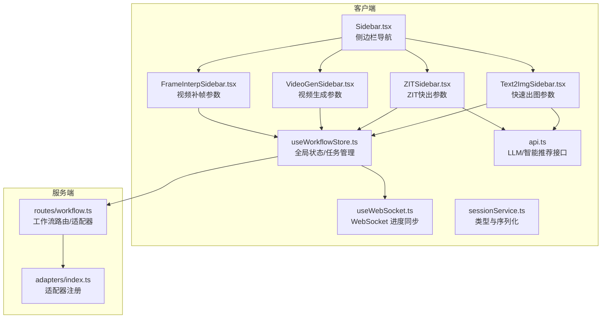
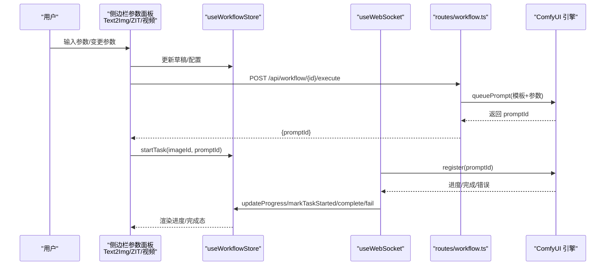
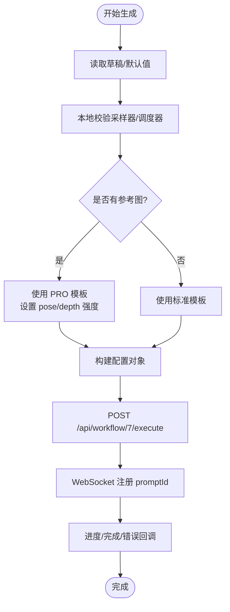
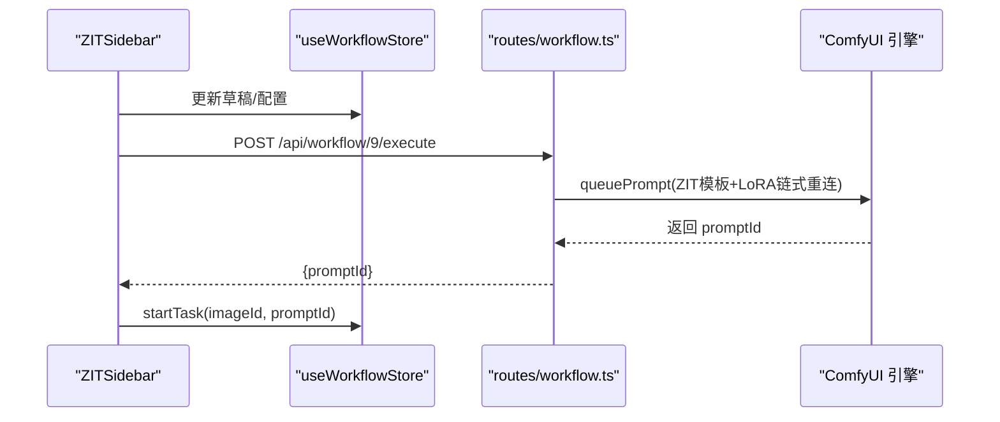
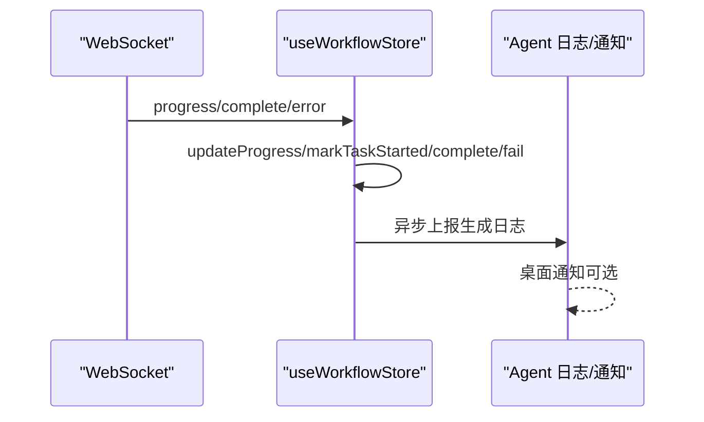
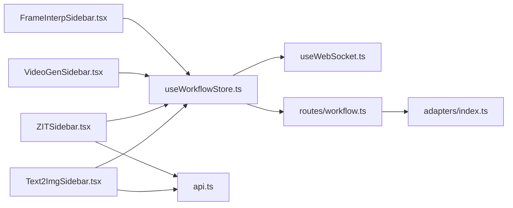

# 工作流控制组件

<cite>
**本文引用的文件**
- [Text2ImgSidebar.tsx](file://client/src/components/Text2ImgSidebar.tsx)
- [VideoGenSidebar.tsx](file://client/src/components/VideoGenSidebar.tsx)
- [ZITSidebar.tsx](file://client/src/components/ZITSidebar.tsx)
- [FrameInterpSidebar.tsx](file://client/src/components/FrameInterpSidebar.tsx)
- [useWorkflowStore.ts](file://client/src/hooks/useWorkflowStore.ts)
- [sessionService.ts](file://client/src/services/sessionService.ts)
- [workflow.ts](file://server/src/routes/workflow.ts)
- [index.ts](file://server/src/adapters/index.ts)
- [Sidebar.tsx](file://client/src/components/Sidebar.tsx)
- [api.ts](file://client/src/services/api.ts)
- [useWebSocket.ts](file://client/src/hooks/useWebSocket.ts)
- [index.ts](file://client/src/types/index.ts)
- [sidebarGroups.ts](file://client/src/data/sidebarGroups.ts)
- [Workflow0SettingsPanel.tsx](file://client/src/components/Workflow0SettingsPanel.tsx)
- [Workflow2SettingsPanel.tsx](file://client/src/components/Workflow2SettingsPanel.tsx)
</cite>

## 目录
1. [简介](#简介)
2. [项目结构](#项目结构)
3. [核心组件](#核心组件)
4. [架构总览](#架构总览)
5. [详细组件分析](#详细组件分析)
6. [依赖关系分析](#依赖关系分析)
7. [性能考量](#性能考量)
8. [故障排查指南](#故障排查指南)
9. [结论](#结论)
10. [附录](#附录)

## 简介
本技术文档围绕工作流控制组件展开，重点解析四种工作流侧边栏的设计模式与参数体系：Text2ImgSidebar（快速出图）、VideoGenSidebar（视频生成）、ZITSidebar（ZIT快出）、FrameInterpSidebar（视频补帧）。文档涵盖以下主题：
- 参数体系：提示词、采样参数、分辨率、质量控制、参考图与LoRA等
- 实时预览与参数变更反馈：本地草稿持久化、尺寸预设联动、参考图原图比例同步
- 参数验证与默认值管理：本地存储校验、后端友好错误映射
- 与 ComfyUI 引擎通信协议：参数序列化、状态同步、WebSocket 进度回调
- 可扩展性设计：适配器模式、新工作流接入流程
- 使用示例与最佳实践：参数组合建议、交互流程、注意事项

## 项目结构
工作流控制组件位于客户端与服务端两侧，采用“侧边栏参数面板 + 会话状态 + 适配器 + 与 ComfyUI 通信”的分层架构。

图表来源
- [Sidebar.tsx:26-433](file://client/src/components/Sidebar.tsx#L26-L433)
- [Text2ImgSidebar.tsx:161-754](file://client/src/components/Text2ImgSidebar.tsx#L161-L754)
- [ZITSidebar.tsx:66-419](file://client/src/components/ZITSidebar.tsx#L66-L419)
- [VideoGenSidebar.tsx:37-97](file://client/src/components/VideoGenSidebar.tsx#L37-L97)
- [FrameInterpSidebar.tsx:23-64](file://client/src/components/FrameInterpSidebar.tsx#L23-L64)
- [useWorkflowStore.ts:191-923](file://client/src/hooks/useWorkflowStore.ts#L191-L923)
- [useWebSocket.ts:29-277](file://client/src/hooks/useWebSocket.ts#L29-L277)
- [sessionService.ts:10-86](file://client/src/services/sessionService.ts#L10-L86)
- [workflow.ts:1-800](file://server/src/routes/workflow.ts#L1-L800)
- [index.ts:14-33](file://server/src/adapters/index.ts#L14-L33)

章节来源
- [Sidebar.tsx:26-433](file://client/src/components/Sidebar.tsx#L26-L433)
- [sidebarGroups.ts:1-14](file://client/src/data/sidebarGroups.ts#L1-L14)

## 核心组件
- Text2ImgSidebar（快速出图）：支持 LoRA、参考图（Pose/Depth 强度）、采样器/调度器、分辨率预设与自定义、草稿持久化、智能推荐与触发词插入。
- ZITSidebar（ZIT快出）：支持 UNet 模型、LoRA、AuraFlow Shift 开关与强度、采样器/调度器、分辨率预设与自定义、草稿持久化。
- VideoGenSidebar（视频生成）：质量（Megapixels）、时长、帧率三要素，全局配置暴露给执行器。
- FrameInterpSidebar（视频补帧）：补帧倍率（2x/4x/6x），全局配置暴露给执行器。
- useWorkflowStore：全局状态、任务生命周期、跨 Tab 数据、草稿持久化、WebSocket 任务映射。
- useWebSocket：WebSocket 连接、消息分发、进度/完成/错误处理、自动记录生成日志。
- 适配器与路由：服务端通过适配器将前端参数映射到 ComfyUI 模板节点，统一执行入口。

章节来源
- [Text2ImgSidebar.tsx:161-754](file://client/src/components/Text2ImgSidebar.tsx#L161-L754)
- [ZITSidebar.tsx:66-419](file://client/src/components/ZITSidebar.tsx#L66-L419)
- [VideoGenSidebar.tsx:37-97](file://client/src/components/VideoGenSidebar.tsx#L37-L97)
- [FrameInterpSidebar.tsx:23-64](file://client/src/components/FrameInterpSidebar.tsx#L23-L64)
- [useWorkflowStore.ts:191-923](file://client/src/hooks/useWorkflowStore.ts#L191-L923)
- [useWebSocket.ts:29-277](file://client/src/hooks/useWebSocket.ts#L29-L277)
- [workflow.ts:1-800](file://server/src/routes/workflow.ts#L1-L800)
- [index.ts:14-33](file://server/src/adapters/index.ts#L14-L33)

## 架构总览
工作流控制的端到端流程如下：

图表来源
- [Text2ImgSidebar.tsx:680-754](file://client/src/components/Text2ImgSidebar.tsx#L680-L754)
- [ZITSidebar.tsx:345-419](file://client/src/components/ZITSidebar.tsx#L345-L419)
- [VideoGenSidebar.tsx:37-97](file://client/src/components/VideoGenSidebar.tsx#L37-L97)
- [FrameInterpSidebar.tsx:23-64](file://client/src/components/FrameInterpSidebar.tsx#L23-L64)
- [useWorkflowStore.ts:560-703](file://client/src/hooks/useWorkflowStore.ts#L560-L703)
- [useWebSocket.ts:45-159](file://client/src/hooks/useWebSocket.ts#L45-L159)
- [workflow.ts:269-405](file://server/src/routes/workflow.ts#L269-L405)

## 详细组件分析

### Text2ImgSidebar（快速出图）参数体系与交互
- 参数类别
  - 模型与 LoRA：支持多个 LoRA 插槽，权重范围与默认值管理，智能推荐与触发词插入。
  - 提示词：支持正向/负向提示词，动态高度、上下文菜单、AI 助手一键扩写。
  - 采样参数：步数、CFG、采样器（euler/euler_a/res_ms/dpmpp_2m）、调度器（simple/exponential/ddim/beta/normal）。
  - 分辨率：预设比例（1:1/3:4/9:16/4:3/16:9）与自定义宽高联动。
  - 参考图：上传/删除参考图，Pose/Depth 强度控制，原图比例自动匹配。
  - 草稿持久化：本地草稿键 t2i_draft，含兼容迁移与选项校验。
- 实时预览与反馈
  - 草稿持久化：参数变更即时写入 localStorage，Tab 切换不丢失。
  - 参考图原图比例：选择“原图”时自动同步宽高与比例预设。
  - 智能推荐：基于 LLM 的 LoRA 推荐与触发词插入，失败有 Toast 提示。
- 与 ComfyUI 通信
  - 执行接口：POST /api/workflow/7/execute，携带 clientId、模型、LoRA、提示词、分辨率、采样参数、参考图与强度。
  - PRO 分支：当存在 referenceImage 时使用二次元生成 (PRO) 模板，支持 pose/depth 强度与原图比例覆盖。
- 参数验证与默认值
  - 本地：读取草稿时校验采样器/调度器是否仍在可用列表内，不在则丢弃。
  - 服务端：友好错误映射（如模型/LoRA 未找到、队列提交失败）。

图表来源
- [Text2ImgSidebar.tsx:680-754](file://client/src/components/Text2ImgSidebar.tsx#L680-L754)
- [workflow.ts:269-405](file://server/src/routes/workflow.ts#L269-L405)
- [useWebSocket.ts:45-159](file://client/src/hooks/useWebSocket.ts#L45-L159)

章节来源
- [Text2ImgSidebar.tsx:161-754](file://client/src/components/Text2ImgSidebar.tsx#L161-L754)
- [sessionService.ts:10-27](file://client/src/services/sessionService.ts#L10-L27)
- [workflow.ts:269-405](file://server/src/routes/workflow.ts#L269-L405)
- [useWebSocket.ts:45-159](file://client/src/hooks/useWebSocket.ts#L45-L159)

### ZITSidebar（ZIT快出）参数体系与交互
- 参数类别
  - UNet 模型：支持 UNet 列表与收藏管理。
  - LoRA：与快速出图一致的多插槽与权重管理。
  - Shift 控制：开关与强度（默认 3），配合 LoRA 链式连接与 ifElse 节点控制输出来源。
  - 采样参数：步数、CFG、采样器、调度器。
  - 分辨率：预设比例与自定义宽高联动。
  - 草稿持久化：本地草稿键 zit_draft，含兼容迁移与选项校验。
- 实时预览与反馈
  - 草稿持久化：参数变更即时写入 localStorage。
  - LoRA 触发词提示：未使用触发词时给出提醒。
- 与 ComfyUI 通信
  - 执行接口：POST /api/workflow/9/execute，携带 clientId、UNet、LoRA、Shift 开关/强度、提示词、分辨率、采样参数。
  - LoRA 动态重连：禁用的 LoRA 被跳过，启用链路串联，最终输出连接到 ModelSampling/CLIPTextEncode/ifElse。
- 参数验证与默认值
  - 本地：读取草稿时校验采样器/调度器是否仍在可用列表内，不在则丢弃。
  - 服务端：友好错误映射。

图表来源
- [ZITSidebar.tsx:345-419](file://client/src/components/ZITSidebar.tsx#L345-L419)
- [workflow.ts:485-593](file://server/src/routes/workflow.ts#L485-L593)

章节来源
- [ZITSidebar.tsx:66-419](file://client/src/components/ZITSidebar.tsx#L66-L419)
- [sessionService.ts:29-41](file://client/src/services/sessionService.ts#L29-L41)
- [workflow.ts:485-593](file://server/src/routes/workflow.ts#L485-L593)

### VideoGenSidebar（视频生成）参数体系与交互
- 参数类别
  - 质量（Megapixels）：草稿/中等/原图三档。
  - 时长：4s/6s/8s 三档。
  - 帧率：草稿/流畅/精细三档。
- 全局配置暴露
  - 通过 window.__videoGenConfig 暴露给执行器读取，便于视频生成流程复用。
- 与 ComfyUI 通信
  - 执行接口：由调用方负责构造模板并提交，参数来源于全局配置对象。
- 参数验证与默认值
  - 本地：三档选项固定，无复杂校验。

章节来源
- [VideoGenSidebar.tsx:37-97](file://client/src/components/VideoGenSidebar.tsx#L37-L97)

### FrameInterpSidebar（视频补帧）参数体系与交互
- 参数类别
  - 补帧倍率：2x/4x/6x 三档。
- 全局配置暴露
  - 通过 window.__frameInterpConfig 暴露给执行器读取，便于补帧流程复用。
- 与 ComfyUI 通信
  - 执行接口：由调用方负责构造模板并提交，参数来源于全局配置对象。
- 参数验证与默认值
  - 本地：三档选项固定，无复杂校验。

章节来源
- [FrameInterpSidebar.tsx:23-64](file://client/src/components/FrameInterpSidebar.tsx#L23-L64)

### 任务状态与 WebSocket 同步
- WebSocket 生命周期
  - 单例连接：自动重连、连接计数管理。
  - 消息分发：connected/execution_start/progress/complete/error。
  - 任务映射：根据 promptId 在全局状态中定位 imageId 与工作流标签，更新进度、完成或错误。
- 自动记录生成日志
  - 对 Tab 7/9 的完成事件，异步上报生成日志，包含工作流、来源、配置与输出信息。
- 桌面通知
  - 可配置完成后桌面通知，区分成功与错误。

图表来源
- [useWebSocket.ts:45-159](file://client/src/hooks/useWebSocket.ts#L45-L159)
- [useWorkflowStore.ts:624-703](file://client/src/hooks/useWorkflowStore.ts#L624-L703)

章节来源
- [useWebSocket.ts:29-277](file://client/src/hooks/useWebSocket.ts#L29-L277)
- [useWorkflowStore.ts:560-703](file://client/src/hooks/useWorkflowStore.ts#L560-L703)

## 依赖关系分析
- 组件耦合
  - 侧边栏组件强依赖 useWorkflowStore（状态、任务、草稿）与 useWebSocket（进度同步）。
  - 服务端路由依赖适配器（adapters/index.ts）进行模板构建与参数映射。
- 外部依赖
  - ComfyUI：通过 queuePrompt 提交工作流，返回 promptId。
  - LLM：智能 LoRA 推荐、触发词插入、提示词助手。
- 循环依赖规避
  - 侧边栏与 store 通过 hooks 解耦；适配器集中注册避免循环引用。

图表来源
- [Text2ImgSidebar.tsx:161-754](file://client/src/components/Text2ImgSidebar.tsx#L161-L754)
- [ZITSidebar.tsx:66-419](file://client/src/components/ZITSidebar.tsx#L66-L419)
- [VideoGenSidebar.tsx:37-97](file://client/src/components/VideoGenSidebar.tsx#L37-L97)
- [FrameInterpSidebar.tsx:23-64](file://client/src/components/FrameInterpSidebar.tsx#L23-L64)
- [useWorkflowStore.ts:191-923](file://client/src/hooks/useWorkflowStore.ts#L191-L923)
- [useWebSocket.ts:29-277](file://client/src/hooks/useWebSocket.ts#L29-L277)
- [workflow.ts:1-800](file://server/src/routes/workflow.ts#L1-L800)
- [index.ts:14-33](file://server/src/adapters/index.ts#L14-L33)
- [api.ts:1-42](file://client/src/services/api.ts#L1-L42)

章节来源
- [index.ts:14-33](file://server/src/adapters/index.ts#L14-L33)
- [workflow.ts:1-800](file://server/src/routes/workflow.ts#L1-L800)

## 性能考量
- 本地草稿持久化：避免频繁网络请求，提升参数变更响应速度。
- WebSocket 单例：减少连接开销与资源占用，自动重连保障稳定性。
- 采样器与调度器选项缓存：减少每次渲染的计算成本。
- 视频生成/补帧参数：三档固定选项，降低 UI 渲染与状态管理复杂度。
- 任务并发控制：自动循环模式下等待当前任务完成再投下一个，避免过度并发。

## 故障排查指南
- 模型/LoRA 未找到
  - 现象：服务端返回“模型文件未找到/LoRA 文件未找到”等友好提示。
  - 处理：确认 ComfyUI 模型目录与文件名一致，重新加载模型列表。
- 队列提交失败
  - 现象：服务端返回“工作流提交失败，请检查 ComfyUI 是否正常运行”。
  - 处理：检查 ComfyUI 进程状态、GPU 内存与节点依赖。
- 参考图不存在
  - 现象：快速出图 PRO 分支报错“参考图文件不存在”。
  - 处理：确认 zit_ref 目录存在且文件名正确。
- WebSocket 断连
  - 现象：进度不更新或任务卡住。
  - 处理：检查网络与代理，等待自动重连；必要时刷新页面重建连接。
- 参数异常
  - 现象：采样器/调度器不可用或被重置。
  - 处理：本地草稿读取时会丢弃无效选项，重新选择有效值即可。

章节来源
- [workflow.ts:126-150](file://server/src/routes/workflow.ts#L126-L150)
- [Text2ImgSidebar.tsx:294-300](file://client/src/components/Text2ImgSidebar.tsx#L294-L300)
- [useWebSocket.ts:232-244](file://client/src/hooks/useWebSocket.ts#L232-L244)

## 结论
工作流控制组件通过“参数面板 + 会话状态 + 适配器 + WebSocket 同步”的架构，实现了参数体系清晰、交互反馈及时、与 ComfyUI 引擎紧密协作的解决方案。Text2ImgSidebar 与 ZITSidebar 提供了完善的提示词、LoRA、采样与分辨率控制；VideoGenSidebar 与 FrameInterpSidebar 则以简洁参数满足视频生成与补帧需求。通过本地草稿持久化与服务端友好错误映射，系统具备良好的可用性与可扩展性。

## 附录

### 参数验证与默认值管理清单
- 本地校验
  - 采样器/调度器有效性：不在可用列表则丢弃。
  - 草稿兼容迁移：旧字段（如 loraModel/loraEnabled）迁移到新结构。
- 服务端校验
  - 模型/LoRA/UNet/Vae/ControlNet 未找到映射为用户友好提示。
  - 队列提交失败统一提示。

章节来源
- [Text2ImgSidebar.tsx:120-140](file://client/src/components/Text2ImgSidebar.tsx#L120-L140)
- [ZITSidebar.tsx:42-64](file://client/src/components/ZITSidebar.tsx#L42-L64)
- [workflow.ts:126-150](file://server/src/routes/workflow.ts#L126-L150)

### 与 ComfyUI 引擎通信协议要点
- 请求体序列化
  - Text2Img：包含 clientId、模型、LoRA、提示词、分辨率、采样参数、参考图与强度。
  - ZIT：包含 clientId、UNet、LoRA、Shift 开关/强度、提示词、分辨率、采样参数。
- 响应体
  - 返回 promptId，前端通过 WebSocket 注册并监听进度。
- 模板映射
  - 适配器将前端参数映射到 ComfyUI 节点输入，支持 LoRA 链式连接与动态重连。

章节来源
- [sessionService.ts:10-41](file://client/src/services/sessionService.ts#L10-L41)
- [workflow.ts:269-405](file://server/src/routes/workflow.ts#L269-L405)
- [workflow.ts:485-593](file://server/src/routes/workflow.ts#L485-L593)
- [index.ts:14-33](file://server/src/adapters/index.ts#L14-L33)

### 可扩展性设计与新增工作流接入
- 适配器模式
  - 在 adapters/index.ts 注册新工作流适配器，统一 buildPrompt 与参数映射。
- 路由扩展
  - 在 routes/workflow.ts 新增执行路由，读取前端参数并 queuePrompt。
- 侧边栏扩展
  - 新建对应 Sidebar 组件，接入 useWorkflowStore 与 useWebSocket，实现参数持久化与进度同步。
- 设置面板
  - 如需工作流专属设置（如 Workflow0/2 的模型选择），可参考现有设置面板组件。

章节来源
- [index.ts:14-33](file://server/src/adapters/index.ts#L14-L33)
- [workflow.ts:750-799](file://server/src/routes/workflow.ts#L750-L799)
- [Workflow0SettingsPanel.tsx:9-57](file://client/src/components/Workflow0SettingsPanel.tsx#L9-L57)
- [Workflow2SettingsPanel.tsx:9-60](file://client/src/components/Workflow2SettingsPanel.tsx#L9-L60)

### 使用示例与最佳实践
- 快速出图（Text2Img）
  - 优先使用预设比例，避免自定义宽高导致比例失真。
  - 参考图模式下，启用 pose/depth 强度以增强姿态与深度一致性。
  - 使用智能推荐与触发词插入提升提示词质量。
- ZIT快出（ZITSidebar）
  - Shift 开关用于 AuraFlow 模型的采样路径控制，合理搭配 LoRA。
  - 多 LoRA 串联时注意权重与启用状态，禁用 LoRA 会被跳过。
- 视频生成与补帧
  - 根据目标分辨率与时长选择合适质量与帧率，平衡生成时间与效果。
- 通用建议
  - 参数变更后立即观察进度，利用草稿持久化快速回滚。
  - 自动循环模式下，确保当前 Tab 无其他循环任务干扰。
  - 出错时优先检查模型/LoRA 文件是否存在与命名是否一致。