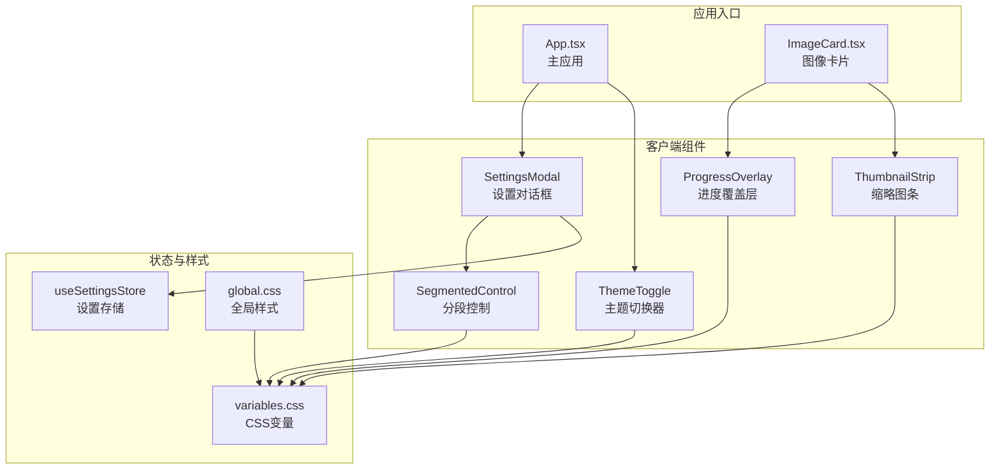
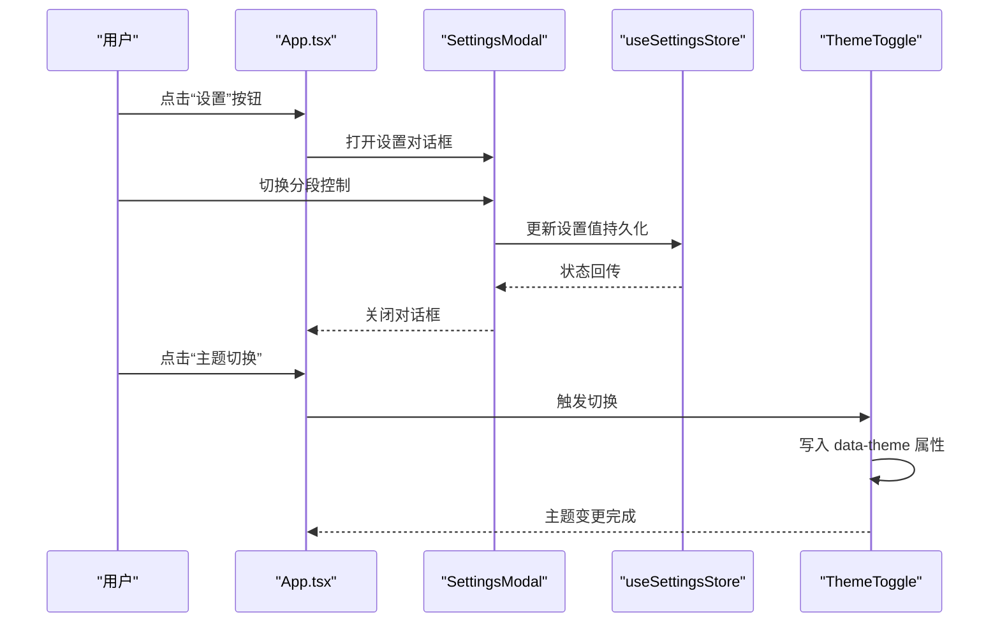
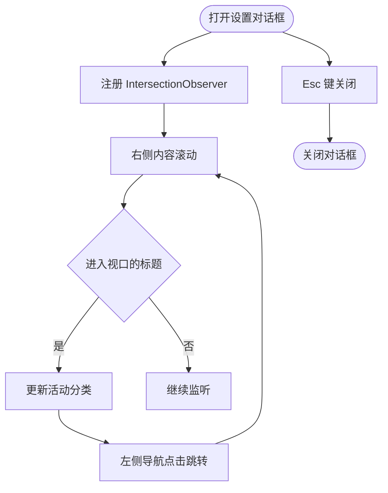
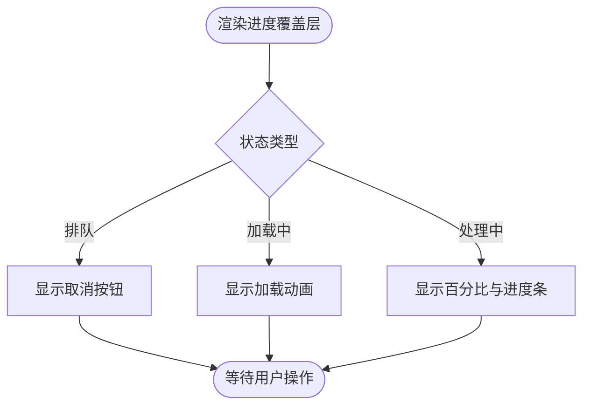
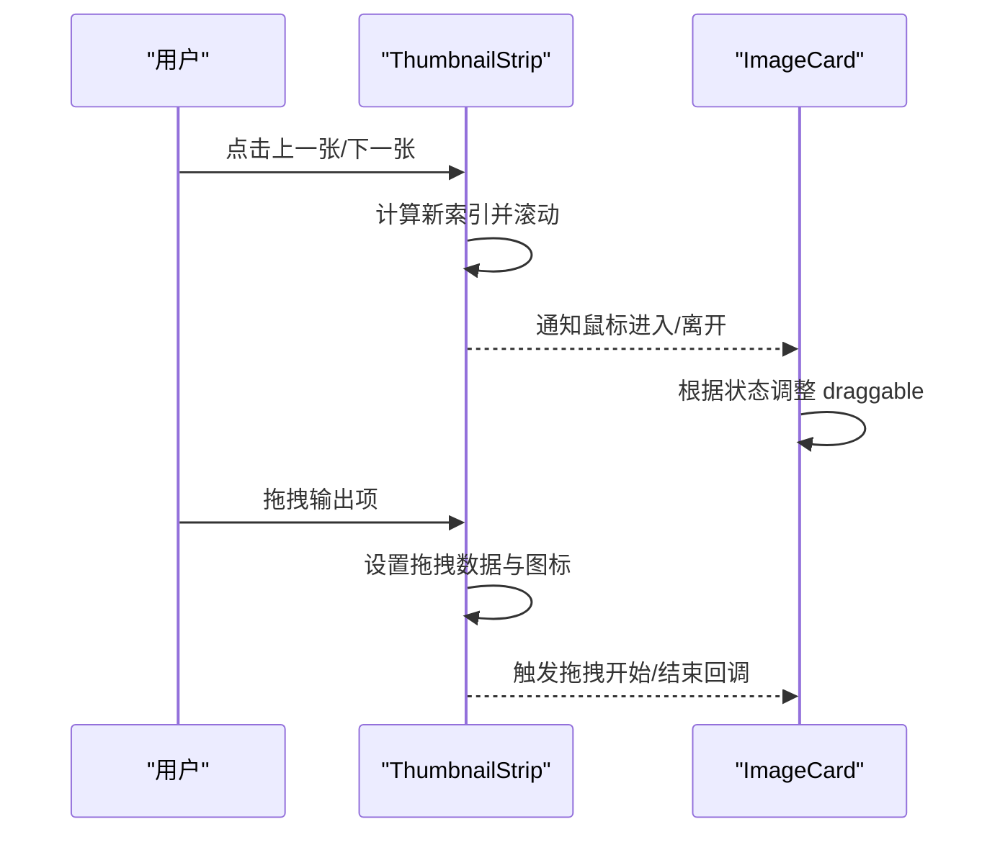
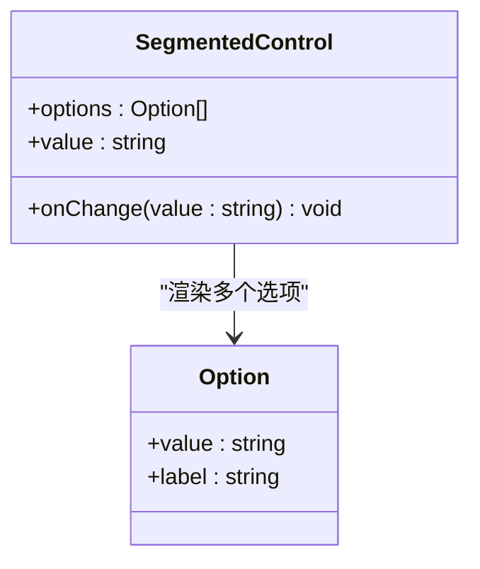
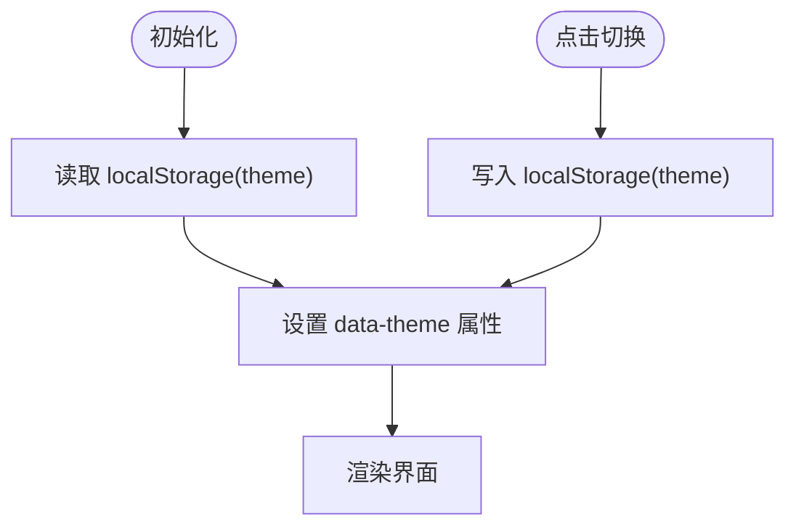
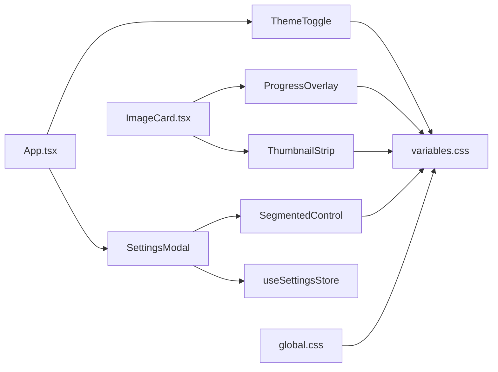

# 工具组件

<cite>
**本文引用的文件**
- [SettingsModal.tsx](file://client/src/components/SettingsModal.tsx)
- [ProgressOverlay.tsx](file://client/src/components/ProgressOverlay.tsx)
- [ThumbnailStrip.tsx](file://client/src/components/ThumbnailStrip.tsx)
- [SegmentedControl.tsx](file://client/src/components/SegmentedControl.tsx)
- [ThemeToggle.tsx](file://client/src/components/ThemeToggle.tsx)
- [useSettingsStore.ts](file://client/src/hooks/useSettingsStore.ts)
- [global.css](file://client/src/styles/global.css)
- [variables.css](file://client/src/styles/variables.css)
- [App.tsx](file://client/src/components/App.tsx)
- [ImageCard.tsx](file://client/src/components/ImageCard.tsx)
- [package.json](file://client/package.json)
</cite>

## 目录
1. [简介](#简介)
2. [项目结构](#项目结构)
3. [核心组件](#核心组件)
4. [架构总览](#架构总览)
5. [详细组件分析](#详细组件分析)
6. [依赖关系分析](#依赖关系分析)
7. [性能考量](#性能考量)
8. [故障排查指南](#故障排查指南)
9. [结论](#结论)
10. [附录](#附录)

## 简介
本文件系统性梳理 CorineKit Pix2Real 客户端中的工具组件，重点覆盖设置对话框（SettingsModal）、进度覆盖层（ProgressOverlay）、缩略图条（ThumbnailStrip）、分段控制（SegmentedControl）、主题切换器（ThemeToggle）。文档从架构与数据流角度解析这些组件如何协同提升用户体验，包括设置管理、进度可视化、输出结果导航与主题切换等能力；同时给出配置项、样式定制、事件处理、响应式设计、动画与无障碍等实践建议。

## 项目结构
客户端采用按功能模块组织的组件目录结构，工具组件集中位于 client/src/components 下，配合 hooks 与 styles 实现状态管理与主题样式。核心入口 App.tsx 将这些工具组件组合到主界面中，形成统一的交互体验。

图表来源
- [App.tsx:14-23](file://client/src/components/App.tsx#L14-L23)
- [SettingsModal.tsx:23-33](file://client/src/components/SettingsModal.tsx#L23-L33)
- [ProgressOverlay.tsx:9-12](file://client/src/components/ProgressOverlay.tsx#L9-L12)
- [ThumbnailStrip.tsx:34-42](file://client/src/components/ThumbnailStrip.tsx#L34-L42)
- [SegmentedControl.tsx:12-12](file://client/src/components/SegmentedControl.tsx#L12-L12)
- [ThemeToggle.tsx:4-17](file://client/src/components/ThemeToggle.tsx#L4-L17)
- [useSettingsStore.ts:16-30](file://client/src/hooks/useSettingsStore.ts#L16-L30)
- [global.css:1-224](file://client/src/styles/global.css#L1-L224)
- [variables.css:1-31](file://client/src/styles/variables.css#L1-L31)

章节来源
- [App.tsx:136-335](file://client/src/components/App.tsx#L136-L335)
- [package.json:11-23](file://client/package.json#L11-L23)

## 核心组件
- 设置对话框（SettingsModal）：提供工作流与会话两类设置项，支持键盘关闭、滚动联动高亮、分段控制选择等。
- 进度覆盖层（ProgressOverlay）：在任务排队、加载、处理阶段提供状态文本、百分比与进度条，支持取消排队。
- 缩略图条（ThumbnailStrip）：展示原图与生成结果，支持左右滚动、选中态高亮、拖拽输出、响应式尺寸。
- 分段控制（SegmentedControl）：通用的二态或多态按钮组，用于设置项的快速切换。
- 主题切换器（ThemeToggle）：基于本地存储的主题切换，写入根元素属性以驱动 CSS 变量切换。

章节来源
- [SettingsModal.tsx:23-238](file://client/src/components/SettingsModal.tsx#L23-L238)
- [ProgressOverlay.tsx:9-101](file://client/src/components/ProgressOverlay.tsx#L9-L101)
- [ThumbnailStrip.tsx:34-231](file://client/src/components/ThumbnailStrip.tsx#L34-L231)
- [SegmentedControl.tsx:12-48](file://client/src/components/SegmentedControl.tsx#L12-L48)
- [ThemeToggle.tsx:4-39](file://client/src/components/ThemeToggle.tsx#L4-L39)

## 架构总览
工具组件通过 hooks 与 CSS 变量实现解耦与可复用。设置相关状态由 useSettingsStore 统一管理，主题切换通过根元素属性与 CSS 变量生效。组件间通过 props 传递配置与回调，避免直接共享状态，降低耦合。

图表来源
- [App.tsx:186-203](file://client/src/components/App.tsx#L186-L203)
- [SettingsModal.tsx:23-33](file://client/src/components/SettingsModal.tsx#L23-L33)
- [useSettingsStore.ts:16-30](file://client/src/hooks/useSettingsStore.ts#L16-L30)
- [ThemeToggle.tsx:4-17](file://client/src/components/ThemeToggle.tsx#L4-L17)

## 详细组件分析

### 设置对话框（SettingsModal）
- 功能要点
  - 分类导航：工作流、会话两类设置区域，左侧导航联动右侧内容滚动高亮。
  - 交互机制：Esc 键关闭、IntersectionObserver 高亮当前节、点击遮罩关闭。
  - 设置项：反推模型（Qwen3VL/Florence/WD-14）、启动时行为（恢复/新建/欢迎页），均由分段控制驱动。
- 数据与状态
  - 使用 useSettingsStore 管理 settingsOpen、reversePromptModel、startupBehavior，并持久化到 localStorage。
- 样式与主题
  - 使用 CSS 变量（如 --color-bg、--color-border、--card-bg）适配明暗主题。
- 无障碍与可用性
  - 建议为导航按钮添加 aria-current 或 role="tab"，为设置项提供 label 与描述文本，确保键盘可达性。

图表来源
- [SettingsModal.tsx:44-67](file://client/src/components/SettingsModal.tsx#L44-L67)
- [SettingsModal.tsx:71-73](file://client/src/components/SettingsModal.tsx#L71-L73)
- [SettingsModal.tsx:136-158](file://client/src/components/SettingsModal.tsx#L136-L158)

章节来源
- [SettingsModal.tsx:23-238](file://client/src/components/SettingsModal.tsx#L23-L238)
- [useSettingsStore.ts:16-30](file://client/src/hooks/useSettingsStore.ts#L16-L30)

### 进度覆盖层（ProgressOverlay）
- 功能要点
  - 状态区分：排队（queued）、加载中（processing 且进度为 0）、处理中（processing 且进度 > 0）。
  - 交互：排队状态下显示“取消”按钮；处理中显示百分比与进度条。
  - 动画：加载状态使用点阵波形动画，进度条宽度带过渡。
- 事件与回调
  - onCancel 回调用于取消排队任务。
- 样式与主题
  - 使用 --color-overlay、--color-primary、--spacing-* 等变量，适配明暗主题。

图表来源
- [ProgressOverlay.tsx:9-12](file://client/src/components/ProgressOverlay.tsx#L9-L12)
- [ProgressOverlay.tsx:26-46](file://client/src/components/ProgressOverlay.tsx#L26-L46)
- [ProgressOverlay.tsx:55-81](file://client/src/components/ProgressOverlay.tsx#L55-L81)
- [ProgressOverlay.tsx:84-97](file://client/src/components/ProgressOverlay.tsx#L84-L97)

章节来源
- [ProgressOverlay.tsx:9-101](file://client/src/components/ProgressOverlay.tsx#L9-L101)

### 缩略图条（ThumbnailStrip）
- 功能要点
  - 响应式尺寸：根据容器宽度动态计算缩略图宽高、间距与箭头尺寸。
  - 导航与选中：左右箭头滚动，选中项自动居中；支持键盘导航（建议扩展）。
  - 输出拖拽：除原图外的输出项支持拖拽，自定义拖拽图标与数据传输格式。
  - 分割线：原图与首个结果之间插入垂直分隔线，增强视觉区隔。
- 事件与回调
  - onSelect：选中项变化；onOutputDragStart/onOutputDragEnd：输出拖拽开始/结束。
  - 鼠标进入/离开回调用于阻断卡片拖拽（在 ImageCard 中配合使用）。
- 性能与体验
  - 使用 ResizeObserver 监听容器与行元素尺寸变化，避免强制布局。
  - 选中项滚动采用 smooth 行为，提升视觉连贯性。

图表来源
- [ThumbnailStrip.tsx:70-78](file://client/src/components/ThumbnailStrip.tsx#L70-L78)
- [ThumbnailStrip.tsx:154-168](file://client/src/components/ThumbnailStrip.tsx#L154-L168)
- [ThumbnailStrip.tsx:119-120](file://client/src/components/ThumbnailStrip.tsx#L119-L120)
- [ThumbnailStrip.tsx:207-227](file://client/src/components/ThumbnailStrip.tsx#L207-L227)
- [ImageCard.tsx:109-117](file://client/src/components/ImageCard.tsx#L109-L117)

章节来源
- [ThumbnailStrip.tsx:34-231](file://client/src/components/ThumbnailStrip.tsx#L34-L231)
- [ImageCard.tsx:109-117](file://client/src/components/ImageCard.tsx#L109-L117)

### 分段控制（SegmentedControl）
- 功能要点
  - 选项渲染：根据 options 渲染按钮，当前值高亮显示。
  - 交互：点击切换值，触发 onChange 回调。
- 样式与主题
  - 使用 --color-bg、--color-border、--color-primary、--color-text-secondary 等变量，适配明暗主题。

图表来源
- [SegmentedControl.tsx:12-48](file://client/src/components/SegmentedControl.tsx#L12-L48)

章节来源
- [SegmentedControl.tsx:12-48](file://client/src/components/SegmentedControl.tsx#L12-L48)

### 主题切换器（ThemeToggle）
- 功能要点
  - 读取本地存储决定初始主题；切换时写入 documentElement 的 data-theme 属性；同步 localStorage。
  - 使用图标区分明暗主题，title 提供无障碍提示。
- 样式与主题
  - 通过 CSS 变量 [data-theme="dark"] 生效，全局影响组件颜色与背景。

图表来源
- [ThemeToggle.tsx:5-17](file://client/src/components/ThemeToggle.tsx#L5-L17)
- [variables.css:21-30](file://client/src/styles/variables.css#L21-L30)

章节来源
- [ThemeToggle.tsx:4-39](file://client/src/components/ThemeToggle.tsx#L4-L39)
- [variables.css:21-30](file://client/src/styles/variables.css#L21-L30)

## 依赖关系分析
- 组件依赖
  - SettingsModal 依赖 SegmentedControl 与 useSettingsStore。
  - ProgressOverlay 与 ThumbnailStrip 依赖 CSS 变量与全局样式。
  - ThemeToggle 依赖 localStorage 与 CSS 变量。
- 外部依赖
  - lucide-react 提供图标；zustand 提供轻量状态管理。
- 入口集成
  - App.tsx 在头部集成 ThemeToggle 与 SettingsModal，并在主内容区承载其他组件。

图表来源
- [App.tsx:14-23](file://client/src/components/App.tsx#L14-L23)
- [SettingsModal.tsx:3-4](file://client/src/components/SettingsModal.tsx#L3-L4)
- [ImageCard.tsx:8-9](file://client/src/components/ImageCard.tsx#L8-L9)
- [package.json:11-15](file://client/package.json#L11-L15)

章节来源
- [App.tsx:136-335](file://client/src/components/App.tsx#L136-L335)
- [package.json:11-23](file://client/package.json#L11-L23)

## 性能考量
- 渲染优化
  - SettingsModal 使用 IntersectionObserver 仅在可见标题进入视口时更新活动项，减少不必要的重排。
  - ThumbnailStrip 使用 ResizeObserver 监听尺寸变化，避免强制布局与重复计算。
- 动画与过渡
  - ProgressOverlay 百分比与进度条使用过渡动画，提升感知流畅度。
  - global.css 提供多种动画（如闪烁、脉冲、骨架屏），建议在长流程中按需启用。
- 事件处理
  - SettingsModal 对 Esc 键与遮罩点击进行事件绑定与清理，避免内存泄漏。
  - ThumbnailStrip 对拖拽事件设置 dataTransfer 自定义图标，减少额外资源请求。

章节来源
- [SettingsModal.tsx:44-67](file://client/src/components/SettingsModal.tsx#L44-L67)
- [ThumbnailStrip.tsx:48-61](file://client/src/components/ThumbnailStrip.tsx#L48-L61)
- [ProgressOverlay.tsx:94-95](file://client/src/components/ProgressOverlay.tsx#L94-L95)
- [global.css:56-105](file://client/src/styles/global.css#L56-L105)

## 故障排查指南
- 设置无法保存或主题不生效
  - 检查 localStorage 是否可写；确认 ThemeToggle 是否正确写入 data-theme；核对 variables.css 的暗色变量是否完整。
- 设置对话框无法关闭
  - 确认 Esc 键事件是否被其他元素拦截；检查遮罩点击事件是否正常触发。
- 缩略图条不滚动或选中态异常
  - 确认容器与行元素的 ResizeObserver 是否正常；检查选中索引与 children 数量是否一致。
- 进度覆盖层不显示百分比
  - 确认状态与进度参数传递是否正确；检查 CSS 变量是否被覆盖。

章节来源
- [ThemeToggle.tsx:9-17](file://client/src/components/ThemeToggle.tsx#L9-L17)
- [SettingsModal.tsx:36-41](file://client/src/components/SettingsModal.tsx#L36-L41)
- [ThumbnailStrip.tsx:63-68](file://client/src/components/ThumbnailStrip.tsx#L63-L68)
- [ProgressOverlay.tsx:9-12](file://client/src/components/ProgressOverlay.tsx#L9-L12)

## 结论
上述工具组件围绕“设置管理、进度可视化、输出导航、主题切换”构建了清晰的用户体验闭环。通过 hooks 与 CSS 变量实现低耦合与高可维护性，结合响应式与动画优化，满足复杂工作流场景下的高效操作与良好感知。建议在后续迭代中进一步增强无障碍属性与键盘导航，完善长流程的骨架屏与加载反馈。

## 附录
- 使用示例与集成指南
  - 在 App.tsx 中引入并渲染 SettingsModal 与 ThemeToggle，作为全局入口控件。
  - 在 ImageCard 中按需渲染 ProgressOverlay 与 ThumbnailStrip，结合任务状态与输出列表。
  - 通过 SegmentedControl 包装设置项，统一交互风格与主题适配。
- 响应式设计
  - 利用 CSS 变量与媒体查询，确保组件在不同屏幕尺寸下保持一致的视觉与交互体验。
- 动画与过渡
  - 借助 global.css 中的动画定义，为关键状态切换提供平滑过渡。
- 无障碍访问
  - 为按钮与导航添加 aria-label/title；保证键盘可达性；为加载状态提供替代文本。

章节来源
- [App.tsx:186-203](file://client/src/components/App.tsx#L186-L203)
- [ImageCard.tsx:554-560](file://client/src/components/ImageCard.tsx#L554-L560)
- [ImageCard.tsx:769-775](file://client/src/components/ImageCard.tsx#L769-L775)
- [global.css:160-171](file://client/src/styles/global.css#L160-L171)