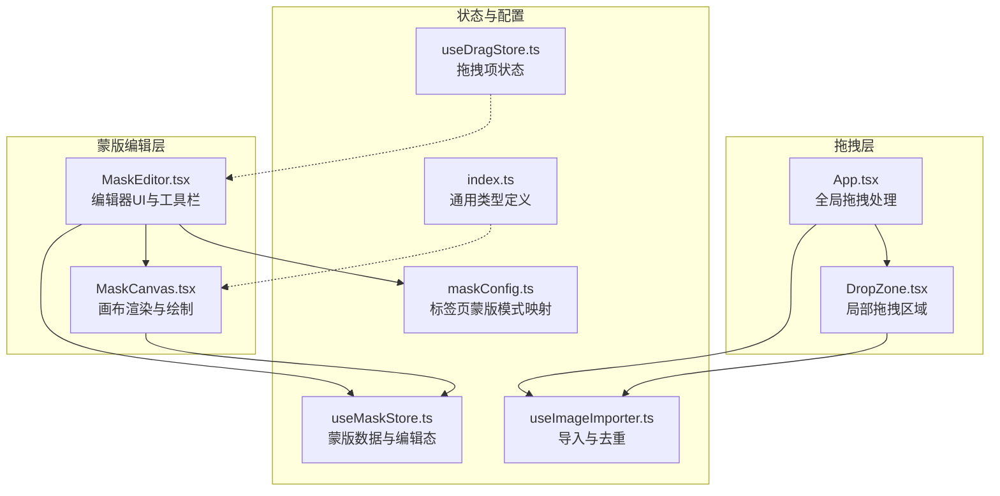
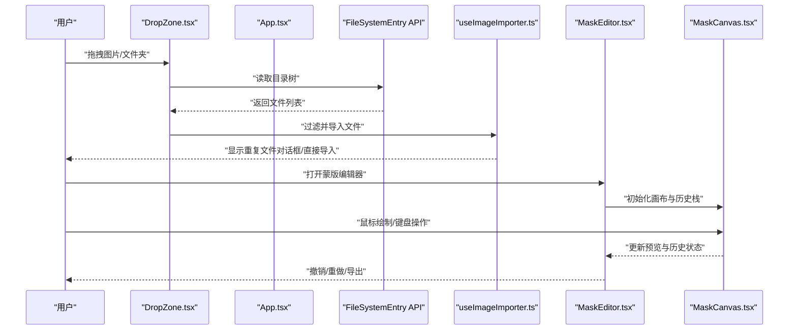
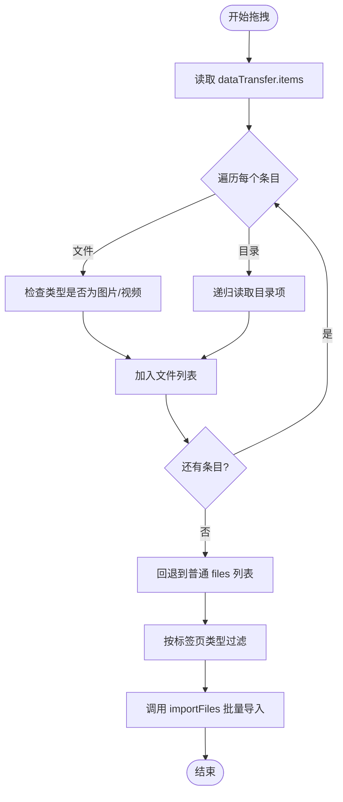
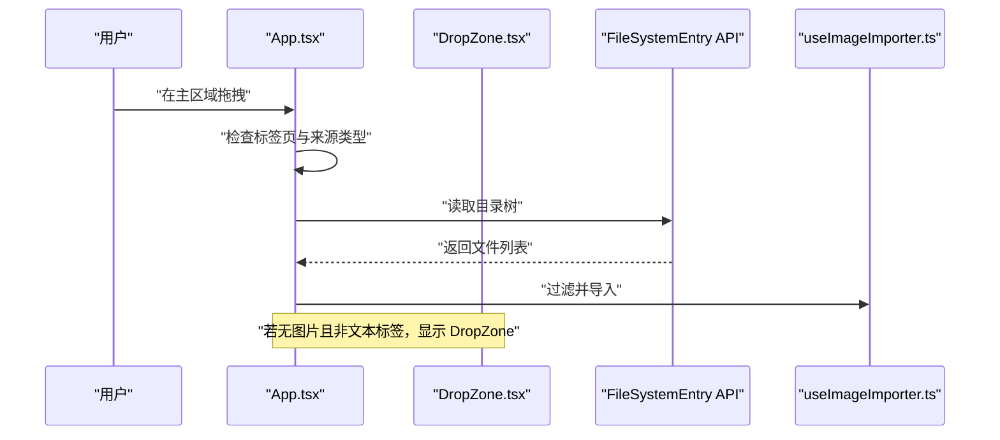
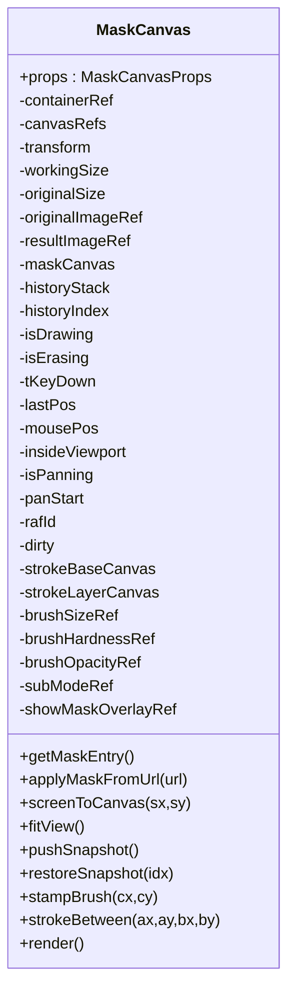
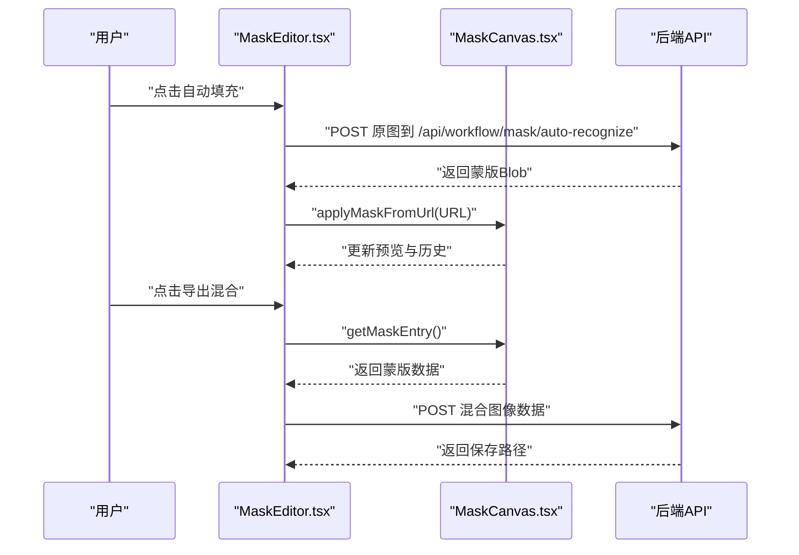
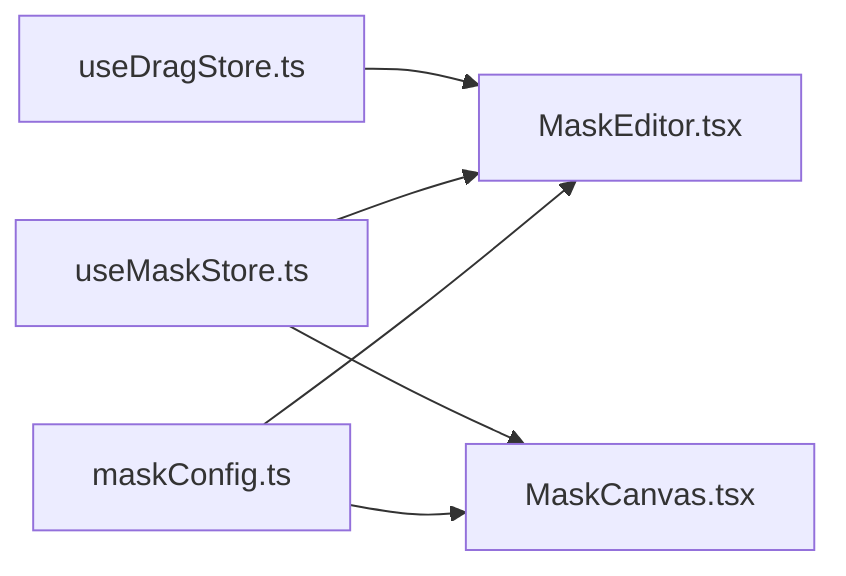
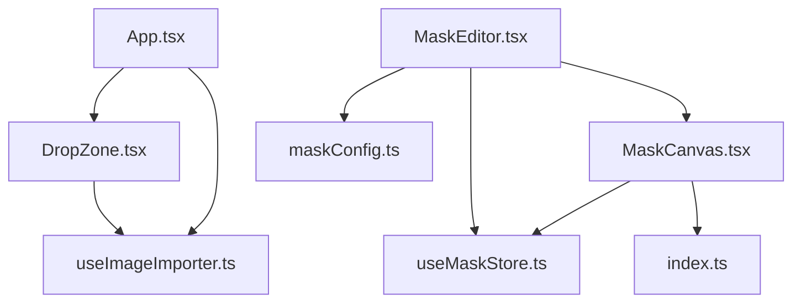

# 拖拽界面组件

<cite>
**本文引用的文件**
- [DropZone.tsx](file://client/src/components/DropZone.tsx)
- [MaskCanvas.tsx](file://client/src/components/MaskCanvas.tsx)
- [MaskEditor.tsx](file://client/src/components/MaskEditor.tsx)
- [App.tsx](file://client/src/components/App.tsx)
- [useDragStore.ts](file://client/src/hooks/useDragStore.ts)
- [useMaskStore.ts](file://client/src/hooks/useMaskStore.ts)
- [maskConfig.ts](file://client/src/config/maskConfig.ts)
- [useImageImporter.ts](file://client/src/hooks/useImageImporter.ts)
- [index.ts](file://client/src/types/index.ts)
</cite>

## 目录
1. [简介](#简介)
2. [项目结构](#项目结构)
3. [核心组件](#核心组件)
4. [架构总览](#架构总览)
5. [详细组件分析](#详细组件分析)
6. [依赖关系分析](#依赖关系分析)
7. [性能考虑](#性能考虑)
8. [故障排查指南](#故障排查指南)
9. [结论](#结论)
10. [附录](#附录)

## 简介
本技术文档聚焦于拖拽界面组件，涵盖以下能力：
- DropZone 组件的拖拽逻辑：文件拖放检测、类型验证、目录递归读取、批量上传处理。
- MaskCanvas 与 MaskEditor 的画布操作：蒙版绘制、编辑工具、历史记录与撤销重做、智能分割与自动填充。
- 拖拽事件的完整处理流程：dragenter、dragover、dragleave、drop 的协调处理。
- 交互设计：画笔工具、精度调节、键盘快捷键、鼠标滚轮缩放与画笔参数联动。
- 无障碍与键盘导航：焦点管理、键盘事件处理、可访问性支持。
- 文件系统集成：路径解析、文件验证、跨域资源加载。
- 性能优化：离屏画布、请求动画帧、历史栈限制、工作尺寸裁剪。

## 项目结构
本项目前端位于 client/src，拖拽与蒙版编辑相关的核心文件如下：
- 拖拽区域与全局拖拽处理：DropZone.tsx、App.tsx
- 蒙版编辑器与画布：MaskEditor.tsx、MaskCanvas.tsx
- 状态管理：useDragStore.ts、useMaskStore.ts
- 配置与类型：maskConfig.ts、index.ts
- 导入与去重：useImageImporter.ts

**图表来源**
- [App.tsx:61-197](file://client/src/components/App.tsx#L61-L197)
- [DropZone.tsx:40-181](file://client/src/components/DropZone.tsx#L40-L181)
- [MaskEditor.tsx:141-375](file://client/src/components/MaskEditor.tsx#L141-L375)
- [MaskCanvas.tsx:39-677](file://client/src/components/MaskCanvas.tsx#L39-L677)
- [useDragStore.ts:1-17](file://client/src/hooks/useDragStore.ts#L1-L17)
- [useMaskStore.ts:1-51](file://client/src/hooks/useMaskStore.ts#L1-L51)
- [maskConfig.ts:1-21](file://client/src/config/maskConfig.ts#L1-L21)
- [useImageImporter.ts:1-48](file://client/src/hooks/useImageImporter.ts#L1-L48)
- [index.ts:1-76](file://client/src/types/index.ts#L1-L76)

**章节来源**
- [App.tsx:61-197](file://client/src/components/App.tsx#L61-L197)
- [DropZone.tsx:40-181](file://client/src/components/DropZone.tsx#L40-L181)
- [MaskEditor.tsx:141-375](file://client/src/components/MaskEditor.tsx#L141-L375)
- [MaskCanvas.tsx:39-677](file://client/src/components/MaskCanvas.tsx#L39-L677)
- [useDragStore.ts:1-17](file://client/src/hooks/useDragStore.ts#L1-L17)
- [useMaskStore.ts:1-51](file://client/src/hooks/useMaskStore.ts#L1-L51)
- [maskConfig.ts:1-21](file://client/src/config/maskConfig.ts#L1-L21)
- [useImageImporter.ts:1-48](file://client/src/hooks/useImageImporter.ts#L1-L48)
- [index.ts:1-76](file://client/src/types/index.ts#L1-L76)

## 核心组件
- DropZone：提供局部拖拽区域，支持图片/视频文件与目录拖放，进行类型过滤与批量导入。
- MaskEditor：蒙版编辑器，提供工具栏、画笔参数、撤销重做、清空/反转、自动填充、导出混合结果。
- MaskCanvas：核心画布，使用离屏画布与多层合成，实现非累积软笔刷、平移缩放、实时预览、历史记录。
- App：全局拖拽处理，协调主区域拖拽与局部 DropZone 的优先级，避免事件冲突。
- 状态与配置：useDragStore、useMaskStore、maskConfig、useImageImporter、types 定义支撑拖拽与蒙版编辑的数据流。

**章节来源**
- [DropZone.tsx:40-181](file://client/src/components/DropZone.tsx#L40-L181)
- [MaskEditor.tsx:141-375](file://client/src/components/MaskEditor.tsx#L141-L375)
- [MaskCanvas.tsx:39-677](file://client/src/components/MaskCanvas.tsx#L39-L677)
- [App.tsx:61-197](file://client/src/components/App.tsx#L61-L197)
- [useDragStore.ts:1-17](file://client/src/hooks/useDragStore.ts#L1-L17)
- [useMaskStore.ts:1-51](file://client/src/hooks/useMaskStore.ts#L1-L51)
- [maskConfig.ts:1-21](file://client/src/config/maskConfig.ts#L1-L21)
- [useImageImporter.ts:1-48](file://client/src/hooks/useImageImporter.ts#L1-L48)
- [index.ts:1-76](file://client/src/types/index.ts#L1-L76)

## 架构总览
拖拽与蒙版编辑的整体流程：
- 用户在 DropZone 或 App 主区域进行拖拽，系统通过 WebKit FileSystem API 递归读取目录，过滤图片/视频类型。
- 过滤后的文件交由导入器处理，解决重复命名问题后批量加入工作区。
- 在需要蒙版编辑的标签页，打开 MaskEditor，MaskCanvas 初始化离屏画布、历史栈与渲染管线。
- 用户通过鼠标/键盘进行绘制、平移、缩放与参数调节；编辑结果可导出或用于后续工作流。

**图表来源**
- [DropZone.tsx:50-82](file://client/src/components/DropZone.tsx#L50-L82)
- [App.tsx:157-197](file://client/src/components/App.tsx#L157-L197)
- [useImageImporter.ts:15-28](file://client/src/hooks/useImageImporter.ts#L15-L28)
- [MaskEditor.tsx:141-375](file://client/src/components/MaskEditor.tsx#L141-L375)
- [MaskCanvas.tsx:403-454](file://client/src/components/MaskCanvas.tsx#L403-L454)

## 详细组件分析

### DropZone 组件：拖拽逻辑与批量上传
- 功能要点
  - 支持图片/视频文件与目录拖放，使用 WebKit FileSystemEntry API 递归读取目录。
  - 类型过滤：根据活动标签页限制仅接受图片或视频。
  - 批量导入：将过滤后的文件集合传给导入器，触发工作区更新。
  - 事件协调：阻止事件冒泡至 App 主区域，避免重复处理。
- 关键实现
  - 递归读取目录：遍历 FileSystemEntry，按需展开子目录，收集符合类型的文件。
  - 类型判断：基于 MIME 前缀 image/ 与 video/。
  - 事件处理：onDrop/onDragOver/onDragLeave，配合本地状态控制视觉反馈。
  - 输入框回退：当拖拽不可用时，提供文件选择输入框。

**图表来源**
- [DropZone.tsx:15-38](file://client/src/components/DropZone.tsx#L15-L38)
- [DropZone.tsx:50-82](file://client/src/components/DropZone.tsx#L50-L82)
- [DropZone.tsx:44-48](file://client/src/components/DropZone.tsx#L44-L48)

**章节来源**
- [DropZone.tsx:40-181](file://client/src/components/DropZone.tsx#L40-L181)

### App 全局拖拽：主区域与局部区域协调
- 功能要点
  - 主区域拖拽：仅在特定标签页启用，过滤来自卡片拖拽的事件，避免误触发。
  - 与 DropZone 协同：当工作区内无图片且非文本类标签时，显示全屏 DropZone。
  - 覆盖层提示：在有文件拖入但已有图片时，显示全屏覆盖提示层。
- 关键实现
  - 事件拦截：通过 dataTransfer.types 识别来源，必要时阻止默认行为。
  - 递归读取与类型过滤：与 DropZone 一致的处理流程。
  - 状态同步：与 DropZone 共享 isDragOver 状态，统一视觉反馈。

**图表来源**
- [App.tsx:138-197](file://client/src/components/App.tsx#L138-L197)
- [App.tsx:32-59](file://client/src/components/App.tsx#L32-L59)

**章节来源**
- [App.tsx:61-197](file://client/src/components/App.tsx#L61-L197)

### MaskCanvas：画布渲染与绘制管线
- 功能要点
  - 多画布分层：前景层、遮罩层、光标层，分别负责不同渲染任务。
  - 离屏画布：使用 OffscreenCanvas 降低主线程压力，提升绘制性能。
  - 非累积软笔刷：通过 strokeBase 与 strokeLayer 两层合成，避免边缘硬化。
  - 历史记录：固定长度历史栈，支持撤销与重做。
  - 缩放与平移：基于 transform 矩阵，支持滚轮缩放与中键平移。
  - 实时预览：requestAnimationFrame 驱动渲染循环，响应式更新。
- 关键实现
  - 初始化：加载原图与结果图（模式B），计算工作尺寸，创建历史快照。
  - 渲染：根据模式A/B采用不同合成策略，支持子模式叠加效果。
  - 绘制：鼠标移动/按下触发 strokeBetween 描边，stampBrush 应用径向渐变笔刷。
  - 键鼠交互：键盘 Shift 切换擦除、F 适配视图、T 切换透明度调节；滚轮缩放与画笔参数联动。

**图表来源**
- [MaskCanvas.tsx:17-54](file://client/src/components/MaskCanvas.tsx#L17-L54)
- [MaskCanvas.tsx:109-150](file://client/src/components/MaskCanvas.tsx#L109-L150)
- [MaskCanvas.tsx:180-201](file://client/src/components/MaskCanvas.tsx#L180-L201)
- [MaskCanvas.tsx:234-286](file://client/src/components/MaskCanvas.tsx#L234-L286)
- [MaskCanvas.tsx:306-401](file://client/src/components/MaskCanvas.tsx#L306-L401)

**章节来源**
- [MaskCanvas.tsx:39-677](file://client/src/components/MaskCanvas.tsx#L39-L677)

### MaskEditor：工具栏与交互设计
- 功能要点
  - 工具栏：切换子模式、蒙版可见、清空、反转、撤销/重做按钮。
  - 参数面板：画笔大小、硬度、不透明度滑块，Alt+滚轮调节大小，T+滚轮调节不透明度。
  - 自动填充：调用后端接口进行智能识别，生成蒙版并应用到画布。
  - 导出混合：将原图与结果图按蒙版混合，导出 PNG 文件。
  - 键盘快捷键：Ctrl+Z/Ctrl+Y 撤销/重做，F 适配视图，T 切换透明度调节。
- 关键实现
  - 历史状态回调：将 canUndo/canRedo 传递给父组件，驱动按钮可用性。
  - 保存蒙版：关闭编辑器时将当前蒙版写入状态存储。
  - 自动填充：构造表单数据，POST 至 /api/workflow/mask/auto-recognize，接收 Blob 并应用。
  - 导出对话框：组合原图与结果图，按蒙版裁剪，转换为 Blob 并提交到后端。

**图表来源**
- [MaskEditor.tsx:196-235](file://client/src/components/MaskEditor.tsx#L196-L235)
- [MaskEditor.tsx:35-108](file://client/src/components/MaskEditor.tsx#L35-L108)
- [MaskCanvas.tsx:124-149](file://client/src/components/MaskCanvas.tsx#L124-L149)

**章节来源**
- [MaskEditor.tsx:141-375](file://client/src/components/MaskEditor.tsx#L141-L375)

### 状态与配置：useDragStore、useMaskStore、maskConfig
- useDragStore：维护当前拖拽项（卡片或输出），供拖拽流程使用。
- useMaskStore：维护蒙版数据与编辑器状态，提供打开/关闭编辑器、设置/获取蒙版等方法。
- maskConfig：将标签页 ID 映射到蒙版模式（A/B/none），并提供蒙版键生成函数。

**图表来源**
- [useDragStore.ts:1-17](file://client/src/hooks/useDragStore.ts#L1-L17)
- [useMaskStore.ts:1-51](file://client/src/hooks/useMaskStore.ts#L1-L51)
- [maskConfig.ts:1-21](file://client/src/config/maskConfig.ts#L1-L21)

**章节来源**
- [useDragStore.ts:1-17](file://client/src/hooks/useDragStore.ts#L1-L17)
- [useMaskStore.ts:1-51](file://client/src/hooks/useMaskStore.ts#L1-L51)
- [maskConfig.ts:1-21](file://client/src/config/maskConfig.ts#L1-L21)

## 依赖关系分析
- 组件耦合
  - DropZone 与 App：DropZone 作为局部区域，App 控制全局拖拽优先级与覆盖层提示。
  - MaskEditor 与 MaskCanvas：编辑器负责 UI 与工具，画布负责渲染与绘制，二者通过回调与信号通信。
  - useMaskStore：被 MaskEditor 与 MaskCanvas 共同依赖，承载蒙版数据与编辑态。
- 外部依赖
  - FileSystemEntry API：用于目录递归读取。
  - OffscreenCanvas：用于高性能绘制与历史快照。
  - 请求动画帧：用于平滑渲染。
  - 后端 API：自动识别与导出混合。

**图表来源**
- [DropZone.tsx:40-181](file://client/src/components/DropZone.tsx#L40-L181)
- [App.tsx:61-197](file://client/src/components/App.tsx#L61-L197)
- [MaskEditor.tsx:141-375](file://client/src/components/MaskEditor.tsx#L141-L375)
- [MaskCanvas.tsx:39-677](file://client/src/components/MaskCanvas.tsx#L39-L677)
- [useMaskStore.ts:1-51](file://client/src/hooks/useMaskStore.ts#L1-L51)
- [maskConfig.ts:1-21](file://client/src/config/maskConfig.ts#L1-L21)
- [index.ts:1-76](file://client/src/types/index.ts#L1-L76)

**章节来源**
- [DropZone.tsx:40-181](file://client/src/components/DropZone.tsx#L40-L181)
- [App.tsx:61-197](file://client/src/components/App.tsx#L61-L197)
- [MaskEditor.tsx:141-375](file://client/src/components/MaskEditor.tsx#L141-L375)
- [MaskCanvas.tsx:39-677](file://client/src/components/MaskCanvas.tsx#L39-L677)
- [useMaskStore.ts:1-51](file://client/src/hooks/useMaskStore.ts#L1-L51)
- [maskConfig.ts:1-21](file://client/src/config/maskConfig.ts#L1-L21)
- [index.ts:1-76](file://client/src/types/index.ts#L1-L76)

## 性能考虑
- 离屏画布与多层合成：减少主线程阻塞，提高绘制效率。
- 历史栈限制：固定最大历史数量，避免内存膨胀。
- 工作尺寸裁剪：长边超过阈值时按比例缩放，降低像素量。
- 请求动画帧：统一渲染循环，避免频繁重排。
- 大文件处理：自动识别与导出阶段采用 Blob/ArrayBuffer 分块处理，降低内存峰值。
- 事件监听稳定化：通过 useRef 与稳定回调，避免每次渲染重新绑定监听器。

**章节来源**
- [MaskCanvas.tsx:7-15](file://client/src/components/MaskCanvas.tsx#L7-L15)
- [MaskCanvas.tsx:180-190](file://client/src/components/MaskCanvas.tsx#L180-L190)
- [MaskEditor.tsx:88-92](file://client/src/components/MaskEditor.tsx#L88-L92)

## 故障排查指南
- 拖拽无效或重复处理
  - 检查 App 是否正确拦截卡片拖拽来源类型，确保未进入主区域处理。
  - 确认 DropZone 的事件阻止与状态同步正常。
- 目录拖放失败
  - 确保浏览器支持 FileSystemEntry API，检查递归读取逻辑与类型过滤。
- 蒙版编辑无响应
  - 确认 MaskCanvas 初始化完成（原图加载成功），事件层已获得焦点。
  - 检查键盘事件监听与状态切换（Shift/Esc/F/T）。
- 自动填充失败
  - 检查网络请求与后端接口状态，确认返回 Blob 可用。
- 导出混合异常
  - 确认蒙版数据存在且与工作尺寸匹配，导出阶段的图像合成步骤正确。

**章节来源**
- [App.tsx:138-197](file://client/src/components/App.tsx#L138-L197)
- [DropZone.tsx:50-82](file://client/src/components/DropZone.tsx#L50-L82)
- [MaskCanvas.tsx:403-454](file://client/src/components/MaskCanvas.tsx#L403-L454)
- [MaskEditor.tsx:196-235](file://client/src/components/MaskEditor.tsx#L196-L235)

## 结论
该拖拽界面组件通过 DropZone 与 App 的协同，实现了对图片/视频文件与目录的可靠拖放与批量导入；结合 MaskEditor 与 MaskCanvas 的高性能画布渲染与历史管理，提供了流畅的蒙版绘制体验。通过键盘与鼠标交互、自动填充与导出混合等功能，满足了从素材导入到精细编辑的完整工作流需求。同时，项目在性能与可访问性方面进行了多项优化，适合在复杂场景下稳定运行。

## 附录
- 无障碍与键盘导航
  - MaskCanvas 在初始化时为事件层设置 tabIndex 并主动 focus，确保键盘快捷键立即生效。
  - 支持常用快捷键：F 适配视图、T 切换透明度调节、Ctrl+Z/Ctrl+Y 撤销/重做。
- 文件系统集成
  - 使用 FileSystemEntry API 递归读取目录，结合 MIME 类型过滤，保证只处理图片/视频。
  - 跨域资源加载：蒙版与图像均设置 crossOrigin，避免污染画布。
- 类型与数据结构
  - ImageItem、TaskInfo、WSMessage 等类型定义，支撑前端数据一致性与扩展性。

**章节来源**
- [MaskCanvas.tsx:447-449](file://client/src/components/MaskCanvas.tsx#L447-L449)
- [MaskEditor.tsx:237-251](file://client/src/components/MaskEditor.tsx#L237-L251)
- [index.ts:1-76](file://client/src/types/index.ts#L1-L76)