# ZIT快出侧边栏

<cite>
**本文档引用的文件**
- [ZITSidebar.tsx](file://client/src/components/ZITSidebar.tsx)
- [ModelSelect.tsx](file://client/src/components/ModelSelect.tsx)
- [PromptContextMenu.tsx](file://client/src/components/PromptContextMenu.tsx)
- [useWorkflowStore.ts](file://client/src/hooks/useWorkflowStore.ts)
- [useModelMetadata.ts](file://client/src/hooks/useModelMetadata.ts)
- [sessionService.ts](file://client/src/services/sessionService.ts)
- [index.ts](file://client/src/types/index.ts)
- [global.css](file://client/src/styles/global.css)
- [variables.css](file://client/src/styles/variables.css)
- [Text2ImgSidebar.tsx](file://client/src/components/Text2ImgSidebar.tsx)
- [Workflow9Adapter.ts](file://server/src/adapters/Workflow9Adapter.ts)
- [workflow.ts](file://server/src/routes/workflow.ts)
</cite>

## 更新摘要
**变更内容**
- **方面比例按钮系统重构**：采用52x52像素方形按钮设计，包含视觉比例指示器和动画效果
- **采样算法设置间距标准化**：统一了采样器和调度器按钮的间距配置
- **与Text2ImgSidebar UI对齐**：实现了与Text2ImgSidebar一致的比例按钮设计和交互体验
- **视觉比例指示器**：每个比例按钮包含精确的视觉比例矩形指示器
- **动画效果优化**：增强了按钮激活状态的颜色过渡动画

## 目录
1. [简介](#简介)
2. [项目结构](#项目结构)
3. [核心组件](#核心组件)
4. [架构概览](#架构概览)
5. [详细组件分析](#详细组件分析)
6. [依赖分析](#依赖分析)
7. [性能考虑](#性能考虑)
8. [故障排除指南](#故障排除指南)
9. [结论](#结论)
10. [附录](#附录)

## 简介

ZIT快出侧边栏组件是 CorineKit Pix2Real 项目中的核心功能模块，专门用于实现快速图像生成的优化策略。该组件基于 ZIT 工作流，提供了直观的用户界面来配置和执行高质量的图像生成任务。

**更新** 该组件已采用全新的方面比例按钮系统，实现了与 Text2ImgSidebar 一致的 UI 设计。新的比例按钮采用52x52像素方形设计，包含精确的视觉比例指示器和流畅的动画效果，显著提升了用户交互体验。

**增强** 最新版本的组件集成了强大的 LoRA 槽位系统，支持最多5个独立的 LoRA 槽位，每个槽位都可以独立启用/禁用、选择模型和调节权重。服务器端实现了智能的 LoRA 链式连接机制，能够根据启用状态动态重连 LoRA 节点。

**新增** 本版本特别引入了 LoRA 风格切换开关，将传统的复选框替换为纯 CSS 实现的圆形切换开关，具有平滑的过渡动画和视觉反馈，提升了用户的交互体验。

本组件的主要特点包括：
- **统一卡片布局**：采用新的卡片设计系统，实现与 Text2ImgSidebar 一致的视觉体验
- **52x52像素比例按钮**：全新的方形按钮设计，包含视觉比例指示器
- **流畅动画效果**：按钮激活状态的颜色过渡动画
- **标准化间距配置**：统一的按钮间距和布局规范
- **快速图像生成**：通过优化的参数配置实现高效的图像生成流程
- **批量处理能力**：支持单次生成多个图像实例
- **智能参数管理**：提供预设参数配置和工作流模板选择
- **实时进度监控**：完整的任务状态跟踪和进度显示
- **提示词辅助工具**：集成 AI 助手进行提示词优化和转换
- **增强模型管理**：全新的 ModelSelect 组件提供专业的模型选择界面
- **右键菜单机制**：基于 PromptContextMenu 的触发词插入功能
- **LoRA 状态提醒**：通过 AlertTriangle 图标提示未使用的触发词
- **优化的交互体验**：简化的触发词管理流程
- **多槽位 LoRA 支持**：最多5个独立的 LoRA 槽位，每个槽位独立配置
- **动态 LoRA 链式连接**：智能的 LoRA 节点重连机制
- **AuraFlow Shift 算法**：高级采样算法偏移功能
- **纯 CSS 切换开关**：平滑过渡动画和视觉反馈的圆形切换开关
- **精确文本选择**：基于 useRef 的选择参考系统，实现精确的文本选择状态管理

## 项目结构

ZITSidebar 组件位于客户端前端代码结构中，与服务器端工作流适配器和模型元数据管理紧密协作，并集成了新的 PromptContextMenu 组件：

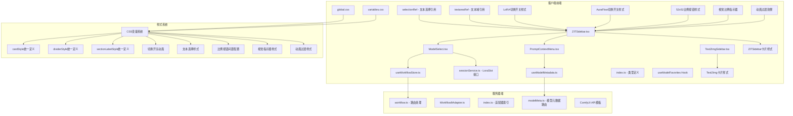

**图表来源**
- [ZITSidebar.tsx:1-944](file://client/src/components/ZITSidebar.tsx#L1-L944)
- [ModelSelect.tsx:1-1005](file://client/src/components/ModelSelect.tsx#L1-L1005)
- [PromptContextMenu.tsx:1-661](file://client/src/components/PromptContextMenu.tsx#L1-L661)
- [useWorkflowStore.ts:1-690](file://client/src/hooks/useWorkflowStore.ts#L1-L690)
- [useModelMetadata.ts:1-215](file://client/src/hooks/useModelMetadata.ts#L1-L215)
- [sessionService.ts:4-8](file://client/src/services/sessionService.ts#L4-L8)
- [Text2ImgSidebar.tsx:220-419](file://client/src/components/Text2ImgSidebar.tsx#L220-L419)

**章节来源**
- [ZITSidebar.tsx:1-944](file://client/src/components/ZITSidebar.tsx#L1-L944)
- [ModelSelect.tsx:1-1005](file://client/src/components/ModelSelect.tsx#L1-L1005)
- [PromptContextMenu.tsx:1-661](file://client/src/components/PromptContextMenu.tsx#L1-L661)
- [useWorkflowStore.ts:1-690](file://client/src/hooks/useWorkflowStore.ts#L1-L690)
- [useModelMetadata.ts:1-215](file://client/src/hooks/useModelMetadata.ts#L1-L215)

## 核心组件

### ZITSidebar 主要功能特性

#### 52x52像素比例按钮系统
**更新** 采用全新的方面比例按钮设计，实现与 Text2ImgSidebar 一致的视觉体验：

- **方形按钮设计**：每个比例按钮采用52x52像素的正方形设计
- **视觉比例指示器**：按钮内部包含精确的视觉比例矩形，显示实际宽高比
- **流畅动画效果**：激活状态的颜色过渡动画，使用 `transition: 'border-color 0.12s'`
- **统一间距配置**：按钮之间使用6像素的统一间距
- **精确尺寸计算**：根据比例计算矩形的宽度和高度，确保视觉准确性
- **响应式布局**：支持弹性布局和自动换行，适应不同屏幕尺寸

#### 统一卡片布局系统
**更新** 采用新的卡片布局设计，实现与 Text2ImgSidebar 一致的视觉体验：

- **统一卡片样式**：使用 `cardStyle` 定义所有卡片的统一外观
- **分隔线设计**：使用 `dividerStyle` 创建一致的分隔效果
- **标题样式**：使用 `sectionLabelStyle` 确保标题样式的一致性
- **间距一致性**：所有卡片使用相同的内边距和外边距
- **视觉层次**：通过统一的边框、阴影和背景色建立清晰的视觉层次
- **响应式设计**：适配不同屏幕尺寸和设备类型

#### 纯 CSS 切换开关系统
**新增** 采用纯 CSS 实现的圆形切换开关，替代传统复选框：

- **LoRA 启用开关**：每个 LoRA 槽位都有独立的圆形切换开关
- **AuraFlow Shift 开关**：采样算法偏移功能的专用切换开关
- **平滑过渡动画**：使用 `transition: 'background-color 0.2s ease'` 实现颜色过渡
- **圆形视觉反馈**：使用 `borderRadius: '50%'` 创建完美的圆形外观
- **阴影效果**：使用 `boxShadow: '0 1px 3px rgba(0,0,0,0.2)'` 增加立体感
- **状态指示**：启用状态下使用 `var(--color-primary)` 主色调，禁用状态下使用灰色透明度

#### 增强的 LoRA 槽位系统
**新增** 支持最多5个独立的 LoRA 槽位，每个槽位都有独立的配置：

- **多槽位支持**：最多5个 LoRA 槽位，每个槽位独立启用/禁用
- **智能槽位管理**：当槽位数量小于5时显示"添加 LoRA"按钮
- **独立权重调节**：每个 LoRA 槽位支持 -2 到 2 范围的权重调节，步长0.1
- **动态链式连接**：服务器端根据启用状态智能重连 LoRA 节点
- **触发词状态提醒**：通过 AlertTriangle 图标提示未使用的触发词
- **删除保护机制**：提供确认对话框防止误删 LoRA 槽位

#### 基于 useRef 的文本选择系统
**新增** 引入精确的文本选择状态管理系统：

- **selectionRef**：使用 `useRef` 存储当前文本选择的起始和结束位置
- **textareaRef**：使用 `useRef` 引用文本域，支持焦点管理和光标控制
- **精确选择管理**：在右键菜单显示时准确捕获和恢复文本选择状态
- **剪切/复制/粘贴**：支持完整的文本编辑操作，包括智能逗号处理
- **光标位置恢复**：操作完成后自动恢复光标位置，提升用户体验

#### 优化的提示词插入机制
**新增** 基于 PromptContextMenu 的右键插入功能：

- **右键菜单**：在提示词区域右键点击弹出上下文菜单
- **触发词插入**：支持将 LoRA 模型的触发词插入到提示词中
- **智能位置管理**：自动处理光标位置和逗号分隔符
- **多级菜单**：支持模型级别的触发词选择和标签分类
- **即时反馈**：插入后自动聚焦并保持光标位置

#### LoRA 模型使用状态提醒
**更新** 简化了触发词显示功能，保留状态提醒：

- **状态图标**：通过 AlertTriangle 图标提示未使用的触发词
- **智能检测**：自动检测提示词中是否包含触发词
- **视觉提醒**：当检测到未使用的触发词时显示黄色警告图标
- **右键插入**：点击图标可通过右键菜单插入触发词

#### 参数配置系统
- **模型选择**：支持 UNet 和 LoRA 模型的动态加载和选择
- **采样器配置**：提供多种采样器选项（euler, euler_a, res_ms, dpmpp_2m）
- **调度器设置**：支持不同的调度器模式（simple, 指数, ddim, beta, normal）
- **尺寸预设**：内置常用比例预设（1:1, 3:4, 9:16, 4:3, 16:9）
- **AuraFlow Shift 算法**：新增采样算法偏移功能，支持1-5的偏移量调节

#### 批量处理机制
- **批量计数控制**：支持 1-32 张图像的批量生成
- **自动命名系统**：基于时间戳和自定义名称生成唯一标识符
- **并发任务管理**：逐个启动生成任务并跟踪进度

#### 实时交互功能
- **提示词助手**：集成 AI 助手进行提示词优化
- **草稿保存**：本地存储临时配置数据
- **状态反馈**：完整的加载状态和错误处理

**章节来源**
- [ZITSidebar.tsx:679-715](file://client/src/components/ZITSidebar.tsx#L679-L715)
- [ZITSidebar.tsx:229-251](file://client/src/components/ZITSidebar.tsx#L229-L251)
- [ZITSidebar.tsx:283-301](file://client/src/components/ZITSidebar.tsx#L283-L301)
- [ZITSidebar.tsx:306-431](file://client/src/components/ZITSidebar.tsx#L306-L431)
- [ZITSidebar.tsx:438-590](file://client/src/components/ZITSidebar.tsx#L438-L590)
- [ZITSidebar.tsx:594-689](file://client/src/components/ZITSidebar.tsx#L594-L689)
- [ZITSidebar.tsx:741-795](file://client/src/components/ZITSidebar.tsx#L741-L795)
- [ZITSidebar.tsx:133-134](file://client/src/components/ZITSidebar.tsx#L133-L134)
- [ZITSidebar.tsx:141-182](file://client/src/components/ZITSidebar.tsx#L141-L182)

## 架构概览

ZITSidebar 组件采用分层架构设计，实现了清晰的关注点分离，并集成了新的 PromptContextMenu 组件：

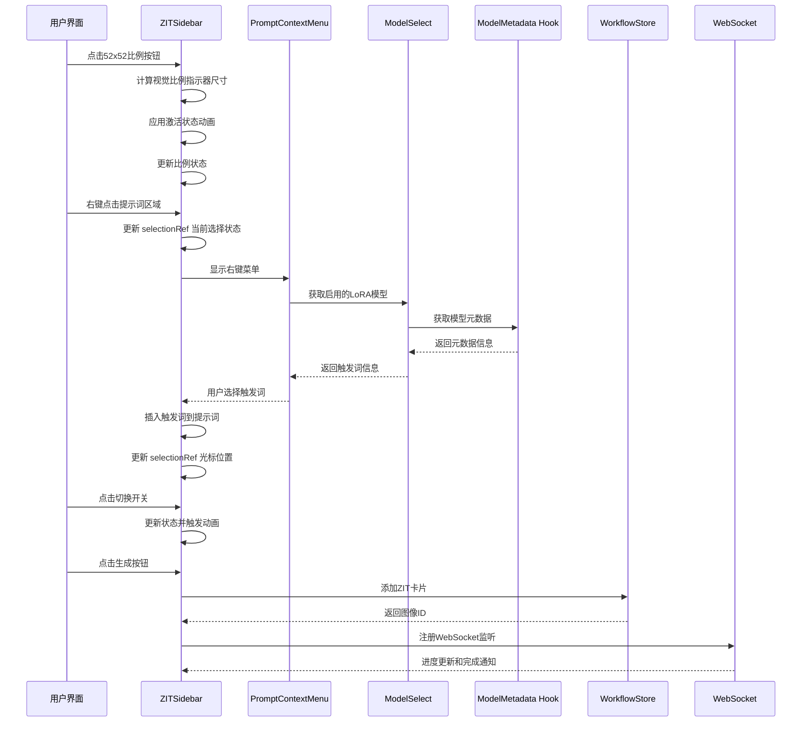

**图表来源**
- [ZITSidebar.tsx:430-434](file://client/src/components/ZITSidebar.tsx#L430-L434)
- [PromptContextMenu.tsx:189-395](file://client/src/components/PromptContextMenu.tsx#L189-L395)
- [ModelSelect.tsx:96-111](file://client/src/components/ModelSelect.tsx#L96-L111)
- [useModelMetadata.ts:10-215](file://client/src/hooks/useModelMetadata.ts#L10-L215)
- [useWorkflowStore.ts:82-84](file://client/src/hooks/useWorkflowStore.ts#L82-L84)

## 详细组件分析

### ZITSidebar 组件架构

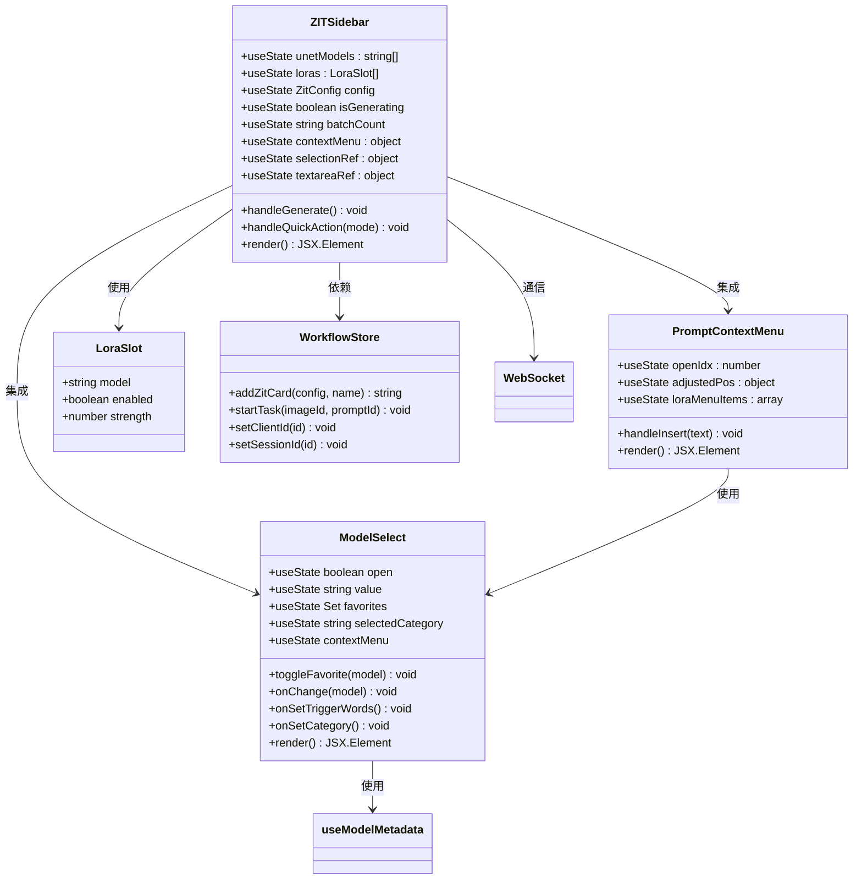

**图表来源**
- [ZITSidebar.tsx:37-944](file://client/src/components/ZITSidebar.tsx#L37-L944)
- [PromptContextMenu.tsx:6-661](file://client/src/components/PromptContextMenu.tsx#L6-L661)
- [ModelSelect.tsx:74-1005](file://client/src/components/ModelSelect.tsx#L74-L1005)
- [sessionService.ts:4-8](file://client/src/services/sessionService.ts#L4-L8)
- [useModelMetadata.ts:3-215](file://client/src/hooks/useModelMetadata.ts#L3-L215)

### 52x52像素比例按钮系统

**更新** ZITSidebar 采用了全新的方面比例按钮系统，与 Text2ImgSidebar 实现了统一设计：

#### 比例按钮设计原理
- **方形按钮**：每个按钮采用52x52像素的正方形设计
- **视觉指示器**：按钮内部包含精确的视觉比例矩形
- **尺寸计算**：根据比例计算矩形的宽度和高度，确保视觉准确性
- **统一间距**：按钮之间使用6像素的统一间距
- **激活动画**：使用 `transition: 'border-color 0.12s'` 实现颜色过渡
- **居中布局**：使用 `display: 'flex', alignItems: 'center', justifyContent: 'center'` 实现完美居中

#### 比例按钮实现
```jsx
<div style={{ display: 'flex', flexWrap: 'wrap', gap: 6 }}>
  {RATIO_PRESETS.map((p) => {
    const active = ratio === p.label;
    const maxSize = p.width === p.height ? 19 : 24;
    const w = p.width >= p.height ? maxSize : Math.round(maxSize * p.width / p.height);
    const h = p.height >= p.width ? maxSize : Math.round(maxSize * p.height / p.width);
    return (
      <button
        key={p.label}
        style={{
          ...pillBtn(active),
          display: 'flex',
          flexDirection: 'column',
          alignItems: 'center',
          width: 52,
          height: 52,
          padding: '4px 6px 7px',
        }}
        onClick={() => setRatio(p.label)}
      >
        <div style={{ flex: 1, display: 'flex', alignItems: 'center', justifyContent: 'center' }}>
          <div style={{
            width: w,
            height: h,
            border: `1.5px solid ${active ? 'var(--color-primary)' : 'var(--color-text-secondary)'}`,
            borderRadius: 2,
            flexShrink: 0,
            transition: 'border-color 0.12s',
          }} />
        </div>
        <span style={{ fontSize: '10px', lineHeight: 1 }}>{p.label}</span>
      </button>
    );
  })}
</div>
```

#### 视觉比例指示器
- **精确计算**：根据比例计算矩形的实际宽高
- **最大尺寸限制**：正方形比例使用19像素，其他比例使用24像素的最大尺寸
- **比例缩放**：使用 `Math.round(maxSize * dimension / maxDimension)` 确保比例准确
- **边框设计**：使用1.5像素的边框，激活时使用主色调，非激活时使用次要色调
- **圆角处理**：使用2像素的圆角，提供现代感的视觉效果

#### 动画和视觉反馈
- **颜色过渡**：`transition: 'border-color 0.12s'` 实现平滑的颜色变化
- **字体大小**：比例标签使用10像素的细字体，确保可读性
- **行高控制**：使用 `lineHeight: 1` 确保标签垂直居中
- **激活状态**：激活时使用 `var(--color-primary)` 主色调边框

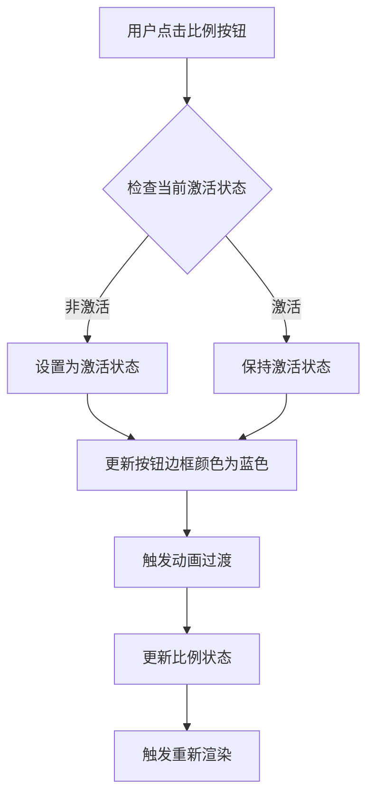

**图表来源**
- [ZITSidebar.tsx:679-715](file://client/src/components/ZITSidebar.tsx#L679-L715)

**章节来源**
- [ZITSidebar.tsx:679-715](file://client/src/components/ZITSidebar.tsx#L679-L715)

### 统一卡片布局系统

**更新** ZITSidebar 采用了与 Text2ImgSidebar 一致的卡片布局系统：

#### 卡片样式统一
- **cardStyle**：使用统一的卡片样式定义，包含内边距和背景色
- **dividerStyle**：使用统一的分隔线样式，确保视觉一致性
- **sectionLabelStyle**：使用统一的标题样式，包含字体大小和颜色
- **间距规范**：所有卡片使用相同的间距规范，确保布局一致性

#### 样式系统设计
```jsx
const cardStyle: React.CSSProperties = {
  padding: '0',
};

const dividerStyle: React.CSSProperties = {
  height: 1,
  backgroundColor: 'var(--color-border)',
  margin: '0',
  opacity: 0.5,
};

const sectionLabelStyle: React.CSSProperties = {
  fontSize: 12,
  fontWeight: 600,
  color: 'var(--color-text-secondary)',
  marginBottom: 8,
  letterSpacing: '0.02em',
};
```

#### 响应式设计
- **Flexbox 布局**：使用 `display: 'flex', flexDirection: 'column'` 实现垂直布局
- **Gap 属性**：使用 `gap: 0` 控制卡片之间的间距
- **Overflow 处理**：使用 `overflowY: 'auto'` 实现滚动区域
- **宽度控制**：使用 `width: width ?? 260` 支持自定义宽度

**章节来源**
- [ZITSidebar.tsx:299-316](file://client/src/components/ZITSidebar.tsx#L299-L316)

### 纯 CSS 切换开关系统

**新增** ZITSidebar 采用了全新的纯 CSS 实现的圆形切换开关系统：

#### 切换开关设计原理
- **圆形容器**：使用 `borderRadius: 10` 创建36px宽、20px高的圆形容器
- **移动球体**：使用 `borderRadius: '50%'` 创建16px直径的圆形球体
- **平滑过渡**：使用 `transition: 'left 0.2s ease'` 实现球体移动动画
- **状态颜色**：启用时使用 `var(--color-primary)`，禁用时使用灰色透明度
- **阴影效果**：使用 `boxShadow: '0 1px 3px rgba(0,0,0,0.2)'` 增加立体感

#### LoRA 切换开关实现
```jsx
<div
  onClick={() => updateLora(i, { enabled: !lora.enabled })}
  style={{
    width: 36,
    height: 20,
    borderRadius: 10,
    backgroundColor: lora.enabled ? 'var(--color-primary, #4a9eff)' : 'rgba(128,128,128,0.3)',
    position: 'relative',
    cursor: 'pointer',
    transition: 'background-color 0.2s ease',
    flexShrink: 0,
  }}
>
  <div
    style={{
      width: 16,
      height: 16,
      borderRadius: '50%',
      backgroundColor: '#fff',
      position: 'absolute',
      top: 2,
      left: lora.enabled ? 18 : 2,
      transition: 'left 0.2s ease',
      boxShadow: '0 1px 3px rgba(0,0,0,0.2)',
    }}
  />
</div>
```

#### AuraFlow Shift 切换开关实现
```jsx
<div
  onClick={() => setShiftEnabled((v: boolean) => !v)}
  style={{
    width: 36,
    height: 20,
    borderRadius: 10,
    backgroundColor: shiftEnabled ? 'var(--color-primary, #4a9eff)' : 'rgba(128,128,128,0.3)',
    position: 'relative',
    cursor: 'pointer',
    transition: 'background-color 0.2s ease',
    flexShrink: 0,
  }}
>
  <div
    style={{
      width: 16,
      height: 16,
      borderRadius: '50%',
      backgroundColor: '#fff',
      position: 'absolute',
      top: 2,
      left: shiftEnabled ? 18 : 2,
      transition: 'left 0.2s ease',
      boxShadow: '0 1px 3px rgba(0,0,0,0.2)',
    }}
  />
</div>
```

#### 动画和视觉反馈
- **颜色过渡**：`transition: 'background-color 0.2s ease'` 实现背景色平滑变化
- **位置过渡**：`transition: 'left 0.2s ease'` 实现球体位置平滑移动
- **阴影动画**：通过 `boxShadow` 属性实现立体视觉效果
- **状态指示**：通过 `var(--color-primary)` 和透明度变化指示当前状态

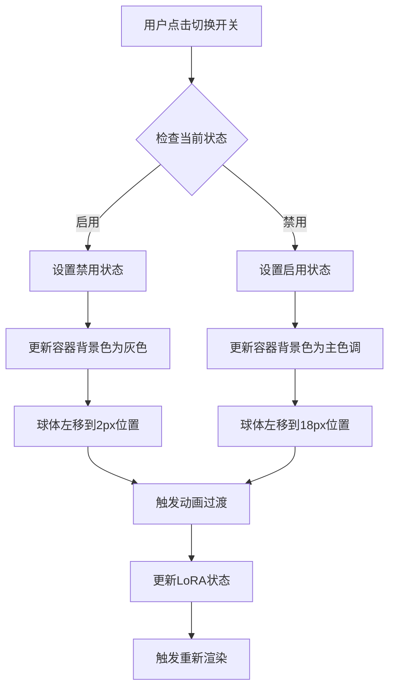

**图表来源**
- [ZITSidebar.tsx:402-429](file://client/src/components/ZITSidebar.tsx#L402-L429)
- [ZITSidebar.tsx:751-778](file://client/src/components/ZITSidebar.tsx#L751-L778)

**章节来源**
- [ZITSidebar.tsx:402-429](file://client/src/components/ZITSidebar.tsx#L402-L429)
- [ZITSidebar.tsx:751-778](file://client/src/components/ZITSidebar.tsx#L751-L778)

### 基于 useRef 的文本选择系统

**新增** ZITSidebar 引入了精确的文本选择状态管理系统：

#### selectionRef 系统
- **状态存储**：使用 `useRef` 存储当前文本选择的起始和结束位置
- **精确捕获**：在右键菜单显示时准确捕获当前文本选择状态
- **状态恢复**：操作完成后自动恢复光标位置和选择状态

#### textareaRef 系统
- **焦点管理**：使用 `useRef` 引用文本域，支持手动焦点控制
- **光标控制**：操作完成后自动恢复光标位置
- **即时反馈**：操作完成后立即更新 UI 状态

#### 文本操作功能
```jsx
const selectionRef = useRef({ start: 0, end: 0 });
const textareaRef = useRef<HTMLTextAreaElement>(null);

const getSelectedText = () => {
  const { start, end } = selectionRef.current;
  return start !== end ? prompt.slice(start, end) : '';
};

const handleCtxCut = useCallback(() => {
  const { start, end } = selectionRef.current;
  if (start === end) return;
  const text = prompt.slice(start, end);
  navigator.clipboard.writeText(text);
  const newPrompt = prompt.slice(0, start) + prompt.slice(end);
  setPrompt(newPrompt);
  selectionRef.current = { start, end: start };
  setTimeout(() => {
    if (textareaRef.current) {
      textareaRef.current.focus();
      textareaRef.current.selectionStart = start;
      textareaRef.current.selectionEnd = start;
    }
  }, 0);
}, [prompt, setPrompt]);
```

#### 智能逗号处理
- **前置逗号**：当插入位置前有内容且不以逗号结尾时自动添加逗号
- **后置逗号**：当插入位置后有内容且不以逗号开头时自动添加逗号
- **位置计算**：准确计算插入后的光标位置，确保用户体验流畅

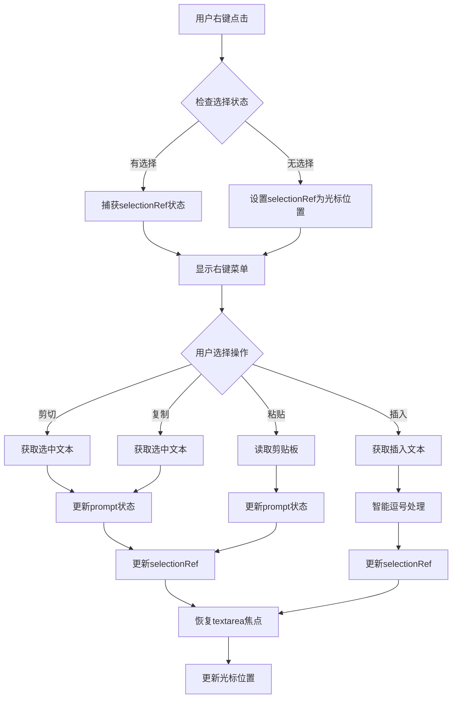

**图表来源**
- [ZITSidebar.tsx:133-134](file://client/src/components/ZITSidebar.tsx#L133-L134)
- [ZITSidebar.tsx:141-182](file://client/src/components/ZITSidebar.tsx#L141-L182)
- [ZITSidebar.tsx:869-912](file://client/src/components/ZITSidebar.tsx#L869-L912)

**章节来源**
- [ZITSidebar.tsx:133-134](file://client/src/components/ZITSidebar.tsx#L133-L134)
- [ZITSidebar.tsx:141-182](file://client/src/components/ZITSidebar.tsx#L141-L182)
- [ZITSidebar.tsx:869-912](file://client/src/components/ZITSidebar.tsx#L869-L912)

### PromptContextMenu 组件详细分析

**新增** PromptContextMenu 是一个专门用于提示词插入的右键菜单组件：

#### 核心功能特性
- **触发词插入**：支持将 LoRA 模型的触发词插入到提示词中
- **智能位置管理**：自动处理光标位置和逗号分隔符
- **多级菜单结构**：支持模型级别的触发词选择和标签分类
- **即时反馈**：插入后自动聚焦并保持光标位置
- **位置自适应**：自动调整菜单位置避免超出屏幕边界

#### 技术实现亮点
- **外部点击检测**：自动关闭右键菜单
- **位置自适应算法**：根据屏幕边界自动调整菜单位置
- **递归子菜单**：支持无限层级的菜单嵌套
- **性能优化**：使用 useMemo 优化菜单项计算
- **键盘导航支持**：支持鼠标悬停和键盘操作

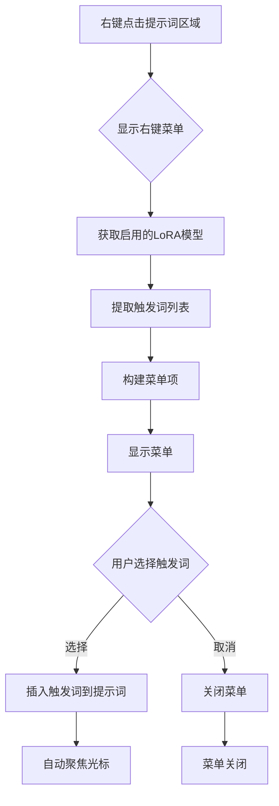

**图表来源**
- [ZITSidebar.tsx:430-434](file://client/src/components/ZITSidebar.tsx#L430-L434)
- [PromptContextMenu.tsx:189-395](file://client/src/components/PromptContextMenu.tsx#L189-L395)

**章节来源**
- [ZITSidebar.tsx:430-434](file://client/src/components/ZITSidebar.tsx#L430-L434)
- [PromptContextMenu.tsx:189-395](file://client/src/components/PromptContextMenu.tsx#L189-L395)

### ModelSelect 组件详细分析

**更新** ModelSelect 组件仍然保留了完整的触发词管理功能：

#### 核心功能特性
- **智能分组显示**：将收藏的模型与普通模型分别显示
- **触发词管理**：支持显示、编辑和复制模型触发词
- **分类管理系统**：支持模型分类、颜色管理和筛选
- **右键菜单**：提供上下文菜单进行模型操作
- **缩略图上传**：支持上传和显示模型缩略图
- **昵称编辑**：支持为模型设置自定义昵称
- **收藏夹管理**：支持添加、删除模型到收藏夹
- **下拉菜单交互**：提供流畅的展开/收起动画
- **加载状态处理**：优雅处理异步加载过程
- **键盘导航支持**：支持鼠标悬停和键盘操作

#### 技术实现亮点
- **外部点击检测**：自动关闭下拉菜单
- **滚动优化**：支持长列表的滚动浏览
- **状态持久化**：收藏夹状态保存到 localStorage
- **性能优化**：使用 useRef 和 useCallback 优化渲染
- **分类颜色系统**：自动分配分类颜色，支持 HSL 色彩空间
- **上下文菜单**：使用 Portal 技术实现脱离父容器的菜单显示

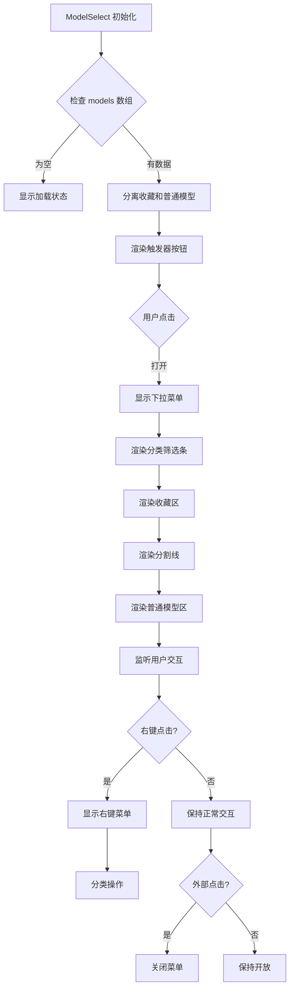

**图表来源**
- [ModelSelect.tsx:96-111](file://client/src/components/ModelSelect.tsx#L96-L111)

**章节来源**
- [ModelSelect.tsx:96-111](file://client/src/components/ModelSelect.tsx#L96-L111)
- [ModelSelect.tsx:680-911](file://client/src/components/ModelSelect.tsx#L680-L911)

### 增强的 LoRA 槽位系统

**新增** ZITSidebar 现在支持强大的多槽位 LoRA 系统：

#### LoRA 槽位管理
- **多槽位支持**：最多5个独立的 LoRA 槽位，每个槽位独立启用/禁用
- **智能添加**：当槽位数量小于5时显示"添加 LoRA"按钮
- **删除保护**：提供确认对话框防止误删 LoRA 槽位
- **独立权重**：每个 LoRA 槽位支持 -2 到 2 范围的权重调节，步长0.1

#### 触发词状态提醒
- **状态图标**：通过 AlertTriangle 图标提示未使用的触发词
- **智能检测**：自动检测提示词中是否包含触发词
- **视觉反馈**：当触发词被使用时图标会消失
- **右键插入**：点击图标可通过右键菜单插入触发词

#### 服务器端动态连接
- **链式连接**：启用的 LoRA 模型按顺序链式连接
- **智能重连**：禁用的 LoRA 会被跳过，保持连接完整性
- **权重传递**：每个 LoRA 的权重参数独立传递
- **模型链**：第一个 LoRA 连接到源模型，后续 LoRA 依次连接前一个

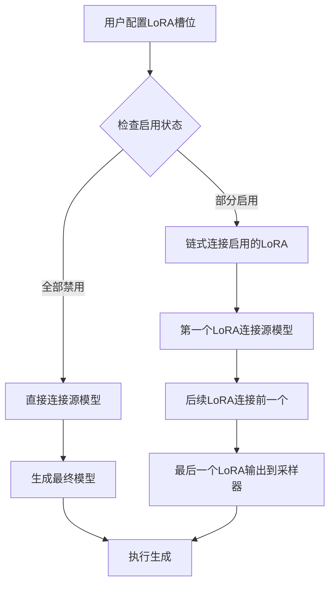

**图表来源**
- [ZITSidebar.tsx:312-451](file://client/src/components/ZITSidebar.tsx#L312-L451)
- [workflow.ts:332-374](file://server/src/routes/workflow.ts#L332-L374)

**章节来源**
- [ZITSidebar.tsx:312-451](file://client/src/components/ZITSidebar.tsx#L312-L451)
- [workflow.ts:332-374](file://server/src/routes/workflow.ts#L332-L374)

### AuraFlow Shift 算法支持

**新增** ZITSidebar 现在支持 AuraFlow 的采样算法偏移功能：

#### Shift 算法配置
- **开关控制**：支持启用/禁用 Shift 算法
- **偏移量调节**：支持1-5范围的偏移量调节
- **智能切换**：通过 ifElse 节点智能切换模型源
- **权重传递**：Shift 模型和 LoRA 模型的权重独立传递

#### 算法工作原理
- **模型选择**：启用 Shift 时使用 Shift 模型，禁用时使用最后一个 LoRA
- **链式连接**：Shift 模型和 LoRA 模型都连接到采样器
- **权重独立**：每个模型的权重参数独立配置和传递
- **智能重连**：根据启用状态动态重连模型链

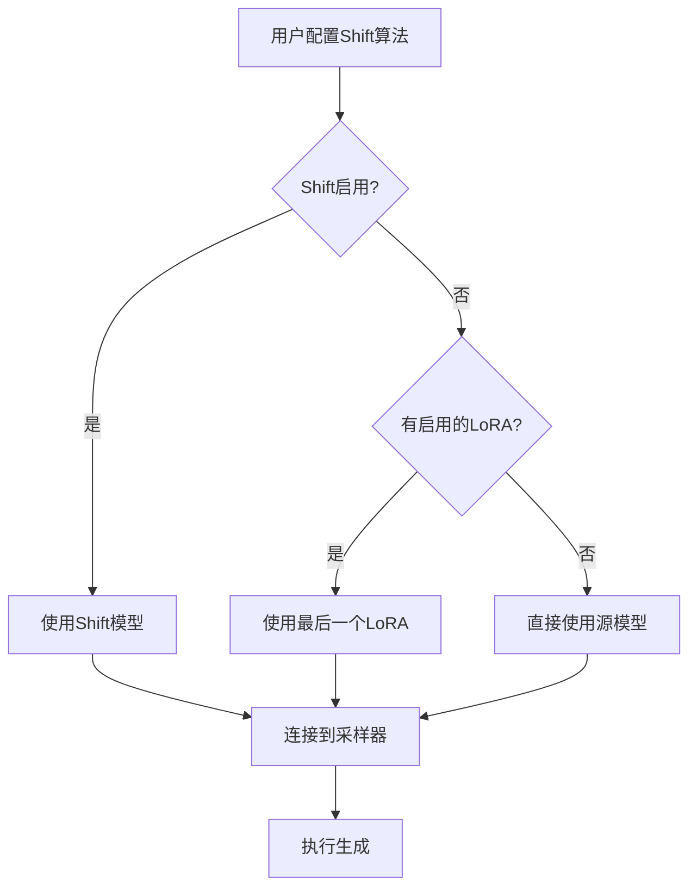

**图表来源**
- [ZITSidebar.tsx:681-710](file://client/src/components/ZITSidebar.tsx#L681-L710)
- [workflow.ts:327-374](file://server/src/routes/workflow.ts#L327-L374)

**章节来源**
- [ZITSidebar.tsx:681-710](file://client/src/components/ZITSidebar.tsx#L681-L710)
- [workflow.ts:327-374](file://server/src/routes/workflow.ts#L327-L374)

### 参数配置系统

#### 模型管理增强
**更新** ModelSelect 组件显著改进了模型管理体验：

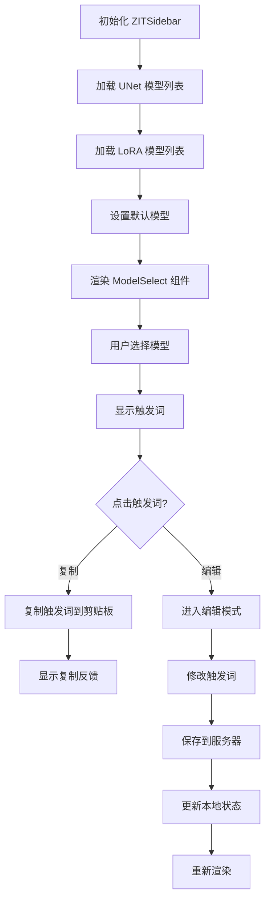

**图表来源**
- [ZITSidebar.tsx:66-95](file://client/src/components/ZITSidebar.tsx#L66-L95)
- [ModelSelect.tsx:236-260](file://client/src/components/ModelSelect.tsx#L236-L260)

#### 采样器配置
支持多种采样器和调度器组合：

| 采样器类型 | 适用场景 | 推荐参数 |
|-----------|----------|----------|
| euler | 通用生成 | steps: 9-15, cfg: 1-2 |
| euler_a | 更稳定 | steps: 12-20, cfg: 1-3 |
| res_ms | 高质量 | steps: 15-25, cfg: 2-4 |
| dpmpp_2m | 快速生成 | steps: 6-12, cfg: 1-2 |

**章节来源**
- [ZITSidebar.tsx:19-32](file://client/src/components/ZITSidebar.tsx#L19-L32)
- [ZITSidebar.tsx:503-526](file://client/src/components/ZITSidebar.tsx#L503-L526)

### 批量处理机制

#### 任务队列管理
组件实现了智能的任务队列管理：

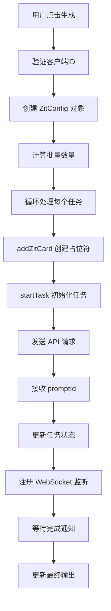

**图表来源**
- [ZITSidebar.tsx:145-194](file://client/src/components/ZITSidebar.tsx#L145-L194)
- [useWorkflowStore.ts:82-84](file://client/src/hooks/useWorkflowStore.ts#L82-L84)

**章节来源**
- [ZITSidebar.tsx:145-194](file://client/src/components/ZITSidebar.tsx#L145-L194)
- [useWorkflowStore.ts:377-396](file://client/src/hooks/useWorkflowStore.ts#L377-L396)

### 提示词辅助系统

#### AI 助手集成
组件集成了多种提示词转换模式：

| 模式 | 功能描述 | 使用场景 |
|------|----------|----------|
| naturalToTags | 自然语言转标签 | 从中文描述生成英文标签 |
| tagsToNatural | 标签转自然语言 | 将标签转换为详细描述 |
| detailer | 按需扩写 | 扩展特定元素的描述细节 |

#### 优化的触发词管理
**更新** 触发词管理功能经过优化：

- **状态提醒**：通过 AlertTriangle 图标提示未使用的触发词
- **右键插入**：支持通过右键菜单插入触发词到提示词
- **智能检测**：自动检测提示词中是否包含触发词
- **位置管理**：自动处理光标位置和逗号分隔符

**章节来源**
- [ZITSidebar.tsx:196-217](file://client/src/components/ZITSidebar.tsx#L196-L217)
- [ZITSidebar.tsx:376-414](file://client/src/components/ZITSidebar.tsx#L376-L414)

## 依赖分析

### 组件间依赖关系

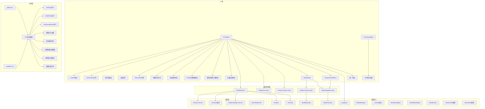

**图表来源**
- [ZITSidebar.tsx:1-10](file://client/src/components/ZITSidebar.tsx#L1-L10)
- [ModelSelect.tsx:236-260](file://client/src/components/ModelSelect.tsx#L236-L260)
- [PromptContextMenu.tsx:189-395](file://client/src/components/PromptContextMenu.tsx#L189-L395)
- [useWorkflowStore.ts:1-6](file://client/src/hooks/useWorkflowStore.ts#L1-L6)
- [useModelMetadata.ts:1-58](file://client/src/hooks/useModelMetadata.ts#L1-L58)
- [sessionService.ts:4-8](file://client/src/services/sessionService.ts#L4-L8)
- [index.ts:1-58](file://client/src/types/index.ts#L1-L58)
- [Text2ImgSidebar.tsx:220-227](file://client/src/components/Text2ImgSidebar.tsx#L220-L227)
- [global.css:1-275](file://client/src/styles/global.css#L1-L275)
- [variables.css:1-31](file://client/src/styles/variables.css#L1-L31)

### 服务器端集成

#### 工作流适配器
服务器端通过适配器模式实现工作流的统一管理：

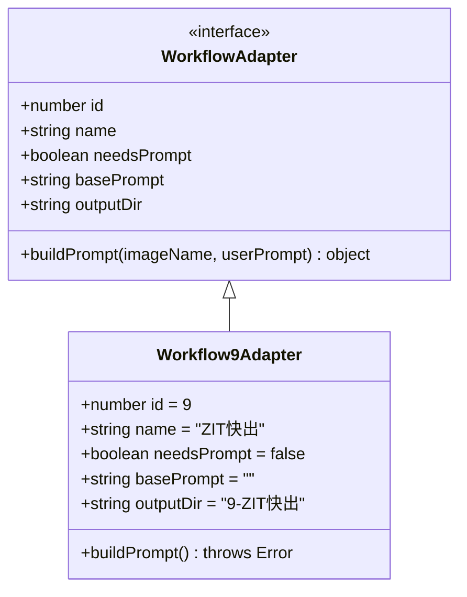

#### 模型元数据管理
**更新** 服务器端提供完整的模型元数据管理 API：

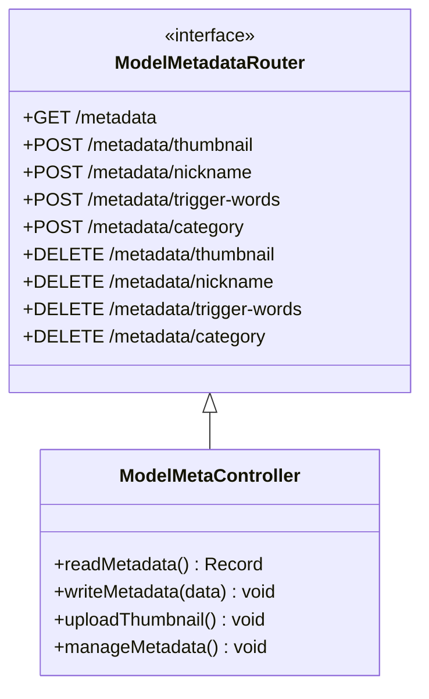

#### LoRA 模型管理
**新增** 服务器端实现了完整的 LoRA 模型管理：

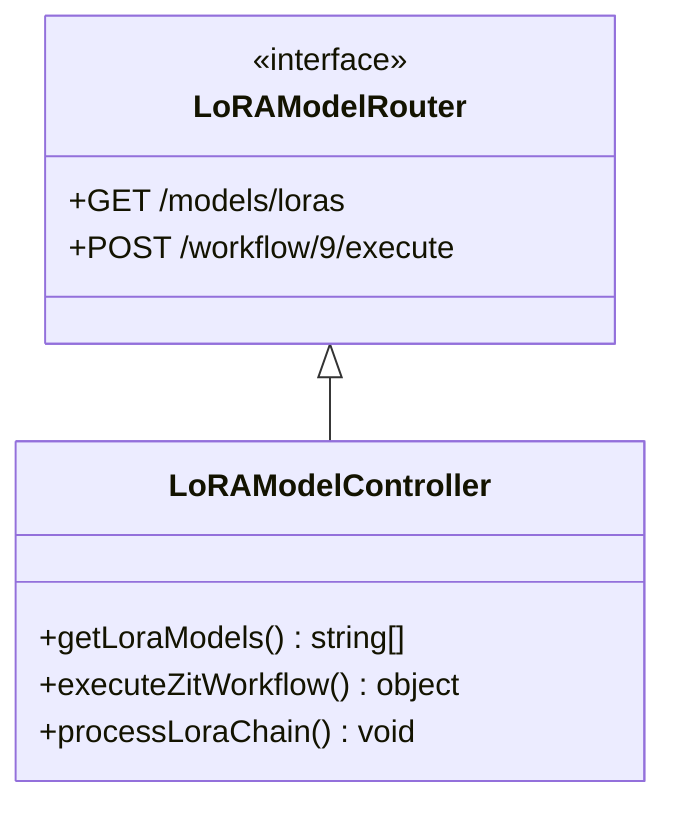

**图表来源**
- [Workflow9Adapter.ts:3-13](file://server/src/adapters/Workflow9Adapter.ts#L3-L13)
- [index.ts:13-24](file://server/src/adapters/index.ts#L13-L24)
- [modelMeta.ts:43-227](file://server/src/routes/modelMeta.ts#L43-L227)
- [workflow.ts:275-283](file://server/src/routes/workflow.ts#L275-L283)

**章节来源**
- [workflow.ts:182-261](file://server/src/routes/workflow.ts#L182-L261)
- [Workflow9Adapter.ts:1-14](file://server/src/adapters/Workflow9Adapter.ts#L1-L14)
- [modelMeta.ts:1-228](file://server/src/routes/modelMeta.ts#L1-L228)

## 性能考虑

### 优化策略

#### 内存管理
- **本地草稿缓存**：使用 localStorage 存储临时配置，避免重复请求
- **资源清理**：及时释放预览 URL 和临时文件对象
- **批量限制**：最大支持 32 张图像的批量生成
- **组件优化**：ModelSelect 使用 useCallback 和 useMemo 优化渲染
- **元数据缓存**：useModelMetadata Hook 缓存模型元数据
- **LoRA 槽位优化**：最多5个槽位限制，避免过度内存占用
- **引用优化**：useRef 优化文本选择状态管理，避免不必要的重渲染

#### 网络优化
- **并发控制**：逐个发送生成请求，避免服务器过载
- **错误恢复**：单个任务失败不影响其他任务执行
- **状态同步**：通过 WebSocket 实时同步任务状态
- **API 优化**：模型元数据通过单一 API 获取，减少请求次数
- **LoRA 链式优化**：服务器端智能重连，避免无效连接

#### 渲染优化
- **条件渲染**：根据状态动态显示加载指示器
- **防抖处理**：避免频繁的状态更新触发重渲染
- **虚拟滚动**：对于大量输出采用懒加载策略
- **组件拆分**：ModelSelect 和 PromptContextMenu 独立封装，便于维护和测试
- **分类颜色缓存**：使用 localStorage 缓存分类颜色映射
- **统一卡片布局**：通过 CSS 变量和统一样式减少重复计算
- **LoRA 槽位渲染**：动态渲染启用的 LoRA 槽位，避免不必要的 DOM 节点
- **切换开关动画**：使用 GPU 加速的 transition 属性实现流畅动画
- **比例按钮优化**：52x52像素按钮设计，减少重绘开销

#### 样式优化
- **CSS 变量复用**：使用 `var(--color-border)` 等变量确保样式一致性
- **动画性能**：使用 GPU 加速的动画属性如 `transform` 和 `opacity`
- **阴影优化**：通过 `box-shadow` 和 `outline` 实现轻量级视觉效果
- **过渡效果**：使用 `transition` 属性实现流畅的交互反馈
- **纯 CSS 切换开关**：避免 JavaScript 动画开销，提升性能表现
- **比例按钮样式**：统一的52x52像素按钮设计，减少样式计算复杂度
- **视觉指示器优化**：精确的尺寸计算，避免不必要的重排

#### 文本选择优化
- **精确状态管理**：useRef 精确管理文本选择状态，避免状态同步问题
- **光标位置恢复**：操作完成后立即恢复光标位置，提升用户体验
- **智能逗号处理**：自动处理文本插入时的逗号分隔符，确保语法正确
- **即时反馈**：操作完成后立即更新 UI 状态，提供即时反馈

#### 比例按钮系统优化
- **统一尺寸**：52x52像素的固定尺寸，简化布局计算
- **视觉指示器缓存**：预先计算比例指示器的尺寸，避免运行时计算
- **动画优化**：使用 `transition: 'border-color 0.12s'` 实现流畅的颜色过渡
- **间距标准化**：6像素的统一间距，确保视觉一致性
- **响应式布局**：flex-wrap 实现自动换行，适应不同屏幕尺寸

## 故障排除指南

### 常见问题及解决方案

#### 比例按钮显示异常
**症状**：52x52像素比例按钮显示不正确或布局错乱
**解决方案**：
1. 检查 CSS 变量 `--color-primary` 和 `--color-text-secondary` 是否正确加载
2. 验证比例按钮的样式计算逻辑是否正确
3. 确认 `maxSize` 计算是否符合预期
4. 检查 `gap: 6` 的间距设置是否正确应用
5. **新增** 验证视觉比例指示器的尺寸计算是否准确
6. **新增** 检查按钮激活状态的颜色过渡动画是否正常

#### 比例按钮交互异常
**症状**：点击比例按钮无响应或状态不更新
**解决方案**：
1. 检查 `setRatio` 函数是否正确绑定到按钮点击事件
2. 验证 `ratio` 状态是否正确更新
3. 确认按钮的激活状态判断逻辑是否正确
4. 检查 `pillBtn` 样式的激活状态应用
5. **新增** 验证视觉比例指示器的边框颜色是否正确变化

#### 文本选择功能异常
**症状**：文本选择状态管理出现问题，光标位置不正确
**解决方案**：
1. 检查 selectionRef 引用是否正确初始化
2. 验证 textareaRef 引用是否正确设置
3. 确认文本选择事件监听器是否正常工作
4. 检查光标位置恢复逻辑
5. **新增** 验证智能逗号处理功能是否正常
6. **新增** 检查剪切/复制/粘贴操作的文本处理

#### PromptContextMenu 交互异常
**症状**：右键菜单无法正常显示或插入触发词
**解决方案**：
1. 检查外部点击事件监听器是否正常工作
2. 验证启用的 LoRA 模型列表数据格式
3. 查看控制台是否有 JavaScript 错误
4. 确认模型元数据加载状态
5. **新增** 验证 LoRA 槽位配置是否正确传递给菜单组件
6. **新增** 检查 selectionRef 引用是否正确更新

#### ModelSelect 交互异常
**症状**：模型选择下拉菜单无法正常展开或关闭
**解决方案**：
1. 检查外部点击事件监听器是否正常工作
2. 验证模型列表数据格式是否正确
3. 查看控制台是否有 JavaScript 错误
4. 确认收藏夹状态同步是否正常
5. **新增** 检查 LoRA 槽位的模型选择功能

#### LoRA 槽位功能异常
**症状**：LoRA 槽位无法添加、删除或配置
**解决方案**：
1. 检查 LoRA 槽位数量限制（最多5个）
2. 验证 LoRA 模型列表数据格式
3. 确认 LoRA 槽位状态更新函数是否正常工作
4. 检查权重调节滑块是否正常响应
5. **新增** 验证服务器端 LoRA 链式连接逻辑
6. **新增** 检查切换开关的动画和状态变化

#### 切换开关功能异常
**症状**：LoRA 启用开关或 Shift 算法开关无法正常切换
**解决方案**：
1. 检查 CSS 动画是否正常加载
2. 验证切换开关的点击事件绑定
3. 确认状态更新函数是否正常工作
4. 检查 transition 属性是否正确应用
5. **新增** 验证纯 CSS 实现的圆形切换开关是否正常渲染
6. **新增** 检查背景色和球体位置的动画过渡

#### 触发词功能异常
**症状**：触发词状态提醒或插入功能失效
**解决方案**：
1. 检查 useModelMetadata Hook 是否正确加载元数据
2. 验证服务器端 /api/models/metadata API 是否正常
3. 确认模型是否存在触发词元数据
4. 检查浏览器跨域设置和权限配置
5. **新增** 验证 PromptContextMenu 的 LoRA 触发词数据传递

#### 分类管理问题
**症状**：模型分类功能无法使用
**解决方案**：
1. 检查右键菜单是否正确显示
2. 验证分类颜色系统是否正常工作
3. 确认分类操作的 API 调用是否成功
4. 检查分类筛选功能是否正常
5. 验证分类颜色缓存的持久化

#### 生成任务卡住
**症状**：任务状态长时间停留在 queued
**解决方案**：
1. 检查服务器队列状态
2. 验证客户端连接状态
3. 查看 WebSocket 错误日志
4. **新增** 检查 LoRA 链式连接是否正确配置
5. **新增** 验证 Shift 算法配置是否正确

#### 提示词助手无响应
**症状**：AI 助手按钮点击无效
**解决方案**：
1. 确认网络连接正常
2. 检查服务器端提示词助手服务
3. 验证系统提示词配置
4. **新增** 检查触发词复制功能是否正常

#### 卡片布局显示异常
**症状**：卡片样式不一致或布局错乱
**解决方案**：
1. 检查 CSS 变量是否正确加载
2. 验证 `cardStyle` 和 `dividerStyle` 是否正确应用
3. 确认 `var(--color-border)` 等 CSS 变量值
4. 检查全局样式文件是否正确导入
5. **新增** 验证统一卡片布局系统是否正常工作
6. **新增** 验证52x52比例按钮样式是否正确应用

#### LoRA 链式连接问题
**症状**：LoRA 模型无法正确链式连接
**解决方案**：
1. 检查启用的 LoRA 模型数量
2. 验证服务器端 LoRA 链式连接逻辑
3. 确认 LoRA 节点 ID 配置是否正确
4. 检查模型权重参数传递
5. **新增** 验证禁用 LoRA 时的重连机制

#### Shift 算法配置问题
**症状**：AuraFlow Shift 算法无法正常工作
**解决方案**：
1. 检查 Shift 开关状态
2. 验证 Shift 偏移量配置范围
3. 确认 ifElse 节点连接逻辑
4. 检查 Shift 模型和 LoRA 模型的权重传递
5. **新增** 验证模型源切换功能

#### 动画性能问题
**症状**：切换开关动画卡顿或不流畅
**解决方案**：
1. 检查 CSS transition 属性是否正确应用
2. 验证 GPU 加速是否生效
3. 确认动画帧率是否正常
4. 检查是否有其他 CSS 动画冲突
5. **新增** 验证纯 CSS 实现的性能表现
6. **新增** 验证比例按钮动画的性能优化

#### 样式兼容性问题
**症状**：不同主题下的样式显示异常
**解决方案**：
1. 检查 CSS 变量在深色主题下的正确应用
2. 验证 `--color-primary` 和 `--color-text-secondary` 的主题切换
3. 确认比例按钮的边框颜色在不同主题下的可见性
4. 检查视觉比例指示器的颜色对比度
5. **新增** 验证52x52按钮在不同分辨率下的显示效果

**章节来源**
- [ZITSidebar.tsx:142-151](file://client/src/components/ZITSidebar.tsx#L142-L151)
- [ModelSelect.tsx:32-42](file://client/src/components/ModelSelect.tsx#L32-L42)
- [PromptContextMenu.tsx:195-204](file://client/src/components/PromptContextMenu.tsx#L195-L204)
- [workflow.ts:746-800](file://server/src/routes/workflow.ts#L746-L800)
- [useModelMetadata.ts:13-22](file://client/src/hooks/useModelMetadata.ts#L13-L22)

## 结论

ZITSidebar 组件作为 CorineKit Pix2Real 项目的核心功能模块，成功实现了快速图像生成的完整解决方案。通过精心设计的架构和优化的用户体验，该组件为用户提供了高效、稳定的图像生成服务。

**更新** 最新版本的组件集成了全新的方面比例按钮系统，实现了与 Text2ImgSidebar 一致的 UI 设计。新的比例按钮采用52x52像素方形设计，包含精确的视觉比例指示器和流畅的动画效果，显著提升了用户交互体验。同时，采样算法设置的间距配置也得到了标准化，确保了界面的一致性和专业性。

**增强** 最新版本还引入了强大的 LoRA 槽位系统，支持最多5个独立的 LoRA 模型槽位，每个槽位都可以独立启用/禁用、选择模型和调节权重。服务器端实现了智能的 LoRA 链式连接机制，能够根据启用状态动态重连 LoRA 节点。此外，组件还新增了 AuraFlow 的采样算法偏移功能，进一步提升了生成质量和算法多样性。

**新增** 本版本特别引入了 LoRA 风格切换开关，将传统的复选框替换为纯 CSS 实现的圆形切换开关，具有平滑的过渡动画和视觉反馈，显著提升了用户的交互体验。同时，基于 useRef 的文本选择系统实现了精确的文本状态管理，确保了文本编辑操作的准确性和流畅性。

主要优势包括：
- **统一视觉设计**：采用新的卡片布局系统，实现与 Text2ImgSidebar 一致的视觉体验
- **52x52像素比例按钮**：全新的方形按钮设计，包含视觉比例指示器
- **流畅动画效果**：按钮激活状态的颜色过渡动画
- **标准化间距配置**：统一的按钮间距和布局规范
- **易用性**：直观的界面设计和智能的参数配置
- **专业性**：ModelSelect 组件提供专业的模型管理体验
- **稳定性**：完善的错误处理和状态管理机制
- **扩展性**：模块化的架构支持未来功能扩展
- **性能**：优化的批量处理和资源管理策略
- **完整性**：完整的模型元数据管理功能
- **一致性**：与应用整体设计风格保持一致
- **灵活性**：基于右键菜单的触发词插入机制
- **强大 LoRA 支持**：多槽位 LoRA 系统和智能链式连接
- **高级算法**：AuraFlow Shift 算法支持
- **智能状态管理**：触发词使用状态的可视化提醒
- **纯 CSS 切换开关**：平滑过渡动画和视觉反馈的圆形切换开关
- **精确文本选择**：基于 useRef 的选择参考系统，实现精确的文本选择状态管理

该组件在整体工作流系统中扮演着关键角色，为其他侧边栏组件提供了统一的集成接口和一致的用户体验。

## 附录

### 使用示例

#### 基础使用流程
1. 在提示词区域输入或生成描述
2. 使用 ModelSelect 组件选择合适的模型和采样器参数
3. 设置图像尺寸和批量数量
4. 点击生成按钮开始处理

#### 52x52像素比例按钮使用技巧
**更新** 新比例按钮系统的使用建议：
- **方形设计**：每个按钮采用52x52像素的正方形设计，提供统一的视觉体验
- **视觉指示器**：按钮内部包含精确的视觉比例矩形，直观显示实际宽高比
- **激活状态**：点击后按钮边框变为蓝色，提供清晰的状态反馈
- **动画效果**：颜色过渡动画使用 `transition: 'border-color 0.12s'` 实现流畅变化
- **间距统一**：按钮之间使用6像素的统一间距，确保视觉一致性

#### LoRA 槽位使用技巧
**新增** 多槽位 LoRA 系统的使用建议：
- **槽位管理**：最多5个 LoRA 槽位，每个槽位独立启用/禁用
- **权重调节**：每个 LoRA 槽位支持 -2 到 2 范围的权重调节，步长0.1
- **智能添加**：当槽位数量小于5时自动显示"添加 LoRA"按钮
- **触发词提醒**：通过 AlertTriangle 图标提示未使用的触发词
- **切换开关**：使用圆形切换开关控制 LoRA 启用状态，具有平滑动画效果
- **链式连接**：启用的 LoRA 模型按顺序链式连接，禁用的 LoRA 被跳过

#### Shift 算法使用指南
**新增** AuraFlow Shift 算法的使用建议：
- **算法开关**：通过圆形切换开关启用/禁用 Shift 算法
- **偏移量调节**：支持1-5范围的偏移量调节
- **智能切换**：启用 Shift 时使用 Shift 模型，禁用时使用最后一个 LoRA
- **权重独立**：Shift 模型和 LoRA 模型的权重参数独立配置

#### PromptContextMenu 使用技巧
**新增** PromptContextMenu 组件的使用建议：
- **右键插入**：在提示词区域右键点击弹出菜单
- **触发词选择**：从菜单中选择需要的触发词
- **智能位置**：菜单会自动调整位置避免超出屏幕
- **即时反馈**：插入后自动聚焦并保持光标位置
- **多级菜单**：支持模型级别和标签级别的触发词选择

#### LoRA 状态提醒使用指南
**更新** LoRA 模型状态提醒的使用建议：
- **状态图标**：通过黄色 AlertTriangle 图标提示未使用的触发词
- **右键插入**：点击图标可通过右键菜单插入触发词
- **智能检测**：系统会自动检测提示词中是否包含触发词
- **视觉反馈**：当触发词被使用时图标会消失

#### 纯 CSS 切换开关使用指南
**新增** 圆形切换开关的使用建议：
- **点击切换**：点击圆形开关即可切换启用/禁用状态
- **平滑动画**：开关状态变化具有0.2秒的平滑过渡动画
- **视觉反馈**：启用时使用主色调，禁用时使用灰色透明度
- **状态指示**：通过球体位置变化指示当前状态

#### 文本选择系统使用技巧
**新增** 基于 useRef 的文本选择系统的使用建议：
- **精确选择**：selectionRef 精确记录当前文本选择状态
- **光标控制**：textareaRef 支持精确的光标位置控制
- **智能处理**：自动处理文本插入时的逗号分隔符
- **即时恢复**：操作完成后自动恢复光标位置和选择状态

#### 参数调优建议
- **高质量生成**：steps 15-25, cfg 2-4, 使用 euler_a 采样器
- **快速生成**：steps 6-12, cfg 1-2, 使用 euler 采样器
- **LoRA 效果**：启用 LoRA 并调整强度参数
- **Shift 算法**：根据需要启用 Shift 算法，偏移量1-3较为合适

#### 批量处理最佳实践
- 单次批量不超过 8 张以保证质量
- 合理设置生成时间间隔避免服务器过载
- 使用草稿功能保存常用配置
- 利用 ModelSelect 的收藏夹功能快速选择常用模型
- **新增** 利用 52x52像素比例按钮快速选择标准比例
- **新增** 利用 PromptContextMenu 的右键插入功能快速添加触发词
- **新增** 利用 LoRA 状态提醒功能确保触发词被正确使用
- **新增** 利用多槽位 LoRA 系统实现复杂的模型组合效果
- **新增** 利用 Shift 算法增强生成的多样性和质量
- **新增** 利用统一卡片布局系统提升界面一致性
- **新增** 利用纯 CSS 切换开关提升交互体验
- **新增** 利用精确文本选择系统提升文本编辑效率
- **新增** 利用标准化的间距配置提升视觉一致性