# ZIT快出侧边栏

<cite>
**本文档引用的文件**
- [ZITSidebar.tsx](file://client/src/components/ZITSidebar.tsx)
- [ModelSelect.tsx](file://client/src/components/ModelSelect.tsx)
- [PromptContextMenu.tsx](file://client/src/components/PromptContextMenu.tsx)
- [useWorkflowStore.ts](file://client/src/hooks/useWorkflowStore.ts)
- [useModelMetadata.ts](file://client/src/hooks/useModelMetadata.ts)
- [index.ts](file://client/src/types/index.ts)
- [global.css](file://client/src/styles/global.css)
- [variables.css](file://client/src/styles/variables.css)
- [Text2ImgSidebar.tsx](file://client/src/components/Text2ImgSidebar.tsx)
</cite>

## 更新摘要
**变更内容**
- 移除了触发词显示和复制功能，简化了LoRA模型使用状态的可视化提醒
- 新增了基于PromptContextMenu的右键插入机制，提供更灵活的提示词插入功能
- 增强了LoRA模型使用状态的可视化提醒，通过AlertTriangle图标提示未使用的触发词
- 优化了提示词区域的交互体验，支持右键菜单进行触发词插入
- 保持了统一的卡片布局系统和ModelSelect组件的集成

## 目录
1. [简介](#简介)
2. [项目结构](#项目结构)
3. [核心组件](#核心组件)
4. [架构概览](#架构概览)
5. [详细组件分析](#详细组件分析)
6. [依赖分析](#依赖分析)
7. [性能考虑](#性能考虑)
8. [故障排除指南](#故障排除指南)
9. [结论](#结论)
10. [附录](#附录)

## 简介

ZIT快出侧边栏组件是 CorineKit Pix2Real 项目中的核心功能模块，专门用于实现快速图像生成的优化策略。该组件基于 ZIT 工作流，提供了直观的用户界面来配置和执行高质量的图像生成任务。

**更新** 该组件已采用全新的交互设计，移除了传统的触发词显示和复制功能，转而采用更加灵活的右键菜单机制。新的设计通过PromptContextMenu组件提供丰富的触发词插入选项，同时保留了LoRA模型使用状态的可视化提醒功能。

本组件的主要特点包括：
- **统一卡片布局**：采用新的卡片设计系统，实现与Text2ImgSidebar一致的视觉体验
- **快速图像生成**：通过优化的参数配置实现高效的图像生成流程
- **批量处理能力**：支持单次生成多个图像实例
- **智能参数管理**：提供预设参数配置和工作流模板选择
- **实时进度监控**：完整的任务状态跟踪和进度显示
- **提示词辅助工具**：集成 AI 助手进行提示词优化和转换
- **增强模型管理**：全新的 ModelSelect 组件提供专业的模型选择界面
- **右键菜单机制**：基于PromptContextMenu的触发词插入功能
- **LoRA状态提醒**：通过AlertTriangle图标提示未使用的触发词
- **优化的交互体验**：简化的触发词管理流程

## 项目结构

ZITSidebar 组件位于客户端前端代码结构中，与服务器端工作流适配器和模型元数据管理紧密协作，并集成了新的 PromptContextMenu 组件：

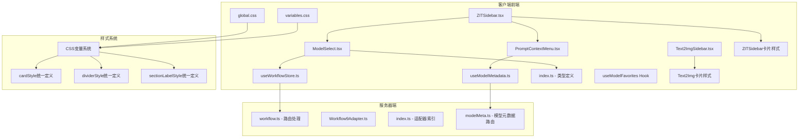

**图表来源**
- [ZITSidebar.tsx:1-778](file://client/src/components/ZITSidebar.tsx#L1-L778)
- [ModelSelect.tsx:1-1005](file://client/src/components/ModelSelect.tsx#L1-L1005)
- [PromptContextMenu.tsx:1-395](file://client/src/components/PromptContextMenu.tsx#L1-L395)
- [useWorkflowStore.ts:1-690](file://client/src/hooks/useWorkflowStore.ts#L1-L690)
- [useModelMetadata.ts:1-215](file://client/src/hooks/useModelMetadata.ts#L1-L215)
- [Text2ImgSidebar.tsx:220-419](file://client/src/components/Text2ImgSidebar.tsx#L220-L419)

**章节来源**
- [ZITSidebar.tsx:1-778](file://client/src/components/ZITSidebar.tsx#L1-L778)
- [ModelSelect.tsx:1-1005](file://client/src/components/ModelSelect.tsx#L1-L1005)
- [PromptContextMenu.tsx:1-395](file://client/src/components/PromptContextMenu.tsx#L1-L395)
- [useWorkflowStore.ts:1-690](file://client/src/hooks/useWorkflowStore.ts#L1-L690)
- [useModelMetadata.ts:1-215](file://client/src/hooks/useModelMetadata.ts#L1-L215)

## 核心组件

### ZITSidebar 主要功能特性

ZITSidebar 组件提供了完整的图像生成工作流界面，包含以下核心功能：

#### 统一卡片布局系统
**更新** 采用新的卡片布局设计，实现与Text2ImgSidebar一致的视觉体验：

- **统一卡片样式**：使用 `cardStyle` 定义所有卡片的统一外观
- **分隔线设计**：使用 `dividerStyle` 创建一致的分隔效果
- **标题样式**：使用 `sectionLabelStyle` 确保标题样式的一致性
- **间距一致性**：所有卡片使用相同的内边距和外边距
- **视觉层次**：通过统一的边框、阴影和背景色建立清晰的视觉层次
- **响应式设计**：适配不同屏幕尺寸和设备类型

#### 增强的模型选择系统
**更新** 集成 ModelSelect 组件，提供专业级的模型管理功能：

- **智能模型分组**：收藏的模型与普通模型自动分组显示
- **收藏夹功能**：支持将常用模型添加到收藏夹，便于快速访问
- **触发词管理**：支持显示和编辑模型的触发词
- **分类管理**：支持为模型设置分类，提供颜色标识和筛选功能
- **右键菜单**：通过右键菜单进行模型分类操作
- **缩略图管理**：支持上传和显示模型缩略图
- **昵称编辑**：支持为模型设置自定义昵称
- **下拉菜单界面**：提供丰富的交互体验和视觉反馈
- **加载状态管理**：优雅处理模型列表加载过程中的状态变化

#### 优化的提示词插入机制
**新增** 基于 PromptContextMenu 的右键插入功能：

- **右键菜单**：在提示词区域右键点击弹出上下文菜单
- **触发词插入**：支持将LoRA模型的触发词插入到提示词中
- **智能位置管理**：自动处理光标位置和逗号分隔符
- **多级菜单**：支持模型级别的触发词选择和标签分类
- **即时反馈**：插入后自动聚焦并保持光标位置

#### LoRA模型使用状态提醒
**更新** 简化了触发词显示功能，保留状态提醒：

- **状态图标**：通过AlertTriangle图标提示未使用的触发词
- **智能检测**：自动检测提示词中是否包含触发词
- **视觉提醒**：当检测到未使用的触发词时显示黄色警告图标
- **右键插入**：点击图标可通过右键菜单插入触发词

#### 参数配置系统
- **模型选择**：支持 UNet 和 LoRA 模型的动态加载和选择
- **采样器配置**：提供多种采样器选项（euler, euler_a, res_ms, dpm2m）
- **调度器设置**：支持不同的调度器模式（simple, 指数, ddim, beta, normal）
- **尺寸预设**：内置常用比例预设（1:1, 3:4, 9:16, 4:3, 16:9）

#### 批量处理机制
- **批量计数控制**：支持 1-32 张图像的批量生成
- **自动命名系统**：基于时间戳和自定义名称生成唯一标识符
- **并发任务管理**：逐个启动生成任务并跟踪进度

#### 实时交互功能
- **提示词助手**：集成 AI 助手进行提示词优化
- **草稿保存**：本地存储临时配置数据
- **状态反馈**：完整的加载状态和错误处理

**章节来源**
- [ZITSidebar.tsx:229-251](file://client/src/components/ZITSidebar.tsx#L229-L251)
- [ZITSidebar.tsx:283-301](file://client/src/components/ZITSidebar.tsx#L283-L301)
- [ZITSidebar.tsx:306-431](file://client/src/components/ZITSidebar.tsx#L306-L431)
- [ZITSidebar.tsx:438-590](file://client/src/components/ZITSidebar.tsx#L438-L590)
- [ZITSidebar.tsx:594-689](file://client/src/components/ZITSidebar.tsx#L594-L689)

## 架构概览

ZITSidebar 组件采用分层架构设计，实现了清晰的关注点分离，并集成了新的 PromptContextMenu 组件：

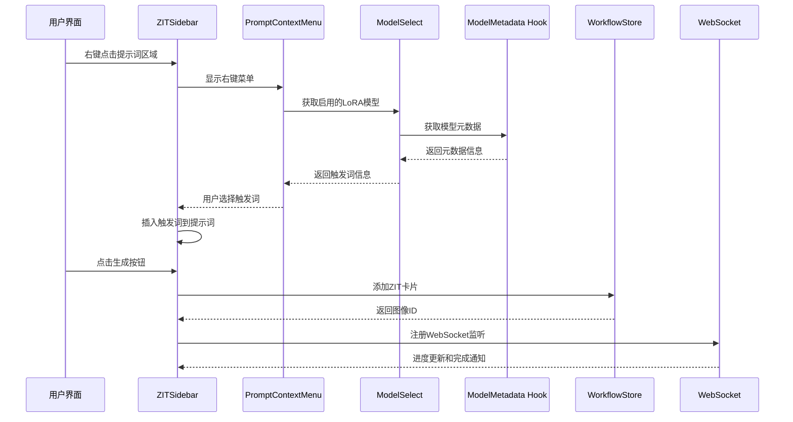

**图表来源**
- [ZITSidebar.tsx:430-434](file://client/src/components/ZITSidebar.tsx#L430-L434)
- [PromptContextMenu.tsx:189-395](file://client/src/components/PromptContextMenu.tsx#L189-L395)
- [ModelSelect.tsx:96-111](file://client/src/components/ModelSelect.tsx#L96-L111)
- [useModelMetadata.ts:10-215](file://client/src/hooks/useModelMetadata.ts#L10-L215)
- [useWorkflowStore.ts:82-84](file://client/src/hooks/useWorkflowStore.ts#L82-L84)

## 详细组件分析

### ZITSidebar 组件架构

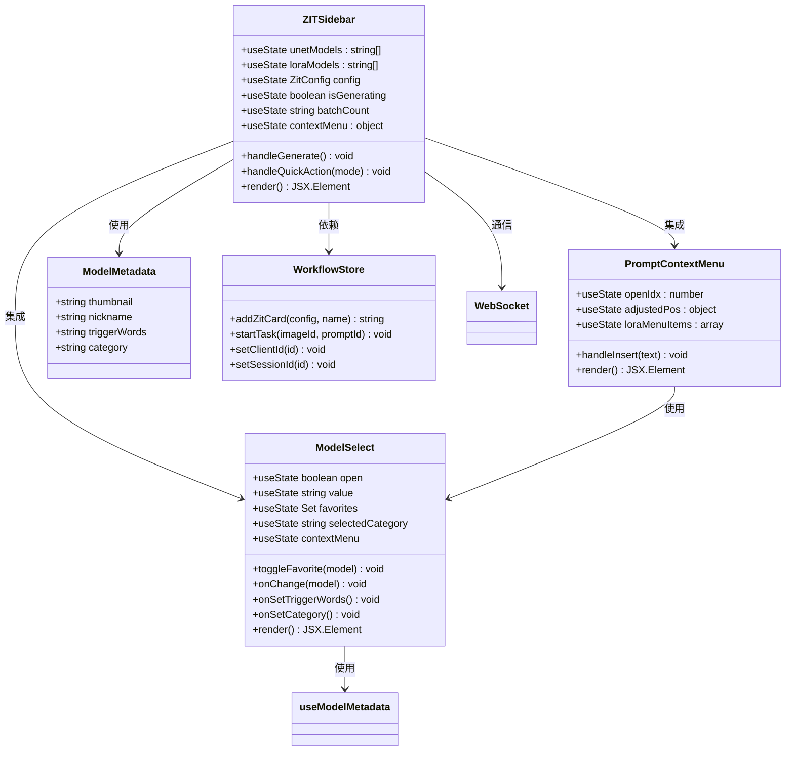

**图表来源**
- [ZITSidebar.tsx:37-778](file://client/src/components/ZITSidebar.tsx#L37-L778)
- [PromptContextMenu.tsx:6-395](file://client/src/components/PromptContextMenu.tsx#L6-L395)
- [ModelSelect.tsx:74-1005](file://client/src/components/ModelSelect.tsx#L74-L1005)
- [useModelMetadata.ts:3-215](file://client/src/hooks/useModelMetadata.ts#L3-L215)

### 统一卡片布局系统

**新增** ZITSidebar 采用了全新的统一卡片布局系统，与应用整体设计风格保持一致：

#### 卡片样式定义
- **cardStyle**：统一的卡片基础样式，包含内边距、边框和背景色
- **dividerStyle**：统一的分隔线样式，确保界面元素的一致性
- **sectionLabelStyle**：统一的标题样式，使用一致的字体大小和颜色

#### 卡片布局结构
- **顶部卡片**：UNet 模型选择区域，使用 `paddingTop: 0` 去除顶部内边距
- **中间卡片**：LoRA 模型配置区域，使用标准的 `paddingTop: 16, paddingBottom: 16`
- **底部卡片**：提示词和参数配置区域，使用 `paddingTop: 16, paddingBottom: 16`
- **比例卡片**：图像比例选择区域，使用 `paddingTop: 16, paddingBottom: 16`
- **采样设置卡片**：高级参数配置区域，使用 `paddingTop: 16, paddingBottom: 0`

#### 视觉设计改进
- **统一的圆角设计**：所有卡片使用一致的圆角半径
- **一致的边框样式**：使用 CSS 变量 `var(--color-border)` 确保颜色一致性
- **标准化的间距**：使用 `var(--spacing-md)` 等 CSS 变量确保间距一致性
- **统一的阴影效果**：通过 `box-shadow` 和 `outline` 属性实现一致的视觉反馈

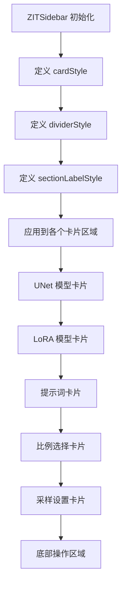

**图表来源**
- [ZITSidebar.tsx:229-251](file://client/src/components/ZITSidebar.tsx#L229-L251)
- [Text2ImgSidebar.tsx:229-246](file://client/src/components/Text2ImgSidebar.tsx#L229-L246)

**章节来源**
- [ZITSidebar.tsx:229-251](file://client/src/components/ZITSidebar.tsx#L229-L251)
- [Text2ImgSidebar.tsx:229-246](file://client/src/components/Text2ImgSidebar.tsx#L229-L246)

### PromptContextMenu 组件详细分析

**新增** PromptContextMenu 是一个专门用于提示词插入的右键菜单组件：

#### 核心功能特性
- **触发词插入**：支持将LoRA模型的触发词插入到提示词中
- **智能位置管理**：自动处理光标位置和逗号分隔符
- **多级菜单结构**：支持模型级别的触发词选择和标签分类
- **即时反馈**：插入后自动聚焦并保持光标位置
- **位置自适应**：自动调整菜单位置避免超出屏幕边界

#### 技术实现亮点
- **外部点击检测**：自动关闭右键菜单
- **位置自适应算法**：根据屏幕边界自动调整菜单位置
- **递归子菜单**：支持无限层级的菜单嵌套
- **性能优化**：使用 useMemo 优化菜单项计算
- **键盘导航支持**：支持鼠标悬停和键盘操作

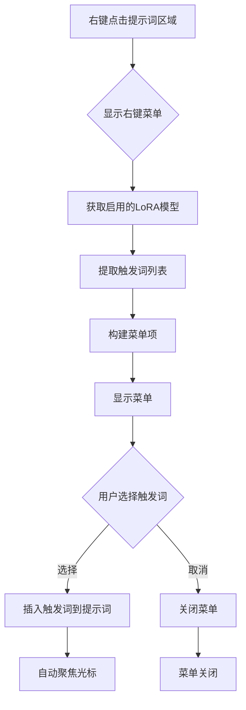

**图表来源**
- [ZITSidebar.tsx:430-434](file://client/src/components/ZITSidebar.tsx#L430-L434)
- [PromptContextMenu.tsx:189-395](file://client/src/components/PromptContextMenu.tsx#L189-L395)

**章节来源**
- [ZITSidebar.tsx:430-434](file://client/src/components/ZITSidebar.tsx#L430-L434)
- [PromptContextMenu.tsx:189-395](file://client/src/components/PromptContextMenu.tsx#L189-L395)

### ModelSelect 组件详细分析

**更新** ModelSelect 组件仍然保留了完整的触发词管理功能：

#### 核心功能特性
- **智能分组显示**：将收藏的模型与普通模型分别显示
- **触发词管理**：支持显示、编辑和复制模型触发词
- **分类管理系统**：支持模型分类、颜色管理和筛选
- **右键菜单**：提供上下文菜单进行模型操作
- **缩略图上传**：支持上传和显示模型缩略图
- **昵称编辑**：支持为模型设置自定义昵称
- **收藏夹管理**：支持添加、删除模型到收藏夹
- **下拉菜单交互**：提供流畅的展开/收起动画
- **加载状态处理**：优雅处理异步加载过程
- **键盘导航支持**：支持鼠标悬停和键盘操作

#### 技术实现亮点
- **外部点击检测**：自动关闭下拉菜单
- **滚动优化**：支持长列表的滚动浏览
- **状态持久化**：收藏夹状态保存到 localStorage
- **性能优化**：使用 useRef 和 useCallback 优化渲染
- **分类颜色系统**：自动分配分类颜色，支持 HSL 色彩空间
- **上下文菜单**：使用 Portal 技术实现脱离父容器的菜单显示

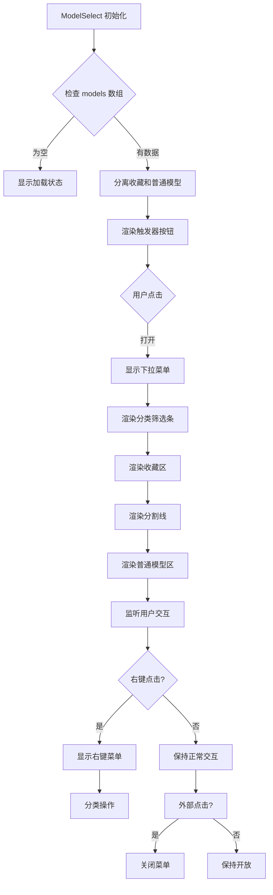

**图表来源**
- [ModelSelect.tsx:96-111](file://client/src/components/ModelSelect.tsx#L96-L111)

**章节来源**
- [ModelSelect.tsx:96-111](file://client/src/components/ModelSelect.tsx#L96-L111)
- [ModelSelect.tsx:680-911](file://client/src/components/ModelSelect.tsx#L680-L911)

### 参数配置系统

#### 模型管理增强
**更新** ModelSelect 组件显著改进了模型管理体验：

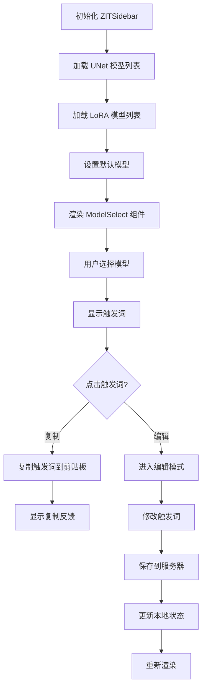

**图表来源**
- [ZITSidebar.tsx:66-95](file://client/src/components/ZITSidebar.tsx#L66-L95)
- [ModelSelect.tsx:236-260](file://client/src/components/ModelSelect.tsx#L236-L260)

#### 采样器配置
支持多种采样器和调度器组合：

| 采样器类型 | 适用场景 | 推荐参数 |
|-----------|----------|----------|
| euler | 通用生成 | steps: 9-15, cfg: 1-2 |
| euler_a | 更稳定 | steps: 12-20, cfg: 1-3 |
| res_ms | 高质量 | steps: 15-25, cfg: 2-4 |
| dpm2m | 快速生成 | steps: 6-12, cfg: 1-2 |

**章节来源**
- [ZITSidebar.tsx:19-32](file://client/src/components/ZITSidebar.tsx#L19-L32)
- [ZITSidebar.tsx:503-526](file://client/src/components/ZITSidebar.tsx#L503-L526)

### 批量处理机制

#### 任务队列管理
组件实现了智能的任务队列管理：

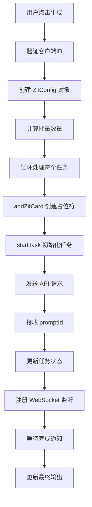

**图表来源**
- [ZITSidebar.tsx:145-194](file://client/src/components/ZITSidebar.tsx#L145-L194)
- [useWorkflowStore.ts:82-84](file://client/src/hooks/useWorkflowStore.ts#L82-L84)

**章节来源**
- [ZITSidebar.tsx:145-194](file://client/src/components/ZITSidebar.tsx#L145-L194)
- [useWorkflowStore.ts:377-396](file://client/src/hooks/useWorkflowStore.ts#L377-L396)

### 提示词辅助系统

#### AI 助手集成
组件集成了多种提示词转换模式：

| 模式 | 功能描述 | 使用场景 |
|------|----------|----------|
| naturalToTags | 自然语言转标签 | 从中文描述生成英文标签 |
| tagsToNatural | 标签转自然语言 | 将标签转换为详细描述 |
| detailer | 按需扩写 | 扩展特定元素的描述细节 |

#### 优化的触发词管理
**更新** 触发词管理功能经过优化：

- **状态提醒**：通过AlertTriangle图标提示未使用的触发词
- **右键插入**：支持通过右键菜单插入触发词到提示词
- **智能检测**：自动检测提示词中是否包含触发词
- **位置管理**：自动处理光标位置和逗号分隔符

**章节来源**
- [ZITSidebar.tsx:196-217](file://client/src/components/ZITSidebar.tsx#L196-L217)
- [ZITSidebar.tsx:376-414](file://client/src/components/ZITSidebar.tsx#L376-L414)

## 依赖分析

### 组件间依赖关系

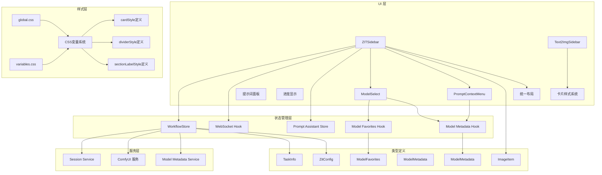

**图表来源**
- [ZITSidebar.tsx:1-10](file://client/src/components/ZITSidebar.tsx#L1-L10)
- [ModelSelect.tsx:236-260](file://client/src/components/ModelSelect.tsx#L236-L260)
- [PromptContextMenu.tsx:189-395](file://client/src/components/PromptContextMenu.tsx#L189-L395)
- [useWorkflowStore.ts:1-6](file://client/src/hooks/useWorkflowStore.ts#L1-L6)
- [useModelMetadata.ts:1-58](file://client/src/hooks/useModelMetadata.ts#L1-L58)
- [index.ts:1-58](file://client/src/types/index.ts#L1-L58)
- [Text2ImgSidebar.tsx:220-227](file://client/src/components/Text2ImgSidebar.tsx#L220-L227)
- [global.css:1-263](file://client/src/styles/global.css#L1-L263)
- [variables.css:1-31](file://client/src/styles/variables.css#L1-L31)

### 服务器端集成

#### 工作流适配器
服务器端通过适配器模式实现工作流的统一管理：

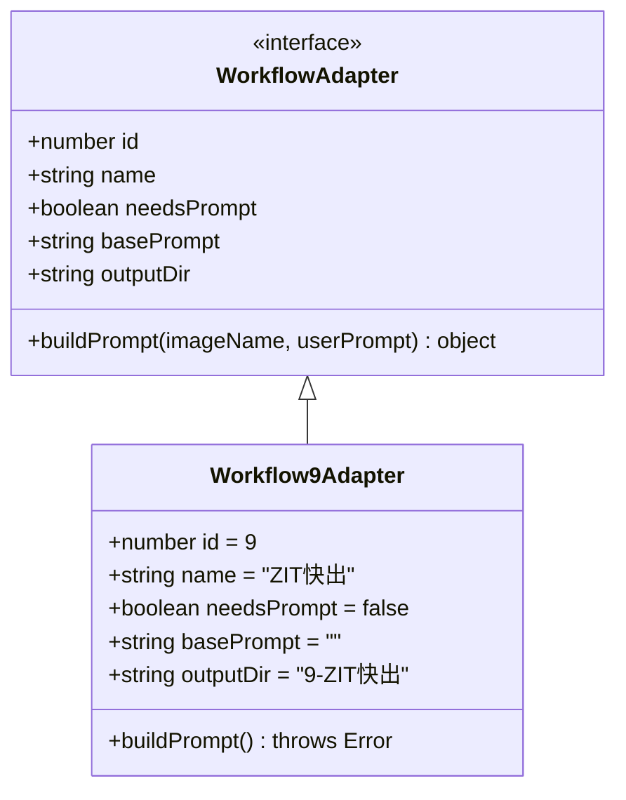

#### 模型元数据管理
**更新** 服务器端提供完整的模型元数据管理 API：

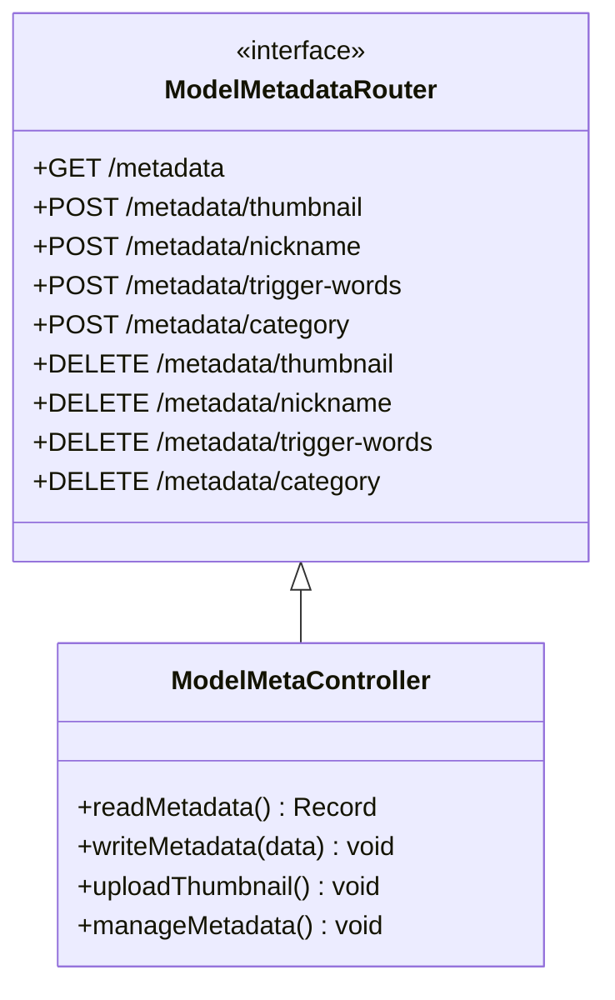

**图表来源**
- [Workflow9Adapter.ts:3-13](file://server/src/adapters/Workflow9Adapter.ts#L3-L13)
- [index.ts:13-24](file://server/src/adapters/index.ts#L13-L24)
- [modelMeta.ts:43-227](file://server/src/routes/modelMeta.ts#L43-L227)

**章节来源**
- [workflow.ts:182-261](file://server/src/routes/workflow.ts#L182-L261)
- [Workflow9Adapter.ts:1-14](file://server/src/adapters/Workflow9Adapter.ts#L1-L14)
- [modelMeta.ts:1-228](file://server/src/routes/modelMeta.ts#L1-L228)

## 性能考虑

### 优化策略

#### 内存管理
- **本地草稿缓存**：使用 localStorage 存储临时配置，避免重复请求
- **资源清理**：及时释放预览 URL 和临时文件对象
- **批量限制**：最大支持 32 张图像的批量生成
- **组件优化**：ModelSelect 使用 useCallback 和 useMemo 优化渲染
- **元数据缓存**：useModelMetadata Hook 缓存模型元数据

#### 网络优化
- **并发控制**：逐个发送生成请求，避免服务器过载
- **错误恢复**：单个任务失败不影响其他任务执行
- **状态同步**：通过 WebSocket 实时同步任务状态
- **API 优化**：模型元数据通过单一 API 获取，减少请求次数

#### 渲染优化
- **条件渲染**：根据状态动态显示加载指示器
- **防抖处理**：避免频繁的状态更新触发重渲染
- **虚拟滚动**：对于大量输出采用懒加载策略
- **组件拆分**：ModelSelect 和 PromptContextMenu 独立封装，便于维护和测试
- **分类颜色缓存**：使用 localStorage 缓存分类颜色映射
- **统一卡片布局**：通过 CSS 变量和统一样式减少重复计算

#### 样式优化
- **CSS 变量复用**：使用 `var(--color-border)` 等变量确保样式一致性
- **动画性能**：使用 GPU 加速的动画属性如 `transform` 和 `opacity`
- **阴影优化**：通过 `box-shadow` 和 `outline` 实现轻量级视觉效果
- **过渡效果**：使用 `transition` 属性实现流畅的交互反馈

## 故障排除指南

### 常见问题及解决方案

#### 模型加载失败
**症状**：UNet 或 LoRA 模型列表为空
**解决方案**：
1. 检查 ComfyUI 服务是否正常运行
2. 验证模型文件路径配置
3. 查看浏览器开发者工具的网络请求
4. **新增** 检查 ModelSelect 是否正确显示加载状态
5. 验证服务器端模型元数据 API 是否正常工作

#### PromptContextMenu 交互异常
**症状**：右键菜单无法正常显示或插入触发词
**解决方案**：
1. 检查外部点击事件监听器是否正常工作
2. 验证启用的LoRA模型列表数据格式
3. 查看控制台是否有 JavaScript 错误
4. 确认模型元数据加载状态
5. **新增** 检查触发词数据是否正确传递给菜单组件

#### ModelSelect 交互异常
**症状**：模型选择下拉菜单无法正常展开或关闭
**解决方案**：
1. 检查外部点击事件监听器是否正常工作
2. 验证模型列表数据格式是否正确
3. 查看控制台是否有 JavaScript 错误
4. 确认收藏夹状态同步是否正常
5. **新增** 检查分类颜色缓存是否损坏

#### 触发词功能异常
**症状**：触发词状态提醒或插入功能失效
**解决方案**：
1. 检查 useModelMetadata Hook 是否正确加载元数据
2. 验证服务器端 /api/models/metadata API 是否正常
3. 确认模型是否存在触发词元数据
4. 检查浏览器跨域设置和权限配置
5. **新增** 验证 PromptContextMenu 的触发词数据传递

#### 分类管理问题
**症状**：模型分类功能无法使用
**解决方案**：
1. 检查右键菜单是否正确显示
2. 验证分类颜色系统是否正常工作
3. 确认分类操作的 API 调用是否成功
4. 检查分类筛选功能是否正常
5. 验证分类颜色缓存的持久化

#### 生成任务卡住
**症状**：任务状态长时间停留在 queued
**解决方案**：
1. 检查服务器队列状态
2. 验证客户端连接状态
3. 查看 WebSocket 错误日志
4. **新增** 检查模型元数据加载状态

#### 提示词助手无响应
**症状**：AI 助手按钮点击无效
**解决方案**：
1. 确认网络连接正常
2. 检查服务器端提示词助手服务
3. 验证系统提示词配置
4. **新增** 检查触发词复制功能是否正常

#### 卡片布局显示异常
**症状**：卡片样式不一致或布局错乱
**解决方案**：
1. 检查 CSS 变量是否正确加载
2. 验证 `cardStyle` 和 `dividerStyle` 是否正确应用
3. 确认 `var(--color-border)` 等 CSS 变量值
4. 检查全局样式文件是否正确导入
5. **新增** 验证统一卡片布局系统是否正常工作

**章节来源**
- [ZITSidebar.tsx:142-151](file://client/src/components/ZITSidebar.tsx#L142-L151)
- [ModelSelect.tsx:32-42](file://client/src/components/ModelSelect.tsx#L32-L42)
- [PromptContextMenu.tsx:195-204](file://client/src/components/PromptContextMenu.tsx#L195-L204)
- [workflow.ts:746-800](file://server/src/routes/workflow.ts#L746-L800)
- [useModelMetadata.ts:13-22](file://client/src/hooks/useModelMetadata.ts#L13-L22)

## 结论

ZITSidebar 组件作为 CorineKit Pix2Real 项目的核心功能模块，成功实现了快速图像生成的完整解决方案。通过精心设计的架构和优化的用户体验，该组件为用户提供了高效、稳定的图像生成服务。

**更新** 最新版本的组件集成了全新的交互设计，移除了传统的触发词显示和复制功能，转而采用更加灵活的右键菜单机制。新的设计通过 PromptContextMenu 组件提供丰富的触发词插入选项，同时保留了 LoRA 模型使用状态的可视化提醒功能。

主要优势包括：
- **统一视觉设计**：采用新的卡片布局系统，实现与Text2ImgSidebar一致的视觉体验
- **易用性**：直观的界面设计和智能的参数配置
- **专业性**：ModelSelect 组件提供专业的模型管理体验
- **稳定性**：完善的错误处理和状态管理机制
- **扩展性**：模块化的架构支持未来功能扩展
- **性能**：优化的批量处理和资源管理策略
- **完整性**：完整的模型元数据管理功能
- **一致性**：与应用整体设计风格保持一致
- **灵活性**：基于右键菜单的触发词插入机制

该组件在整体工作流系统中扮演着关键角色，为其他侧边栏组件提供了统一的集成接口和一致的用户体验。

## 附录

### 使用示例

#### 基础使用流程
1. 在提示词区域输入或生成描述
2. 使用 ModelSelect 组件选择合适的模型和采样器参数
3. 设置图像尺寸和批量数量
4. 点击生成按钮开始处理

#### 卡片布局使用技巧
**新增** 统一卡片布局系统的使用建议：
- **卡片间距**：所有卡片使用相同的内边距和外边距，确保视觉一致性
- **分隔线**：使用统一的分隔线样式，建立清晰的视觉层次
- **颜色系统**：通过 CSS 变量 `var(--color-border)` 确保颜色一致性
- **响应式设计**：适配不同屏幕尺寸，保持布局的灵活性

#### ModelSelect 使用技巧
**新增** ModelSelect 组件的使用建议：
- **收藏常用模型**：点击星形图标将常用模型添加到收藏夹
- **智能分组**：收藏的模型会自动显示在上方区域
- **快捷切换**：通过下拉菜单快速切换不同模型
- **触发词管理**：右键点击模型查看或编辑触发词
- **分类筛选**：使用分类筛选条快速找到目标模型
- **状态反馈**：选中的模型会显示对勾标记

#### PromptContextMenu 使用技巧
**新增** PromptContextMenu 组件的使用建议：
- **右键插入**：在提示词区域右键点击弹出菜单
- **触发词选择**：从菜单中选择需要的触发词
- **智能位置**：菜单会自动调整位置避免超出屏幕
- **即时反馈**：插入后自动聚焦并保持光标位置
- **多级菜单**：支持模型级别和标签级别的触发词选择

#### LoRA状态提醒使用指南
**更新** LoRA模型状态提醒的使用建议：
- **状态图标**：通过黄色AlertTriangle图标提示未使用的触发词
- **右键插入**：点击图标可通过右键菜单插入触发词
- **智能检测**：系统会自动检测提示词中是否包含触发词
- **视觉反馈**：当触发词被使用时图标会消失

#### 参数调优建议
- **高质量生成**：steps 15-25, cfg 2-4, 使用 euler_a 采样器
- **快速生成**：steps 6-12, cfg 1-2, 使用 euler 采样器
- **LoRA 效果**：启用 LoRA 并调整强度参数

#### 批量处理最佳实践
- 单次批量不超过 8 张以保证质量
- 合理设置生成时间间隔避免服务器过载
- 使用草稿功能保存常用配置
- 利用 ModelSelect 的收藏夹功能快速选择常用模型
- **新增** 利用 PromptContextMenu 的右键插入功能快速添加触发词
- **新增** 利用 LoRA 状态提醒功能确保触发词被正确使用
- **新增** 利用统一卡片布局系统提升界面一致性