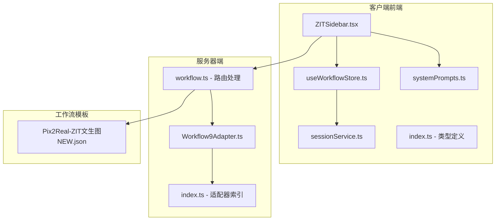
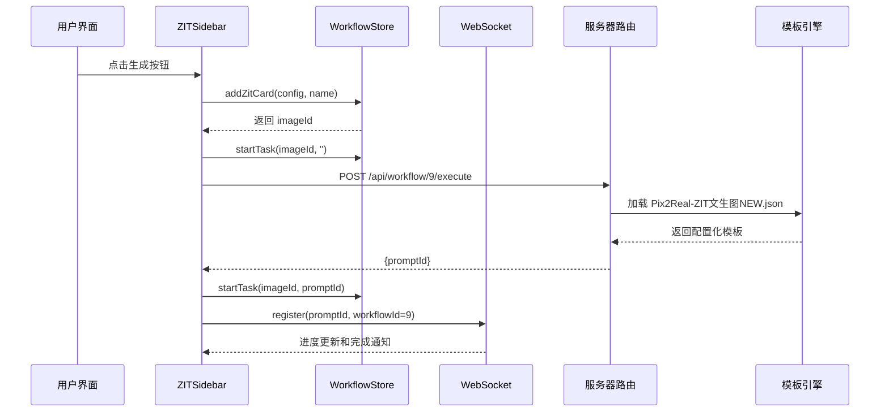
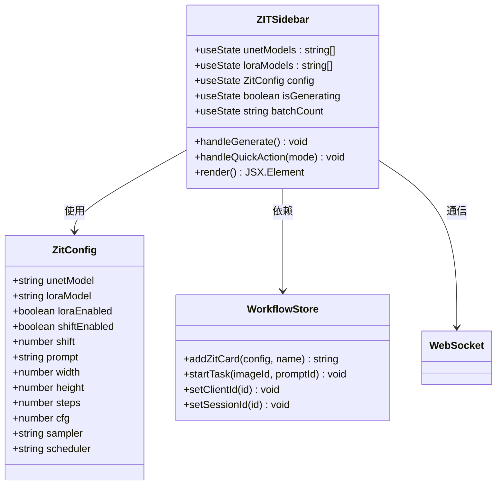
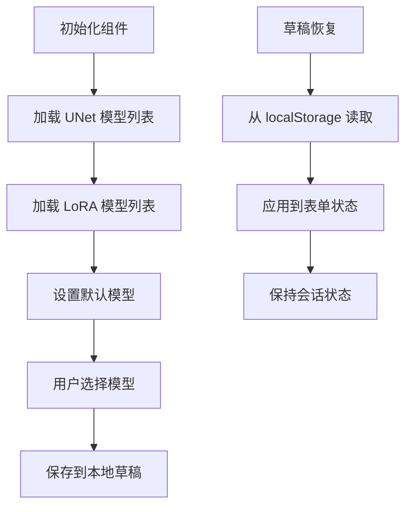
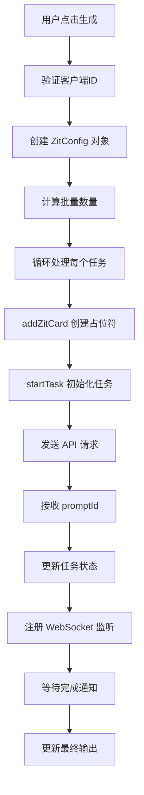
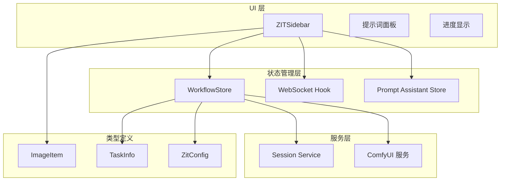
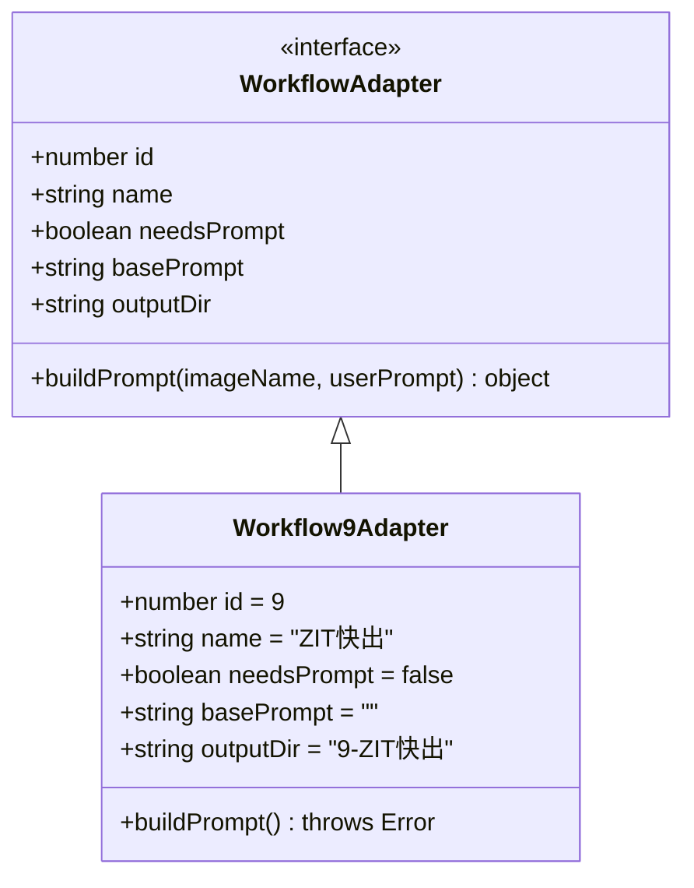

# ZIT快出侧边栏

<cite>
**本文档引用的文件**
- [ZITSidebar.tsx](file://client/src/components/ZITSidebar.tsx)
- [useWorkflowStore.ts](file://client/src/hooks/useWorkflowStore.ts)
- [sessionService.ts](file://client/src/services/sessionService.ts)
- [index.ts](file://client/src/types/index.ts)
- [systemPrompts.ts](file://client/src/components/prompt-assistant/systemPrompts.ts)
- [Workflow9Adapter.ts](file://server/src/adapters/Workflow9Adapter.ts)
- [workflow.ts](file://server/src/routes/workflow.ts)
- [Pix2Real-ZIT文生图NEW.json](file://ComfyUI_API/Pix2Real-ZIT文生图NEW.json)
- [index.ts](file://server/src/adapters/index.ts)
</cite>

## 目录
1. [简介](#简介)
2. [项目结构](#项目结构)
3. [核心组件](#核心组件)
4. [架构概览](#架构概览)
5. [详细组件分析](#详细组件分析)
6. [依赖分析](#依赖分析)
7. [性能考虑](#性能考虑)
8. [故障排除指南](#故障排除指南)
9. [结论](#结论)
10. [附录](#附录)

## 简介

ZIT快出侧边栏组件是 CorineKit Pix2Real 项目中的核心功能模块，专门用于实现快速图像生成的优化策略。该组件基于 ZIT 工作流，提供了直观的用户界面来配置和执行高质量的图像生成任务。

本组件的主要特点包括：
- **快速图像生成**：通过优化的参数配置实现高效的图像生成流程
- **批量处理能力**：支持单次生成多个图像实例
- **智能参数管理**：提供预设参数配置和工作流模板选择
- **实时进度监控**：完整的任务状态跟踪和进度显示
- **提示词辅助工具**：集成 AI 助手进行提示词优化和转换

## 项目结构

ZITSidebar 组件位于客户端前端代码结构中，与服务器端工作流适配器紧密协作：

**图表来源**
- [ZITSidebar.tsx:1-635](file://client/src/components/ZITSidebar.tsx#L1-L635)
- [useWorkflowStore.ts:1-645](file://client/src/hooks/useWorkflowStore.ts#L1-L645)
- [workflow.ts:1-862](file://server/src/routes/workflow.ts#L1-L862)

**章节来源**
- [ZITSidebar.tsx:1-635](file://client/src/components/ZITSidebar.tsx#L1-L635)
- [useWorkflowStore.ts:1-645](file://client/src/hooks/useWorkflowStore.ts#L1-L645)

## 核心组件

### ZITSidebar 主要功能特性

ZITSidebar 组件提供了完整的图像生成工作流界面，包含以下核心功能：

#### 参数配置系统
- **模型选择**：支持 UNet 和 LoRA 模型的动态加载和选择
- **采样器配置**：提供多种采样器选项（euler, euler_a, res_ms, dpm2m）
- **调度器设置**：支持不同的调度器模式（simple, 指数, ddim, beta, normal）
- **尺寸预设**：内置常用比例预设（1:1, 3:4, 9:16, 4:3, 16:9）

#### 批量处理机制
- **批量计数控制**：支持 1-32 张图像的批量生成
- **自动命名系统**：基于时间戳和自定义名称生成唯一标识符
- **并发任务管理**：逐个启动生成任务并跟踪进度

#### 实时交互功能
- **提示词助手**：集成 AI 助手进行提示词优化
- **草稿保存**：本地存储临时配置数据
- **状态反馈**：完整的加载状态和错误处理

**章节来源**
- [ZITSidebar.tsx:8-31](file://client/src/components/ZITSidebar.tsx#L8-L31)
- [ZITSidebar.tsx:16-29](file://client/src/components/ZITSidebar.tsx#L16-L29)
- [ZITSidebar.tsx:107-156](file://client/src/components/ZITSidebar.tsx#L107-L156)

## 架构概览

ZITSidebar 组件采用分层架构设计，实现了清晰的关注点分离：

**图表来源**
- [ZITSidebar.tsx:107-156](file://client/src/components/ZITSidebar.tsx#L107-L156)
- [workflow.ts:182-261](file://server/src/routes/workflow.ts#L182-L261)
- [Pix2Real-ZIT文生图NEW.json:1-172](file://ComfyUI_API/Pix2Real-ZIT文生图NEW.json#L1-L172)

## 详细组件分析

### ZITSidebar 组件架构

**图表来源**
- [ZITSidebar.tsx:36-635](file://client/src/components/ZITSidebar.tsx#L36-L635)
- [sessionService.ts:15-28](file://client/src/services/sessionService.ts#L15-L28)
- [useWorkflowStore.ts:571-593](file://client/src/hooks/useWorkflowStore.ts#L571-L593)

### 参数配置系统

#### 模型管理
组件实现了动态模型加载机制：

**图表来源**
- [ZITSidebar.tsx:47-103](file://client/src/components/ZITSidebar.tsx#L47-L103)
- [ZITSidebar.tsx:32-34](file://client/src/components/ZITSidebar.tsx#L32-L34)

#### 采样器配置
支持多种采样器和调度器组合：

| 采样器类型 | 适用场景 | 推荐参数 |
|-----------|----------|----------|
| euler | 通用生成 | steps: 9-15, cfg: 1-2 |
| euler_a | 更稳定 | steps: 12-20, cfg: 1-3 |
| res_ms | 高质量 | steps: 15-25, cfg: 2-4 |
| dpm2m | 快速生成 | steps: 6-12, cfg: 1-2 |

**章节来源**
- [ZITSidebar.tsx:16-29](file://client/src/components/ZITSidebar.tsx#L16-L29)
- [ZITSidebar.tsx:503-526](file://client/src/components/ZITSidebar.tsx#L503-L526)

### 批量处理机制

#### 任务队列管理
组件实现了智能的任务队列管理：

**图表来源**
- [ZITSidebar.tsx:107-156](file://client/src/components/ZITSidebar.tsx#L107-L156)
- [useWorkflowStore.ts:571-593](file://client/src/hooks/useWorkflowStore.ts#L571-L593)

**章节来源**
- [ZITSidebar.tsx:125-156](file://client/src/components/ZITSidebar.tsx#L125-L156)
- [useWorkflowStore.ts:377-396](file://client/src/hooks/useWorkflowStore.ts#L377-L396)

### 提示词辅助系统

#### AI 助手集成
组件集成了多种提示词转换模式：

| 模式 | 功能描述 | 使用场景 |
|------|----------|----------|
| naturalToTags | 自然语言转标签 | 从中文描述生成英文标签 |
| tagsToNatural | 标签转自然语言 | 将标签转换为详细描述 |
| detailer | 按需扩写 | 扩展特定元素的描述细节 |

**章节来源**
- [ZITSidebar.tsx:158-179](file://client/src/components/ZITSidebar.tsx#L158-L179)
- [systemPrompts.ts:4-145](file://client/src/components/prompt-assistant/systemPrompts.ts#L4-L145)

## 依赖分析

### 组件间依赖关系

**图表来源**
- [ZITSidebar.tsx:1-8](file://client/src/components/ZITSidebar.tsx#L1-L8)
- [useWorkflowStore.ts:1-6](file://client/src/hooks/useWorkflowStore.ts#L1-L6)
- [index.ts:1-58](file://client/src/types/index.ts#L1-L58)

### 服务器端集成

#### 工作流适配器
服务器端通过适配器模式实现工作流的统一管理：

**图表来源**
- [Workflow9Adapter.ts:3-13](file://server/src/adapters/Workflow9Adapter.ts#L3-L13)
- [index.ts:13-24](file://server/src/adapters/index.ts#L13-L24)

**章节来源**
- [workflow.ts:182-261](file://server/src/routes/workflow.ts#L182-L261)
- [Workflow9Adapter.ts:1-14](file://server/src/adapters/Workflow9Adapter.ts#L1-L14)

## 性能考虑

### 优化策略

#### 内存管理
- **本地草稿缓存**：使用 localStorage 存储临时配置，避免重复请求
- **资源清理**：及时释放预览 URL 和临时文件对象
- **批量限制**：最大支持 32 张图像的批量生成

#### 网络优化
- **并发控制**：逐个发送生成请求，避免服务器过载
- **错误恢复**：单个任务失败不影响其他任务执行
- **状态同步**：通过 WebSocket 实时同步任务状态

#### 渲染优化
- **条件渲染**：根据状态动态显示加载指示器
- **防抖处理**：避免频繁的状态更新触发重渲染
- **虚拟滚动**：对于大量输出采用懒加载策略

## 故障排除指南

### 常见问题及解决方案

#### 模型加载失败
**症状**：UNet 或 LoRA 模型列表为空
**解决方案**：
1. 检查 ComfyUI 服务是否正常运行
2. 验证模型文件路径配置
3. 查看浏览器开发者工具的网络请求

#### 生成任务卡住
**症状**：任务状态长时间停留在 queued
**解决方案**：
1. 检查服务器队列状态
2. 验证客户端连接状态
3. 查看 WebSocket 错误日志

#### 提示词助手无响应
**症状**：AI 助手按钮点击无效
**解决方案**：
1. 确认网络连接正常
2. 检查服务器端提示词助手服务
3. 验证系统提示词配置

**章节来源**
- [ZITSidebar.tsx:142-151](file://client/src/components/ZITSidebar.tsx#L142-L151)
- [workflow.ts:746-800](file://server/src/routes/workflow.ts#L746-L800)

## 结论

ZITSidebar 组件作为 CorineKit Pix2Real 项目的核心功能模块，成功实现了快速图像生成的完整解决方案。通过精心设计的架构和优化的用户体验，该组件为用户提供了高效、稳定的图像生成服务。

主要优势包括：
- **易用性**：直观的界面设计和智能的参数配置
- **稳定性**：完善的错误处理和状态管理机制
- **扩展性**：模块化的架构支持未来功能扩展
- **性能**：优化的批量处理和资源管理策略

该组件在整体工作流系统中扮演着关键角色，为其他侧边栏组件提供了统一的集成接口和一致的用户体验。

## 附录

### 使用示例

#### 基础使用流程
1. 在提示词区域输入或生成描述
2. 选择合适的模型和采样器参数
3. 设置图像尺寸和批量数量
4. 点击生成按钮开始处理

#### 参数调优建议
- **高质量生成**：steps 15-25, cfg 2-4, 使用 euler_a 采样器
- **快速生成**：steps 6-12, cfg 1-2, 使用 euler 采样器
- **LoRA 效果**：启用 LoRA 并调整强度参数

#### 批量处理最佳实践
- 单次批量不超过 8 张以保证质量
- 合理设置生成时间间隔避免服务器过载
- 使用草稿功能保存常用配置