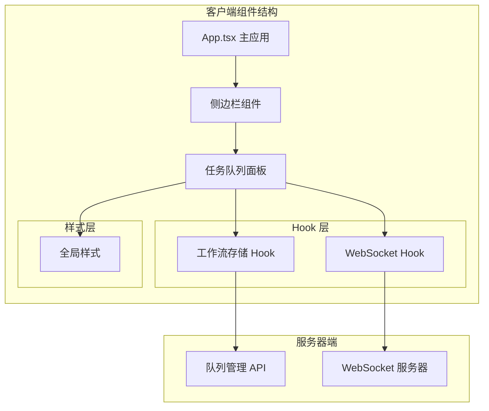
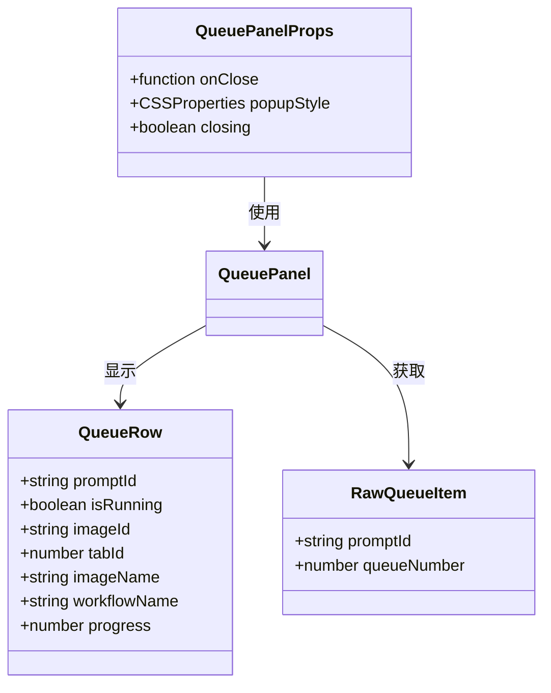
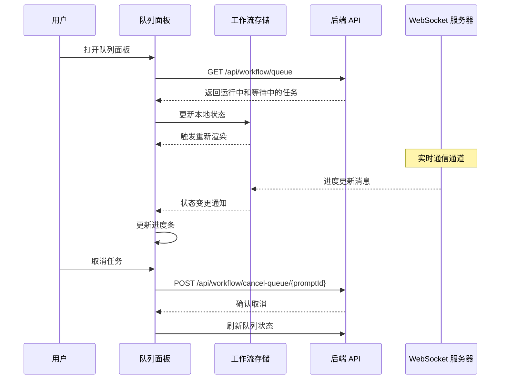
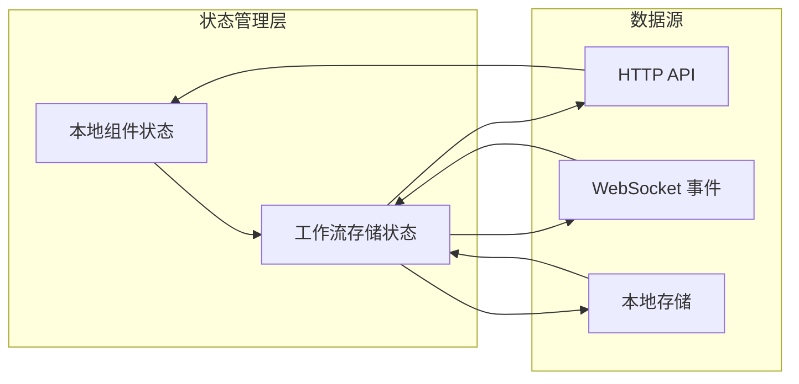
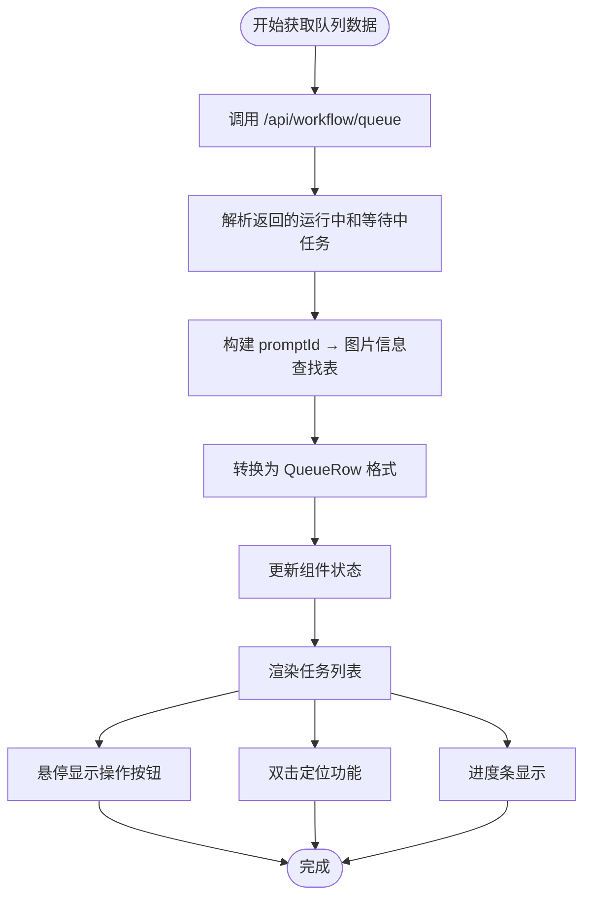
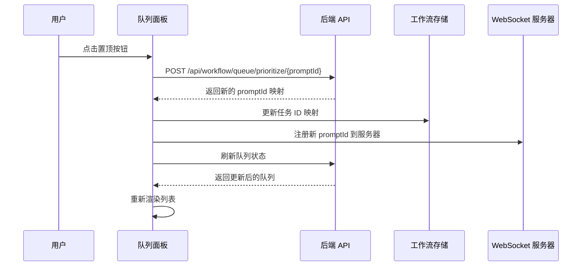
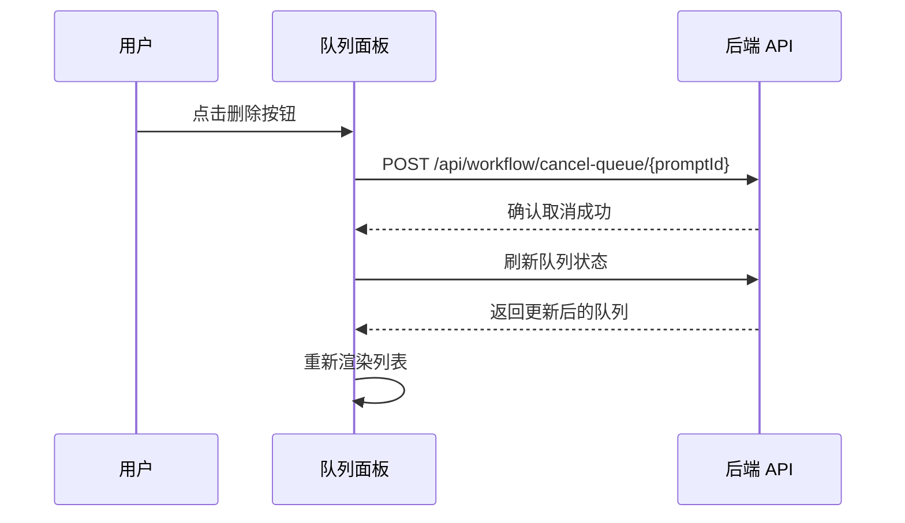
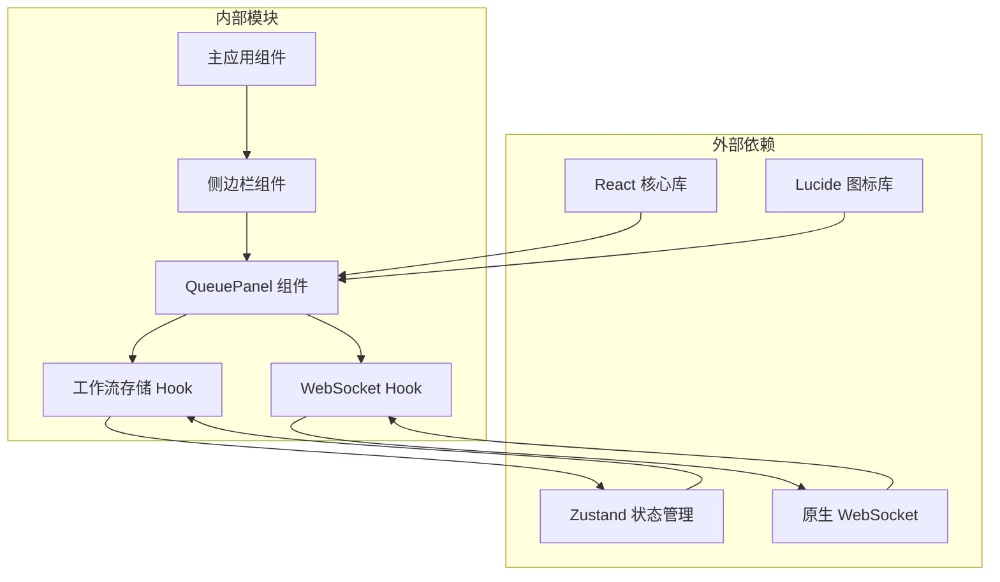
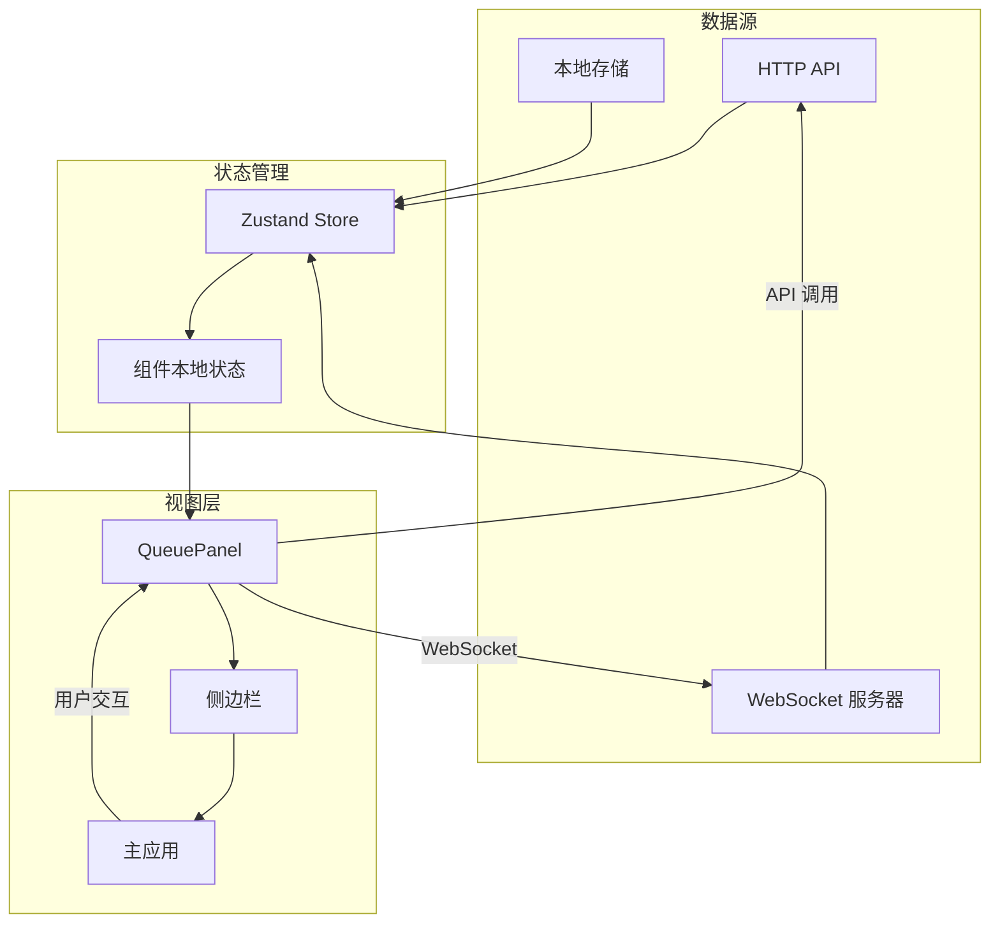

# 任务队列面板

<cite>
**本文档引用的文件**
- [QueuePanel.tsx](file://client/src/components/QueuePanel.tsx)
- [useWorkflowStore.ts](file://client/src/hooks/useWorkflowStore.ts)
- [useWebSocket.ts](file://client/src/hooks/useWebSocket.ts)
- [index.ts](file://client/src/types/index.ts)
- [Sidebar.tsx](file://client/src/components/Sidebar.tsx)
- [App.tsx](file://client/src/components/App.tsx)
- [global.css](file://client/src/styles/global.css)
</cite>

## 目录
1. [简介](#简介)
2. [项目结构](#项目结构)
3. [核心组件](#核心组件)
4. [架构概览](#架构概览)
5. [详细组件分析](#详细组件分析)
6. [依赖关系分析](#依赖关系分析)
7. [性能考虑](#性能考虑)
8. [故障排除指南](#故障排除指南)
9. [结论](#结论)

## 简介

任务队列面板（QueuePanel）是 CorineKit Pix2Real 项目中的关键 UI 组件，负责可视化管理所有正在进行和等待中的任务队列。该组件提供了完整的队列管理功能，包括任务列表展示、队列操作、进度监控和实时状态更新。

QueuePanel 采用弹出式设计，位于侧边栏底部，通过向上展开的动画效果呈现。组件集成了 WebSocket 实时通信，能够实时接收任务状态变化，为用户提供即时的任务进度反馈。

## 项目结构

QueuePanel 组件在项目中的位置和组织结构如下：

**图表来源**
- [App.tsx:54-335](file://client/src/components/App.tsx#L54-L335)
- [Sidebar.tsx:30-425](file://client/src/components/Sidebar.tsx#L30-L425)
- [QueuePanel.tsx:26-306](file://client/src/components/QueuePanel.tsx#L26-L306)

**章节来源**
- [App.tsx:54-335](file://client/src/components/App.tsx#L54-L335)
- [Sidebar.tsx:30-425](file://client/src/components/Sidebar.tsx#L30-L425)

## 核心组件

### QueuePanel 组件架构

QueuePanel 是一个功能完整的 React 组件，采用函数式组件设计，集成了多种状态管理和数据获取机制：

#### 主要特性
- **实时队列监控**：每 2 秒自动刷新队列状态
- **多状态任务显示**：区分进行中和等待中的任务
- **交互式操作**：支持任务优先级调整和取消
- **智能定位**：双击任务可直接定位到对应图片卡片
- **响应式设计**：适配不同屏幕尺寸和主题

#### 数据结构设计

组件内部使用了专门的数据结构来管理队列信息：

**图表来源**
- [QueuePanel.tsx:5-24](file://client/src/components/QueuePanel.tsx#L5-L24)

**章节来源**
- [QueuePanel.tsx:26-306](file://client/src/components/QueuePanel.tsx#L26-L306)

## 架构概览

### 整体系统架构

QueuePanel 的运行依赖于完整的前端架构，包括状态管理、WebSocket 通信和 API 调用：

**图表来源**
- [QueuePanel.tsx:37-87](file://client/src/components/QueuePanel.tsx#L37-L87)
- [useWebSocket.ts:26-47](file://client/src/hooks/useWebSocket.ts#L26-L47)

### 状态管理架构

组件的状态管理采用了分层设计：

**图表来源**
- [useWorkflowStore.ts:96-645](file://client/src/hooks/useWorkflowStore.ts#L96-L645)
- [QueuePanel.tsx:27-87](file://client/src/components/QueuePanel.tsx#L27-L87)

**章节来源**
- [useWorkflowStore.ts:96-645](file://client/src/hooks/useWorkflowStore.ts#L96-L645)
- [useWebSocket.ts:10-73](file://client/src/hooks/useWebSocket.ts#L10-L73)

## 详细组件分析

### 队列面板核心功能

#### 1. 任务列表展示

QueuePanel 将队列中的任务分为两类进行展示：

**进行中任务（Running Tasks）**
- 使用脉冲动画指示活跃状态
- 显示实时进度百分比
- 支持快速取消操作

**等待中任务（Pending Tasks）**
- 显示任务的排队状态
- 提供优先级调整功能
- 支持立即取消操作

#### 2. 实时状态更新机制

组件通过双重机制确保状态的实时性：

**定时轮询**
- 每 2 秒自动刷新队列状态
- 通过 HTTP API 获取最新队列信息
- 自动处理网络异常情况

**WebSocket 实时通信**
- 建立持久连接监听任务状态变化
- 接收进度更新、完成通知和错误信息
- 自动重连机制确保连接稳定性

#### 3. 用户交互设计

QueuePanel 提供了丰富的用户交互功能：

**悬停操作**
- 鼠标悬停显示操作按钮
- 避免布局跳变影响用户体验
- 按钮透明度渐变增强视觉反馈

**双击定位**
- 双击任务项可直接定位到对应图片
- 平滑滚动到目标位置
- 添加闪烁动画高亮显示

**批量操作**
- 支持单个任务的优先级调整
- 提供任务取消功能
- 智能映射新旧任务 ID

### 组件实现细节

#### 数据获取和转换

**图表来源**
- [QueuePanel.tsx:37-81](file://client/src/components/QueuePanel.tsx#L37-L81)

#### 任务操作流程

**优先级调整流程**

**图表来源**
- [QueuePanel.tsx:89-116](file://client/src/components/QueuePanel.tsx#L89-L116)

**任务取消流程**

**图表来源**
- [QueuePanel.tsx:118-121](file://client/src/components/QueuePanel.tsx#L118-L121)

**章节来源**
- [QueuePanel.tsx:37-133](file://client/src/components/QueuePanel.tsx#L37-L133)

### 样式和动画设计

#### 弹出式设计实现

QueuePanel 采用了独特的弹出式设计，通过 CSS 动画实现流畅的展开和收起效果：

**动画效果**
- `panel-enter-up`: 向上展开进入动画
- `panel-exit-up`: 向上收起退出动画
- 脉冲动画：用于指示进行中任务的活跃状态

**布局协调**
- 绝对定位确保面板可以覆盖主界面内容
- 固定尺寸（380px 宽，最大 440px 高）
- 与侧边栏布局完美协调

#### 响应式设计

组件支持多种响应式场景：

**主题适配**
- 自动适配浅色和深色主题
- 使用 CSS 变量确保颜色一致性
- 动态主题切换支持

**交互反馈**
- 悬停状态的颜色变化
- 点击状态的视觉反馈
- 加载状态的骨架屏效果

**章节来源**
- [global.css:160-172](file://client/src/styles/global.css#L160-L172)
- [global.css:56-59](file://client/src/styles/global.css#L56-L59)

## 依赖关系分析

### 组件间依赖关系

**图表来源**
- [QueuePanel.tsx:1-5](file://client/src/components/QueuePanel.tsx#L1-L5)
- [useWorkflowStore.ts:1-4](file://client/src/hooks/useWorkflowStore.ts#L1-L4)
- [useWebSocket.ts:1-3](file://client/src/hooks/useWebSocket.ts#L1-L3)

### 数据流依赖

组件的数据流遵循单向数据流原则：

**图表来源**
- [useWorkflowStore.ts:96-645](file://client/src/hooks/useWorkflowStore.ts#L96-L645)
- [QueuePanel.tsx:26-87](file://client/src/components/QueuePanel.tsx#L26-L87)

**章节来源**
- [useWorkflowStore.ts:96-645](file://client/src/hooks/useWorkflowStore.ts#L96-L645)
- [QueuePanel.tsx:26-87](file://client/src/components/QueuePanel.tsx#L26-L87)

## 性能考虑

### 优化策略

#### 1. 渲染性能优化

**虚拟滚动**
- 仅渲染可见区域内的任务项
- 避免大量 DOM 元素同时渲染
- 动态计算列表高度适应内容变化

**状态更新优化**
- 使用 React.memo 避免不必要的重渲染
- 分离独立的状态更新逻辑
- 智能的重新渲染触发条件

#### 2. 网络性能优化

**请求去抖**
- 防止频繁的 API 请求
- 合并短时间内的状态查询
- 智能的轮询间隔调整

**缓存策略**
- 利用浏览器缓存减少重复请求
- 智能的错误处理避免无限重试
- 断线重连的指数退避机制

#### 3. 内存管理

**资源清理**
- 组件卸载时自动清理定时器
- WebSocket 连接的正确关闭
- 事件监听器的及时移除

**状态清理**
- 及时释放不再使用的图片资源
- 清理过期的任务状态信息
- 避免内存泄漏的循环引用

## 故障排除指南

### 常见问题及解决方案

#### 1. 队列数据不更新

**症状**：任务状态长时间不变化

**可能原因**：
- WebSocket 连接断开
- API 服务不可用
- 浏览器缓存问题

**解决步骤**：
1. 检查网络连接状态
2. 验证 WebSocket 服务器是否正常运行
3. 清除浏览器缓存后重试
4. 查看浏览器开发者工具的网络面板

#### 2. 任务操作失败

**症状**：点击置顶或取消按钮无响应

**可能原因**：
- 后端 API 调用失败
- 权限验证失败
- 任务状态已改变

**解决步骤**：
1. 检查 API 返回的状态码
2. 验证用户权限和会话状态
3. 刷新页面重新获取最新状态
4. 查看控制台错误信息

#### 3. 动画效果异常

**症状**：面板展开/收起动画不流畅

**可能原因**：
- CSS 动画冲突
- 浏览器兼容性问题
- 系统性能不足

**解决步骤**：
1. 检查 CSS 动画属性是否被覆盖
2. 测试在不同浏览器中的表现
3. 关闭其他占用系统资源的应用
4. 调整动画持续时间和缓动函数

### 调试工具和技巧

#### 开发者工具使用

**React DevTools**
- 检查组件的 props 和 state
- 分析渲染性能瓶颈
- 跟踪状态变化历史

**网络面板**
- 监控 API 请求和响应
- 分析 WebSocket 连接状态
- 调试请求超时和错误

**性能面板**
- 监控内存使用情况
- 分析 JavaScript 执行时间
- 检测重绘和回流

**章节来源**
- [useWebSocket.ts:53-65](file://client/src/hooks/useWebSocket.ts#L53-L65)
- [QueuePanel.tsx:78-81](file://client/src/components/QueuePanel.tsx#L78-L81)

## 结论

QueuePanel 组件作为 CorineKit Pix2Real 项目的核心 UI 组件，展现了现代前端开发的最佳实践。通过精心设计的架构和实现，该组件成功地解决了复杂任务队列管理的可视化需求。

### 主要成就

**用户体验优化**
- 流畅的弹出式交互体验
- 即时的状态反馈机制
- 直观的操作界面设计

**技术实现亮点**
- 双重状态同步机制（轮询 + WebSocket）
- 智能的任务状态管理
- 响应式的样式设计

**可维护性保证**
- 清晰的代码结构和注释
- 完善的错误处理机制
- 良好的性能优化策略

### 未来改进方向

**功能扩展**
- 支持批量任务操作
- 添加任务筛选和搜索功能
- 实现任务优先级排序

**性能提升**
- 实现虚拟滚动优化
- 添加请求缓存机制
- 优化 WebSocket 连接管理

**用户体验增强**
- 添加任务历史记录
- 实现任务导出功能
- 增强键盘快捷键支持

QueuePanel 组件不仅满足了当前的功能需求，更为未来的功能扩展奠定了坚实的基础。其设计思路和实现方案为类似的复杂 UI 组件开发提供了宝贵的参考价值。