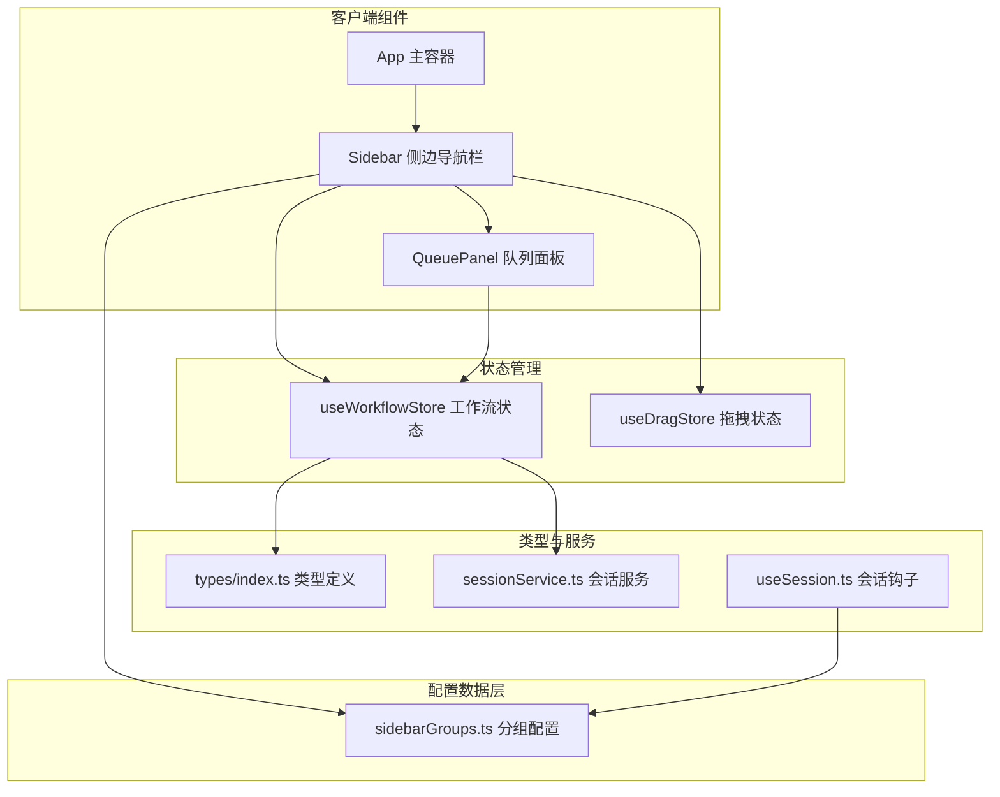
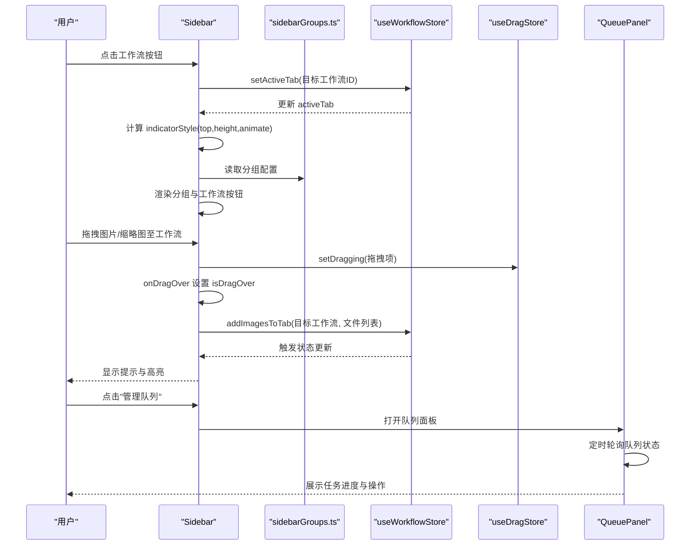
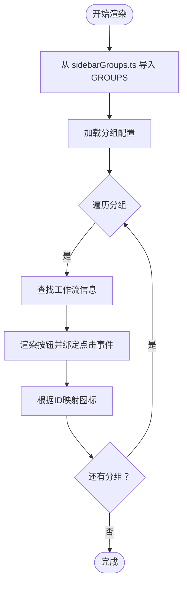
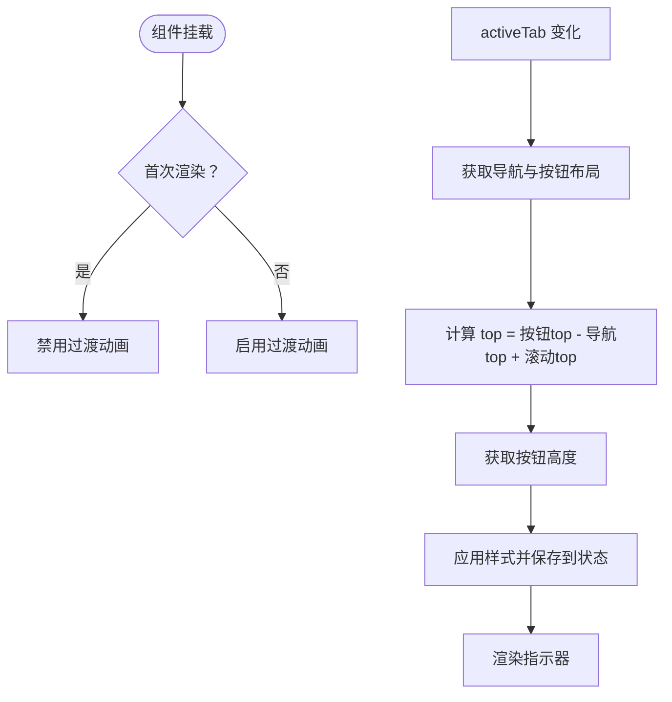
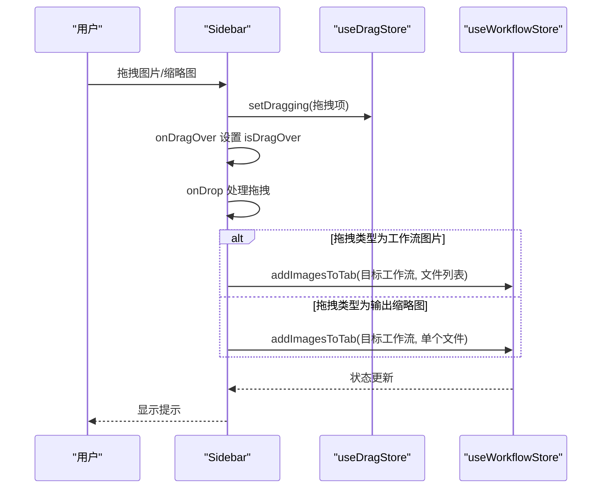
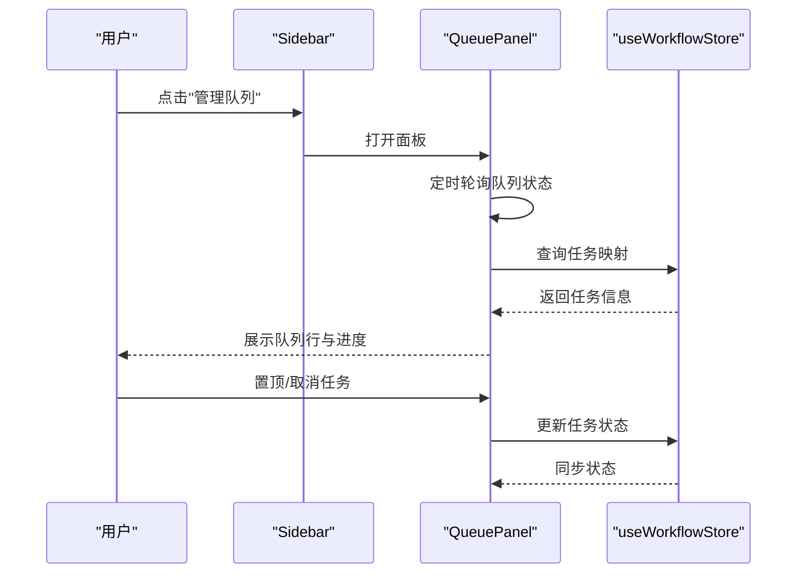
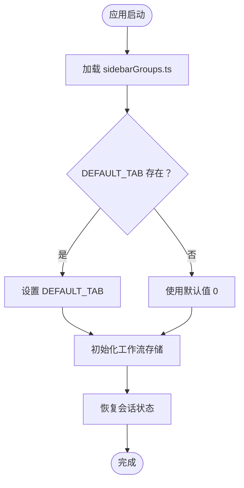
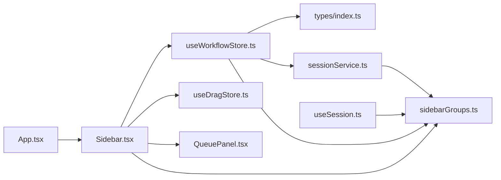

# 侧边导航栏

<cite>
**本文档引用的文件**
- [Sidebar.tsx](file://client/src/components/Sidebar.tsx)
- [sidebarGroups.ts](file://client/src/data/sidebarGroups.ts)
- [useWorkflowStore.ts](file://client/src/hooks/useWorkflowStore.ts)
- [useDragStore.ts](file://client/src/hooks/useDragStore.ts)
- [QueuePanel.tsx](file://client/src/components/QueuePanel.tsx)
- [App.tsx](file://client/src/components/App.tsx)
- [index.ts](file://client/src/types/index.ts)
- [sessionService.ts](file://client/src/services/sessionService.ts)
- [useSession.ts](file://client/src/hooks/useSession.ts)
</cite>

## 更新摘要
**变更内容**
- 更新工作流分组配置系统：GROUPS 常量已从 Sidebar.tsx 移动到独立的数据文件
- 新增 DEFAULT_TAB 导出用于动态标签页选择
- 增强配置系统的模块化和可维护性
- 优化跨组件配置共享机制

## 目录
1. [简介](#简介)
2. [项目结构](#项目结构)
3. [核心组件](#核心组件)
4. [架构总览](#架构总览)
5. [详细组件分析](#详细组件分析)
6. [依赖关系分析](#依赖关系分析)
7. [性能考虑](#性能考虑)
8. [故障排除指南](#故障排除指南)
9. [结论](#结论)

## 简介
本文件为 CorineKit Pix2Real 项目的侧边导航栏组件（Sidebar）的深度技术文档。该组件负责：
- 工作流分组管理：按功能域对多个工作流进行分组展示
- 图标映射：为每个工作流分配专用图标
- 拖拽交互：支持跨工作流拖拽图片、输出缩略图等
- 活动指示器：动态计算并显示当前激活工作流的指示样式
- 队列面板集成：底部队列管理入口，支持任务状态查看与控制

通过本文件，读者可以理解组件的设计架构、数据流、交互流程与性能优化策略，并获得使用示例与故障排除建议。

## 项目结构
Sidebar 组件位于前端客户端代码中，与全局状态管理、拖拽状态、队列面板等模块协同工作。其主要职责是作为主界面的导航中枢，连接用户操作与工作流执行。

**图表来源**
- [App.tsx:136-247](file://client/src/components/App.tsx#L136-L247)
- [Sidebar.tsx:30-424](file://client/src/components/Sidebar.tsx#L30-L424)
- [sidebarGroups.ts:1-14](file://client/src/data/sidebarGroups.ts#L1-L14)
- [useWorkflowStore.ts:96-644](file://client/src/hooks/useWorkflowStore.ts#L96-L644)
- [useDragStore.ts:13-16](file://client/src/hooks/useDragStore.ts#L13-L16)
- [QueuePanel.tsx:26-305](file://client/src/components/QueuePanel.tsx#L26-L305)
- [index.ts:1-58](file://client/src/types/index.ts#L1-L58)
- [sessionService.ts:103-113](file://client/src/services/sessionService.ts#L103-L113)
- [useSession.ts:17-287](file://client/src/hooks/useSession.ts#L17-L287)

**章节来源**
- [App.tsx:136-247](file://client/src/components/App.tsx#L136-L247)
- [Sidebar.tsx:30-424](file://client/src/components/Sidebar.tsx#L30-L424)

## 核心组件
本节聚焦 Sidebar 组件的核心能力与实现要点，包括工作流分组、图标映射、拖拽处理、活动指示器与队列集成。

- 工作流分组（GROUPS）
  - 将工作流按功能域划分为"图像处理"和"图像生成"两大组，便于用户快速定位目标工作流。
  - 分组结构为数组，每项包含标签与对应工作流 ID 列表。
  - **更新**：分组配置已迁移至独立的数据文件，支持跨组件共享配置。

- 工作流图标映射（WORKFLOW_ICONS）
  - 使用键值对记录每个工作流 ID 对应的图标组件，确保界面一致的视觉表达。
  - 支持在不修改渲染逻辑的前提下扩展或替换图标。

- 活动指示器（indicatorStyle 动态计算）
  - 基于当前激活工作流按钮的位置与滚动偏移，计算指示器的 top 与高度。
  - 首次初始化时禁用过渡动画，后续切换启用平滑过渡，提升用户体验。

- 拖拽交互
  - 原生 dragover 监听确保外部拖拽事件的可靠处理。
  - 支持两种拖拽类型：工作流图片与输出缩略图；根据目标工作流限制（如文本生成类工作流不接受图片拖拽）进行过滤。
  - 拖拽悬停高亮与阴影边框，直观反馈可放置区域。

- 队列面板集成
  - 底部"管理队列"按钮，点击展开向上弹出的队列面板。
  - 队列面板定时轮询后端队列状态，展示运行中与排队中的任务，并提供置顶与取消操作。

**章节来源**
- [Sidebar.tsx:11-28](file://client/src/components/Sidebar.tsx#L11-L28)
- [Sidebar.tsx:83-96](file://client/src/components/Sidebar.tsx#L83-L96)
- [Sidebar.tsx:124-209](file://client/src/components/Sidebar.tsx#L124-L209)
- [Sidebar.tsx:352-421](file://client/src/components/Sidebar.tsx#L352-L421)

## 架构总览
Sidebar 与主应用、状态管理、队列面板之间的协作关系如下：

**图表来源**
- [Sidebar.tsx:31-35](file://client/src/components/Sidebar.tsx#L31-L35)
- [Sidebar.tsx:83-96](file://client/src/components/Sidebar.tsx#L83-L96)
- [Sidebar.tsx:124-209](file://client/src/components/Sidebar.tsx#L124-L209)
- [Sidebar.tsx:352-421](file://client/src/components/Sidebar.tsx#L352-L421)
- [QueuePanel.tsx:37-87](file://client/src/components/QueuePanel.tsx#L37-L87)
- [sidebarGroups.ts:12-13](file://client/src/data/sidebarGroups.ts#L12-L13)

## 详细组件分析

### 工作流分组与图标映射
- 分组逻辑
  - 通过常量数组定义分组，每组包含标签与工作流 ID 列表。
  - 渲染时遍历分组，再遍历组内 ID，查找对应工作流信息并绘制按钮。
- 图标映射
  - 使用字典将工作流 ID 映射到具体图标组件，渲染时直接取用。
  - 支持扩展新的工作流与图标，无需改动渲染循环。

**更新**：分组配置已迁移至独立的数据文件，提供更好的模块化和可维护性。

**图表来源**
- [Sidebar.tsx:11-28](file://client/src/components/Sidebar.tsx#L11-L28)
- [Sidebar.tsx:253-349](file://client/src/components/Sidebar.tsx#L253-L349)
- [sidebarGroups.ts:4-10](file://client/src/data/sidebarGroups.ts#L4-L10)

**章节来源**
- [Sidebar.tsx:11-28](file://client/src/components/Sidebar.tsx#L11-L28)
- [Sidebar.tsx:253-349](file://client/src/components/Sidebar.tsx#L253-L349)
- [sidebarGroups.ts:4-10](file://client/src/data/sidebarGroups.ts#L4-L10)

### 活动指示器与动画
- 指示器样式计算
  - 通过 ref 获取导航容器与当前激活按钮的布局信息。
  - 计算相对顶部偏移与按钮高度，结合滚动位置得到最终 top。
  - 首次初始化时关闭过渡动画，避免初始跳变；后续切换启用贝塞尔曲线过渡。
- 渲染与交互
  - 指示器为绝对定位元素，层级低于按钮，确保视觉层次正确。
  - 激活状态改变时触发重新计算，保证指示器始终与按钮对齐。

**图表来源**
- [Sidebar.tsx:83-96](file://client/src/components/Sidebar.tsx#L83-L96)
- [Sidebar.tsx:235-251](file://client/src/components/Sidebar.tsx#L235-L251)

**章节来源**
- [Sidebar.tsx:83-96](file://client/src/components/Sidebar.tsx#L83-L96)
- [Sidebar.tsx:235-251](file://client/src/components/Sidebar.tsx#L235-L251)

### 拖拽事件处理机制
- 原生 dragover 监听
  - 在组件根元素上绑定原生事件监听，确保外部拖拽事件的可靠处理。
  - 仅当拖拽类型为工作流图片或输出缩略图时才允许放置。
- 拖拽类型与目标过滤
  - 支持两种拖拽类型：工作流图片与输出缩略图。
  - 文本生成类工作流（如文本到图像）不接受图片拖拽，避免误操作。
- 跨工作流复制
  - 从源工作流提取选中图片或输出，构造本地文件对象并导入目标工作流。
  - 成功导入后显示提示消息，包含导入数量与目标工作流名称。

**图表来源**
- [Sidebar.tsx:50-65](file://client/src/components/Sidebar.tsx#L50-L65)
- [Sidebar.tsx:124-209](file://client/src/components/Sidebar.tsx#L124-L209)
- [useDragStore.ts:13-16](file://client/src/hooks/useDragStore.ts#L13-L16)

**章节来源**
- [Sidebar.tsx:50-65](file://client/src/components/Sidebar.tsx#L50-L65)
- [Sidebar.tsx:124-209](file://client/src/components/Sidebar.tsx#L124-L209)
- [useDragStore.ts:13-16](file://client/src/hooks/useDragStore.ts#L13-L16)

### 队列面板与状态同步
- 队列面板打开与关闭
  - 点击"管理队列"按钮切换面板显隐，关闭时添加淡入淡出动画类名。
  - 点击外部区域可自动关闭面板，避免遮挡主内容。
- 队列状态轮询
  - 每隔固定时间向后端查询队列状态，合并运行中与排队中的任务。
  - 将任务映射为可读的队列行，包含工作流名称、图片名称与进度条。
- 状态同步与操作
  - 支持置顶与取消任务，置顶后根据返回的提示 ID 映射更新状态。
  - 定位到任务对应的卡片，高亮闪烁以引导用户关注。

**图表来源**
- [Sidebar.tsx:352-421](file://client/src/components/Sidebar.tsx#L352-L421)
- [QueuePanel.tsx:37-87](file://client/src/components/QueuePanel.tsx#L37-L87)
- [QueuePanel.tsx:89-133](file://client/src/components/QueuePanel.tsx#L89-L133)

**章节来源**
- [Sidebar.tsx:352-421](file://client/src/components/Sidebar.tsx#L352-L421)
- [QueuePanel.tsx:37-87](file://client/src/components/QueuePanel.tsx#L37-L87)
- [QueuePanel.tsx:89-133](file://client/src/components/QueuePanel.tsx#L89-L133)

### 默认标签页选择机制
**新增功能**：系统现在支持动态默认标签页选择，通过 DEFAULT_TAB 导出实现。

- 默认标签页选择
  - DEFAULT_TAB 基于 GROUPS 的第一个可见分组的第一个工作流 ID 自动确定。
  - 确保新用户首次访问时自动进入最常用的工作流。
- 会话恢复支持
  - 会话钩子在恢复时使用 DEFAULT_TAB 作为回退选项。
  - 支持用户自定义默认工作流的灵活配置。

**图表来源**
- [sidebarGroups.ts:12-13](file://client/src/data/sidebarGroups.ts#L12-L13)
- [useWorkflowStore.ts:100](file://client/src/hooks/useWorkflowStore.ts#L100)
- [useSession.ts:287](file://client/src/hooks/useSession.ts#L287)

**章节来源**
- [sidebarGroups.ts:12-13](file://client/src/data/sidebarGroups.ts#L12-L13)
- [useWorkflowStore.ts:100](file://client/src/hooks/useWorkflowStore.ts#L100)
- [useSession.ts:287](file://client/src/hooks/useSession.ts#L287)

### 使用示例与交互模式
- 工作流切换
  - 点击侧边栏按钮即可切换当前工作流，指示器随激活状态平滑移动。
  - 切换后，主界面根据目标工作流显示相应内容（如照片墙、文本生成侧栏等）。
- 拖拽操作
  - 将图片从外部拖拽到侧边栏工作流按钮上，自动导入到目标工作流。
  - 也可从输出缩略图拖拽到其他工作流，实现跨工作流复用。
- 状态同步
  - 队列面板实时反映后端队列状态，支持定位到对应卡片并高亮闪烁。
  - 任务完成后，输出列表自动更新，选择默认输出索引以优化用户体验。

**章节来源**
- [App.tsx:208-247](file://client/src/components/App.tsx#L208-L247)
- [Sidebar.tsx:285](file://client/src/components/Sidebar.tsx#L285)
- [QueuePanel.tsx:123-133](file://client/src/components/QueuePanel.tsx#L123-L133)

## 依赖关系分析
Sidebar 组件与以下模块存在直接依赖关系：

**图表来源**
- [Sidebar.tsx:3-6](file://client/src/components/Sidebar.tsx#L3-L6)
- [useWorkflowStore.ts:1-4](file://client/src/hooks/useWorkflowStore.ts#L1-L4)
- [sessionService.ts:1-2](file://client/src/services/sessionService.ts#L1-L2)
- [App.tsx:6](file://client/src/components/App.tsx#L6)
- [sidebarGroups.ts:1-14](file://client/src/data/sidebarGroups.ts#L1-L14)
- [useSession.ts:17](file://client/src/hooks/useSession.ts#L17)

**章节来源**
- [Sidebar.tsx:3-6](file://client/src/components/Sidebar.tsx#L3-L6)
- [useWorkflowStore.ts:1-4](file://client/src/hooks/useWorkflowStore.ts#L1-L4)
- [sessionService.ts:1-2](file://client/src/services/sessionService.ts#L1-L2)
- [App.tsx:6](file://client/src/components/App.tsx#L6)

## 性能考虑
- 指示器动画优化
  - 首次渲染禁用过渡，避免初始布局抖动；后续切换启用平滑过渡，兼顾视觉体验与性能。
- 拖拽事件处理
  - 使用原生 dragover 监听，减少 React 合成事件的遗漏风险，提高拖拽响应稳定性。
- 队列轮询策略
  - 固定间隔轮询后端队列状态，避免频繁请求导致服务器压力过大；同时保持界面状态的及时更新。
- 状态更新粒度
  - 使用细粒度的状态更新（如仅更新任务进度），减少不必要的重渲染。
- **更新**：配置模块化优化
  - 分组配置独立存储，避免重复计算和循环依赖问题。
  - DEFAULT_TAB 的动态计算减少了硬编码依赖，提高了系统的灵活性。

## 故障排除指南
- 指示器未显示或位置异常
  - 检查导航容器与按钮的 ref 是否正确挂载，确认布局计算所需尺寸可用。
  - 确认滚动容器的 scrollTop 值是否正确参与计算。
- 拖拽无法放置
  - 确认拖拽类型是否为受支持的类型（工作流图片或输出缩略图）。
  - 检查目标工作流是否禁止接收图片（如文本生成类工作流）。
- 队列面板不显示或无更新
  - 确认后端队列接口可用且返回格式正确。
  - 检查定时轮询是否正常执行，网络请求是否被拦截或失败。
- 状态不同步
  - 置顶操作后需根据返回的提示 ID 映射更新状态，检查映射逻辑与 WebSocket 注册流程。
- **更新**：分组配置问题
  - 确认 sidebarGroups.ts 文件正确导出 GROUPS 和 DEFAULT_TAB。
  - 检查分组 ID 是否与工作流定义匹配，避免渲染错误。
  - 验证 DEFAULT_TAB 的计算逻辑，确保返回有效的工作流 ID。

**章节来源**
- [Sidebar.tsx:83-96](file://client/src/components/Sidebar.tsx#L83-L96)
- [Sidebar.tsx:124-209](file://client/src/components/Sidebar.tsx#L124-L209)
- [QueuePanel.tsx:37-87](file://client/src/components/QueuePanel.tsx#L37-L87)
- [QueuePanel.tsx:89-133](file://client/src/components/QueuePanel.tsx#L89-L133)
- [sidebarGroups.ts:12-13](file://client/src/data/sidebarGroups.ts#L12-L13)

## 结论
Sidebar 组件通过清晰的分组设计、稳定的拖拽交互与流畅的指示器动画，有效提升了用户在多工作流场景下的导航效率与操作体验。配合队列面板与全局状态管理，实现了从工作流切换到任务执行的完整闭环。

**更新**：新的配置系统显著提升了组件的模块化程度和可维护性。通过将分组配置迁移到独立的数据文件，消除了循环依赖问题，同时新增的 DEFAULT_TAB 导出提供了更灵活的默认标签页选择机制。这些改进为未来的功能扩展和配置管理奠定了坚实基础。

未来可在图标扩展、分组规则与拖拽行为方面进一步增强灵活性，同时持续优化性能与稳定性。