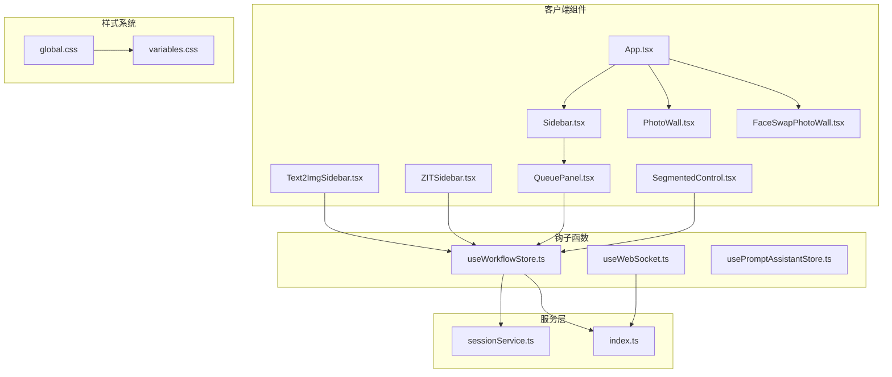
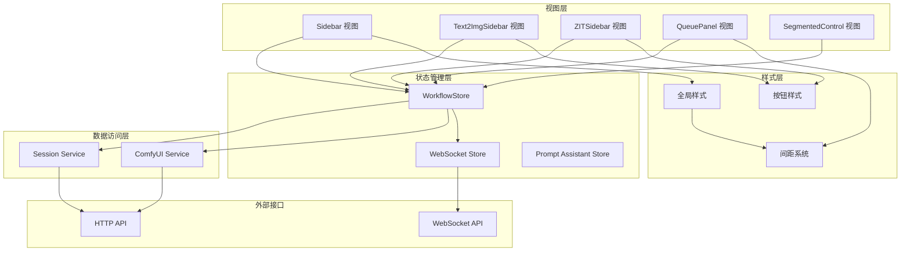
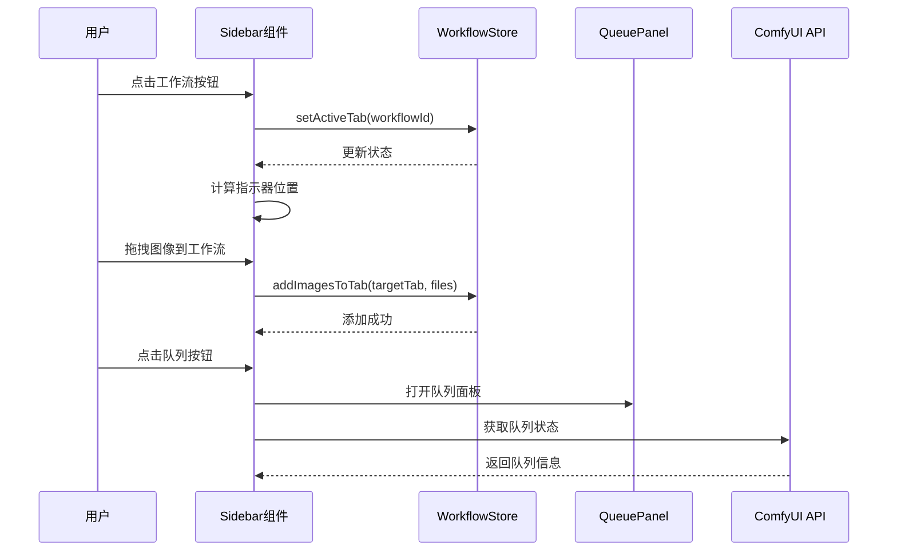
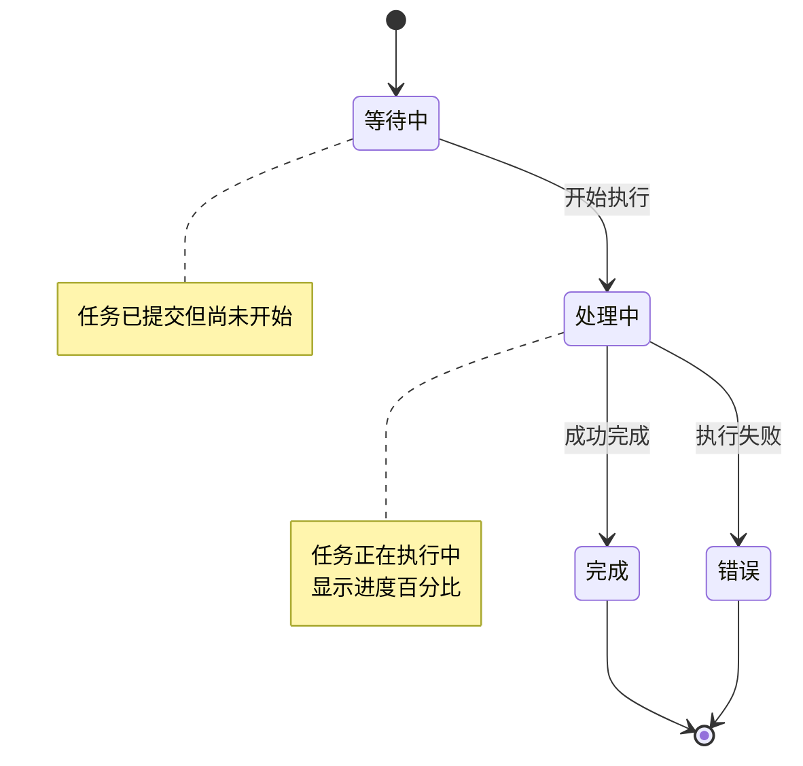
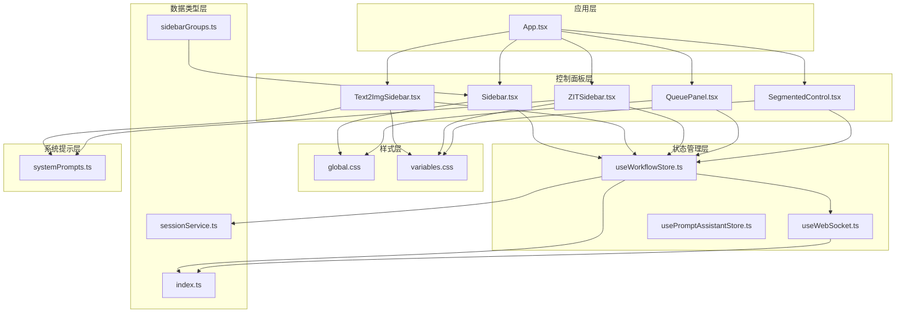

# 控制面板组件

<cite>
**本文档引用的文件**
- [Sidebar.tsx](file://client/src/components/Sidebar.tsx)
- [Text2ImgSidebar.tsx](file://client/src/components/Text2ImgSidebar.tsx)
- [ZITSidebar.tsx](file://client/src/components/ZITSidebar.tsx)
- [QueuePanel.tsx](file://client/src/components/QueuePanel.tsx)
- [useWorkflowStore.ts](file://client/src/hooks/useWorkflowStore.ts)
- [useWebSocket.ts](file://client/src/hooks/useWebSocket.ts)
- [usePromptAssistantStore.ts](file://client/src/hooks/usePromptAssistantStore.ts)
- [systemPrompts.ts](file://client/src/components/prompt-assistant/systemPrompts.ts)
- [index.ts](file://client/src/types/index.ts)
- [sessionService.ts](file://client/src/services/sessionService.ts)
- [App.tsx](file://client/src/components/App.tsx)
- [global.css](file://client/src/styles/global.css)
- [variables.css](file://client/src/styles/variables.css)
- [sidebarGroups.ts](file://client/src/data/sidebarGroups.ts)
- [SegmentedControl.tsx](file://client/src/components/SegmentedControl.tsx)
</cite>

## 更新摘要
**变更内容**
- 更新了侧边栏组件的比例按钮界面重构和间距标准化
- 新增了按钮样式统一和布局一致性的说明
- 增强了 UI 优化相关的技术细节分析

## 目录
1. [简介](#简介)
2. [项目结构](#项目结构)
3. [核心组件](#核心组件)
4. [架构概览](#架构概览)
5. [详细组件分析](#详细组件分析)
6. [UI 优化与间距标准化](#ui-优化与间距标准化)
7. [依赖关系分析](#依赖关系分析)
8. [性能考虑](#性能考虑)
9. [故障排除指南](#故障排除指南)
10. [结论](#结论)

## 简介

Pix2Real 是一个基于 React 和 TypeScript 的图像处理应用，提供了丰富的 AI 图像生成和编辑功能。控制面板组件是该应用的核心界面元素，负责提供工作流选择、参数配置、任务管理和状态同步等功能。

本文档深入分析了控制面板组件的设计和实现，包括侧边栏(Sidebar)、文本到图像侧边栏(Text2ImgSidebar)、ZIT侧边栏(ZITSidebar)、队列面板(QueuePanel)等关键组件。我们将详细解释这些组件如何协同工作，提供直观的用户界面和强大的功能特性。

**更新** 本次更新重点关注 UI 优化，特别是侧边栏组件的比例按钮界面重构和间距标准化，提升了整体视觉一致性。

## 项目结构

Pix2Real 采用模块化的前端架构，控制面板组件位于客户端代码的组件目录中。主要的控制面板相关文件包括：



**图表来源**
- [App.tsx:54-335](file://client/src/components/App.tsx#L54-L335)
- [Sidebar.tsx:30-425](file://client/src/components/Sidebar.tsx#L30-L425)

**章节来源**
- [App.tsx:1-335](file://client/src/components/App.tsx#L1-L335)
- [Sidebar.tsx:1-425](file://client/src/components/Sidebar.tsx#L1-L425)

## 核心组件

控制面板系统由多个相互协作的组件构成，每个组件都有特定的功能和职责：

### 工作流工作流(WORKFLOWS)
应用定义了10种不同的工作流，每种工作流对应不同的图像处理功能：
- 0: 二次元转真人
- 1: 真人精修  
- 2: 精修放大
- 3: 快速生成视频
- 4: 视频放大
- 5: 解除装备
- 6: 真人转二次元
- 7: 快速出图 (文本到图像)
- 8: 黑兽换脸
- 9: ZIT快出 (文本到图像)
- 10: 换面

### 状态管理
所有组件都通过集中式的状态管理进行协调，使用 Zustand 库实现高性能的状态存储和订阅机制。

**章节来源**
- [useWorkflowStore.ts:6-17](file://client/src/hooks/useWorkflowStore.ts#L6-L17)
- [useWorkflowStore.ts:35-88](file://client/src/hooks/useWorkflowStore.ts#L35-L88)

## 架构概览

控制面板系统采用分层架构设计，确保组件间的松耦合和高内聚：



**图表来源**
- [useWorkflowStore.ts:96-645](file://client/src/hooks/useWorkflowStore.ts#L96-L645)
- [useWebSocket.ts:10-99](file://client/src/hooks/useWebSocket.ts#L10-L99)

## 详细组件分析

### 侧边栏(Sidebar)组件

Sidebar 组件是整个控制面板系统的导航中心，提供工作流选择和任务队列管理功能。

#### 主要功能特性

1. **工作流分组显示**: 将10个工作流按照功能分类为五个主要分组
2. **拖放支持**: 支持跨工作流的图像拖放操作
3. **实时队列监控**: 显示当前任务队列中的任务数量
4. **动态指示器**: 为当前激活的工作流提供视觉反馈

#### 核心实现模式



**图表来源**
- [Sidebar.tsx:124-209](file://client/src/components/Sidebar.tsx#L124-L209)
- [useWorkflowStore.ts:46-252](file://client/src/hooks/useWorkflowStore.ts#L46-L252)

#### 关键交互逻辑

1. **拖放事件处理**: 实现了原生拖放监听器以确保跨浏览器兼容性
2. **队列面板管理**: 支持队列面板的展开/收起动画效果
3. **状态同步**: 通过定时器每2秒轮询队列状态

**章节来源**
- [Sidebar.tsx:30-425](file://client/src/components/Sidebar.tsx#L30-L425)

### 文本到图像侧边栏(Text2ImgSidebar)组件

Text2ImgSidebar 专门用于处理文本到图像的生成任务，提供了完整的参数配置界面。

#### 参数配置系统

组件支持多种参数配置选项：

| 参数类别 | 参数名称 | 默认值 | 范围 |
|---------|----------|--------|------|
| 模型设置 | 模型选择 | 空 | 可用模型列表 |
| 图像尺寸 | 宽度/高度 | 832x1216 | 1024x1024 起步 |
| 采样设置 | 步数 | 30 | 4-50 |
| 采样设置 | CFG | 6 | 1-12 (0.5步进) |
| 采样器 | 采样器 | euler_ancestral | 多种选项 |
| 调度器 | 调度器 | normal | 多种选项 |

#### 比例按钮界面重构

**更新** 比例按钮界面经过重构，采用统一的胶囊按钮样式：

- **尺寸规格**: 52x52像素的固定尺寸
- **内边距**: 4px 6px 7px 的统一内边距
- **间距**: 6px 的网格间距
- **边框**: 1.5px 的统一边框宽度
- **圆角**: 2px 的统一圆角半径

#### 快速操作功能

组件集成了智能提示词助手，提供三种快速操作模式：

1. **自然语言 → 标签**: 将中文描述转换为英文标签
2. **标签 → 自然语言**: 将标签转换为中文描述
3. **按需扩写**: 扩展提示词中的特定部分

#### 本地存储集成

所有配置参数都会自动保存到浏览器本地存储中，确保页面刷新后配置不会丢失。

**章节来源**
- [Text2ImgSidebar.tsx:36-536](file://client/src/components/Text2ImgSidebar.tsx#L36-L536)
- [systemPrompts.ts:4-145](file://client/src/components/prompt-assistant/systemPrompts.ts#L4-L145)

### ZIT侧边栏(ZITSidebar)组件

ZITSidebar 是专门为 ZIT 快速文本到图像生成设计的专用组件，具有更复杂的参数配置。

#### ZIT 特有参数

除了标准的文本到图像参数外，ZITSidebar 还支持 ZIT 模型特有的配置：

| 参数类别 | 参数名称 | 默认值 | 范围 |
|---------|----------|--------|------|
| 模型设置 | UNet 模型 | 第一个可用模型 | 可用 UNet 列表 |
| 模型设置 | LoRA 模型 | 第一个可用 LoRA | 可用 LoRA 列表 |
| 模型设置 | 启用 LoRA | false | 布尔值 |
| 模型设置 | 采样算法偏移 | false | 布尔值 |
| 模型设置 | 偏移量 | 3 | 1-5 |
| 采样设置 | 步数 | 9 | 4-50 |
| 采样设置 | CFG | 1 | 1-12 (0.5步进) |

#### 比例按钮界面重构

**更新** ZIT 侧边栏的比例按钮同样采用了重构后的统一样式：

- **尺寸规格**: 52x52像素的固定尺寸
- **内边距**: 4px 6px 7px 的统一内边距
- **间距**: 6px 的网格间距
- **边框**: 1.5px 的统一边框宽度
- **圆角**: 2px 的统一圆角半径

#### AuraFlow 算法支持

ZITSidebar 特别支持 AuraFlow 采样算法的偏移功能，允许用户调整采样的随机性。

**章节来源**
- [ZITSidebar.tsx:36-635](file://client/src/components/ZITSidebar.tsx#L36-L635)

### 队列面板(QueuePanel)组件

QueuePanel 提供了实时的任务队列管理界面，让用户可以监控和管理正在进行的图像生成任务。

#### 队列状态管理



**图表来源**
- [QueuePanel.tsx:26-306](file://client/src/components/QueuePanel.tsx#L26-L306)

#### 队列操作功能

1. **优先级调整**: 允许用户将任务提升到队列顶部
2. **任务取消**: 支持取消正在进行的任务
3. **任务定位**: 双击队列项可以在主界面中定位对应的图像卡片
4. **实时更新**: 每2秒自动刷新队列状态

#### 状态同步机制

队列面板通过 WebSocket 连接接收来自服务器的实时状态更新，确保用户界面与实际执行状态保持同步。

**章节来源**
- [QueuePanel.tsx:26-306](file://client/src/components/QueuePanel.tsx#L26-L306)

## UI 优化与间距标准化

### 比例按钮界面重构

**更新** 本次 UI 优化重点重构了比例按钮界面，实现了以下改进：

#### 统一的胶囊按钮样式
所有比例按钮都采用统一的 `pillBtn` 函数样式：
- **尺寸**: 52x52 像素的固定尺寸
- **内边距**: 4px 6px 7px 的统一内边距
- **边框**: 1.5px 的统一边框宽度
- **圆角**: 2px 的统一圆角半径
- **过渡效果**: 0.12秒的平滑颜色过渡

#### 网格布局优化
- **间距**: 6px 的网格间距，确保按钮间的视觉平衡
- **响应式**: 支持 `flex-wrap: wrap` 实现自动换行
- **居中对齐**: 使用 `align-items: center` 和 `justify-content: center` 确保比例框居中显示

#### 活动状态指示
- **边框颜色**: 活动状态使用 `var(--color-primary)` 主色边框
- **文本颜色**: 活动状态使用主色文本
- **动画效果**: 平滑的颜色过渡动画

### 间距标准化系统

**更新** 应用引入了统一的间距标准化系统：

#### CSS 变量定义
```css
:root {
  --spacing-xs: 4px;
  --spacing-sm: 8px;
  --spacing-md: 16px;
  --spacing-lg: 24px;
  --spacing-xl: 32px;
}
```

#### 组件使用规范
- **大间距**: `var(--spacing-lg)` 用于主要区域间的分隔
- **中间距**: `var(--spacing-md)` 用于组件内部的分隔
- **小间距**: `var(--spacing-sm)` 用于细小元素间的分隔
- **超小间距**: `var(--spacing-xs)` 用于极小元素间的分隔

#### 统一的布局模式
所有组件都遵循统一的布局模式：
- **Flexbox**: 使用 `display: 'flex'` 和 `gap` 属性
- **内边距**: 使用 `padding` 属性实现统一的内边距
- **外边距**: 使用 `margin` 属性实现统一的外边距
- **间距**: 使用 `gap` 属性实现统一的间距

### 按钮样式统一

**更新** 所有按钮都采用统一的样式系统：

#### 胶囊按钮样式
```javascript
const pillBtn = (active: boolean): React.CSSProperties => ({
  padding: '4px 8px',
  fontSize: '12px',
  border: 'none',
  borderRadius: 6,
  backgroundColor: active ? 'rgba(33,150,243,0.12)' : 'var(--color-surface-hover)',
  color: active ? 'var(--color-primary)' : 'var(--color-text-secondary)',
  fontWeight: active ? 500 : 400,
  cursor: 'pointer',
  flexShrink: 0,
  transition: 'background-color 0.12s, border-color 0.12s, color 0.12s',
});
```

#### 分段控制器样式
```javascript
const segmentedControl = {
  display: 'inline-flex',
  backgroundColor: 'var(--color-bg)',
  border: '1px solid var(--color-border)',
  borderRadius: 8,
  padding: 3,
  gap: 2,
};
```

### 布局一致性增强

**更新** 通过统一的布局系统增强了组件间的一致性：

#### Flexbox 统一
- **主轴对齐**: 使用 `alignItems: 'center'` 确保垂直居中
- **交叉轴对齐**: 使用 `justifyContent: 'space-between'` 实现两端对齐
- **弹性增长**: 使用 `flex: 1` 实现自适应增长
- **间距控制**: 使用 `gap` 属性实现统一的间距

#### 边框和阴影
- **边框**: 使用 `1px solid var(--color-border)` 的统一边框
- **圆角**: 使用 `6px` 或 `8px` 的统一圆角半径
- **阴影**: 使用 `boxShadow` 属性实现统一的阴影效果

**章节来源**
- [Text2ImgSidebar.tsx:679-715](file://client/src/components/Text2ImgSidebar.tsx#L679-L715)
- [ZITSidebar.tsx:679-715](file://client/src/components/ZITSidebar.tsx#L679-L715)
- [SegmentedControl.tsx:12-47](file://client/src/components/SegmentedControl.tsx#L12-L47)
- [variables.css:14-18](file://client/src/styles/variables.css#L14-L18)

## 依赖关系分析

控制面板组件之间的依赖关系体现了清晰的分层架构：



**图表来源**
- [App.tsx:54-335](file://client/src/components/App.tsx#L54-L335)
- [useWorkflowStore.ts:96-645](file://client/src/hooks/useWorkflowStore.ts#L96-L645)

### 组件间通信模式

1. **单向数据流**: 父组件通过 props 向子组件传递数据
2. **回调函数**: 子组件通过回调函数向父组件发送事件
3. **状态共享**: 使用 Zustand store 在组件间共享状态
4. **事件总线**: 通过 WebSocket 实现实时事件通信

**章节来源**
- [useWorkflowStore.ts:96-645](file://client/src/hooks/useWorkflowStore.ts#L96-L645)
- [useWebSocket.ts:75-99](file://client/src/hooks/useWebSocket.ts#L75-L99)

## 性能考虑

控制面板组件在设计时充分考虑了性能优化：

### 状态管理优化
- 使用 Zustand 替代 Redux，减少不必要的状态更新
- 实现局部状态更新，避免全局重新渲染
- 使用 memoization 优化昂贵的计算结果

### 渲染性能
- 实现虚拟滚动以处理大量图像卡片
- 使用 CSS 动画替代 JavaScript 动画
- 实现防抖和节流机制处理高频事件

### 网络请求优化
- 队列状态每2秒轮询一次，平衡实时性和性能
- 使用缓存策略避免重复的 API 调用
- 实现连接池管理 WebSocket 连接

### 内存管理
- 及时清理图像预览 URL 的对象 URL
- 实现垃圾回收机制释放不再使用的资源
- 使用弱引用避免循环引用导致的内存泄漏

## 故障排除指南

### 常见问题及解决方案

#### 队列状态不同步
**症状**: 队列面板显示的任务状态与实际不符
**解决方案**: 
1. 检查 WebSocket 连接是否正常
2. 刷新页面重新建立连接
3. 查看浏览器开发者工具中的网络面板

#### 图像拖放失效
**症状**: 无法通过拖放方式在工作流间移动图像
**解决方案**:
1. 确认目标工作流不是文本到图像专用工作流
2. 检查浏览器对拖放 API 的支持
3. 尝试使用文件导入功能替代拖放

#### 参数配置丢失
**症状**: 页面刷新后文本到图像参数恢复默认值
**解决方案**:
1. 检查浏览器的本地存储权限
2. 确认没有清除浏览器数据
3. 检查浏览器扩展是否阻止了本地存储

#### WebSocket 连接失败
**症状**: 实时进度更新不可用
**解决方案**:
1. 检查服务器端 WebSocket 服务状态
2. 确认防火墙没有阻止 WebSocket 连接
3. 尝试刷新页面重新连接

#### 比例按钮显示异常
**症状**: 比例按钮布局不正确或样式不一致
**解决方案**:
1. 检查 CSS 变量是否正确加载
2. 确认 `pillBtn` 函数的样式应用
3. 验证 `gap` 属性的间距设置

**章节来源**
- [useWebSocket.ts:53-65](file://client/src/hooks/useWebSocket.ts#L53-L65)
- [Sidebar.tsx:52-65](file://client/src/components/Sidebar.tsx#L52-L65)

## 结论

Pix2Real 的控制面板组件展现了现代前端应用的最佳实践，通过精心设计的架构实现了功能完整性与用户体验的平衡。

### 设计优势

1. **模块化设计**: 每个组件都有明确的职责边界，便于维护和扩展
2. **响应式状态管理**: 使用 Zustand 实现高效的状态同步
3. **实时通信**: 通过 WebSocket 提供流畅的用户体验
4. **性能优化**: 采用多种优化技术确保应用的响应速度
5. **UI 一致性**: 通过间距标准化和样式统一提升了视觉一致性

### 技术亮点

- **拖放 API 的原生实现**: 解决了 React 合成事件的兼容性问题
- **智能队列管理**: 提供直观的任务进度监控和管理界面
- **参数持久化**: 确保用户配置的一致性和便利性
- **多工作流支持**: 灵活的工作流系统适应不同的图像处理需求
- **统一的 UI 系统**: 通过 CSS 变量和样式函数实现了视觉一致性

### 未来改进方向

1. **移动端适配**: 增强移动设备上的用户体验
2. **离线支持**: 实现更完善的离线功能
3. **性能监控**: 添加更详细的性能指标收集
4. **国际化支持**: 扩展多语言界面支持
5. **主题系统**: 增强主题切换和自定义能力

控制面板组件为 Pix2Real 应用提供了强大而直观的用户界面，是整个系统成功的关键组成部分。本次 UI 优化进一步提升了组件的视觉一致性和用户体验，为未来的功能扩展奠定了坚实的基础。