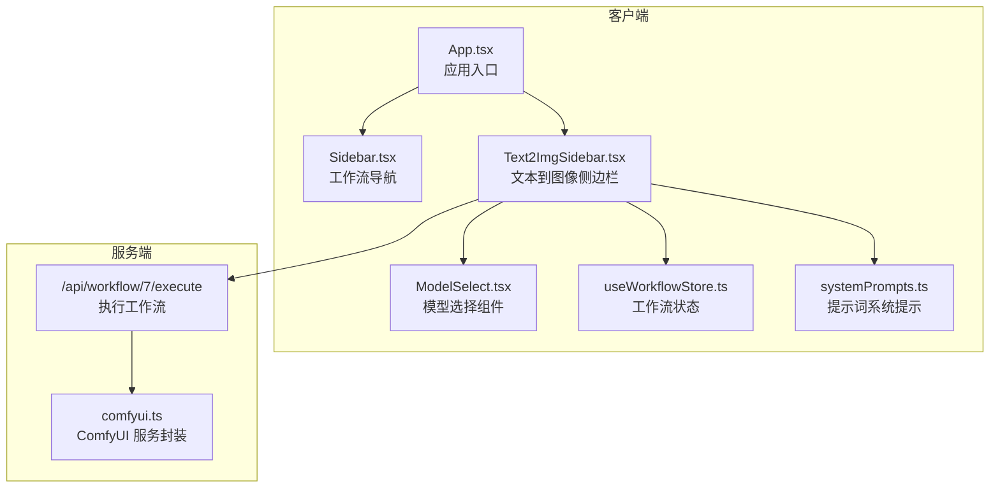
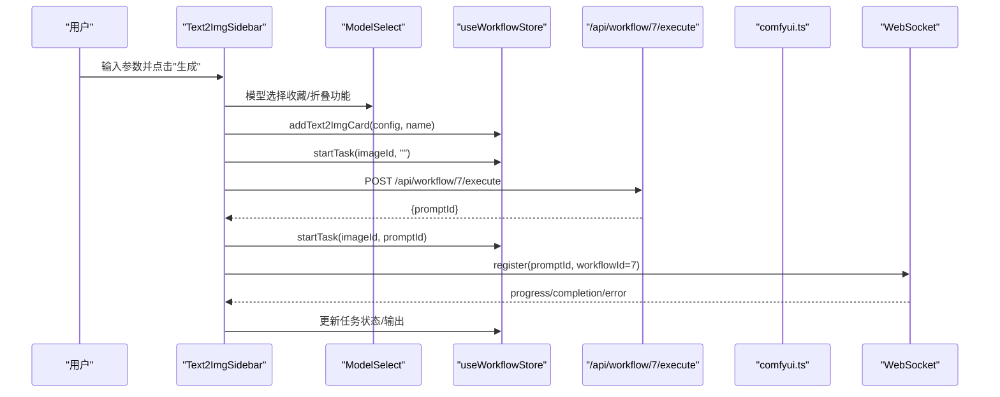
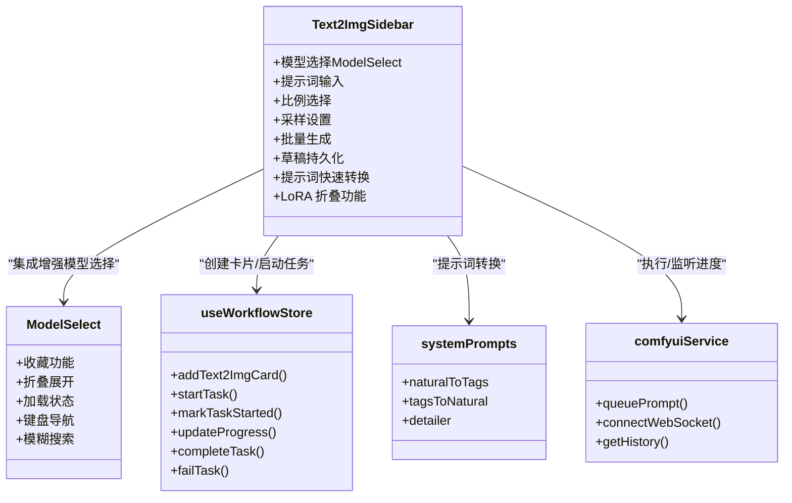
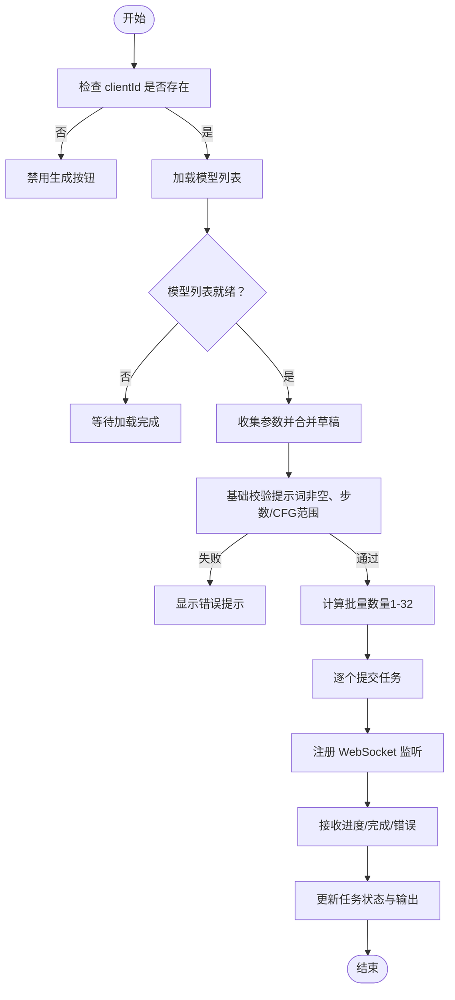

# 文本到图像侧边栏

<cite>
**本文档引用的文件**
- [Text2ImgSidebar.tsx](file://client/src/components/Text2ImgSidebar.tsx)
- [ModelSelect.tsx](file://client/src/components/ModelSelect.tsx)
- [useWorkflowStore.ts](file://client/src/hooks/useWorkflowStore.ts)
- [sessionService.ts](file://client/src/services/sessionService.ts)
- [types/index.ts](file://client/src/types/index.ts)
- [Sidebar.tsx](file://client/src/components/Sidebar.tsx)
- [App.tsx](file://client/src/components/App.tsx)
- [comfyui.ts](file://server/src/services/comfyui.ts)
- [systemPrompts.ts](file://client/src/components/prompt-assistant/systemPrompts.ts)
</cite>

## 更新摘要
**变更内容**
- 新增 ModelSelect 组件集成，替代原有的简单 HTML select 元素
- 增强 LoRA 模型支持，包括收藏功能和折叠展开
- 改进模型选择界面的用户体验和交互设计
- 新增模型收藏持久化机制

## 目录
1. [简介](#简介)
2. [项目结构](#项目结构)
3. [核心组件](#核心组件)
4. [架构总览](#架构总览)
5. [详细组件分析](#详细组件分析)
6. [依赖关系分析](#依赖关系分析)
7. [性能考量](#性能考量)
8. [故障排除指南](#故障排除指南)
9. [结论](#结论)
10. [附录](#附录)

## 简介
本文件系统性地解析 CorineKit Pix2Real 中的 Text2ImgSidebar 文本到图像侧边栏组件，覆盖其设计与实现细节，包括：
- 文本生成参数配置（分辨率、采样器、步数、CFG、调度器）
- 提示词管理与快速转换（自然语言↔标签互转、按需扩写）
- 图像尺寸预设与自定义命名
- **新增**：ModelSelect 组件集成，增强模型选择体验
- **新增**：LoRA 模型支持与收藏功能
- 表单验证与参数默认值策略
- 与 ComfyUI 工作流的集成方式
- 使用示例与参数调优建议
- 与其他工作流侧边栏的区别与特殊处理逻辑

## 项目结构
Text2ImgSidebar 位于客户端前端，作为独立侧边栏组件挂载于主界面，与工作流状态管理、提示词助手、WebSocket 进度推送等模块协同工作。现已集成 ModelSelect 组件提供增强的模型选择功能。

**图表来源**
- [App.tsx:246](file://client/src/components/App.tsx#L246)
- [Text2ImgSidebar.tsx:36-132](file://client/src/components/Text2ImgSidebar.tsx#L36-L132)
- [ModelSelect.tsx:19-27](file://client/src/components/ModelSelect.tsx#L19-L27)
- [useWorkflowStore.ts:546-569](file://client/src/hooks/useWorkflowStore.ts#L546-L569)
- [comfyui.ts:47-60](file://server/src/services/comfyui.ts#L47-L60)

**章节来源**
- [App.tsx:246](file://client/src/components/App.tsx#L246)
- [Sidebar.tsx:30](file://client/src/components/Sidebar.tsx#L30)

## 核心组件
- **Text2ImgSidebar**：负责收集用户输入的文本提示、尺寸、采样参数，构建请求并触发工作流执行，同时管理本地草稿与批量生成。现已集成 ModelSelect 组件提供增强的模型选择体验。
- **ModelSelect**：全新的模型选择组件，提供收藏功能、折叠展开、加载状态显示等增强功能。
- **useWorkflowStore**：集中管理各工作流标签页的数据、任务状态、提示词与配置持久化。
- **systemPrompts**：提供提示词转换的系统提示模板，支持自然语言与标签之间的双向转换及按需扩写。
- **comfyui.ts**：封装与 ComfyUI 的交互，包括上传、排队、历史查询、进度回调等。

**章节来源**
- [Text2ImgSidebar.tsx:36-132](file://client/src/components/Text2ImgSidebar.tsx#L36-L132)
- [ModelSelect.tsx:19-27](file://client/src/components/ModelSelect.tsx#L19-L27)
- [useWorkflowStore.ts:546-569](file://client/src/hooks/useWorkflowStore.ts#L546-L569)
- [systemPrompts.ts:4](file://client/src/components/prompt-assistant/systemPrompts.ts#L4)
- [comfyui.ts:47-60](file://server/src/services/comfyui.ts#L47-L60)

## 架构总览
Text2ImgSidebar 的执行流程如下：
- 用户在侧边栏填写参数（模型、提示词、比例、采样设置、名称、批量数量）
- 组件将参数与草稿合并，构建 Text2ImgConfig
- 调用 addText2ImgCard 在工作流状态中创建占位卡片
- 触发 startTask 显示任务状态
- 向 /api/workflow/7/execute 发起执行请求，获得 promptId
- 通过 WebSocket 注册监听该 promptId 的进度与完成事件

**图表来源**
- [Text2ImgSidebar.tsx:86-132](file://client/src/components/Text2ImgSidebar.tsx#L86-L132)
- [ModelSelect.tsx:15-27](file://client/src/components/ModelSelect.tsx#L15-L27)
- [useWorkflowStore.ts:546-569](file://client/src/hooks/useWorkflowStore.ts#L546-L569)
- [comfyui.ts:127-188](file://server/src/services/comfyui.ts#L127-L188)

## 详细组件分析

### 参数配置与默认值
- **比例预设**：包含 1:1、3:4、9:16、4:3、16:9 五种常用比例，用于快速设定宽高。
- **采样器与调度器**：提供多种采样器与调度器选项，便于不同风格与质量目标的平衡。
- **步数与 CFG**：步数范围通常为 4–50，CFG 范围为 1–12，步数影响生成细节与稳定性，CFG 控制提示词权重。
- **批量生成**：支持 1–32 的批量数量，逐个提交任务以保持 UI 响应。

**章节来源**
- [Text2ImgSidebar.tsx:8-29](file://client/src/components/Text2ImgSidebar.tsx#L8-L29)
- [Text2ImgSidebar.tsx:434-457](file://client/src/components/Text2ImgSidebar.tsx#L434-L457)

### 提示词管理与快速转换
- 提示词输入区支持悬停展开的快捷按钮组，包含"按需扩写"、"标签→自然语言"、"自然语言→标签"三种模式。
- 快速转换通过调用 /api/workflow/prompt-assistant 接口，传入系统提示与用户提示，返回转换后的文本并更新输入框。
- 提示词面板可通过"提示词助理"入口打开，支持更丰富的模式（转换、变体、扩写、分镜等）。

**章节来源**
- [Text2ImgSidebar.tsx:134-155](file://client/src/components/Text2ImgSidebar.tsx#L134-L155)
- [systemPrompts.ts:4](file://client/src/components/prompt-assistant/systemPrompts.ts#L4)

### 本地草稿与参数持久化
- 组件在初始化时从 localStorage 读取草稿（DRAFT_KEY），避免切换标签页时丢失参数。
- 任何参数变更都会实时写回 localStorage，确保离线场景下的参数恢复。

**章节来源**
- [Text2ImgSidebar.tsx:31-75](file://client/src/components/Text2ImgSidebar.tsx#L31-L75)

### ModelSelect 组件集成与增强功能

#### 模型选择组件架构
ModelSelect 是一个全新的专用组件，替代了原有的简单 HTML select 元素，提供以下增强功能：

- **收藏功能**：支持将常用模型加入收藏夹，收藏的模型会优先显示在列表顶部
- **折叠展开**：支持 LoRA 模型的折叠展开功能，减少界面拥挤
- **加载状态**：提供加载指示器，改善用户体验
- **搜索过滤**：支持模型名称的模糊匹配和过滤
- **键盘导航**：支持键盘快捷键进行模型选择

#### 收藏持久化机制
组件内置完整的收藏持久化机制：

- **收藏分类**：支持 checkpoints、unets、loras 三类模型的收藏管理
- **本地存储**：使用 localStorage 持久化收藏状态
- **同步更新**：收藏状态变更会实时同步到本地存储

#### LoRA 模型支持
Text2ImgSidebar 现已完全支持 LoRA 模型：

- **独立 LoRA 区域**：提供专门的 LoRA 模型选择区域
- **启用开关**：通过复选框控制 LoRA 模型的启用状态
- **收藏功能**：LoRA 模型同样支持收藏功能
- **折叠展开**：LoRA 区域支持折叠展开，节省空间

**章节来源**
- [Text2ImgSidebar.tsx:244-298](file://client/src/components/Text2ImgSidebar.tsx#L244-L298)
- [ModelSelect.tsx:19-27](file://client/src/components/ModelSelect.tsx#L19-L27)
- [ModelSelect.tsx:218-260](file://client/src/components/ModelSelect.tsx#L218-L260)

### 与 ComfyUI 工作流的集成
- **模型列表**：首次渲染时拉取 /api/workflow/models/checkpoints 获取可用模型列表。
- **LoRA 列表**：同时拉取 /api/workflow/models/loras 获取 LoRA 模型列表。
- **执行接口**：POST /api/workflow/7/execute，携带 clientId、模型、提示词、尺寸、采样参数等。
- **WebSocket**：注册 promptId，接收进度与完成事件，更新任务状态与输出列表。
- **任务映射**：通过 imageId 与 promptId 的映射，将后台进度与前端 UI 卡片关联。

**章节来源**
- [Text2ImgSidebar.tsx:47-54](file://client/src/components/Text2ImgSidebar.tsx#L47-L54)
- [Text2ImgSidebar.tsx:113-128](file://client/src/components/Text2ImgSidebar.tsx#L113-L128)
- [useWorkflowStore.ts:377-396](file://client/src/hooks/useWorkflowStore.ts#L377-L396)
- [comfyui.ts:127-188](file://server/src/services/comfyui.ts#L127-L188)

### 表单验证与禁用逻辑
- 生成按钮在以下情况下禁用：未连接 ComfyUI 客户端、正在生成中、模型列表为空。
- 提示词输入在快速转换进行时会被置为只读，防止并发修改。
- 批量数量限制在 1–32，超出范围会自动归一化。

**章节来源**
- [Text2ImgSidebar.tsx:484-487](file://client/src/components/Text2ImgSidebar.tsx#L484-L487)
- [Text2ImgSidebar.tsx:254](file://client/src/components/Text2ImgSidebar.tsx#L254)
- [Text2ImgSidebar.tsx:514-516](file://client/src/components/Text2ImgSidebar.tsx#L514-L516)

### 数据模型与类型
- **Text2ImgConfig**：定义文本到图像所需的全部参数，包括模型、提示词、宽高、步数、CFG、采样器、调度器。
- **TaskInfo/TaskStatus**：描述任务状态（待上传/排队/处理中/完成/错误）与进度。
- **会话序列化**：支持将文本到图像配置与任务状态持久化到会话中。

**章节来源**
- [sessionService.ts:4-13](file://client/src/services/sessionService.ts#L4-L13)
- [types/index.ts:17-25](file://client/src/types/index.ts#L17-L25)

### 与其他工作流侧边栏的区别
- Tab 7（快速出图）与 Tab 9（ZIT快出）均为文本到图像类工作流，但 Tab 7 仅接受文本输入，不接受外部图片拖拽；Tab 9 有独立的 ZITSidebar。
- Sidebar 对 Tab 7/9 的拖放行为进行了限制，确保数据一致性与工作流语义正确。
- **新增**：ZITSidebar 也集成了相同的 ModelSelect 组件，提供一致的模型选择体验。

**章节来源**
- [Sidebar.tsx:128-131](file://client/src/components/Sidebar.tsx#L128-L131)
- [App.tsx:85-111](file://client/src/components/App.tsx#L85-L111)

## 依赖关系分析

**图表来源**
- [Text2ImgSidebar.tsx:36-132](file://client/src/components/Text2ImgSidebar.tsx#L36-L132)
- [ModelSelect.tsx:19-27](file://client/src/components/ModelSelect.tsx#L19-L27)
- [useWorkflowStore.ts:546-569](file://client/src/hooks/useWorkflowStore.ts#L546-L569)
- [systemPrompts.ts:4](file://client/src/components/prompt-assistant/systemPrompts.ts#L4)
- [comfyui.ts:47-60](file://server/src/services/comfyui.ts#L47-L60)

## 性能考量
- 批量生成采用串行提交，避免瞬时高负载；可在网络与资源允许时考虑并发优化。
- 本地草稿存储使用 JSON 序列化，参数较少时开销可控；建议避免在高频变更场景下过度频繁写入。
- WebSocket 进度回调按 promptId 分发，避免跨标签页干扰；注意在组件卸载时清理订阅以防内存泄漏。
- **新增**：ModelSelect 组件使用虚拟滚动和懒加载优化大型模型列表的渲染性能。

## 故障排除指南
- 无法生成：检查 ComfyUI 客户端是否连接（clientId 是否存在）、模型列表是否加载成功。
- 生成卡住：确认 /api/workflow/7/execute 返回的 promptId 是否正确注册到 WebSocket；查看控制台是否有错误日志。
- 提示词转换失败：确认 /api/workflow/prompt-assistant 接口可用，系统提示模板是否完整。
- 任务状态异常：核对 useWorkflowStore 中 imagePromptMap 与 tasks 的映射关系，确保 promptId 与 imageId 对应一致。
- **新增**：ModelSelect 加载失败：检查 /api/workflow/models/checkpoints 和 /api/workflow/models/loras 接口是否正常响应。

**章节来源**
- [Text2ImgSidebar.tsx:86-132](file://client/src/components/Text2ImgSidebar.tsx#L86-L132)
- [useWorkflowStore.ts:377-396](file://client/src/hooks/useWorkflowStore.ts#L377-L396)
- [comfyui.ts:127-188](file://server/src/services/comfyui.ts#L127-L188)

## 结论
Text2ImgSidebar 将参数配置、提示词管理与 ComfyUI 工作流无缝衔接，提供了直观的文本到图像生成体验。通过本地草稿、批量生成与提示词快速转换等特性，显著提升了创作效率。**新增的 ModelSelect 组件**进一步增强了用户体验，特别是 LoRA 模型的支持和收藏功能，使得模型管理更加便捷高效。与其他工作流侧边栏相比，Tab 7 的纯文本输入设计使其专注于高质量文本生成，避免了外部图片干扰，适合需要精确提示词控制的场景。

## 附录

### 使用示例与参数调优建议
- **提示词编写技巧**
  - 使用"自然语言→标签"将中文描述转为英文关键词，再用"按需扩写"细化细节。
  - 先给出主体（角色/物体），再补充环境与光影，最后添加材质与质感关键词。
- **参数调优建议**
  - 步数：细节丰富场景建议 20–40；追求稳定与速度可降至 12–20。
  - CFG：强调提示词权重时提升至 6–10；追求多样性可降至 4–6。
  - 采样器：euler/euler_a 适合多数场景；dpm_2m/dpm_multistep 在高步数下更稳定。
  - 调度器：simple/ddim_uniform 适合稳定生成；beta/exponential 适合探索性尝试。
- **批量生成**
  - 1–32 的批量范围可满足多版本对比与风格探索；建议每次批量不超过 8，以便观察与筛选。
- **新增**：ModelSelect 使用技巧
  - 使用收藏功能快速访问常用模型，点击星标图标添加或移除收藏。
  - 通过折叠展开功能管理 LoRA 模型列表，减少界面拥挤。
  - 在模型列表中使用键盘快捷键进行快速导航和选择。

### 关键流程图：参数校验与生成

**图表来源**
- [Text2ImgSidebar.tsx:86-132](file://client/src/components/Text2ImgSidebar.tsx#L86-L132)
- [Text2ImgSidebar.tsx:484-487](file://client/src/components/Text2ImgSidebar.tsx#L484-L487)
- [Text2ImgSidebar.tsx:514-516](file://client/src/components/Text2ImgSidebar.tsx#L514-L516)

### ModelSelect 组件使用指南
- **基本使用**：点击下拉箭头展开模型列表，鼠标悬停选择目标模型。
- **收藏管理**：点击星标图标添加或移除收藏，收藏的模型会显示在列表顶部。
- **加载状态**：当模型列表正在加载时，显示加载指示器。
- **折叠功能**：LoRA 模型区域支持折叠展开，节省界面空间。
- **键盘导航**：支持上下箭头键导航，Enter 键确认选择。

**章节来源**
- [ModelSelect.tsx:19-27](file://client/src/components/ModelSelect.tsx#L19-L27)
- [ModelSelect.tsx:218-260](file://client/src/components/ModelSelect.tsx#L218-L260)