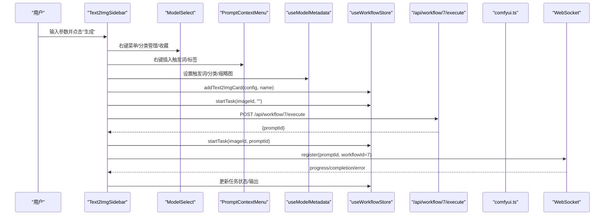
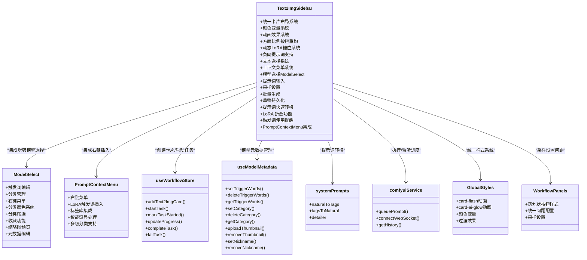
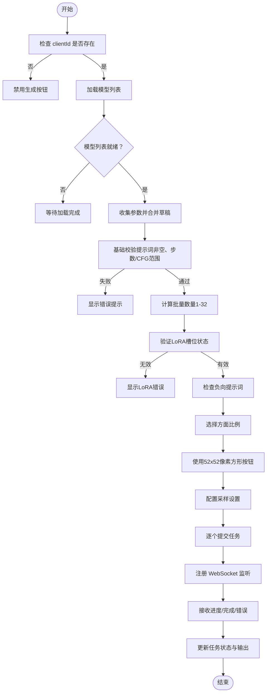

# 文本到图像侧边栏

<cite>
**本文档引用的文件**
- [Text2ImgSidebar.tsx](file://client/src/components/Text2ImgSidebar.tsx)
- [ModelSelect.tsx](file://client/src/components/ModelSelect.tsx)
- [PromptContextMenu.tsx](file://client/src/components/PromptContextMenu.tsx)
- [useWorkflowStore.ts](file://client/src/hooks/useWorkflowStore.ts)
- [sessionService.ts](file://client/src/services/sessionService.ts)
- [types/index.ts](file://client/src/types/index.ts)
- [Sidebar.tsx](file://client/src/components/Sidebar.tsx)
- [App.tsx](file://client/src/components/App.tsx)
- [comfyui.ts](file://server/src/services/comfyui.ts)
- [systemPrompts.ts](file://client/src/components/prompt-assistant/systemPrompts.ts)
- [useModelMetadata.ts](file://client/src/hooks/useModelMetadata.ts)
- [ZITSidebar.tsx](file://client/src/components/ZITSidebar.tsx)
- [global.css](file://client/src/styles/global.css)
- [variables.css](file://client/src/styles/variables.css)
- [tagData.json](file://client/src/data/tagData.json)
- [Workflow0SettingsPanel.tsx](file://client/src/components/Workflow0SettingsPanel.tsx)
- [Workflow2SettingsPanel.tsx](file://client/src/components/Workflow2SettingsPanel.tsx)
</cite>

## 更新摘要
**变更内容**
- **方面比例按钮系统重大UI重构**：从简单的药丸状按钮升级为52x52像素的方形按钮，包含视觉比例指示器和动画效果
- 新增动态LoRA槽位系统，支持0-5个LoRA模型槽位的动态添加、删除和权重调节
- 新增负向提示词支持，提供独立的负面提示词输入区域和快速转换功能
- 引入LoRA风格切换开关，支持启用/禁用单个LoRA槽位
- 增强文本选择和上下文菜单系统，支持剪切、复制、粘贴和智能逗号处理
- 更新前端组件实现细节，包括LoRA槽位管理和负向提示词处理
- 增强提示词右键插入机制，支持从LoRA触发词和标签库中智能插入内容
- **标准化采样算法设置的间距配置**，统一各工作流侧边栏的间距一致性

## 目录
1. [简介](#简介)
2. [项目结构](#项目结构)
3. [核心组件](#核心组件)
4. [架构总览](#架构总览)
5. [详细组件分析](#详细组件分析)
6. [依赖关系分析](#依赖关系分析)
7. [性能考量](#性能考量)
8. [故障排除指南](#故障排除指南)
9. [结论](#结论)
10. [附录](#附录)

## 简介
本文件系统性地解析 CorineKit Pix2Real 中的 Text2ImgSidebar 文本到图像侧边栏组件，覆盖其设计与实现细节，包括：
- **方面比例按钮系统重大UI重构**：采用52x52像素的方形按钮设计，包含视觉比例指示器和动画效果，提供更直观的比例选择体验
- **动态LoRA槽位系统**（0-5槽位），支持动态添加、删除和权重调节，每个槽位都有独立的启用/禁用开关
- **负向提示词支持**，提供独立的负面提示词输入区域和快速转换功能
- 文本生成参数配置（分辨率、采样器、步数、CFG、调度器）
- 提示词管理与快速转换（自然语言↔标签互转、按需扩写）
- 图像尺寸预设与自定义命名
- **统一的卡片布局系统**，提供一致的视觉体验
- **改进的用户界面**，包括统一的颜色变量和主题系统
- **卡片闪动和AI发光动画效果**，增强交互反馈
- **统一的间距和排版系统**，提升整体视觉一致性
- **增强的文本选择和上下文菜单系统**，支持剪切、复制、粘贴和智能逗号处理
- **基于 PromptContextMenu 的右键插入机制**，提供更便捷的触发词管理
- **增强的 LoRA 使用状态可视化提醒**，帮助用户更好地管理模型使用情况
- 表单验证与参数默认值策略
- 与 ComfyUI 工作流的集成方式
- 使用示例与参数调优建议
- 与其他工作流侧边栏的区别与特殊处理逻辑

## 项目结构
Text2ImgSidebar 位于客户端前端，作为独立侧边栏组件挂载于主界面，与工作流状态管理、提示词助手、WebSocket 进度推送等模块协同工作。现已采用统一的卡片布局系统，提供一致的视觉体验，并集成了新的 PromptContextMenu 组件提供右键插入功能。

```mermaid
graph TB
subgraph "客户端"
APP["App.tsx<br/>应用入口"]
SIDEBAR["Sidebar.tsx<br/>工作流导航"]
T2I["Text2ImgSidebar.tsx<br/>文本到图像侧边栏"]
MODELSELECT["ModelSelect.tsx<br/>增强模型选择组件"]
PROMPTCONTEXT["PromptContextMenu.tsx<br/>提示词右键菜单"]
STORE["useWorkflowStore.ts<br/>工作流状态"]
PROMPT["systemPrompts.ts<br/>提示词系统提示"]
METADATA["useModelMetadata.ts<br/>模型元数据管理"]
TAGDATA["tagData.json<br/>标签数据"]
GLOBALS["global.css<br/>全局样式与动画"]
VARS["variables.css<br/>颜色变量系统"]
WORKFLOW0["Workflow0SettingsPanel.tsx<br/>工作流0设置面板"]
WORKFLOW2["Workflow2SettingsPanel.tsx<br/>工作流2设置面板"]
END
subgraph "服务端"
API["/api/workflow/7/execute<br/>执行工作流"]
CATEGORIES["/api/models/metadata/*<br/>模型元数据API"]
CUISVC["comfyui.ts<br/>ComfyUI 服务封装"]
END
APP --> SIDEBAR
APP --> T2I
T2I --> MODELSELECT
T2I --> PROMPTCONTEXT
T2I --> STORE
T2I --> PROMPT
T2I --> METADATA
T2I --> TAGDATA
T2I --> GLOBALS
T2I --> VARS
T2I --> API
WORKFLOW0 --> STORE
WORKFLOW2 --> STORE
API --> CUISVC
METADATA --> CATEGORIES
```

**图表来源**
- [App.tsx:246](file://client/src/components/App.tsx#L246)
- [Text2ImgSidebar.tsx:36-132](file://client/src/components/Text2ImgSidebar.tsx#L36-L132)
- [ModelSelect.tsx:19-27](file://client/src/components/ModelSelect.tsx#L19-L27)
- [PromptContextMenu.tsx:1-30](file://client/src/components/PromptContextMenu.tsx#L1-L30)
- [useWorkflowStore.ts:546-569](file://client/src/hooks/useWorkflowStore.ts#L546-L569)
- [comfyui.ts:47-60](file://server/src/services/comfyui.ts#L47-L60)
- [useModelMetadata.ts:10-215](file://client/src/hooks/useModelMetadata.ts#L10-L215)
- [global.css:101-123](file://client/src/styles/global.css#L101-L123)
- [variables.css:1-31](file://client/src/styles/variables.css#L1-L31)

**章节来源**
- [App.tsx:246](file://client/src/components/App.tsx#L246)
- [Sidebar.tsx:30](file://client/src/components/Sidebar.tsx#L30)

## 核心组件
- **Text2ImgSidebar**：负责收集用户输入的文本提示、负向提示词、尺寸、采样参数，构建请求并触发工作流执行，同时管理本地草稿与批量生成。现已采用统一的卡片布局系统，提供一致的视觉体验，并集成了新的 PromptContextMenu 提供右键插入功能。
- **ModelSelect**：全新的增强模型选择组件，提供触发词显示、分类管理、右键菜单、收藏功能、缩略图预览等高级功能。**已移除直接触发词显示功能**，改为通过右键菜单访问。
- **PromptContextMenu**：新增的右键菜单组件，提供从 LoRA 触发词和标签库中智能插入内容的能力，支持嵌套子菜单和多级分类。
- **useWorkflowStore**：集中管理各工作流标签页的数据、任务状态、提示词与配置持久化。
- **useModelMetadata**：提供模型元数据管理功能，包括触发词、分类、缩略图等元数据的增删改查。
- **systemPrompts**：提供提示词转换的系统提示模板，支持自然语言与标签之间的双向转换及按需扩写。
- **comfyui.ts**：封装与 ComfyUI 的交互，包括上传、排队、历史查询、进度回调等。
- **全局样式系统**：提供统一的卡片布局、颜色变量和动画效果。
- **工作流设置面板**：包括 Workflow0SettingsPanel 和 Workflow2SettingsPanel，提供统一的药丸状按钮样式和间距配置。

**章节来源**
- [Text2ImgSidebar.tsx:36-132](file://client/src/components/Text2ImgSidebar.tsx#L36-L132)
- [ModelSelect.tsx:19-27](file://client/src/components/ModelSelect.tsx#L19-L27)
- [PromptContextMenu.tsx:1-30](file://client/src/components/PromptContextMenu.tsx#L1-L30)
- [useWorkflowStore.ts:546-569](file://client/src/hooks/useWorkflowStore.ts#L546-L569)
- [useModelMetadata.ts:10-215](file://client/src/hooks/useModelMetadata.ts#L10-L215)
- [systemPrompts.ts:4](file://client/src/components/prompt-assistant/systemPrompts.ts#L4)
- [comfyui.ts:47-60](file://server/src/services/comfyui.ts#L47-L60)
- [global.css:101-123](file://client/src/styles/global.css#L101-L123)
- [variables.css:1-31](file://client/src/styles/variables.css#L1-L31)
- [Workflow0SettingsPanel.tsx:24-34](file://client/src/components/Workflow0SettingsPanel.tsx#L24-L34)
- [Workflow2SettingsPanel.tsx:24-34](file://client/src/components/Workflow2SettingsPanel.tsx#L24-L34)

## 架构总览
Text2ImgSidebar 的执行流程如下：
- 用户在侧边栏填写参数（模型、提示词、负向提示词、比例、采样设置、名称、批量数量）
- 组件将参数与草稿合并，构建 Text2ImgConfig
- 调用 addText2ImgCard 在工作流状态中创建占位卡片
- 触发 startTask 显示任务状态
- 向 /api/workflow/7/execute 发起执行请求，获得 promptId
- 通过 WebSocket 注册监听该 promptId 的进度与完成事件
- **使用统一的卡片布局系统**，提供一致的视觉体验
- **通过 PromptContextMenu 提供右键插入功能**，支持从 LoRA 触发词和标签库中智能插入内容
- **支持负向提示词的快速转换**，提供与正向提示词相同的转换功能
- **标准化采样算法设置的间距配置**，统一各工作流侧边栏的间距一致性



**图表来源**
- [Text2ImgSidebar.tsx:86-132](file://client/src/components/Text2ImgSidebar.tsx#L86-L132)
- [ModelSelect.tsx:15-27](file://client/src/components/ModelSelect.tsx#L15-L27)
- [PromptContextMenu.tsx:189-225](file://client/src/components/PromptContextMenu.tsx#L189-L225)
- [useWorkflowStore.ts:546-569](file://client/src/hooks/useWorkflowStore.ts#L546-L569)
- [comfyui.ts:127-188](file://server/src/services/comfyui.ts#L127-L188)

## 详细组件分析

### 统一卡片布局系统

#### 卡片样式设计
Text2ImgSidebar 采用统一的卡片布局系统，所有内容区域都使用相同的样式规范：

- **cardStyle**：统一的卡片内边距设置，所有卡片区域都使用 `padding: '0'` 保持视觉一致性
- **dividerStyle**：统一的分隔线样式，使用 `height: 1`、`backgroundColor: 'var(--color-border)'` 和 `opacity: 0.5`
- **sectionLabelStyle**：统一的标题样式，使用 `fontSize: 12`、`fontWeight: 600`、`color: 'var(--color-text-secondary)'` 和 `marginBottom: 8`
- **间距系统**：使用 `gap: 0` 确保卡片间的无缝连接，提供连续的视觉体验

#### 颜色变量系统
组件使用统一的颜色变量系统，支持明暗主题切换：

- **明暗主题变量**：在 `variables.css` 中定义了完整的颜色变量系统
- **主题切换**：通过 `[data-theme="dark"]` 属性实现自动主题切换
- **颜色层次**：包括主色调、表面色、文本色、边框色等多层次颜色系统

#### 动画效果系统
新增的动画效果系统增强了用户交互体验：

- **卡片闪动动画**：`.card-flash-anim` 类提供任务状态反馈
- **AI发光动画**：`.card-ai-glow` 类提供提示词助手激活状态
- **过渡动画**：所有交互元素都使用 `transition: 'background-color 0.12s, border-color 0.12s, color 0.12s'`

**章节来源**
- [Text2ImgSidebar.tsx:229-247](file://client/src/components/Text2ImgSidebar.tsx#L229-L247)
- [global.css:101-123](file://client/src/styles/global.css#L101-L123)
- [variables.css:1-31](file://client/src/styles/variables.css#L1-L31)

### 方面比例按钮系统重大UI重构

#### 方面比例按钮设计
**更新** Text2ImgSidebar 的方面比例按钮系统经历了重大UI重构，从简单的药丸状按钮升级为52x52像素的方形按钮：

- **按钮尺寸**：采用固定的52x52像素方形设计，提供统一的视觉尺寸
- **视觉比例指示器**：每个按钮内部包含一个比例指示器，使用1.5px描边的矩形框表示实际比例
- **动画效果**：激活状态的按钮具有主色调边框动画效果，提供清晰的状态反馈
- **标签显示**：按钮底部显示比例标签（如"1:1"、"3:4"等），字体大小10px，行高1

#### 比例指示器实现
- **最大尺寸计算**：根据比例类型计算最大尺寸（正方形为19px，其他为24px）
- **动态尺寸适配**：根据宽高比动态计算矩形的宽高，确保比例准确显示
- **边框样式**：激活状态使用主色调边框，非激活状态使用次级文本色边框
- **圆角设计**：矩形边框采用2px圆角，提供柔和的视觉效果

#### 与ZITSidebar的一致性
**更新** ZITSidebar 也采用了相同的方面比例按钮设计，确保两个侧边栏的一致性：

- **相同的按钮尺寸**：52x52像素方形按钮
- **相同的视觉指示器**：比例矩形框和动画效果
- **相同的标签样式**：10px字体大小，行高1的标签显示
- **相同的间距配置**：6px的按钮间距

#### 与工作流设置面板的对比
**更新** 其他工作流设置面板仍使用传统的药丸状按钮样式：

- **Workflow0SettingsPanel**：使用标准的药丸状按钮，`padding: '4px 8px'`
- **Workflow2SettingsPanel**：使用标准的药丸状按钮，`padding: '4px 8px'`
- **ZITSidebar**：采用新的52x52像素方形按钮设计
- **Text2ImgSidebar**：采用新的52x52像素方形按钮设计

**章节来源**
- [Text2ImgSidebar.tsx:851-886](file://client/src/components/Text2ImgSidebar.tsx#L851-L886)
- [Text2ImgSidebar.tsx:871-882](file://client/src/components/Text2ImgSidebar.tsx#L871-L882)
- [ZITSidebar.tsx:680-715](file://client/src/components/ZITSidebar.tsx#L680-L715)
- [ZITSidebar.tsx:700-711](file://client/src/components/ZITSidebar.tsx#L700-L711)
- [Workflow0SettingsPanel.tsx:24-34](file://client/src/components/Workflow0SettingsPanel.tsx#L24-L34)
- [Workflow2SettingsPanel.tsx:24-34](file://client/src/components/Workflow2SettingsPanel.tsx#L24-L34)

### 动态LoRA槽位系统

#### 槽位管理架构
**更新** 新增了完整的动态LoRA槽位系统，支持0-5个槽位的动态管理：

- **槽位状态管理**：使用 `LoraSlot[]` 数组管理多个LoRA模型槽位
- **动态添加删除**：支持在运行时动态添加和删除LoRA槽位
- **权重调节**：每个槽位支持-2到2范围的权重调节，步长0.1
- **启用/禁用控制**：每个槽位都有独立的启用/禁用开关，通过圆形切换控件实现
- **槽位数量限制**：最多支持5个LoRA槽位，超出时隐藏添加按钮

#### 槽位操作功能
- **添加槽位**：点击"+"按钮添加新的LoRA槽位，自动设置为启用状态
- **删除槽位**：点击垃圾桶图标删除指定槽位，带确认对话框
- **启用控制**：点击圆形开关按钮控制槽位的启用状态，支持平滑的背景色过渡动画
- **模型选择**：每个启用的槽位提供独立的模型选择下拉框
- **权重调节**：提供滑块控件调节LoRA权重

#### LoRA风格切换开关
**新增** 每个LoRA槽位都配备了一个直观的圆形切换开关：

- **视觉设计**：宽度36px，高度20px的圆形开关，启用时显示主色调背景
- **动画效果**：支持0.2秒的平滑背景色过渡动画
- **状态指示**：启用时开关左侧移动，禁用时开关右侧移动
- **交互反馈**：支持悬停和点击反馈，提供良好的用户体验

#### 触发词使用提醒
- **触发词检测**：自动检测LoRA模型的触发词是否在正向提示词中使用
- **视觉提醒**：未使用的触发词会在槽位标题旁显示警告三角形图标
- **智能匹配**：支持触发词的部分匹配和大小写不敏感检测

**章节来源**
- [Text2ImgSidebar.tsx:93-105](file://client/src/components/Text2ImgSidebar.tsx#L93-L105)
- [Text2ImgSidebar.tsx:356-472](file://client/src/components/Text2ImgSidebar.tsx#L356-L472)
- [sessionService.ts:4-8](file://client/src/services/sessionService.ts#L4-L8)

### 负向提示词支持

#### 负向提示词输入区域
**更新** 新增了完整的负向提示词支持系统：

- **独立输入框**：提供独立的负面提示词输入区域，支持多行编辑
- **快速转换功能**：与正向提示词相同的快速转换按钮组（按需扩写、标签↔自然语言）
- **AI激活状态**：支持AI发光动画效果，与正向提示词同步
- **焦点管理**：独立的焦点状态管理，避免与正向提示词冲突
- **占位符提示**：使用"额外负面提示词（可选）"作为占位符

#### 负向提示词处理逻辑
- **参数传递**：在生成配置中包含 `negativePrompt` 字段
- **执行流程**：与正向提示词相同的快速转换处理流程
- **持久化存储**：支持负向提示词的本地草稿持久化
- **右键菜单支持**：负向提示词同样支持右键菜单插入功能

#### 负向提示词快速转换
- **相同功能集**：提供与正向提示词完全相同的快速转换功能
- **独立状态**：每个提示词区域都有独立的快速转换状态
- **系统提示**：使用相同的系统提示模板进行转换
- **错误处理**：支持独立的错误处理和状态反馈

**章节来源**
- [Text2ImgSidebar.tsx:107](file://client/src/components/Text2ImgSidebar.tsx#L107)
- [Text2ImgSidebar.tsx:637-783](file://client/src/components/Text2ImgSidebar.tsx#L637-L783)
- [Text2ImgSidebar.tsx:225-246](file://client/src/components/Text2ImgSidebar.tsx#L225-L246)

### 增强的文本选择和上下文菜单系统

#### 文本选择功能
**新增** 实现了完整的文本选择和上下文菜单系统：

- **选择跟踪**：使用 `selectionRef` 跟踪当前选中文本的起始和结束位置
- **选中文本获取**：通过 `getSelectedText()` 方法获取当前选中的文本
- **光标位置保持**：在文本操作后自动保持光标位置，提供流畅的编辑体验

#### 上下文菜单功能
- **右键触发**：在提示词输入框右键时弹出上下文菜单
- **剪切/复制/粘贴**：支持标准的剪切、复制、粘贴操作
- **智能逗号处理**：在插入文本时自动处理前后逗号，避免语法错误
- **位置自适应**：自动调整菜单位置，避免超出屏幕边界

#### 文本操作处理
- **剪切操作**：删除选中文本并将内容复制到剪贴板
- **复制操作**：将选中文本复制到剪贴板
- **粘贴操作**：从剪贴板插入文本到当前光标位置
- **智能插入**：支持从LoRA触发词和标签库中插入内容

#### 智能逗号处理逻辑
**新增** 插入文本时的智能逗号处理：

- **前置逗号判断**：检查插入位置前的文本是否需要逗号分隔
- **后置逗号判断**：检查插入位置后的文本是否需要逗号分隔
- **自动添加逗号**：根据需要自动添加适当的逗号和空格
- **保持语法正确**：确保插入的文本符合提示词的语法要求

**章节来源**
- [Text2ImgSidebar.tsx:137-183](file://client/src/components/Text2ImgSidebar.tsx#L137-L183)
- [Text2ImgSidebar.tsx:986-1029](file://client/src/components/Text2ImgSidebar.tsx#L986-L1029)

### 参数配置与默认值
- **比例预设**：包含 1:1、3:4、9:16、4:3、16:9 五种常用比例，用于快速设定宽高。
- **采样器与调度器**：提供多种采样器与调度器选项，便于不同风格与质量目标的平衡。
- **步数与 CFG**：步数范围通常为 4–50，CFG 范围为 1–12，步数影响生成细节与稳定性，CFG 控制提示词权重。
- **批量生成**：支持 1–32 的批量数量，逐个提交任务以保持 UI 响应。

**章节来源**
- [Text2ImgSidebar.tsx:8-29](file://client/src/components/Text2ImgSidebar.tsx#L8-L29)
- [Text2ImgSidebar.tsx:434-457](file://client/src/components/Text2ImgSidebar.tsx#L434-L457)

### 提示词管理与快速转换

#### 右键插入机制
**更新** 新增了基于 PromptContextMenu 的右键插入机制，提供更便捷的触发词管理：

- **右键菜单触发**：在提示词输入框右键时弹出上下文菜单
- **智能插入功能**：支持从启用的 LoRA 模型触发词和标签库中插入内容
- **光标位置保持**：插入后保持光标位置，支持智能逗号处理
- **多级分类支持**：支持嵌套子菜单和多级分类的标签组织

#### PromptContextMenu 组件功能
- **LoRA 触发词插入**：显示启用的 LoRA 模型及其触发词，支持一键插入全部或单个触发词
- **标签库集成**：基于 tagData.json 提供分类化的标签库，支持多级嵌套
- **智能逗号处理**：根据光标前后的文本自动添加必要的逗号分隔符
- **位置自适应**：自动调整菜单位置，避免超出屏幕边界

#### 传统快速转换功能
- 提示词输入区支持悬停展开的快捷按钮组，包含"按需扩写"、"标签→自然语言"、"自然语言→标签"三种模式。
- 快速转换通过调用 /api/workflow/prompt-assistant 接口，传入系统提示与用户提示，返回转换后的文本并更新输入框。
- 提示词面板可通过"提示词助理"入口打开，支持更丰富的模式（转换、变体、扩写、分镜等）。

**章节来源**
- [Text2ImgSidebar.tsx:424-430](file://client/src/components/Text2ImgSidebar.tsx#L424-L430)
- [Text2ImgSidebar.tsx:712-740](file://client/src/components/Text2ImgSidebar.tsx#L712-L740)
- [PromptContextMenu.tsx:189-225](file://client/src/components/PromptContextMenu.tsx#L189-L225)
- [PromptContextMenu.tsx:227-308](file://client/src/components/PromptContextMenu.tsx#L227-L308)
- [systemPrompts.ts:4](file://client/src/components/prompt-assistant/systemPrompts.ts#L4)
- [global.css:74-95](file://client/src/styles/global.css#L74-L95)

### LoRA 模型使用状态可视化提醒

#### 增强的使用状态监控
**更新** 增强了 LoRA 模型使用状态的可视化提醒机制：

- **启用状态指示**：在每个启用的 LoRA 模型行显示圆形开关按钮，直观显示启用状态
- **触发词使用提醒**：当 LoRA 模型有触发词但未在提示词中使用时，显示警告三角形图标
- **智能检测机制**：自动检测提示词中是否包含触发词，提供实时使用状态反馈
- **用户友好提醒**：通过颜色和图标提供清晰的视觉提示，帮助用户管理模型使用

#### 触发词使用检测逻辑
- **触发词提取**：从模型元数据中获取触发词，支持多个触发词的逗号分隔格式
- **大小写不敏感匹配**：在检测时忽略大小写差异
- **部分匹配支持**：支持触发词的部分匹配，提高检测的灵活性
- **空提示词处理**：当提示词为空时跳过检测，避免误报

**章节来源**
- [Text2ImgSidebar.tsx:355-368](file://client/src/components/Text2ImgSidebar.tsx#L355-L368)

### 本地草稿与参数持久化
- 组件在初始化时从 localStorage 读取草稿（DRAFT_KEY），避免切换标签页时丢失参数。
- 任何参数变更都会实时写回 localStorage，确保离线场景下的参数恢复。
- **新增负向提示词持久化**：负向提示词也会被保存到本地草稿中。

**章节来源**
- [Text2ImgSidebar.tsx:31-75](file://client/src/components/Text2ImgSidebar.tsx#L31-L75)

### ModelSelect 组件集成与增强功能

#### 模型选择组件架构
ModelSelect 是一个全新的专用组件，替代了原有的简单 HTML select 元素，提供以下增强功能：

- **触发词显示**：支持在模型列表中直接显示触发词，点击可复制触发词到剪贴板
- **分类管理**：通过右键菜单支持模型分类的设置、删除和新建分类
- **分类颜色系统**：为不同分类分配唯一的颜色标识，支持动态颜色生成和缓存
- **分类筛选**：提供分类筛选条，支持按分类过滤模型列表
- **收藏功能**：支持将常用模型加入收藏夹，收藏的模型会优先显示在列表顶部
- **缩略图预览**：鼠标悬停模型项时显示缩略图预览
- **元数据编辑**：支持直接编辑模型昵称、触发词等元数据
- **右键菜单**：提供完整的模型管理操作，包括分类管理、元数据编辑等

#### 触发词功能实现
**更新** 触发词功能已简化为元数据管理，不再直接显示触发词：

- **触发词编辑**：通过 Tag 图标进入触发词编辑模式，支持直接输入和保存触发词
- **触发词存储**：通过 useModelMetadata hook 与后端 API 交互，实现触发词的增删改查
- **触发词使用**：通过 PromptContextMenu 组件在提示词中智能插入触发词

#### 分类管理功能
ModelSelect 提供了完整的模型分类管理功能：

- **右键菜单**：右键点击模型项弹出上下文菜单，支持分类操作
- **分类设置**：在子菜单中选择现有分类或将模型移入指定分类
- **新建分类**：支持创建新的分类，自动分配颜色并保存到本地存储
- **分类删除**：支持移除模型的分类信息
- **分类颜色**：为每个分类分配唯一的颜色，支持动态生成和缓存
- **分类筛选**：顶部提供分类筛选条，支持按分类过滤模型列表

#### 元数据编辑功能
ModelSelect 支持多种模型元数据的直接编辑：

- **昵称编辑**：通过铅笔图标进入编辑模式，支持自定义模型显示名称
- **缩略图上传**：通过相机图标上传模型缩略图
- **触发词编辑**：通过标签图标编辑模型触发词
- **收藏管理**：通过星形图标添加或移除收藏

#### 分类颜色系统
ModelSelect 实现了智能的分类颜色系统：

- **HSL 色彩空间**：使用 HSL 色彩空间，12 个分类，每隔 30° 一个色相
- **饱和度与亮度**：饱和度 55%，亮度 65%，确保颜色的可读性和美观性
- **动态分配**：新分类自动分配下一个可用颜色，循环使用
- **本地存储**：颜色映射保存到 localStorage，避免刷新后丢失
- **兼容性处理**：自动检测和清理旧的十六进制颜色缓存

#### 分类筛选功能
ModelSelect 提供了直观的分类筛选功能：

- **筛选条显示**：当存在已分类模型时显示分类筛选条
- **分类过滤**：点击分类标签可过滤显示特定分类的模型
- **未分类显示**：支持显示未分类模型的专门筛选选项
- **动态更新**：分类变化时自动更新筛选条和模型列表

#### 模型缩略图预览
ModelSelect 支持模型缩略图的预览功能：

- **悬停预览**：鼠标悬停模型项时显示缩略图预览
- **位置计算**：根据鼠标位置自动计算预览图的位置
- **缩略图加载**：通过 useModelMetadata hook 获取缩略图 URL
- **预览样式**：提供圆角、阴影等美观的预览样式

**章节来源**
- [Text2ImgSidebar.tsx:244-298](file://client/src/components/Text2ImgSidebar.tsx#L244-L298)
- [ModelSelect.tsx:19-27](file://client/src/components/ModelSelect.tsx#L19-L27)
- [ModelSelect.tsx:218-260](file://client/src/components/ModelSelect.tsx#L218-L260)
- [useModelMetadata.ts:10-215](file://client/src/hooks/useModelMetadata.ts#L10-L215)

### 与 ComfyUI 工作流的集成
- **模型列表**：首次渲染时拉取 /api/workflow/models/checkpoints 获取可用模型列表。
- **LoRA 列表**：同时拉取 /api/workflow/models/loras 获取 LoRA 模型列表。
- **执行接口**：POST /api/workflow/7/execute，携带 clientId、模型、提示词、负向提示词、尺寸、采样参数等。
- **WebSocket**：注册 promptId，接收进度与完成事件，更新任务状态与输出列表。
- **任务映射**：通过 imageId 与 promptId 的映射，将后台进度与前端 UI 卡片关联。

**章节来源**
- [Text2ImgSidebar.tsx:47-54](file://client/src/components/Text2ImgSidebar.tsx#L47-L54)
- [Text2ImgSidebar.tsx:113-128](file://client/src/components/Text2ImgSidebar.tsx#L113-L128)
- [useWorkflowStore.ts:377-396](file://client/src/hooks/useWorkflowStore.ts#L377-L396)
- [comfyui.ts:127-188](file://server/src/services/comfyui.ts#L127-L188)

### 表单验证与禁用逻辑
- 生成按钮在以下情况下禁用：未连接 ComfyUI 客户端、正在生成中、模型列表为空。
- 提示词输入在快速转换进行时会被置为只读，防止并发修改。
- 批量数量限制在 1–32，超出范围会自动归一化。

**章节来源**
- [Text2ImgSidebar.tsx:484-487](file://client/src/components/Text2ImgSidebar.tsx#L484-L487)
- [Text2ImgSidebar.tsx:254](file://client/src/components/Text2ImgSidebar.tsx#L254)
- [Text2ImgSidebar.tsx:514-516](file://client/src/components/Text2ImgSidebar.tsx#L514-L516)

### 数据模型与类型
- **Text2ImgConfig**：定义文本到图像所需的全部参数，包括模型、提示词、负向提示词、宽高、步数、CFG、采样器、调度器。
- **TaskInfo/TaskStatus**：描述任务状态（待上传/排队/处理中/完成/错误）与进度。
- **ModelMetadata**：定义模型元数据结构，包括缩略图、昵称、触发词、分类等。
- **会话序列化**：支持将文本到图像配置与任务状态持久化到会话中。

**章节来源**
- [sessionService.ts:4-13](file://client/src/services/sessionService.ts#L4-L13)
- [types/index.ts:17-25](file://client/src/types/index.ts#L17-L25)
- [useModelMetadata.ts:3-8](file://client/src/hooks/useModelMetadata.ts#L3-L8)

### 与其他工作流侧边栏的区别
- Tab 7（快速出图）与 Tab 9（ZIT快出）均为文本到图像类工作流，但 Tab 7 仅接受文本输入，不接受外部图片拖拽；Tab 9 有独立的 ZITSidebar。
- Sidebar 对 Tab 7/9 的拖放行为进行了限制，确保数据一致性与工作流语义正确。
- **ZITSidebar 也集成了相同的增强版 ModelSelect 组件**，提供一致的模型管理体验。
- **两个侧边栏都采用了统一的卡片布局系统**，提供一致的视觉体验。
- **新增的 PromptContextMenu 为所有文本到图像侧边栏提供统一的右键插入功能**。
- **Text2ImgSidebar 特有的方面比例按钮系统重构**，提供更直观的比例选择体验。
- **标准化采样算法设置的间距配置**，统一各工作流侧边栏的间距一致性。
- **Text2ImgSidebar 特有的负向提示词支持**，为用户提供更精确的生成控制。

**章节来源**
- [Sidebar.tsx:128-131](file://client/src/components/Sidebar.tsx#L128-L131)
- [App.tsx:85-111](file://client/src/components/App.tsx#L85-L111)

## 依赖关系分析



**图表来源**
- [Text2ImgSidebar.tsx:36-132](file://client/src/components/Text2ImgSidebar.tsx#L36-L132)
- [ModelSelect.tsx:19-27](file://client/src/components/ModelSelect.tsx#L19-L27)
- [PromptContextMenu.tsx:1-30](file://client/src/components/PromptContextMenu.tsx#L1-L30)
- [useWorkflowStore.ts:546-569](file://client/src/hooks/useWorkflowStore.ts#L546-L569)
- [useModelMetadata.ts:10-215](file://client/src/hooks/useModelMetadata.ts#L10-L215)
- [systemPrompts.ts:4](file://client/src/components/prompt-assistant/systemPrompts.ts#L4)
- [comfyui.ts:47-60](file://server/src/services/comfyui.ts#L47-L60)
- [global.css:101-123](file://client/src/styles/global.css#L101-L123)

## 性能考量
- 批量生成采用串行提交，避免瞬时高负载；可在网络与资源允许时考虑并发优化。
- 本地草稿存储使用 JSON 序列化，参数较少时开销可控；建议避免在高频变更场景下过度频繁写入。
- WebSocket 进度回调按 promptId 分发，避免跨标签页干扰；注意在组件卸载时清理订阅以防内存泄漏。
- **统一的卡片布局系统使用 CSS 变量**，减少重复样式定义，提升渲染性能。
- **动画效果使用 GPU 加速的 outline 属性**，避免昂贵的 box-shadow 动画。
- **颜色变量系统支持主题切换**，无需重新计算颜色值，提升切换性能。
- **PromptContextMenu 使用 Portal 渲染**，避免 DOM 树层级过深影响性能。
- **智能触发词检测使用 useMemo 缓存**，避免重复计算。
- **动态LoRA槽位系统使用受控数组操作**，避免不必要的重渲染。
- **文本选择系统使用 useRef 跟踪状态**，避免不必要的重渲染。
- **智能逗号处理使用字符串分割和拼接**，确保高效的文本操作。
- **方面比例按钮系统使用固定尺寸**，减少计算开销，提升渲染性能。

## 故障排除指南
- 无法生成：检查 ComfyUI 客户端是否连接（clientId 是否存在）、模型列表是否加载成功。
- 生成卡住：确认 /api/workflow/7/execute 返回的 promptId 是否正确注册到 WebSocket；查看控制台是否有错误日志。
- 提示词转换失败：确认 /api/workflow/prompt-assistant 接口可用，系统提示模板是否完整。
- 任务状态异常：核对 useWorkflowStore 中 imagePromptMap 与 tasks 的映射关系，确保 promptId 与 imageId 对应一致。
- **卡片布局显示异常**：检查 CSS 变量是否正确加载，确认 `--color-border`、`--color-surface` 等变量定义。
- **动画效果失效**：确认 `global.css` 中的动画定义是否正确加载，检查浏览器对 CSS 动画的支持。
- **主题切换问题**：检查 `[data-theme="dark"]` 属性是否正确设置，确认颜色变量的覆盖顺序。
- **右键菜单不显示**：检查 PromptContextMenu 组件是否正确导入，确认 contextMenu 状态管理。
- **触发词插入无效**：确认启用的 LoRA 模型有有效的触发词，检查光标位置和逗号处理逻辑。
- **LoRA槽位无法添加**：检查当前槽位数量是否达到5个上限，确认LoRA模型列表是否正确加载。
- **负向提示词不生效**：确认负向提示词输入框是否有内容，检查工作流节点是否正确连接。
- **文本选择功能异常**：检查 selectionRef 状态管理，确认光标位置跟踪正常。
- **上下文菜单位置错误**：检查窗口边界检测逻辑，确认菜单位置调整正常。
- **方面比例按钮显示异常**：检查按钮尺寸和比例指示器的计算逻辑，确认CSS样式正确应用。
- **采样设置间距不一致**：检查各工作流设置面板的间距配置，确保统一的6px间距。

**章节来源**
- [Text2ImgSidebar.tsx:86-132](file://client/src/components/Text2ImgSidebar.tsx#L86-L132)
- [useWorkflowStore.ts:377-396](file://client/src/hooks/useWorkflowStore.ts#L377-L396)
- [comfyui.ts:127-188](file://server/src/services/comfyui.ts#L127-L188)
- [global.css:101-123](file://client/src/styles/global.css#L101-L123)

## 结论
Text2ImgSidebar 将参数配置、提示词管理与 ComfyUI 工作流无缝衔接，提供了直观的文本到图像生成体验。通过本地草稿、批量生成与提示词快速转换等特性，显著提升了创作效率。**统一的卡片布局系统**进一步增强了用户体验，包括统一的颜色变量、动画效果和间距系统，提供了更加一致和现代化的视觉体验。**方面比例按钮系统的重大UI重构**从药丸状按钮升级为52x52像素的方形按钮，包含视觉比例指示器和动画效果，为用户提供了更直观的比例选择体验。**新增的 PromptContextMenu 右键插入机制**为用户提供了更便捷的触发词管理方式，支持从 LoRA 触发词和标签库中智能插入内容。**增强的 LoRA 使用状态可视化提醒**帮助用户更好地管理模型使用情况，避免遗漏重要的触发词。**动态LoRA槽位系统**提供了灵活的多模型组合能力，支持0-5个槽位的动态管理。**负向提示词支持**进一步完善了提示词管理系统，提供了更精确的生成控制。**增强的文本选择和上下文菜单系统**为用户提供了更强大的文本编辑能力，支持剪切、复制、粘贴和智能逗号处理。与其他工作流侧边栏相比，Tab 7 的纯文本输入设计使其专注于高质量文本生成，避免了外部图片干扰，适合需要精确提示词控制的场景。**标准化采样算法设置的间距配置**确保了各工作流侧边栏的一致性体验。

## 附录

### 使用示例与参数调优建议
- **提示词编写技巧**
  - 使用"自然语言→标签"将中文描述转为英文关键词，再用"按需扩写"细化细节。
  - 先给出主体（角色/物体），再补充环境与光影，最后添加材质与质感关键词。
  - **利用右键菜单插入触发词**：在提示词中右键打开菜单，从启用的 LoRA 模型中选择合适的触发词。
  - **合理使用负向提示词**：明确列出不需要的元素，如"模糊、低质量、变形"等，提高生成精度。
  - **使用文本选择功能**：选中部分提示词后右键进行剪切、复制、粘贴操作。
- **参数调优建议**
  - 步数：细节丰富场景建议 20–40；追求稳定与速度可降至 12–20。
  - CFG：强调提示词权重时提升至 6–10；追求多样性可降至 4–6。
  - 采样器：euler/euler_a 适合多数场景；dpm_2m/dpm_multistep 在高步数下更稳定。
  - 调度器：simple/ddim_uniform 适合稳定生成；beta/exponential 适合探索性尝试。
  - **LoRA权重调节**：根据模型强度调整权重，通常0.5-1.5之间效果最佳。
  - **负向提示词权重**：通常使用较低权重（0.1-0.5），避免过度抑制生成。
  - **方面比例选择**：使用52x52像素的方形按钮，直观查看比例指示器，选择最适合的构图比例。
- **批量生成**
  - 1–32 的批量范围可满足多版本对比与风格探索；建议每次批量不超过 8，以便观察与筛选。
- **动态LoRA槽位使用指南**
  - **多模型组合**：最多可同时使用5个LoRA模型，按重要程度排序
  - **权重分配**：主要模型使用较高权重（1.0-1.5），次要模型使用较低权重（0.3-0.8）
  - **触发词管理**：确保每个启用的LoRA模型的触发词都在提示词中使用
  - **槽位优化**：删除不需要的槽位，保持有效槽位数量在2-3个之间
  - **启用/禁用策略**：根据生成需求动态启用或禁用LoRA槽位
- **负向提示词使用技巧**
  - **明确表达**：使用具体词汇而非抽象概念，如"模糊的五官"而非"不好的五官"
  - **适度使用**：避免过度使用负向提示词，通常1-3个关键点即可
  - **与正向提示词平衡**：负向提示词应该与正向提示词形成互补关系
  - **定期优化**：根据生成结果调整负向提示词，逐步优化生成质量
  - **权重控制**：负向提示词通常使用较低权重，避免过度抑制生成
- **文本选择和编辑技巧**
  - **智能逗号处理**：插入文本时自动处理逗号，避免语法错误
  - **剪切/复制/粘贴**：支持标准的文本编辑操作，提高编辑效率
  - **上下文菜单**：右键菜单提供丰富的文本操作选项
- **方面比例按钮使用指南**
  - **直观选择**：使用52x52像素的方形按钮，内部包含比例指示器
  - **动画反馈**：激活状态的按钮具有主色调边框动画，提供清晰的状态反馈
  - **比例理解**：通过内部矩形框的宽高比直观理解实际比例
  - **快速切换**：按钮间距为6px，便于快速选择不同的比例

### 关键流程图：参数校验与生成


**图表来源**
- [Text2ImgSidebar.tsx:86-132](file://client/src/components/Text2ImgSidebar.tsx#L86-L132)
- [Text2ImgSidebar.tsx:484-487](file://client/src/components/Text2ImgSidebar.tsx#L484-L487)
- [Text2ImgSidebar.tsx:514-516](file://client/src/components/Text2ImgSidebar.tsx#L514-L516)

### 统一卡片布局系统使用指南
- **卡片样式**：所有内容区域使用统一的 `cardStyle`，提供一致的视觉体验。
- **分隔线**：使用 `dividerStyle` 创建统一的分隔效果，提升内容层次感。
- **颜色系统**：通过 CSS 变量 `var(--color-border)`、`var(--color-surface)` 等实现主题一致性。
- **动画效果**：利用 `.card-flash-anim` 和 `.card-ai-glow` 类提供丰富的交互反馈。
- **间距系统**：使用 `gap: 0` 确保卡片间的无缝连接，提供连续的视觉体验。

**章节来源**
- [Text2ImgSidebar.tsx:229-247](file://client/src/components/Text2ImgSidebar.tsx#L229-L247)
- [global.css:101-123](file://client/src/styles/global.css#L101-L123)
- [variables.css:1-31](file://client/src/styles/variables.css#L1-L31)

### 方面比例按钮系统使用指南
- **按钮设计**：采用52x52像素的方形按钮，提供统一的视觉尺寸
- **比例指示器**：内部包含比例矩形框，使用1.5px描边的矩形表示实际比例
- **动画效果**：激活状态的按钮具有主色调边框动画，提供清晰的状态反馈
- **标签显示**：按钮底部显示比例标签，字体大小10px，行高1
- **间距配置**：按钮间距为6px，便于快速选择不同的比例
- **一致性体验**：与ZITSidebar采用相同的按钮设计，确保跨侧边栏的一致性

**章节来源**
- [Text2ImgSidebar.tsx:851-886](file://client/src/components/Text2ImgSidebar.tsx#L851-L886)
- [Text2ImgSidebar.tsx:871-882](file://client/src/components/Text2ImgSidebar.tsx#L871-L882)
- [ZITSidebar.tsx:680-715](file://client/src/components/ZITSidebar.tsx#L680-L715)
- [ZITSidebar.tsx:700-711](file://client/src/components/ZITSidebar.tsx#L700-L711)

### 动画效果系统使用指南
- **卡片闪动**：使用 `.card-flash-anim` 类为任务状态提供视觉反馈。
- **AI发光**：使用 `.card-ai-glow` 类为提示词助手激活状态提供动态效果。
- **渐变边框**：提示词输入框在AI激活状态下显示渐变边框动画。
- **过渡效果**：所有交互元素都使用统一的过渡动画，提升用户体验。
- **GPU加速**：动画效果使用 GPU 加速的属性，确保流畅的性能表现。

**章节来源**
- [global.css:101-123](file://client/src/styles/global.css#L101-L123)
- [global.css:74-95](file://client/src/styles/global.css#L74-L95)

### PromptContextMenu 使用指南
- **右键菜单触发**：在提示词输入框右键打开菜单，选择合适的触发词或标签。
- **LoRA 触发词插入**：从启用的 LoRA 模型中选择触发词，支持一键插入全部或单个触发词。
- **标签库使用**：从多级分类的标签库中选择合适的标签，支持嵌套子菜单浏览。
- **智能逗号处理**：自动根据光标前后文本添加必要的逗号分隔符。
- **光标位置保持**：插入后保持光标位置，支持连续的提示词编辑。

**章节来源**
- [Text2ImgSidebar.tsx:424-430](file://client/src/components/Text2ImgSidebar.tsx#L424-L430)
- [Text2ImgSidebar.tsx:712-740](file://client/src/components/Text2ImgSidebar.tsx#L712-L740)
- [PromptContextMenu.tsx:189-225](file://client/src/components/PromptContextMenu.tsx#L189-L225)
- [PromptContextMenu.tsx:227-308](file://client/src/components/PromptContextMenu.tsx#L227-L308)

### 动态LoRA槽位系统使用指南
- **槽位管理**：使用"+"按钮添加槽位，使用垃圾桶图标删除槽位
- **启用控制**：点击圆形开关按钮控制槽位的启用状态，支持平滑的视觉反馈
- **模型选择**：在启用的槽位中选择对应的LoRA模型
- **权重调节**：使用滑块控件调节LoRA权重，范围-2到2，步长0.1
- **触发词提醒**：关注警告三角形图标，及时在提示词中添加触发词
- **数量限制**：最多支持5个LoRA槽位，超出时添加按钮会自动隐藏

**章节来源**
- [Text2ImgSidebar.tsx:96-105](file://client/src/components/Text2ImgSidebar.tsx#L96-L105)
- [Text2ImgSidebar.tsx:438-472](file://client/src/components/Text2ImgSidebar.tsx#L438-L472)

### 负向提示词使用指南
- **输入区域**：在提示词下方找到负向提示词输入框，支持多行编辑
- **快速转换**：使用相同的快速转换按钮组（按需扩写、标签↔自然语言）
- **AI激活**：支持AI发光动画效果，与正向提示词同步
- **独立状态**：负向提示词有独立的焦点状态和快速转换状态
- **最佳实践**：明确列出不需要的元素，适度使用，与正向提示词形成互补
- **权重控制**：通常使用较低权重（0.1-0.5），避免过度抑制生成

**章节来源**
- [Text2ImgSidebar.tsx:637-783](file://client/src/components/Text2ImgSidebar.tsx#L637-L783)
- [Text2ImgSidebar.tsx:225-246](file://client/src/components/Text2ImgSidebar.tsx#L225-L246)

### 文本选择和上下文菜单使用指南
- **文本选择**：在提示词输入框中选中文本，支持标准的文本选择操作
- **右键菜单**：选中文本后右键打开上下文菜单，提供剪切、复制、粘贴选项
- **智能插入**：从LoRA触发词和标签库中插入内容，自动处理逗号分隔
- **光标位置**：操作后自动保持光标位置，支持连续的文本编辑
- **最佳实践**：结合提示词快速转换功能，提高文本编辑效率

**章节来源**
- [Text2ImgSidebar.tsx:137-183](file://client/src/components/Text2ImgSidebar.tsx#L137-L183)
- [Text2ImgSidebar.tsx:986-1029](file://client/src/components/Text2ImgSidebar.tsx#L986-L1029)

### 采样算法设置间距配置使用指南
- **统一间距**：各工作流设置面板使用统一的6px间距配置
- **药丸状按钮**：使用标准的药丸状按钮样式，`padding: '4px 8px'`
- **一致性体验**：确保不同工作流侧边栏的间距和按钮样式一致
- **间距优化**：通过统一的间距配置提升整体视觉一致性

**章节来源**
- [Workflow0SettingsPanel.tsx:24-34](file://client/src/components/Workflow0SettingsPanel.tsx#L24-L34)
- [Workflow2SettingsPanel.tsx:24-34](file://client/src/components/Workflow2SettingsPanel.tsx#L24-L34)
- [Text2ImgSidebar.tsx:920-938](file://client/src/components/Text2ImgSidebar.tsx#L920-L938)