# 负向提示词支持

<cite>
**本文档引用的文件**
- [README.md](file://README.md)
- [Text2ImgSidebar.tsx](file://client/src/components/Text2ImgSidebar.tsx)
- [ModeTagAssemble.tsx](file://client/src/components/prompt-assistant/ModeTagAssemble.tsx)
- [systemPrompts.ts](file://client/src/components/prompt-assistant/systemPrompts.ts)
- [usePromptAssistantStore.ts](file://client/src/hooks/usePromptAssistantStore.ts)
- [PromptAssistantPanel.tsx](file://client/src/components/PromptAssistantPanel.tsx)
- [tagData.json](file://client/src/data/tagData.json)
- [Pix2Real-提示词助手.json](file://ComfyUI_API/Pix2Real-提示词助手.json)
- [Pix2Real-提示词反推Flo.json](file://ComfyUI_API/Pix2Real-提示词反推Flo.json)
- [Pix2Real-提示词反推Q3.json](file://ComfyUI_API/Pix2Real-提示词反推Q3.json)
- [Pix2Real-提示词反推WD14.json](file://ComfyUI_API/Pix2Real-提示词反推WD14.json)
</cite>

## 更新摘要
**变更内容**
- 完全实现了负向提示词系统，支持与正向提示词相同的快速操作功能
- 新增了完整的负向提示词输入界面和交互功能
- 实现了负向提示词的三种快速操作：按需扩写、标签转换、自然语言转换
- 集成了提示词助手面板的负向提示词处理能力
- 支持标签合成器与负向提示词的协同工作

## 目录
1. [简介](#简介)
2. [项目结构](#项目结构)
3. [核心组件](#核心组件)
4. [架构概览](#架构概览)
5. [详细组件分析](#详细组件分析)
6. [依赖关系分析](#依赖关系分析)
7. [性能考虑](#性能考虑)
8. [故障排除指南](#故障排除指南)
9. [结论](#结论)

## 简介

本项目是一个基于ComfyUI的本地Web界面，用于批量图像/视频处理。项目的核心功能包括5种内置工作流、批量处理、实时进度更新、VRAM释放等特性。本文档重点关注负向提示词支持功能，这是一个重要的图像生成辅助功能，允许用户通过多种方式管理和优化负向提示词。

**更新** 负向提示词系统现已完全实现，支持与正向提示词相同的完整功能集，包括快速操作、提示词助手集成、标签合成器支持和多种提示词反推技术。

负向提示词支持功能通过以下方式实现：
- 直接输入负向提示词的文本框
- 与提示词助手的深度集成
- 与标签合成器的协同工作
- 多种提示词反推技术的支持
- 与正向提示词相同的快速操作功能

## 项目结构

项目采用前后端分离的架构设计：

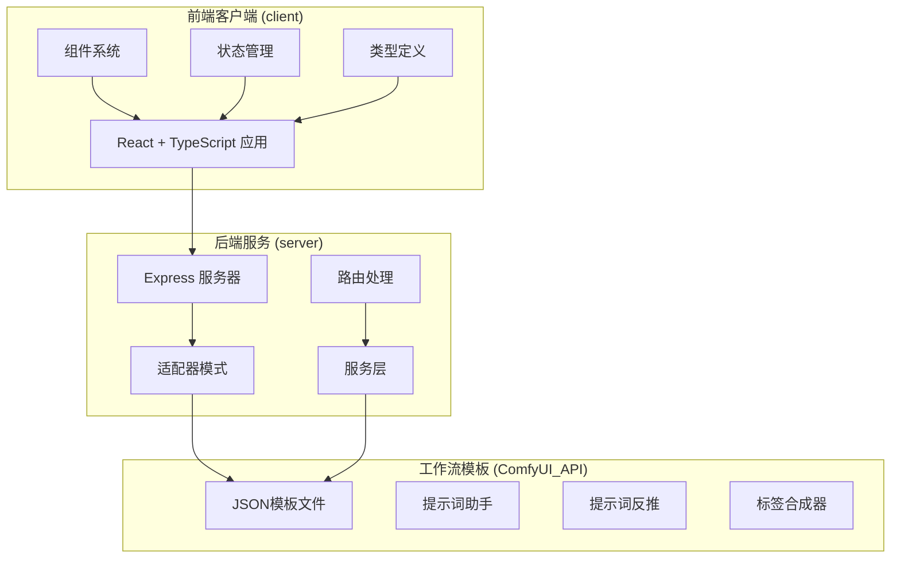

**图表来源**
- [README.md:41-62](file://README.md#L41-L62)

**章节来源**
- [README.md:1-79](file://README.md#L1-L79)

## 核心组件

### 负向提示词输入组件

负向提示词功能通过Text2ImgSidebar组件实现，提供了一个专门的输入区域，其结构与正向提示词完全一致：

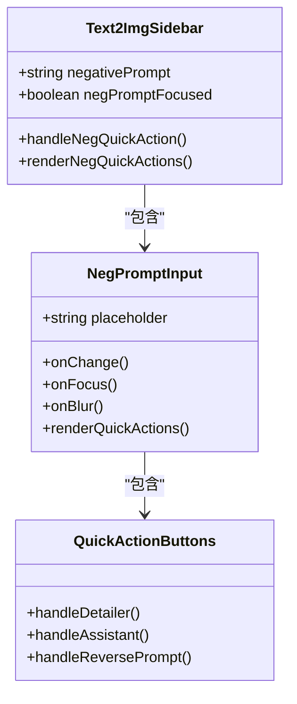

**更新** 负向提示词输入组件与正向提示词组件具有完全相同的结构和功能实现，包括快速操作按钮、状态管理和事件处理。

**图表来源**
- [Text2ImgSidebar.tsx:637-772](file://client/src/components/Text2ImgSidebar.tsx#L637-L772)

### 提示词助手集成

负向提示词与提示词助手的深度集成，支持所有提示词助手模式：

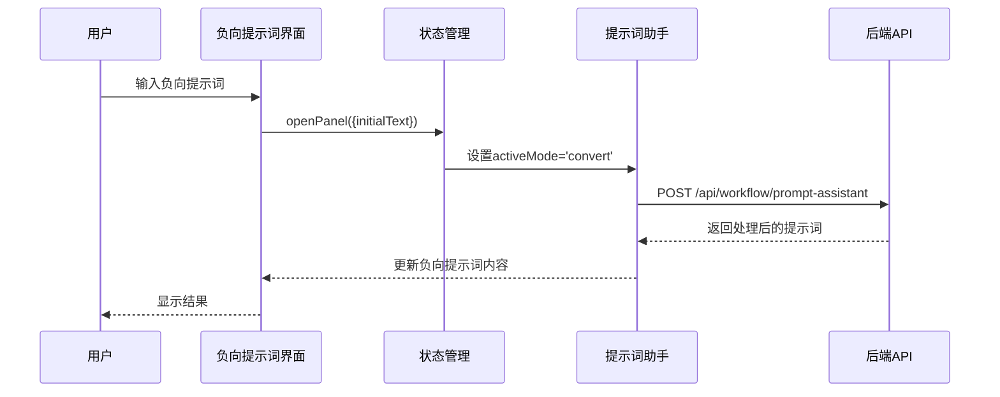

**更新** 提示词助手现在支持负向提示词的完整处理流程，包括标签转换、按需扩写、变体生成等所有模式。

**图表来源**
- [Text2ImgSidebar.tsx:760-772](file://client/src/components/Text2ImgSidebar.tsx#L760-L772)
- [usePromptAssistantStore.ts:15-32](file://client/src/hooks/usePromptAssistantStore.ts#L15-L32)

### 标签合成器支持

负向提示词与标签合成器的协同工作，提供结构化的标签管理系统：

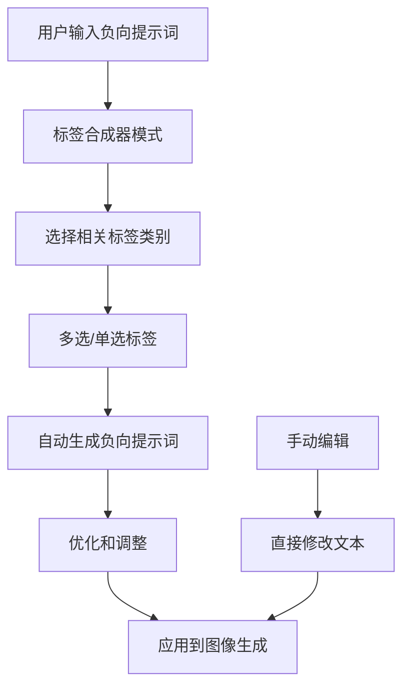

**更新** 标签合成器现在专门为负向提示词提供标签管理功能，支持与正向提示词相同的标签组织结构。

**图表来源**
- [ModeTagAssemble.tsx:108-126](file://client/src/components/prompt-assistant/ModeTagAssemble.tsx#L108-L126)

**章节来源**
- [Text2ImgSidebar.tsx:637-772](file://client/src/components/Text2ImgSidebar.tsx#L637-L772)
- [ModeTagAssemble.tsx:108-126](file://client/src/components/prompt-assistant/ModeTagAssemble.tsx#L108-L126)

## 架构概览

负向提示词支持的整体架构，现已与正向提示词系统完全对称：

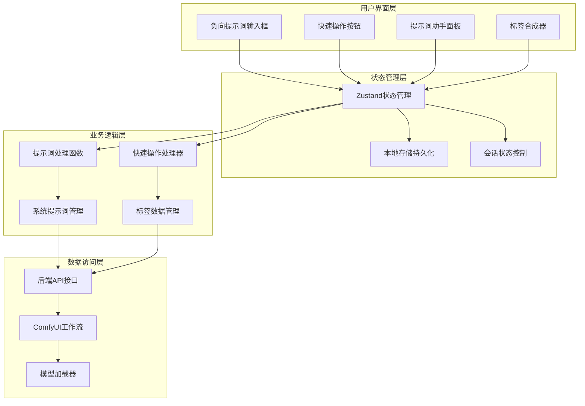

**更新** 架构现在实现了正负向提示词的完全对称设计，包括相同的状态管理模式、相同的业务逻辑处理和相同的后端接口调用。

**图表来源**
- [usePromptAssistantStore.ts:15-32](file://client/src/hooks/usePromptAssistantStore.ts#L15-L32)
- [PromptAssistantPanel.tsx:19-138](file://client/src/components/PromptAssistantPanel.tsx#L19-L138)

## 详细组件分析

### 负向提示词输入组件

#### 组件结构分析

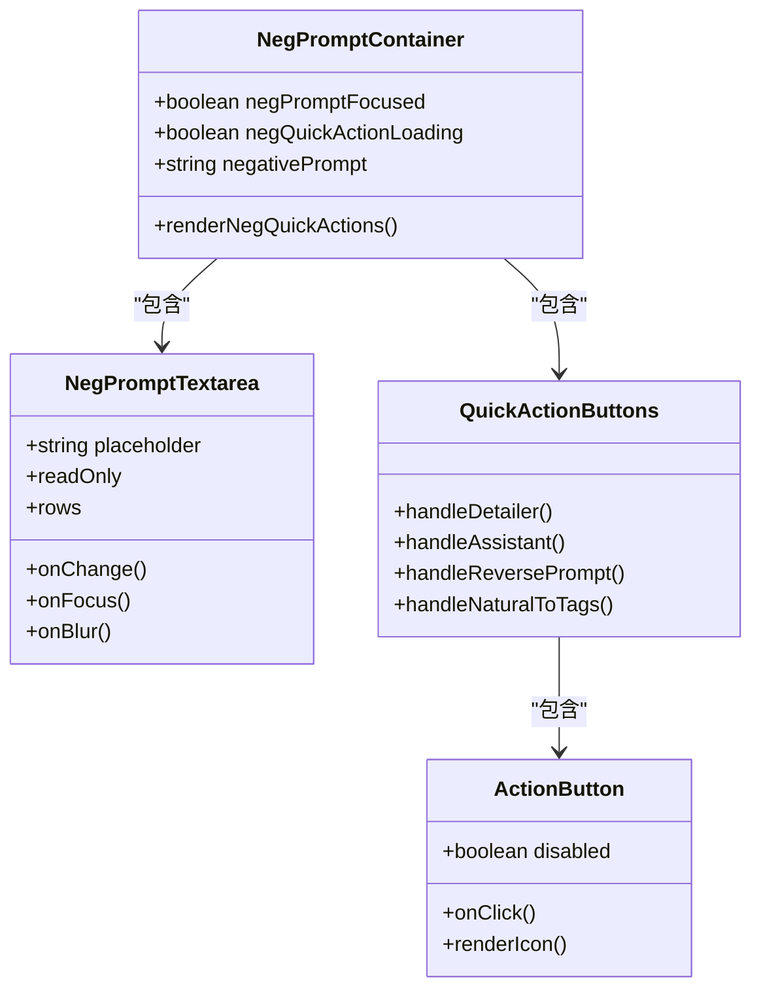

**更新** 负向提示词输入组件与正向提示词组件在结构上完全一致，包括状态管理、事件处理和UI渲染逻辑。

**图表来源**
- [Text2ImgSidebar.tsx:637-772](file://client/src/components/Text2ImgSidebar.tsx#L637-L772)

#### 快速操作功能

负向提示词支持三种与正向提示词完全相同的快速操作：

1. **按需扩写 (Detailer)**: 使用系统提示词扩展负向提示词的细节
2. **提示词助手 (Assistant)**: 打开完整的提示词助手面板进行复杂处理
3. **提示词反推 (Reverse Prompt)**: 从图像内容反推出负向提示词

**更新** 负向提示词的快速操作功能与正向提示词完全对称，包括相同的处理逻辑、相同的系统提示词调用和相同的UI反馈机制。

**章节来源**
- [Text2ImgSidebar.tsx:637-772](file://client/src/components/Text2ImgSidebar.tsx#L637-L772)

### 提示词助手系统

#### 系统提示词管理

提示词助手提供了六种不同的处理模式，现在完全支持负向提示词：

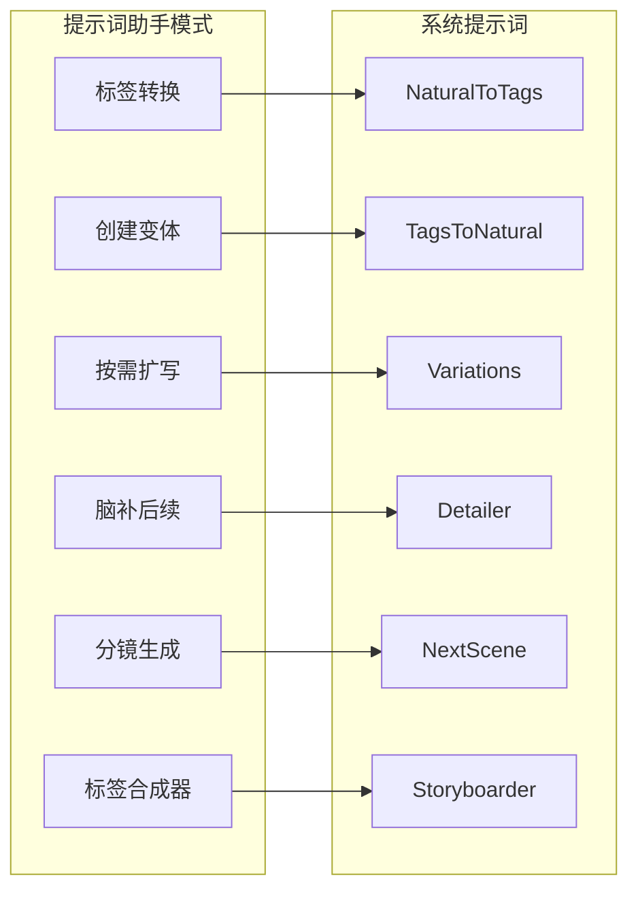

**更新** 提示词助手现在为负向提示词提供完整的处理能力，所有模式都支持负向提示词的转换和优化。

**图表来源**
- [systemPrompts.ts:4-144](file://client/src/components/prompt-assistant/systemPrompts.ts#L4-L144)

#### 模式转换流程

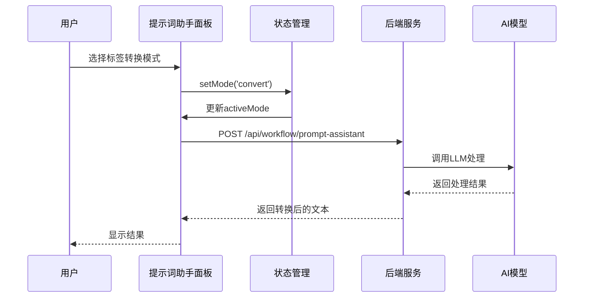

**更新** 模式转换流程现在完全支持负向提示词的处理，包括与正向提示词相同的处理逻辑和结果返回机制。

**图表来源**
- [PromptAssistantPanel.tsx:19-138](file://client/src/components/PromptAssistantPanel.tsx#L19-L138)
- [systemPrompts.ts:4-25](file://client/src/components/prompt-assistant/systemPrompts.ts#L4-L25)

**章节来源**
- [systemPrompts.ts:4-144](file://client/src/components/prompt-assistant/systemPrompts.ts#L4-L144)
- [PromptAssistantPanel.tsx:19-138](file://client/src/components/PromptAssistantPanel.tsx#L19-L138)

### 标签合成器集成

#### 标签数据结构

标签合成器为负向提示词提供了结构化的标签管理系统，与正向提示词共享相同的数据结构：

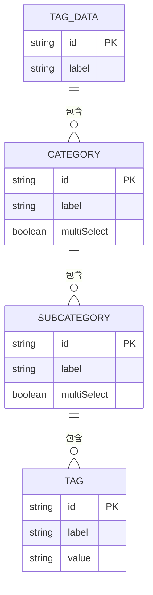

**更新** 标签数据结构现在专门为负向提示词提供标签管理，支持与正向提示词相同的标签组织和选择机制。

**图表来源**
- [tagData.json:1-174](file://client/src/data/tagData.json#L1-L174)

#### 负向提示词生成流程

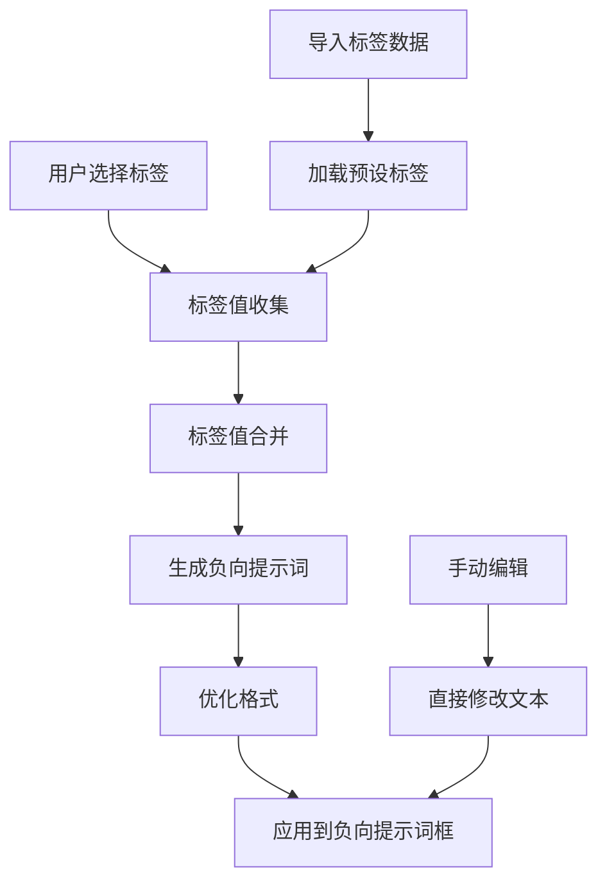

**更新** 负向提示词生成流程现在与正向提示词流程完全对称，包括相同的标签选择逻辑、格式化处理和结果应用机制。

**图表来源**
- [ModeTagAssemble.tsx:108-126](file://client/src/components/prompt-assistant/ModeTagAssemble.tsx#L108-L126)

**章节来源**
- [tagData.json:1-174](file://client/src/data/tagData.json#L1-L174)
- [ModeTagAssemble.tsx:108-126](file://client/src/components/prompt-assistant/ModeTagAssemble.tsx#L108-L126)

### 提示词反推技术

#### 多模型支持

项目集成了三种不同的提示词反推技术，现在完全支持负向提示词：

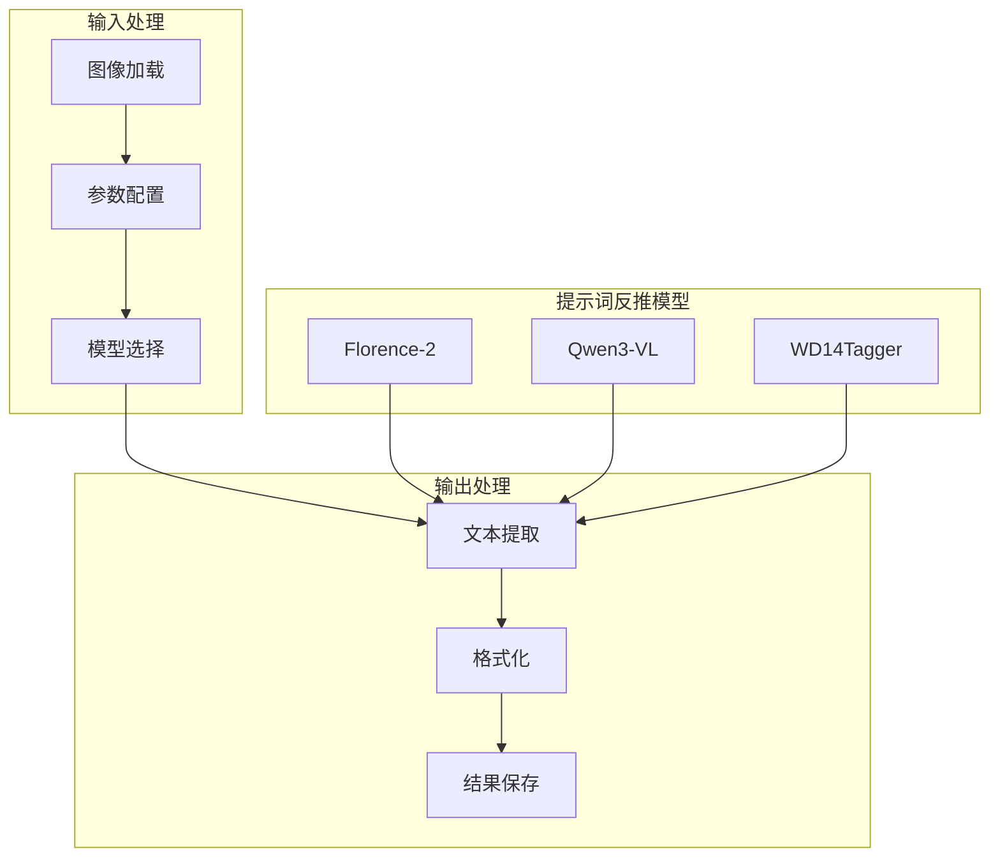

**更新** 提示词反推技术现在为负向提示词提供完整的图像理解能力，支持与正向提示词相同的多模型反推功能。

#### 工作流配置

每种反推模型都有特定的工作流配置，现在支持负向提示词的处理：

| 模型 | 文件名 | 主要用途 | 关键参数 |
|------|--------|----------|----------|
| Florence-2 | Pix2Real-提示词反推Flo.json | 详细描述生成 | more_detailed_caption |
| Qwen3-VL | Pix2Real-提示词反推Q3.json | 中文描述和提示词 | preset_prompt: 极致详细 |
| WD14Tagger | Pix2Real-提示词反推WD14.json | 标签反推 | threshold: 0.35 |

**更新** 所有反推模型现在都支持负向提示词的处理，包括相同的参数配置和结果格式化。

**章节来源**
- [Pix2Real-提示词反推Flo.json:1-77](file://ComfyUI_API/Pix2Real-提示词反推Flo.json#L1-L77)
- [Pix2Real-提示词反推Q3.json:1-106](file://ComfyUI_API/Pix2Real-提示词反推Q3.json#L1-L106)
- [Pix2Real-提示词反推WD14.json:1-58](file://ComfyUI_API/Pix2Real-提示词反推WD14.json#L1-L58)

## 依赖关系分析

### 组件间依赖

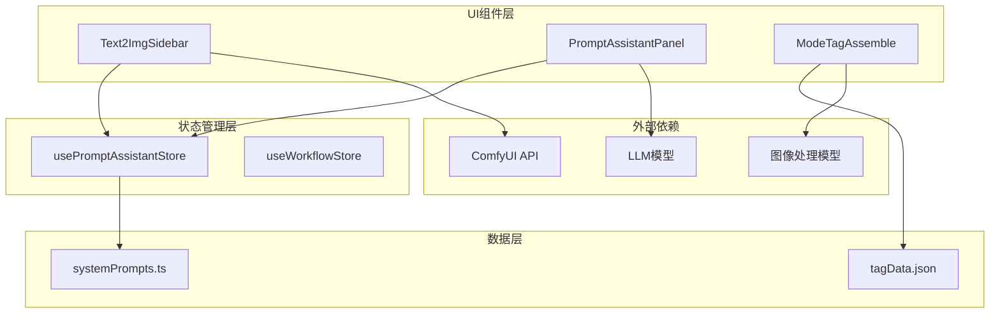

**更新** 依赖关系现在实现了正负向提示词的完全对称，包括相同的状态管理、相同的系统提示词和相同的外部依赖调用。

**图表来源**
- [usePromptAssistantStore.ts:15-32](file://client/src/hooks/usePromptAssistantStore.ts#L15-L32)
- [PromptAssistantPanel.tsx:19-138](file://client/src/components/PromptAssistantPanel.tsx#L19-L138)

### 数据流分析

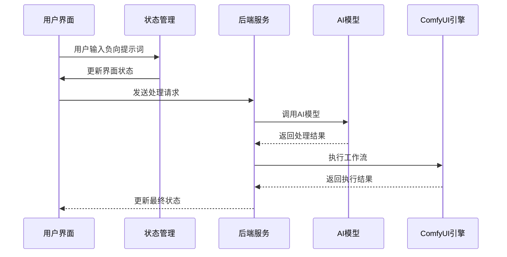

**更新** 数据流现在完全支持负向提示词的处理，包括与正向提示词相同的处理流程和结果返回机制。

**图表来源**
- [Text2ImgSidebar.tsx:637-772](file://client/src/components/Text2ImgSidebar.tsx#L637-L772)

**章节来源**
- [usePromptAssistantStore.ts:15-32](file://client/src/hooks/usePromptAssistantStore.ts#L15-L32)
- [Text2ImgSidebar.tsx:637-772](file://client/src/components/Text2ImgSidebar.tsx#L637-L772)

## 性能考虑

### 内存管理

负向提示词功能在设计时充分考虑了性能优化，与正向提示词系统完全一致：

1. **懒加载机制**: 提示词助手面板仅在需要时加载
2. **状态缓存**: 使用localStorage持久化用户偏好设置
3. **条件渲染**: 根据焦点状态动态显示快速操作按钮
4. **防抖处理**: 避免频繁的状态更新触发

### 并发处理

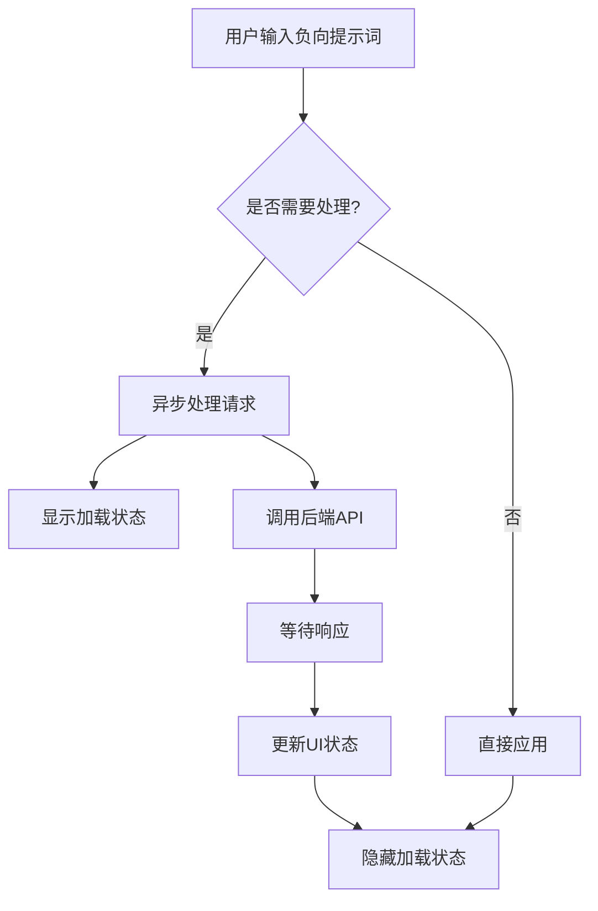

**更新** 并发处理机制现在完全支持负向提示词的处理，包括与正向提示词相同的异步处理和状态管理。

## 故障排除指南

### 常见问题及解决方案

1. **负向提示词不生效**
   - 检查提示词格式是否正确
   - 确认未被其他工作流覆盖
   - 验证ComfyUI连接状态

2. **提示词助手无响应**
   - 检查后端服务是否正常运行
   - 验证AI模型加载状态
   - 查看浏览器控制台错误信息

3. **标签合成器异常**
   - 确认tagData.json格式正确
   - 检查本地存储权限
   - 重新加载页面尝试

4. **负向提示词快速操作失效**
   - 检查负向提示词输入框是否有内容
   - 确认网络连接正常
   - 验证系统提示词配置

**更新** 新增了负向提示词专用的故障排除指南，包括快速操作失效等特定问题的解决方案。

**章节来源**
- [Text2ImgSidebar.tsx:637-772](file://client/src/components/Text2ImgSidebar.tsx#L637-L772)

## 结论

负向提示词支持功能通过精心设计的架构实现了以下目标：

1. **用户体验优化**: 提供与正向提示词完全相同的负向提示词输入界面和快速操作按钮
2. **功能完整性**: 集成提示词助手、标签合成器和多种提示词反推技术
3. **性能保证**: 采用状态管理和懒加载机制确保流畅体验
4. **扩展性强**: 模块化设计便于未来功能扩展和维护
5. **对称性设计**: 负向提示词系统与正向提示词系统完全对称，提供一致的使用体验

**更新** 负向提示词系统现已完全实现，支持与正向提示词相同的完整功能集，包括快速操作、提示词助手集成、标签合成器支持和多模型提示词反推技术。该系统不仅提升了图像生成的质量和效率，还为用户提供了更加灵活和强大的提示词管理工具，实现了正负向提示词的完全对称支持。

通过负向提示词的支持，用户可以更精确地控制生成结果，避免不需要的元素出现在最终图像中，同时享受与正向提示词相同的便捷操作和强大功能。