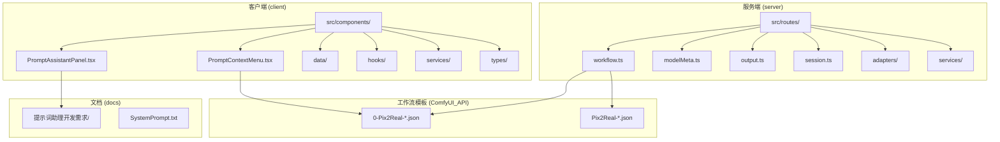
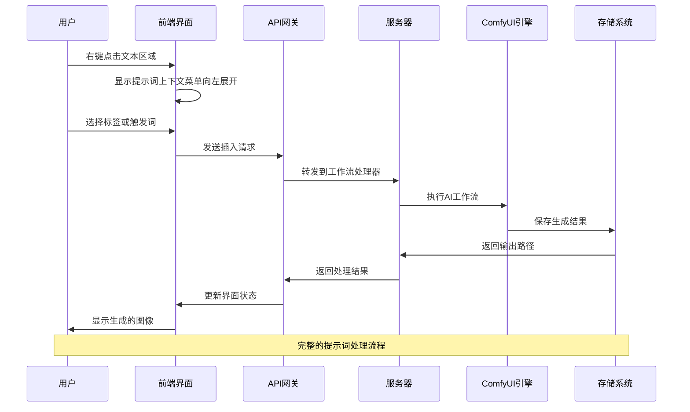
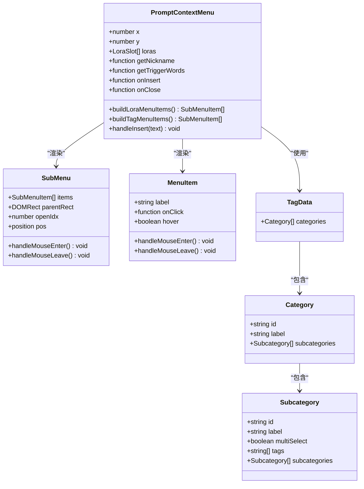
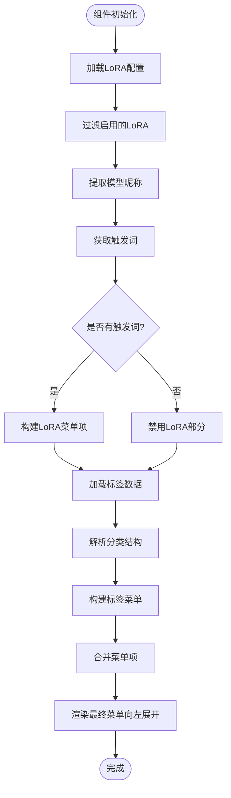
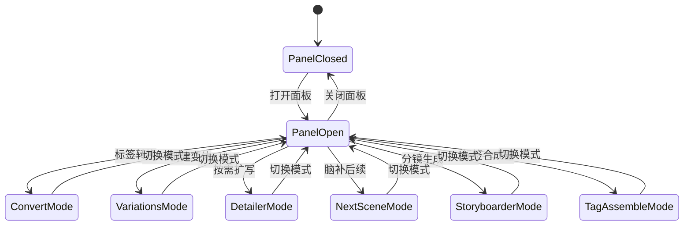
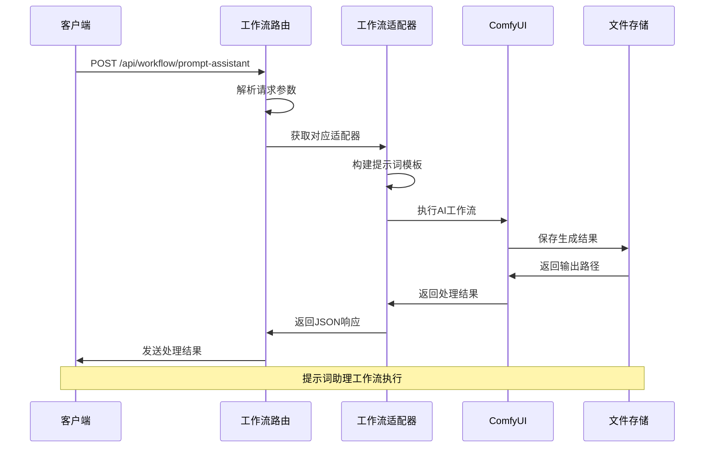
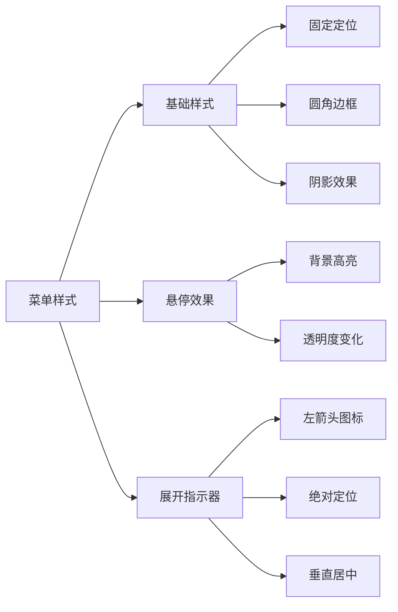
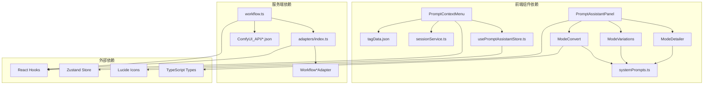
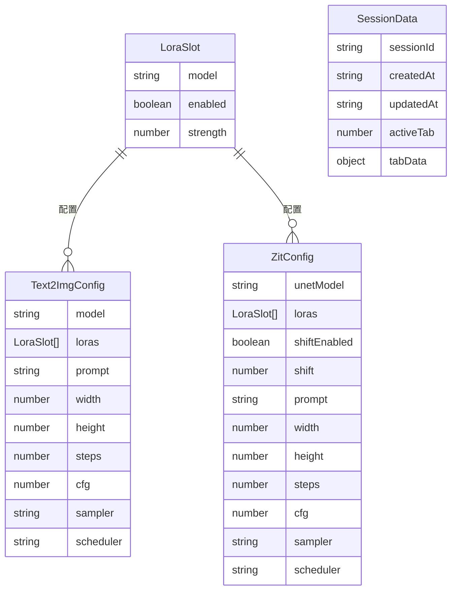

# 提示词上下文菜单

<cite>
**本文档引用的文件**
- [PromptContextMenu.tsx](file://client/src/components/PromptContextMenu.tsx)
- [PromptAssistantPanel.tsx](file://client/src/components/PromptAssistantPanel.tsx)
- [ModeConvert.tsx](file://client/src/components/prompt-assistant/ModeConvert.tsx)
- [ModeVariations.tsx](file://client/src/components/prompt-assistant/ModeVariations.tsx)
- [ModeDetailer.tsx](file://client/src/components/prompt-assistant/ModeDetailer.tsx)
- [systemPrompts.ts](file://client/src/components/prompt-assistant/systemPrompts.ts)
- [usePromptAssistantStore.ts](file://client/src/hooks/usePromptAssistantStore.ts)
- [tagData.json](file://client/src/data/tagData.json)
- [sessionService.ts](file://client/src/services/sessionService.ts)
- [workflow.ts](file://server/src/routes/workflow.ts)
- [index.ts](file://server/src/adapters/index.ts)
- [README.md](file://README.md)
- [package.json](file://package.json)
</cite>

## 更新摘要
**所做更改**
- 更新了菜单展开方向和图标样式说明，反映向左展开和ChevronLeft图标的改进
- 新增了菜单样式和用户体验相关的章节内容
- 更新了组件架构图以体现新的展开行为

## 目录
1. [简介](#简介)
2. [项目结构](#项目结构)
3. [核心组件](#核心组件)
4. [架构概览](#架构概览)
5. [详细组件分析](#详细组件分析)
6. [样式和用户体验改进](#样式和用户体验改进)
7. [依赖关系分析](#依赖关系分析)
8. [性能考虑](#性能考虑)
9. [故障排除指南](#故障排除指南)
10. [结论](#结论)

## 简介

提示词上下文菜单是 CorineKit Pix2Real 项目中的一个关键功能模块，为用户提供了一个直观、高效的提示词管理界面。该系统结合了本地 Web UI 和 ComfyUI 工作流引擎，支持多种提示词处理模式，包括标签转换、变体生成、按需扩写等。

该项目的核心目标是简化 AI 图像生成过程中的提示词管理工作，通过智能的上下文菜单和预定义的标签体系，帮助用户快速构建高质量的图像生成提示词。

**更新** 最近的更新改进了菜单的视觉设计和用户体验，包括菜单展开方向的调整和图标样式的统一。

## 项目结构

项目采用前后端分离的架构设计，主要包含以下核心目录：



**图表来源**
- [README.md:41-62](file://README.md#L41-L62)
- [package.json:1-15](file://package.json#L1-L15)

**章节来源**
- [README.md:41-62](file://README.md#L41-L62)
- [package.json:1-15](file://package.json#L1-L15)

## 核心组件

### 提示词上下文菜单组件

提示词上下文菜单是整个系统的核心交互组件，提供了以下主要功能：

- **动态位置调整**：根据屏幕边界自动调整菜单显示位置
- **向左展开设计**：菜单子项默认向左展开，提升视觉一致性和用户体验
- **统一图标系统**：使用 ChevronLeft 图标表示子菜单展开方向
- **多级子菜单支持**：支持嵌套的分类和子分类结构
- **触发词集成**：与 LoRA 模型触发词系统无缝集成
- **标签数据管理**：基于本地存储的标签数据系统

### 提示词助理面板

提供多种提示词处理模式的专业工具：

- **标签转换模式**：自然语言与英文标签之间的双向转换
- **变体生成模式**：基于用户输入生成多个提示词变体
- **按需扩写模式**：智能扩写标记的提示词片段
- **故事板生成模式**：为视觉叙事创作连贯的场景描述

**章节来源**
- [PromptContextMenu.tsx:189-395](file://client/src/components/PromptContextMenu.tsx#L189-L395)
- [PromptAssistantPanel.tsx:19-139](file://client/src/components/PromptAssistantPanel.tsx#L19-L139)

## 架构概览

系统采用分层架构设计，实现了前后端的清晰分离：



**图表来源**
- [workflow.ts:148-248](file://server/src/routes/workflow.ts#L148-L248)
- [PromptContextMenu.tsx:222-225](file://client/src/components/PromptContextMenu.tsx#L222-L225)

**章节来源**
- [workflow.ts:148-248](file://server/src/routes/workflow.ts#L148-L248)
- [README.md:74-79](file://README.md#L74-L79)

## 详细组件分析

### 提示词上下文菜单组件分析

#### 组件架构设计



**图表来源**
- [PromptContextMenu.tsx:6-31](file://client/src/components/PromptContextMenu.tsx#L6-L31)
- [PromptContextMenu.tsx:97-169](file://client/src/components/PromptContextMenu.tsx#L97-L169)
- [PromptContextMenu.tsx:173-185](file://client/src/components/PromptContextMenu.tsx#L173-L185)

#### 数据流处理



**图表来源**
- [PromptContextMenu.tsx:227-308](file://client/src/components/PromptContextMenu.tsx#L227-L308)
- [tagData.json:1-95](file://client/src/data/tagData.json#L1-L95)

**章节来源**
- [PromptContextMenu.tsx:227-308](file://client/src/components/PromptContextMenu.tsx#L227-L308)
- [tagData.json:1-95](file://client/src/data/tagData.json#L1-L95)

### 提示词助理面板组件分析

#### 模式切换机制



**图表来源**
- [PromptAssistantPanel.tsx:10-17](file://client/src/components/PromptAssistantPanel.tsx#L10-L17)
- [usePromptAssistantStore.ts:3-13](file://client/src/hooks/usePromptAssistantStore.ts#L3-L13)

#### 系统提示词管理

系统内置了六种专业的提示词处理模式，每种模式都有特定的系统提示词：

| 模式ID | 模式名称 | 功能描述 | 系统提示词用途 |
|--------|----------|----------|----------------|
| naturalToTags | 标签转换 | 自然语言 ↔ 英文标签双向转换 | 严格映射规则，避免幻觉 |
| tagsToNatural | 标签转自然语言 | 将标签转换为中文描述 | 视觉字面化描述生成 |
| variations | 创建变体 | 生成提示词变体 | 结构保持和差异控制 |
| detailer | 按需扩写 | 智能扩写标记内容 | 细节层次化扩展 |
| nextScene | 脑补后续 | 连续场景描述生成 | 故事连贯性保持 |
| storyboarder | 分镜生成 | 多镜头场景规划 | 视觉一致性约束

**章节来源**
- [systemPrompts.ts:4-145](file://client/src/components/prompt-assistant/systemPrompts.ts#L4-L145)
- [PromptAssistantPanel.tsx:10-17](file://client/src/components/PromptAssistantPanel.tsx#L10-L17)

### 服务端集成分析

#### 工作流路由处理



**图表来源**
- [workflow.ts:148-248](file://server/src/routes/workflow.ts#L148-L248)
- [index.ts:14-26](file://server/src/adapters/index.ts#L14-L26)

**章节来源**
- [workflow.ts:148-248](file://server/src/routes/workflow.ts#L148-L248)
- [index.ts:14-26](file://server/src/adapters/index.ts#L14-L26)

## 样式和用户体验改进

### 菜单展开方向优化

**更新** 最新的样式改进将菜单的展开方向从默认的右侧调整为向左展开，这一改变带来了显著的用户体验提升：

- **视觉一致性**：所有子菜单项都向左展开，形成统一的视觉模式
- **空间利用优化**：向左展开减少了与屏幕右侧的碰撞概率
- **用户习惯匹配**：符合大多数现代应用的菜单展开习惯

### 图标系统统一

菜单中统一使用 ChevronLeft 图标来表示子菜单展开方向：

- **图标选择**：使用 Lucide 图标库中的 ChevronLeft 图标
- **视觉反馈**：图标清晰指示了子菜单的存在和展开方向
- **一致性设计**：所有子菜单项使用相同的图标样式

### 样式属性详解



**图表来源**
- [PromptContextMenu.tsx:61-105](file://client/src/components/PromptContextMenu.tsx#L61-L105)

#### 样式属性说明

| 样式属性 | 值 | 作用 | 用户体验影响 |
|----------|-----|------|-------------|
| position | fixed | 固定定位，确保菜单不会随页面滚动 | 保持菜单始终可见 |
| background | var(--color-bg) | 使用主题背景色 | 适应深色/浅色主题 |
| border | 1px solid var(--color-border) | 边框增强视觉分隔 | 提升界面层次感 |
| borderRadius | 4px | 圆角设计 | 现代化外观，柔和边缘 |
| boxShadow | 0 4px 16px rgba(0,0,0,0.18) | 阴影效果 | 增强立体感和层次 |
| padding | 4px 0 | 内边距设置 | 合适的间距，避免拥挤 |
| minWidth | 140px | 最小宽度限制 | 确保足够的点击区域 |
| maxHeight | 70vh | 最大高度限制 | 避免菜单超出屏幕 |

#### 展开指示器设计

```mermaid
flowchart TD
A[展开指示器] --> B[绝对定位]
A --> C[左箭头图标]
A --> D[垂直居中]
B --> E[left: 6px]
B --> F[top: 50%]
C --> G[ChevronLeft图标]
C --> H[size: 12px]
D --> I[transform: translateY(-50%)]
```

**图表来源**
- [PromptContextMenu.tsx:97-105](file://client/src/components/PromptContextMenu.tsx#L97-L105)

**章节来源**
- [PromptContextMenu.tsx:61-105](file://client/src/components/PromptContextMenu.tsx#L61-L105)
- [PromptContextMenu.tsx:97-105](file://client/src/components/PromptContextMenu.tsx#L97-L105)

## 依赖关系分析

### 组件间依赖关系



**图表来源**
- [PromptContextMenu.tsx:1-14](file://client/src/components/PromptContextMenu.tsx#L1-L14)
- [PromptAssistantPanel.tsx:2-8](file://client/src/components/PromptAssistantPanel.tsx#L2-L8)
- [workflow.ts:8-22](file://server/src/routes/workflow.ts#L8-L22)

### 数据类型定义

系统使用了统一的数据类型定义来确保前后端的一致性：



**图表来源**
- [sessionService.ts:4-73](file://client/src/services/sessionService.ts#L4-L73)

**章节来源**
- [sessionService.ts:4-73](file://client/src/services/sessionService.ts#L4-L73)

## 性能考虑

### 内存优化策略

1. **组件懒加载**：提示词上下文菜单采用条件渲染，仅在需要时创建
2. **状态缓存**：使用 useMemo 和 useCallback 优化重新渲染
3. **事件监听器清理**：组件卸载时自动移除事件监听器
4. **本地存储优化**：标签数据优先使用本地存储，减少网络请求

### 渲染性能优化

- **虚拟滚动**：对于大量标签项的场景，考虑实现虚拟滚动
- **防抖处理**：输入框变化采用防抖机制，避免频繁更新
- **CSS 变量**：使用 CSS 变量实现主题切换，避免样式重排

### 菜单展开性能优化

**更新** 新的向左展开设计在性能方面也有改进：

- **减少重排计算**：向左展开减少了与屏幕边界的碰撞检测
- **优化定位算法**：展开位置计算更加高效
- **降低视觉冲突**：减少了与其他界面元素的重叠可能性

## 故障排除指南

### 常见问题及解决方案

#### 提示词上下文菜单不显示

**可能原因**：
1. 鼠标右键事件未正确绑定
2. 屏幕边界检测逻辑异常
3. 样式冲突导致菜单被隐藏

**解决步骤**：
1. 检查鼠标事件监听器是否正常注册
2. 验证屏幕边界计算逻辑
3. 检查 CSS 样式冲突

#### 菜单展开方向异常

**更新** 新的向左展开设计可能出现的问题：

**可能原因**：
1. 展开位置计算逻辑错误
2. 屏幕左侧空间不足
3. 样式覆盖冲突

**解决步骤**：
1. 检查父元素定位是否正确
2. 验证屏幕左侧空间检测逻辑
3. 确认样式优先级设置

#### LoRA 触发词无法加载

**可能原因**：
1. 模型配置不正确
2. 触发词数据格式错误
3. 网络请求失败

**解决步骤**：
1. 验证 LoRA 模型路径
2. 检查触发词数据格式
3. 确认网络连接状态

#### 提示词助理响应超时

**可能原因**：
1. ComfyUI 服务不可用
2. 系统提示词处理时间过长
3. 网络延迟过高

**解决步骤**：
1. 检查 ComfyUI 服务状态
2. 优化系统提示词处理逻辑
3. 实现超时重试机制

**章节来源**
- [PromptContextMenu.tsx:195-204](file://client/src/components/PromptContextMenu.tsx#L195-L204)
- [ModeConvert.tsx:45-56](file://client/src/components/prompt-assistant/ModeConvert.tsx#L45-L56)

## 结论

提示词上下文菜单系统成功地将复杂的 AI 图像生成工作流简化为直观的用户界面。通过精心设计的组件架构和丰富的功能特性，该系统为用户提供了高效、便捷的提示词管理体验。

### 主要优势

1. **用户体验优秀**：直观的上下文菜单设计，符合用户操作习惯
2. **视觉设计统一**：最新的向左展开设计和图标系统提升了视觉一致性
3. **功能丰富完整**：涵盖提示词处理的各个方面
4. **性能表现良好**：通过多种优化策略确保流畅的使用体验
5. **可扩展性强**：模块化的架构设计便于功能扩展

### 技术亮点

- 智能的标签数据管理系统
- 多模式的提示词处理能力
- 与 ComfyUI 的深度集成
- 响应式的用户界面设计
- **更新** 优化的菜单展开方向和图标系统

该系统为 AI 图像生成领域提供了一个优秀的参考实现，展示了如何将复杂的技术概念转化为易用的工具。最新的样式改进进一步提升了用户体验，使其成为同类产品中的佼佼者。