# 提示词上下文菜单

<cite>
**本文档引用的文件**
- [PromptContextMenu.tsx](file://client/src/components/PromptContextMenu.tsx)
- [PromptAssistantPanel.tsx](file://client/src/components/PromptAssistantPanel.tsx)
- [ModeConvert.tsx](file://client/src/components/prompt-assistant/ModeConvert.tsx)
- [ModeVariations.tsx](file://client/src/components/prompt-assistant/ModeVariations.tsx)
- [ModeDetailer.tsx](file://client/src/components/prompt-assistant/ModeDetailer.tsx)
- [ModeNextScene.tsx](file://client/src/components/prompt-assistant/ModeNextScene.tsx)
- [ModeStoryboarder.tsx](file://client/src/components/prompt-assistant/ModeStoryboarder.tsx)
- [ModeTagAssemble.tsx](file://client/src/components/prompt-assistant/ModeTagAssemble.tsx)
- [systemPrompts.ts](file://client/src/components/prompt-assistant/systemPrompts.ts)
- [usePromptAssistantStore.ts](file://client/src/hooks/usePromptAssistantStore.ts)
- [tagData.json](file://client/src/data/tagData.json)
- [sessionService.ts](file://client/src/services/sessionService.ts)
- [workflow.ts](file://server/src/routes/workflow.ts)
- [index.ts](file://server/src/adapters/index.ts)
- [Text2ImgSidebar.tsx](file://client/src/components/Text2ImgSidebar.tsx)
- [ZITSidebar.tsx](file://client/src/components/ZITSidebar.tsx)
- [App.tsx](file://client/src/components/App.tsx)
- [README.md](file://README.md)
- [package.json](file://package.json)
</cite>

## 更新摘要
**所做更改**
- 新增智能逗号插入逻辑，支持在插入文本时自动添加适当的逗号分隔符
- 引入 useRef 来跟踪选中文本的开始和结束位置，提升文本选择精度
- 增强剪切、复制和粘贴操作的实现，支持精确的文本范围操作
- 更新上下文菜单系统以支持剪贴板操作按钮
- 新增剪贴板按钮组件 ClipboardButton，提供统一的剪贴板操作界面

## 目录
1. [简介](#简介)
2. [项目结构](#项目结构)
3. [核心组件](#核心组件)
4. [架构概览](#架构概览)
5. [详细组件分析](#详细组件分析)
6. [智能文本选择系统](#智能文本选择系统)
7. [剪贴板操作增强](#剪贴板操作增强)
8. [智能逗号插入逻辑](#智能逗号插入逻辑)
9. [样式和用户体验改进](#样式和用户体验改进)
10. [本地存储管理](#本地存储管理)
11. [收藏系统设计](#收藏系统设计)
12. [依赖关系分析](#依赖关系分析)
13. [性能考虑](#性能考虑)
14. [故障排除指南](#故障排除指南)
15. [结论](#结论)

## 简介

提示词上下文菜单是 CorineKit Pix2Real 项目中的一个关键功能模块，为用户提供了一个直观、高效的提示词管理界面。该系统结合了本地 Web UI 和 ComfyUI 工作流引擎，支持多种提示词处理模式，包括标签转换、变体生成、按需扩写等。

**最新更新** 系统现已集成了智能文本选择和剪贴板操作功能，引入了 useRef 来精确跟踪选中文本的位置，并实现了智能的逗号插入逻辑，显著提升了用户的文本编辑体验。

该项目的核心目标是简化 AI 图像生成过程中的提示词管理工作，通过智能的上下文菜单和预定义的标签体系，帮助用户快速构建高质量的图像生成提示词。

## 项目结构

项目采用前后端分离的架构设计，主要包含以下核心目录：

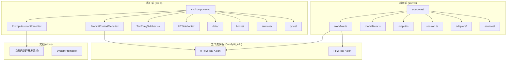

**图表来源**
- [README.md:41-62](file://README.md#L41-L62)
- [package.json:1-15](file://package.json#L1-L15)

**章节来源**
- [README.md:41-62](file://README.md#L41-L62)
- [package.json:1-15](file://package.json#L1-L15)

## 核心组件

### 提示词上下文菜单组件

提示词上下文菜单是整个系统的核心交互组件，提供了以下主要功能：

- **智能文本选择集成**：与 useRef 结合，精确跟踪选中文本的开始和结束位置
- **动态位置调整**：根据屏幕边界自动调整菜单显示位置
- **向左展开设计**：菜单子项默认向左展开，提升视觉一致性和用户体验
- **统一图标系统**：使用 ChevronLeft 图标表示子菜单展开方向
- **多级子菜单支持**：支持嵌套的分类和子分类结构
- **触发词集成**：与 LoRA 模型触发词系统无缝集成
- **标签数据管理**：基于本地存储的标签数据系统
- **标签菜单项**：新增的 TagMenuItem 组件支持星标收藏功能
- **最近使用记录**：自动跟踪和管理用户最近使用的标签
- **收藏管理**：支持用户收藏常用标签，提供快速访问
- **剪贴板操作**：集成剪切、复制、粘贴功能，支持精确文本范围操作

### 提示词助理面板

提供多种提示词处理模式的专业工具：

- **标签转换模式**：自然语言与英文标签之间的双向转换
- **变体生成模式**：基于用户输入生成多个提示词变体
- **按需扩写模式**：智能扩写标记的提示词片段
- **故事板生成模式**：为视觉叙事创作连贯的场景描述
- **标签合成器模式**：可视化标签管理工具，支持自定义标签库

### 文本编辑组件

**新增功能** Text2ImgSidebar 和 ZITSidebar 提供了完整的文本编辑环境：

- **智能文本选择**：使用 useRef 跟踪选中文本的精确位置
- **上下文菜单集成**：右键点击触发智能上下文菜单
- **剪贴板操作**：支持剪切、复制、粘贴操作
- **智能逗号插入**：自动处理文本插入时的逗号分隔符
- **焦点管理**：精确控制文本区域的焦点和选择状态

**章节来源**
- [PromptContextMenu.tsx:189-395](file://client/src/components/PromptContextMenu.tsx#L189-L395)
- [PromptAssistantPanel.tsx:19-139](file://client/src/components/PromptAssistantPanel.tsx#L19-L139)
- [Text2ImgSidebar.tsx:134-183](file://client/src/components/Text2ImgSidebar.tsx#L134-L183)
- [ZITSidebar.tsx:133-182](file://client/src/components/ZITSidebar.tsx#L133-L182)

## 架构概览

系统采用分层架构设计，实现了前后端的清晰分离：

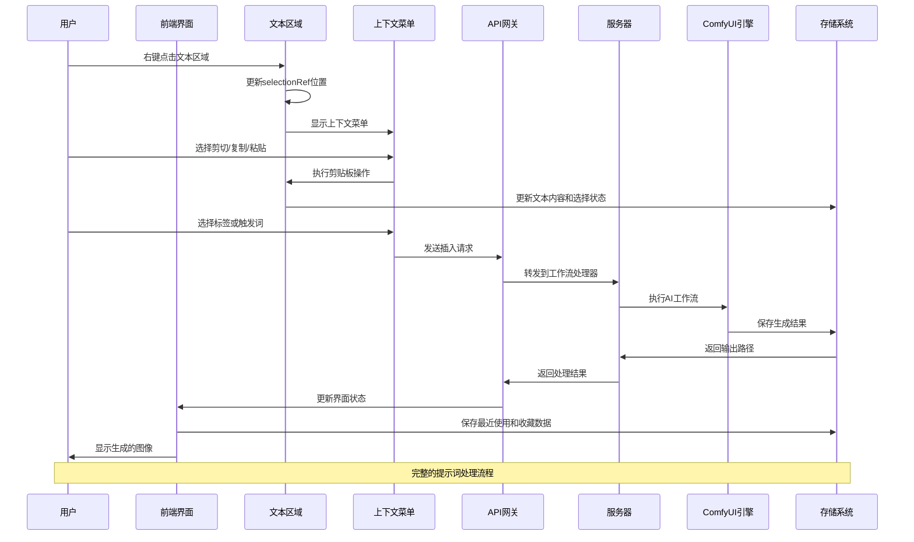

**图表来源**
- [workflow.ts:148-248](file://server/src/routes/workflow.ts#L148-L248)
- [PromptContextMenu.tsx:222-225](file://client/src/components/PromptContextMenu.tsx#L222-L225)
- [Text2ImgSidebar.tsx:548-555](file://client/src/components/Text2ImgSidebar.tsx#L548-L555)

**章节来源**
- [workflow.ts:148-248](file://server/src/routes/workflow.ts#L148-L248)
- [README.md:74-79](file://README.md#L74-L79)

## 详细组件分析

### 提示词上下文菜单组件分析

#### 组件架构设计

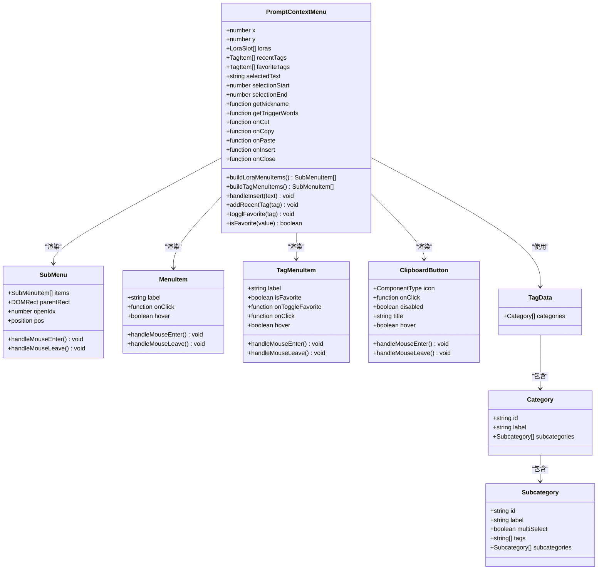

**图表来源**
- [PromptContextMenu.tsx:6-31](file://client/src/components/PromptContextMenu.tsx#L6-L31)
- [PromptContextMenu.tsx:97-169](file://client/src/components/PromptContextMenu.tsx#L97-L169)
- [PromptContextMenu.tsx:173-185](file://client/src/components/PromptContextMenu.tsx#L173-L185)
- [PromptContextMenu.tsx:255-288](file://client/src/components/PromptContextMenu.tsx#L255-L288)

#### 数据流处理

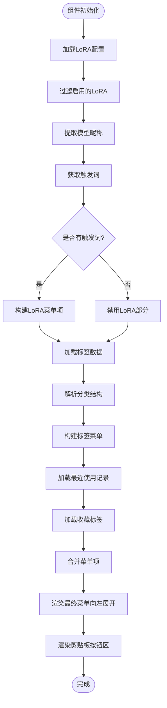

**图表来源**
- [PromptContextMenu.tsx:227-308](file://client/src/components/PromptContextMenu.tsx#L227-L308)
- [tagData.json:1-95](file://client/src/data/tagData.json#L1-L95)

**章节来源**
- [PromptContextMenu.tsx:227-308](file://client/src/components/PromptContextMenu.tsx#L227-L308)
- [tagData.json:1-95](file://client/src/data/tagData.json#L1-L95)

### 提示词助理面板组件分析

#### 模式切换机制

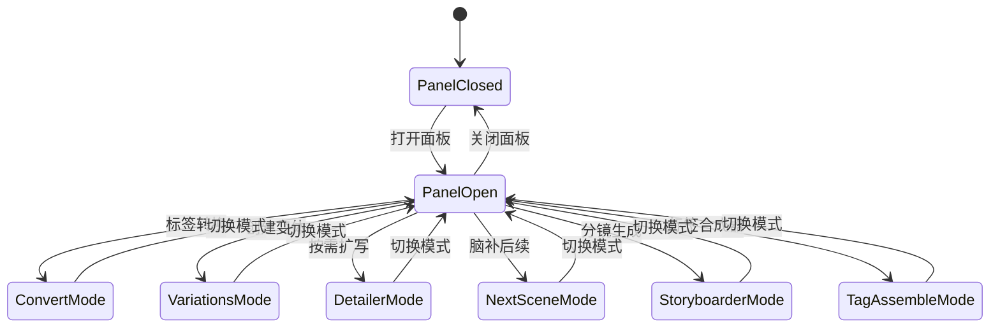

**图表来源**
- [PromptAssistantPanel.tsx:10-17](file://client/src/components/PromptAssistantPanel.tsx#L10-L17)
- [usePromptAssistantStore.ts:3-13](file://client/src/hooks/usePromptAssistantStore.ts#L3-L13)

#### 系统提示词管理

系统内置了七种专业的提示词处理模式，每种模式都有特定的系统提示词：

| 模式ID | 模式名称 | 功能描述 | 系统提示词用途 |
|--------|----------|----------|----------------|
| naturalToTags | 标签转换 | 自然语言 ↔ 英文标签双向转换 | 严格映射规则，避免幻觉 |
| tagsToNatural | 标签转自然语言 | 将标签转换为中文描述 | 视觉字面化描述生成 |
| variations | 创建变体 | 生成提示词变体 | 结构保持和差异控制 |
| detailer | 按需扩写 | 智能扩写标记内容 | 细节层次化扩展 |
| nextScene | 脑补后续 | 连续场景描述生成 | 故事连贯性保持 |
| storyboarder | 分镜生成 | 多镜头场景规划 | 视觉一致性约束 |
| tagAssemble | 标签合成器 | 可视化标签管理 | 自定义标签库构建 |

**章节来源**
- [systemPrompts.ts:4-145](file://client/src/components/prompt-assistant/systemPrompts.ts#L4-L145)
- [PromptAssistantPanel.tsx:10-17](file://client/src/components/PromptAssistantPanel.tsx#L10-L17)

### 服务端集成分析

#### 工作流路由处理

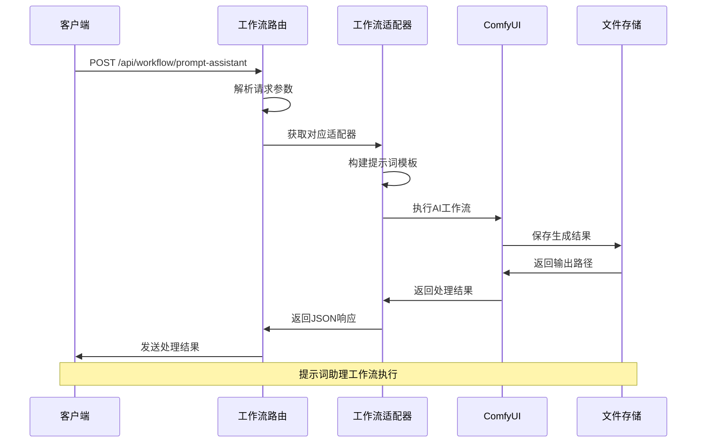

**图表来源**
- [workflow.ts:148-248](file://server/src/routes/workflow.ts#L148-L248)
- [index.ts:14-26](file://server/src/adapters/index.ts#L14-L26)

**章节来源**
- [workflow.ts:148-248](file://server/src/routes/workflow.ts#L148-L248)
- [index.ts:14-26](file://server/src/adapters/index.ts#L14-L26)

## 智能文本选择系统

### useRef 精确位置跟踪

**新增功能** 系统引入了 useRef 来精确跟踪选中文本的位置，解决了传统基于事件的文本选择方法的局限性：

#### selectionRef 的设计原理

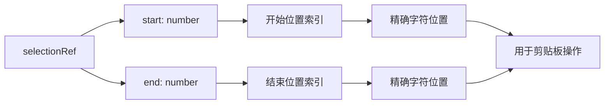

**图表来源**
- [Text2ImgSidebar.tsx:134](file://client/src/components/Text2ImgSidebar.tsx#L134)
- [ZITSidebar.tsx:133](file://client/src/components/ZITSidebar.tsx#L133)

#### 文本选择事件处理

- **右键菜单触发**：在 onContextMenu 事件中更新 selectionRef 的值
- **精确位置捕获**：使用 selectionStart 和 selectionEnd 获取准确的文本范围
- **状态同步**：selectionRef 与组件状态保持同步，确保数据一致性

#### 文本操作实现

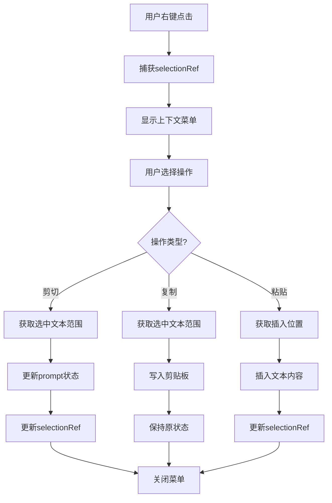

**图表来源**
- [Text2ImgSidebar.tsx:142-183](file://client/src/components/Text2ImgSidebar.tsx#L142-L183)
- [ZITSidebar.tsx:141-182](file://client/src/components/ZITSidebar.tsx#L141-L182)

**章节来源**
- [Text2ImgSidebar.tsx:134-183](file://client/src/components/Text2ImgSidebar.tsx#L134-L183)
- [ZITSidebar.tsx:133-182](file://client/src/components/ZITSidebar.tsx#L133-L182)

## 剪贴板操作增强

### ClipboardButton 组件设计

**新增功能** 系统引入了专门的 ClipboardButton 组件来统一处理剪贴板操作：

#### 组件架构

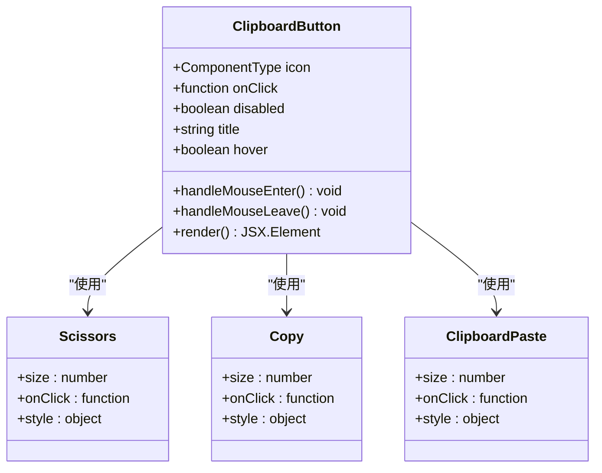

**图表来源**
- [PromptContextMenu.tsx:255-288](file://client/src/components/PromptContextMenu.tsx#L255-L288)

#### 剪贴板操作实现

**剪切操作 (handleCtxCut)**：
- 检查选中文本范围的有效性
- 使用 navigator.clipboard.writeText() 复制文本到剪贴板
- 从 prompt 中移除选中的文本
- 更新 selectionRef 以反映文本移除后的状态
- 重新设置文本区域的焦点和选择位置

**复制操作 (handleCtxCopy)**：
- 直接复制选中文本到剪贴板
- 不修改原始文本内容
- 保持 selectionRef 不变

**粘贴操作 (handleCtxPaste)**：
- 从剪贴板读取文本内容
- 在当前光标位置插入文本
- 更新 selectionRef 以反映新文本的插入位置
- 设置文本区域焦点到插入位置

#### 智能焦点管理

- **延迟焦点设置**：使用 setTimeout(0) 确保 DOM 更新后再设置焦点
- **精确位置控制**：根据操作类型设置不同的选择范围
- **用户体验优化**：保持用户操作的连续性和预期性

**章节来源**
- [PromptContextMenu.tsx:481-504](file://client/src/components/PromptContextMenu.tsx#L481-L504)
- [Text2ImgSidebar.tsx:142-183](file://client/src/components/Text2ImgSidebar.tsx#L142-L183)
- [ZITSidebar.tsx:141-182](file://client/src/components/ZITSidebar.tsx#L141-L182)

## 智能逗号插入逻辑

### 自动逗号分隔符处理

**新增功能** 系统实现了智能的逗号插入逻辑，能够根据上下文自动添加适当的逗号分隔符：

#### 逗号插入算法

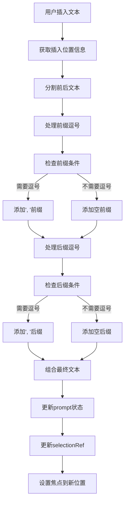

**图表来源**
- [Text2ImgSidebar.tsx:1005-1026](file://client/src/components/Text2ImgSidebar.tsx#L1005-L1026)
- [ZITSidebar.tsx:893-916](file://client/src/components/ZITSidebar.tsx#L893-L916)

#### 逗号插入条件判断

**前缀逗号判断 (needCommaBefore)**：
- 当前文本前面有内容且不以逗号结尾时需要添加逗号
- 使用 trimmedBefore.endsWith(',') 检查末尾字符
- 如果需要逗号则添加 ", "，否则添加空字符串

**后缀逗号判断 (needCommaAfter)**：
- 当前文本后面有内容且不以逗号开头时需要添加逗号
- 使用 trimmedAfter.startsWith(',') 检查开头字符
- 如果需要逗号则添加 ", "，否则添加空字符串

#### 插入位置计算

- **新位置计算**：newPos = before.length + prefix.length + text.length
- **精确光标定位**：确保插入后光标位于新文本的末尾
- **状态同步**：更新 selectionRef 以反映新的选择范围

#### 用户体验优化

- **无缝插入**：用户感知不到逗号的自动添加过程
- **上下文感知**：根据实际的文本上下文智能决定逗号的添加
- **一致性保持**：确保插入的逗号格式在整个应用中保持一致

**章节来源**
- [Text2ImgSidebar.tsx:1005-1026](file://client/src/components/Text2ImgSidebar.tsx#L1005-L1026)
- [ZITSidebar.tsx:893-916](file://client/src/components/ZITSidebar.tsx#L893-L916)

## 样式和用户体验改进

### 菜单展开方向优化

**最新更新** 最新的样式改进将菜单的展开方向从默认的右侧调整为向左展开，这一改变带来了显著的用户体验提升：

- **视觉一致性**：所有子菜单项都向左展开，形成统一的视觉模式
- **空间利用优化**：向左展开减少了与屏幕右侧的碰撞概率
- **用户习惯匹配**：符合大多数现代应用的菜单展开习惯

### 图标系统统一

菜单中统一使用 ChevronLeft 图标来表示子菜单展开方向：

- **图标选择**：使用 Lucide 图标库中的 ChevronLeft 图标
- **视觉反馈**：图标清晰指示了子菜单的存在和展开方向
- **一致性设计**：所有子菜单项使用相同的图标样式

### 剪贴板按钮设计

**新增功能** ClipboardButton 组件提供了统一的剪贴板操作界面：

#### 按钮状态管理

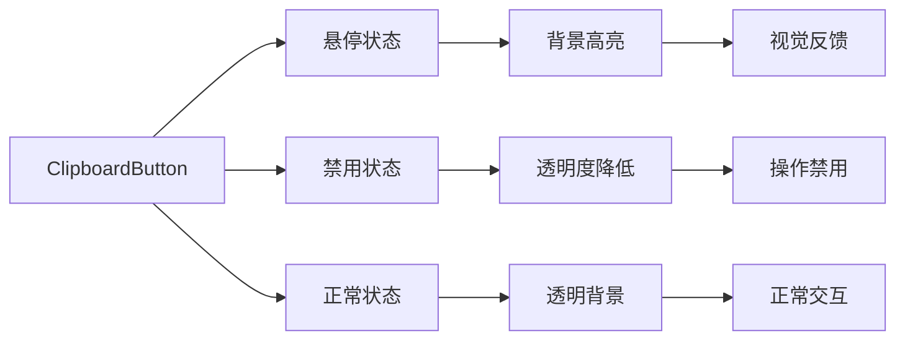

**图表来源**
- [PromptContextMenu.tsx:255-288](file://client/src/components/PromptContextMenu.tsx#L255-L288)

#### 按钮样式属性

| 样式属性 | 值 | 作用 | 用户体验影响 |
|----------|-----|------|-------------|
| display | flex | 弹性布局，确保图标居中 | 一致的视觉布局 |
| alignItems | center | 垂直居中对齐 | 视觉平衡感 |
| justifyContent | center | 水平居中对齐 | 图标完美居中 |
| flex | 1 | 等比分配空间 | 均匀的按钮宽度 |
| padding | 4px 0 | 顶部和底部内边距 | 适中的点击区域 |
| borderRadius | 4px | 圆角设计 | 现代化外观 |
| cursor | pointer | 鼠标悬停样式 | 明确的操作提示 |
| opacity | 0.35 | 禁用状态透明度 | 视觉状态指示 |

### 标签菜单项设计

**新增功能** TagMenuItem 组件提供了增强的标签交互体验：

- **星标收藏**：支持用户收藏常用标签，使用 Star 图标表示收藏状态
- **悬停效果**：鼠标悬停时显示收藏按钮和背景高亮
- **状态同步**：收藏状态与本地存储同步，确保数据持久化
- **点击插入**：支持直接点击插入标签到提示词中

#### 样式属性详解

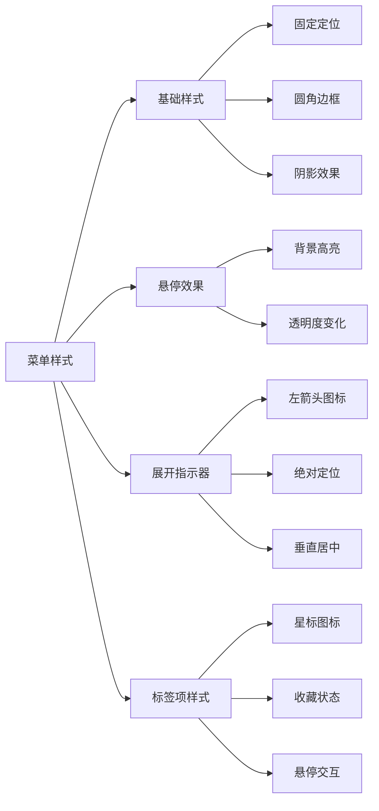

**图表来源**
- [PromptContextMenu.tsx:61-105](file://client/src/components/PromptContextMenu.tsx#L61-L105)
- [PromptContextMenu.tsx:215-247](file://client/src/components/PromptContextMenu.tsx#L215-L247)

#### 样式属性说明

| 样式属性 | 值 | 作用 | 用户体验影响 |
|----------|-----|------|-------------|
| position | fixed | 固定定位，确保菜单不会随页面滚动 | 保持菜单始终可见 |
| background | var(--color-bg) | 使用主题背景色 | 适应深色/浅色主题 |
| border | 1px solid var(--color-border) | 边框增强视觉分隔 | 提升界面层次感 |
| borderRadius | 4px | 圆角设计 | 现代化外观，柔和边缘 |
| boxShadow | 0 4px 16px rgba(0,0,0,0.18) | 阴影效果 | 增强立体感和层次 |
| padding | 4px 0 | 内边距设置 | 合适的间距，避免拥挤 |
| minWidth | 140px | 最小宽度限制 | 确保足够的点击区域 |
| maxHeight | 70vh | 最大高度限制 | 避免菜单超出屏幕 |

#### 展开指示器设计

```mermaid
flowchart TD
A[展开指示器] --> B[绝对定位]
A --> C[左箭头图标]
A --> D[垂直居中]
B --> E[left: 6px]
B --> F[top: 50%]
C --> G[ChevronLeft图标]
C --> H[size: 12px]
D --> I[transform: translateY(-50%)]
```

**图表来源**
- [PromptContextMenu.tsx:97-105](file://client/src/components/PromptContextMenu.tsx#L97-L105)

**章节来源**
- [PromptContextMenu.tsx:61-105](file://client/src/components/PromptContextMenu.tsx#L61-L105)
- [PromptContextMenu.tsx:97-105](file://client/src/components/PromptContextMenu.tsx#L97-L105)

## 本地存储管理

### 存储策略设计

**新增功能** 系统实现了完整的本地存储管理，支持以下数据持久化：

- **最近使用标签**：`promptMenu_recentTags` - 存储用户最近使用的14个标签
- **收藏标签**：`promptMenu_favoriteTags` - 存储用户收藏的所有标签
- **标签数据**：`tagData` - 用户自定义的标签库数据
- **模型收藏**：`model_favorites` - 存储用户收藏的模型信息

### 数据结构设计

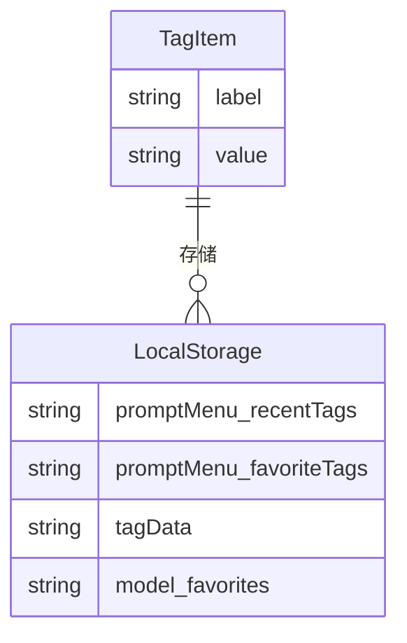

**图表来源**
- [PromptContextMenu.tsx:289-331](file://client/src/components/PromptContextMenu.tsx#L289-L331)

### 存储管理实现

#### 最近使用记录管理

- **容量限制**：最多存储14个最近使用标签，超出部分自动移除最旧的标签
- **去重机制**：相同标签不会重复添加，保持列表的唯一性
- **自动更新**：每次使用标签都会自动更新到列表顶部
- **持久化存储**：使用 localStorage 实现跨会话数据持久化

#### 收藏标签管理

- **双向切换**：支持添加和移除收藏标签
- **状态同步**：收藏状态实时更新并在菜单中反映
- **批量操作**：支持清除所有收藏记录
- **数据验证**：自动检测和修复损坏的存储数据

**章节来源**
- [PromptContextMenu.tsx:289-331](file://client/src/components/PromptContextMenu.tsx#L289-L331)

## 收藏系统设计

### 收藏功能架构

**新增功能** 收藏系统提供了完整的标签收藏管理功能：

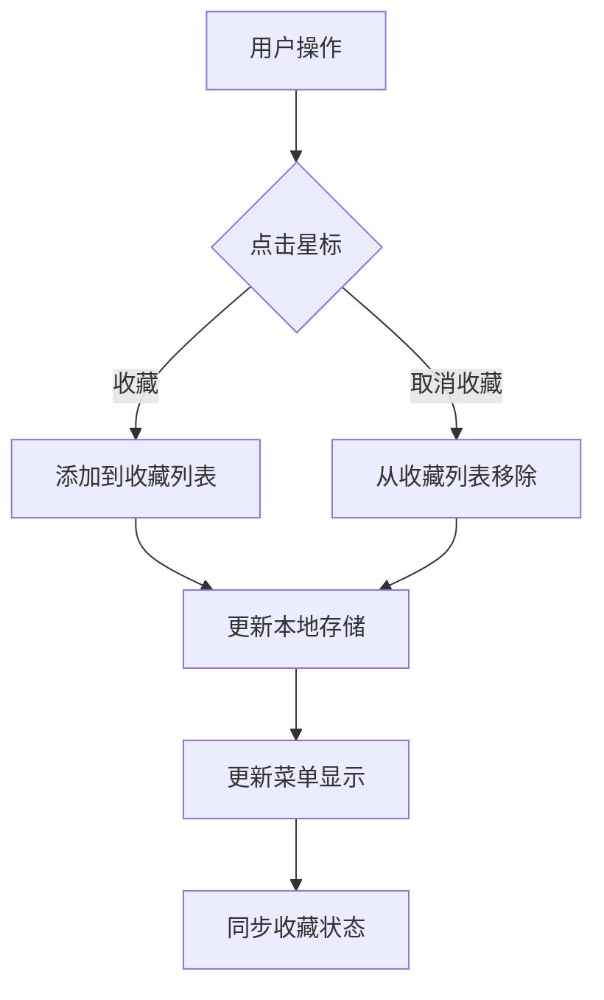

**图表来源**
- [PromptContextMenu.tsx:320-331](file://client/src/components/PromptContextMenu.tsx#L320-L331)

### 收藏状态管理

#### 状态检测机制

- **实时检测**：每次渲染时检查标签是否已被收藏
- **状态缓存**：收藏状态在组件内部缓存，避免重复计算
- **UI反馈**：收藏状态通过星标颜色和填充状态直观显示

#### 交互设计

- **点击切换**：点击星标图标切换收藏状态
- **悬停提示**：鼠标悬停时显示收藏/取消收藏的提示
- **视觉反馈**：收藏状态变化时提供即时的视觉反馈

### 菜单集成设计

#### 收藏菜单项

- **专用入口**：在标签菜单中提供专门的收藏入口
- **子菜单结构**：收藏标签以子菜单形式展示
- **操作选项**：支持收藏标签的插入和取消收藏操作
- **空状态处理**：当没有收藏标签时显示友好的提示信息

**章节来源**
- [PromptContextMenu.tsx:320-331](file://client/src/components/PromptContextMenu.tsx#L320-L331)
- [PromptContextMenu.tsx:529-561](file://client/src/components/PromptContextMenu.tsx#L529-L561)

## 依赖关系分析

### 组件间依赖关系

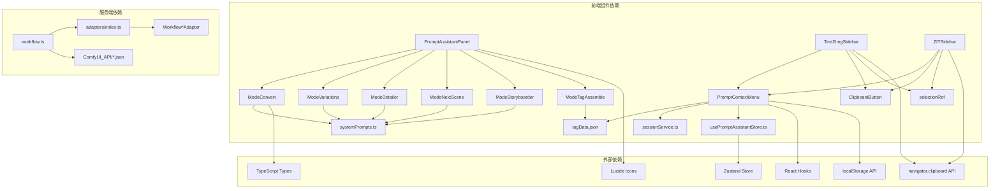

**图表来源**
- [PromptContextMenu.tsx:1-14](file://client/src/components/PromptContextMenu.tsx#L1-L14)
- [PromptAssistantPanel.tsx:2-8](file://client/src/components/PromptAssistantPanel.tsx#L2-L8)
- [workflow.ts:8-22](file://server/src/routes/workflow.ts#L8-L22)

### 数据类型定义

系统使用了统一的数据类型定义来确保前后端的一致性：

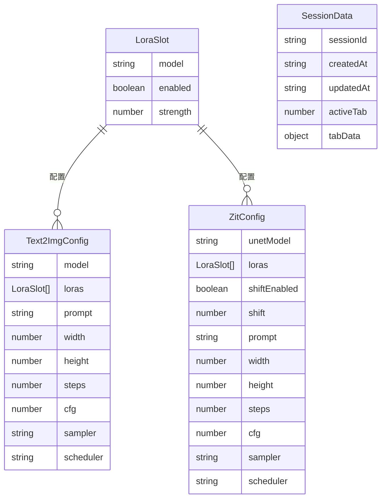

**图表来源**
- [sessionService.ts:4-73](file://client/src/services/sessionService.ts#L4-L73)

**章节来源**
- [sessionService.ts:4-73](file://client/src/services/sessionService.ts#L4-L73)

## 性能考虑

### 内存优化策略

1. **组件懒加载**：提示词上下文菜单采用条件渲染，仅在需要时创建
2. **状态缓存**：使用 useMemo 和 useCallback 优化重新渲染
3. **事件监听器清理**：组件卸载时自动移除事件监听器
4. **本地存储优化**：标签数据优先使用本地存储，减少网络请求
5. **收藏状态优化**：收藏状态在组件内部缓存，避免重复计算
6. **selectionRef 优化**：使用 useRef 避免不必要的状态更新
7. **剪贴板操作优化**：异步处理剪贴板操作，避免阻塞主线程

### 渲染性能优化

- **虚拟滚动**：对于大量标签项的场景，考虑实现虚拟滚动
- **防抖处理**：输入框变化采用防抖机制，避免频繁更新
- **CSS 变量**：使用 CSS 变量实现主题切换，避免样式重排
- **菜单项复用**：使用 React.memo 优化菜单项的重新渲染
- **剪贴板按钮优化**：使用 React.memo 包装 ClipboardButton 组件

### 文本选择性能优化

**最新更新** 新的 useRef 文本选择系统在性能方面有显著改进：

- **精确位置跟踪**：避免了基于事件的文本选择的性能损耗
- **状态最小化**：selectionRef 只存储必要的位置信息
- **事件处理优化**：onContextMenu 事件只在右键点击时触发
- **焦点管理优化**：延迟焦点设置确保 DOM 更新完成
- **剪贴板操作异步化**：避免阻塞用户界面响应

### 本地存储性能优化

- **批量存储**：收藏和最近使用数据采用批量存储，减少存储调用次数
- **数据压缩**：存储数据时进行必要的压缩和优化
- **异步处理**：存储操作采用异步方式，避免阻塞主线程
- **错误恢复**：实现存储错误的自动恢复机制

## 故障排除指南

### 常见问题及解决方案

#### 提示词上下文菜单不显示

**可能原因**：
1. 鼠标右键事件未正确绑定
2. 屏幕边界检测逻辑异常
3. 样式冲突导致菜单被隐藏
4. selectionRef 未正确初始化

**解决步骤**：
1. 检查鼠标事件监听器是否正常注册
2. 验证屏幕边界计算逻辑
3. 检查 CSS 样式冲突
4. 确认 selectionRef 的初始值设置

#### 菜单展开方向异常

**最新更新** 新的向左展开设计可能出现的问题：

**可能原因**：
1. 展开位置计算逻辑错误
2. 屏幕左侧空间不足
3. 样式覆盖冲突
4. parentRect 计算错误

**解决步骤**：
1. 检查父元素定位是否正确
2. 验证屏幕左侧空间检测逻辑
3. 确认样式优先级设置
4. 检查 parentRect 的获取方式

#### 文本选择位置错误

**新增功能** useRef 文本选择可能出现的问题：

**可能原因**：
1. selectionRef 未在正确的时机更新
2. textareaRef 未正确引用
3. 事件处理顺序问题
4. 焦点管理冲突

**解决步骤**：
1. 确认 selectionRef 在 onContextMenu 中正确更新
2. 验证 textareaRef 的引用有效性
3. 检查事件处理的执行顺序
4. 确认焦点设置的时机

#### 剪贴板操作失败

**新增功能** 剪贴板操作可能出现的问题：

**可能原因**：
1. 浏览器安全策略限制
2. navigator.clipboard API 不可用
3. 权限不足
4. 异步操作处理错误

**解决步骤**：
1. 检查浏览器对 clipboard API 的支持
2. 验证 HTTPS 环境下的权限设置
3. 确认用户手势触发的权限要求
4. 检查异步操作的错误处理

#### 智能逗号插入逻辑异常

**新增功能** 逗号插入逻辑可能出现的问题：

**可能原因**：
1. 文本分割逻辑错误
2. 逗号判断条件不正确
3. 位置计算错误
4. 焦点设置时机不当

**解决步骤**：
1. 验证 before 和 after 文本的分割逻辑
2. 检查 trim 操作的正确性
3. 确认逗号判断条件的边界情况
4. 验证 newPos 的计算准确性

#### 标签收藏功能异常

**新增功能** 收藏功能可能出现的问题：

**可能原因**：
1. localStorage 访问权限受限
2. 收藏数据格式损坏
3. 收藏状态同步失败
4. TagMenuItem 状态管理错误

**解决步骤**：
1. 检查浏览器的 localStorage 支持情况
2. 验证收藏数据的 JSON 格式
3. 检查收藏状态的更新逻辑
4. 确认 TagMenuItem 的状态传递

#### LoRA 触发词无法加载

**可能原因**：
1. 模型配置不正确
2. 触发词数据格式错误
3. 网络请求失败
4. getTriggerWords 函数返回格式错误

**解决步骤**：
1. 验证 LoRA 模型路径
2. 检查触发词数据格式
3. 确认网络连接状态
4. 验证 getTriggerWords 的返回格式

#### 提示词助理响应超时

**可能原因**：
1. ComfyUI 服务不可用
2. 系统提示词处理时间过长
3. 网络延迟过高
4. 任务队列阻塞

**解决步骤**：
1. 检查 ComfyUI 服务状态
2. 优化系统提示词处理逻辑
3. 实现超时重试机制
4. 检查任务队列的处理效率

**章节来源**
- [PromptContextMenu.tsx:195-204](file://client/src/components/PromptContextMenu.tsx#L195-L204)
- [ModeConvert.tsx:45-56](file://client/src/components/prompt-assistant/ModeConvert.tsx#L45-L56)

## 结论

提示词上下文菜单系统成功地将复杂的 AI 图像生成工作流简化为直观的用户界面。通过精心设计的组件架构和丰富的功能特性，该系统为用户提供了高效、便捷的提示词管理体验。

**最新更新** 系统现已集成了完整的智能文本选择和剪贴板操作功能，引入了 useRef 来精确跟踪选中文本的位置，并实现了智能的逗号插入逻辑。这些改进显著提升了用户的文本编辑体验和操作效率。

### 主要优势

1. **用户体验优秀**：直观的上下文菜单设计，符合用户操作习惯
2. **视觉设计统一**：最新的向左展开设计和图标系统提升了视觉一致性
3. **功能丰富完整**：涵盖提示词处理的各个方面，包括标签管理、剪贴板操作
4. **个性化支持**：新增的收藏功能和最近使用记录满足用户个性化需求
5. **性能表现良好**：通过多种优化策略确保流畅的使用体验
6. **数据持久化**：完整的本地存储管理确保用户数据的安全和可用性
7. **可扩展性强**：模块化的架构设计便于功能扩展
8. **智能文本处理**：精确的文本选择和智能逗号插入提升了编辑效率

### 技术亮点

- 智能的标签数据管理系统
- 多模式的提示词处理能力
- 与 ComfyUI 的深度集成
- 响应式的用户界面设计
- **最新更新** 优化的菜单展开方向和图标系统
- **新增功能** 完整的标签收藏和管理功能
- **新增功能** 基于 useRef 的精确文本选择系统
- **新增功能** 智能的剪贴板操作和逗号插入逻辑
- **新增功能** 基于 localStorage 的本地存储管理
- **新增功能** 用户个性化数据的持久化存储

该系统为 AI 图像生成领域提供了一个优秀的参考实现，展示了如何将复杂的技术概念转化为易用的工具。最新的功能更新进一步提升了用户体验，使其成为同类产品中的佼佼者。