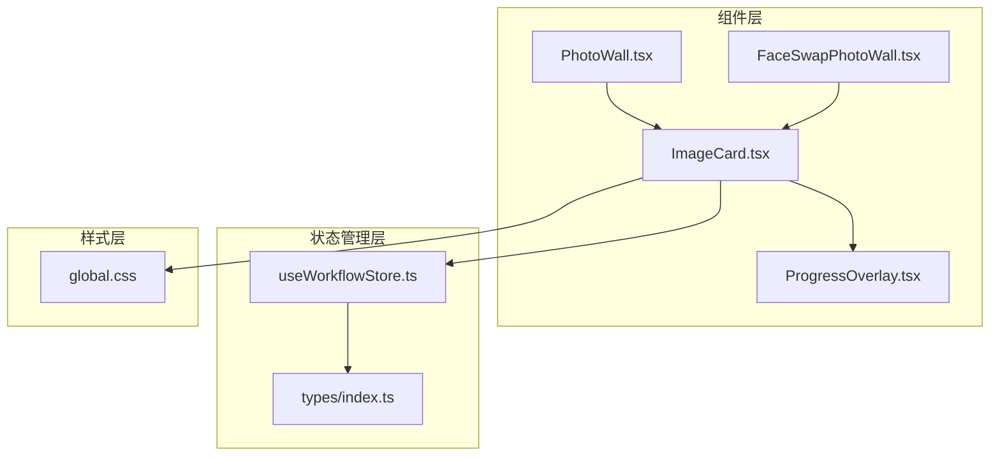
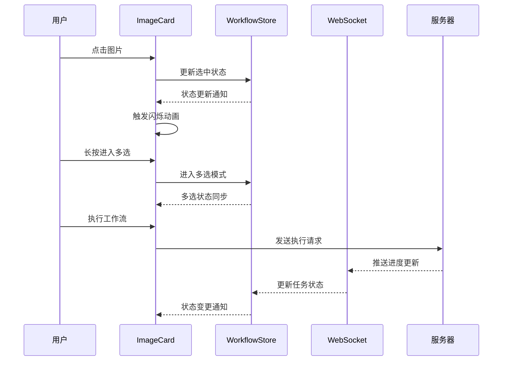
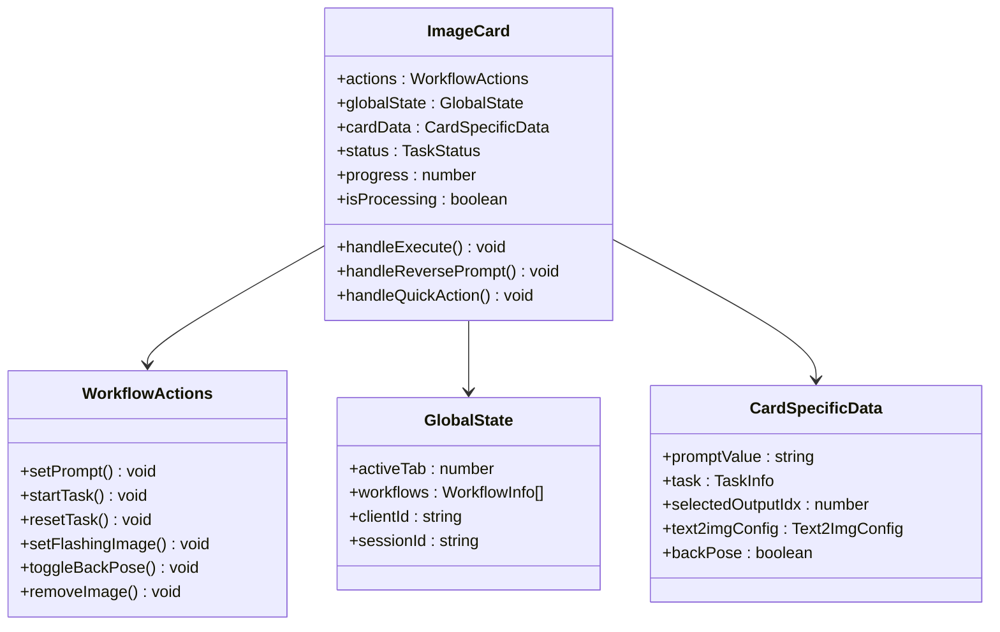
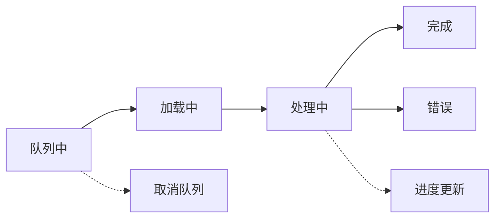
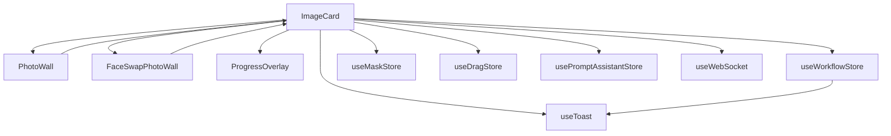

# 图片卡片组件 (ImageCard)

<cite>
**本文档引用的文件**
- [ImageCard.tsx](file://client/src/components/ImageCard.tsx)
- [PhotoWall.tsx](file://client/src/components/PhotoWall.tsx)
- [FaceSwapPhotoWall.tsx](file://client/src/components/FaceSwapPhotoWall.tsx)
- [ProgressOverlay.tsx](file://client/src/components/ProgressOverlay.tsx)
- [useWorkflowStore.ts](file://client/src/hooks/useWorkflowStore.ts)
- [index.ts](file://client/src/types/index.ts)
- [global.css](file://client/src/styles/global.css)
</cite>

## 目录
1. [简介](#简介)
2. [项目结构](#项目结构)
3. [核心组件](#核心组件)
4. [架构概览](#架构概览)
5. [详细组件分析](#详细组件分析)
6. [依赖关系分析](#依赖关系分析)
7. [性能考虑](#性能考虑)
8. [故障排除指南](#故障排除指南)
9. [结论](#结论)

## 简介

ImageCard 是 CorineKit Pix2Real 项目中的核心图片展示组件，负责处理图片卡片的渲染、状态管理和用户交互。该组件支持多种工作流模式，包括图片生成、视频处理、蒙版编辑、批量操作等功能。组件采用高性能的 React.memo 优化，结合 Zustand 状态管理，实现了流畅的用户体验。

## 项目结构

ImageCard 组件位于客户端前端代码中，与多个相关组件协同工作：

**图表来源**
- [ImageCard.tsx:1-1055](file://client/src/components/ImageCard.tsx#L1-L1055)
- [PhotoWall.tsx:1-578](file://client/src/components/PhotoWall.tsx#L1-L578)
- [FaceSwapPhotoWall.tsx:1-861](file://client/src/components/FaceSwapPhotoWall.tsx#L1-L861)

**章节来源**
- [ImageCard.tsx:1-1055](file://client/src/components/ImageCard.tsx#L1-L1055)
- [PhotoWall.tsx:1-578](file://client/src/components/PhotoWall.tsx#L1-L578)
- [FaceSwapPhotoWall.tsx:1-861](file://client/src/components/FaceSwapPhotoWall.tsx#L1-L861)

## 核心组件

ImageCard 组件具有以下核心特性：

### 主要功能模块

1. **图片展示系统**
   - 支持静态图片和视频输出
   - 动态切换原图和生成结果
   - 缩略图条目导航

2. **状态指示系统**
   - 处理进度显示
   - 错误状态标记
   - 加载状态指示

3. **交互控制系统**
   - 单击选择模式
   - 长按进入多选
   - 拖拽操作支持
   - 快捷操作按钮

4. **视觉反馈机制**
   - 闪烁效果动画
   - 悬停状态变化
   - 选中状态指示
   - 进度条显示

**章节来源**
- [ImageCard.tsx:17-40](file://client/src/components/ImageCard.tsx#L17-L40)
- [ImageCard.tsx:42-88](file://client/src/components/ImageCard.tsx#L42-L88)

## 架构概览

ImageCard 采用分层架构设计，通过 Zustand 实现高效的状态管理：

**图表来源**
- [ImageCard.tsx:164-241](file://client/src/components/ImageCard.tsx#L164-L241)
- [useWorkflowStore.ts:96-200](file://client/src/hooks/useWorkflowStore.ts#L96-L200)

## 详细组件分析

### 组件属性配置

ImageCard 接受以下关键属性：

| 属性名 | 类型 | 必需 | 描述 |
|--------|------|------|------|
| image | ImageItem | 是 | 图片数据对象 |
| isMultiSelectMode | boolean | 是 | 是否处于多选模式 |
| isSelected | boolean | 是 | 当前卡片是否被选中 |
| isFlashing | boolean | 否 | 是否显示闪烁效果 |
| hidePlayButton | boolean | 否 | 是否隐藏播放按钮 |
| onLongPress | Function | 是 | 长按回调函数 |
| onToggleSelect | Function | 是 | 切换选中状态回调 |

### 状态管理系统

组件通过三个层级的状态订阅实现高效更新：

**图表来源**
- [ImageCard.tsx:46-88](file://client/src/components/ImageCard.tsx#L46-L88)
- [useWorkflowStore.ts:35-88](file://client/src/hooks/useWorkflowStore.ts#L35-L88)

### 交互行为详解

#### 点击选择机制

**图表来源**
- [ImageCard.tsx:171-215](file://client/src/components/ImageCard.tsx#L171-L215)

#### 长按进入多选

长按检测机制确保准确识别用户意图：

- **触发条件**: 鼠标左键按下持续600毫秒
- **防误触**: 避免在输入框内触发长按
- **状态同步**: 通过 `enterMultiSelect` 函数进入多选模式

#### 闪烁效果实现

闪烁动画用于突出显示特定图片：

- **触发时机**: 通过 `setFlashingImage` 设置闪烁状态
- **动画时长**: 4个周期，总时长约0.35秒
- **视觉效果**: 边框闪烁，增强用户注意力

### 视觉反馈系统

#### 状态指示器

组件提供多层次的状态可视化：

1. **进度覆盖层**: 显示处理进度百分比
2. **错误徽章**: 红色错误图标标识异常状态
3. **蒙版指示**: 绿色图层图标显示蒙版存在
4. **选中状态**: 右上角对勾标记当前选中项

#### 进度条系统

**图表来源**
- [ProgressOverlay.tsx:9-101](file://client/src/components/ProgressOverlay.tsx#L9-L101)

### 任务状态管理

组件支持多种工作流状态：

| 状态 | 描述 | 视觉表现 | 用户操作 |
|------|------|----------|----------|
| idle | 空闲状态 | 正常显示 | 可执行工作流 |
| uploading | 上传中 | 加载动画 | 禁用操作 |
| queued | 排队中 | 队列指示 | 可取消 |
| processing | 处理中 | 进度条 | 禁用操作 |
| done | 完成 | 结果预览 | 可重新生成 |
| error | 错误状态 | 红色徽章 | 查看错误详情 |

**章节来源**
- [ImageCard.tsx:101-107](file://client/src/components/ImageCard.tsx#L101-L107)
- [index.ts:17-25](file://client/src/types/index.ts#L17-L25)

## 依赖关系分析

### 组件间依赖

**图表来源**
- [ImageCard.tsx:1-15](file://client/src/components/ImageCard.tsx#L1-L15)
- [PhotoWall.tsx:1-9](file://client/src/components/PhotoWall.tsx#L1-L9)

### 状态管理依赖

组件通过 Zustand 实现状态分离：

1. **动作层**: 稳定不变的操作函数
2. **全局状态层**: 影响所有卡片的共享状态
3. **卡片数据层**: 仅影响当前卡片的数据

这种设计确保了：
- 最小化重渲染次数
- 高效的状态更新
- 清晰的职责分离

**章节来源**
- [ImageCard.tsx:43-83](file://client/src/components/ImageCard.tsx#L43-L83)
- [useWorkflowStore.ts:96-200](file://client/src/hooks/useWorkflowStore.ts#L96-L200)

## 性能考虑

### 渲染优化

1. **React.memo 优化**: 使用自定义比较函数避免不必要的重渲染
2. **懒加载**: 图片使用 `loading="lazy"` 属性
3. **虚拟滚动**: 在 PhotoWall 中实现 IntersectionObserver 懒渲染

### 内存管理

1. **定时器清理**: 长按检测使用 `setTimeout` 和清理逻辑
2. **事件监听**: 组件卸载时自动清理事件处理器
3. **资源释放**: 视频元素在离开悬停状态时暂停播放

### 动画性能

1. **GPU 加速**: 使用 `transform` 和 `opacity` 属性
2. **CSS 动画**: 优先使用 CSS 动画而非 JavaScript
3. **动画节流**: 控制动画频率避免过度重绘

## 故障排除指南

### 常见问题及解决方案

#### 图片无法显示

**症状**: 卡片显示空白或加载失败
**可能原因**:
- 图片 URL 无效
- 文件格式不支持
- 网络连接问题

**解决方法**:
1. 检查图片文件完整性
2. 验证 URL 可访问性
3. 确认网络连接稳定

#### 交互无响应

**症状**: 点击、拖拽等操作无效
**可能原因**:
- 处理中状态禁用了交互
- 浏览器兼容性问题
- 事件冒泡被阻止

**解决方法**:
1. 等待当前操作完成
2. 尝试刷新页面
3. 检查浏览器控制台错误

#### 状态不同步

**症状**: UI 状态与实际状态不符
**可能原因**:
- WebSocket 连接断开
- 状态更新延迟
- 多标签页状态冲突

**解决方法**:
1. 重新连接 WebSocket
2. 刷新页面同步状态
3. 关闭其他标签页实例

**章节来源**
- [ImageCard.tsx:164-241](file://client/src/components/ImageCard.tsx#L164-L241)
- [useWorkflowStore.ts:67-75](file://client/src/hooks/useWorkflowStore.ts#L67-L75)

## 结论

ImageCard 组件是一个功能完整、性能优化的图片展示组件。它通过精心设计的状态管理、高效的渲染策略和丰富的交互功能，为用户提供流畅的图片处理体验。组件的模块化设计和清晰的职责分离，使其易于维护和扩展。

主要优势包括：
- **高性能**: 通过 React.memo 和 Zustand 优化渲染
- **丰富功能**: 支持多种工作流和交互模式
- **良好体验**: 流畅的动画和即时的视觉反馈
- **易于使用**: 直观的 API 设计和灵活的配置选项

未来可以考虑的功能增强：
- 更多的快捷操作选项
- 自定义主题支持
- 更详细的错误处理和恢复机制
- 支持更多媒体格式