# 图片卡片组件 (ImageCard)

<cite>
**本文档引用的文件**
- [ImageCard.tsx](file://client/src/components/ImageCard.tsx)
- [PhotoWall.tsx](file://client/src/components/PhotoWall.tsx)
- [FaceSwapPhotoWall.tsx](file://client/src/components/FaceSwapPhotoWall.tsx)
- [ProgressOverlay.tsx](file://client/src/components/ProgressOverlay.tsx)
- [useWorkflowStore.ts](file://client/src/hooks/useWorkflowStore.ts)
- [QueuePanel.tsx](file://client/src/components/QueuePanel.tsx)
- [index.ts](file://client/src/types/index.ts)
- [global.css](file://client/src/styles/global.css)
- [Workflow9Adapter.ts](file://server/src/adapters/Workflow9Adapter.ts)
- [sessionService.ts](file://client/src/services/sessionService.ts)
- [index.ts](file://server/src/index.ts)
- [useVideoFps.ts](file://client/src/hooks/useVideoFps.ts)
- [VideoGenSidebar.tsx](file://client/src/components/VideoGenSidebar.tsx)
- [FrameInterpSidebar.tsx](file://client/src/components/FrameInterpSidebar.tsx)
</cite>

## 更新摘要
**变更内容**
- 新增视频支持功能：增强视频预览、缩略图生成、视频元素渲染
- 新增内联重命名功能：支持卡片标题的直接编辑和重命名
- 新增视频工作流支持：Tab3（视频生成）和Tab4（视频补帧）工作流集成
- 新增视频帧率检测：使用 requestVideoFrameCallback API 检测视频帧率
- 新增视频参数配置：视频生成和补帧的参数配置界面
- 新增视频缩略图支持：视频输入的缩略图显示和切换

## 目录
1. [简介](#简介)
2. [项目结构](#项目结构)
3. [核心组件](#核心组件)
4. [架构概览](#架构概览)
5. [详细组件分析](#详细组件分析)
6. [依赖关系分析](#依赖关系分析)
7. [性能考虑](#性能考虑)
8. [故障排除指南](#故障排除指南)
9. [结论](#结论)

## 简介

ImageCard 是 CorineKit Pix2Real 项目中的核心图片展示组件，负责处理图片卡片的渲染、状态管理和用户交互。该组件支持多种工作流模式，包括图片生成、视频处理、蒙版编辑、批量操作等功能。组件采用高性能的 React.memo 优化，结合 Zustand 状态管理，实现了流畅的用户体验。

**更新** 组件现已全面支持视频功能，包括视频预览、缩略图生成、视频元素渲染和内联重命名功能。新增的视频工作流支持 Tab3（视频生成）和 Tab4（视频补帧），提供完整的视频处理能力。组件还集成了视频帧率检测功能，能够准确显示视频的原始帧率和补帧后的目标帧率。

## 项目结构

ImageCard 组件位于客户端前端代码中，与多个相关组件协同工作，现在还包括视频处理相关的组件：

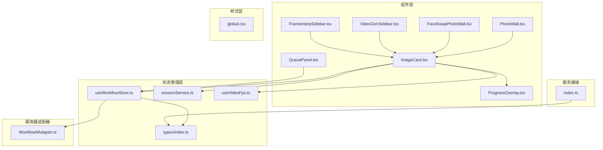

**图表来源**
- [ImageCard.tsx:1-1710](file://client/src/components/ImageCard.tsx#L1-L1710)
- [PhotoWall.tsx:1-578](file://client/src/components/PhotoWall.tsx#L1-L578)
- [FaceSwapPhotoWall.tsx:1-861](file://client/src/components/FaceSwapPhotoWall.tsx#L1-L861)
- [QueuePanel.tsx:1-308](file://client/src/components/QueuePanel.tsx#L1-L308)
- [Workflow9Adapter.ts:1-14](file://server/src/adapters/Workflow9Adapter.ts#L1-L14)
- [index.ts:173-273](file://server/src/index.ts#L173-L273)
- [useVideoFps.ts:1-77](file://client/src/hooks/useVideoFps.ts#L1-L77)
- [VideoGenSidebar.tsx:1-154](file://client/src/components/VideoGenSidebar.tsx#L1-L154)
- [FrameInterpSidebar.tsx:1-122](file://client/src/components/FrameInterpSidebar.tsx#L1-L122)

## 核心组件

ImageCard 组件具有以下核心特性：

### 主要功能模块

1. **图片展示系统**
   - 支持静态图片和视频输出
   - 动态切换原图和生成结果
   - 缩略图条目导航
   - **新增** 视频预览和播放控制
   - **新增** 视频缩略图生成和显示
   - **新增** 视频帧率检测和显示

2. **视频工作流支持**
   - **新增** Tab3 视频生成工作流
   - **新增** Tab4 视频补帧工作流
   - **新增** 视频参数配置界面
   - **新增** 视频帧率检测功能
   - **新增** 补帧倍率计算显示

3. **内联重命名功能**
   - **新增** 卡片标题的直接编辑
   - **新增** 输入验证和错误处理
   - **新增** 会话级重命名服务集成
   - **新增** 批量重命名支持

4. **交互控制系统**
   - 单击选择模式
   - 长按进入多选
   - 拖拽操作支持
   - 快捷操作按钮
   - **扩展** Tab9 提示词复制功能

5. **视觉反馈机制**
   - 闪烁效果动画
   - 悬停状态变化
   - 选中状态指示
   - **更新** 阶段化进度条显示
   - **增强** Tab9 处理状态检测
   - **新增** 视频播放状态指示

### 工作流支持矩阵

| 工作流 | Tab3 (视频生成) | Tab4 (视频补帧) | Tab7 (快速出图) | Tab9 (ZIT快出) | 特殊功能 |
|--------|----------------|----------------|----------------|----------------|----------|
| 图片生成 | ❌ 不适用 | ❌ 不适用 | ✅ 支持 | ✅ 支持 | 提示词复制 |
| 视频处理 | ✅ 支持 | ✅ 支持 | ❌ 不适用 | ❌ 不适用 | 视频参数配置 |
| 蒙版编辑 | ⚠️ 部分支持 | ⚠️ 部分支持 | ⚠️ 部分支持 | ⚠️ 部分支持 | - |
| 批量操作 | ✅ 支持 | ✅ 支持 | ✅ 支持 | ✅ 支持 | - |
| 提示词复制 | ✅ 支持 | ✅ 支持 | ✅ 支持 | ✅ 支持 | ✅ 共享功能 |
| **阶段化进度** | ❌ 不适用 | ❌ 不适用 | ❌ 不适用 | ✅ 支持 | **新增功能** |
| **视频预览** | ✅ 支持 | ✅ 支持 | ❌ 不适用 | ❌ 不适用 | **新增功能** |
| **内联重命名** | ❌ 不适用 | ❌ 不适用 | ✅ 支持 | ✅ 支持 | **新增功能** |

**更新** 现在支持完整的视频工作流，包括视频生成和视频补帧功能，以及视频预览和帧率检测能力。

## 架构概览

ImageCard 采用分层架构设计，通过 Zustand 实现高效的状态管理，并集成了新的视频处理系统：

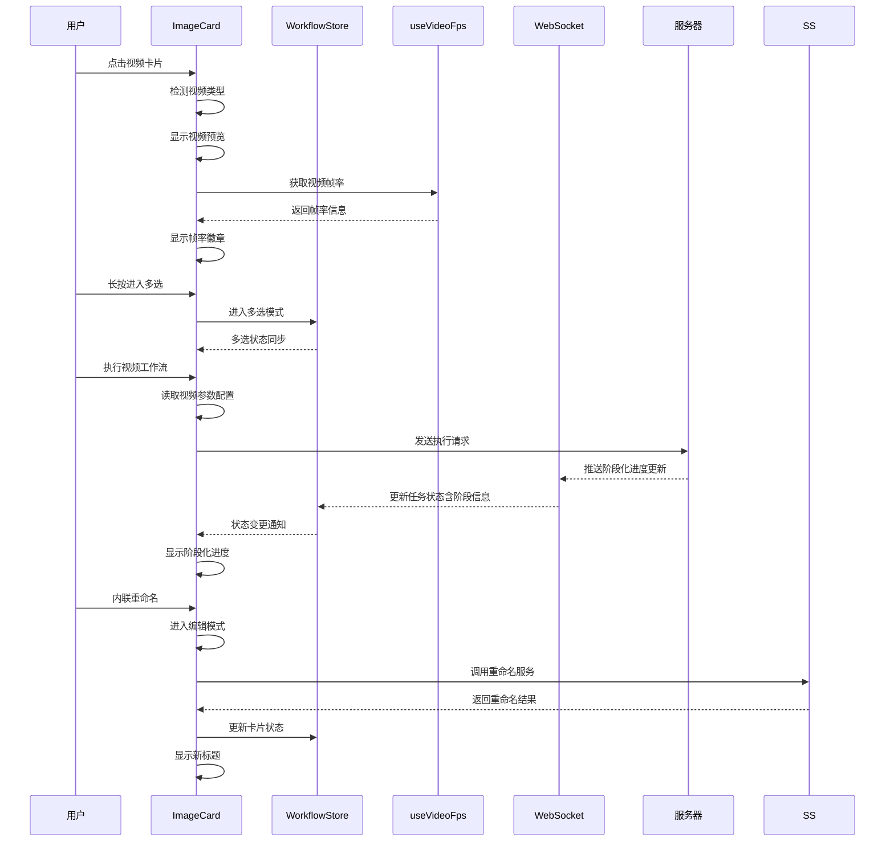

**图表来源**
- [ImageCard.tsx:257-268](file://client/src/components/ImageCard.tsx#L257-L268)
- [useWorkflowStore.ts:257-288](file://client/src/hooks/useWorkflowStore.ts#L257-L288)
- [useVideoFps.ts:8-77](file://client/src/hooks/useVideoFps.ts#L8-L77)
- [sessionService.ts:174-196](file://client/src/services/sessionService.ts#L174-L196)
- [index.ts:173-273](file://server/src/index.ts#L173-L273)

## 详细组件分析

### 组件属性配置

ImageCard 接受以下关键属性：

| 属性名 | 类型 | 必需 | 描述 |
|--------|------|------|------|
| image | ImageItem | 是 | 图片数据对象 |
| isMultiSelectMode | boolean | 是 | 是否处于多选模式 |
| isSelected | boolean | 是 | 当前卡片是否被选中 |
| isFlashing | boolean | 否 | 是否显示闪烁效果 |
| hidePlayButton | boolean | 否 | 是否隐藏播放按钮 |
| onLongPress | Function | 是 | 长按回调函数 |
| onToggleSelect | Function | 是 | 切换选中状态回调 |

### 状态管理系统

组件通过三个层级的状态订阅实现高效更新：

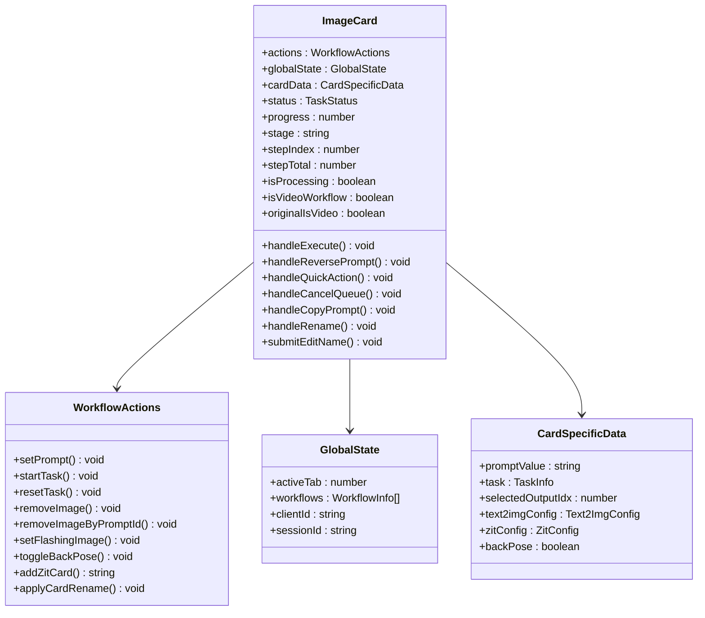

**图表来源**
- [ImageCard.tsx:46-88](file://client/src/components/ImageCard.tsx#L46-L88)
- [useWorkflowStore.ts:36-90](file://client/src/hooks/useWorkflowStore.ts#L36-L90)

### 视频支持系统

**新增** 组件现在全面支持视频处理功能：

#### 视频检测和预览

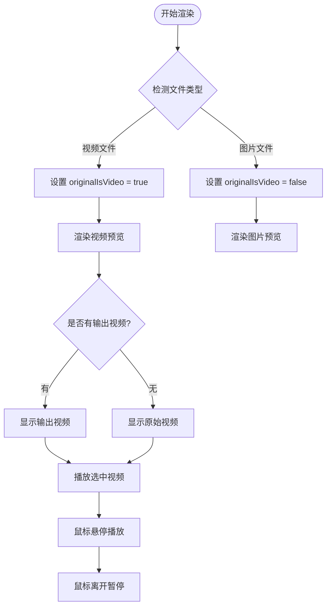

**图表来源**
- [ImageCard.tsx:226-243](file://client/src/components/ImageCard.tsx#L226-L243)
- [ImageCard.tsx:671-731](file://client/src/components/ImageCard.tsx#L671-L731)

#### 视频参数配置

**新增** 视频工作流支持参数配置：

1. **视频生成参数** (Tab3):
   - 质量设置：草稿(0.5)、中等(0.8)、原图(1.0)
   - 时长设置：4s、6s、8s
   - 帧率设置：草稿(12fps)、流畅(16fps)、精细(24fps)

2. **视频补帧参数** (Tab4):
   - 补帧倍率：2x、4x、6x

#### 视频帧率检测

**新增** 使用 requestVideoFrameCallback API 进行精确的视频帧率检测：

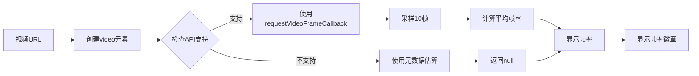

**图表来源**
- [useVideoFps.ts:8-77](file://client/src/hooks/useVideoFps.ts#L8-L77)
- [ImageCard.tsx:237-243](file://client/src/components/ImageCard.tsx#L237-L243)

### 内联重命名功能

**新增** 支持卡片标题的直接编辑和重命名：

#### 重命名流程

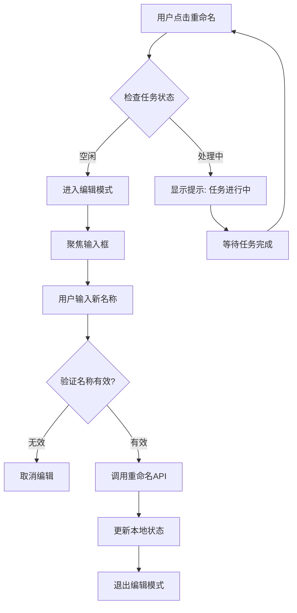

**图表来源**
- [ImageCard.tsx:175-214](file://client/src/components/ImageCard.tsx#L175-L214)
- [sessionService.ts:174-196](file://client/src/services/sessionService.ts#L174-L196)

#### 重命名服务集成

**新增** 与 sessionService 的深度集成：

1. **单张重命名**: `renameCard(sessionId, tabId, imageId, newLabel)`
2. **批量重命名**: `renameCardsBatch(sessionId, tabId, items[])`
3. **状态更新**: `applyCardRename(activeTab, imageId, result)`

### 交互行为详解

#### 点击选择机制

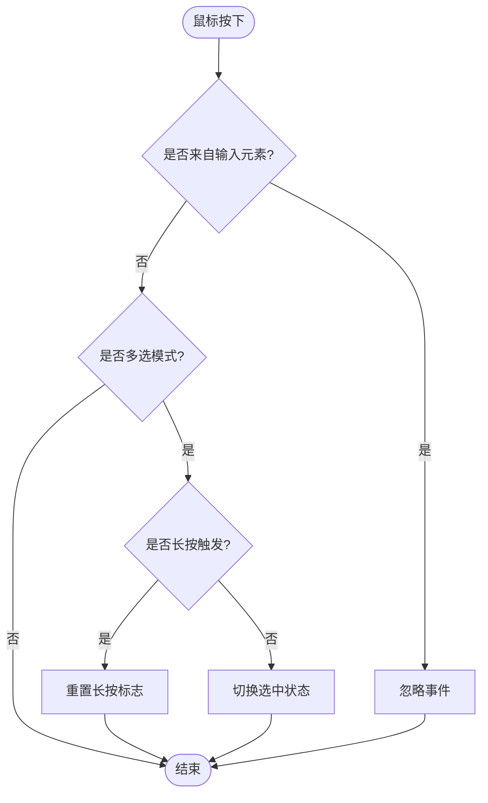

**图表来源**
- [ImageCard.tsx:171-215](file://client/src/components/ImageCard.tsx#L171-L215)

#### 长按进入多选

长按检测机制确保准确识别用户意图：

- **触发条件**: 鼠标左键按下持续600毫秒
- **防误触**: 避免在输入框内触发长按
- **状态同步**: 通过 `enterMultiSelect` 函数进入多选模式

#### 任务取消机制

**更新** 任务取消机制现已重构，提供两种不同的移除策略：

1. **按卡片 ID 移除** (`removeImage`):
   - 直接通过图片 ID 完全移除卡片
   - 适用于用户主动取消当前卡片的任务
   - 确保卡片从界面和状态管理中完全消失

2. **按任务 ID 移除** (`removeImageByPromptId`):
   - 通过任务的 promptId 查找并移除对应卡片
   - 适用于队列面板中的批量取消操作
   - 自动处理任务映射关系

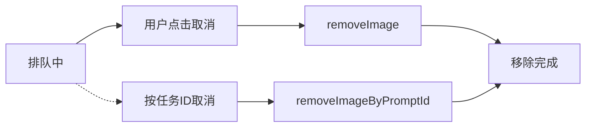

**图表来源**
- [ImageCard.tsx:257-268](file://client/src/components/ImageCard.tsx#L257-L268)
- [QueuePanel.tsx:119-123](file://client/src/components/QueuePanel.tsx#L119-L123)

#### 闪烁效果实现

闪烁动画用于突出显示特定图片：

- **触发时机**: 通过 `setFlashingImage` 设置闪烁状态
- **动画时长**: 4个周期，总时长约0.35秒
- **视觉效果**: 边框闪烁，增强用户注意力

#### 复制提示词功能

**更新** 复制提示词功能现已扩展到 Tab7 和 Tab9 工作流：

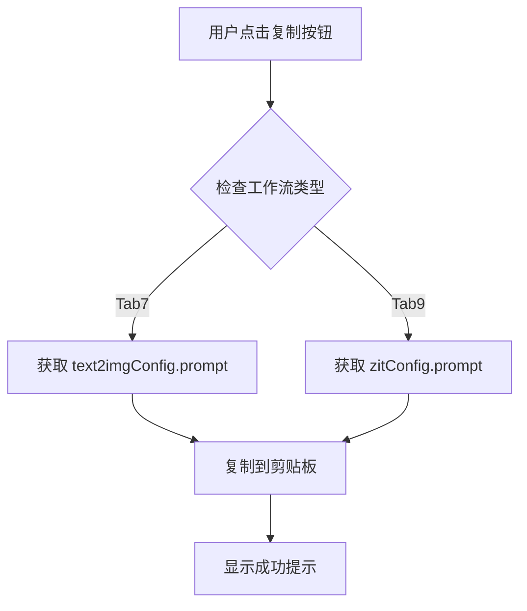

**图表来源**
- [ImageCard.tsx:1047-1079](file://client/src/components/ImageCard.tsx#L1047-L1079)

### 视觉反馈系统

#### 状态指示器

组件提供多层次的状态可视化：

1. **进度覆盖层**: 显示处理进度百分比
2. ****新增** 阶段化进度覆盖层**: 显示当前工作流阶段和步骤信息
3. **错误徽章**: 红色错误图标标识异常状态
4. **蒙版指示**: 绿色图层图标显示蒙版存在
5. **选中状态**: 右上角对勾标记当前选中项
6. **Tab9 特殊状态**: 处理中骨架屏显示
7. **视频帧率徽章**: 显示视频原始帧率和补帧后帧率
8. **视频播放状态**: 视频元素的播放控制和状态指示

**更新** 现在支持阶段化进度显示，为用户提供更精确的工作流状态信息。

#### 阶段化进度条系统

**新增** 阶段化进度条提供了工作流阶段的详细信息：

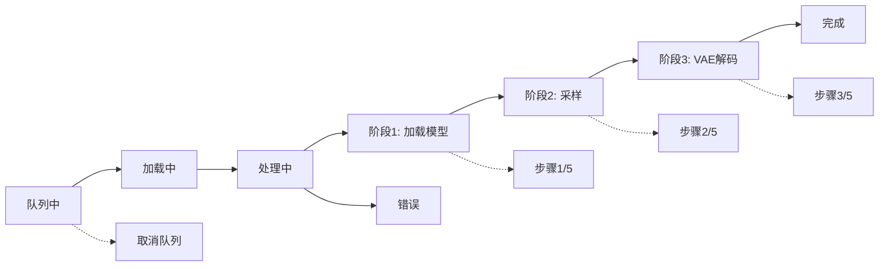

**图表来源**
- [ProgressOverlay.tsx:9-101](file://client/src/components/ProgressOverlay.tsx#L9-L101)
- [index.ts:173-273](file://server/src/index.ts#L173-L273)

### 任务状态管理

组件支持多种工作流状态：

| 状态 | 描述 | 视觉表现 | 用户操作 |
|------|------|----------|----------|
| idle | 空闲状态 | 正常显示 | 可执行工作流 |
| uploading | 上传中 | 加载动画 | 禁用操作 |
| queued | 排队中 | 队列指示 | 可取消 |
| processing | 处理中 | **新增** 阶段化进度条 | 禁用操作 |
| done | 完成 | 结果预览 | 可重新生成 |
| error | 错误状态 | 红色徽章 | 查看错误详情 |

**更新** 处理中状态现在包含阶段化进度信息，提供更精确的工作流状态反馈。

## 依赖关系分析

### 组件间依赖

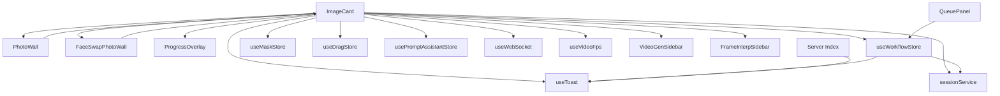

**图表来源**
- [ImageCard.tsx:1-15](file://client/src/components/ImageCard.tsx#L1-L15)
- [PhotoWall.tsx:1-9](file://client/src/components/PhotoWall.tsx#L1-L9)
- [QueuePanel.tsx:1-36](file://client/src/components/QueuePanel.tsx#L1-L36)
- [index.ts:173-273](file://server/src/index.ts#L173-L273)
- [useVideoFps.ts:1-77](file://client/src/hooks/useVideoFps.ts#L1-L77)
- [VideoGenSidebar.tsx:1-154](file://client/src/components/VideoGenSidebar.tsx#L1-L154)
- [FrameInterpSidebar.tsx:1-122](file://client/src/components/FrameInterpSidebar.tsx#L1-L122)

### 状态管理依赖

组件通过 Zustand 实现状态分离：

1. **动作层**: 稳定不变的操作函数
2. **全局状态层**: 影响所有卡片的共享状态
3. **卡片数据层**: 仅影响当前卡片的数据

**更新** 状态管理现在包含两种移除方法：
- `removeImage`: 直接移除指定 ID 的卡片
- `removeImageByPromptId`: 通过任务 ID 查找并移除卡片

**更新** 新增了对 ZIT 配置的支持，包括 `addZitCard` 方法用于创建 Tab9 卡片。

**更新** 任务状态现在包含阶段化信息：
- `stage`: 当前工作流阶段名称
- `stepIndex`: 当前步骤索引（1-based）
- `stepTotal`: 总步骤数

**更新** 新增了视频相关的状态管理：
- `isVideoWorkflow`: 当前工作流是否为视频工作流
- `originalIsVideo`: 原始输入是否为视频
- `videoRef`: 视频元素的引用

**更新** 新增了内联重命名功能：
- `isEditingName`: 是否处于编辑模式
- `editingNameValue`: 当前编辑的名称值
- `handleRename`: 重命名处理函数

这种设计确保了：
- 最小化重渲染次数
- 高效的状态更新
- 清晰的职责分离
- 完整的卡片移除机制
- **新增** 阶段化进度信息支持
- **新增** Tab9 工作流支持
- **新增** 视频工作流支持
- **新增** 内联重命名功能
- **新增** 视频帧率检测能力

**图表来源**
- [ImageCard.tsx:43-83](file://client/src/components/ImageCard.tsx#L43-L83)
- [useWorkflowStore.ts:96-200](file://client/src/hooks/useWorkflowStore.ts#L96-L200)
- [index.ts:173-273](file://server/src/index.ts#L173-L273)

## 性能考虑

### 渲染优化

1. **React.memo 优化**: 使用自定义比较函数避免不必要的重渲染
2. **懒加载**: 图片使用 `loading="lazy"` 属性
3. **虚拟滚动**: 在 PhotoWall 中实现 IntersectionObserver 懒渲染
4. **Tab9 专用优化**: 处理中状态使用骨架屏替代实际图片
5. ****新增** 阶段化进度优化**: 仅在处理中状态显示阶段信息，避免不必要的重渲染
6. ****新增** 视频渲染优化**: 视频元素按需挂载和卸载，避免不必要的播放
7. ****新增** 帧率检测优化**: 使用 requestVideoFrameCallback API，避免阻塞主线程

### 内存管理

1. **定时器清理**: 长按检测使用 `setTimeout` 和清理逻辑
2. **事件监听**: 组件卸载时自动清理事件处理器
3. **资源释放**: 视频元素在离开悬停状态时暂停播放
4. **URL 对象释放**: 通过 `URL.revokeObjectURL` 释放预览 URL
5. **Tab9 资源管理**: 处理中状态自动释放图片资源
6. ****新增** 视频资源管理**: 视频元素在不需要时自动释放
7. ****新增** 帧率检测资源管理**: 自动清理视频元素和事件监听器

### 动画性能

1. **GPU 加速**: 使用 `transform` 和 `opacity` 属性
2. **CSS 动画**: 优先使用 CSS 动画而非 JavaScript
3. **动画节流**: 控制动画频率避免过度重绘

**更新** Tab9 工作流的骨架屏显示优化了内存使用，避免了大图片的加载。

**更新** 视频工作流的视频元素按需渲染，减少了不必要的资源占用。

## 故障排除指南

### 常见问题及解决方案

#### 图片无法显示

**症状**: 卡片显示空白或加载失败
**可能原因**:
- 图片 URL 无效
- 文件格式不支持
- 网络连接问题
- **新增** Tab9 处理中状态下的骨架屏问题
- **新增** 视频文件加载失败

**解决方法**:
1. 检查图片文件完整性
2. 验证 URL 可访问性
3. 确认网络连接稳定
4. **新增** 等待 Tab9 处理完成或检查错误状态
5. **新增** 检查视频文件格式和编码支持

#### 交互无响应

**症状**: 点击、拖拽等操作无效
**可能原因**:
- 处理中状态禁用了交互
- 浏览器兼容性问题
- 事件冒泡被阻止
- **新增** Tab9 提示词复制功能异常
- **新增** 视频播放控制失效

**解决方法**:
1. 等待当前操作完成
2. 尝试刷新页面
3. 检查浏览器控制台错误
4. **新增** 确认 Tab9 提示词配置正确
5. **新增** 检查视频播放权限和浏览器支持

#### 状态不同步

**症状**: UI 状态与实际状态不符
**可能原因**:
- WebSocket 连接断开
- 状态更新延迟
- 多标签页状态冲突
- **新增** Tab9 状态检测问题
- **新增** 阶段化进度信息不同步
- **新增** 视频帧率检测异常

**解决方法**:
1. 重新连接 WebSocket
2. 刷新页面同步状态
3. 关闭其他标签页实例
4. **新增** 检查 Tab9 适配器配置
5. **新增** 验证服务器端进度计算
6. **新增** 检查浏览器对 requestVideoFrameCallback 的支持

#### 任务取消后卡片仍然显示

**症状**: 点击取消按钮后卡片仍显示在界面上
**可能原因**:
- 旧版本的 resetTask 方法未完全移除卡片
- 状态更新延迟
- **新增** Tab9 卡片移除机制问题
- **新增** 阶段化进度状态未正确清理
- **新增** 视频工作流状态未正确清理

**解决方法**:
1. 确认使用的是最新版本的 removeImage 方法
2. 检查网络请求是否成功
3. 刷新页面确认状态同步
4. **新增** 检查 Tab9 卡片的 zitConfig 配置
5. **新增** 验证阶段化进度状态清理
6. **新增** 检查视频工作流状态清理

#### 复制提示词失败

**症状**: 点击复制按钮后没有反应或显示失败
**可能原因**:
- Tab7 或 Tab9 的提示词配置为空
- 浏览器剪贴板权限问题
- **新增** Tab9 提示词格式问题
- **新增** 视频工作流提示词获取失败

**解决方法**:
1. 确认工作流配置中包含有效的提示词
2. 检查浏览器剪贴板权限设置
3. **新增** 验证 Tab9 提示词格式正确性
4. **新增** 检查视频工作流的配置状态
5. 查看控制台错误信息

#### 阶段化进度显示异常

**症状**: 阶段化进度条不显示或显示错误
**可能原因**:
- 服务器端进度计算异常
- 客户端状态更新延迟
- WebSocket 连接问题
- **新增** 阶段信息格式不匹配
- **新增** 视频工作流进度计算异常

**解决方法**:
1. 检查服务器端进度计算逻辑
2. 验证 WebSocket 连接状态
3. 确认阶段信息格式正确
4. **新增** 检查视频工作流的进度计算
5. **新增** 验证视频工作流的阶段信息

#### 内联重命名失败

**症状**: 点击重命名按钮后无法编辑或重命名失败
**可能原因**:
- 会话 ID 不存在或无效
- 任务正在进行中
- 重命名服务调用失败
- **新增** 重命名规则验证失败
- **新增** 批量重命名冲突

**解决方法**:
1. 确认会话已正确初始化
2. 等待当前任务完成后重试
3. 检查网络连接和服务器状态
4. **新增** 验证重命名规则（不允许空值、特殊字符等）
5. **新增** 检查批量重命名时是否存在名称冲突

#### 视频播放问题

**症状**: 视频无法播放或播放异常
**可能原因**:
- 视频格式不受支持
- 浏览器兼容性问题
- 视频文件损坏
- **新增** 视频帧率检测失败
- **新增** 视频元素状态管理异常

**解决方法**:
1. 检查视频文件格式和编码
2. 尝试在不同浏览器中打开
3. 验证视频文件完整性
4. **新增** 检查浏览器对 requestVideoFrameCallback 的支持
5. **新增** 确认视频元素的生命周期管理正确

#### 视频帧率检测异常

**症状**: 视频帧率徽章不显示或显示错误
**可能原因**:
- 浏览器不支持 requestVideoFrameCallback API
- 视频文件元数据不完整
- 帧率检测逻辑异常
- **新增** 视频URL无效或不可访问

**解决方法**:
1. 检查浏览器版本和API支持情况
2. 验证视频文件的元数据完整性
3. 查看控制台中的错误信息
4. **新增** 确认视频URL的有效性和可访问性
5. **新增** 检查视频文件的编码格式

**章节来源**
- [ImageCard.tsx:164-241](file://client/src/components/ImageCard.tsx#L164-L241)
- [useWorkflowStore.ts:67-75](file://client/src/hooks/useWorkflowStore.ts#L67-L75)
- [ProgressOverlay.tsx:12-125](file://client/src/components/ProgressOverlay.tsx#L12-L125)
- [index.ts:173-273](file://server/src/index.ts#L173-L273)
- [useVideoFps.ts:8-77](file://client/src/hooks/useVideoFps.ts#L8-L77)
- [sessionService.ts:174-196](file://client/src/services/sessionService.ts#L174-L196)

## 结论

ImageCard 组件是一个功能完整、性能优化的图片展示组件。它通过精心设计的状态管理、高效的渲染策略和丰富的交互功能，为用户提供流畅的图片处理体验。

**更新** 组件现已具备完善的队列任务取消机制，通过 removeImage 方法确保取消任务时完全移除对应的图片卡片，防止出现空白卡片。这一改进显著提升了用户体验，避免了界面混乱。

**更新** 最重要的更新是新增了对视频支持功能的全面集成。组件现在支持 Tab3（视频生成）和 Tab4（视频补帧）工作流，包括视频预览、缩略图生成、视频元素渲染和内联重命名功能。这些功能通过精心设计的架构集成，确保了良好的性能和用户体验。

**更新** 新增的内联重命名功能提供了更加便捷的卡片管理体验，支持单张和批量重命名操作，与会话服务深度集成，确保数据的一致性和可靠性。

主要优势包括：
- **高性能**: 通过 React.memo 和 Zustand 优化渲染
- **丰富功能**: 支持多种工作流和交互模式
- **良好体验**: 流畅的动画和即时的视觉反馈
- **易于使用**: 直观的 API 设计和灵活的配置选项
- **可靠的任务管理**: 完善的任务取消和移除机制
- **广泛兼容**: 同时支持 Tab7 和 Tab9 工作流
- **智能优化**: Tab9 专用的骨架屏显示优化
- ****新增** 精确的阶段化进度显示**: 提供工作流阶段的详细信息
- ****新增** 权重化进度计算**: 服务器端精确的进度反馈
- ****新增** 完整的视频支持**: 视频预览、参数配置、帧率检测
- ****新增** 内联重命名功能**: 直接编辑卡片标题和批量重命名
- ****新增** 视频工作流集成**: Tab3和Tab4的完整视频处理能力

未来可以考虑的功能增强：
- 更多的快捷操作选项
- 自定义主题支持
- 更详细的错误处理和恢复机制
- 支持更多媒体格式
- 增强任务取消的确认机制
- **新增** Tab9 参数的动态调整功能
- **新增** 提示词模板管理功能
- **新增** 阶段化进度的历史记录功能
- **新增** 自定义阶段名称映射功能
- **新增** 视频导出和分享功能
- **新增** 视频编辑和裁剪功能
- **新增** 视频质量优化和压缩功能