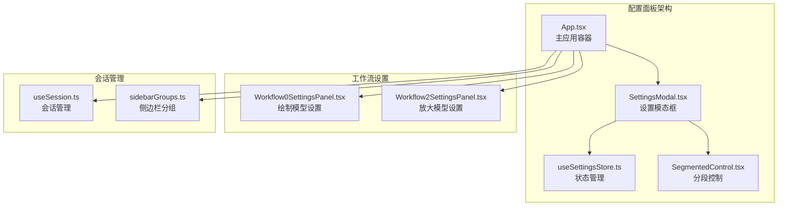
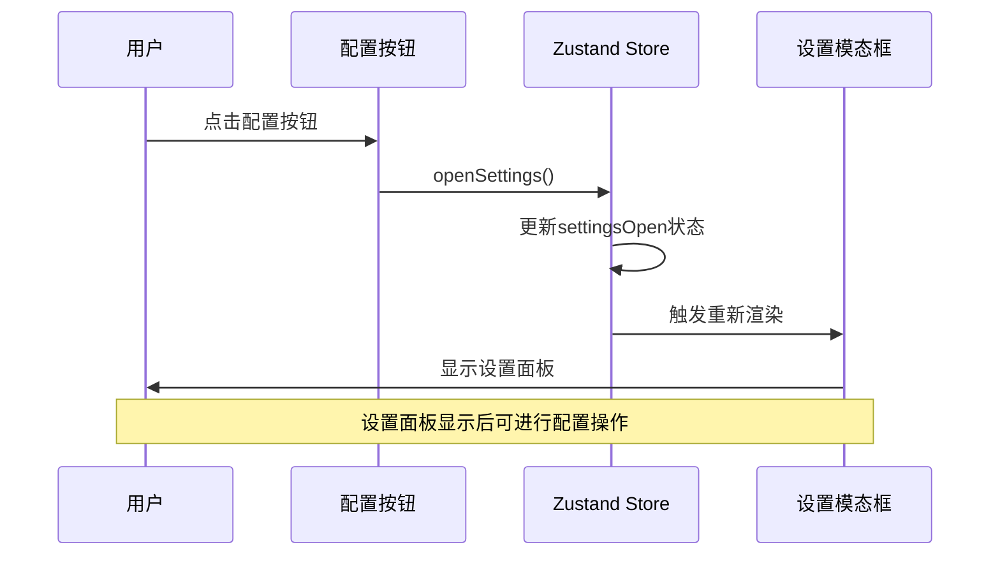
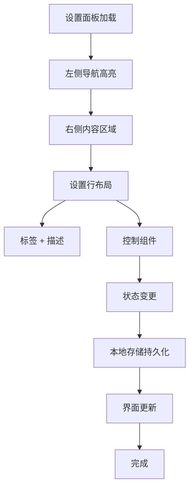
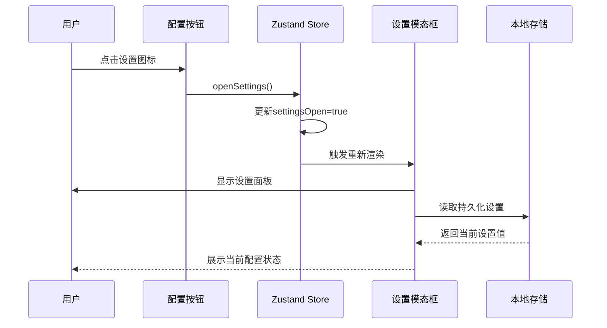
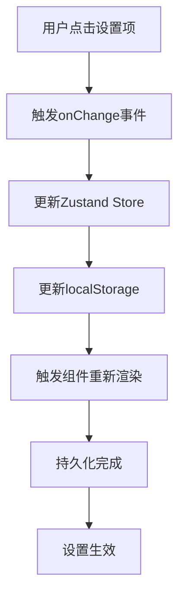
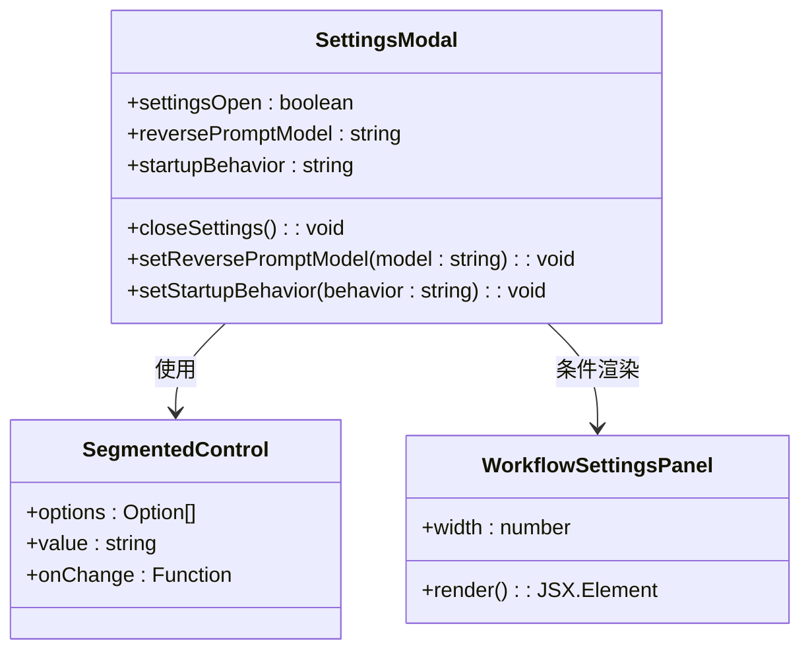

# 配置面板使用配置按钮

<cite>
**本文档引用的文件**
- [SettingsModal.tsx](file://client/src/components/SettingsModal.tsx)
- [useSettingsStore.ts](file://client/src/hooks/useSettingsStore.ts)
- [App.tsx](file://client/src/components/App.tsx)
- [SegmentedControl.tsx](file://client/src/components/SegmentedControl.tsx)
- [useSession.ts](file://client/src/hooks/useSession.ts)
- [Workflow0SettingsPanel.tsx](file://client/src/components/Workflow0SettingsPanel.tsx)
- [Workflow2SettingsPanel.tsx](file://client/src/components/Workflow2SettingsPanel.tsx)
- [sidebarGroups.ts](file://client/src/data/sidebarGroups.ts)
- [settings-panel.md](file://docs/settings-panel.md)
</cite>

## 目录
1. [简介](#简介)
2. [项目结构概览](#项目结构概览)
3. [配置按钮架构](#配置按钮架构)
4. [设置面板组件分析](#设置面板组件分析)
5. [状态管理系统](#状态管理系统)
6. [工作流特定设置面板](#工作流特定设置面板)
7. [用户交互流程](#用户交互流程)
8. [设计模式与最佳实践](#设计模式与最佳实践)
9. [扩展指南](#扩展指南)
10. [故障排除](#故障排除)

## 简介

配置面板是Pix2Real应用中的核心设置管理界面，它提供了一个直观的配置按钮，允许用户访问和管理各种系统设置。该功能采用现代化的React架构设计，结合Zustand状态管理库，实现了响应式的设置管理和持久化存储。

配置面板的主要目标是：
- 提供统一的设置入口点
- 支持多种设置类别（工作流、会话、提示词管理）
- 实现实时设置变更和持久化
- 提供直观的用户界面和良好的用户体验

## 项目结构概览

配置面板功能涉及多个关键文件和组件，形成了一个完整的设置管理生态系统：



**图表来源**
- [App.tsx:58-408](file://client/src/components/App.tsx#L58-L408)
- [SettingsModal.tsx:25-360](file://client/src/components/SettingsModal.tsx#L25-L360)
- [useSettingsStore.ts:16-31](file://client/src/hooks/useSettingsStore.ts#L16-L31)

**章节来源**
- [App.tsx:1-408](file://client/src/components/App.tsx#L1-L408)
- [SettingsModal.tsx:1-360](file://client/src/components/SettingsModal.tsx#L1-L360)

## 配置按钮架构

配置按钮作为设置面板的入口点，采用了精心设计的架构模式：

### 按钮组件设计

配置按钮位于应用头部导航区域，具有以下特性：



**图表来源**
- [App.tsx:240-257](file://client/src/components/App.tsx#L240-L257)
- [useSettingsStore.ts:28-30](file://client/src/hooks/useSettingsStore.ts#L28-L30)

### 状态管理模式

配置按钮的状态管理采用Zustand轻量级状态管理库：

| 组件 | 功能 | 状态属性 |
|------|------|----------|
| SettingsModal | 设置模态框主体 | `settingsOpen` |
| useSettingsStore | 全局状态管理 | `reversePromptModel`, `startupBehavior` |
| App | 应用容器 | `openSettings`, `closeSettings` |

**章节来源**
- [useSettingsStore.ts:16-31](file://client/src/hooks/useSettingsStore.ts#L16-L31)
- [App.tsx:240-257](file://client/src/components/App.tsx#L240-L257)

## 设置面板组件分析

设置面板采用左右布局设计，提供了清晰的导航和内容区域分离：

### 左侧导航系统

左侧导航包含三个主要类别：

| 类别ID | 中文标签 | 功能描述 |
|--------|----------|----------|
| `workflow` | 工作流 | 管理AI模型选择和工作流配置 |
| `session` | 会话 | 控制应用启动行为和会话管理 |
| `prompt` | 提示词管理 | 管理标签数据的导入导出 |

### 内容区域设计

每个设置类别都采用一致的布局模式：



**图表来源**
- [SettingsModal.tsx:166-231](file://client/src/components/SettingsModal.tsx#L166-L231)

**章节来源**
- [SettingsModal.tsx:19-23](file://client/src/components/SettingsModal.tsx#L19-L23)
- [SettingsModal.tsx:166-231](file://client/src/components/SettingsModal.tsx#L166-L231)

## 状态管理系统

配置面板的状态管理采用Zustand实现，提供了高效的状态同步机制：

### 状态类型定义

```typescript
interface SettingsState {
  reversePromptModel: ReversePromptModel;
  startupBehavior: StartupBehavior;
  settingsOpen: boolean;
  setReversePromptModel: (model: ReversePromptModel) => void;
  setStartupBehavior: (behavior: StartupBehavior) => void;
  openSettings: () => void;
  closeSettings: () => void;
}
```

### 数据持久化策略

设置值通过localStorage实现持久化存储：

| 设置项 | 存储键 | 默认值 | 类型 |
|--------|--------|--------|------|
| 反推模型 | `settings_reversePromptModel` | `'Qwen3VL'` | `ReversePromptModel` |
| 启动行为 | `settings_startupBehavior` | `'restore'` | `StartupBehavior` |
| 面板状态 | `settingsOpen` | `false` | `boolean` |

**章节来源**
- [useSettingsStore.ts:3-4](file://client/src/hooks/useSettingsStore.ts#L3-L4)
- [useSettingsStore.ts:16-31](file://client/src/hooks/useSettingsStore.ts#L16-L31)

## 工作流特定设置面板

除了全局设置外，配置面板还支持工作流特定的设置面板：

### 绘制模型设置面板

工作流0（绘制）设置面板提供模型选择功能：

| 模型 | 用途 | 特性 |
|------|------|------|
| Qwen | 文本到图像生成 | 支持多语言提示词 |
| Klein | 高质量图像生成 | 专业级艺术效果 |

### 放大模型设置面板

工作流2（放大）设置面板提供多种放大算法选择：

| 模型 | 放大倍数 | 适用场景 |
|------|----------|----------|
| SeedVR2 | 2x/4x | 通用高质量放大 |
| Klein | 2x/4x | 专业级细节保留 |
| 4xUltraSharp | 4x | 极致锐度保持 |
| Remacri | 2x/4x | 降噪增强 |

**章节来源**
- [Workflow0SettingsPanel.tsx:9-58](file://client/src/components/Workflow0SettingsPanel.tsx#L9-L58)
- [Workflow2SettingsPanel.tsx:9-60](file://client/src/components/Workflow2SettingsPanel.tsx#L9-L60)

## 用户交互流程

配置按钮的用户交互遵循标准的UI/UX设计原则：

### 打开流程



**图表来源**
- [App.tsx:240-257](file://client/src/components/App.tsx#L240-L257)
- [useSettingsStore.ts:28-30](file://client/src/hooks/useSettingsStore.ts#L28-L30)

### 设置变更流程



**图表来源**
- [SettingsModal.tsx:191-195](file://client/src/components/SettingsModal.tsx#L191-L195)
- [useSettingsStore.ts:20-27](file://client/src/hooks/useSettingsStore.ts#L20-L27)

**章节来源**
- [SettingsModal.tsx:73-75](file://client/src/components/SettingsModal.tsx#L73-L75)
- [useSettingsStore.ts:28-30](file://client/src/hooks/useSettingsStore.ts#L28-L30)

## 设计模式与最佳实践

配置面板实现了多种现代前端设计模式：

### 组件化设计

每个设置项都是独立的组件，具有明确的职责边界：



**图表来源**
- [SettingsModal.tsx:25-360](file://client/src/components/SettingsModal.tsx#L25-L360)
- [SegmentedControl.tsx:12-48](file://client/src/components/SegmentedControl.tsx#L12-L48)

### 状态管理模式

采用单向数据流和不可变状态更新：

| 模式 | 实现方式 | 优势 |
|------|----------|------|
| 单向数据流 | Zustand store | 状态集中管理 |
| 不可变更新 | setState回调 | 避免状态竞态 |
| 持久化存储 | localStorage | 设置跨会话保持 |

**章节来源**
- [useSettingsStore.ts:16-31](file://client/src/hooks/useSettingsStore.ts#L16-L31)
- [SettingsModal.tsx:25-360](file://client/src/components/SettingsModal.tsx#L25-L360)

## 扩展指南

配置面板支持灵活的功能扩展：

### 添加新的设置类别

1. **定义类别常量**：在SettingsModal中添加新的类别定义
2. **创建内容区域**：为新类别添加对应的内容区域
3. **更新导航**：确保左侧导航包含新类别
4. **实现状态管理**：在useSettingsStore中添加相应的状态属性

### 自定义设置控件

```typescript
// 示例：添加新的设置控件
const NEW_SETTING_OPTIONS = [
  { value: 'option1', label: '选项1' },
  { value: 'option2', label: '选项2' },
];

// 在SettingsModal中使用
<SegmentedControl
  options={NEW_SETTING_OPTIONS}
  value={newSettingValue}
  onChange={(v) => setNewSettingValue(v)}
/>
```

**章节来源**
- [settings-panel.md:13-70](file://docs/settings-panel.md#L13-L70)
- [SettingsModal.tsx:19-23](file://client/src/components/SettingsModal.tsx#L19-L23)

## 故障排除

### 常见问题及解决方案

| 问题 | 症状 | 解决方案 |
|------|------|----------|
| 设置不保存 | 刷新后设置恢复默认 | 检查localStorage权限 |
| 模态框无法关闭 | 点击无效 | 检查事件处理器绑定 |
| 状态不同步 | UI与实际设置不符 | 验证Zustand状态更新 |

### 性能优化建议

1. **懒加载设置面板**：仅在需要时渲染设置面板
2. **防抖处理**：对频繁的状态更新添加防抖
3. **虚拟滚动**：对于大量设置项使用虚拟滚动

**章节来源**
- [SettingsModal.tsx:38-43](file://client/src/components/SettingsModal.tsx#L38-L43)
- [useSettingsStore.ts:16-31](file://client/src/hooks/useSettingsStore.ts#L16-L31)