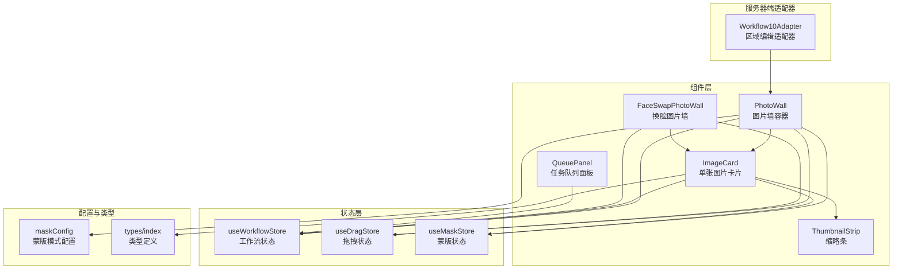
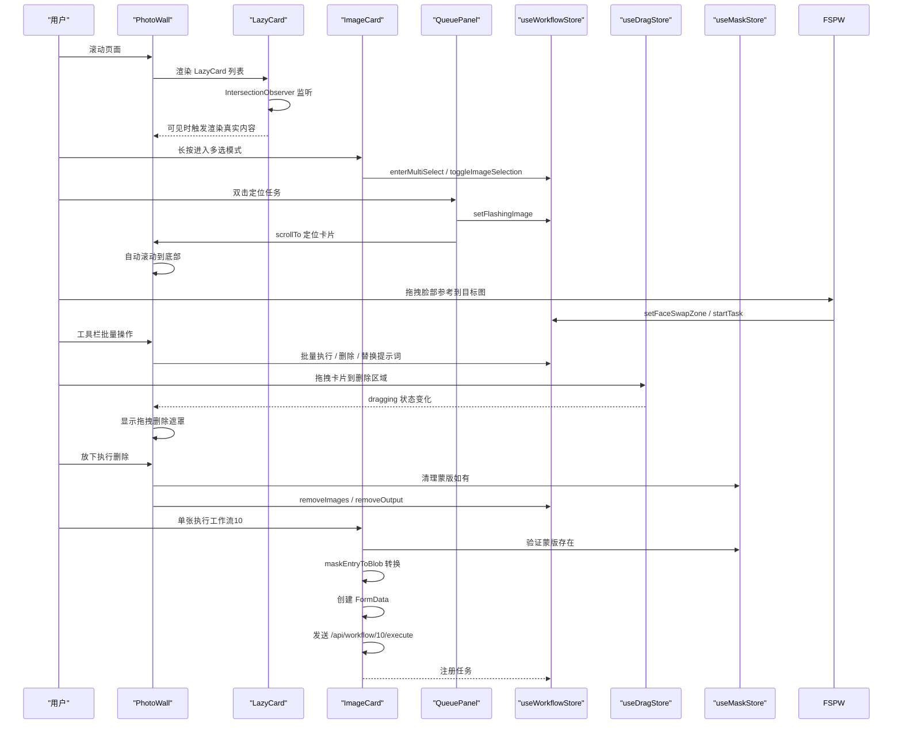
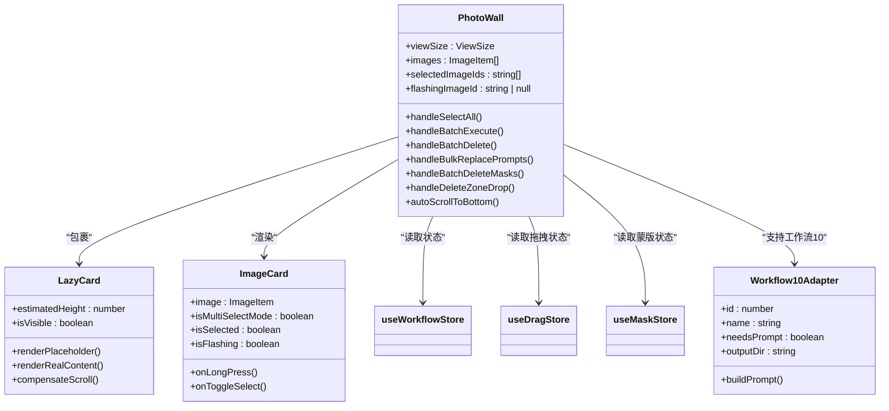
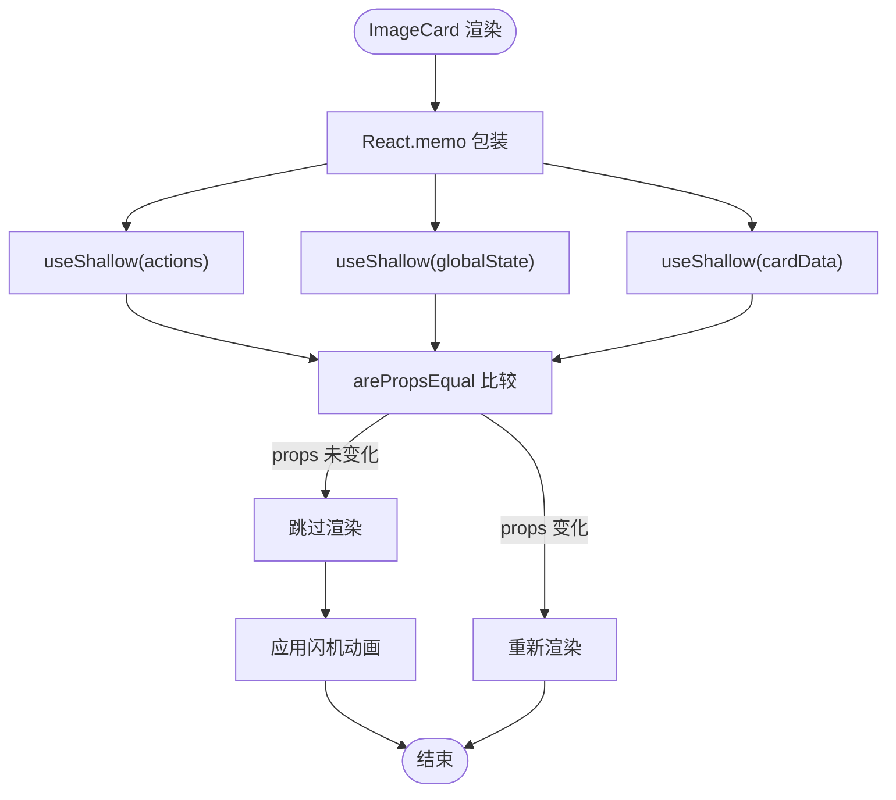
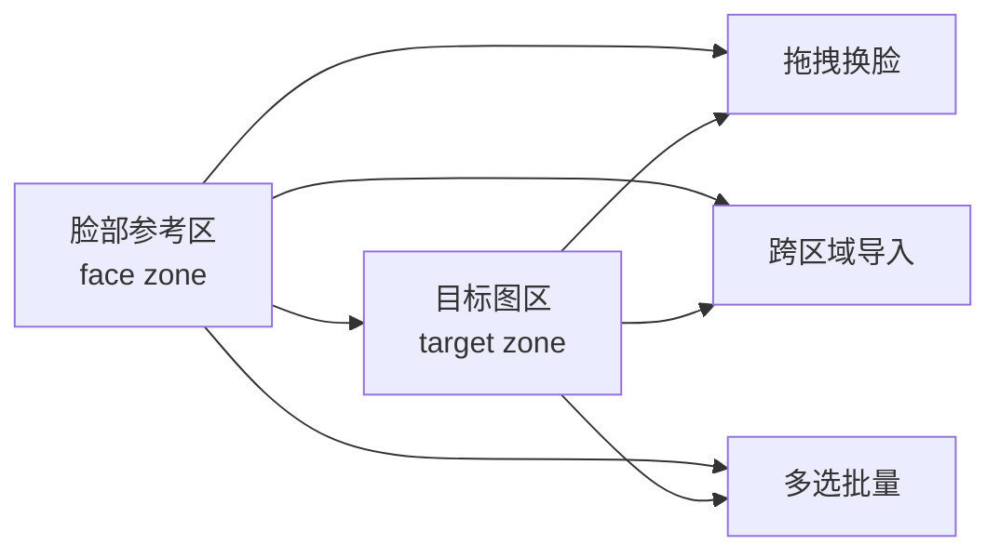
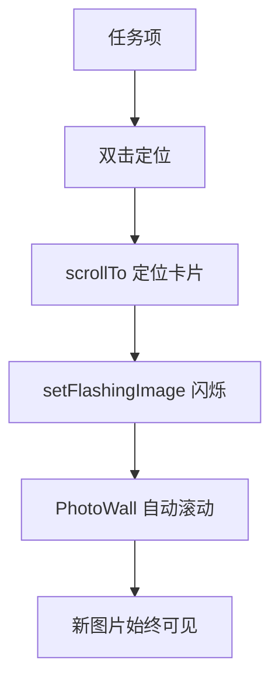
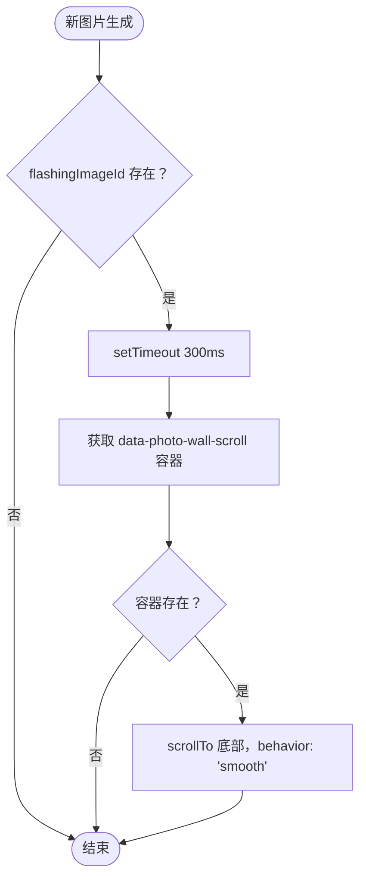
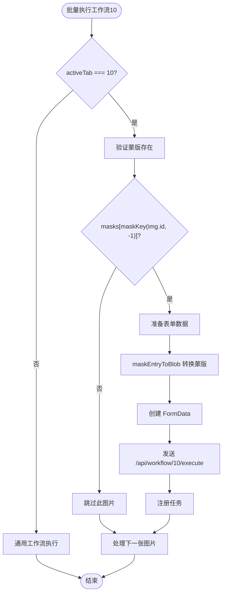
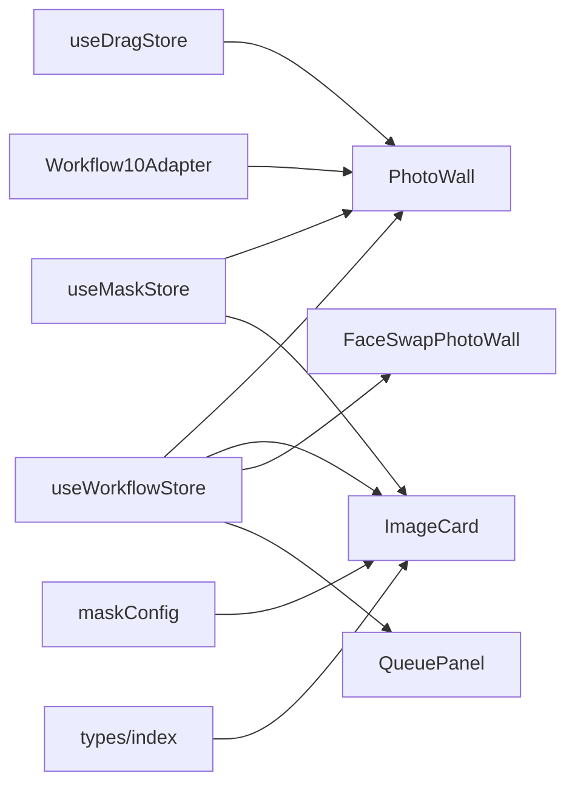
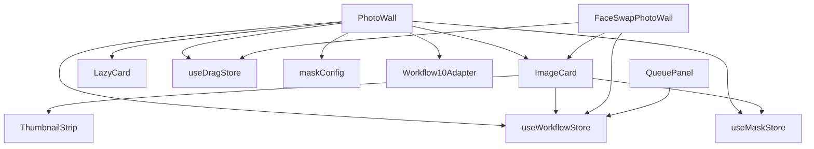

# 图片墙组件 (PhotoWall)

<cite>
**本文档引用的文件**
- [PhotoWall.tsx](file://client/src/components/PhotoWall.tsx)
- [ImageCard.tsx](file://client/src/components/ImageCard.tsx)
- [FaceSwapPhotoWall.tsx](file://client/src/components/FaceSwapPhotoWall.tsx)
- [ThumbnailStrip.tsx](file://client/src/components/ThumbnailStrip.tsx)
- [useWorkflowStore.ts](file://client/src/hooks/useWorkflowStore.ts)
- [useDragStore.ts](file://client/src/hooks/useDragStore.ts)
- [useMaskStore.ts](file://client/src/hooks/useMaskStore.ts)
- [useWebSocket.ts](file://client/src/hooks/useWebSocket.ts)
- [maskConfig.ts](file://client/src/config/maskConfig.ts)
- [Workflow10Adapter.ts](file://server/src/adapters/Workflow10Adapter.ts)
- [index.ts](file://client/src/types/index.ts)
- [global.css](file://client/src/styles/global.css)
</cite>

## 更新摘要
**变更内容**
- **新增自动滚动功能**：当新图片生成时自动滚动到底部，提升用户体验
- **重大布局重构**：从 CSS 多列布局迁移到 CSS Grid，使用 `repeat(auto-fill, minmax())` 实现响应式图像卡片布局
- 改进了滚动行为和对齐方式，使用 `alignItems: 'start'` 和 `alignContent: 'start'` 确保卡片顶部对齐
- 增强了响应式布局能力，支持更灵活的列宽配置和自动填充
- 保持了原有的 IntersectionObserver 懒加载优化和滚动补偿机制

## 目录
1. [简介](#简介)
2. [项目结构](#项目结构)
3. [核心组件](#核心组件)
4. [架构总览](#架构总览)
5. [详细组件分析](#详细组件分析)
6. [依赖关系分析](#依赖关系分析)
7. [性能考虑](#性能考虑)
8. [故障排除指南](#故障排除指南)
9. [结论](#结论)
10. [附录](#附录)

## 简介
PhotoWall 是一个高性能的图片瀑布流展示组件，支持响应式列宽、懒加载、多选模式、批量操作与拖拽删除等高级功能。**更新** 组件已从传统的 CSS 多列布局重构为现代的 CSS Grid 布局，使用 `repeat(auto-fill, minmax())` 实现更加灵活和响应式的图像卡片排列。通过 IntersectionObserver 与手动滚动补偿策略优化首屏渲染与滚动体验。组件与 ImageCard、ThumbnailStrip、拖拽存储、蒙版存储等模块深度协作，形成完整的图片工作流界面。

**更新** 新增对工作流10（区域编辑）的功能支持，包括蒙版验证和表单数据准备。**新增** 自动滚动功能：当新图片生成时，组件会自动滚动到底部，确保用户能够立即看到最新生成的内容。

## 项目结构
PhotoWall 位于客户端前端代码中，作为主界面的核心展示区域之一，负责组织与渲染当前工作区的图片卡片，并提供多选、批量执行、拖拽删除等交互能力。

**图表来源**
- [PhotoWall.tsx:493-506](file://client/src/components/PhotoWall.tsx#L493-L506)
- [ImageCard.tsx:42-88](file://client/src/components/ImageCard.tsx#L42-L88)
- [FaceSwapPhotoWall.tsx:213-229](file://client/src/components/FaceSwapPhotoWall.tsx#L213-L229)
- [useWorkflowStore.ts:96-115](file://client/src/hooks/useWorkflowStore.ts#L96-L115)
- [useDragStore.ts:13-16](file://client/src/hooks/useDragStore.ts#L13-L16)
- [useMaskStore.ts:32-30](file://client/src/hooks/useMaskStore.ts#L32-L30)
- [maskConfig.ts:5-16](file://client/src/config/maskConfig.ts#L5-L16)
- [index.ts:1-58](file://client/src/types/index.ts#L1-L58)
- [Workflow10Adapter.ts:4-14](file://server/src/adapters/Workflow10Adapter.ts#L4-L14)
- [QueuePanel.tsx:125-135](file://client/src/components/QueuePanel.tsx#L125-L135)

**章节来源**
- [PhotoWall.tsx:103-125](file://client/src/components/PhotoWall.tsx#L103-L125)
- [PhotoWall.tsx:493-506](file://client/src/components/PhotoWall.tsx#L493-L506)

## 核心组件
- PhotoWall：主容器，负责**重构后的 CSS Grid 布局**、懒加载、多选模式、批量操作、拖拽删除与工具栏显示逻辑。**更新** 现在支持工作流10（区域编辑）的专用执行流程，**新增** 自动滚动功能确保新生成图片始终可见。
- LazyCard：轻量级懒加载包装器，基于 IntersectionObserver 实现延迟渲染与预加载，配合滚动补偿避免内容跳变。
- ImageCard：单张图片卡片，包含预览、输出叠加、进度覆盖、蒙版菜单、长按多选、拖拽等交互。**更新** 使用 React.memo 和 useShallow 浅订阅优化渲染性能，支持工作流10的蒙版验证，**新增** 闪机动画效果增强视觉反馈。
- ThumbnailStrip：底部缩略条，用于在非文本工作流中切换原图与生成结果。
- FaceSwapPhotoWall：**新增** 专门的人脸交换工作流组件，提供双区域布局（脸部参考区和目标图区）和拖拽换脸功能。
- QueuePanel：**新增** 任务队列面板，提供任务定位和闪烁高亮功能，与 PhotoWall 的自动滚动功能协同工作。
- 状态存储：
  - useWorkflowStore：全局工作流状态（图片列表、任务、提示词、选中项等），**新增** flashingImageId 状态管理。
  - useDragStore：拖拽状态（卡片或输出拖拽）。
  - useMaskStore：蒙版数据与编辑器状态。
- 配置与类型：maskConfig 定义各工作流的蒙版模式；types/index 定义图片与任务类型。
- **新增** Workflow10Adapter：服务器端适配器，支持工作流10（区域编辑）的专用执行逻辑。

**章节来源**
- [PhotoWall.tsx:18-97](file://client/src/components/PhotoWall.tsx#L18-L97)
- [ImageCard.tsx:17-42](file://client/src/components/ImageCard.tsx#L17-L42)
- [FaceSwapPhotoWall.tsx:10-12](file://client/src/components/FaceSwapPhotoWall.tsx#L10-L12)
- [useWorkflowStore.ts:35-88](file://client/src/hooks/useWorkflowStore.ts#L35-L88)
- [useDragStore.ts:4-16](file://client/src/hooks/useDragStore.ts#L4-L16)
- [useMaskStore.ts:4-30](file://client/src/hooks/useMaskStore.ts#L4-L30)
- [maskConfig.ts:3-19](file://client/src/config/maskConfig.ts#L3-L19)
- [index.ts:1-58](file://client/src/types/index.ts#L1-L58)
- [Workflow10Adapter.ts:4-14](file://server/src/adapters/Workflow10Adapter.ts#L4-L14)

## 架构总览
PhotoWall 采用"容器-展示"分层设计：
- 容器层：PhotoWall 负责数据获取、状态计算、事件处理与**重构后的 CSS Grid 布局控制**。
- 展示层：LazyCard 负责懒加载与占位符，ImageCard 负责单卡渲染与交互。
- 状态层：通过 zustand store 管理跨组件共享状态。
- 协作层：与 ThumbnailStrip、蒙版系统、拖拽系统协同完成复杂交互。

**图表来源**
- [PhotoWall.tsx:18-97](file://client/src/components/PhotoWall.tsx#L18-L97)
- [PhotoWall.tsx:493-506](file://client/src/components/PhotoWall.tsx#L493-L506)
- [ImageCard.tsx:217-231](file://client/src/components/ImageCard.tsx#L217-L231)
- [FaceSwapPhotoWall.tsx:256-282](file://client/src/components/FaceSwapPhotoWall.tsx#L256-L282)
- [useWorkflowStore.ts:117-129](file://client/src/hooks/useWorkflowStore.ts#L117-L129)
- [useDragStore.ts:13-16](file://client/src/hooks/useDragStore.ts#L13-L16)
- [useMaskStore.ts:36-43](file://client/src/hooks/useMaskStore.ts#L36-L43)
- [ImageCard.tsx:321-348](file://client/src/components/ImageCard.tsx#L321-L348)
- [QueuePanel.tsx:125-135](file://client/src/components/QueuePanel.tsx#L125-L135)

## 详细组件分析

### LazyCard 组件（IntersectionObserver 优化与滚动补偿）
LazyCard 是 PhotoWall 中实现"懒加载 + 预加载 + 滚动补偿"的关键模块，其设计目标是：
- 使用 IntersectionObserver 在元素即将进入视口前触发渲染，减少首屏阻塞。
- 通过不对称 rootMargin（上 200px、下 1200px）实现"向上微预加载 + 向下强预加载"，提升滚动流畅度。
- 在占位符转真实内容时进行手动滚动补偿，避免因高度变化导致的视口跳变。

**图表来源**
- [PhotoWall.tsx:28-43](file://client/src/components/PhotoWall.tsx#L28-L43)
- [PhotoWall.tsx:46-70](file://client/src/components/PhotoWall.tsx#L46-L70)

**章节来源**
- [PhotoWall.tsx:18-97](file://client/src/components/PhotoWall.tsx#L18-L97)

### PhotoWall 主容器（重构后的 CSS Grid 布局与多选模式）
**更新** PhotoWall 已从 CSS 多列布局重构为 CSS Grid 布局，通过以下特性实现响应式图像卡片排列：
- **CSS Grid 布局**：使用 `display: 'grid'` 和 `gridTemplateColumns: repeat(auto-fill, minmax(${VIEW_CONFIG[viewSize].columnWidth}, 1fr))` 实现自动填充和响应式列宽。
- **顶部对齐**：通过 `alignItems: 'start'` 和 `alignContent: 'start'` 确保卡片顶部对齐，改善视觉一致性。
- **响应式列宽**：通过 VIEW_CONFIG 配置不同视图尺寸的小、中、大三档列宽与估算卡片高度。
- **自动滚动功能**：**新增** 当 `flashingImageId` 状态变化时，组件会自动滚动到底部，确保新生成的图片始终可见。
- 懒加载卡片：每个卡片外层包裹 LazyCard，仅在接近视口时渲染真实内容。
- 多选模式：长按或点击进入多选，工具栏根据选中状态动态显示批量操作按钮。
- 批量操作：批量执行、批量删除、批量替换提示词、批量删除蒙版。
- 拖拽删除：全局拖拽状态驱动底部删除遮罩显示，放下时清理对应图片与蒙版。
- **新增** 工作流10支持：批量执行时自动检测工作流10的蒙版要求，确保只有有蒙版的图片才能执行。

**图表来源**
- [PhotoWall.tsx:99-101](file://client/src/components/PhotoWall.tsx#L99-L101)
- [PhotoWall.tsx:18-97](file://client/src/components/PhotoWall.tsx#L18-L97)
- [PhotoWall.tsx:493-506](file://client/src/components/PhotoWall.tsx#L493-L506)
- [ImageCard.tsx:17-25](file://client/src/components/ImageCard.tsx#L17-L25)
- [Workflow10Adapter.ts:4-14](file://server/src/adapters/Workflow10Adapter.ts#L4-L14)

**章节来源**
- [PhotoWall.tsx:103-125](file://client/src/components/PhotoWall.tsx#L103-L125)
- [PhotoWall.tsx:165-266](file://client/src/components/PhotoWall.tsx#L165-L266)
- [PhotoWall.tsx:493-506](file://client/src/components/PhotoWall.tsx#L493-L506)

### ImageCard 组件（性能优化与浅订阅）
**更新** ImageCard 组件经过重大性能优化，采用 React.memo 和 useShallow 浅订阅策略：

- **React.memo 包装**：通过 `arePropsEqual` 函数精确比较 props 变化，避免不必要的重渲染。
- **useShallow 浅订阅**：将大型状态拆分为多个独立订阅，只在相关状态变化时触发重渲染。
- **状态拆分策略**：
  - actions：稳定的函数引用，很少变化
  - globalState：影响所有卡片的全局状态
  - cardData：仅当前卡片相关的数据，按 image.id 过滤
- **新增** 闪机动画：**更新** 当 `isFlashing` 属性为 true 时，卡片会应用闪机动画效果，增强视觉反馈。

**新增** 工作流10支持：单张执行时自动验证蒙版存在，确保执行前的数据完整性。

**图表来源**
- [ImageCard.tsx:27-40](file://client/src/components/ImageCard.tsx#L27-L40)
- [ImageCard.tsx:46-83](file://client/src/components/ImageCard.tsx#L46-L83)
- [ImageCard.tsx:483-484](file://client/src/components/ImageCard.tsx#L483-L484)

**章节来源**
- [ImageCard.tsx:17-42](file://client/src/components/ImageCard.tsx#L17-L42)
- [ImageCard.tsx:27-40](file://client/src/components/ImageCard.tsx#L27-L40)
- [ImageCard.tsx:46-83](file://client/src/components/ImageCard.tsx#L46-L83)

### FaceSwapPhotoWall 组件（新增）
**新增** FaceSwapPhotoWall 是专门用于人脸交换工作流的双区域布局组件：

- **双区域设计**：左侧脸部参考区（face zone），右侧目标图区（target zone）
- **拖拽换脸**：支持将脸部参考图拖拽到目标图上执行换脸操作
- **跨区域拖拽**：支持区域间的图片交叉导入和交换
- **多选批量**：支持多选模式下的批量换脸操作
- **视图适配**：使用独立的 VIEW_CONFIG 配置，针对换脸场景优化布局

**图表来源**
- [FaceSwapPhotoWall.tsx:14-19](file://client/src/components/FaceSwapPhotoWall.tsx#L14-L19)
- [FaceSwapPhotoWall.tsx:556-689](file://client/src/components/FaceSwapPhotoWall.tsx#L556-L689)
- [FaceSwapPhotoWall.tsx:691-875](file://client/src/components/FaceSwapPhotoWall.tsx#L691-L875)

**章节来源**
- [FaceSwapPhotoWall.tsx:213-229](file://client/src/components/FaceSwapPhotoWall.tsx#L213-L229)
- [FaceSwapPhotoWall.tsx:556-689](file://client/src/components/FaceSwapPhotoWall.tsx#L556-L689)
- [FaceSwapPhotoWall.tsx:691-875](file://client/src/components/FaceSwapPhotoWall.tsx#L691-L875)

### QueuePanel 组件（新增）
**新增** QueuePanel 是任务队列面板组件，提供任务定位和闪烁高亮功能：

- **任务定位**：双击任务项可以滚动到对应的图片卡片
- **闪烁高亮**：通过 `setFlashingImage` 设置闪烁状态，增强视觉反馈
- **与 PhotoWall 协同**：与 PhotoWall 的自动滚动功能配合，提供完整的任务跟踪体验

**图表来源**
- [QueuePanel.tsx:125-135](file://client/src/components/QueuePanel.tsx#L125-L135)
- [PhotoWall.tsx:136-146](file://client/src/components/PhotoWall.tsx#L136-L146)

**章节来源**
- [QueuePanel.tsx:125-135](file://client/src/components/QueuePanel.tsx#L125-L135)

### 自动滚动功能（新增）
**新增** PhotoWall 组件现在具备自动滚动功能，当新图片生成时会自动滚动到底部：

- **触发条件**：当 `flashingImageId` 状态从 null 变为具体图片 ID 时触发
- **滚动实现**：使用 `setTimeout` 延迟 300ms 确保 DOM 更新完成，然后调用 `scrollTo` 平滑滚动到底部
- **容器定位**：通过 `data-photo-wall-scroll` 属性定位滚动容器
- **用户体验**：确保用户能够立即看到最新生成的图片，提升工作流效率

**图表来源**
- [PhotoWall.tsx:136-146](file://client/src/components/PhotoWall.tsx#L136-L146)

**章节来源**
- [PhotoWall.tsx:136-146](file://client/src/components/PhotoWall.tsx#L136-L146)

### 工作流10（区域编辑）支持
**新增** PhotoWall 现在完全支持工作流10（区域编辑）功能，包括：

- **蒙版验证**：在批量执行前检查每个图片是否具有有效的蒙版数据
- **专用执行流程**：工作流10使用独立的执行逻辑和表单数据准备
- **表单数据准备**：自动将蒙版数据转换为 PNG 格式并添加到 FormData 中
- **状态管理**：通过 maskKey 生成正确的蒙版键值，确保数据一致性

**图表来源**
- [PhotoWall.tsx:170-176](file://client/src/components/PhotoWall.tsx#L170-L176)
- [PhotoWall.tsx:218-246](file://client/src/components/PhotoWall.tsx#L218-L246)
- [PhotoWall.tsx:141-160](file://client/src/components/PhotoWall.tsx#L141-L160)

**章节来源**
- [PhotoWall.tsx:170-176](file://client/src/components/PhotoWall.tsx#L170-L176)
- [PhotoWall.tsx:218-246](file://client/src/components/PhotoWall.tsx#L218-L246)
- [PhotoWall.tsx:141-160](file://client/src/components/PhotoWall.tsx#L141-L160)

### 状态管理与协作关系
- useWorkflowStore：提供图片列表、任务状态、提示词、选中项、闪动高亮等全局状态，PhotoWall 与 ImageCard 均通过该 store 订阅所需数据。
- **新增** flashingImageId：**新增** 用于管理当前闪烁的图片 ID，支持自动滚动和闪机动画功能。
- useDragStore：统一管理拖拽状态（卡片或输出），PhotoWall 基于该状态显示拖拽删除遮罩。
- useMaskStore：管理蒙版数据与编辑器状态，PhotoWall 在批量删除时清理对应蒙版键值。
- maskConfig：定义各工作流的蒙版模式（A/B/none），影响蒙版菜单与编辑器行为。
- **新增** Workflow10Adapter：服务器端适配器，支持工作流10（区域编辑）的专用执行逻辑。

**图表来源**
- [useWorkflowStore.ts:96-115](file://client/src/hooks/useWorkflowStore.ts#L96-L115)
- [useDragStore.ts:13-16](file://client/src/hooks/useDragStore.ts#L13-L16)
- [useMaskStore.ts:32-30](file://client/src/hooks/useMaskStore.ts#L32-L30)
- [maskConfig.ts:5-16](file://client/src/config/maskConfig.ts#L5-L16)
- [index.ts:1-58](file://client/src/types/index.ts#L1-L58)
- [Workflow10Adapter.ts:4-14](file://server/src/adapters/Workflow10Adapter.ts#L4-L14)

**章节来源**
- [useWorkflowStore.ts:35-88](file://client/src/hooks/useWorkflowStore.ts#L35-L88)
- [useDragStore.ts:4-16](file://client/src/hooks/useDragStore.ts#L4-L16)
- [useMaskStore.ts:4-30](file://client/src/hooks/useMaskStore.ts#L4-L30)
- [maskConfig.ts:3-19](file://client/src/config/maskConfig.ts#L3-L19)
- [index.ts:1-58](file://client/src/types/index.ts#L1-L58)
- [Workflow10Adapter.ts:4-14](file://server/src/adapters/Workflow10Adapter.ts#L4-L14)

## 依赖关系分析
PhotoWall 的依赖关系清晰，遵循"低耦合、高内聚"的原则：
- 与 ImageCard 的依赖：通过 props 传递图片数据与交互回调，保持渲染职责单一。
- 与 LazyCard 的依赖：仅依赖其懒加载与占位符渲染能力，不关心内部实现细节。
- 与状态存储的依赖：通过 hooks 订阅所需状态，避免直接访问全局对象。
- 与配置的依赖：通过 VIEW_CONFIG 与 maskConfig 控制布局与功能开关。
- **新增** 与 Workflow10Adapter 的依赖：支持工作流10的专用执行逻辑。
- **新增** 与 QueuePanel 的依赖：**新增** 任务队列面板提供任务定位和闪烁高亮功能。

**图表来源**
- [PhotoWall.tsx:493-506](file://client/src/components/PhotoWall.tsx#L493-L506)
- [ImageCard.tsx:42-88](file://client/src/components/ImageCard.tsx#L42-L88)
- [FaceSwapPhotoWall.tsx:213-229](file://client/src/components/FaceSwapPhotoWall.tsx#L213-L229)
- [ThumbnailStrip.tsx:34-61](file://client/src/components/ThumbnailStrip.tsx#L34-L61)
- [Workflow10Adapter.ts:4-14](file://server/src/adapters/Workflow10Adapter.ts#L4-L14)
- [QueuePanel.tsx:125-135](file://client/src/components/QueuePanel.tsx#L125-L135)

**章节来源**
- [PhotoWall.tsx:103-125](file://client/src/components/PhotoWall.tsx#L103-L125)
- [ImageCard.tsx:17-42](file://client/src/components/ImageCard.tsx#L17-L42)

## 性能考虑
- **ImageCard 性能优化**：**更新** 通过 React.memo 和 useShallow 浅订阅显著减少重渲染次数，特别是在多卡片场景下性能提升明显。
- 懒加载与预加载：LazyCard 使用不对称 rootMargin，在用户向下滚动时提前渲染，减少空白感；向上微偏移避免不必要的上拉预加载。
- 占位符与滚动补偿：占位符使用最小高度，真实内容渲染后通过 requestAnimationFrame 计算高度差并补偿 scrollTop，避免视口跳变。
- **重构后的 CSS Grid 布局**：**更新** 通过 `repeat(auto-fill, minmax())` 实现更高效的响应式布局，相比传统多列布局具有更好的性能表现和更灵活的列宽控制。
- 组件记忆化：LazyCard 与 ImageCard 均使用 memo 包裹，减少不必要的重渲染。
- 状态订阅：通过 useWorkflowStore 的浅订阅（useShallow）降低订阅粒度，避免无关状态变更引发的重渲染。
- 视图配置：VIEW_CONFIG 将列宽与估算高度解耦，便于在不同设备与场景下调整性能与视觉平衡。
- **FaceSwapPhotoWall 优化**：**新增** 使用独立的布局配置和拖拽状态管理，避免与主 PhotoWall 的状态冲突。
- **工作流10优化**：**新增** 通过 hasIdleSelected 函数的蒙版检查，避免无效的执行尝试，提升整体性能。
- **自动滚动优化**：**新增** 使用 300ms 延迟确保 DOM 更新完成，避免滚动到错误位置。
- **闪机动画优化**：**新增** 闪机动画在 onAnimationEnd 时自动清除状态，避免内存泄漏。

**章节来源**
- [PhotoWall.tsx:18-97](file://client/src/components/PhotoWall.tsx#L18-L97)
- [PhotoWall.tsx:12-16](file://client/src/components/PhotoWall.tsx#L12-L16)
- [ImageCard.tsx:27-40](file://client/src/components/ImageCard.tsx#L27-L40)
- [FaceSwapPhotoWall.tsx:14-19](file://client/src/components/FaceSwapPhotoWall.tsx#L14-L19)
- [PhotoWall.tsx:170-176](file://client/src/components/PhotoWall.tsx#L170-L176)
- [PhotoWall.tsx:136-146](file://client/src/components/PhotoWall.tsx#L136-L146)
- [ImageCard.tsx:483-484](file://client/src/components/ImageCard.tsx#L483-L484)

## 故障排除指南
- 懒加载不生效
  - 检查 LazyCard 的 IntersectionObserver 是否正确创建与断开连接。
  - 确认 rootMargin 设置是否合理，过小可能导致频繁触发，过大可能影响预加载效果。
  - 参考路径：[PhotoWall.tsx:28-43](file://client/src/components/PhotoWall.tsx#L28-L43)
- 内容跳变或滚动位置异常
  - 检查滚动补偿逻辑是否在占位符转真实内容时执行。
  - 确认容器元素是否带有 data-photo-wall-scroll 属性以便定位滚动容器。
  - 参考路径：[PhotoWall.tsx:46-70](file://client/src/components/PhotoWall.tsx#L46-L70)
- 多选模式按钮不可用
  - 确认 isMultiSelectMode 计算逻辑与 selectedImageIds 是否正确更新。
  - 检查 enterMultiSelect 与 toggleImageSelection 的调用链路。
  - **更新** 检查 hasIdleSelected 函数是否正确考虑工作流10的蒙版要求。
  - 参考路径：[PhotoWall.tsx:139-142](file://client/src/components/PhotoWall.tsx#L139-L142), [useWorkflowStore.ts:117-125](file://client/src/hooks/useWorkflowStore.ts#L117-L125)
  - **更新** 参考路径：[PhotoWall.tsx:170-176](file://client/src/components/PhotoWall.tsx#L170-L176)
- 批量删除未清理蒙版
  - 确认 maskKey 生成规则与删除范围是否覆盖选中图片的所有蒙版键。
  - 参考路径：[PhotoWall.tsx:258-266](file://client/src/components/PhotoWall.tsx#L258-L266), [maskConfig.ts:18-19](file://client/src/config/maskConfig.ts#L18-L19), [useMaskStore.ts:39-43](file://client/src/hooks/useMaskStore.ts#L39-L43)
- 拖拽删除遮罩不显示
  - 检查 useDragStore 的 dragging 状态是否正确设置与清理。
  - 确认 PhotoWall 对 dragging 的监听与 deleteZoneDragCount 的计数逻辑。
  - 参考路径：[useDragStore.ts:13-16](file://client/src/hooks/useDragStore.ts#L13-L16), [PhotoWall.tsx:132-137](file://client/src/components/PhotoWall.tsx#L132-L137), [PhotoWall.tsx:511-574](file://client/src/components/PhotoWall.tsx#L511-L574)
- **ImageCard 性能问题**
  - 检查 arePropsEqual 函数是否正确比较了所有关键 props。
  - 确认 useShallow 订阅是否按预期拆分了状态。
  - **更新** 检查闪机动画是否正确清除状态。
  - 参考路径：[ImageCard.tsx:27-40](file://client/src/components/ImageCard.tsx#L27-L40), [ImageCard.tsx:46-83](file://client/src/components/ImageCard.tsx#L46-L83)
- **FaceSwapPhotoWall 拖拽异常**
  - 检查拖拽数据类型是否正确设置（application/x-face-swap-face/target）。
  - 确认跨区域拖拽的 dropEffect 配置是否匹配。
  - 参考路径：[FaceSwapPhotoWall.tsx:422-442](file://client/src/components/FaceSwapPhotoWall.tsx#L422-L442), [FaceSwapPhotoWall.tsx:748-752](file://client/src/components/FaceSwapPhotoWall.tsx#L748-L752)
- **工作流10执行失败**
  - 检查图片是否具有有效的蒙版数据（maskEntryToBlob）。
  - 确认 FormData 是否正确包含 image、mask、clientId、prompt、backPose 字段。
  - 验证 /api/workflow/10/execute 端点是否可用。
  - 参考路径：[PhotoWall.tsx:218-246](file://client/src/components/PhotoWall.tsx#L218-L246), [PhotoWall.tsx:141-160](file://client/src/components/PhotoWall.tsx#L141-L160)
- **ImageCard 工作流10验证失败**
  - 检查 maskEntryForMode 是否正确返回蒙版数据。
  - 确认 showToast('请先在蒙版编辑器中绘制蒙版') 的调用时机。
  - 参考路径：[ImageCard.tsx:321-348](file://client/src/components/ImageCard.tsx#L321-L348)
- **CSS Grid 布局问题**
  - 检查 gridTemplateColumns 是否正确应用 repeat(auto-fill, minmax()) 函数。
  - 确认 alignContent 和 alignItems 属性是否正确设置为 'start'。
  - 验证 VIEW_CONFIG 中的 columnWidth 配置是否符合预期。
  - 参考路径：[PhotoWall.tsx:520-524](file://client/src/components/PhotoWall.tsx#L520-L524), [PhotoWall.tsx:12-16](file://client/src/components/PhotoWall.tsx#L12-L16)
- **自动滚动功能问题**
  - **新增** 检查 flashingImageId 状态是否正确设置和清除。
  - 确认 data-photo-wall-scroll 容器是否存在且可滚动。
  - 验证 setTimeout 延迟时间是否足够等待 DOM 更新。
  - 参考路径：[PhotoWall.tsx:136-146](file://client/src/components/PhotoWall.tsx#L136-L146)
- **QueuePanel 任务定位问题**
  - **新增** 检查 setFlashingImage 是否正确调用。
  - 确认 card-${imageId} 元素是否存在。
  - 验证 scrollTo 的 behavior 参数是否正确。
  - 参考路径：[QueuePanel.tsx:125-135](file://client/src/components/QueuePanel.tsx#L125-L135)

**章节来源**
- [PhotoWall.tsx:28-70](file://client/src/components/PhotoWall.tsx#L28-L70)
- [PhotoWall.tsx:132-137](file://client/src/components/PhotoWall.tsx#L132-L137)
- [PhotoWall.tsx:258-266](file://client/src/components/PhotoWall.tsx#L258-L266)
- [useDragStore.ts:13-16](file://client/src/hooks/useDragStore.ts#L13-L16)
- [maskConfig.ts:18-19](file://client/src/config/maskConfig.ts#L18-L19)
- [useMaskStore.ts:39-43](file://client/src/hooks/useMaskStore.ts#L39-L43)
- [ImageCard.tsx:27-40](file://client/src/components/ImageCard.tsx#L27-L40)
- [ImageCard.tsx:46-83](file://client/src/components/ImageCard.tsx#L46-L83)
- [FaceSwapPhotoWall.tsx:422-442](file://client/src/components/FaceSwapPhotoWall.tsx#L422-L442)
- [FaceSwapPhotoWall.tsx:748-752](file://client/src/components/FaceSwapPhotoWall.tsx#L748-L752)
- [PhotoWall.tsx:218-246](file://client/src/components/PhotoWall.tsx#L218-L246)
- [PhotoWall.tsx:141-160](file://client/src/components/PhotoWall.tsx#L141-L160)
- [ImageCard.tsx:321-348](file://client/src/components/ImageCard.tsx#L321-L348)
- [PhotoWall.tsx:520-524](file://client/src/components/PhotoWall.tsx#L520-L524)
- [PhotoWall.tsx:136-146](file://client/src/components/PhotoWall.tsx#L136-L146)
- [QueuePanel.tsx:125-135](file://client/src/components/QueuePanel.tsx#L125-L135)

## 结论
PhotoWall 通过 LazyCard 的 IntersectionObserver 优化、**重构后的 CSS Grid 布局**与占位符滚动补偿，实现了高性能的图片瀑布流展示。**更新** 新的 CSS Grid 布局使用 `repeat(auto-fill, minmax())` 实现了更灵活和响应式的图像卡片排列，通过 `alignItems: 'start'` 和 `alignContent: 'start'` 确保卡片顶部对齐，提升了视觉一致性。配合多选模式、批量操作与拖拽删除，满足了复杂工作流中的图片管理需求。**更新** 最新的 ImageCard 性能优化进一步提升了大规模图片场景下的渲染效率，而新增的 FaceSwapPhotoWall 组件为特定工作流提供了专业化的双区域布局解决方案。**新增** 通过支持工作流10（区域编辑）功能，PhotoWall 现在能够处理更复杂的图像编辑任务，包括蒙版验证和专用的表单数据准备流程。**新增** 自动滚动功能确保新生成的图片始终可见，显著提升了用户体验。**新增** QueuePanel 与 PhotoWall 的协同工作提供了完整的任务跟踪体验。组件间通过明确的状态订阅与配置约定，保持了良好的可维护性与扩展性。

## 附录

### 使用示例与最佳实践
- 视图大小配置
  - 通过 viewSize 参数选择 small/medium/large，组件会自动应用对应的列宽与估算高度。
  - 参考路径：[PhotoWall.tsx:12-16](file://client/src/components/PhotoWall.tsx#L12-L16), [PhotoWall.tsx:487-490](file://client/src/components/PhotoWall.tsx#L487-L490)
  - **更新** FaceSwapPhotoWall 使用独立的 VIEW_CONFIG 配置：[FaceSwapPhotoWall.tsx:14-19](file://client/src/components/FaceSwapPhotoWall.tsx#L14-L19)
- 事件处理
  - 长按进入多选：在 ImageCard 中触发 enterMultiSelect，随后 PhotoWall 显示工具栏。
  - 批量执行：根据 isMultiSelectMode 与 hasIdleSelected 动态启用执行按钮。
  - **新增** 自动滚动：当新图片生成时，PhotoWall 会自动滚动到底部，确保新内容可见。
  - **新增** 任务定位：在 QueuePanel 中双击任务项可以定位到对应的图片卡片并闪烁高亮。
  - **新增** 工作流10执行：在 PhotoWall 中自动检测工作流10，验证蒙版存在后执行专用的 /api/workflow/10/execute 端点。
  - **新增** 单张执行：在 ImageCard 中验证蒙版存在，然后执行工作流10的专用流程。
  - 参考路径：[ImageCard.tsx:171-181](file://client/src/components/ImageCard.tsx#L171-L181), [PhotoWall.tsx:165-240](file://client/src/components/PhotoWall.tsx#L165-L240), [PhotoWall.tsx:136-146](file://client/src/components/PhotoWall.tsx#L136-L146)
  - **更新** 工作流10执行处理：[PhotoWall.tsx:218-246](file://client/src/components/PhotoWall.tsx#L218-L246), [ImageCard.tsx:321-348](file://client/src/components/ImageCard.tsx#L321-L348)
- 状态管理
  - 使用 useWorkflowStore 管理图片、任务、提示词与选中项；使用 useDragStore 管理拖拽状态；使用 useMaskStore 管理蒙版数据。
  - **更新** FaceSwapPhotoWall 使用 setFaceSwapZone 管理换脸区域状态：[FaceSwapPhotoWall.tsx:148-161](file://client/src/components/FaceSwapPhotoWall.tsx#L148-L161)
  - **新增** flashingImageId 状态管理：**新增** 通过 setFlashingImage 设置闪烁状态，支持自动滚动和闪机动画。
  - **新增** 工作流10状态管理：通过 maskKey 生成正确的蒙版键值，确保数据一致性。
  - 参考路径：[useWorkflowStore.ts:96-115](file://client/src/hooks/useWorkflowStore.ts#L96-L115), [useDragStore.ts:13-16](file://client/src/hooks/useDragStore.ts#L13-L16), [useMaskStore.ts:32-30](file://client/src/hooks/useMaskStore.ts#L32-L30)
- 与其他组件协作
  - 与 ImageCard 协同渲染与交互；与 ThumbnailStrip 协同切换输出；与蒙版系统协作管理蒙版数据。
  - **更新** FaceSwapPhotoWall 与 ImageCard 协同实现换脸功能：[FaceSwapPhotoWall.tsx:786-796](file://client/src/components/FaceSwapPhotoWall.tsx#L786-L796)
  - **新增** QueuePanel 与 PhotoWall 协同实现任务定位：[QueuePanel.tsx:125-135](file://client/src/components/QueuePanel.tsx#L125-L135)
  - **新增** Workflow10Adapter 与 PhotoWall 协同实现区域编辑功能：[Workflow10Adapter.ts:4-14](file://server/src/adapters/Workflow10Adapter.ts#L4-L14)
  - 参考路径：[ImageCard.tsx:769-787](file://client/src/components/ImageCard.tsx#L769-L787), [maskConfig.ts:5-16](file://client/src/config/maskConfig.ts#L5-L16)
- **工作流10最佳实践**
  - 确保每张图片都有有效的蒙版数据后再执行工作流10。
  - 使用 maskEntryToBlob 函数正确转换蒙版数据格式。
  - 验证 /api/workflow/10/execute 端点的可用性和响应格式。
  - 参考路径：[PhotoWall.tsx:141-160](file://client/src/components/PhotoWall.tsx#L141-L160), [PhotoWall.tsx:218-246](file://client/src/components/PhotoWall.tsx#L218-L246), [ImageCard.tsx:321-348](file://client/src/components/ImageCard.tsx#L321-L348)
- **CSS Grid 布局最佳实践**
  - 使用 `repeat(auto-fill, minmax(minWidth, maxWidth))` 函数实现响应式列宽控制。
  - 设置 `alignItems: 'start'` 和 `alignContent: 'start'` 确保卡片顶部对齐。
  - 通过 VIEW_CONFIG 动态调整列宽，适应不同视图尺寸。
  - 参考路径：[PhotoWall.tsx:520-524](file://client/src/components/PhotoWall.tsx#L520-L524), [PhotoWall.tsx:12-16](file://client/src/components/PhotoWall.tsx#L12-L16)
- **自动滚动最佳实践**
  - **新增** 确保 flashingImageId 状态正确设置和清除，避免重复滚动。
  - 使用 300ms 延迟确保 DOM 更新完成，避免滚动到错误位置。
  - 验证 data-photo-wall-scroll 容器的存在和可滚动性。
  - 参考路径：[PhotoWall.tsx:136-146](file://client/src/components/PhotoWall.tsx#L136-L146)
- **闪机动画最佳实践**
  - **新增** 闪机动画在 onAnimationEnd 时自动清除状态，避免内存泄漏。
  - 确保 isFlashing 属性正确传递给 ImageCard 组件。
  - 验证 CSS 动画类名和样式定义。
  - 参考路径：[ImageCard.tsx:483-484](file://client/src/components/ImageCard.tsx#L483-L484)