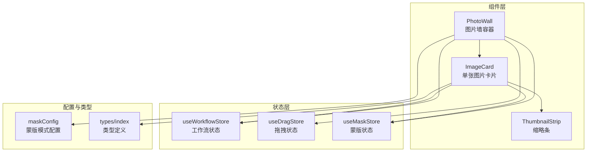
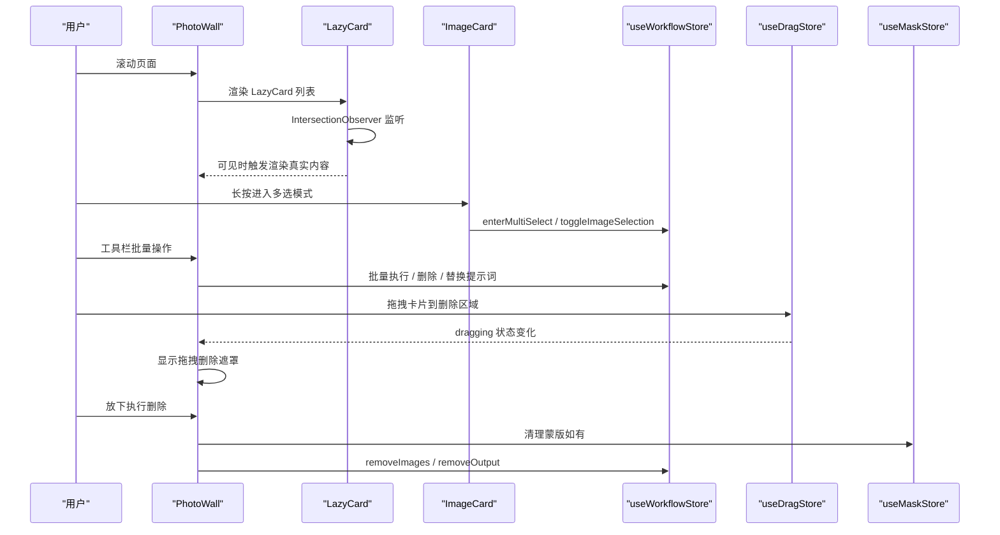
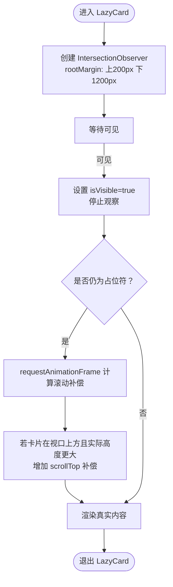
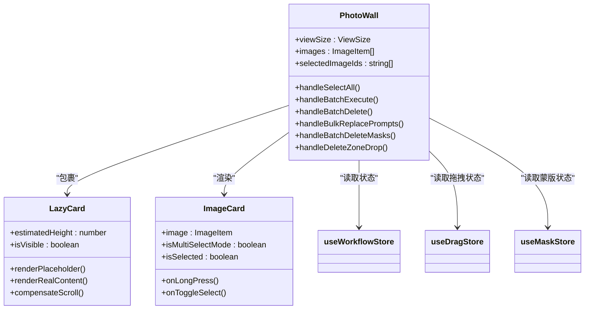
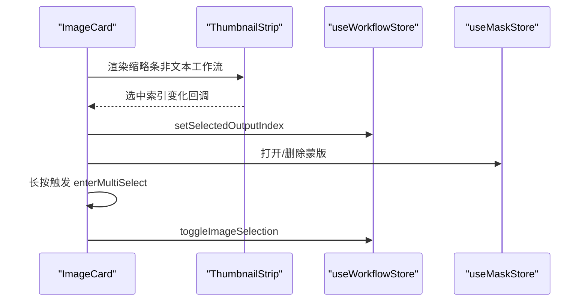
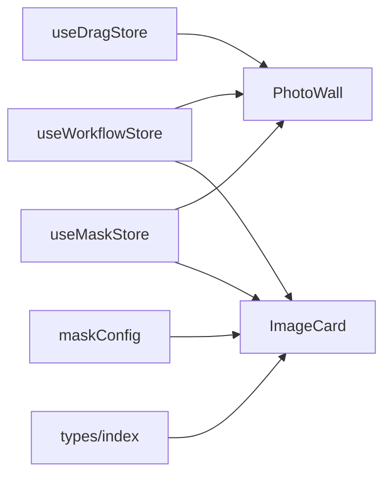
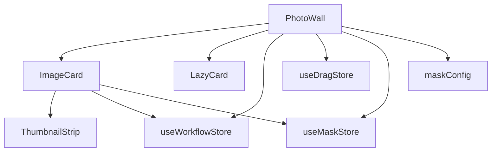

# 图片墙组件 (PhotoWall)

<cite>
**本文档引用的文件**
- [PhotoWall.tsx](file://client/src/components/PhotoWall.tsx)
- [ImageCard.tsx](file://client/src/components/ImageCard.tsx)
- [ThumbnailStrip.tsx](file://client/src/components/ThumbnailStrip.tsx)
- [useWorkflowStore.ts](file://client/src/hooks/useWorkflowStore.ts)
- [useDragStore.ts](file://client/src/hooks/useDragStore.ts)
- [useMaskStore.ts](file://client/src/hooks/useMaskStore.ts)
- [maskConfig.ts](file://client/src/config/maskConfig.ts)
- [index.ts](file://client/src/types/index.ts)
</cite>

## 目录
1. [简介](#简介)
2. [项目结构](#项目结构)
3. [核心组件](#核心组件)
4. [架构总览](#架构总览)
5. [详细组件分析](#详细组件分析)
6. [依赖关系分析](#依赖关系分析)
7. [性能考虑](#性能考虑)
8. [故障排除指南](#故障排除指南)
9. [结论](#结论)
10. [附录](#附录)

## 简介
PhotoWall 是一个高性能的图片瀑布流展示组件，支持响应式列宽、懒加载、多选模式、批量操作与拖拽删除等高级功能。它通过 CSS 多列布局实现瀑布流效果，并结合 IntersectionObserver 与手动滚动补偿策略优化首屏渲染与滚动体验。组件与 ImageCard、ThumbnailStrip、拖拽存储、蒙版存储等模块深度协作，形成完整的图片工作流界面。

## 项目结构
PhotoWall 位于客户端前端代码中，作为主界面的核心展示区域之一，负责组织与渲染当前工作区的图片卡片，并提供多选、批量执行、拖拽删除等交互能力。

**图表来源**
- [PhotoWall.tsx:493-506](file://client/src/components/PhotoWall.tsx#L493-L506)
- [ImageCard.tsx:42-88](file://client/src/components/ImageCard.tsx#L42-L88)
- [useWorkflowStore.ts:96-115](file://client/src/hooks/useWorkflowStore.ts#L96-L115)
- [useDragStore.ts:13-16](file://client/src/hooks/useDragStore.ts#L13-L16)
- [useMaskStore.ts:32-30](file://client/src/hooks/useMaskStore.ts#L32-L30)
- [maskConfig.ts:5-16](file://client/src/config/maskConfig.ts#L5-L16)
- [index.ts:1-58](file://client/src/types/index.ts#L1-L58)

**章节来源**
- [PhotoWall.tsx:103-125](file://client/src/components/PhotoWall.tsx#L103-L125)
- [PhotoWall.tsx:493-506](file://client/src/components/PhotoWall.tsx#L493-L506)

## 核心组件
- PhotoWall：主容器，负责瀑布流布局、懒加载、多选模式、批量操作、拖拽删除与工具栏显示逻辑。
- LazyCard：轻量级懒加载包装器，基于 IntersectionObserver 实现延迟渲染与预加载，配合滚动补偿避免内容跳变。
- ImageCard：单张图片卡片，包含预览、输出叠加、进度覆盖、蒙版菜单、长按多选、拖拽等交互。
- ThumbnailStrip：底部缩略条，用于在非文本工作流中切换原图与生成结果。
- 状态存储：
  - useWorkflowStore：全局工作流状态（图片列表、任务、提示词、选中项等）。
  - useDragStore：拖拽状态（卡片或输出拖拽）。
  - useMaskStore：蒙版数据与编辑器状态。
- 配置与类型：maskConfig 定义各工作流的蒙版模式；types/index 定义图片与任务类型。

**章节来源**
- [PhotoWall.tsx:18-97](file://client/src/components/PhotoWall.tsx#L18-L97)
- [ImageCard.tsx:17-42](file://client/src/components/ImageCard.tsx#L17-L42)
- [useWorkflowStore.ts:35-88](file://client/src/hooks/useWorkflowStore.ts#L35-L88)
- [useDragStore.ts:4-16](file://client/src/hooks/useDragStore.ts#L4-L16)
- [useMaskStore.ts:4-30](file://client/src/hooks/useMaskStore.ts#L4-L30)
- [maskConfig.ts:3-19](file://client/src/config/maskConfig.ts#L3-L19)
- [index.ts:1-58](file://client/src/types/index.ts#L1-L58)

## 架构总览
PhotoWall 采用“容器-展示”分层设计：
- 容器层：PhotoWall 负责数据获取、状态计算、事件处理与布局控制。
- 展示层：LazyCard 负责懒加载与占位符，ImageCard 负责单卡渲染与交互。
- 状态层：通过 zustand store 管理跨组件共享状态。
- 协作层：与 ThumbnailStrip、蒙版系统、拖拽系统协同完成复杂交互。

**图表来源**
- [PhotoWall.tsx:18-97](file://client/src/components/PhotoWall.tsx#L18-L97)
- [PhotoWall.tsx:493-506](file://client/src/components/PhotoWall.tsx#L493-L506)
- [ImageCard.tsx:217-231](file://client/src/components/ImageCard.tsx#L217-L231)
- [useWorkflowStore.ts:117-129](file://client/src/hooks/useWorkflowStore.ts#L117-L129)
- [useDragStore.ts:13-16](file://client/src/hooks/useDragStore.ts#L13-L16)
- [useMaskStore.ts:36-43](file://client/src/hooks/useMaskStore.ts#L36-L43)

## 详细组件分析

### LazyCard 组件（IntersectionObserver 优化与滚动补偿）
LazyCard 是 PhotoWall 中实现“懒加载 + 预加载 + 滚动补偿”的关键模块，其设计目标是：
- 使用 IntersectionObserver 在元素即将进入视口前触发渲染，减少首屏阻塞。
- 通过不对称 rootMargin（上 200px、下 1200px）实现“向上微预加载 + 向下强预加载”，提升滚动流畅度。
- 在占位符转真实内容时进行手动滚动补偿，避免因高度变化导致的视口跳变。

**图表来源**
- [PhotoWall.tsx:28-43](file://client/src/components/PhotoWall.tsx#L28-L43)
- [PhotoWall.tsx:46-70](file://client/src/components/PhotoWall.tsx#L46-L70)

**章节来源**
- [PhotoWall.tsx:18-97](file://client/src/components/PhotoWall.tsx#L18-L97)

### PhotoWall 主容器（瀑布流布局与多选模式）
PhotoWall 通过 CSS 多列布局实现瀑布流效果，并结合以下特性：
- 响应式列宽：通过 VIEW_CONFIG 配置不同视图尺寸的小、中、大三档列宽与估算卡片高度。
- 懒加载卡片：每个卡片外层包裹 LazyCard，仅在接近视口时渲染真实内容。
- 多选模式：长按或点击进入多选，工具栏根据选中状态动态显示批量操作按钮。
- 批量操作：批量执行、批量删除、批量替换提示词、批量删除蒙版。
- 拖拽删除：全局拖拽状态驱动底部删除遮罩显示，放下时清理对应图片与蒙版。

**图表来源**
- [PhotoWall.tsx:99-101](file://client/src/components/PhotoWall.tsx#L99-L101)
- [PhotoWall.tsx:18-97](file://client/src/components/PhotoWall.tsx#L18-L97)
- [PhotoWall.tsx:493-506](file://client/src/components/PhotoWall.tsx#L493-L506)
- [ImageCard.tsx:17-25](file://client/src/components/ImageCard.tsx#L17-L25)

**章节来源**
- [PhotoWall.tsx:103-125](file://client/src/components/PhotoWall.tsx#L103-L125)
- [PhotoWall.tsx:165-266](file://client/src/components/PhotoWall.tsx#L165-L266)
- [PhotoWall.tsx:493-506](file://client/src/components/PhotoWall.tsx#L493-L506)

### ImageCard 组件（与 ThumbnailStrip 协作）
ImageCard 负责单张图片的完整展示与交互，主要特性：
- 预览与输出叠加：根据工作流类型决定是否显示输出覆盖层（图片或视频）。
- 进度覆盖：在排队/处理阶段显示进度覆盖层。
- 蒙版菜单：根据当前工作流的蒙版模式显示/隐藏蒙版编辑入口。
- 缩略条：非文本工作流下显示 ThumbnailStrip，支持原图与生成结果切换与拖拽输出。
- 长按多选：长按触发进入多选模式，点击则切换选中状态。
- 拖拽卡片：支持将整张卡片拖出到外部区域（如删除区域）。

**图表来源**
- [ImageCard.tsx:769-787](file://client/src/components/ImageCard.tsx#L769-L787)
- [ImageCard.tsx:335-365](file://client/src/components/ImageCard.tsx#L335-L365)
- [useWorkflowStore.ts:65-65](file://client/src/hooks/useWorkflowStore.ts#L65-L65)
- [useMaskStore.ts:47-49](file://client/src/hooks/useMaskStore.ts#L47-L49)

**章节来源**
- [ImageCard.tsx:420-800](file://client/src/components/ImageCard.tsx#L420-L800)
- [ThumbnailStrip.tsx:34-61](file://client/src/components/ThumbnailStrip.tsx#L34-L61)

### 状态管理与协作关系
- useWorkflowStore：提供图片列表、任务状态、提示词、选中项、闪动高亮等全局状态，PhotoWall 与 ImageCard 均通过该 store 订阅所需数据。
- useDragStore：统一管理拖拽状态（卡片或输出），PhotoWall 基于该状态显示拖拽删除遮罩。
- useMaskStore：管理蒙版数据与编辑器状态，PhotoWall 在批量删除时清理对应蒙版键值。
- maskConfig：定义各工作流的蒙版模式（A/B/none），影响蒙版菜单与编辑器行为。

**图表来源**
- [useWorkflowStore.ts:96-115](file://client/src/hooks/useWorkflowStore.ts#L96-L115)
- [useDragStore.ts:13-16](file://client/src/hooks/useDragStore.ts#L13-L16)
- [useMaskStore.ts:32-30](file://client/src/hooks/useMaskStore.ts#L32-L30)
- [maskConfig.ts:5-16](file://client/src/config/maskConfig.ts#L5-L16)
- [index.ts:1-58](file://client/src/types/index.ts#L1-L58)

**章节来源**
- [useWorkflowStore.ts:35-88](file://client/src/hooks/useWorkflowStore.ts#L35-L88)
- [useDragStore.ts:4-16](file://client/src/hooks/useDragStore.ts#L4-L16)
- [useMaskStore.ts:4-30](file://client/src/hooks/useMaskStore.ts#L4-L30)
- [maskConfig.ts:3-19](file://client/src/config/maskConfig.ts#L3-L19)
- [index.ts:1-58](file://client/src/types/index.ts#L1-L58)

## 依赖关系分析
PhotoWall 的依赖关系清晰，遵循“低耦合、高内聚”的原则：
- 与 ImageCard 的依赖：通过 props 传递图片数据与交互回调，保持渲染职责单一。
- 与 LazyCard 的依赖：仅依赖其懒加载与占位符渲染能力，不关心内部实现细节。
- 与状态存储的依赖：通过 hooks 订阅所需状态，避免直接访问全局对象。
- 与配置的依赖：通过 VIEW_CONFIG 与 maskConfig 控制布局与功能开关。

**图表来源**
- [PhotoWall.tsx:493-506](file://client/src/components/PhotoWall.tsx#L493-L506)
- [ImageCard.tsx:42-88](file://client/src/components/ImageCard.tsx#L42-L88)
- [ThumbnailStrip.tsx:34-61](file://client/src/components/ThumbnailStrip.tsx#L34-L61)

**章节来源**
- [PhotoWall.tsx:103-125](file://client/src/components/PhotoWall.tsx#L103-L125)
- [ImageCard.tsx:17-42](file://client/src/components/ImageCard.tsx#L17-L42)

## 性能考虑
- 懒加载与预加载：LazyCard 使用不对称 rootMargin，在用户向下滚动时提前渲染，减少空白感；向上微偏移避免不必要的上拉预加载。
- 占位符与滚动补偿：占位符使用最小高度，真实内容渲染后通过 requestAnimationFrame 计算高度差并补偿 scrollTop，避免视口跳变。
- CSS 多列布局：瀑布流由浏览器原生多列布局实现，无需自研排版算法，性能稳定。
- 组件记忆化：LazyCard 与 ImageCard 均使用 memo 包裹，减少不必要的重渲染。
- 状态订阅：通过 useWorkflowStore 的浅订阅（useShallow）降低订阅粒度，避免无关状态变更引发的重渲染。
- 视图配置：VIEW_CONFIG 将列宽与估算高度解耦，便于在不同设备与场景下调整性能与视觉平衡。

**章节来源**
- [PhotoWall.tsx:18-97](file://client/src/components/PhotoWall.tsx#L18-L97)
- [PhotoWall.tsx:12-16](file://client/src/components/PhotoWall.tsx#L12-L16)
- [ImageCard.tsx:27-40](file://client/src/components/ImageCard.tsx#L27-L40)

## 故障排除指南
- 懒加载不生效
  - 检查 LazyCard 的 IntersectionObserver 是否正确创建与断开连接。
  - 确认 rootMargin 设置是否合理，过小可能导致频繁触发，过大可能影响预加载效果。
  - 参考路径：[PhotoWall.tsx:28-43](file://client/src/components/PhotoWall.tsx#L28-L43)
- 内容跳变或滚动位置异常
  - 检查滚动补偿逻辑是否在占位符转真实内容时执行。
  - 确认容器元素是否带有 data-photo-wall-scroll 属性以便定位滚动容器。
  - 参考路径：[PhotoWall.tsx:46-70](file://client/src/components/PhotoWall.tsx#L46-L70)
- 多选模式按钮不可用
  - 确认 isMultiSelectMode 计算逻辑与 selectedImageIds 是否正确更新。
  - 检查 enterMultiSelect 与 toggleImageSelection 的调用链路。
  - 参考路径：[PhotoWall.tsx:139-142](file://client/src/components/PhotoWall.tsx#L139-L142), [useWorkflowStore.ts:117-125](file://client/src/hooks/useWorkflowStore.ts#L117-L125)
- 批量删除未清理蒙版
  - 确认 maskKey 生成规则与删除范围是否覆盖选中图片的所有蒙版键。
  - 参考路径：[PhotoWall.tsx:258-266](file://client/src/components/PhotoWall.tsx#L258-L266), [maskConfig.ts:18-19](file://client/src/config/maskConfig.ts#L18-L19), [useMaskStore.ts:39-43](file://client/src/hooks/useMaskStore.ts#L39-L43)
- 拖拽删除遮罩不显示
  - 检查 useDragStore 的 dragging 状态是否正确设置与清理。
  - 确认 PhotoWall 对 dragging 的监听与 deleteZoneDragCount 的计数逻辑。
  - 参考路径：[useDragStore.ts:13-16](file://client/src/hooks/useDragStore.ts#L13-L16), [PhotoWall.tsx:132-137](file://client/src/components/PhotoWall.tsx#L132-L137), [PhotoWall.tsx:511-574](file://client/src/components/PhotoWall.tsx#L511-L574)

**章节来源**
- [PhotoWall.tsx:28-70](file://client/src/components/PhotoWall.tsx#L28-L70)
- [PhotoWall.tsx:132-137](file://client/src/components/PhotoWall.tsx#L132-L137)
- [PhotoWall.tsx:258-266](file://client/src/components/PhotoWall.tsx#L258-L266)
- [useDragStore.ts:13-16](file://client/src/hooks/useDragStore.ts#L13-L16)
- [maskConfig.ts:18-19](file://client/src/config/maskConfig.ts#L18-L19)
- [useMaskStore.ts:39-43](file://client/src/hooks/useMaskStore.ts#L39-L43)

## 结论
PhotoWall 通过 LazyCard 的 IntersectionObserver 优化、CSS 多列布局与占位符滚动补偿，实现了高性能的图片瀑布流展示。配合多选模式、批量操作与拖拽删除，满足了复杂工作流中的图片管理需求。组件间通过明确的状态订阅与配置约定，保持了良好的可维护性与扩展性。

## 附录

### 使用示例与最佳实践
- 视图大小配置
  - 通过 viewSize 参数选择 small/medium/large，组件会自动应用对应的列宽与估算高度。
  - 参考路径：[PhotoWall.tsx:12-16](file://client/src/components/PhotoWall.tsx#L12-L16), [PhotoWall.tsx:487-490](file://client/src/components/PhotoWall.tsx#L487-L490)
- 事件处理
  - 长按进入多选：在 ImageCard 中触发 enterMultiSelect，随后 PhotoWall 显示工具栏。
  - 批量执行：根据 isMultiSelectMode 与 hasIdleSelected 动态启用执行按钮。
  - 参考路径：[ImageCard.tsx:171-181](file://client/src/components/ImageCard.tsx#L171-L181), [PhotoWall.tsx:165-240](file://client/src/components/PhotoWall.tsx#L165-L240)
- 状态管理
  - 使用 useWorkflowStore 管理图片、任务、提示词与选中项；使用 useDragStore 管理拖拽状态；使用 useMaskStore 管理蒙版数据。
  - 参考路径：[useWorkflowStore.ts:96-115](file://client/src/hooks/useWorkflowStore.ts#L96-L115), [useDragStore.ts:13-16](file://client/src/hooks/useDragStore.ts#L13-L16), [useMaskStore.ts:32-30](file://client/src/hooks/useMaskStore.ts#L32-L30)
- 与其他组件协作
  - 与 ImageCard 协同渲染与交互；与 ThumbnailStrip 协同切换输出；与蒙版系统协作管理蒙版数据。
  - 参考路径：[ImageCard.tsx:769-787](file://client/src/components/ImageCard.tsx#L769-L787), [maskConfig.ts:5-16](file://client/src/config/maskConfig.ts#L5-L16)