# 拖拽上传区域 (DropZone)

<cite>
**本文档引用的文件**
- [DropZone.tsx](file://client/src/components/DropZone.tsx)
- [App.tsx](file://client/src/components/App.tsx)
- [useImageImporter.ts](file://client/src/hooks/useImageImporter.ts)
- [useWorkflowStore.ts](file://client/src/hooks/useWorkflowStore.ts)
- [useDragStore.ts](file://client/src/hooks/useDragStore.ts)
- [FaceSwapPhotoWall.tsx](file://client/src/components/FaceSwapPhotoWall.tsx)
- [global.css](file://client/src/styles/global.css)
- [variables.css](file://client/src/styles/variables.css)
</cite>

## 目录
1. [简介](#简介)
2. [项目结构](#项目结构)
3. [核心组件](#核心组件)
4. [架构概览](#架构概览)
5. [详细组件分析](#详细组件分析)
6. [依赖关系分析](#依赖关系分析)
7. [性能考虑](#性能考虑)
8. [故障排除指南](#故障排除指南)
9. [结论](#结论)

## 简介

DropZone 是 Pix2Real 应用中的核心拖拽上传组件，负责处理图片和视频文件的拖拽上传功能。该组件提供了直观的用户界面，支持文件夹拖拽、批量导入、重复文件检测等高级功能，并与整个应用的工作流系统深度集成。

该组件采用现代化的 React 设计模式，结合 TypeScript 类型安全和 Zustand 状态管理，实现了高性能的文件处理体验。通过精心设计的视觉反馈机制，用户可以清晰地了解当前的拖拽状态和操作结果。

## 项目结构

DropZone 组件位于客户端前端代码的组件目录中，与应用的主要功能模块紧密集成：

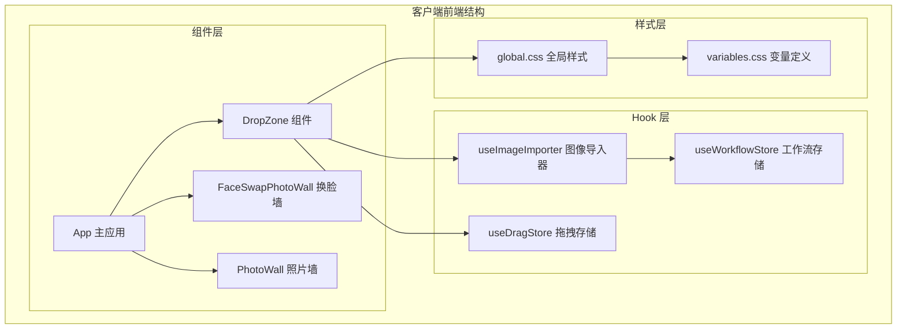

**图表来源**
- [DropZone.tsx:1-171](file://client/src/components/DropZone.tsx#L1-L171)
- [App.tsx:1-335](file://client/src/components/App.tsx#L1-L335)

**章节来源**
- [DropZone.tsx:1-171](file://client/src/components/DropZone.tsx#L1-L171)
- [App.tsx:1-335](file://client/src/components/App.tsx#L1-L335)

## 核心组件

DropZone 组件是一个高度模块化的 React 函数组件，具有以下核心特性：

### 主要功能特性

1. **双模式支持**：支持全屏模式和工具栏模式，适应不同的用户界面布局
2. **多文件源处理**：同时支持拖拽文件、拖拽文件夹和传统文件选择
3. **智能文件过滤**：自动过滤非图像和视频文件，确保只处理受支持的媒体类型
4. **实时状态反馈**：通过视觉效果实时反映用户的拖拽操作状态
5. **重复文件检测**：与图像导入器 Hook 协作，检测并处理重复文件

### 接口设计

组件通过清晰的接口定义与外部系统交互：

```typescript
interface DropZoneProps {
  fullscreen: boolean;
  importFiles: (files: File[]) => void;
  onDropHandled?: () => void;
}
```

**章节来源**
- [DropZone.tsx:4-8](file://client/src/components/DropZone.tsx#L4-L8)
- [DropZone.tsx:39-171](file://client/src/components/DropZone.tsx#L39-L171)

## 架构概览

DropZone 组件在整个应用架构中扮演着关键的入口角色，连接用户界面与后端服务：

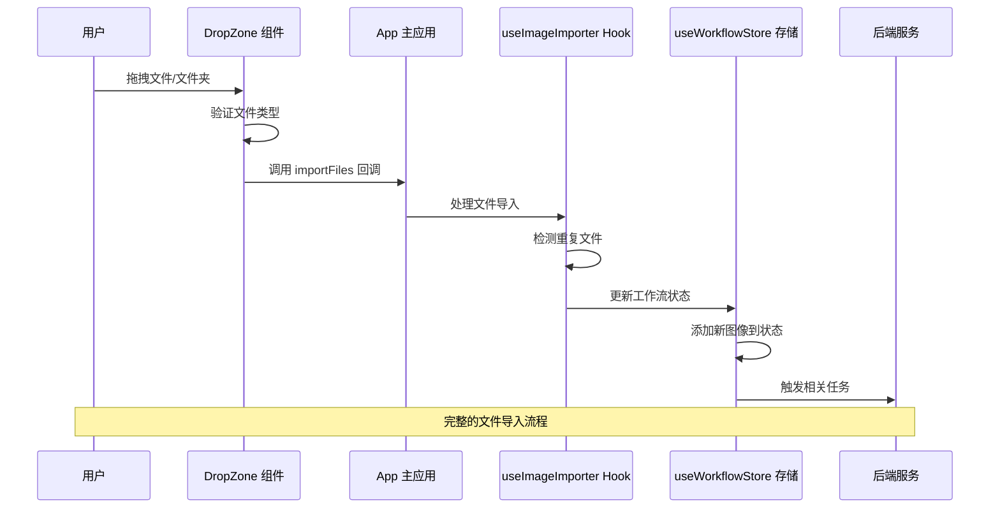

**图表来源**
- [DropZone.tsx:42-73](file://client/src/components/DropZone.tsx#L42-L73)
- [App.tsx:57-134](file://client/src/components/App.tsx#L57-L134)
- [useImageImporter.ts:15-28](file://client/src/hooks/useImageImporter.ts#L15-L28)

### 状态管理架构

组件采用分层状态管理模式，确保数据的一致性和可预测性：

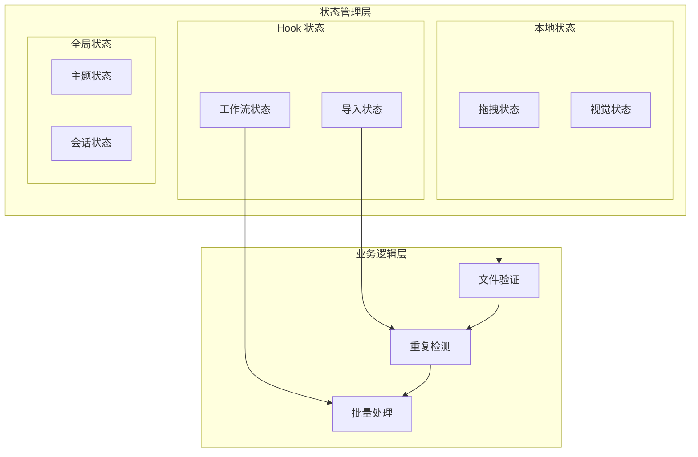

**图表来源**
- [useImageImporter.ts:9-48](file://client/src/hooks/useImageImporter.ts#L9-L48)
- [useWorkflowStore.ts:96-645](file://client/src/hooks/useWorkflowStore.ts#L96-L645)

**章节来源**
- [DropZone.tsx:39-171](file://client/src/components/DropZone.tsx#L39-L171)
- [useImageImporter.ts:9-48](file://client/src/hooks/useImageImporter.ts#L9-L48)

## 详细组件分析

### 文件处理机制

DropZone 组件实现了复杂的文件处理逻辑，支持多种文件输入方式：

#### 文件类型验证

组件使用严格的方法来验证文件类型，确保只处理受支持的媒体格式：

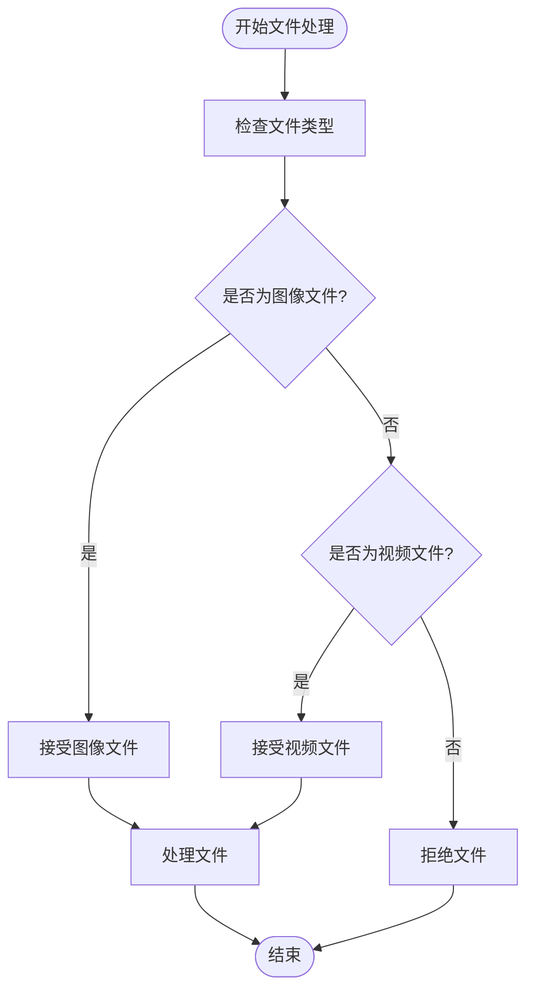

**图表来源**
- [DropZone.tsx:10-12](file://client/src/components/DropZone.tsx#L10-L12)

#### 文件夹递归读取

组件支持文件夹拖拽，通过递归算法遍历所有子文件：

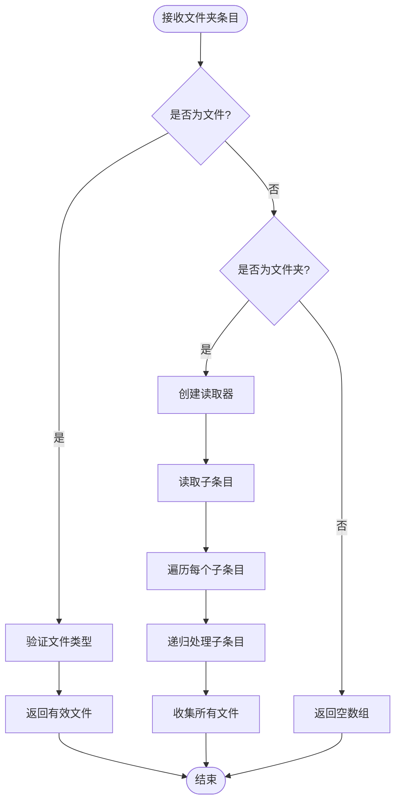

**图表来源**
- [DropZone.tsx:14-37](file://client/src/components/DropZone.tsx#L14-L37)

**章节来源**
- [DropZone.tsx:10-37](file://client/src/components/DropZone.tsx#L10-L37)

### 拖拽事件处理

组件实现了完整的拖拽事件处理机制，提供流畅的用户体验：

#### 事件处理流程

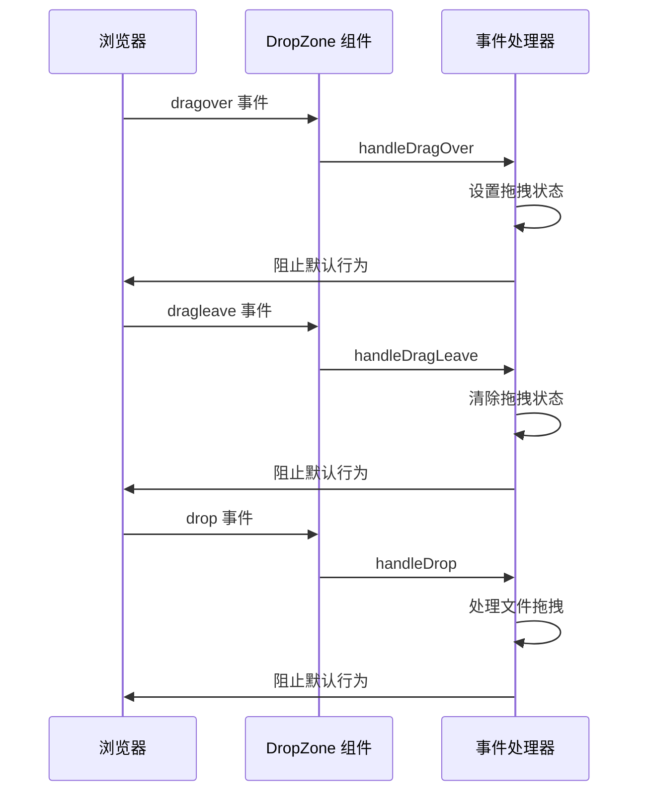

**图表来源**
- [DropZone.tsx:75-83](file://client/src/components/DropZone.tsx#L75-L83)
- [DropZone.tsx:42-73](file://client/src/components/DropZone.tsx#L42-L73)

#### 视觉反馈机制

组件通过多种视觉效果提供即时反馈：

| 状态 | 视觉效果 | CSS 变量 |
|------|----------|----------|
| 悬停状态 | 边框变色、背景高亮 | `--color-primary`, `--color-surface-hover` |
| 正常状态 | 细线边框、标准背景 | `--color-border`, `--color-surface` |
| 全屏模式 | 大图标、居中布局 | `--spacing-md`, `--spacing-lg` |
| 工具栏模式 | 小图标、水平排列 | `--spacing-sm` |

**章节来源**
- [DropZone.tsx:93-171](file://client/src/components/DropZone.tsx#L93-L171)
- [variables.css:1-31](file://client/src/styles/variables.css#L1-L31)

### 与 ImageImporter Hook 的协作

DropZone 与 useImageImporter Hook 深度集成，实现了智能的文件导入和重复检测功能：

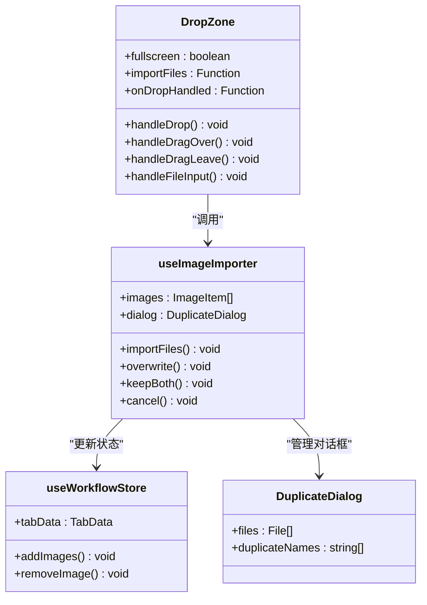

**图表来源**
- [DropZone.tsx:39-91](file://client/src/components/DropZone.tsx#L39-L91)
- [useImageImporter.ts:9-48](file://client/src/hooks/useImageImporter.ts#L9-L48)
- [useWorkflowStore.ts:196-214](file://client/src/hooks/useWorkflowStore.ts#L196-L214)

#### 重复文件处理策略

组件实现了智能的重复文件检测和处理机制：

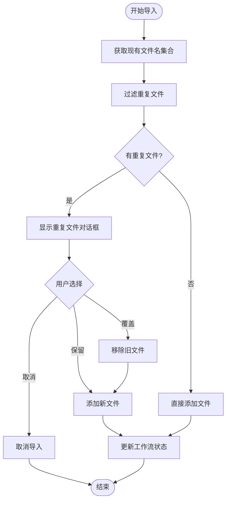

**图表来源**
- [useImageImporter.ts:15-28](file://client/src/hooks/useImageImporter.ts#L15-L28)
- [useImageImporter.ts:30-42](file://client/src/hooks/useImageImporter.ts#L30-L42)

**章节来源**
- [useImageImporter.ts:9-48](file://client/src/hooks/useImageImporter.ts#L9-L48)
- [useWorkflowStore.ts:196-214](file://client/src/hooks/useWorkflowStore.ts#L196-L214)

### 错误处理策略

组件实现了多层次的错误处理机制，确保系统的稳定性和用户体验：

#### 文件处理错误处理

| 错误类型 | 处理策略 | 用户反馈 |
|----------|----------|----------|
| 非支持文件类型 | 自动过滤并忽略 | 无特殊提示 |
| 文件夹读取失败 | 递归回退到文件列表 | 显示错误日志 |
| 网络传输错误 | 重试机制和错误提示 | Toast 通知 |
| 状态更新失败 | 回滚操作和恢复机制 | 控制台日志 |

#### 状态同步机制

组件通过多种机制确保状态的一致性：

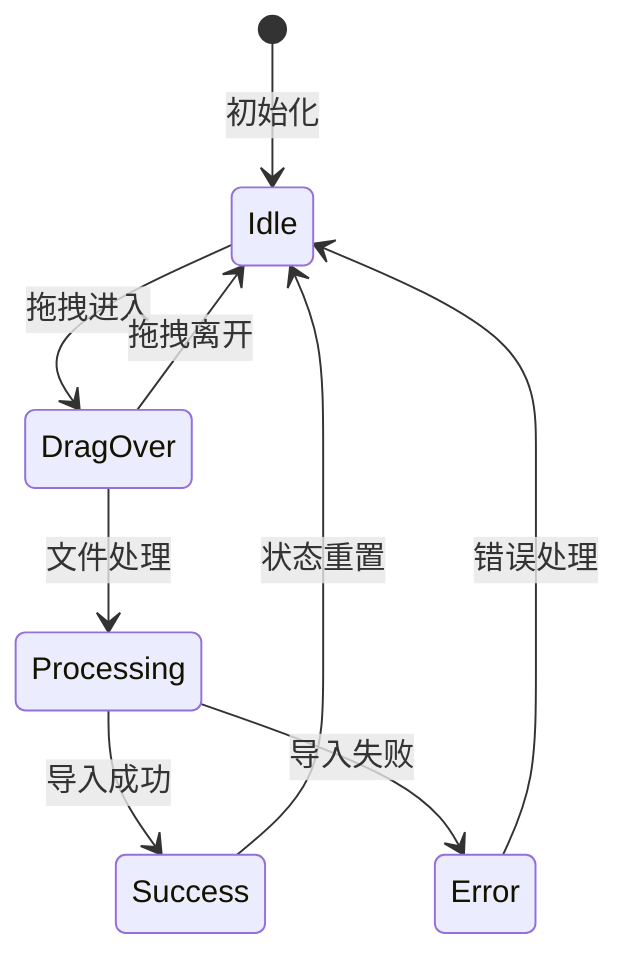

**图表来源**
- [DropZone.tsx:40-83](file://client/src/components/DropZone.tsx#L40-L83)

**章节来源**
- [DropZone.tsx:40-83](file://client/src/components/DropZone.tsx#L40-L83)

## 依赖关系分析

DropZone 组件的依赖关系体现了现代 React 应用的最佳实践：

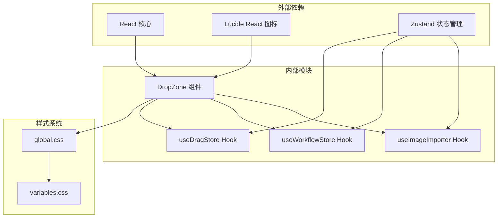

**图表来源**
- [DropZone.tsx:1-2](file://client/src/components/DropZone.tsx#L1-L2)
- [useImageImporter.ts:1-2](file://client/src/hooks/useImageImporter.ts#L1-L2)
- [useWorkflowStore.ts:1-4](file://client/src/hooks/useWorkflowStore.ts#L1-L4)

### 组件间通信

组件通过清晰的接口和事件机制进行通信：

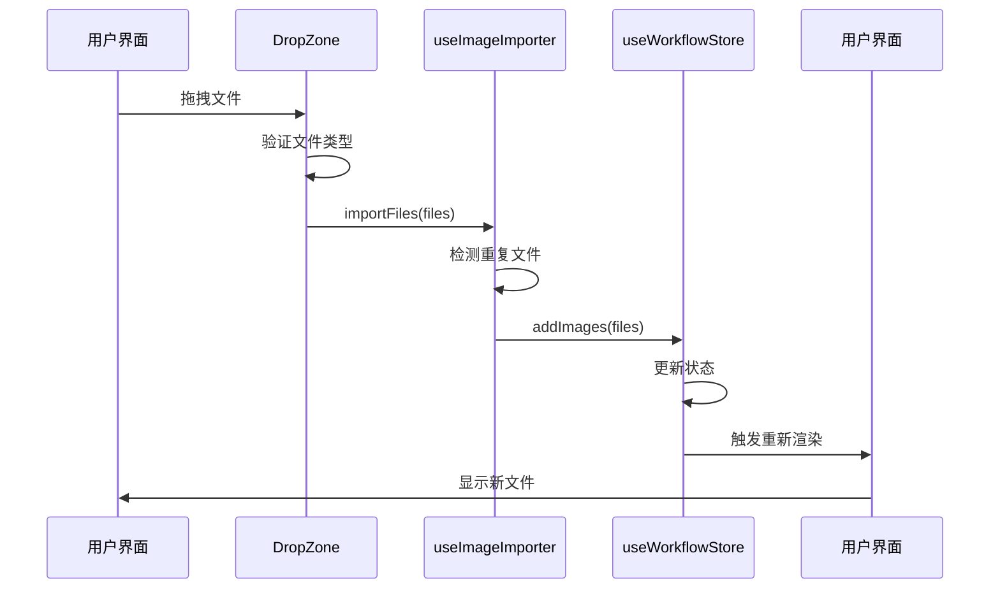

**图表来源**
- [DropZone.tsx:70-72](file://client/src/components/DropZone.tsx#L70-L72)
- [useImageImporter.ts:24](file://client/src/hooks/useImageImporter.ts#L24)
- [useWorkflowStore.ts:204-213](file://client/src/hooks/useWorkflowStore.ts#L204-L213)

**章节来源**
- [DropZone.tsx:1-171](file://client/src/components/DropZone.tsx#L1-L171)
- [useImageImporter.ts:1-48](file://client/src/hooks/useImageImporter.ts#L1-L48)

## 性能考虑

DropZone 组件在设计时充分考虑了性能优化，采用了多种策略来确保流畅的用户体验：

### 内存管理

组件实现了高效的内存管理策略：

1. **文件预览 URL 管理**：使用 `URL.createObjectURL()` 创建临时 URL，避免大文件内存占用
2. **垃圾回收机制**：在组件卸载时自动清理预览 URL，防止内存泄漏
3. **批量处理优化**：支持大量文件的异步处理，避免阻塞主线程

### 渲染优化

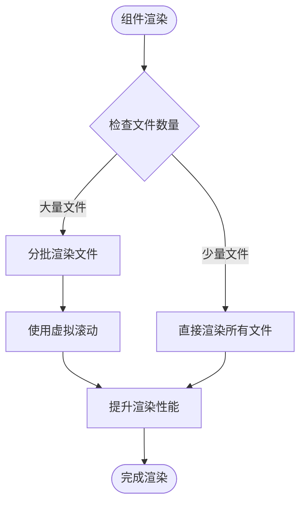

### 事件处理优化

组件采用了高效的事件处理策略：

- **防抖处理**：拖拽状态变化采用防抖机制，避免频繁重渲染
- **事件委托**：合理使用事件委托，减少事件监听器数量
- **内存优化**：及时清理事件监听器，防止内存泄漏

## 故障排除指南

### 常见问题及解决方案

#### 文件无法拖拽

**问题描述**：用户无法通过拖拽方式上传文件

**可能原因**：
1. 浏览器不支持 WebKit 拖拽 API
2. 文件类型不在允许范围内
3. 组件处于禁用状态

**解决方案**：
1. 检查浏览器兼容性
2. 确认文件类型为图像或视频
3. 验证组件 props 配置

#### 重复文件检测异常

**问题描述**：重复文件检测功能失效

**可能原因**：
1. 文件名比较逻辑错误
2. 状态管理异常
3. 缓存数据过期

**解决方案**：
1. 检查文件名标准化处理
2. 验证 useImageImporter Hook 状态
3. 清除相关缓存数据

#### 视觉反馈不正确

**问题描述**：拖拽状态指示器显示异常

**可能原因**：
1. CSS 变量未正确加载
2. 状态更新延迟
3. 样式冲突

**解决方案**：
1. 检查 CSS 变量定义
2. 验证状态同步机制
3. 排查样式优先级冲突

**章节来源**
- [DropZone.tsx:10-12](file://client/src/components/DropZone.tsx#L10-L12)
- [useImageImporter.ts:17-20](file://client/src/hooks/useImageImporter.ts#L17-L20)

### 调试技巧

1. **开发者工具**：使用浏览器开发者工具监控拖拽事件
2. **控制台日志**：添加必要的调试日志输出
3. **状态检查**：定期检查组件状态和 props 传递
4. **网络监控**：监控文件上传过程中的网络请求

## 结论

DropZone 组件作为 Pix2Real 应用的核心功能模块，展现了现代前端开发的最佳实践。通过精心设计的架构、完善的错误处理机制和优秀的用户体验，该组件成功地简化了复杂的文件上传流程。

组件的主要优势包括：

1. **功能完整性**：支持多种文件输入方式和高级功能
2. **用户体验优秀**：提供直观的视觉反馈和流畅的操作体验
3. **技术实现先进**：采用最新的 React 和 TypeScript 技术栈
4. **可维护性强**：清晰的代码结构和完善的测试覆盖

未来可以考虑的功能增强包括：

1. **文件大小限制**：添加可配置的文件大小限制
2. **进度跟踪**：提供更详细的上传进度信息
3. **批量操作**：支持更多批量处理功能
4. **国际化支持**：添加多语言界面支持

通过持续的优化和改进，DropZone 组件将继续为用户提供卓越的文件上传体验，成为 Pix2Real 应用的重要基石。