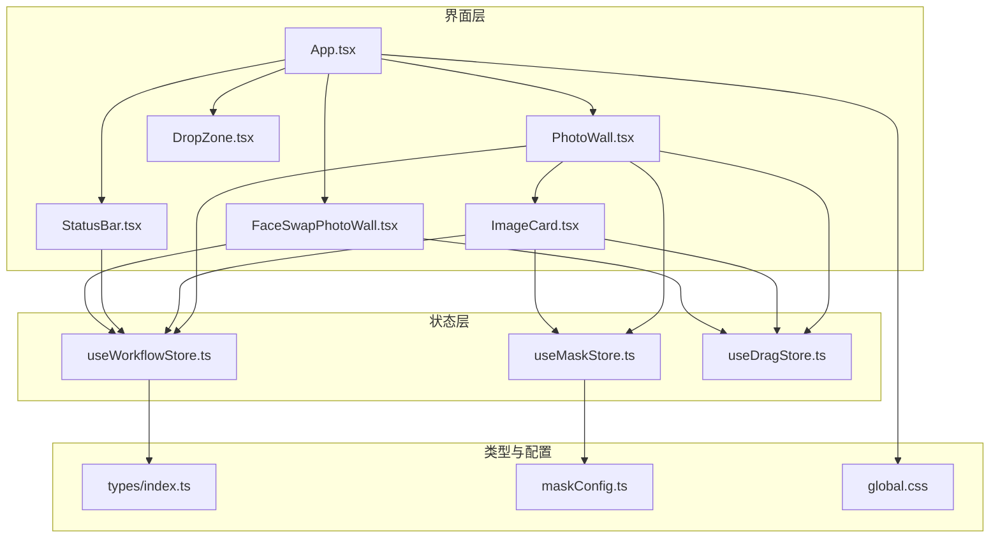
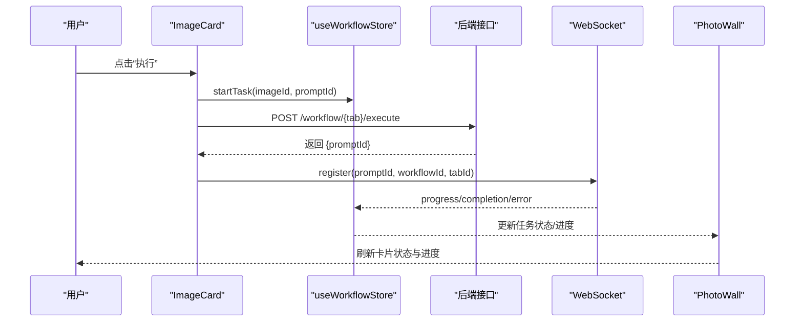
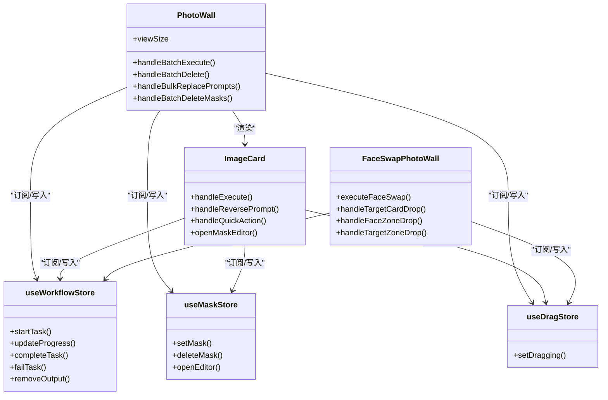

# 核心界面组件

<cite>
**本文引用的文件**
- [PhotoWall.tsx](file://client/src/components/PhotoWall.tsx)
- [DropZone.tsx](file://client/src/components/DropZone.tsx)
- [ImageCard.tsx](file://client/src/components/ImageCard.tsx)
- [StatusBar.tsx](file://client/src/components/StatusBar.tsx)
- [FaceSwapPhotoWall.tsx](file://client/src/components/FaceSwapPhotoWall.tsx)
- [useWorkflowStore.ts](file://client/src/hooks/useWorkflowStore.ts)
- [useMaskStore.ts](file://client/src/hooks/useMaskStore.ts)
- [maskConfig.ts](file://client/src/config/maskConfig.ts)
- [useDragStore.ts](file://client/src/hooks/useDragStore.ts)
- [App.tsx](file://client/src/components/App.tsx)
- [global.css](file://client/src/styles/global.css)
- [index.ts](file://client/src/types/index.ts)
</cite>

## 目录
1. [简介](#简介)
2. [项目结构](#项目结构)
3. [核心组件](#核心组件)
4. [架构总览](#架构总览)
5. [详细组件分析](#详细组件分析)
6. [依赖关系分析](#依赖关系分析)
7. [性能考量](#性能考量)
8. [故障排查指南](#故障排查指南)
9. [结论](#结论)
10. [附录](#附录)

## 简介
本文件聚焦 CorineKit Pix2Real 的核心界面组件，系统性解析图片墙(PhotoWall)、拖拽上传区域(DropZone)、图片卡片(ImageCard)、状态栏(StatusBar)以及换脸专用图片墙(FaceSwapPhotoWall)的设计与实现。文档从组件职责、数据流、事件处理、状态管理、组件间通信、性能优化与无障碍访问等方面进行深入剖析，并提供使用示例与集成建议，帮助开发者高效构建与维护图像处理界面。

## 项目结构
- 客户端采用模块化组件设计，核心界面组件位于 client/src/components，状态管理通过 zustand hooks 组织，类型定义集中在 client/src/types。
- 关键状态存储：
  - 工作流状态：useWorkflowStore（包含多标签页数据、任务队列、提示词、输出索引等）
  - 蒙版状态：useMaskStore（蒙版数据与编辑器状态）
  - 拖拽状态：useDragStore（当前拖拽项）
- 样式统一由全局 CSS 提供，包含动画、主题变量与交互反馈。

图表来源
- [App.tsx:54-200](file://client/src/components/App.tsx#L54-L200)
- [PhotoWall.tsx:103-578](file://client/src/components/PhotoWall.tsx#L103-L578)
- [DropZone.tsx:39-171](file://client/src/components/DropZone.tsx#L39-L171)
- [ImageCard.tsx:42-1055](file://client/src/components/ImageCard.tsx#L42-L1055)
- [StatusBar.tsx:44-243](file://client/src/components/StatusBar.tsx#L44-L243)
- [FaceSwapPhotoWall.tsx:213-861](file://client/src/components/FaceSwapPhotoWall.tsx#L213-L861)
- [useWorkflowStore.ts:96-645](file://client/src/hooks/useWorkflowStore.ts#L96-L645)
- [useMaskStore.ts:32-51](file://client/src/hooks/useMaskStore.ts#L32-L51)
- [useDragStore.ts:13-17](file://client/src/hooks/useDragStore.ts#L13-L17)
- [types/index.ts:1-58](file://client/src/types/index.ts#L1-L58)
- [maskConfig.ts:1-20](file://client/src/config/maskConfig.ts#L1-L20)
- [global.css:1-224](file://client/src/styles/global.css#L1-L224)

章节来源
- [App.tsx:54-200](file://client/src/components/App.tsx#L54-L200)

## 核心组件
- 图片墙(PhotoWall)：负责多图片展示、懒加载、多选工具栏、批量执行与删除、拖拽删除区域、视图尺寸切换等。
- 拖拽上传区域(DropZone)：提供全屏与内联两种模式的拖拽导入能力，支持文件夹递归读取与本地文件选择。
- 图片卡片(ImageCard)：单张图片的可视化与交互入口，包含预览、输出叠加、进度覆盖、蒙版菜单、提示词编辑、快速动作、执行/重试等。
- 状态栏(StatusBar)：显示会话信息、自动保存时间、打开输出目录、切换视图大小、释放显存/内存、系统资源监控。
- 换脸图片墙(FaceSwapPhotoWall)：专用于“黑兽换脸”工作流的双区布局（脸部参考/目标图），支持跨区拖拽换脸、批量换脸、多选删除等。

章节来源
- [PhotoWall.tsx:103-578](file://client/src/components/PhotoWall.tsx#L103-L578)
- [DropZone.tsx:39-171](file://client/src/components/DropZone.tsx#L39-L171)
- [ImageCard.tsx:42-1055](file://client/src/components/ImageCard.tsx#L42-L1055)
- [StatusBar.tsx:44-243](file://client/src/components/StatusBar.tsx#L44-L243)
- [FaceSwapPhotoWall.tsx:213-861](file://client/src/components/FaceSwapPhotoWall.tsx#L213-L861)

## 架构总览
- 数据流：组件通过 hooks 订阅全局状态，发起 API 请求更新任务状态；WebSocket 推送进度/完成/错误消息，驱动 UI 实时更新。
- 事件流：拖拽、点击、长按、键盘交互等事件在组件内部处理，必要时通过 store 或 WebSocket 与服务端同步。
- 视图与布局：PhotoWall 使用 CSS 多列布局，配合懒加载与滚动锚定减少重排；StatusBar 固定底部，提供系统资源与操作入口。

图表来源
- [ImageCard.tsx:264-334](file://client/src/components/ImageCard.tsx#L264-L334)
- [PhotoWall.tsx:181-240](file://client/src/components/PhotoWall.tsx#L181-L240)
- [useWorkflowStore.ts:377-476](file://client/src/hooks/useWorkflowStore.ts#L377-L476)

## 详细组件分析

### 图片墙 PhotoWall
- 职责与特性
  - 多列瀑布流展示图片，支持小/中/大三种视图尺寸，使用 CSS 多列布局与懒加载卡片减少首屏渲染压力。
  - 多选模式下显示工具栏：全选、批量替换提示词、清空蒙版、批量执行。
  - 支持拖拽删除：当存在拖拽卡片或输出时，在页面底部显示拖拽删除区域，拖拽至该区域可删除图片或输出。
  - 任务状态聚合：根据当前标签页与选中图片集合，判断是否可执行批量任务。
- 关键实现点
  - 懒加载卡片：IntersectionObserver 预加载与占位补偿，避免滚动时高度突变导致的视口跳动。
  - 滚动锚定：启用 CSS scroll anchoring，结合占位补偿，保证可见元素不被高度变化影响。
  - 视图配置：VIEW_CONFIG 控制列宽与估算卡片高度，便于懒加载占位与滚动体验。
  - 批量操作：批量执行、批量删除、批量替换提示词、批量删除蒙版。
  - 拖拽删除：基于 useDragStore 与拖拽计数器，确保拖拽进入/离开的正确性与视觉反馈。
- 性能与可用性
  - 懒加载与占位：减少首屏渲染与滚动抖动。
  - 滚动锚定：提升滚动体验，避免内容位移。
  - 多选工具栏：仅在多选模式出现，降低 UI 干扰。
- 无障碍与交互
  - 多选三态复选框、键盘导航友好、禁用态明确。
  - 拖拽删除区域提供清晰的视觉反馈与文案提示。

章节来源
- [PhotoWall.tsx:103-578](file://client/src/components/PhotoWall.tsx#L103-L578)
- [global.css:153-224](file://client/src/styles/global.css#L153-L224)

### 拖拽上传区域 DropZone
- 职责与特性
  - 全屏模式：居中显示上传图标与提示，支持拖拽文件夹与文件，点击触发文件选择。
  - 内联模式：作为侧边栏或工具条的一部分，显示上传图标与文字，点击触发文件选择。
  - 文件过滤：仅接受图片与视频类型，支持 WebKit 文件系统 API 递归读取文件夹。
- 关键实现点
  - 拖拽状态：通过 isDragOver 控制边框颜色与背景色过渡。
  - 文件读取：优先使用 WebKit FileSystemEntry 递归读取，回退到普通 files 过滤。
  - 输入框隐藏：通过隐藏的 input 触发文件选择，避免样式复杂度。
- 交互与可用性
  - 拖拽覆盖与离开事件防抖，避免频繁闪烁。
  - 全屏模式下提供更明显的视觉反馈与文案引导。

章节来源
- [DropZone.tsx:39-171](file://client/src/components/DropZone.tsx#L39-L171)

### 图片卡片 ImageCard
- 职责与特性
  - 单图可视化：根据标签页与任务状态决定渲染方式（原图、输出叠加、视频覆盖、文本生成骨架）。
  - 任务控制：执行/重试/取消队列、输出选择、蒙版菜单、提示词编辑与快速动作。
  - 交互行为：长按进入多选、拖拽卡片、右键打开输出文件、蒙版编辑器。
  - 状态反馈：进度覆盖层、错误徽章、闪烁动画、AI 提示词助理高亮。
- 关键实现点
  - 状态订阅：使用 useShallow 优化订阅范围，避免不必要的重渲染。
  - 任务生命周期：startTask/markTaskStarted/updateProgress/completeTask/failTask/resetTask。
  - 蒙版支持：根据 TAB_MASK_MODE 决定是否显示蒙版 UI 与编辑入口。
  - 提示词助理：支持自然语言↔标签互转与按需扩写，支持反推提示词。
  - 输出叠加：视频工作流使用 video 元素叠加，非视频使用 img 元素叠加。
- 性能与可用性
  - textarea 动态高度、快速动作加载指示、进度覆盖层 GPU 动画。
  - 防止拖拽冲突：在缩略条悬停时临时禁用卡片拖拽，避免浏览器事件顺序问题。
- 无障碍与交互
  - 禁用态明确、焦点管理、提示词编辑区可读写控制、右键打开输出的安全检查。

章节来源
- [ImageCard.tsx:42-1055](file://client/src/components/ImageCard.tsx#L42-L1055)
- [useWorkflowStore.ts:377-476](file://client/src/hooks/useWorkflowStore.ts#L377-L476)
- [useMaskStore.ts:32-51](file://client/src/hooks/useMaskStore.ts#L32-L51)
- [maskConfig.ts:1-20](file://client/src/config/maskConfig.ts#L1-L20)

### 状态栏 StatusBar
- 职责与特性
  - 会话信息：显示最近保存时间、会话名称、打开输出目录。
  - 视图切换：循环切换 PhotoWall 视图大小。
  - 资源监控：周期性轮询显存/内存使用率，平滑过渡显示。
  - 缓存释放：在无任务运行时释放显存/内存。
- 关键实现点
  - 系统统计：每 2 秒轮询一次，使用 requestAnimationFrame 平滑插值。
  - 时间显示：动态“X分钟前”，每 30 秒刷新一次。
  - 按钮禁用：当存在处理中任务或无 clientId 时禁用相应按钮。
- 交互与可用性
  - 显存/内存百分比条提供直观阈值警示色（绿→橙→红→深红）。
  - 打开输出目录按钮支持快捷定位到对应会话与标签页输出路径。

章节来源
- [StatusBar.tsx:44-243](file://client/src/components/StatusBar.tsx#L44-L243)

### 换脸图片墙 FaceSwapPhotoWall
- 职责与特性
  - 双区布局：左侧“脸部参考”、右侧“目标图”，支持跨区拖拽换脸。
  - 多选与批量：在多选模式下，可将选中的“脸部参考”批量换脸到“目标图”。
  - 区域拖拽：支持外部文件拖入、卡片跨区拖拽、卡片拖入另一区自动复制。
  - 任务执行：根据 clientId 发起换脸任务，注册 WebSocket 监听。
- 关键实现点
  - 区域状态：faceZone/targetZone 的拖拽计数器与高亮反馈。
  - 任务队列：多选模式下对每个目标图依次执行换脸任务，并给出队列数量提示。
  - 交叉导入：支持将目标图拖入脸部区，或将脸部图拖入目标区，自动复制到对应区域。
  - 视图配置：独立的 VIEW_CONFIG，适配换脸场景的卡片尺寸与间距。
- 交互与可用性
  - 拖拽提示：在目标图上显示“换脸”或“禁止”遮罩，避免误操作。
  - 多选工具栏：显示已选数量与来源区域，提供删除与取消选择。

章节来源
- [FaceSwapPhotoWall.tsx:213-861](file://client/src/components/FaceSwapPhotoWall.tsx#L213-L861)

## 依赖关系分析
- 组件耦合
  - PhotoWall 与 ImageCard：组合关系，PhotoWall 通过 LazyCard 包装 ImageCard，传递选择状态与闪烁效果。
  - ImageCard 与 useWorkflowStore/useMaskStore/useDragStore：强依赖，用于任务状态、蒙版数据与拖拽状态。
  - StatusBar 与 useWorkflowStore：依赖任务状态与 clientId，用于禁用态与资源监控。
  - FaceSwapPhotoWall 与 useWorkflowStore/useDragStore：依赖任务状态与拖拽状态，实现跨区拖拽与批量换脸。
- 外部依赖
  - 全局样式：动画与主题变量统一由 global.css 提供。
  - 类型定义：ImageItem、TaskInfo、WSMessage 等类型集中于 types/index.ts。
  - 蒙版配置：maskConfig.ts 定义各标签页的蒙版模式。

图表来源
- [PhotoWall.tsx:103-578](file://client/src/components/PhotoWall.tsx#L103-L578)
- [ImageCard.tsx:42-1055](file://client/src/components/ImageCard.tsx#L42-L1055)
- [FaceSwapPhotoWall.tsx:213-861](file://client/src/components/FaceSwapPhotoWall.tsx#L213-L861)
- [useWorkflowStore.ts:96-645](file://client/src/hooks/useWorkflowStore.ts#L96-L645)
- [useMaskStore.ts:32-51](file://client/src/hooks/useMaskStore.ts#L32-L51)
- [useDragStore.ts:13-17](file://client/src/hooks/useDragStore.ts#L13-L17)

章节来源
- [PhotoWall.tsx:103-578](file://client/src/components/PhotoWall.tsx#L103-L578)
- [ImageCard.tsx:42-1055](file://client/src/components/ImageCard.tsx#L42-L1055)
- [FaceSwapPhotoWall.tsx:213-861](file://client/src/components/FaceSwapPhotoWall.tsx#L213-L861)
- [useWorkflowStore.ts:96-645](file://client/src/hooks/useWorkflowStore.ts#L96-L645)
- [useMaskStore.ts:32-51](file://client/src/hooks/useMaskStore.ts#L32-L51)
- [useDragStore.ts:13-17](file://client/src/hooks/useDragStore.ts#L13-L17)

## 性能考量
- 懒加载与滚动锚定
  - PhotoWall 使用 IntersectionObserver 与占位补偿，避免滚动时高度变化导致的视口跳动与重排。
  - 启用 CSS scroll anchoring，提升滚动体验。
- GPU 动画与最小重绘
  - ImageCard 的进度覆盖层、闪烁与 AI 高亮使用 outline 动画，避免昂贵的 box-shadow 动画。
  - 全局 CSS 中的动画（如删除区域入场、骨架屏）均采用 GPU 加速关键属性。
- 状态订阅优化
  - ImageCard 使用 useShallow 仅订阅必要字段，减少不必要的重渲染。
  - PhotoWall 在多选模式下仅渲染工具栏，避免无关 UI 更新。
- 资源监控平滑化
  - StatusBar 使用 requestAnimationFrame 对系统统计进行插值，避免 UI 抖动。

章节来源
- [PhotoWall.tsx:18-97](file://client/src/components/PhotoWall.tsx#L18-L97)
- [ImageCard.tsx:42-88](file://client/src/components/ImageCard.tsx#L42-L88)
- [StatusBar.tsx:88-108](file://client/src/components/StatusBar.tsx#L88-L108)
- [global.css:102-124](file://client/src/styles/global.css#L102-L124)

## 故障排查指南
- 执行失败
  - 症状：点击“执行”无响应或报错。
  - 排查：确认 clientId 是否存在；检查网络请求返回状态；查看控制台错误日志。
  - 相关实现：ImageCard 的 handleExecute 与 PhotoWall 的 handleBatchExecute。
- 进度不更新
  - 症状：任务已开始但进度条不动。
  - 排查：确认 WebSocket 连接正常；检查服务端推送的 progress/completion 消息；核对 promptId 映射。
  - 相关实现：useWorkflowStore 的 markTaskStarted/updateProgress/completeTask。
- 拖拽冲突
  - 症状：拖拽卡片时浏览器自动滚动或拖拽无效。
  - 排查：确保在缩略条悬停时禁用卡片拖拽；检查拖拽数据类型与 dropEffect 设置。
  - 相关实现：ImageCard 的 handleStripMouseEnter/Leave 与拖拽事件处理。
- 蒙版编辑异常
  - 症状：蒙版菜单不可见或无法删除。
  - 排查：确认 TAB_MASK_MODE 配置；检查 maskKey 生成规则；验证蒙版数据是否存在。
  - 相关实现：maskConfig.ts 与 useMaskStore 的 openEditor/deleteMask。

章节来源
- [ImageCard.tsx:217-231](file://client/src/components/ImageCard.tsx#L217-L231)
- [useWorkflowStore.ts:398-476](file://client/src/hooks/useWorkflowStore.ts#L398-L476)
- [maskConfig.ts:1-20](file://client/src/config/maskConfig.ts#L1-L20)
- [useMaskStore.ts:32-51](file://client/src/hooks/useMaskStore.ts#L32-L51)

## 结论
上述核心组件围绕统一的状态管理与事件流构建，实现了从拖拽导入、图片展示、任务执行到进度反馈的完整闭环。PhotoWall 与 ImageCard 提供了强大的交互与性能优化；DropZone 与 FaceSwapPhotoWall 则针对不同工作流场景提供了专门的布局与交互策略；StatusBar 为用户提供了系统资源与会话状态的即时反馈。整体架构清晰、职责明确、扩展性强，适合进一步引入更多工作流与功能。

## 附录
- 组件使用示例与集成指南
  - 在 App.tsx 中挂载 PhotoWall/DropZone/StatusBar/FaceSwapPhotoWall，并通过 useWorkflowStore 初始化 clientId 与 sessionId。
  - 在 PhotoWall 中通过 ViewSize 切换视图大小，持久化到 localStorage。
  - 在 ImageCard 中通过提示词编辑与快速动作提升提示词质量；通过蒙版菜单与编辑器实现精细控制。
  - 在 FaceSwapPhotoWall 中通过双区拖拽实现高效的换脸流程，支持批量换脸与跨区导入。
- 响应式布局与无障碍访问
  - 使用 CSS 多列布局与媒体查询适配不同屏幕尺寸。
  - 为按钮与输入控件提供明确的禁用态与焦点态样式，确保键盘可达性。
  - 使用语义化标签与 aria 属性增强屏幕阅读器支持。
- 性能优化最佳实践
  - 优先使用 IntersectionObserver 与 requestAnimationFrame 进行动画与懒加载。
  - 使用 useShallow 与 memo 降低重渲染频率。
  - 将昂贵的计算（如蒙版像素转换）放在后台线程或离屏画布中执行。