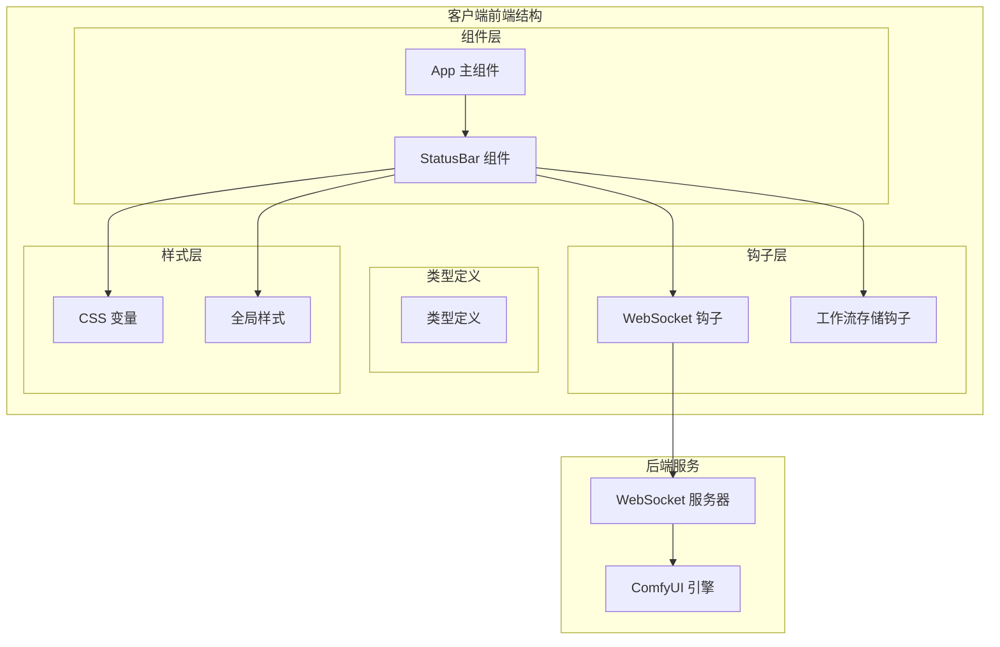
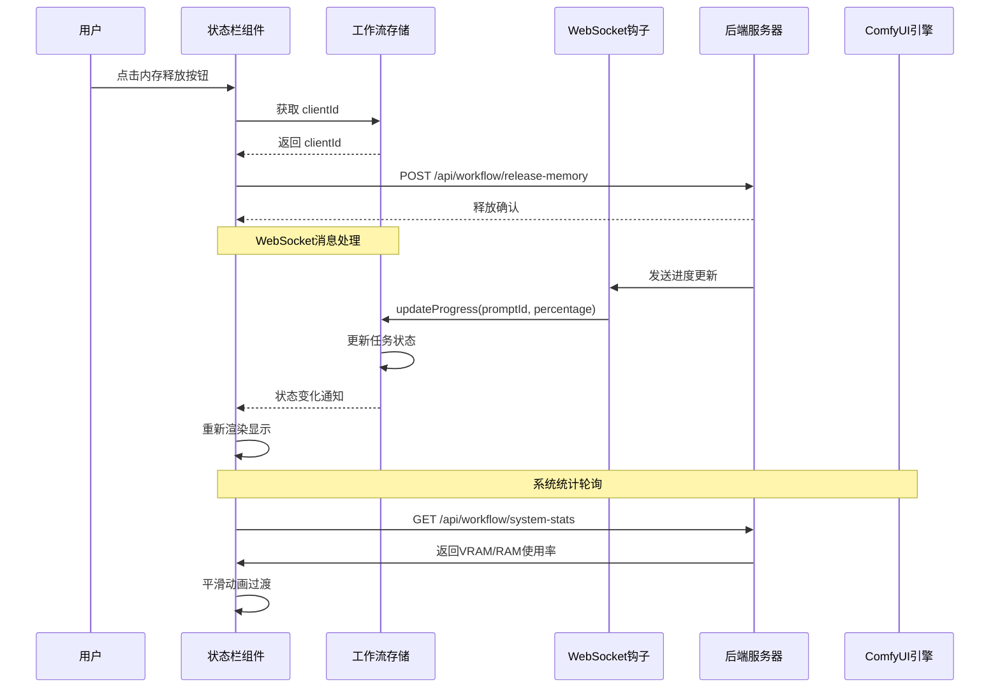
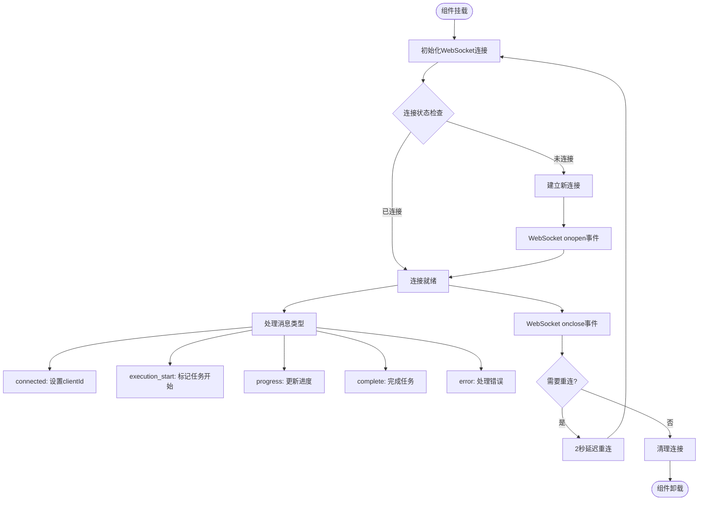
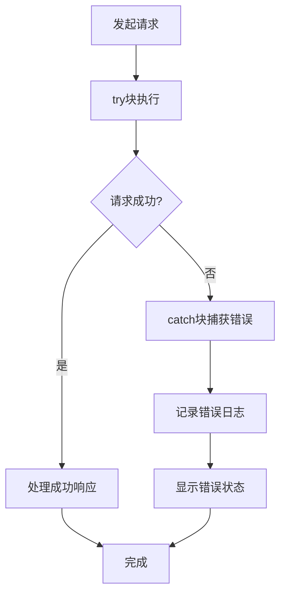
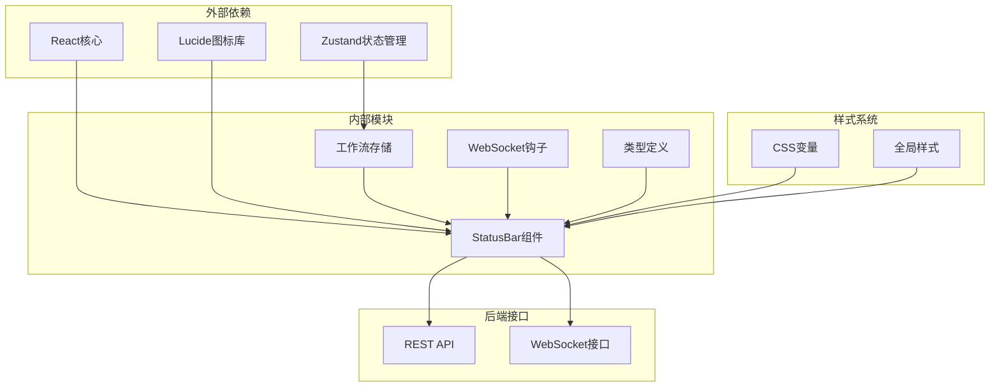
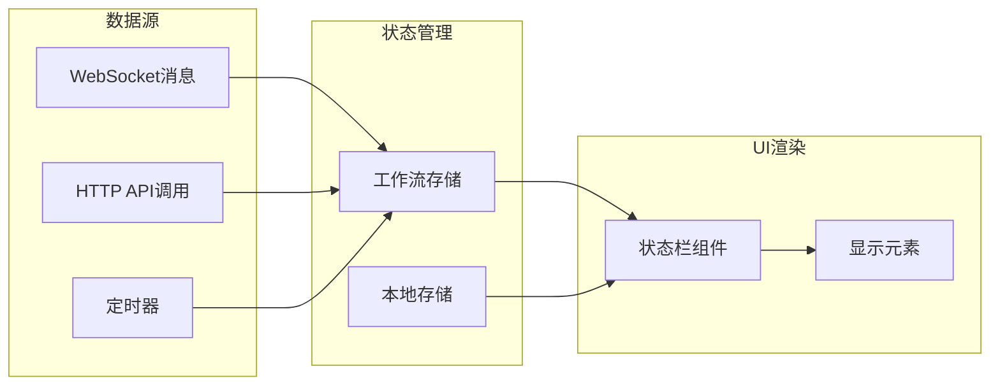

# 状态栏组件 (StatusBar)

<cite>
**本文档引用的文件**
- [StatusBar.tsx](file://client/src/components/StatusBar.tsx)
- [useWebSocket.ts](file://client/src/hooks/useWebSocket.ts)
- [useWorkflowStore.ts](file://client/src/hooks/useWorkflowStore.ts)
- [index.ts](file://client/src/types/index.ts)
- [App.tsx](file://client/src/components/App.tsx)
- [variables.css](file://client/src/styles/variables.css)
- [global.css](file://client/src/styles/global.css)
</cite>

## 目录
1. [简介](#简介)
2. [项目结构](#项目结构)
3. [核心组件](#核心组件)
4. [架构概览](#架构概览)
5. [详细组件分析](#详细组件分析)
6. [依赖关系分析](#依赖关系分析)
7. [性能考虑](#性能考虑)
8. [故障排除指南](#故障排除指南)
9. [结论](#结论)

## 简介

StatusBar（状态栏）是 Pix2Real 应用程序中的关键 UI 组件，位于应用程序界面底部，为用户提供实时的工作流状态监控和系统资源使用情况反馈。该组件集成了多种功能，包括任务进度显示、连接状态指示、系统通知、内存释放控制等，为用户提供了完整的操作反馈和系统健康监控能力。

状态栏采用现代化的设计理念，结合了 Material Design 图标系统和响应式布局，能够在不同屏幕尺寸下提供一致的用户体验。组件通过 WebSocket 实时连接后端服务，实现与 ComfyUI 工作流引擎的双向通信，确保用户能够及时了解任务执行状态和系统资源使用情况。

## 项目结构

StatusBar 组件位于客户端前端代码结构中的组件层，与工作流存储、WebSocket 钩子和类型定义紧密集成：

**图表来源**
- [StatusBar.tsx:1-243](file://client/src/components/StatusBar.tsx#L1-L243)
- [App.tsx:1-335](file://client/src/components/App.tsx#L1-L335)

**章节来源**
- [StatusBar.tsx:1-243](file://client/src/components/StatusBar.tsx#L1-L243)
- [App.tsx:281-282](file://client/src/components/App.tsx#L281-L282)

## 核心组件

StatusBar 组件是一个高度集成的状态监控界面，包含以下主要功能模块：

### 1. 自动保存状态指示
- 显示最近自动保存时间
- 使用人性化的时间格式（如"刚刚"、"5分钟前"）
- 绿色图标表示保存成功状态

### 2. 输出目录导航
- 快速访问当前会话的输出文件夹
- 支持本地存储的会话名称记忆
- 自动截断长路径显示

### 3. 视图大小切换
- 在小、中、大三种视图模式间切换
- 基于本地存储的持久化设置
- 图标按钮提供直观的操作反馈

### 4. 内存释放控制
- 安全的显存/内存释放功能
- 执行中任务时的禁用保护
- 释放过程的视觉反馈

### 5. 系统资源监控
- 实时显存使用率显示
- 内存使用率监控
- 动态颜色编码（绿色-黄色-橙色-红色）

### 6. 连接状态指示
- WebSocket 连接状态监控
- 自动重连机制
- 客户端 ID 分配跟踪

**章节来源**
- [StatusBar.tsx:44-242](file://client/src/components/StatusBar.tsx#L44-L242)

## 架构概览

StatusBar 组件的架构设计体现了现代 React 应用的最佳实践，通过状态管理和事件驱动的方式实现了高效的组件通信：

**图表来源**
- [StatusBar.tsx:110-121](file://client/src/components/StatusBar.tsx#L110-L121)
- [useWebSocket.ts:26-51](file://client/src/hooks/useWebSocket.ts#L26-L51)
- [useWorkflowStore.ts:421-443](file://client/src/hooks/useWorkflowStore.ts#L421-L443)

## 详细组件分析

### 组件结构与属性

StatusBar 组件采用函数式组件设计，接收以下属性：

| 属性名 | 类型 | 必需 | 描述 |
|--------|------|------|------|
| lastSavedAt | Date \| null | 是 | 最近自动保存时间 |
| sessionId | string | 是 | 当前会话标识符 |
| viewLabel | string | 是 | 当前视图大小标签 |
| onCycleViewSize | () => void | 是 | 视图大小切换回调 |

组件内部维护了多个状态变量：
- `releasing`: 内存释放状态标志
- `displayStats`: 当前显示的系统统计信息
- `tick`: 时间刷新计数器
- `targetStatsRef`: 目标统计信息引用
- `currentVramRef`: 当前显存使用率引用
- `currentRamRef`: 当前内存使用率引用

### WebSocket 连接状态管理

StatusBar 组件通过 useWebSocket 钩子实现与后端的实时通信：

**图表来源**
- [useWebSocket.ts:10-73](file://client/src/hooks/useWebSocket.ts#L10-L73)
- [useWebSocket.ts:26-51](file://client/src/hooks/useWebSocket.ts#L26-L51)

### 实时进度更新机制

StatusBar 组件实现了多层进度更新机制：

1. **WebSocket 实时更新**: 通过 WebSocket 接收来自后端的实时进度数据
2. **系统统计轮询**: 每2秒轮询一次系统资源使用情况
3. **平滑动画过渡**: 使用 requestAnimationFrame 实现数值的平滑过渡效果

进度更新的数据流：
- WebSocket 消息到达 → 解析消息类型 → 调用相应的工作流存储方法 → 触发组件重新渲染 → 更新显示状态

### 错误状态处理

组件具备完善的错误处理机制：

错误处理包括：
- WebSocket 连接失败的自动重连
- 系统统计查询失败的静默处理
- 内存释放操作的错误捕获和用户反馈

### 系统通知功能

StatusBar 组件提供了多种系统通知机制：

1. **自动保存通知**: 显示最近自动保存时间，使用人性化的时间格式
2. **内存释放反馈**: 在内存释放过程中显示"释放中..."状态
3. **连接状态指示**: 通过按钮状态和颜色变化反映连接状态
4. **资源使用警告**: 当资源使用率达到阈值时改变颜色编码

**章节来源**
- [StatusBar.tsx:14-30](file://client/src/components/StatusBar.tsx#L14-L30)
- [StatusBar.tsx:110-121](file://client/src/components/StatusBar.tsx#L110-L121)
- [StatusBar.tsx:212-239](file://client/src/components/StatusBar.tsx#L212-L239)

## 依赖关系分析

StatusBar 组件的依赖关系体现了清晰的关注点分离：

**图表来源**
- [StatusBar.tsx:1-3](file://client/src/components/StatusBar.tsx#L1-L3)
- [useWorkflowStore.ts:1-4](file://client/src/hooks/useWorkflowStore.ts#L1-L4)

### 组件耦合度分析

StatusBar 组件的耦合度设计合理：

- **低到中等耦合**: 与工作流存储和 WebSocket 钩子的耦合度适中，便于测试和维护
- **高内聚性**: 组件内部功能高度相关，职责明确
- **清晰的边界**: 与父组件 App 的交互通过属性传递，避免直接 DOM 操作

### 数据流分析

**图表来源**
- [useWorkflowStore.ts:398-443](file://client/src/hooks/useWorkflowStore.ts#L398-L443)
- [StatusBar.tsx:68-108](file://client/src/components/StatusBar.tsx#L68-L108)

**章节来源**
- [StatusBar.tsx:44-242](file://client/src/components/StatusBar.tsx#L44-L242)
- [useWorkflowStore.ts:356-359](file://client/src/hooks/useWorkflowStore.ts#L356-L359)

## 性能考虑

StatusBar 组件在设计时充分考虑了性能优化：

### 渲染优化
- **最小化重渲染**: 使用 React.memo 和状态分片减少不必要的渲染
- **批量状态更新**: 将相关的状态更新合并到单个渲染周期
- **防抖处理**: 对频繁触发的状态变化进行防抖处理

### 内存管理
- **引用优化**: 使用 useRef 存储不需要触发渲染的值
- **清理机制**: 在组件卸载时清理定时器和事件监听器
- **对象冻结**: 对不可变数据使用冻结策略

### 网络优化
- **连接复用**: WebSocket 连接在整个应用生命周期内复用
- **轮询节流**: 系统统计轮询间隔为2秒，避免过度请求
- **错误降级**: 网络异常时提供优雅的降级体验

### 动画性能
- **requestAnimationFrame**: 使用浏览器原生动画 API 实现流畅的动画效果
- **硬件加速**: CSS 属性动画利用 GPU 加速
- **动画取消**: 组件卸载时自动取消正在进行的动画

## 故障排除指南

### 常见问题及解决方案

#### WebSocket 连接问题
**症状**: 状态栏显示连接失败或进度不更新
**诊断步骤**:
1. 检查浏览器开发者工具的网络面板
2. 查看 WebSocket 连接状态
3. 确认后端服务是否正常运行

**解决方案**:
- 等待自动重连机制启动
- 检查防火墙和代理设置
- 刷新页面重新建立连接

#### 内存释放失败
**症状**: 点击"释放缓存"按钮无响应
**可能原因**:
- 当前有任务正在执行
- WebSocket 连接未建立
- 后端服务不可用

**解决方法**:
- 等待所有任务完成后重试
- 检查网络连接状态
- 刷新页面重新连接

#### 系统统计显示异常
**症状**: 显存/内存使用率显示为 NaN 或 0
**排查方法**:
- 检查后端 /api/workflow/system-stats 接口响应
- 确认 ComfyUI 服务正常运行
- 查看浏览器控制台错误信息

**修复方案**:
- 重启 ComfyUI 服务
- 检查系统资源监控权限
- 等待轮询机制自动恢复

### 调试技巧

1. **启用详细日志**: 在浏览器控制台查看 WebSocket 连接日志
2. **监控状态变化**: 使用 React DevTools 监控组件状态变化
3. **网络分析**: 使用浏览器网络面板分析 API 请求和响应
4. **性能分析**: 使用浏览器性能面板分析渲染性能

**章节来源**
- [useWebSocket.ts:53-65](file://client/src/hooks/useWebSocket.ts#L53-L65)
- [StatusBar.tsx:110-121](file://client/src/components/StatusBar.tsx#L110-L121)

## 结论

StatusBar 组件作为 Pix2Real 应用程序的核心 UI 组件，成功地将复杂的工作流状态监控、系统资源管理、用户交互反馈等功能整合在一个简洁而强大的界面中。组件的设计体现了现代前端开发的最佳实践，包括：

- **模块化设计**: 清晰的功能划分和职责分离
- **响应式架构**: 基于状态管理和事件驱动的架构模式
- **性能优化**: 多层次的性能优化策略确保流畅的用户体验
- **错误处理**: 完善的错误处理和降级机制提升系统稳定性

通过与工作流存储、WebSocket 钩子和类型系统的深度集成，StatusBar 组件不仅提供了丰富的功能特性，还保持了良好的可维护性和扩展性。其设计为类似的应用程序提供了优秀的参考模板，展示了如何在复杂的前端应用中实现高效的状态管理和用户反馈机制。