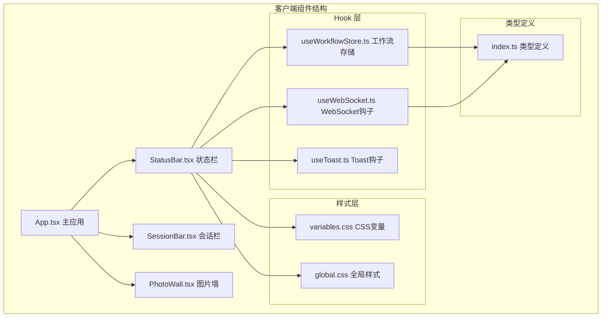
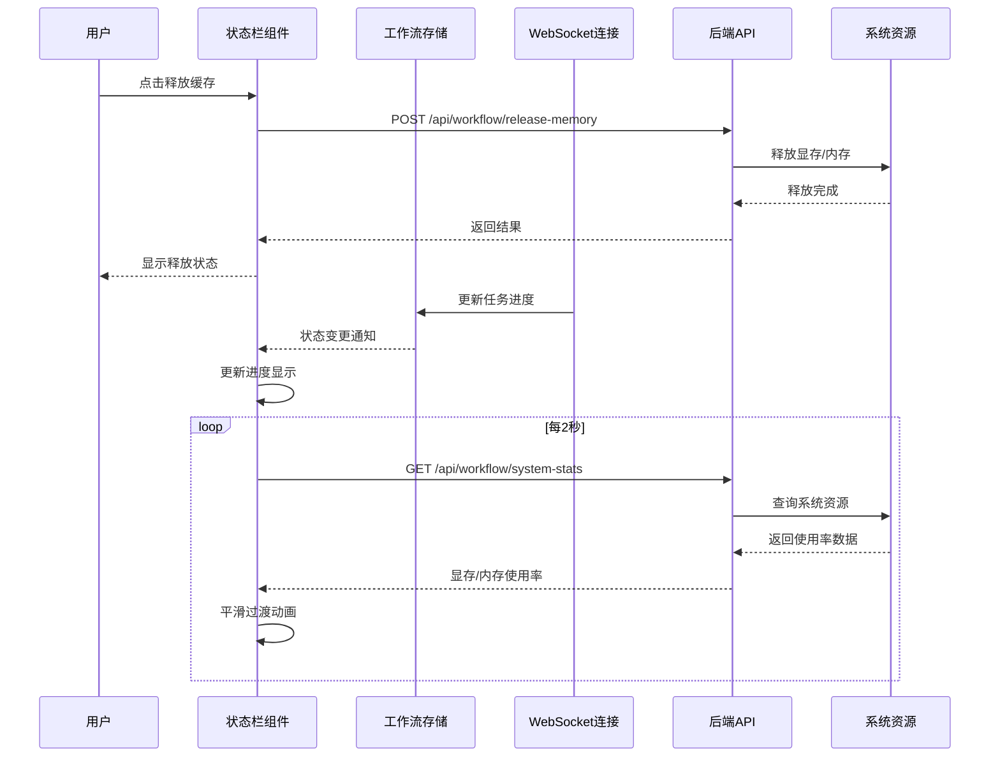
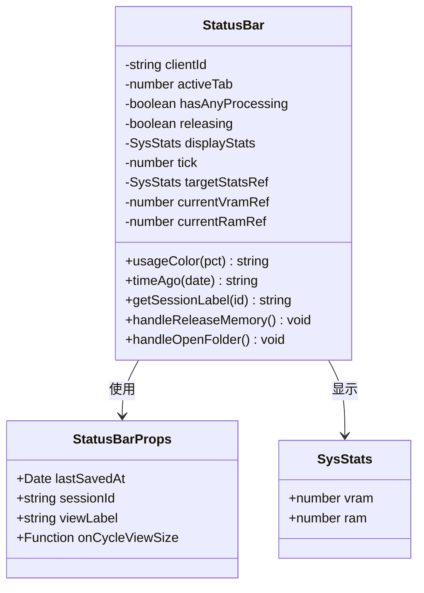
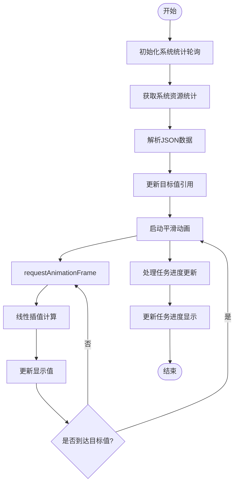
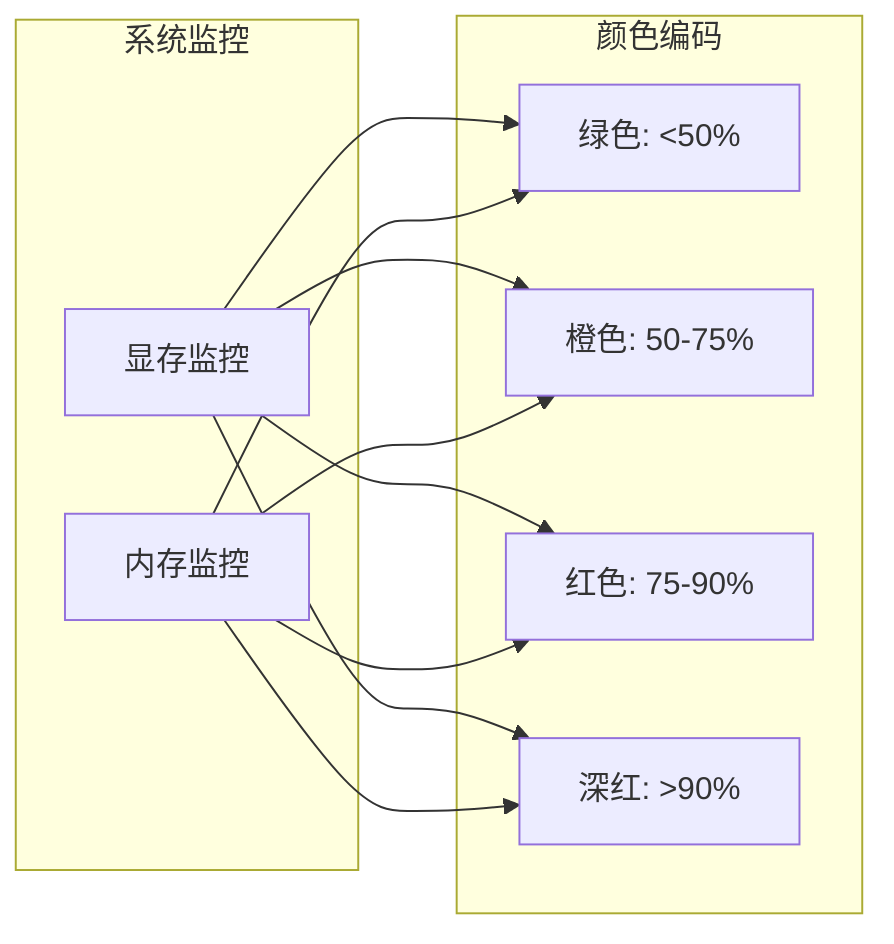
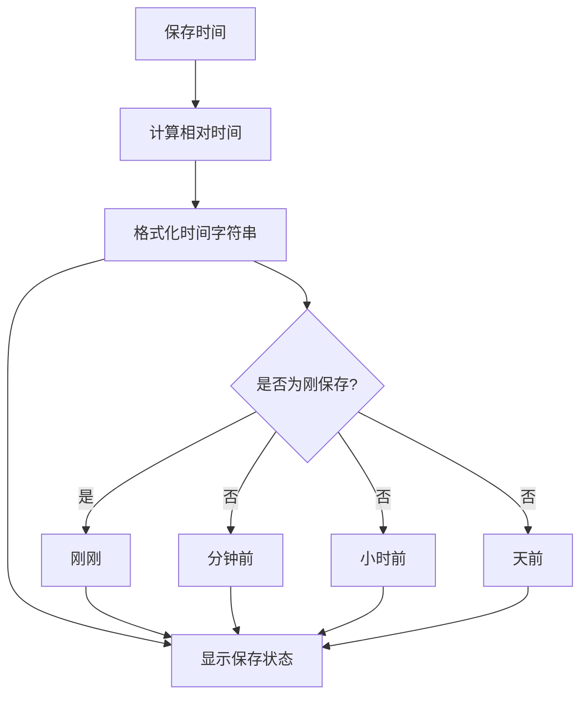
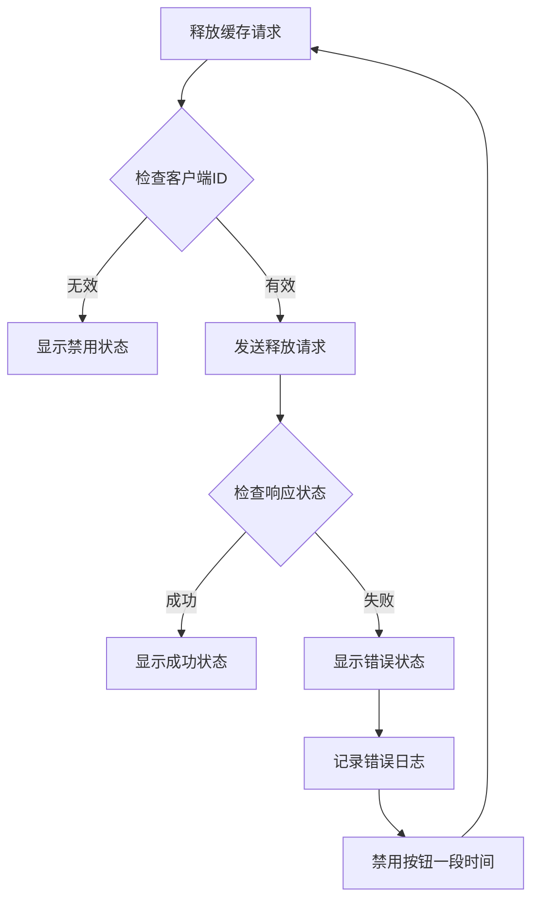
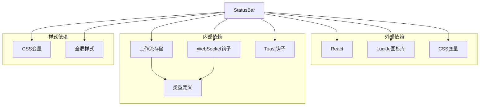
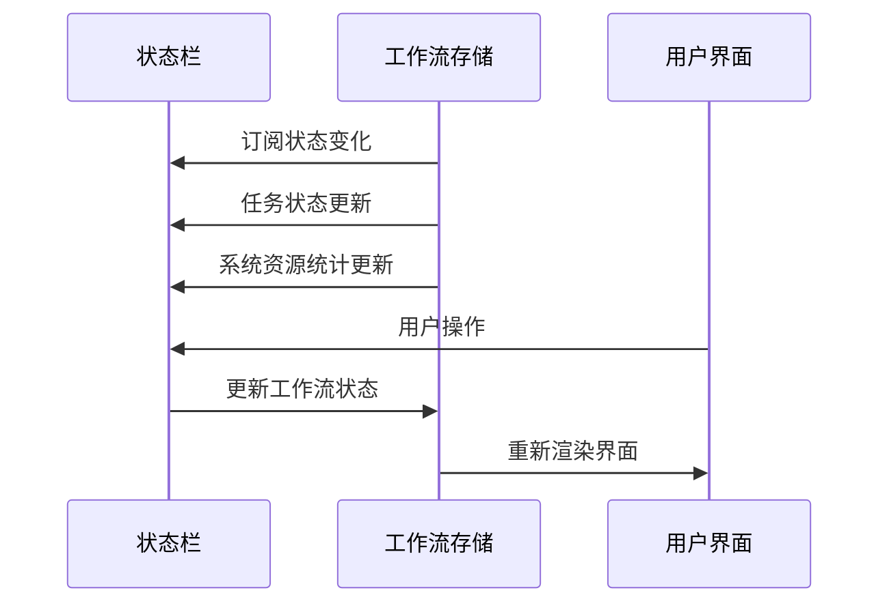
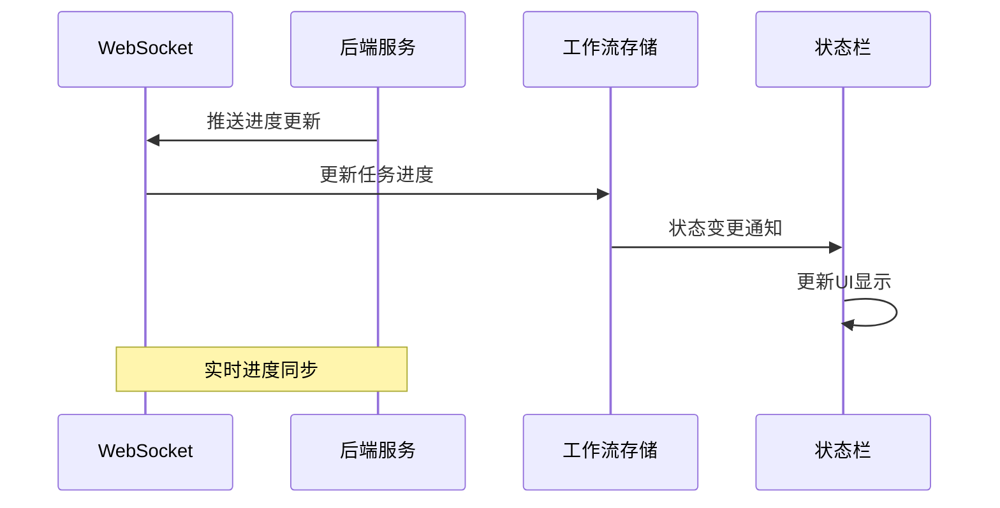

# 状态栏组件

<cite>
**本文档引用的文件**
- [StatusBar.tsx](file://client/src/components/StatusBar.tsx)
- [App.tsx](file://client/src/components/App.tsx)
- [useWorkflowStore.ts](file://client/src/hooks/useWorkflowStore.ts)
- [useWebSocket.ts](file://client/src/hooks/useWebSocket.ts)
- [useToast.ts](file://client/src/hooks/useToast.ts)
- [variables.css](file://client/src/styles/variables.css)
- [global.css](file://client/src/styles/global.css)
- [index.ts](file://client/src/types/index.ts)
- [PhotoWall.tsx](file://client/src/components/PhotoWall.tsx)
- [SessionBar.tsx](file://client/src/components/SessionBar.tsx)
</cite>

## 目录
1. [简介](#简介)
2. [项目结构](#项目结构)
3. [核心组件](#核心组件)
4. [架构概览](#架构概览)
5. [详细组件分析](#详细组件分析)
6. [依赖关系分析](#依赖关系分析)
7. [性能考虑](#性能考虑)
8. [故障排除指南](#故障排除指南)
9. [结论](#结论)
10. [附录](#附录)

## 简介
状态栏组件是 Pix2Real 应用界面的重要组成部分，位于应用底部，提供实时系统状态监控、任务进度显示和用户反馈信息。该组件集成了多种功能模块，包括自动保存状态显示、输出目录访问、显存和内存使用率监控、以及缓存释放等系统管理功能。

状态栏采用现代化的设计理念，支持响应式布局，在不同屏幕尺寸下都能提供良好的用户体验。组件通过 WebSocket 实时接收后端推送的任务进度信息，并通过平滑的动画效果展示系统资源使用情况。

## 项目结构
状态栏组件在项目中的位置和组织结构如下：



**图表来源**
- [App.tsx:367-368](file://client/src/components/App.tsx#L367-L368)
- [StatusBar.tsx:1-243](file://client/src/components/StatusBar.tsx#L1-L243)

**章节来源**
- [App.tsx:61-422](file://client/src/components/App.tsx#L61-L422)
- [StatusBar.tsx:44-242](file://client/src/components/StatusBar.tsx#L44-L242)

## 核心组件
状态栏组件的核心功能包括：

### 实时系统状态监控
- **显存使用率监控**：通过定时轮询 `/api/workflow/system-stats` 接口获取显存使用百分比
- **内存使用率监控**：同时监控系统内存使用情况，提供双通道资源监控
- **平滑过渡动画**：使用 requestAnimationFrame 和线性插值算法实现数值平滑过渡

### 任务进度显示
- **进度条可视化**：基于工作流存储中的任务状态动态更新进度条
- **状态指示器**：显示当前是否有任务正在处理或排队
- **阶段信息**：展示当前执行的工作流阶段和步骤信息

### 用户反馈信息
- **自动保存状态**：显示最近自动保存时间，使用人性化的时间格式
- **输出目录访问**：提供一键打开当前会话输出目录的功能
- **缓存释放**：允许用户手动释放显存和内存缓存

**章节来源**
- [StatusBar.tsx:14-108](file://client/src/components/StatusBar.tsx#L14-L108)
- [StatusBar.tsx:162-242](file://client/src/components/StatusBar.tsx#L162-L242)

## 架构概览
状态栏组件的架构设计体现了清晰的关注点分离和模块化原则：



**图表来源**
- [StatusBar.tsx:110-121](file://client/src/components/StatusBar.tsx#L110-L121)
- [useWebSocket.ts:45-159](file://client/src/hooks/useWebSocket.ts#L45-L159)
- [useWorkflowStore.ts:624-648](file://client/src/hooks/useWorkflowStore.ts#L624-L648)

## 详细组件分析

### 组件结构与属性配置

状态栏组件采用函数式组件设计，具有明确的属性接口和内部状态管理：



**图表来源**
- [StatusBar.tsx:5-10](file://client/src/components/StatusBar.tsx#L5-L10)
- [StatusBar.tsx:12](file://client/src/components/StatusBar.tsx#L12)

#### 属性配置详解

| 属性名称 | 类型 | 必需 | 描述 |
|---------|------|------|------|
| lastSavedAt | Date \| null | 是 | 最近自动保存时间，用于显示保存状态 |
| sessionId | string | 是 | 当前会话标识符，用于输出目录路径 |
| viewLabel | string | 是 | 当前视图大小标签，如"小"/"中"/"大" |
| onCycleViewSize | Function | 是 | 切换视图大小的回调函数 |

#### 内部状态管理

状态栏维护多个内部状态以支持不同的功能模块：

- **clientId**: 客户端唯一标识符，用于缓存释放操作
- **activeTab**: 当前激活的标签页索引
- **hasAnyProcessing**: 是否存在正在处理的任务
- **releasing**: 缓存释放进行中的状态标志
- **displayStats**: 当前显示的系统资源统计数据

**章节来源**
- [StatusBar.tsx:44-108](file://client/src/components/StatusBar.tsx#L44-L108)

### 实时进度显示机制

状态栏通过多种渠道获取实时进度信息：



**图表来源**
- [StatusBar.tsx:67-108](file://client/src/components/StatusBar.tsx#L67-L108)
- [useWorkflowStore.ts:624-648](file://client/src/hooks/useWorkflowStore.ts#L624-L648)

#### 进度条显示逻辑

状态栏实现了多层次的进度显示机制：

1. **系统资源进度条**：显示显存和内存使用率
2. **任务状态指示**：基于工作流存储中的任务状态
3. **时间戳显示**：人性化的时间格式显示

**章节来源**
- [StatusBar.tsx:211-239](file://client/src/components/StatusBar.tsx#L211-L239)
- [StatusBar.tsx:47-51](file://client/src/components/StatusBar.tsx#L47-L51)

### 系统状态指示器

状态栏提供了全面的系统状态监控功能：

#### 资源使用率监控



**图表来源**
- [StatusBar.tsx:14-19](file://client/src/components/StatusBar.tsx#L14-L19)

#### 状态颜色映射

| 使用率范围 | 颜色 | 含义 |
|-----------|------|------|
| < 50% | 绿色 (#4CAF50) | 使用率低，系统资源充足 |
| 50-75% | 橙色 (#FF9800) | 使用率中等，注意资源使用 |
| 75-90% | 红色 (#FF5722) | 使用率较高，需要关注 |
| > 90% | 深红色 (#f44336) | 使用率很高，建议释放缓存 |

**章节来源**
- [StatusBar.tsx:14-19](file://client/src/components/StatusBar.tsx#L14-L19)

### 用户反馈信息展示

状态栏通过多种方式向用户提供反馈信息：

#### 自动保存状态显示



**图表来源**
- [StatusBar.tsx:21-30](file://client/src/components/StatusBar.tsx#L21-L30)

#### 输出目录访问功能

状态栏提供了一键访问当前会话输出目录的功能：

- **路径格式**：`sessions/{sessionId}/tab-{activeTab}/output`
- **会话名称显示**：支持自定义会话名称，支持本地存储
- **安全访问**：通过后端 API 安全地打开文件夹

**章节来源**
- [StatusBar.tsx:170-179](file://client/src/components/StatusBar.tsx#L170-L179)
- [StatusBar.tsx:32-38](file://client/src/components/StatusBar.tsx#L32-L38)

### 错误信息处理

状态栏具备完善的错误处理机制：

#### 缓存释放错误处理



**图表来源**
- [StatusBar.tsx:110-121](file://client/src/components/StatusBar.tsx#L110-L121)

#### 系统统计获取错误处理

状态栏对系统统计获取过程中的异常进行了优雅处理：

- **网络错误**：ComfyUI 未就绪时的静默处理
- **数据解析错误**：JSON 解析失败时的容错处理
- **状态更新错误**：显示值更新过程中的异常捕获

**章节来源**
- [StatusBar.tsx:68-85](file://client/src/components/StatusBar.tsx#L68-L85)

## 依赖关系分析

状态栏组件的依赖关系体现了清晰的分层架构：



**图表来源**
- [StatusBar.tsx:1-4](file://client/src/components/StatusBar.tsx#L1-L4)
- [useWorkflowStore.ts:1-5](file://client/src/hooks/useWorkflowStore.ts#L1-L5)

### 组件间交互机制

状态栏与主要组件的交互流程如下：

#### 与工作流存储的交互



**图表来源**
- [useWorkflowStore.ts:146-155](file://client/src/hooks/useWorkflowStore.ts#L146-L155)
- [StatusBar.tsx:45-51](file://client/src/components/StatusBar.tsx#L45-L51)

#### 与 WebSocket 的进度同步

状态栏通过 WebSocket 实现与后端的实时通信：



**图表来源**
- [useWebSocket.ts:45-159](file://client/src/hooks/useWebSocket.ts#L45-L159)

**章节来源**
- [StatusBar.tsx:45-51](file://client/src/components/StatusBar.tsx#L45-L51)
- [useWorkflowStore.ts:624-648](file://client/src/hooks/useWorkflowStore.ts#L624-L648)

## 性能考虑

状态栏组件在设计时充分考虑了性能优化：

### 渲染性能优化

1. **最小化重渲染**：使用 React.memo 和状态分离减少不必要的渲染
2. **节流和防抖**：对高频更新的操作进行节流处理
3. **虚拟滚动**：对于大量数据的显示采用虚拟化技术

### 内存管理

1. **定时器清理**：确保组件卸载时清理所有定时器和监听器
2. **资源释放**：及时释放不再使用的对象引用
3. **事件监听器**：避免内存泄漏的事件监听器管理

### 网络性能

1. **轮询优化**：系统统计轮询间隔为 2 秒，平衡实时性和性能
2. **请求去重**：避免重复的相同请求
3. **错误重试**：合理的错误处理和重试机制

## 故障排除指南

### 常见问题及解决方案

#### 系统统计显示异常

**问题症状**：
- 显存/内存使用率显示为 0 或 NaN
- 数值显示不稳定，频繁跳变

**可能原因**：
- 后端 API 未正确返回数据
- 网络连接不稳定
- 数据解析错误

**解决步骤**：
1. 检查后端服务状态
2. 验证 API 端点 `/api/workflow/system-stats` 的可用性
3. 查看浏览器开发者工具的网络面板
4. 确认返回数据格式符合预期

#### 缓存释放功能失效

**问题症状**：
- 点击"释放缓存"按钮无响应
- 按钮显示为禁用状态

**可能原因**：
- 客户端 ID 未正确设置
- 存在正在处理的任务
- 后端 API 调用失败

**解决步骤**：
1. 检查工作流存储中的 clientId 状态
2. 确认没有任务处于 processing 或 queued 状态
3. 查看控制台错误信息
4. 验证后端 API `/api/workflow/release-memory` 的可用性

#### WebSocket 连接问题

**问题症状**：
- 任务进度不更新
- 状态栏显示离线状态

**可能原因**：
- WebSocket 连接断开
- 网络连接不稳定
- 服务器端问题

**解决步骤**：
1. 检查网络连接状态
2. 查看浏览器控制台的 WebSocket 错误
3. 验证服务器端 WebSocket 服务状态
4. 尝试刷新页面重新建立连接

**章节来源**
- [StatusBar.tsx:68-85](file://client/src/components/StatusBar.tsx#L68-L85)
- [StatusBar.tsx:110-121](file://client/src/components/StatusBar.tsx#L110-L121)

## 结论

状态栏组件作为 Pix2Real 应用的重要界面元素，成功实现了以下目标：

### 设计优势
- **功能完整性**：集成了系统监控、任务进度、用户反馈等多种功能
- **用户体验**：提供直观的视觉反馈和人性化的交互设计
- **性能优化**：采用多种优化策略确保流畅的用户体验
- **可维护性**：清晰的代码结构和模块化设计便于后续维护

### 技术亮点
- **实时性**：通过 WebSocket 和轮询机制实现实时状态更新
- **响应式设计**：适应不同屏幕尺寸和设备类型
- **错误处理**：完善的错误处理和降级策略
- **主题适配**：支持明暗主题切换和自定义样式

### 改进建议
- 可以考虑添加更多的自定义配置选项
- 增加更多的用户交互反馈
- 优化移动端的触摸交互体验
- 添加更多的诊断和调试功能

状态栏组件展现了现代前端开发的最佳实践，为整个应用提供了稳定可靠的状态管理和用户反馈机制。

## 附录

### 使用示例

#### 基本集成示例

```typescript
// 在 App 组件中集成状态栏
function App() {
  const [viewSize, setViewSize] = useState<ViewSize>('medium');
  
  const cycleViewSize = useCallback(() => {
    const next = { small: 'medium', medium: 'large', large: 'small' };
    setViewSize(next[viewSize]);
  }, [viewSize]);
  
  return (
    <div>
      {/* 其他组件 */}
      <StatusBar 
        lastSavedAt={lastSavedAt}
        sessionId={sessionId}
        viewLabel={VIEW_CONFIG[viewSize].label}
        onCycleViewSize={cycleViewSize}
      />
    </div>
  );
}
```

#### 在不同工作流中的应用场景

1. **文本到图像工作流**：显示任务进度和生成状态
2. **视频生成工作流**：监控长时间运行任务的进度
3. **图像处理工作流**：显示资源使用情况和处理状态
4. **批量处理工作流**：提供整体进度概览和单个任务详情

### 样式自定义选项

状态栏支持通过 CSS 变量进行主题定制：

| CSS 变量 | 默认值 | 用途 |
|----------|--------|------|
| --color-bg | #ffffff | 背景色 |
| --color-surface | #f5f5f5 | 表面色 |
| --color-text | #1a1a1a | 文本色 |
| --color-text-secondary | #666666 | 辅助文本色 |
| --color-border | #e0e0e0 | 边框色 |
| --color-success | #4CAF50 | 成功状态色 |
| --color-error | #f44336 | 错误状态色 |

### 响应式设计实现

状态栏采用 Flexbox 布局，支持响应式设计：

- **左侧区域**：自动保存状态，始终可见
- **中间区域**：输出目录访问，支持溢出省略号
- **右侧区域**：系统资源监控，按需显示
- **弹性间距**：使用 `flex: 1` 实现自适应间距