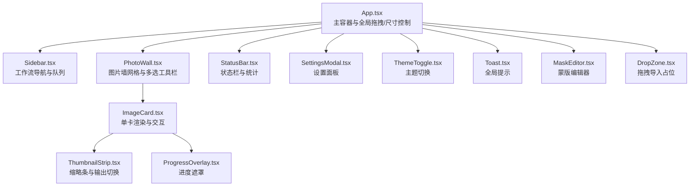
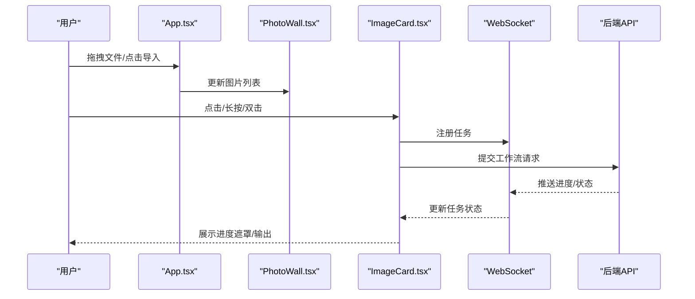
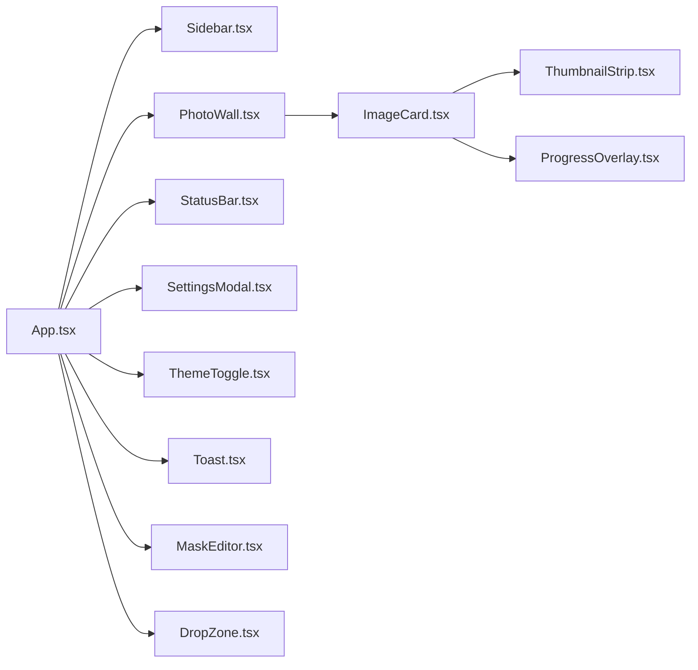

# 用户界面组件

<cite>
**本文引用的文件**
- [App.tsx](file://client/src/components/App.tsx)
- [ImageCard.tsx](file://client/src/components/ImageCard.tsx)
- [PhotoWall.tsx](file://client/src/components/PhotoWall.tsx)
- [DropZone.tsx](file://client/src/components/DropZone.tsx)
- [Sidebar.tsx](file://client/src/components/Sidebar.tsx)
- [StatusBar.tsx](file://client/src/components/StatusBar.tsx)
- [SettingsModal.tsx](file://client/src/components/SettingsModal.tsx)
- [ThemeToggle.tsx](file://client/src/components/ThemeToggle.tsx)
- [Toast.tsx](file://client/src/components/Toast.tsx)
- [ThumbnailStrip.tsx](file://client/src/components/ThumbnailStrip.tsx)
- [MaskEditor.tsx](file://client/src/components/MaskEditor.tsx)
- [ProgressOverlay.tsx](file://client/src/components/ProgressOverlay.tsx)
- [SegmentedControl.tsx](file://client/src/components/SegmentedControl.tsx)
- [global.css](file://client/src/styles/global.css)
- [variables.css](file://client/src/styles/variables.css)
</cite>

## 目录
1. [简介](#简介)
2. [项目结构](#项目结构)
3. [核心组件](#核心组件)
4. [架构总览](#架构总览)
5. [详细组件分析](#详细组件分析)
6. [依赖关系分析](#依赖关系分析)
7. [性能考量](#性能考量)
8. [故障排查指南](#故障排查指南)
9. [结论](#结论)
10. [附录](#附录)

## 简介
本技术文档聚焦于 Pix2Real 客户端中的用户界面组件，系统性阐述各组件的视觉外观、行为与交互模式，覆盖属性、事件、插槽与自定义选项；提供使用示例与代码片段路径；说明响应式设计与无障碍合规要点；详述状态、动画与过渡效果；给出样式定制与主题支持策略；并讨论跨浏览器兼容性与性能优化。文档同时解释组件组合模式与与后端服务的集成方式，附带 API 参考与最佳实践。

## 项目结构
客户端 UI 采用 React + TypeScript 构建，组件位于 client/src/components，样式位于 client/src/styles。整体布局由 App.tsx 主容器协调，左侧为 Sidebar，主区域为 PhotoWall 或特定工作流侧边栏，底部为 StatusBar，顶部为标题栏与主题切换、设置入口等。

图表来源
- [App.tsx:1-422](file://client/src/components/App.tsx#L1-L422)
- [Sidebar.tsx:1-434](file://client/src/components/Sidebar.tsx#L1-L434)
- [PhotoWall.tsx:1-781](file://client/src/components/PhotoWall.tsx#L1-L781)
- [ImageCard.tsx:1-800](file://client/src/components/ImageCard.tsx#L1-L800)
- [ThumbnailStrip.tsx:1-240](file://client/src/components/ThumbnailStrip.tsx#L1-L240)
- [ProgressOverlay.tsx:1-126](file://client/src/components/ProgressOverlay.tsx#L1-L126)
- [StatusBar.tsx:1-243](file://client/src/components/StatusBar.tsx#L1-L243)
- [SettingsModal.tsx:1-756](file://client/src/components/SettingsModal.tsx#L1-L756)
- [ThemeToggle.tsx:1-39](file://client/src/components/ThemeToggle.tsx#L1-L39)
- [Toast.tsx:1-56](file://client/src/components/Toast.tsx#L1-L56)
- [MaskEditor.tsx:1-375](file://client/src/components/MaskEditor.tsx#L1-L375)
- [DropZone.tsx:1-181](file://client/src/components/DropZone.tsx#L1-L181)

章节来源
- [App.tsx:1-422](file://client/src/components/App.tsx#L1-L422)
- [global.css:1-300](file://client/src/styles/global.css#L1-L300)
- [variables.css:1-31](file://client/src/styles/variables.css#L1-L31)

## 核心组件
- App.tsx：主容器，负责全局拖拽导入、右侧面板宽度可调、主题持久化、欢迎页与主内容区布局。
- PhotoWall.tsx：图片墙网格，支持懒加载、多选工具栏、批量操作、删除拖放区域、滚动锚定。
- ImageCard.tsx：单张图片卡片，含预览/输出切换、进度遮罩、长按多选、拖拽导出、提示词编辑、蒙版编辑入口、AI 助手快捷动作等。
- Sidebar.tsx：工作流导航与队列面板，支持跨标签拖拽、任务状态指示、队列弹层。
- StatusBar.tsx：状态栏，显示自动保存时间、输出目录、视图大小切换、显存/内存使用、释放缓存。
- SettingsModal.tsx：设置面板，分组管理工作流、随机生成、会话、通知、提示词数据库、个人偏好。
- ThemeToggle.tsx：主题切换按钮，支持本地存储与根元素主题标记。
- Toast.tsx：全局提示气泡，支持动作按钮与退出动画。
- DropZone.tsx：拖拽导入占位，支持文件夹与文件类型过滤。
- ThumbnailStrip.tsx：输出缩略条，支持左右切换、拖拽导出、视频预览。
- MaskEditor.tsx：蒙版编辑器，支持笔刷参数、撤销/重做、自动识别填充、导出混合结果。
- ProgressOverlay.tsx：处理中遮罩，显示排队/处理阶段、百分比与取消按钮。

章节来源
- [PhotoWall.tsx:1-781](file://client/src/components/PhotoWall.tsx#L1-L781)
- [ImageCard.tsx:1-800](file://client/src/components/ImageCard.tsx#L1-L800)
- [Sidebar.tsx:1-434](file://client/src/components/Sidebar.tsx#L1-L434)
- [StatusBar.tsx:1-243](file://client/src/components/StatusBar.tsx#L1-L243)
- [SettingsModal.tsx:1-756](file://client/src/components/SettingsModal.tsx#L1-L756)
- [ThemeToggle.tsx:1-39](file://client/src/components/ThemeToggle.tsx#L1-L39)
- [Toast.tsx:1-56](file://client/src/components/Toast.tsx#L1-L56)
- [DropZone.tsx:1-181](file://client/src/components/DropZone.tsx#L1-L181)
- [ThumbnailStrip.tsx:1-240](file://client/src/components/ThumbnailStrip.tsx#L1-L240)
- [MaskEditor.tsx:1-375](file://client/src/components/MaskEditor.tsx#L1-L375)
- [ProgressOverlay.tsx:1-126](file://client/src/components/ProgressOverlay.tsx#L1-L126)

## 架构总览
组件间通过 Zustand 状态管理与 WebSocket 通信协作，App.tsx 作为顶层协调者，PhotoWall.tsx 与 ImageCard.tsx 形成卡片渲染与交互闭环，Sidebar.tsx 与 StatusBar.tsx 提供导航与系统状态反馈，SettingsModal.tsx 与 ThemeToggle.tsx 提供配置与主题切换，MaskEditor.tsx 与 ThumbnailStrip.tsx 支持蒙版与输出切换，DropZone.tsx 与 Toast.tsx 提升导入与提示体验。

图表来源
- [App.tsx:138-197](file://client/src/components/App.tsx#L138-L197)
- [PhotoWall.tsx:201-295](file://client/src/components/PhotoWall.tsx#L201-L295)
- [ImageCard.tsx:387-515](file://client/src/components/ImageCard.tsx#L387-L515)

## 详细组件分析

### App.tsx（主容器）
- 视觉外观：顶部标题栏、中间主内容区、底部状态栏；支持欢迎页与主界面切换。
- 行为与交互：
  - 全局拖拽导入：拦截外部文件拖拽，按活动标签过滤类型，读取文件夹与文件列表。
  - 右侧面板宽度可调：鼠标按下拖动，限制最小/最大宽度，本地存储持久化。
  - 主题切换：读取本地存储，设置根元素 data-theme。
  - 欢迎页：首次进入或显式触发显示欢迎页。
- 属性与事件：
  - 无公开 props（内部状态通过 hooks 管理）。
  - 事件：拖拽进入/离开/放置、窗口尺寸变化、主题切换。
- 插槽与自定义：无插槽；通过局部状态控制欢迎页、右侧面板显示与宽度。
- 使用示例与代码片段路径：
  - [App.tsx:138-197](file://client/src/components/App.tsx#L138-L197) 拖拽导入逻辑
  - [App.tsx:90-125](file://client/src/components/App.tsx#L90-L125) 右侧面板宽度拖拽
  - [App.tsx:131-136](file://client/src/components/App.tsx#L131-L136) 主题初始化
- 状态与动画：无复杂状态；通过 CSS 类与内联样式实现拖拽光标与渐变遮罩。
- 样式与主题：使用 CSS 变量与 data-theme 实现明暗主题切换。
- 响应式与无障碍：未见 aria-* 属性；建议在按钮与可交互元素补充 role 与 aria-label。

章节来源
- [App.tsx:1-422](file://client/src/components/App.tsx#L1-L422)

### PhotoWall.tsx（图片墙）
- 视觉外观：网格布局，支持 small/medium/large 三种视图密度；懒加载占位减少首屏抖动。
- 行为与交互：
  - 多选工具栏：全选/反选、批量替换提示词、批量重命名、清空蒙版、批量执行。
  - 删除拖放：拖拽卡片或输出至底部删除区域，支持批量删除。
  - 滚动锚定：新增卡片时平滑滚动到底部，避免滚动位置跳变。
- 属性与事件：
  - 属性：viewSize（small/medium/large）。
  - 事件：批量操作回调、删除区域拖放回调。
- 插槽与自定义：无插槽；通过 props 传入视图配置与回调。
- 使用示例与代码片段路径：
  - [PhotoWall.tsx:15-19](file://client/src/components/PhotoWall.tsx#L15-L19) 视图配置
  - [PhotoWall.tsx:22-97](file://client/src/components/PhotoWall.tsx#L22-L97) LazyCard 懒加载
  - [PhotoWall.tsx:412-652](file://client/src/components/PhotoWall.tsx#L412-L652) 多选工具栏
  - [PhotoWall.tsx:714-777](file://client/src/components/PhotoWall.tsx#L714-L777) 删除拖放区域
- 状态与动画：通过 CSS 动画实现删除区域入场、渐隐与骨架屏；滚动锚定减少布局抖动。
- 样式与主题：依赖全局变量与暗色主题背景类。

章节来源
- [PhotoWall.tsx:1-781](file://client/src/components/PhotoWall.tsx#L1-L781)

### ImageCard.tsx（单卡）
- 视觉外观：卡片圆角、边框与悬停提升；输出覆盖层、视频播放、进度遮罩。
- 行为与交互：
  - 预览/输出切换：视频工作流预渲染所有输出，切换显示避免闪烁；图片工作流支持覆盖层。
  - 进度遮罩：排队/处理阶段显示百分比与阶段信息，支持取消排队。
  - 提示词编辑：文本域自适应高度，支持 AI 助手快捷动作（自然语言转标签、标签转自然语言、细节增强）。
  - 蒙版编辑：双击或入口打开蒙版编辑器，支持 Mode A/B 模式。
  - 拖拽导出：支持内部拖拽与外部拖拽（DownloadURL）。
  - 长按多选：长按触发进入多选模式。
  - 任务执行：根据活动标签调用不同工作流接口，传递提示词与模型参数。
- 属性与事件：
  - 属性：image、isMultiSelectMode、isSelected、isFlashing、hidePlayButton、onLongPress、onToggleSelect。
  - 事件：拖拽开始/结束、点击、右键菜单、双击等。
- 插槽与自定义：无插槽；通过 props 控制渲染与交互。
- 使用示例与代码片段路径：
  - [ImageCard.tsx:657-750](file://client/src/components/ImageCard.tsx#L657-L750) 图片/视频/输出覆盖层
  - [ImageCard.tsx:773-783](file://client/src/components/ImageCard.tsx#L773-L783) 进度遮罩
  - [ImageCard.tsx:583-599](file://client/src/components/ImageCard.tsx#L583-L599) 快捷动作
  - [ImageCard.tsx:516-546](file://client/src/components/ImageCard.tsx#L516-L546) 打开蒙版编辑器
  - [ImageCard.tsx:315-354](file://client/src/components/ImageCard.tsx#L315-L354) 拖拽导出
  - [ImageCard.tsx:387-515](file://client/src/components/ImageCard.tsx#L387-L515) 执行任务
- 状态与动画：卡片悬停提升、选中描边、闪烁动画、AI 辅助发光边框；使用 will-change 优化 transform。
- 样式与主题：统一使用 CSS 变量与 outline 动画替代昂贵的阴影动画。

章节来源
- [ImageCard.tsx:1-800](file://client/src/components/ImageCard.tsx#L1-L800)

### Sidebar.tsx（侧边栏）
- 视觉外观：垂直导航，分组显示工作流图标与名称，激活态指示器浮动。
- 行为与交互：
  - 激活指示器：监听按钮位置，计算 top 与 height，动画过渡。
  - 队列面板：顶部按钮展开向上弹出队列面板，支持点击外部关闭。
  - 拖拽：原生 dragover 监听确保 preventDefault 生效；支持卡片与输出拖拽至目标标签。
- 属性与事件：无公开 props；事件处理通过回调注入。
- 插槽与自定义：无插槽；通过分组配置与图标映射扩展。
- 使用示例与代码片段路径：
  - [Sidebar.tsx:244-262](file://client/src/components/Sidebar.tsx#L244-L262) 激活指示器
  - [Sidebar.tsx:417-429](file://client/src/components/Sidebar.tsx#L417-L429) 队列面板
  - [Sidebar.tsx:46-61](file://client/src/components/Sidebar.tsx#L46-L61) 原生 dragover 监听
  - [Sidebar.tsx:120-218](file://client/src/components/Sidebar.tsx#L120-L218) 拖拽至标签
- 状态与动画：指示器过渡动画、队列面板进出动画；任务进行中显示脉冲点。

章节来源
- [Sidebar.tsx:1-434](file://client/src/components/Sidebar.tsx#L1-L434)

### StatusBar.tsx（状态栏）
- 视觉外观：底部固定栏，显示自动保存、输出目录、视图大小、释放缓存、显存/内存使用。
- 行为与交互：
  - 系统统计：定时轮询显存/内存，使用 requestAnimationFrame 平滑插值。
  - 释放缓存：POST 请求触发释放，禁用条件为无 clientId 或队列执行中。
  - 打开输出目录：POST 请求调用系统打开指定目录。
- 属性与事件：
  - 属性：lastSavedAt、sessionId、viewLabel、onCycleViewSize。
- 插槽与自定义：无插槽；通过 props 控制显示内容。
- 使用示例与代码片段路径：
  - [StatusBar.tsx:67-108](file://client/src/components/StatusBar.tsx#L67-L108) 统计轮询与插值
  - [StatusBar.tsx:110-121](file://client/src/components/StatusBar.tsx#L110-L121) 释放缓存
  - [StatusBar.tsx:123-133](file://client/src/components/StatusBar.tsx#L123-L133) 打开输出目录
- 状态与动画：显存/内存百分比条动画；禁用态与透明度控制。

章节来源
- [StatusBar.tsx:1-243](file://client/src/components/StatusBar.tsx#L1-L243)

### SettingsModal.tsx（设置面板）
- 视觉外观：左右分栏，左侧导航，右侧滚动内容；分组显示工作流、随机生成、会话、通知、提示词管理、我的偏好。
- 行为与交互：
  - 分类导航：点击切换右侧内容。
  - 设置项：使用 SegmentedControl 控制枚举型设置；支持路径浏览与恢复默认。
  - 自动循环确认：切换自动循环前二次确认，防止误操作。
- 属性与事件：无公开 props；通过 hooks 管理设置状态。
- 插槽与自定义：无插槽；通过分类数组扩展。
- 使用示例与代码片段路径：
  - [SettingsModal.tsx:325-397](file://client/src/components/SettingsModal.tsx#L325-L397) 工作流分组
  - [SettingsModal.tsx:467-556](file://client/src/components/SettingsModal.tsx#L467-L556) 会话分组
  - [SettingsModal.tsx:558-589](file://client/src/components/SettingsModal.tsx#L558-L589) 通知分组
  - [SettingsModal.tsx:685-752](file://client/src/components/SettingsModal.tsx#L685-L752) 自动循环确认弹窗
- 状态与动画：面板进入/退出动画；SegmentedControl 选中态切换。

章节来源
- [SettingsModal.tsx:1-756](file://client/src/components/SettingsModal.tsx#L1-L756)

### ThemeToggle.tsx（主题切换）
- 视觉外观：太阳/月亮图标按钮，透明背景。
- 行为与交互：切换本地存储与根元素主题标记，影响全局 CSS 变量。
- 属性与事件：无公开 props；通过 onClick 切换。
- 插槽与自定义：无插槽；通过 data-theme 控制主题。
- 使用示例与代码片段路径：
  - [ThemeToggle.tsx:9-17](file://client/src/components/ThemeToggle.tsx#L9-L17) 主题切换逻辑
- 状态与动画：无复杂状态；通过 CSS 变量与根元素属性切换。

章节来源
- [ThemeToggle.tsx:1-39](file://client/src/components/ThemeToggle.tsx#L1-L39)

### Toast.tsx（全局提示）
- 视觉外观：顶部居中气泡，支持动作按钮。
- 行为与交互：接收消息与动作，触发动画进入/退出。
- 属性与事件：无公开 props；通过 hooks 管理消息状态。
- 插槽与自定义：无插槽；通过 action.onClick 回调处理。
- 使用示例与代码片段路径：
  - [Toast.tsx:3-55](file://client/src/components/Toast.tsx#L3-L55) 提示渲染与动作按钮
- 状态与动画：飞入/飞出动画；指针事件根据是否有动作而启用。

章节来源
- [Toast.tsx:1-56](file://client/src/components/Toast.tsx#L1-L56)

### DropZone.tsx（拖拽导入占位）
- 视觉外观：虚线边框、上传图标与提示文字；支持全屏与栏内两种形态。
- 行为与交互：拦截拖拽事件，读取文件夹与文件，按活动标签过滤类型，支持点击选择文件。
- 属性与事件：fullscreen/importFiles/onDropHandled/activeTab。
- 插槽与自定义：无插槽；通过 props 控制行为。
- 使用示例与代码片段路径：
  - [DropZone.tsx:40-82](file://client/src/components/DropZone.tsx#L40-L82) 拖拽处理与过滤
  - [DropZone.tsx:103-146](file://client/src/components/DropZone.tsx#L103-L146) 全屏占位
  - [DropZone.tsx:149-179](file://client/src/components/DropZone.tsx#L149-L179) 栏内占位
- 状态与动画：拖拽悬停高亮与过渡。

章节来源
- [DropZone.tsx:1-181](file://client/src/components/DropZone.tsx#L1-L181)

### ThumbnailStrip.tsx（输出缩略条）
- 视觉外观：底部固定条，左右箭头与缩略项；选中项高亮。
- 行为与交互：自动检测溢出，左右滚动；支持输出拖拽导出；视频预览。
- 属性与事件：items/selectedIndex/onSelect/onOutputDragStart/onOutputDragEnd。
- 插槽与自定义：无插槽；通过 props 控制项与回调。
- 使用示例与代码片段路径：
  - [ThumbnailStrip.tsx:136-213](file://client/src/components/ThumbnailStrip.tsx#L136-L213) 缩略项渲染与拖拽
  - [ThumbnailStrip.tsx:216-237](file://client/src/components/ThumbnailStrip.tsx#L216-L237) 左右箭头
- 状态与动画：溢出态显示、箭头透明度切换；选中项滚动到可视区域。

章节来源
- [ThumbnailStrip.tsx:1-240](file://client/src/components/ThumbnailStrip.tsx#L1-L240)

### MaskEditor.tsx（蒙版编辑器）
- 视觉外观：全屏模态，左侧画布，右侧工具栏；Mode A/B 模式差异。
- 行为与交互：
  - 工具栏：子模式切换、蒙版可见、清空、反转、撤销/重做、自动识别填充。
  - 笔刷参数：大小、硬度、不透明度；Alt+滚轮调节大小，T+滚轮调节不透明度。
  - 导出：Mode B 支持导出混合结果。
- 属性与事件：editorState/canvasHandleRef/brush 参数/信号量。
- 插槽与自定义：无插槽；通过状态管理与回调控制。
- 使用示例与代码片段路径：
  - [MaskEditor.tsx:329-344](file://client/src/components/MaskEditor.tsx#L329-L344) 画布与参数
  - [MaskEditor.tsx:347-360](file://client/src/components/MaskEditor.tsx#L347-L360) 右侧工具栏
  - [MaskEditor.tsx:363-371](file://client/src/components/MaskEditor.tsx#L363-L371) 导出对话框
- 状态与动画：撤销/重做可用态、自动识别加载态、导出对话框入场动画。

章节来源
- [MaskEditor.tsx:1-375](file://client/src/components/MaskEditor.tsx#L1-L375)

### ProgressOverlay.tsx（进度遮罩）
- 视觉外观：半透明覆盖层，显示排队/处理状态、阶段与百分比。
- 行为与交互：排队态显示取消按钮；处理态显示阶段与进度条；无阶段时显示“准备中”动画。
- 属性与事件：status/progress/stage/stepIndex/stepTotal/onCancel。
- 插槽与自定义：无插槽；通过 props 控制显示内容。
- 使用示例与代码片段路径：
  - [ProgressOverlay.tsx:12-125](file://client/src/components/ProgressOverlay.tsx#L12-L125) 状态与进度渲染
- 状态与动画：百分比条过渡动画；“准备中”波点动画。

章节来源
- [ProgressOverlay.tsx:1-126](file://client/src/components/ProgressOverlay.tsx#L1-L126)

### SegmentedControl.tsx（分段控件）
- 视觉外观：内联弹性布局，选中态高亮。
- 行为与交互：点击切换值，支持 title 提示。
- 属性与事件：options/value/onChange。
- 插槽与自定义：无插槽；通过 options 配置。
- 使用示例与代码片段路径：
  - [SegmentedControl.tsx:13-49](file://client/src/components/SegmentedControl.tsx#L13-L49) 渲染与切换
- 状态与动画：选中态背景与文字颜色过渡。

章节来源
- [SegmentedControl.tsx:1-50](file://client/src/components/SegmentedControl.tsx#L1-L50)

## 依赖关系分析

图表来源
- [App.tsx:1-422](file://client/src/components/App.tsx#L1-L422)
- [PhotoWall.tsx:1-781](file://client/src/components/PhotoWall.tsx#L1-L781)
- [ImageCard.tsx:1-800](file://client/src/components/ImageCard.tsx#L1-L800)
- [ThumbnailStrip.tsx:1-240](file://client/src/components/ThumbnailStrip.tsx#L1-L240)
- [ProgressOverlay.tsx:1-126](file://client/src/components/ProgressOverlay.tsx#L1-L126)
- [StatusBar.tsx:1-243](file://client/src/components/StatusBar.tsx#L1-L243)
- [SettingsModal.tsx:1-756](file://client/src/components/SettingsModal.tsx#L1-L756)
- [ThemeToggle.tsx:1-39](file://client/src/components/ThemeToggle.tsx#L1-L39)
- [Toast.tsx:1-56](file://client/src/components/Toast.tsx#L1-L56)
- [MaskEditor.tsx:1-375](file://client/src/components/MaskEditor.tsx#L1-L375)
- [DropZone.tsx:1-181](file://client/src/components/DropZone.tsx#L1-L181)

章节来源
- [App.tsx:1-422](file://client/src/components/App.tsx#L1-L422)

## 性能考量
- 懒加载与滚动锚定：PhotoWall 使用 IntersectionObserver 与占位元素补偿滚动偏移，减少首屏抖动与重排。
- GPU 加速动画：ImageCard 使用 outline 动画与 will-change，避免昂贵的阴影动画；Toast、Agent 对话框使用 transform 与 opacity。
- 拖拽优化：App 使用原生 dragover 监听确保 preventDefault 生效；拖拽期间全局设置 grabber 光标，避免样式闪烁。
- 轮询与插值：StatusBar 使用 requestAnimationFrame 平滑系统统计插值，降低主线程压力。
- CSS 变量与主题：通过 data-theme 与 CSS 变量切换，避免重绘与布局抖动。

[本节为通用性能指导，无需具体文件分析]

## 故障排查指南
- 拖拽导入无效：
  - 检查 App.tsx 中 drag 事件绑定与 preventDefault 是否生效。
  - 参考：[App.tsx:138-197](file://client/src/components/App.tsx#L138-L197)
- 卡片无法拖拽导出：
  - 确认 ImageCard 拖拽数据类型与 DownloadURL 设置。
  - 参考：[ImageCard.tsx:315-354](file://client/src/components/ImageCard.tsx#L315-L354)
- 进度遮罩不更新：
  - 检查 WebSocket 注册与后端推送；确认任务状态字段。
  - 参考：[ImageCard.tsx:387-515](file://client/src/components/ImageCard.tsx#L387-L515)
- 队列面板无法关闭：
  - 检查 Sidebar.tsx 外部点击关闭逻辑。
  - 参考：[Sidebar.tsx:107-117](file://client/src/components/Sidebar.tsx#L107-L117)
- 主题切换无效：
  - 检查 ThemeToggle.tsx 与根元素 data-theme 设置。
  - 参考：[ThemeToggle.tsx:9-17](file://client/src/components/ThemeToggle.tsx#L9-L17)
- 系统统计不显示：
  - 检查 StatusBar.tsx 轮询与插值逻辑。
  - 参考：[StatusBar.tsx:67-108](file://client/src/components/StatusBar.tsx#L67-L108)

章节来源
- [App.tsx:138-197](file://client/src/components/App.tsx#L138-L197)
- [ImageCard.tsx:315-354](file://client/src/components/ImageCard.tsx#L315-L354)
- [ImageCard.tsx:387-515](file://client/src/components/ImageCard.tsx#L387-L515)
- [Sidebar.tsx:107-117](file://client/src/components/Sidebar.tsx#L107-L117)
- [ThemeToggle.tsx:9-17](file://client/src/components/ThemeToggle.tsx#L9-L17)
- [StatusBar.tsx:67-108](file://client/src/components/StatusBar.tsx#L67-L108)

## 结论
本项目 UI 组件围绕卡片为中心的图片工作流构建，具备完善的拖拽导入、进度反馈、蒙版编辑与设置管理能力。通过懒加载、GPU 加速动画与主题变量体系，兼顾了性能与可维护性。建议后续在无障碍方面补充 aria 属性与键盘导航，并进一步细化组件 API 文档与类型注释。

[本节为总结性内容，无需具体文件分析]

## 附录

### 组件 API 参考（节选）
- ImageCard
  - 属性：image、isMultiSelectMode、isSelected、isFlashing、hidePlayButton、onLongPress、onToggleSelect
  - 事件：拖拽开始/结束、点击、右键菜单、双击
  - 代码片段路径：[ImageCard.tsx:23-31](file://client/src/components/ImageCard.tsx#L23-L31)
- PhotoWall
  - 属性：viewSize
  - 事件：批量操作、删除区域拖放
  - 代码片段路径：[PhotoWall.tsx:99-101](file://client/src/components/PhotoWall.tsx#L99-L101)
- DropZone
  - 属性：fullscreen、importFiles、onDropHandled、activeTab
  - 代码片段路径：[DropZone.tsx:4-9](file://client/src/components/DropZone.tsx#L4-L9)
- Sidebar
  - 事件：拖拽至标签、队列面板开关
  - 代码片段路径：[Sidebar.tsx:120-218](file://client/src/components/Sidebar.tsx#L120-L218)
- StatusBar
  - 属性：lastSavedAt、sessionId、viewLabel、onCycleViewSize
  - 代码片段路径：[StatusBar.tsx:5-10](file://client/src/components/StatusBar.tsx#L5-L10)
- SettingsModal
  - 事件：分类切换、设置变更、自动循环确认
  - 代码片段路径：[SettingsModal.tsx:148-159](file://client/src/components/SettingsModal.tsx#L148-L159)
- ThemeToggle
  - 事件：onClick 切换主题
  - 代码片段路径：[ThemeToggle.tsx:20-37](file://client/src/components/ThemeToggle.tsx#L20-L37)
- Toast
  - 事件：动作按钮点击
  - 代码片段路径：[Toast.tsx:32-52](file://client/src/components/Toast.tsx#L32-L52)
- ThumbnailStrip
  - 属性：items、selectedIndex、onSelect、onOutputDragStart、onOutputDragEnd
  - 代码片段路径：[ThumbnailStrip.tsx:11-19](file://client/src/components/ThumbnailStrip.tsx#L11-L19)
- MaskEditor
  - 属性：editorState、canvasHandleRef、brush 参数
  - 事件：撤销/重做、清空、反转、自动识别
  - 代码片段路径：[MaskEditor.tsx:329-344](file://client/src/components/MaskEditor.tsx#L329-L344)
- ProgressOverlay
  - 属性：status、progress、stage、stepIndex、stepTotal、onCancel
  - 代码片段路径：[ProgressOverlay.tsx:3-10](file://client/src/components/ProgressOverlay.tsx#L3-L10)
- SegmentedControl
  - 属性：options、value、onChange
  - 代码片段路径：[SegmentedControl.tsx:7-11](file://client/src/components/SegmentedControl.tsx#L7-L11)

### 样式与主题
- CSS 变量：通过 variables.css 定义主题色与间距；global.css 使用变量与动画。
- 主题切换：ThemeToggle.tsx 设置 data-theme，App.tsx 初始化读取本地存储。
- 动画与过渡：卡片闪烁、AI 辅助发光、Toast 飞入/飞出、面板进出、骨架屏波纹等。

章节来源
- [variables.css:1-31](file://client/src/styles/variables.css#L1-L31)
- [global.css:1-300](file://client/src/styles/global.css#L1-L300)
- [ThemeToggle.tsx:9-17](file://client/src/components/ThemeToggle.tsx#L9-L17)
- [App.tsx:131-136](file://client/src/components/App.tsx#L131-L136)