# 用户界面组件

<cite>
**本文档引用的文件**
- [PhotoWall.tsx](file://client/src/components/PhotoWall.tsx)
- [DropZone.tsx](file://client/src/components/DropZone.tsx)
- [ProgressOverlay.tsx](file://client/src/components/ProgressOverlay.tsx)
- [SettingsModal.tsx](file://client/src/components/SettingsModal.tsx)
- [ImageCard.tsx](file://client/src/components/ImageCard.tsx)
- [SegmentedControl.tsx](file://client/src/components/SegmentedControl.tsx)
- [FaceSwapPhotoWall.tsx](file://client/src/components/FaceSwapPhotoWall.tsx)
- [ThumbnailStrip.tsx](file://client/src/components/ThumbnailStrip.tsx)
- [MaskEditor.tsx](file://client/src/components/MaskEditor.tsx)
- [MaskCanvas.tsx](file://client/src/components/MaskCanvas.tsx)
- [useWorkflowStore.ts](file://client/src/hooks/useWorkflowStore.ts)
- [useMaskStore.ts](file://client/src/hooks/useMaskStore.ts)
- [useSettingsStore.ts](file://client/src/hooks/useSettingsStore.ts)
- [useDragStore.ts](file://client/src/hooks/useDragStore.ts)
- [maskConfig.ts](file://client/src/config/maskConfig.ts)
- [global.css](file://client/src/styles/global.css)
- [index.ts](file://client/src/types/index.ts)
- [Sidebar.tsx](file://client/src/components/Sidebar.tsx)
- [Text2ImgSidebar.tsx](file://client/src/components/Text2ImgSidebar.tsx)
- [ZITSidebar.tsx](file://client/src/components/ZITSidebar.tsx)
</cite>

## 更新摘要
**变更内容**
- 新增统一的 CSS 类系统文档说明
- 更新侧边栏组件分析，包含 .sidebar-panel 类的使用
- 添加文本选择控制机制的技术细节
- 更新拖拽删除区域组件分析，包含视觉设计与交互行为

## 目录
1. [简介](#简介)
2. [项目结构](#项目结构)
3. [核心组件](#核心组件)
4. [架构总览](#架构总览)
5. [详细组件分析](#详细组件分析)
6. [依赖关系分析](#依赖关系分析)
7. [性能考量](#性能考量)
8. [故障排除指南](#故障排除指南)
9. [结论](#结论)
10. [附录](#附录)

## 简介
本文件系统化梳理 CorineKit Pix2Real 的用户界面组件，重点覆盖图片墙组件、拖拽上传区域、进度显示面板与设置对话框等核心模块。文档从架构设计、组件职责、数据流、交互行为、可定制性与可访问性等方面进行深入解析，并提供集成与优化建议，帮助开发者高效构建与维护高质量的图像处理工作流界面。

## 项目结构
客户端 UI 组件主要位于 client/src/components 目录，配合 hooks 层的状态管理与配置层，形成清晰的分层架构：
- 视图层：PhotoWall、DropZone、ProgressOverlay、SettingsModal、ImageCard、FaceSwapPhotoWall、ThumbnailStrip、MaskEditor、MaskCanvas、Sidebar、Text2ImgSidebar、ZITSidebar 等
- 状态层：useWorkflowStore、useMaskStore、useSettingsStore、useDragStore
- 配置层：maskConfig
- 样式层：global.css、variables.css
- 类型层：index.ts

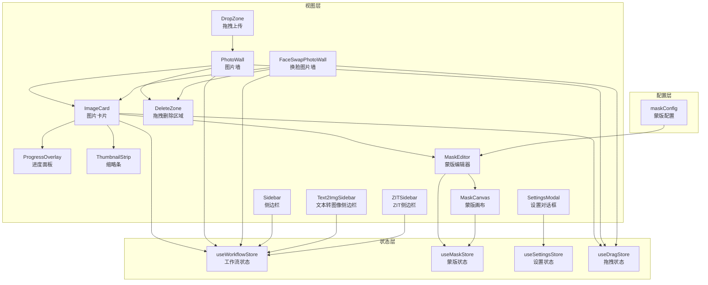

**图表来源**
- [PhotoWall.tsx:1-611](file://client/src/components/PhotoWall.tsx#L1-L611)
- [DropZone.tsx:1-171](file://client/src/components/DropZone.tsx#L1-L171)
- [ProgressOverlay.tsx:1-101](file://client/src/components/ProgressOverlay.tsx#L1-L101)
- [SettingsModal.tsx:1-238](file://client/src/components/SettingsModal.tsx#L1-L238)
- [ImageCard.tsx:1-800](file://client/src/components/ImageCard.tsx#L1-L800)
- [FaceSwapPhotoWall.tsx:1-990](file://client/src/components/FaceSwapPhotoWall.tsx#L1-L990)
- [ThumbnailStrip.tsx:1-231](file://client/src/components/ThumbnailStrip.tsx#L1-L231)
- [MaskEditor.tsx:1-375](file://client/src/components/MaskEditor.tsx#L1-L375)
- [MaskCanvas.tsx:1-677](file://client/src/components/MaskCanvas.tsx#L1-L677)
- [Sidebar.tsx:1-424](file://client/src/components/Sidebar.tsx#L1-L424)
- [Text2ImgSidebar.tsx:1-1033](file://client/src/components/Text2ImgSidebar.tsx#L1-L1033)
- [ZITSidebar.tsx:1-916](file://client/src/components/ZITSidebar.tsx#L1-L916)
- [useWorkflowStore.ts:1-645](file://client/src/hooks/useWorkflowStore.ts#L1-L645)
- [useMaskStore.ts:1-51](file://client/src/hooks/useMaskStore.ts#L1-L51)
- [useSettingsStore.ts:1-31](file://client/src/hooks/useSettingsStore.ts#L1-L31)
- [useDragStore.ts:1-17](file://client/src/hooks/useDragStore.ts#L1-L17)
- [maskConfig.ts:1-20](file://client/src/config/maskConfig.ts#L1-L20)

**章节来源**
- [PhotoWall.tsx:1-611](file://client/src/components/PhotoWall.tsx#L1-L611)
- [DropZone.tsx:1-171](file://client/src/components/DropZone.tsx#L1-L171)
- [ProgressOverlay.tsx:1-101](file://client/src/components/ProgressOverlay.tsx#L1-L101)
- [SettingsModal.tsx:1-238](file://client/src/components/SettingsModal.tsx#L1-L238)
- [ImageCard.tsx:1-800](file://client/src/components/ImageCard.tsx#L1-L800)
- [FaceSwapPhotoWall.tsx:1-990](file://client/src/components/FaceSwapPhotoWall.tsx#L1-L990)
- [ThumbnailStrip.tsx:1-231](file://client/src/components/ThumbnailStrip.tsx#L1-L231)
- [MaskEditor.tsx:1-375](file://client/src/components/MaskEditor.tsx#L1-L375)
- [MaskCanvas.tsx:1-677](file://client/src/components/MaskCanvas.tsx#L1-L677)
- [Sidebar.tsx:1-424](file://client/src/components/Sidebar.tsx#L1-L424)
- [Text2ImgSidebar.tsx:1-1033](file://client/src/components/Text2ImgSidebar.tsx#L1-L1033)
- [ZITSidebar.tsx:1-916](file://client/src/components/ZITSidebar.tsx#L1-L916)
- [useWorkflowStore.ts:1-645](file://client/src/hooks/useWorkflowStore.ts#L1-L645)
- [useMaskStore.ts:1-51](file://client/src/hooks/useMaskStore.ts#L1-L51)
- [useSettingsStore.ts:1-31](file://client/src/hooks/useSettingsStore.ts#L1-L31)
- [useDragStore.ts:1-17](file://client/src/hooks/useDragStore.ts#L1-L17)
- [maskConfig.ts:1-20](file://client/src/config/maskConfig.ts#L1-L20)
- [global.css:1-275](file://client/src/styles/global.css#L1-L275)
- [index.ts:1-58](file://client/src/types/index.ts#L1-L58)

## 核心组件
本节概述四大核心 UI 组件及其职责边界：
- 图片墙组件：负责多图片布局、批量操作、拖拽删除、工作流执行与状态展示
- 拖拽上传区域：支持文件/文件夹拖放、点击选择、预览与导入
- 进度显示面板：展示排队、加载与处理进度，支持取消排队
- 设置对话框：集中管理反推模型与启动行为等全局设置

这些组件通过 hooks 管理的状态进行解耦，遵循单一职责与组合优于继承的设计原则。

**章节来源**
- [PhotoWall.tsx:103-611](file://client/src/components/PhotoWall.tsx#L103-L611)
- [DropZone.tsx:39-171](file://client/src/components/DropZone.tsx#L39-L171)
- [ProgressOverlay.tsx:9-101](file://client/src/components/ProgressOverlay.tsx#L9-L101)
- [SettingsModal.tsx:23-238](file://client/src/components/SettingsModal.tsx#L23-L238)

## 架构总览
下图展示了组件间的数据流与交互关系：视图组件订阅状态钩子，触发工作流状态变更；服务器通过 WebSocket 推送进度与完成消息，驱动 UI 更新。

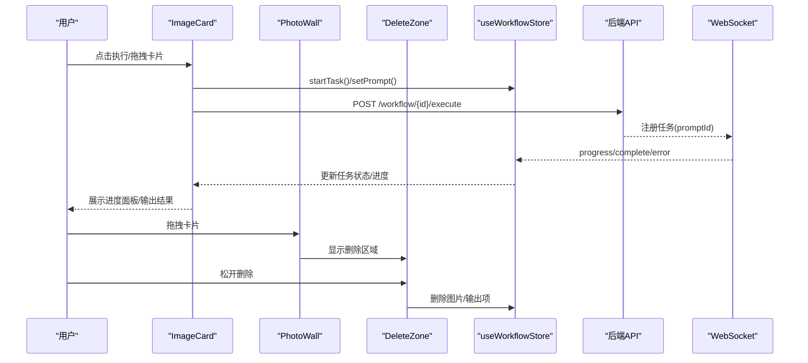

**图表来源**
- [ImageCard.tsx:264-334](file://client/src/components/ImageCard.tsx#L264-L334)
- [PhotoWall.tsx:181-240](file://client/src/components/PhotoWall.tsx#L181-L240)
- [PhotoWall.tsx:300-329](file://client/src/components/PhotoWall.tsx#L300-L329)
- [PhotoWall.tsx:544-607](file://client/src/components/PhotoWall.tsx#L544-L607)
- [useWorkflowStore.ts:377-515](file://client/src/hooks/useWorkflowStore.ts#L377-L515)
- [index.ts:27-57](file://client/src/types/index.ts#L27-L57)

**章节来源**
- [ImageCard.tsx:1-800](file://client/src/components/ImageCard.tsx#L1-L800)
- [PhotoWall.tsx:1-611](file://client/src/components/PhotoWall.tsx#L1-L611)
- [useWorkflowStore.ts:1-645](file://client/src/hooks/useWorkflowStore.ts#L1-L645)
- [index.ts:1-58](file://client/src/types/index.ts#L1-L58)

## 详细组件分析

### 统一的 CSS 类系统
**新增** CorineKit Pix2Real 采用了统一的 CSS 类系统，通过全局样式文件中的通用类来规范组件的视觉表现和交互行为。

#### .sidebar-panel 类
这是新增的核心类，专门用于控制侧边栏组件的文本选择行为：

- **目的**：防止侧边栏标签和交互元素的意外文本选择，提升用户体验
- **实现机制**：使用 `-webkit-user-select: none` 和 `user-select: none` 禁止文本选择
- **例外处理**：为输入字段、文本区域和可编辑元素保留选择功能
- **应用范围**：所有侧边栏相关组件均使用此类

```css
/* Sidebar panels: prevent text selection on labels/buttons, restore for inputs */
.sidebar-panel {
  -webkit-user-select: none;
  user-select: none;
}
.sidebar-panel input,
.sidebar-panel textarea,
.sidebar-panel [contenteditable="true"] {
  -webkit-user-select: text;
  user-select: text;
}
```

**章节来源**
- [global.css:259-269](file://client/src/styles/global.css#L259-L269)

### 图片墙组件（PhotoWall）
- 视图尺寸配置：支持 small/medium/large 三种密度，按列宽与估算卡片高度控制渲染性能
- 懒加载卡片：基于 IntersectionObserver 的占位与滚动补偿，避免首屏抖动与滚动跳变
- 多选工具栏：全选、批量替换提示词、清空蒙版、批量执行
- 拖拽删除区：全局拖拽删除提示与动画，支持卡片与输出项拖拽删除
- 工作流执行：根据活动标签页与选中图片集合，构造表单并调用对应工作流接口

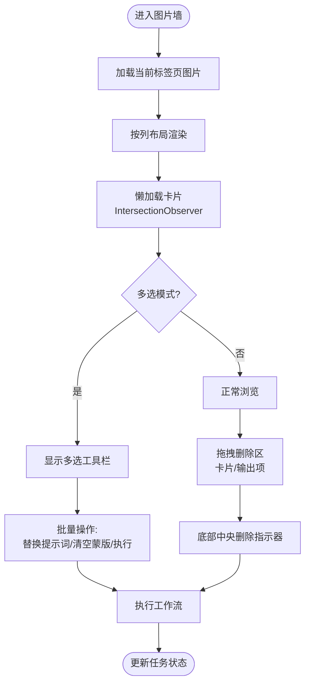

**图表来源**
- [PhotoWall.tsx:12-16](file://client/src/components/PhotoWall.tsx#L12-L16)
- [PhotoWall.tsx:19-97](file://client/src/components/PhotoWall.tsx#L19-L97)
- [PhotoWall.tsx:300-455](file://client/src/components/PhotoWall.tsx#L300-L455)
- [PhotoWall.tsx:511-575](file://client/src/components/PhotoWall.tsx#L511-L575)
- [PhotoWall.tsx:181-240](file://client/src/components/PhotoWall.tsx#L181-L240)
- [PhotoWall.tsx:544-607](file://client/src/components/PhotoWall.tsx#L544-L607)

**章节来源**
- [PhotoWall.tsx:103-611](file://client/src/components/PhotoWall.tsx#L103-L611)

### 拖拽删除区域（DeleteZone）
**更新** 拖拽删除区域是一个位于屏幕底部中央的交互组件，为用户提供清晰的删除意图指示。该组件在用户拖拽任何图片卡片或输出项时自动显示。

#### 视觉设计
- **位置与布局**：固定定位在屏幕底部中央，使用 `left: '50%'` 和 `transform: 'translateX(-50%)'` 实现水平居中
- **背景效果**：采用半透明红色背景（`rgba(239,68,68,0.1)` 到 `rgba(239,68,68,0.28)`），在悬停时增强透明度
- **边框样式**：2px 虚线边框，颜色从半透明（`rgba(239,68,68,0.5)`）变为实线（`rgba(239,68,68,1)`）
- **文本样式**：使用 `#ff6b6b` 颜色，字体大小 14px，粗细 600
- **模糊效果**：应用 `backdropFilter: 'blur(6px)'` 提升视觉层次感

#### 交互行为
- **显示条件**：当 `dragging` 状态存在时显示
- **悬停反馈**：`isOverDeleteZone` 状态控制颜色深浅变化
- **拖拽计数**：使用 `deleteZoneDragCount` 引用计数器处理多重拖拽事件
- **动画效果**：使用 `delete-zone-in` 动画从底部滑入，`fade-in` 渐显背景

#### 删除逻辑
- **卡片删除**：支持单张或多张图片删除，自动清理关联的蒙版数据
- **输出项删除**：支持删除特定输出结果及其对应的蒙版
- **数据清理**：删除时自动清理相关蒙版状态，防止内存泄漏

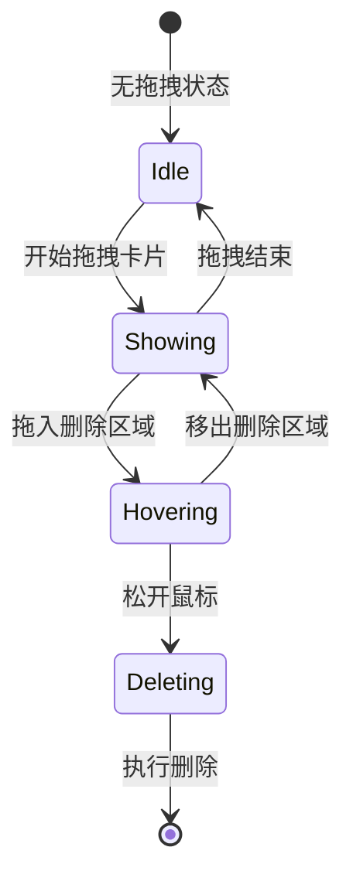

**图表来源**
- [PhotoWall.tsx:544-607](file://client/src/components/PhotoWall.tsx#L544-L607)
- [PhotoWall.tsx:300-329](file://client/src/components/PhotoWall.tsx#L300-L329)
- [global.css:137-140](file://client/src/styles/global.css#L137-L140)

**章节来源**
- [PhotoWall.tsx:544-607](file://client/src/components/PhotoWall.tsx#L544-L607)
- [PhotoWall.tsx:300-329](file://client/src/components/PhotoWall.tsx#L300-L329)
- [global.css:137-140](file://client/src/styles/global.css#L137-L140)

### 拖拽上传区域（DropZone）
- 支持文件与文件夹拖放：递归读取目录树，过滤图片/视频类型
- 响应式样式：全屏模式与工具栏模式切换边框与背景色
- 文件输入回退：点击触发文件选择，过滤非媒体类型
- 事件处理：阻止默认行为与冒泡，确保只由当前组件处理

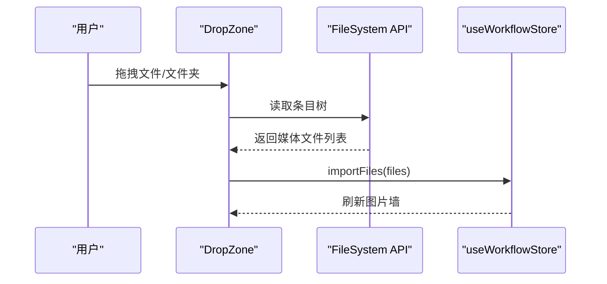

**图表来源**
- [DropZone.tsx:14-37](file://client/src/components/DropZone.tsx#L14-L37)
- [DropZone.tsx:42-73](file://client/src/components/DropZone.tsx#L42-L73)
- [DropZone.tsx:85-91](file://client/src/components/DropZone.tsx#L85-L91)

**章节来源**
- [DropZone.tsx:39-171](file://client/src/components/DropZone.tsx#L39-L171)

### 进度显示面板（ProgressOverlay）
- 状态区分：排队（可取消）、加载中（点阵动画）、处理中（百分比+进度条）
- 交互：排队状态下显示"取消"按钮，点击回调由父组件传入
- 动画：使用 CSS 动画与过渡，保证流畅体验

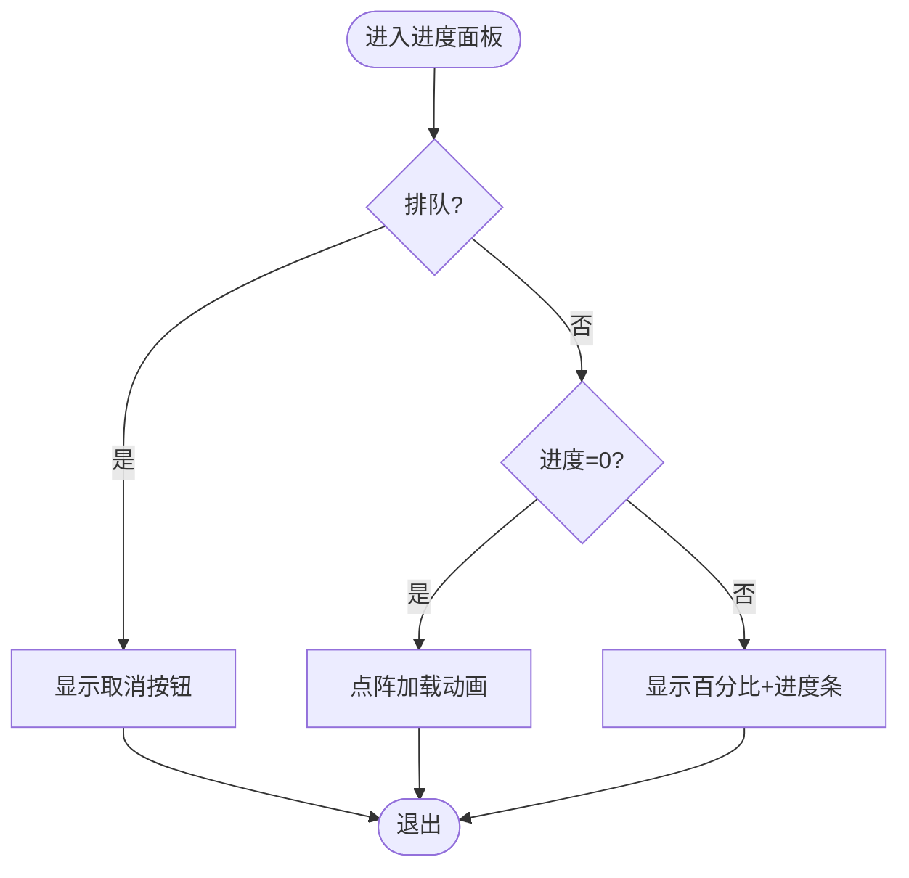

**图表来源**
- [ProgressOverlay.tsx:9-101](file://client/src/components/ProgressOverlay.tsx#L9-L101)

**章节来源**
- [ProgressOverlay.tsx:9-101](file://client/src/components/ProgressOverlay.tsx#L9-L101)

### 设置对话框（SettingsModal）
- 分类导航：工作流、会话两类设置
- 交互：键盘 ESC 关闭、滚动监听高亮当前分类
- 控件：SegmentedControl 用于模型与启动行为选择
- 数据持久化：本地存储键值，初始化与更新同步

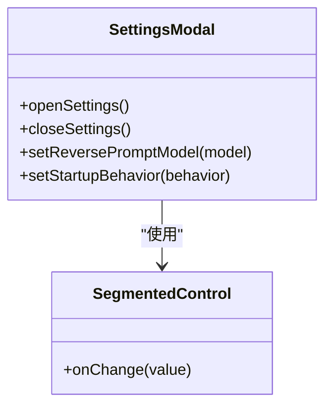

**图表来源**
- [SettingsModal.tsx:23-238](file://client/src/components/SettingsModal.tsx#L23-L238)
- [SegmentedControl.tsx:12-48](file://client/src/components/SegmentedControl.tsx#L12-L48)
- [useSettingsStore.ts:16-31](file://client/src/hooks/useSettingsStore.ts#L16-L31)

**章节来源**
- [SettingsModal.tsx:23-238](file://client/src/components/SettingsModal.tsx#L23-L238)
- [SegmentedControl.tsx:12-48](file://client/src/components/SegmentedControl.tsx#L12-L48)
- [useSettingsStore.ts:16-31](file://client/src/hooks/useSettingsStore.ts#L16-L31)

### 图片卡片组件（ImageCard）
- 任务状态与进度：根据任务状态渲染排队/处理/错误态与进度面板
- 输出缩略条：Tab 7 以外显示原图与生成结果的切换条
- 蒙版功能：根据标签页配置显示蒙版菜单与后位模式开关
- 快捷操作：反推提示词、提示词助理、撤销/重做、清空/反转蒙版
- 拖拽支持：卡片与输出项均可拖拽，携带数据类型与索引

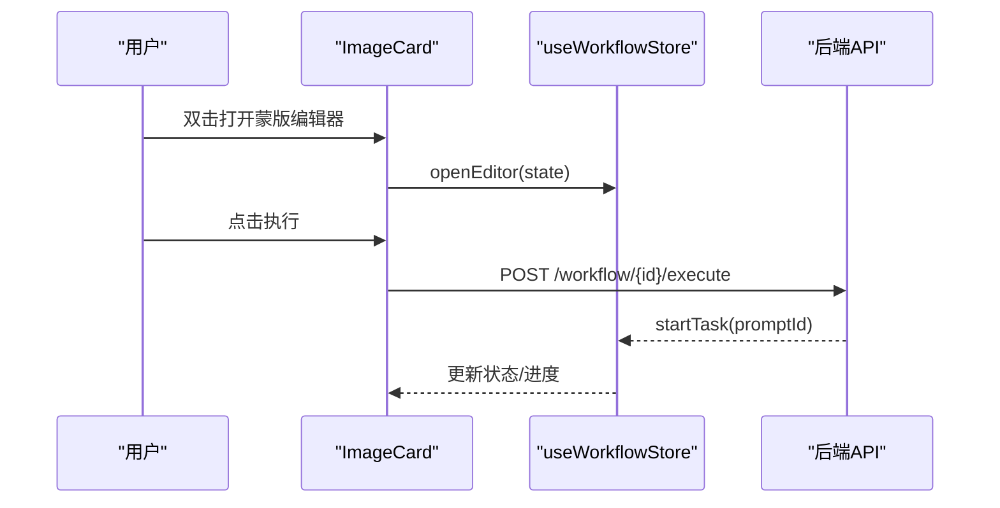

**图表来源**
- [ImageCard.tsx:335-365](file://client/src/components/ImageCard.tsx#L335-L365)
- [ImageCard.tsx:264-334](file://client/src/components/ImageCard.tsx#L264-L334)
- [useWorkflowStore.ts:377-396](file://client/src/hooks/useWorkflowStore.ts#L377-L396)

**章节来源**
- [ImageCard.tsx:42-800](file://client/src/components/ImageCard.tsx#L42-L800)

### 换脸图片墙（FaceSwapPhotoWall）
- 双区布局：左侧"脸部参考"，右侧"目标图"
- 区域拖拽：支持外部文件导入与卡片交叉导入
- 执行流程：目标卡拖到脸部卡或反之，触发换脸任务
- 多选模式：支持批量删除与批量换脸

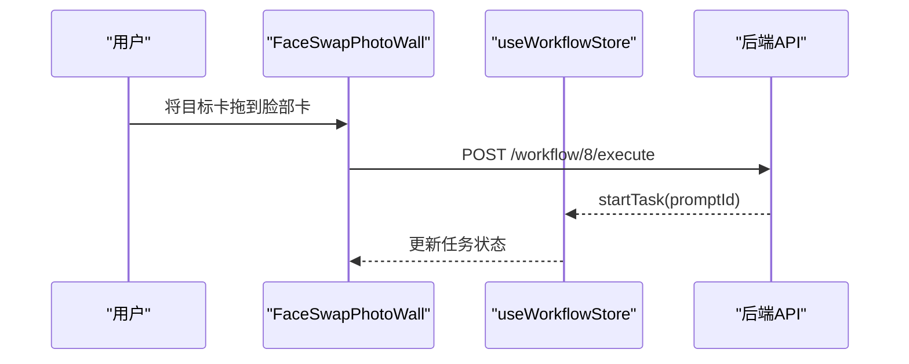

**图表来源**
- [FaceSwapPhotoWall.tsx:256-282](file://client/src/components/FaceSwapPhotoWall.tsx#L256-L282)
- [FaceSwapPhotoWall.tsx:303-333](file://client/src/components/FaceSwapPhotoWall.tsx#L303-L333)
- [useWorkflowStore.ts:377-396](file://client/src/hooks/useWorkflowStore.ts#L377-L396)

**章节来源**
- [FaceSwapPhotoWall.tsx:213-990](file://client/src/components/FaceSwapPhotoWall.tsx#L213-L990)

### 缩略条（ThumbnailStrip）
- 自适应尺寸：根据容器宽度动态计算缩略图尺寸与间距
- 滚动与定位：选中项自动居中，溢出时显示左右箭头
- 拖拽输出：支持将输出项拖拽到其他位置或作为参数传递

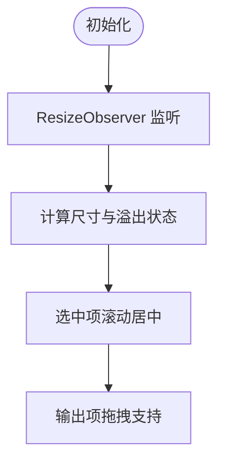

**图表来源**
- [ThumbnailStrip.tsx:48-68](file://client/src/components/ThumbnailStrip.tsx#L48-L68)
- [ThumbnailStrip.tsx:151-169](file://client/src/components/ThumbnailStrip.tsx#L151-L169)

**章节来源**
- [ThumbnailStrip.tsx:34-231](file://client/src/components/ThumbnailStrip.tsx#L34-L231)

### 蒙版编辑器（MaskEditor）与画布（MaskCanvas）
- 编辑器：Mode A/Mode B 两种模式，支持子模式切换、蒙版可见、导出混合结果
- 画布：非累积软笔刷、历史栈、撤销/重做、清空/反转、自动识别填充
- 数据流：编辑器关闭时将蒙版数据写回状态，供工作流使用

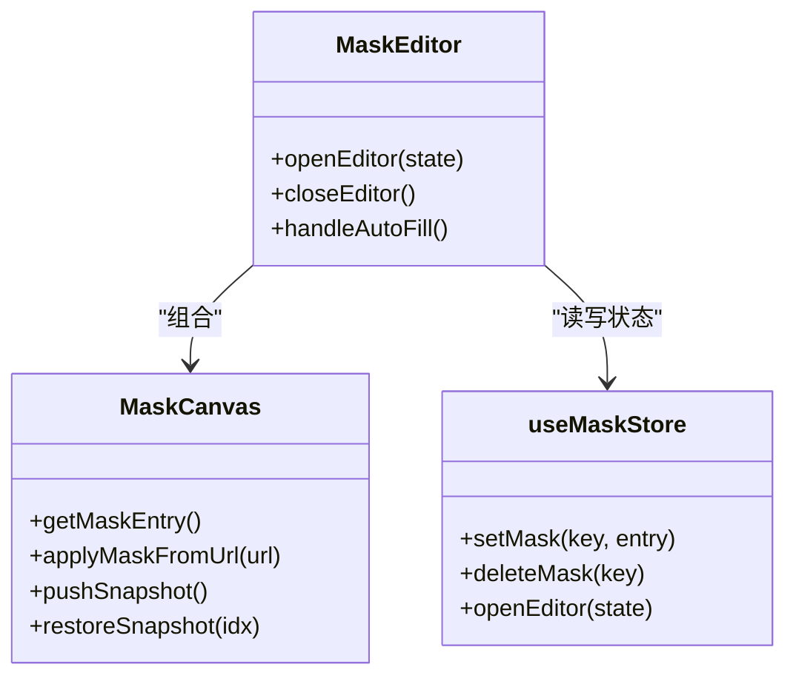

**图表来源**
- [MaskEditor.tsx:141-375](file://client/src/components/MaskEditor.tsx#L141-L375)
- [MaskCanvas.tsx:39-677](file://client/src/components/MaskCanvas.tsx#L39-L677)
- [useMaskStore.ts:32-51](file://client/src/hooks/useMaskStore.ts#L32-L51)

**章节来源**
- [MaskEditor.tsx:141-375](file://client/src/components/MaskEditor.tsx#L141-L375)
- [MaskCanvas.tsx:39-677](file://client/src/components/MaskCanvas.tsx#L39-L677)
- [useMaskStore.ts:1-51](file://client/src/hooks/useMaskStore.ts#L1-L51)

### 侧边栏组件（Sidebar）
**更新** 侧边栏组件使用了新的 `.sidebar-panel` 类来统一控制文本选择行为，确保工作流导航按钮和标签不会被意外选中。

- **工作流导航**：包含多个工作流组，每个组有多个工作流项目
- **拖拽支持**：支持图片卡片和输出缩略图的拖拽操作
- **队列管理**：底部显示任务队列管理按钮
- **状态指示**：显示当前激活的工作流和处理中的项目

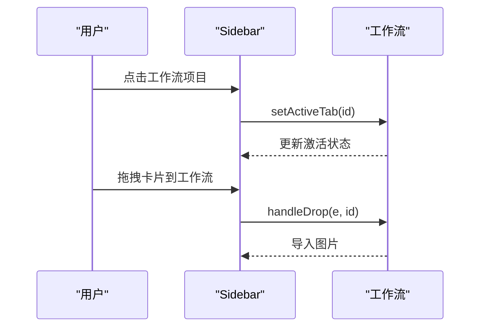

**图表来源**
- [Sidebar.tsx:210-424](file://client/src/components/Sidebar.tsx#L210-L424)

**章节来源**
- [Sidebar.tsx:210-424](file://client/src/components/Sidebar.tsx#L210-L424)

### 文本转图像侧边栏（Text2ImgSidebar）
**更新** Text2ImgSidebar 组件使用了 `.sidebar-panel` 类，确保侧边栏的标签和按钮不会被意外选中，同时保持输入控件的可选择性。

- **模型选择**：支持检查点模型和 LoRA 模型的选择
- **参数调节**：包含步数、CFG、采样器等参数的滑块控件
- **提示词编辑**：支持正向和负向提示词的编辑
- **草稿保存**：自动保存到本地存储，支持草稿恢复

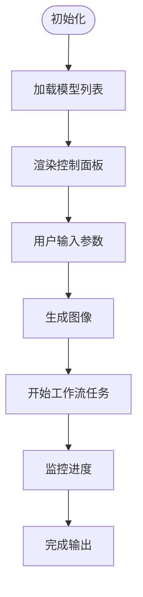

**图表来源**
- [Text2ImgSidebar.tsx:358-557](file://client/src/components/Text2ImgSidebar.tsx#L358-L557)

**章节来源**
- [Text2ImgSidebar.tsx:358-557](file://client/src/components/Text2ImgSidebar.tsx#L358-L557)

### ZIT 侧边栏（ZITSidebar）
**更新** ZITSidebar 组件同样使用了 `.sidebar-panel` 类，提供 ZIT 工作流的专用参数配置界面。

- **UNet 模型**：支持 UNet 模型的选择和配置
- **LoRA 管理**：支持多个 LoRA 模型的启用和强度调节
- **参数配置**：包含偏移量、步数、CFG、采样器等参数
- **批量生成**：支持批量生成多个图像

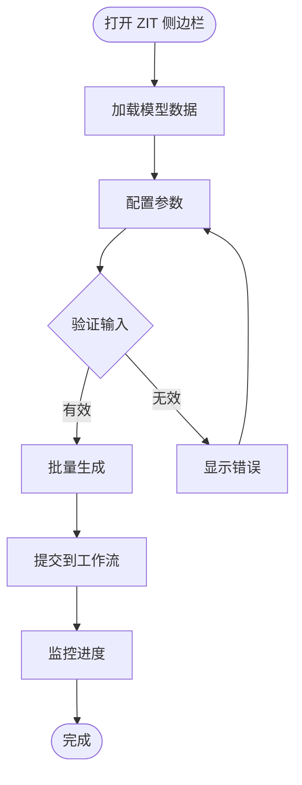

**图表来源**
- [ZITSidebar.tsx:336-557](file://client/src/components/ZITSidebar.tsx#L336-L557)

**章节来源**
- [ZITSidebar.tsx:336-557](file://client/src/components/ZITSidebar.tsx#L336-L557)

## 依赖关系分析
- 组件耦合：PhotoWall 与 ImageCard 通过 useWorkflowStore 与 useDragStore 解耦；DropZone 与 PhotoWall 通过 useWorkflowStore 协同
- 状态依赖：ImageCard 依赖 useWorkflowStore 的任务状态与提示词；蒙版相关组件依赖 useMaskStore
- 配置依赖：maskConfig 决定各标签页是否启用蒙版模式
- 样式依赖：global.css 定义动画与主题变量，统一视觉风格
- **新增** CSS 类依赖：Sidebar、Text2ImgSidebar、ZITSidebar 等侧边栏组件依赖 .sidebar-panel 类来控制文本选择行为

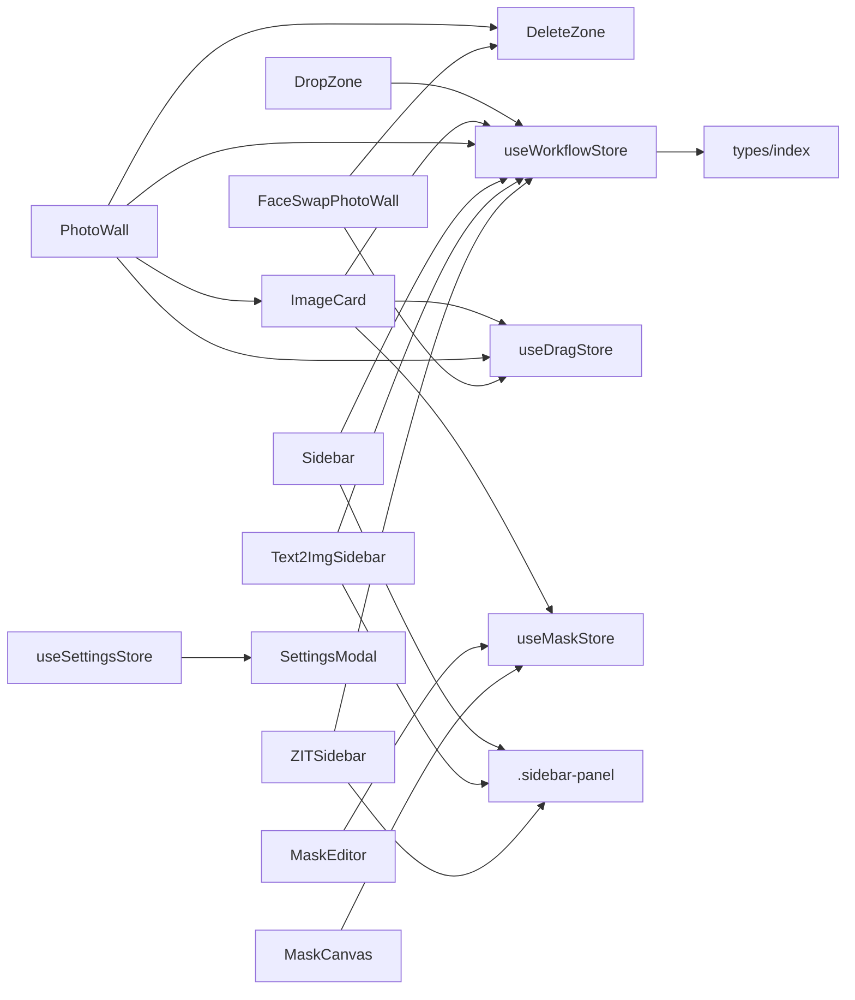

**图表来源**
- [PhotoWall.tsx:1-611](file://client/src/components/PhotoWall.tsx#L1-L611)
- [ImageCard.tsx:1-800](file://client/src/components/ImageCard.tsx#L1-L800)
- [DropZone.tsx:1-171](file://client/src/components/DropZone.tsx#L1-L171)
- [FaceSwapPhotoWall.tsx:1-990](file://client/src/components/FaceSwapPhotoWall.tsx#L1-L990)
- [Sidebar.tsx:1-424](file://client/src/components/Sidebar.tsx#L1-L424)
- [Text2ImgSidebar.tsx:1-1033](file://client/src/components/Text2ImgSidebar.tsx#L1-L1033)
- [ZITSidebar.tsx:1-916](file://client/src/components/ZITSidebar.tsx#L1-L916)
- [useWorkflowStore.ts:1-645](file://client/src/hooks/useWorkflowStore.ts#L1-L645)
- [useDragStore.ts:1-17](file://client/src/hooks/useDragStore.ts#L1-L17)
- [useMaskStore.ts:1-51](file://client/src/hooks/useMaskStore.ts#L1-L51)
- [maskConfig.ts:1-20](file://client/src/config/maskConfig.ts#L1-L20)
- [index.ts:1-58](file://client/src/types/index.ts#L1-L58)
- [useSettingsStore.ts:1-31](file://client/src/hooks/useSettingsStore.ts#L1-L31)
- [SettingsModal.tsx:1-238](file://client/src/components/SettingsModal.tsx#L1-L238)
- [global.css:259-269](file://client/src/styles/global.css#L259-L269)

**章节来源**
- [useWorkflowStore.ts:1-645](file://client/src/hooks/useWorkflowStore.ts#L1-L645)
- [useMaskStore.ts:1-51](file://client/src/hooks/useMaskStore.ts#L1-L51)
- [maskConfig.ts:1-20](file://client/src/config/maskConfig.ts#L1-L20)
- [index.ts:1-58](file://client/src/types/index.ts#L1-L58)
- [global.css:259-269](file://client/src/styles/global.css#L259-L269)

## 性能考量
- 懒加载与滚动补偿：PhotoWall 的 LazyCard 使用 IntersectionObserver 与占位元素，减少首屏渲染压力与滚动抖动
- GPU 加速动画：ProgressOverlay 与卡片闪烁使用 outline 动画，避免昂贵的 box-shadow 重绘
- 稳定回调：ImageCard 与 MaskCanvas 将频繁变化的回调稳定化，降低副作用重绑
- 历史栈限制：MaskCanvas 历史栈最大深度控制在 30，平衡内存占用与可用性
- OffscreenCanvas：蒙版导出与混合使用 OffscreenCanvas，避免主线程阻塞
- **新增** 删除区域优化：使用 `pointerEvents: 'none'` 的背景渐变层避免影响拖拽事件，`pointerEvents: 'all'` 的主区域确保删除功能响应
- **新增** 文本选择优化：.sidebar-panel 类通过 CSS 控制文本选择，避免 JavaScript 事件处理的性能开销

**章节来源**
- [PhotoWall.tsx:19-97](file://client/src/components/PhotoWall.tsx#L19-L97)
- [PhotoWall.tsx:548-560](file://client/src/components/PhotoWall.tsx#L548-L560)
- [PhotoWall.tsx:575-597](file://client/src/components/PhotoWall.tsx#L575-L597)
- [global.css:102-124](file://client/src/styles/global.css#L102-L124)
- [ImageCard.tsx:27-40](file://client/src/components/ImageCard.tsx#L27-L40)
- [MaskCanvas.tsx:8-15](file://client/src/components/MaskCanvas.tsx#L8-L15)
- [MaskCanvas.tsx:180-190](file://client/src/components/MaskCanvas.tsx#L180-L190)
- [global.css:259-269](file://client/src/styles/global.css#L259-L269)

## 故障排除指南
- 执行失败：检查 clientId 是否存在、网络连接与后端服务状态
- 进度不更新：确认 WebSocket 连接与消息类型（progress/complete/error），核对 promptId 映射
- 蒙版无效：确认标签页是否支持蒙版（maskConfig），检查蒙版数据尺寸与工作分辨率匹配
- 拖拽异常：确保拖拽数据类型正确（application/x-workflow-image 等），避免事件冒泡冲突
- 蒙版导出失败：检查输出目录权限与文件名合法性，查看错误提示信息
- **新增** 删除区域无响应：检查 `isOverDeleteZone` 状态更新逻辑，确认拖拽计数器正确递增递减
- **新增** 侧边栏文本意外选择：确认组件是否正确应用了 `.sidebar-panel` 类，检查 CSS 样式优先级

**章节来源**
- [ImageCard.tsx:232-241](file://client/src/components/ImageCard.tsx#L232-L241)
- [useWorkflowStore.ts:166-195](file://client/src/hooks/useWorkflowStore.ts#L166-L195)
- [maskConfig.ts:5-16](file://client/src/config/maskConfig.ts#L5-L16)
- [useDragStore.ts:4-11](file://client/src/hooks/useDragStore.ts#L4-L11)
- [MaskEditor.tsx:53-108](file://client/src/components/MaskEditor.tsx#L53-L108)
- [PhotoWall.tsx:562-573](file://client/src/components/PhotoWall.tsx#L562-L573)
- [global.css:259-269](file://client/src/styles/global.css#L259-L269)

## 结论
本 UI 组件体系通过清晰的分层与稳定的回调机制，实现了高性能、可扩展的图像处理工作流界面。PhotoWall、DropZone、ProgressOverlay 与 SettingsModal 四大组件协同工作，结合 ImageCard 的丰富交互与蒙版系统的完善，为用户提供一致且高效的创作体验。

**新增** 统一的 CSS 类系统显著提升了组件的一致性和可维护性，特别是 .sidebar-panel 类的应用，通过 CSS 层面的文本选择控制，避免了 JavaScript 事件处理的复杂性，提升了性能和用户体验。

新增的拖拽删除区域组件进一步提升了用户操作的直观性和安全性，通过底部中央的视觉指示明确表达删除意图。建议在后续迭代中持续关注性能指标与可访问性标准，进一步提升用户体验与稳定性。

## 附录
- 响应式设计：组件普遍采用 CSS Grid、Flexbox 与 ResizeObserver，适配不同屏幕尺寸
- 无障碍访问：为关键交互元素提供标题与键盘快捷键支持（如蒙版编辑器的撤销/重做）
- 跨浏览器兼容：使用标准 Web API（Fetch、WebSocket、OffscreenCanvas），注意浏览器特性检测与降级策略
- **新增** 统一 CSS 类系统：通过 .sidebar-panel 类实现一致的文本选择控制，提升用户体验
- **新增** 删除区域可访问性：使用语义化的 Trash2 图标和中文提示文本，确保视觉和文字双重指示

**章节来源**
- [global.css:1-275](file://client/src/styles/global.css#L1-L275)
- [MaskEditor.tsx:238-251](file://client/src/components/MaskEditor.tsx#L238-L251)
- [MaskCanvas.tsx:403-454](file://client/src/components/MaskCanvas.tsx#L403-L454)
- [PhotoWall.tsx:598-604](file://client/src/components/PhotoWall.tsx#L598-L604)
- [FaceSwapPhotoWall.tsx:979-983](file://client/src/components/FaceSwapPhotoWall.tsx#L979-L983)
- [Sidebar.tsx:212](file://client/src/components/Sidebar.tsx#L212)
- [Text2ImgSidebar.tsx:358](file://client/src/components/Text2ImgSidebar.tsx#L358)
- [ZITSidebar.tsx:336](file://client/src/components/ZITSidebar.tsx#L336)