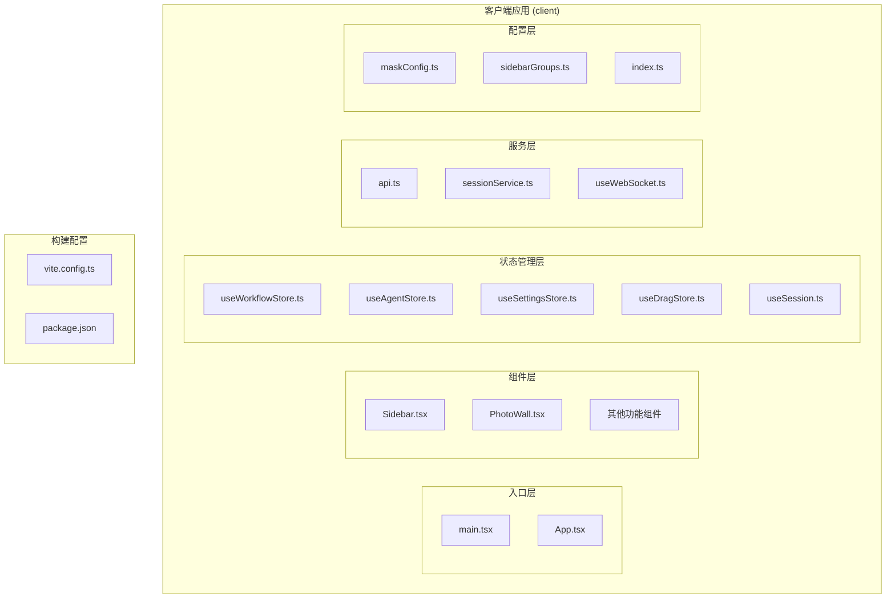
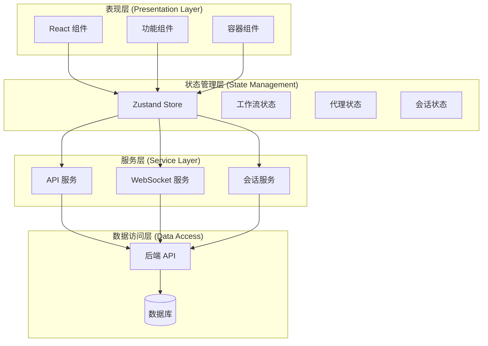
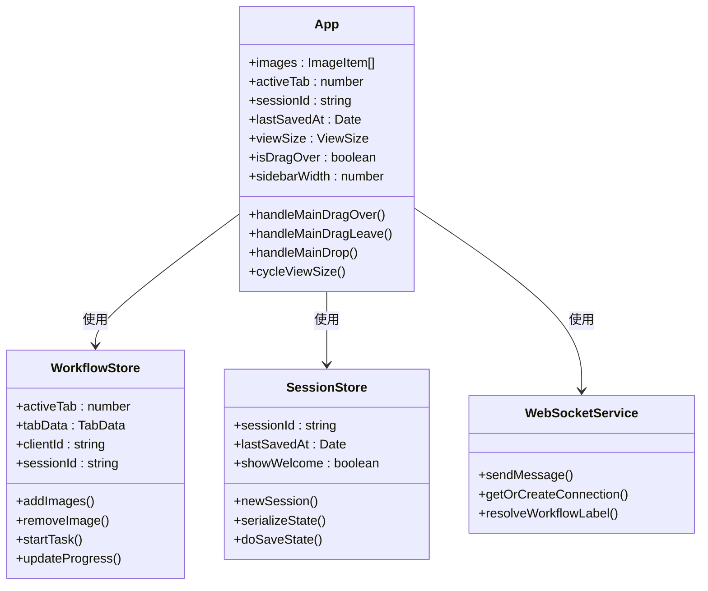
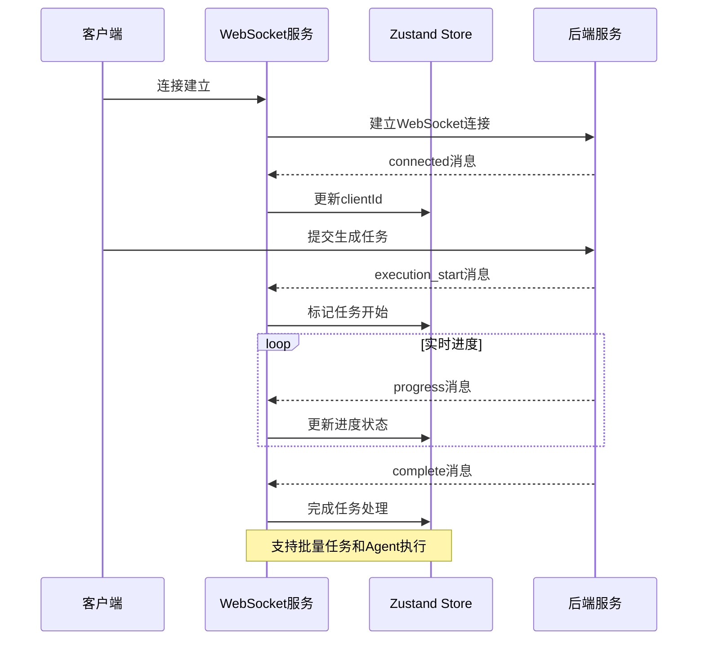
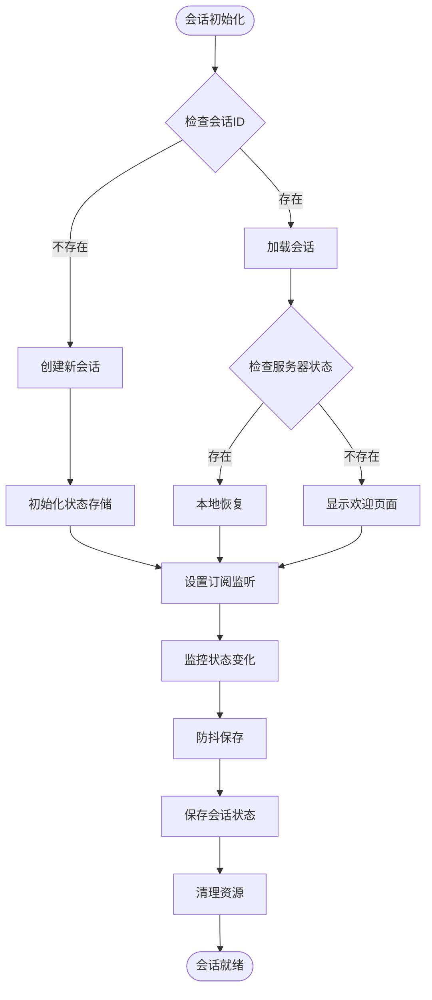
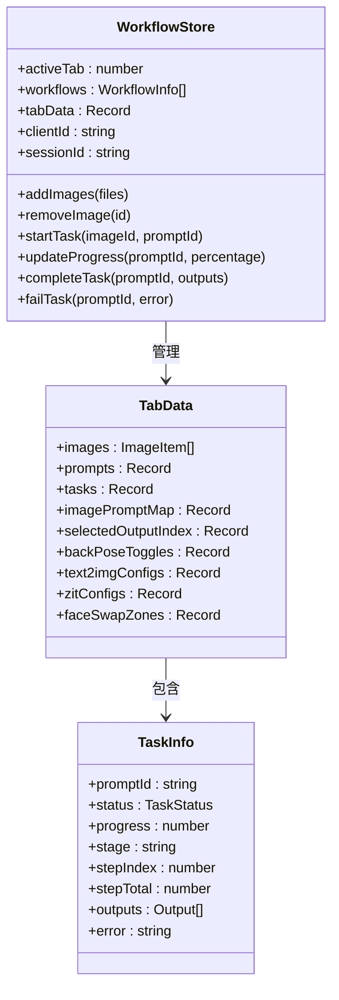

# 前端架构设计

<cite>
**本文档引用的文件**
- [client/package.json](file://client/package.json)
- [client/vite.config.ts](file://client/vite.config.ts)
- [client/src/main.tsx](file://client/src/main.tsx)
- [client/src/components/App.tsx](file://client/src/components/App.tsx)
- [client/src/services/api.ts](file://client/src/services/api.ts)
- [client/src/hooks/useWebSocket.ts](file://client/src/hooks/useWebSocket.ts)
- [client/src/hooks/useSession.ts](file://client/src/hooks/useSession.ts)
- [client/src/hooks/useWorkflowStore.ts](file://client/src/hooks/useWorkflowStore.ts)
- [client/src/hooks/useAgentStore.ts](file://client/src/hooks/useAgentStore.ts)
- [client/src/hooks/useSettingsStore.ts](file://client/src/hooks/useSettingsStore.ts)
- [client/src/tokens/index.ts](file://client/src/tokens/index.ts)
- [client/src/services/sessionService.ts](file://client/src/services/sessionService.ts)
- [client/src/components/Sidebar.tsx](file://client/src/components/Sidebar.tsx)
- [client/src/components/PhotoWall.tsx](file://client/src/components/PhotoWall.tsx)
- [client/src/data/sidebarGroups.ts](file://client/src/data/sidebarGroups.ts)
- [client/src/config/maskConfig.ts](file://client/src/config/maskConfig.ts)
- [client/src/hooks/useDragStore.ts](file://client/src/hooks/useDragStore.ts)
- [client/src/hooks/useToast.ts](file://client/src/hooks/useToast.ts)
</cite>

## 目录
1. [引言](#引言)
2. [项目结构](#项目结构)
3. [核心组件](#核心组件)
4. [架构概览](#架构概览)
5. [详细组件分析](#详细组件分析)
6. [依赖关系分析](#依赖关系分析)
7. [性能考虑](#性能考虑)
8. [故障排除指南](#故障排除指南)
9. [结论](#结论)

## 引言

CorineKit Pix2Real 是一个基于 React 19 + TypeScript + Vite 的 AI 图像生成前端应用。该应用采用现代前端技术栈，结合 Zustand 状态管理、WebSocket 实时通信和适配器模式，为用户提供完整的图像生成和处理工作流。

本架构设计文档详细说明了前端系统的组件层次结构、状态管理模式、WebSocket 通信实现和路由系统设计，重点解释了如何通过适配器模式调用后端 API、管理会话状态和工作流状态，以及实现实时进度追踪。

## 项目结构

项目采用模块化的组织方式，主要分为以下几个核心部分：



**图表来源**
- [client/src/main.tsx:1-11](file://client/src/main.tsx#L1-L11)
- [client/src/components/App.tsx:1-422](file://client/src/components/App.tsx#L1-L422)
- [client/vite.config.ts:1-28](file://client/vite.config.ts#L1-L28)

**章节来源**
- [client/package.json:1-26](file://client/package.json#L1-L26)
- [client/vite.config.ts:1-28](file://client/vite.config.ts#L1-L28)

## 核心组件

### 应用入口与生命周期管理

应用的启动流程从 main.tsx 开始，通过 React 19 的严格模式渲染 App 组件。App.tsx 作为根组件，负责管理全局状态、路由和组件协调。

### 状态管理系统

系统采用 Zustand 作为轻量级状态管理解决方案，包含多个专门的状态存储：

- **工作流状态存储** (`useWorkflowStore.ts`): 管理图像生成工作流的核心状态
- **AI代理状态存储** (`useAgentStore.ts`): 处理智能代理相关的状态
- **设置状态存储** (`useSettingsStore.ts`): 管理用户偏好设置
- **拖拽状态存储** (`useDragStore.ts`): 处理组件间拖拽操作状态
- **会话状态存储** (`useSession.ts`): 管理会话持久化和恢复

### WebSocket 通信层

`useWebSocket.ts` 实现了统一的 WebSocket 连接管理，支持连接池、自动重连和消息分发机制。

**章节来源**
- [client/src/main.tsx:1-11](file://client/src/main.tsx#L1-L11)
- [client/src/components/App.tsx:1-422](file://client/src/components/App.tsx#L1-L422)
- [client/src/hooks/useWorkflowStore.ts:1-800](file://client/src/hooks/useWorkflowStore.ts#L1-L800)
- [client/src/hooks/useAgentStore.ts:1-337](file://client/src/hooks/useAgentStore.ts#L1-L337)
- [client/src/hooks/useSettingsStore.ts:1-177](file://client/src/hooks/useSettingsStore.ts#L1-L177)

## 架构概览

系统采用分层架构设计，各层职责明确，通过适配器模式实现前后端解耦：



**图表来源**
- [client/src/components/App.tsx:1-422](file://client/src/components/App.tsx#L1-L422)
- [client/src/hooks/useWebSocket.ts:1-278](file://client/src/hooks/useWebSocket.ts#L1-L278)
- [client/src/services/api.ts:1-42](file://client/src/services/api.ts#L1-L42)

### 组件通信机制

系统采用多种组件通信模式：

1. **父子组件通信**: 通过 props 和回调函数传递数据
2. **兄弟组件通信**: 通过共享状态存储实现
3. **跨层级通信**: 通过全局状态管理和事件发布订阅模式

### 状态提升策略

对于需要在多个组件间共享的状态，采用状态提升到最近公共祖先的方式，并通过 Zustand store 实现集中管理。

## 详细组件分析

### App 根组件分析

App.tsx 作为应用的根组件，承担着全局状态协调和组件编排的重要职责：



**图表来源**
- [client/src/components/App.tsx:61-422](file://client/src/components/App.tsx#L61-L422)
- [client/src/hooks/useWorkflowStore.ts:191-800](file://client/src/hooks/useWorkflowStore.ts#L191-L800)
- [client/src/hooks/useSession.ts:118-435](file://client/src/hooks/useSession.ts#L118-L435)
- [client/src/hooks/useWebSocket.ts:254-278](file://client/src/hooks/useWebSocket.ts#L254-L278)

**章节来源**
- [client/src/components/App.tsx:61-422](file://client/src/components/App.tsx#L61-L422)

### WebSocket 通信实现

WebSocket 服务实现了统一的消息处理机制，支持多种消息类型的分发：



**图表来源**
- [client/src/hooks/useWebSocket.ts:29-278](file://client/src/hooks/useWebSocket.ts#L29-L278)

**章节来源**
- [client/src/hooks/useWebSocket.ts:29-278](file://client/src/hooks/useWebSocket.ts#L29-L278)

### 会话状态管理

会话管理实现了完整的会话生命周期控制，包括创建、恢复、保存和清理：



**图表来源**
- [client/src/hooks/useSession.ts:272-435](file://client/src/hooks/useSession.ts#L272-L435)

**章节来源**
- [client/src/hooks/useSession.ts:272-435](file://client/src/hooks/useSession.ts#L272-L435)

### 工作流状态管理

工作流状态存储实现了复杂的工作流管理逻辑，支持多种图像生成工作流：



**图表来源**
- [client/src/hooks/useWorkflowStore.ts:85-183](file://client/src/hooks/useWorkflowStore.ts#L85-L183)
- [client/src/hooks/useWorkflowStore.ts:101-183](file://client/src/hooks/useWorkflowStore.ts#L101-L183)

**章节来源**
- [client/src/hooks/useWorkflowStore.ts:85-183](file://client/src/hooks/useWorkflowStore.ts#L85-L183)

### 组件间通信机制

系统实现了多种组件间通信模式：

1. **状态提升**: 将共享状态提升到父组件
2. **事件发布订阅**: 使用全局事件系统
3. **回调函数**: 通过 props 传递回调函数
4. **状态存储**: 通过 Zustand store 共享状态

**章节来源**
- [client/src/components/Sidebar.tsx:1-434](file://client/src/components/Sidebar.tsx#L1-L434)
- [client/src/components/PhotoWall.tsx:1-781](file://client/src/components/PhotoWall.tsx#L1-L781)

## 依赖关系分析

系统采用模块化设计，各模块间依赖关系清晰：

```mermaid
graph TB
subgraph "核心依赖"
REACT[react@^19.0.0]
ZUSTAND[zustand@^5.0.0]
LUCIDE[lucide-react@^0.468.0]
end
subgraph "开发依赖"
VITE[vite@^6.0.0]
TYPESCRIPT[typescript@~5.7.0]
TS_BUILD[typescript@~5.7.0]
end
subgraph "应用模块"
MAIN[main.tsx]
APP[App.tsx]
STORES[状态存储模块]
SERVICES[服务模块]
COMPONENTS[组件模块]
end
MAIN --> APP
APP --> STORES
APP --> SERVICES
APP --> COMPONENTS
STORES --> ZUSTAND
SERVICES --> REACT
COMPONENTS --> LUCIDE
```

**图表来源**
- [client/package.json:11-24](file://client/package.json#L11-L24)

**章节来源**
- [client/package.json:11-24](file://client/package.json#L11-L24)

### 错误处理模式

系统实现了多层次的错误处理机制：

1. **网络请求错误**: 通过 try-catch 和响应状态检查
2. **WebSocket 错误**: 实现自动重连和错误状态管理
3. **状态管理错误**: 使用 Zustand 的错误边界机制
4. **UI 错误处理**: 通过 Toast 通知用户错误信息

**章节来源**
- [client/src/hooks/useWebSocket.ts:232-244](file://client/src/hooks/useWebSocket.ts#L232-L244)
- [client/src/hooks/useToast.ts:18-70](file://client/src/hooks/useToast.ts#L18-L70)

## 性能考虑

系统在性能方面采用了多项优化措施：

1. **虚拟滚动**: PhotoWall 实现了 IntersectionObserver 优化
2. **状态选择性更新**: 使用 Zustand 的选择性订阅
3. **懒加载**: 组件级别的懒加载实现
4. **防抖机制**: 会话保存采用防抖策略
5. **内存管理**: 及时清理 Blob URL 和事件监听器

## 故障排除指南

### 常见问题及解决方案

1. **WebSocket 连接失败**
   - 检查后端服务是否正常运行
   - 验证代理配置是否正确
   - 查看浏览器控制台的网络错误

2. **会话恢复失败**
   - 确认服务器端会话数据完整性
   - 检查本地存储权限
   - 验证文件上传权限

3. **状态不同步**
   - 检查 Zustand store 的订阅机制
   - 确认状态更新的原子性
   - 验证状态序列化过程

**章节来源**
- [client/src/hooks/useWebSocket.ts:232-244](file://client/src/hooks/useWebSocket.ts#L232-L244)
- [client/src/hooks/useSession.ts:388-397](file://client/src/hooks/useSession.ts#L388-L397)

## 结论

CorineKit Pix2Real 的前端架构设计充分体现了现代前端开发的最佳实践。通过 React 19 的最新特性、Zustand 的轻量级状态管理、WebSocket 的实时通信能力和模块化的组件设计，构建了一个高性能、可维护的图像生成应用。

该架构的主要优势包括：

1. **清晰的分层设计**: 各层职责明确，便于维护和扩展
2. **强大的状态管理**: Zustand 提供了简单而强大的状态管理能力
3. **实时通信支持**: WebSocket 实现了流畅的用户体验
4. **模块化组织**: 文件结构清晰，便于团队协作
5. **性能优化**: 多项性能优化措施确保了良好的用户体验

未来可以考虑的改进方向包括：增加更多的测试覆盖、实现更完善的错误边界处理、优化移动端体验等。