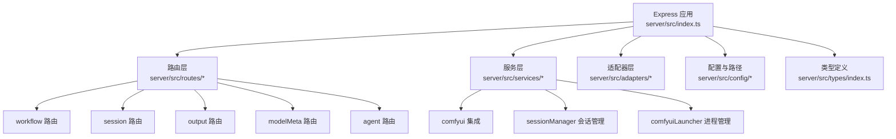
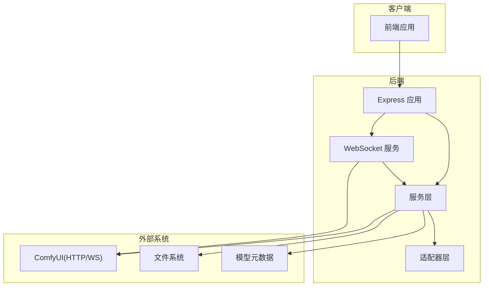
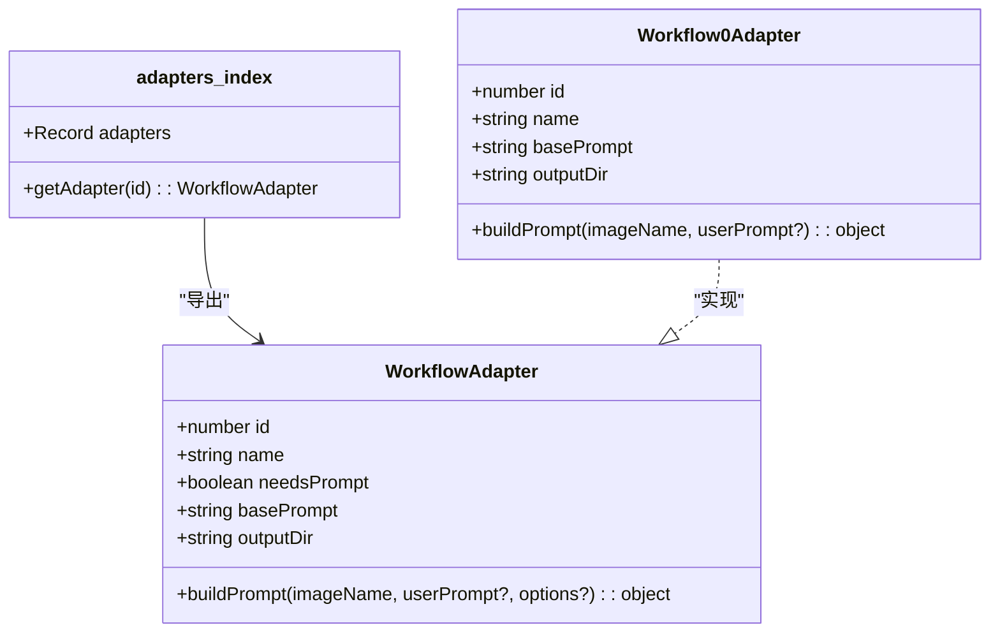
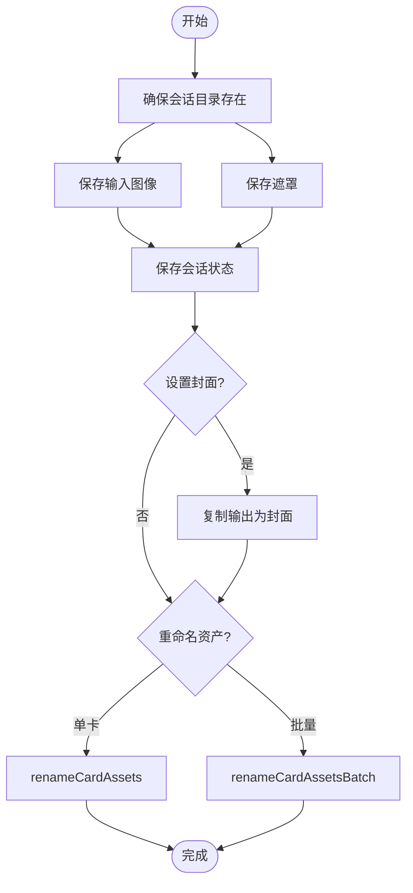
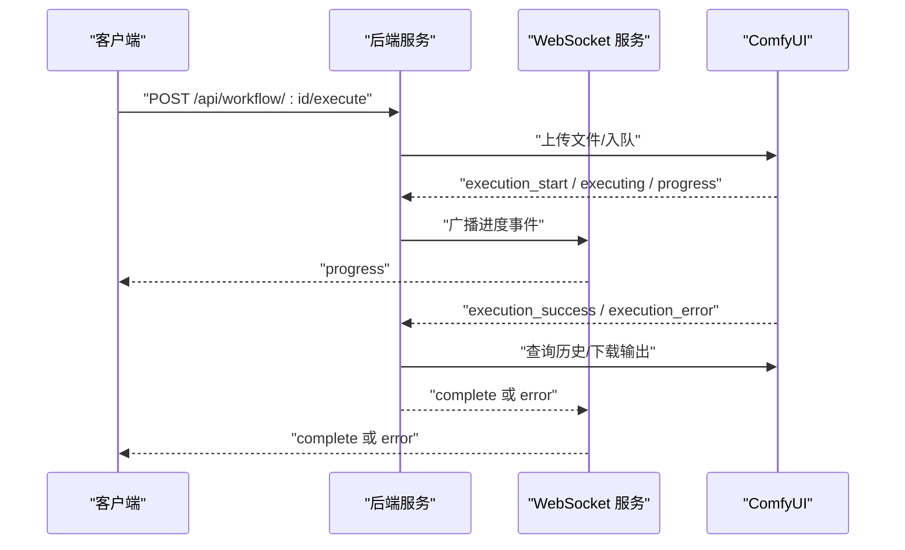
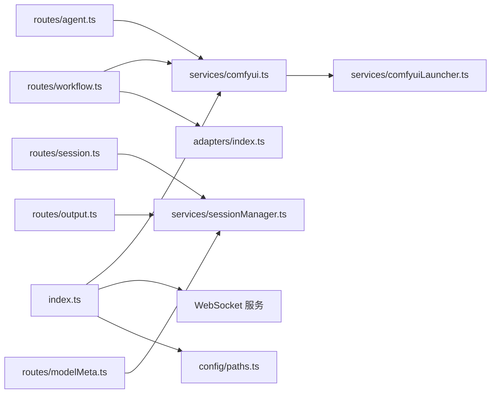

# 后端架构设计

<cite>
**本文档引用的文件**
- [server/src/index.ts](file://server/src/index.ts)
- [server/package.json](file://server/package.json)
- [server/src/adapters/BaseAdapter.ts](file://server/src/adapters/BaseAdapter.ts)
- [server/src/adapters/index.ts](file://server/src/adapters/index.ts)
- [server/src/adapters/Workflow0Adapter.ts](file://server/src/adapters/Workflow0Adapter.ts)
- [server/src/services/comfyui.ts](file://server/src/services/comfyui.ts)
- [server/src/services/sessionManager.ts](file://server/src/services/sessionManager.ts)
- [server/src/services/comfyuiLauncher.ts](file://server/src/services/comfyuiLauncher.ts)
- [server/src/routers/workflow.ts](file://server/src/routes/workflow.ts)
- [server/src/routers/session.ts](file://server/src/routes/session.ts)
- [server/src/routers/output.ts](file://server/src/routes/output.ts)
- [server/src/routers/modelMeta.ts](file://server/src/routes/modelMeta.ts)
- [server/src/routers/agent.ts](file://server/src/routes/agent.ts)
- [server/src/types/index.ts](file://server/src/types/index.ts)
- [server/src/config/paths.ts](file://server/src/config/paths.ts)
</cite>

## 目录
1. [引言](#引言)
2. [项目结构](#项目结构)
3. [核心组件](#核心组件)
4. [架构总览](#架构总览)
5. [详细组件分析](#详细组件分析)
6. [依赖关系分析](#依赖关系分析)
7. [性能考虑](#性能考虑)
8. [故障排除指南](#故障排除指南)
9. [结论](#结论)

## 引言
本文件面向 CorineKit Pix2Real 的后端架构设计，基于 Express + TypeScript 实现，重点阐述以下方面：
- 路由系统设计与 RESTful API 规范
- 服务层架构与适配器模式实现
- 会话管理系统与文件系统操作
- 与 ComfyUI 的集成：进程管理、WebSocket 连接、进度追踪与输出下载
- 中间件使用、错误处理机制与性能优化策略

目标是帮助开发者与运维人员快速理解后端职责划分、交互流程与扩展点。

## 项目结构
后端采用“按功能模块分层”的组织方式，核心目录与职责如下：
- server/src
  - adapters：适配器层，封装 11 种工作流的模板与参数装配
  - routes：路由层，暴露 RESTful API
  - services：服务层，封装 ComfyUI 集成、会话管理、文件系统、模型元数据等
  - config：配置与路径管理
  - types：共享类型定义
  - index.ts：应用入口，初始化 Express、WebSocket、静态资源与中间件

图表来源
- [server/src/index.ts:118-145](file://server/src/index.ts#L118-L145)
- [server/src/adapters/index.ts:14-30](file://server/src/adapters/index.ts#L14-L30)
- [server/src/routers/workflow.ts:1-30](file://server/src/routes/workflow.ts#L1-L30)
- [server/src/routers/session.ts:1-20](file://server/src/routes/session.ts#L1-L20)
- [server/src/routers/output.ts:1-15](file://server/src/routes/output.ts#L1-L15)
- [server/src/routers/modelMeta.ts:1-20](file://server/src/routes/modelMeta.ts#L1-L20)
- [server/src/routers/agent.ts:1-20](file://server/src/routes/agent.ts#L1-L20)
- [server/src/services/comfyui.ts:1-20](file://server/src/services/comfyui.ts#L1-L20)
- [server/src/services/sessionManager.ts:1-10](file://server/src/services/sessionManager.ts#L1-L10)
- [server/src/services/comfyuiLauncher.ts:1-15](file://server/src/services/comfyuiLauncher.ts#L1-L15)
- [server/src/config/paths.ts:1-15](file://server/src/config/paths.ts#L1-L15)

章节来源
- [server/src/index.ts:118-145](file://server/src/index.ts#L118-L145)
- [server/src/adapters/index.ts:14-30](file://server/src/adapters/index.ts#L14-L30)

## 核心组件
- 应用入口与中间件
  - 初始化 Express、CORS、JSON 解析、静态资源与路由挂载
  - 提供 /api/comfyui/status 健康检查
- WebSocket 服务
  - 管理客户端连接、事件缓冲与重放、进度计算与完成回调
  - 与 ComfyUI WebSocket 对接，桥接进度、缓存命中、执行完成与错误
- 适配器层
  - 通过 WorkflowAdapter 接口抽象工作流模板装配，支持 11 种工作流
  - 每个适配器负责读取对应 ComfyUI JSON 模板并注入参数
- 服务层
  - comfyui.ts：上传文件、入队、历史查询、进度追踪、系统状态、队列管理
  - sessionManager.ts：会话目录与文件管理、封面、资产重命名、批量重命名
  - comfyuiLauncher.ts：ComfyUI 进程检测、启动与就绪等待
  - paths.ts：集中化路径与配置管理，支持运行时切换 sessions 根目录
- 路由层
  - workflow 路由：工作流执行、模型列表、参考图上传与访问
  - session 路由：会话状态保存、封面设置、资产重命名
  - output 路由：输出文件列表与下载、打开系统默认应用
  - modelMeta 路由：模型元数据 CRUD、缩略图上传与删除
  - agent 路由：AI 助手建议生成、意图解析与工具调用

章节来源
- [server/src/index.ts:118-155](file://server/src/index.ts#L118-L155)
- [server/src/services/comfyui.ts:168-471](file://server/src/services/comfyui.ts#L168-L471)
- [server/src/adapters/index.ts:28-30](file://server/src/adapters/index.ts#L28-L30)
- [server/src/services/sessionManager.ts:102-133](file://server/src/services/sessionManager.ts#L102-L133)
- [server/src/services/comfyuiLauncher.ts:101-130](file://server/src/services/comfyuiLauncher.ts#L101-L130)
- [server/src/config/paths.ts:35-100](file://server/src/config/paths.ts#L35-L100)
- [server/src/routers/workflow.ts:152-800](file://server/src/routes/workflow.ts#L152-L800)
- [server/src/routers/session.ts:21-160](file://server/src/routes/session.ts#L21-L160)
- [server/src/routers/output.ts:27-136](file://server/src/routes/output.ts#L27-L136)
- [server/src/routers/modelMeta.ts:43-271](file://server/src/routes/modelMeta.ts#L43-L271)
- [server/src/routers/agent.ts:613-649](file://server/src/routes/agent.ts#L613-L649)

## 架构总览
后端整体采用“路由层-服务层-适配器层-外部系统”的分层架构：
- 路由层负责请求接入与参数校验
- 服务层封装业务逻辑与外部系统交互
- 适配器层屏蔽不同工作流的模板差异
- 外部系统包括 ComfyUI（HTTP/WebSocket）、文件系统、模型元数据存储

图表来源
- [server/src/index.ts:118-155](file://server/src/index.ts#L118-L155)
- [server/src/services/comfyui.ts:168-375](file://server/src/services/comfyui.ts#L168-L375)
- [server/src/services/sessionManager.ts:1-50](file://server/src/services/sessionManager.ts#L1-L50)
- [server/src/adapters/index.ts:14-30](file://server/src/adapters/index.ts#L14-L30)

## 详细组件分析

### 路由系统设计与 RESTful API
- 路由组织
  - /api/workflow：工作流执行、模型列表、参考图上传与访问
  - /api/session：会话状态保存、封面设置、资产重命名
  - /api/output：输出文件列表与下载、打开系统默认应用
  - /api/models：模型元数据访问
  - /api/agent：AI 助手建议生成
  - /api/favorites：收藏夹静态资源
- 请求体与参数
  - 多部分上传：使用 multer 处理 image/mask 等文件字段
  - JSON 请求体：用于工作流参数传递
  - 查询参数：clientId 等标识符
- 错误处理
  - 统一捕获异常并转换为用户友好提示（如模型缺失、队列失败）
  - 对 ComfyUI 返回的 value_not_in_list 等错误进行中文映射

章节来源
- [server/src/routers/workflow.ts:152-800](file://server/src/routes/workflow.ts#L152-L800)
- [server/src/routers/session.ts:21-160](file://server/src/routes/session.ts#L21-L160)
- [server/src/routers/output.ts:27-136](file://server/src/routes/output.ts#L27-L136)
- [server/src/routers/modelMeta.ts:43-271](file://server/src/routes/modelMeta.ts#L43-L271)
- [server/src/routers/agent.ts:613-649](file://server/src/routes/agent.ts#L613-L649)

### 服务层架构与适配器模式
- 适配器接口
  - WorkflowAdapter：定义工作流 id、名称、是否需要提示词、基础提示词、输出目录与 buildPrompt 方法
- 适配器注册
  - adapters/index.ts 统一导出并按 id 映射，getAdapter 提供按 id 获取适配器的能力
- 典型实现
  - Workflow0Adapter：读取特定 JSON 模板，注入上传图像、提示词与随机种子
- 适配器模式优势
  - 屏蔽不同工作流模板差异，统一通过 buildPrompt 生成 ComfyUI prompt
  - 便于新增工作流与维护现有工作流

图表来源
- [server/src/types/index.ts:1-8](file://server/src/types/index.ts#L1-L8)
- [server/src/adapters/index.ts:14-30](file://server/src/adapters/index.ts#L14-L30)
- [server/src/adapters/Workflow0Adapter.ts:9-34](file://server/src/adapters/Workflow0Adapter.ts#L9-L34)

章节来源
- [server/src/types/index.ts:1-8](file://server/src/types/index.ts#L1-L8)
- [server/src/adapters/index.ts:14-30](file://server/src/adapters/index.ts#L14-L30)
- [server/src/adapters/Workflow0Adapter.ts:9-34](file://server/src/adapters/Workflow0Adapter.ts#L9-L34)

### 会话管理系统与文件系统操作
- 目录结构
  - sessions/{sessionId}/tab-{tabId}/input、masks、output
  - 支持动态切换 sessions 根目录（通过 config.json 覆盖）
- 文件操作
  - 输入图像上传、遮罩保存、输出文件持久化
  - 封面设置：复制输出文件为封面并更新 session.json
  - 资产重命名：支持单卡与批量重命名，带冲突检测与事务语义
- 会话状态
  - session.json 记录创建/更新时间、活动标签页、每张卡的任务与输出、封面信息等

图表来源
- [server/src/services/sessionManager.ts:11-18](file://server/src/services/sessionManager.ts#L11-L18)
- [server/src/services/sessionManager.ts:37-48](file://server/src/services/sessionManager.ts#L37-L48)
- [server/src/services/sessionManager.ts:178-218](file://server/src/services/sessionManager.ts#L178-L218)
- [server/src/services/sessionManager.ts:256-360](file://server/src/services/sessionManager.ts#L256-L360)
- [server/src/services/sessionManager.ts:381-538](file://server/src/services/sessionManager.ts#L381-L538)

章节来源
- [server/src/services/sessionManager.ts:11-18](file://server/src/services/sessionManager.ts#L11-L18)
- [server/src/services/sessionManager.ts:37-48](file://server/src/services/sessionManager.ts#L37-L48)
- [server/src/services/sessionManager.ts:178-218](file://server/src/services/sessionManager.ts#L178-L218)
- [server/src/services/sessionManager.ts:256-360](file://server/src/services/sessionManager.ts#L256-L360)
- [server/src/services/sessionManager.ts:381-538](file://server/src/services/sessionManager.ts#L381-L538)
- [server/src/config/paths.ts:74-100](file://server/src/config/paths.ts#L74-L100)

### 与 ComfyUI 的集成：进程管理与 WebSocket 连接
- 进程管理
  - isComfyUIRunning：通过 /system_stats 判断服务状态
  - launchComfyUI：spawn 启动 ComfyUI（Windows 可执行路径）
  - ensureComfyUI：未运行时自动启动并轮询等待就绪
- WebSocket 集成
  - connectWebSocket：连接 ComfyUI WS，监听 progress、execution_cached、execution_success、execution_error 等事件
  - 事件桥接：将进度、缓存命中、执行完成与错误转发至客户端 WebSocket
  - 完成处理：等待 ComfyUI 历史落盘，下载输出到会话目录，清理临时状态
- 进度追踪
  - 基于节点权重的全局进度计算，支持多轮节点（如 UltimateSDUpscale）与 tiled 采样器
  - 阶段名映射：将节点 class_type 映射为中文阶段名

图表来源
- [server/src/services/comfyui.ts:168-196](file://server/src/services/comfyui.ts#L168-L196)
- [server/src/services/comfyui.ts:265-375](file://server/src/services/comfyui.ts#L265-L375)
- [server/src/services/comfyui.ts:390-408](file://server/src/services/comfyui.ts#L390-L408)
- [server/src/services/comfyui.ts:415-440](file://server/src/services/comfyui.ts#L415-L440)
- [server/src/services/comfyui.ts:442-471](file://server/src/services/comfyui.ts#L442-L471)
- [server/src/index.ts:168-494](file://server/src/index.ts#L168-L494)

章节来源
- [server/src/services/comfyuiLauncher.ts:24-53](file://server/src/services/comfyuiLauncher.ts#L24-L53)
- [server/src/services/comfyuiLauncher.ts:58-88](file://server/src/services/comfyuiLauncher.ts#L58-L88)
- [server/src/services/comfyuiLauncher.ts:101-130](file://server/src/services/comfyuiLauncher.ts#L101-L130)
- [server/src/services/comfyui.ts:265-375](file://server/src/services/comfyui.ts#L265-L375)
- [server/src/services/comfyui.ts:390-408](file://server/src/services/comfyui.ts#L390-L408)
- [server/src/services/comfyui.ts:415-440](file://server/src/services/comfyui.ts#L415-L440)
- [server/src/services/comfyui.ts:442-471](file://server/src/services/comfyui.ts#L442-L471)
- [server/src/index.ts:168-494](file://server/src/index.ts#L168-L494)

### 输出管理与文件系统操作
- 输出目录
  - output/{workflowId} 下按工作流分类存放输出文件
  - /output 与 /api/output 提供静态与受控访问
- 打开文件
  - /api/output/open-file：根据 URL 解析并调用系统默认应用打开文件
- 模型元数据
  - /api/models/metadata 提供元数据 CRUD，缩略图上传与删除
  - 元数据变更时清理空条目，保持整洁

章节来源
- [server/src/routes/output.ts:27-136](file://server/src/routes/output.ts#L27-L136)
- [server/src/routes/modelMeta.ts:43-271](file://server/src/routes/modelMeta.ts#L43-L271)

### 中间件与错误处理
- 中间件
  - CORS：允许前端开发地址访问
  - express.json：解析 JSON 请求体（限制 50MB）
  - 静态资源：输出目录、会话目录、模型元数据目录
- 错误处理
  - 统一捕获异常，将 ComfyUI 错误映射为中文提示
  - 对文件系统与网络请求失败进行降级与日志记录

章节来源
- [server/src/index.ts:121-128](file://server/src/index.ts#L121-L128)
- [server/src/index.ts:134-145](file://server/src/index.ts#L134-L145)
- [server/src/routers/workflow.ts:126-150](file://server/src/routes/workflow.ts#L126-L150)

## 依赖关系分析
- 模块耦合
  - 路由层依赖服务层；服务层依赖适配器层与外部系统
  - WebSocket 服务与服务层双向协作：事件桥接与完成处理
- 外部依赖
  - Express、ws、node-fetch、multer、cors
- 类型与配置
  - types/index.ts 定义共享类型
  - config/paths.ts 提供集中化路径管理与运行时覆盖

图表来源
- [server/src/routers/workflow.ts:9-14](file://server/src/routes/workflow.ts#L9-L14)
- [server/src/routers/session.ts:4-16](file://server/src/routes/session.ts#L4-L16)
- [server/src/routers/output.ts](file://server/src/routes/output.ts#L6)
- [server/src/routers/modelMeta.ts:1-7](file://server/src/routes/modelMeta.ts#L1-L7)
- [server/src/routers/agent.ts:5-13](file://server/src/routes/agent.ts#L5-L13)
- [server/src/services/comfyui.ts:1-7](file://server/src/services/comfyui.ts#L1-L7)
- [server/src/services/comfyuiLauncher.ts:1-11](file://server/src/services/comfyuiLauncher.ts#L1-L11)
- [server/src/index.ts:8-18](file://server/src/index.ts#L8-L18)
- [server/src/config/paths.ts:1-15](file://server/src/config/paths.ts#L1-L15)

章节来源
- [server/src/package.json:11-26](file://server/package.json#L11-L26)
- [server/src/types/index.ts:1-52](file://server/src/types/index.ts#L1-L52)

## 性能考虑
- 进度计算与事件缓冲
  - 使用事件缓冲与重放机制，避免客户端注册延迟导致的进度丢失
  - 基于节点权重的全局进度，减少前端复杂计算
- I/O 与并发
  - 输出下载采用异步与重试策略，确保 ComfyUI 历史落盘后再读取
  - 会话状态保存采用原子写入，避免竞态
- 资源限制
  - JSON 解析限制 50MB，避免过大请求占用内存
  - 多部分上传使用内存存储，建议在生产环境配合文件系统与 CDN

## 故障排除指南
- ComfyUI 未运行
  - 使用 /api/comfyui/status 检查状态
  - ensureComfyUI 会在未运行时自动启动并等待，超时会抛出错误
- 工作流执行失败
  - 检查模型文件是否存在（ckpt/lora/unet/vae/control_net）
  - 查看 toFriendlyComfyError 的中文映射提示
- 输出为空或“完成但空”
  - WebSocket onComplete 后会重试获取历史，确认磁盘写入完成
  - 检查输出目录权限与磁盘空间
- 会话重命名冲突
  - renameCardAssets 与 renameCardAssetsBatch 均进行冲突检测，失败时抛出明确错误
- 路径与权限问题
  - setSessionsBase 会写入 config.json 并验证可写性
  - validateSessionsBase 提供路径合法性校验

章节来源
- [server/src/index.ts:148-155](file://server/src/index.ts#L148-L155)
- [server/src/services/comfyuiLauncher.ts:101-130](file://server/src/services/comfyuiLauncher.ts#L101-L130)
- [server/src/routers/workflow.ts:126-150](file://server/src/routes/workflow.ts#L126-L150)
- [server/src/services/comfyui.ts:335-447](file://server/src/services/comfyui.ts#L335-L447)
- [server/src/services/sessionManager.ts:256-360](file://server/src/services/sessionManager.ts#L256-L360)
- [server/src/services/sessionManager.ts:381-538](file://server/src/services/sessionManager.ts#L381-L538)
- [server/src/config/paths.ts:84-100](file://server/src/config/paths.ts#L84-L100)
- [server/src/config/paths.ts:106-137](file://server/src/config/paths.ts#L106-L137)

## 结论
本后端架构通过清晰的分层设计与适配器模式，实现了对 11 种工作流的统一接入与扩展；借助 WebSocket 与 ComfyUI 的深度集成，提供了稳定可靠的进度追踪与输出管理；会话管理与文件系统操作保障了用户工作流的持久化与可追溯性。整体设计兼顾易用性、可维护性与可扩展性，适合在桌面端与未来可能的 Electron 打包场景中部署与演进。