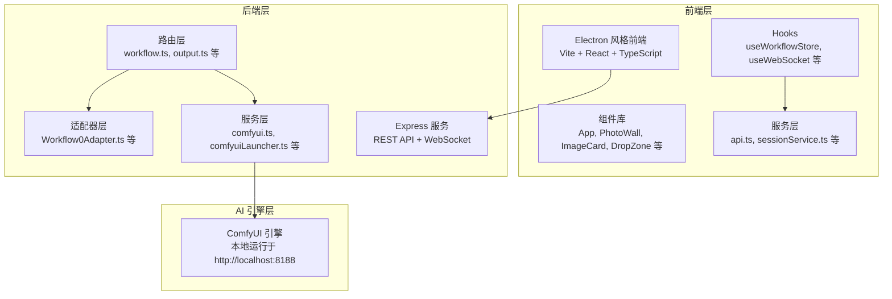
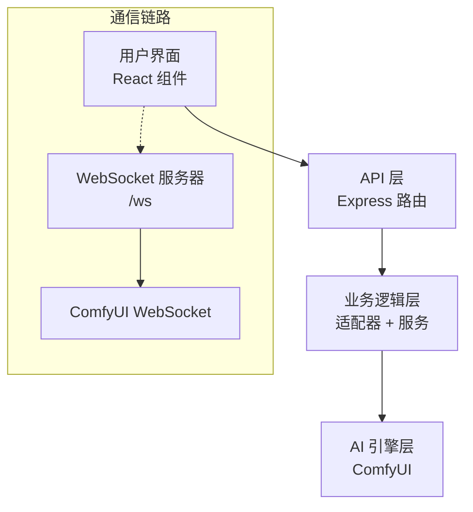
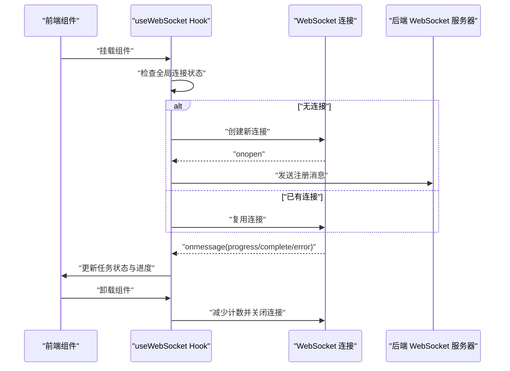
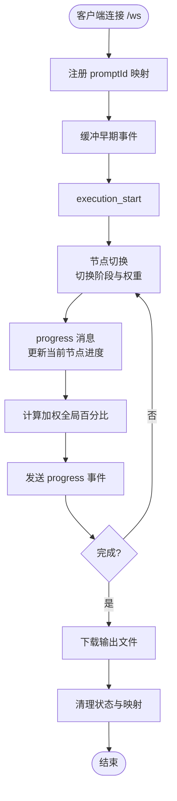
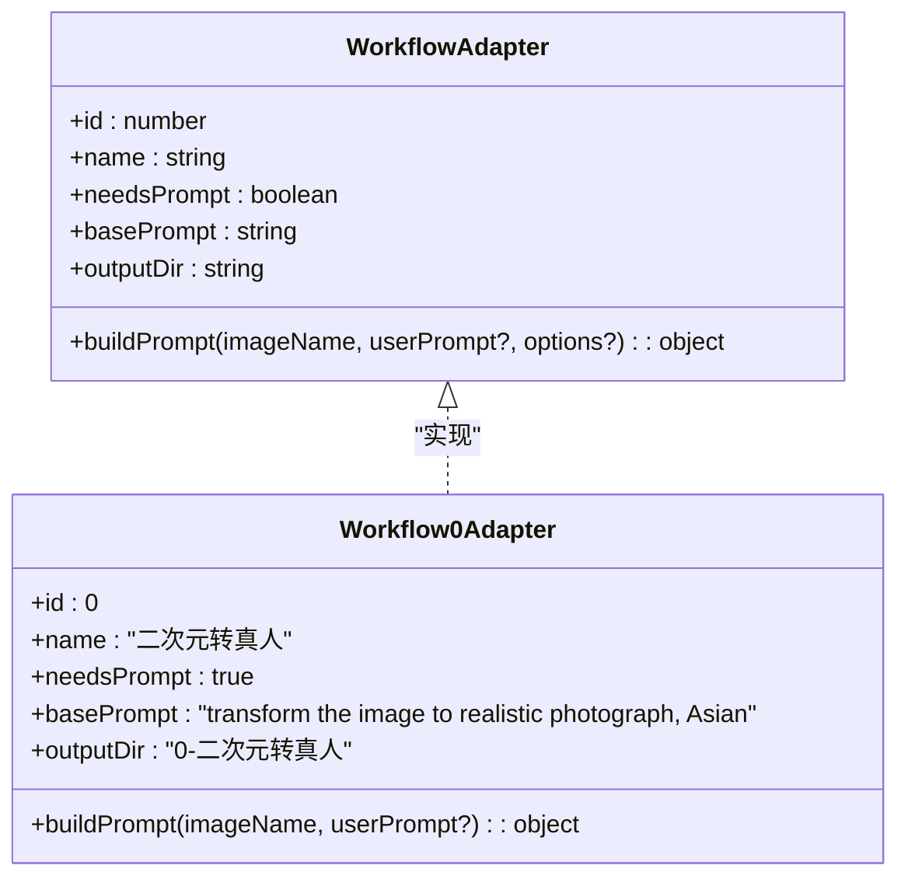
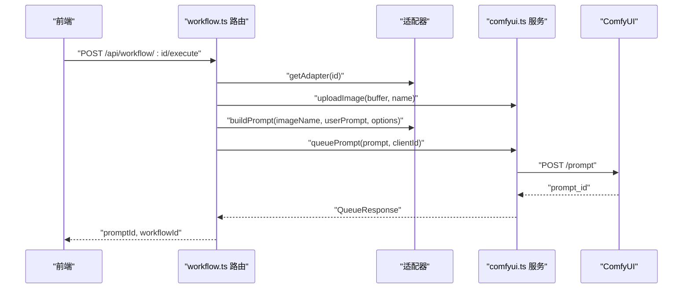
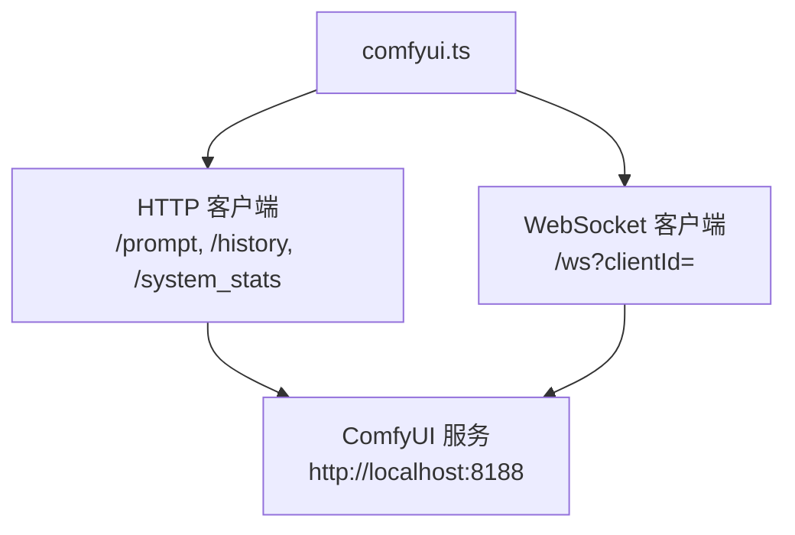
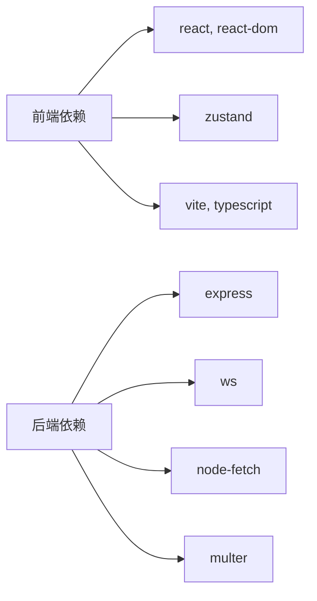

# 整体架构概览

<cite>
**本文档引用的文件**
- [README.md](file://README.md)
- [package.json](file://package.json)
- [client/package.json](file://client/package.json)
- [server/package.json](file://server/package.json)
- [server/src/index.ts](file://server/src/index.ts)
- [server/src/adapters/BaseAdapter.ts](file://server/src/adapters/BaseAdapter.ts)
- [server/src/adapters/index.ts](file://server/src/adapters/index.ts)
- [server/src/adapters/Workflow0Adapter.ts](file://server/src/adapters/Workflow0Adapter.ts)
- [server/src/services/comfyui.ts](file://server/src/services/comfyui.ts)
- [server/src/services/comfyuiLauncher.ts](file://server/src/services/comfyuiLauncher.ts)
- [server/src/routes/workflow.ts](file://server/src/routes/workflow.ts)
- [server/src/types/index.ts](file://server/src/types/index.ts)
- [client/src/hooks/useWebSocket.ts](file://client/src/hooks/useWebSocket.ts)
- [client/src/services/api.ts](file://client/src/services/api.ts)
- [client/src/types/index.ts](file://client/src/types/index.ts)
</cite>

## 目录
1. [引言](#引言)
2. [项目结构](#项目结构)
3. [核心组件](#核心组件)
4. [架构总览](#架构总览)
5. [详细组件分析](#详细组件分析)
6. [依赖关系分析](#依赖关系分析)
7. [性能考量](#性能考量)
8. [故障排除指南](#故障排除指南)
9. [结论](#结论)

## 引言
CorineKit Pix2Real 是一个本地化的 Web 图像/视频处理界面，通过 ComfyUI 实现批处理与实时进度反馈。系统采用 Electron 风格的前后端分离架构：前端使用 Vite + React + TypeScript 构建用户界面；后端使用 Express + TypeScript 提供 REST API 与 WebSocket 服务；WebSocket 通信层负责将 ComfyUI 的进度事件实时转发至浏览器；适配器模式支持多种 AI 工作流；单例模式管理 WebSocket 连接，确保跨组件的一致性与稳定性。

## 项目结构
项目采用多包结构，主要目录与职责如下：
- client：前端应用，包含组件、Hooks、服务与类型定义
- server：后端服务，包含路由、适配器、服务与类型定义
- ComfyUI_API：工作流 JSON 模板集合
- output：生成文件输出目录（受版本控制忽略）
- model_meta：模型元数据与缩略图
- 文档与计划：需求文档与设计文档

**图表来源**
- [README.md:41-62](file://README.md#L41-L62)
- [client/package.json:1-26](file://client/package.json#L1-L26)
- [server/package.json:1-28](file://server/package.json#L1-L28)

**章节来源**
- [README.md:41-62](file://README.md#L41-L62)
- [package.json:1-15](file://package.json#L1-L15)

## 核心组件
- 前端 Electron 风格应用：提供用户界面、状态管理与 WebSocket 通信封装
- 后端 Express 服务：提供 REST API、静态资源服务与 WebSocket 服务器
- 适配器模式：为不同工作流提供统一接口与模板定制
- WebSocket 通信层：连接 ComfyUI 并将进度事件转发至前端
- ComfyUI 集成层：负责上传文件、入队、历史查询与输出下载

**章节来源**
- [README.md:74-79](file://README.md#L74-L79)
- [client/src/hooks/useWebSocket.ts:1-278](file://client/src/hooks/useWebSocket.ts#L1-L278)
- [server/src/services/comfyui.ts:1-472](file://server/src/services/comfyui.ts#L1-L472)

## 架构总览
系统采用分层架构，明确划分职责边界：
- 用户界面层：React 组件与 Hooks，负责状态管理与 UI 交互
- API 层：Express 路由与控制器，负责请求处理与业务编排
- 业务逻辑层：适配器与服务，负责工作流模板构建与 ComfyUI 交互
- AI 引擎层：ComfyUI 本地服务，负责实际的图像/视频处理

**图表来源**
- [server/src/index.ts:157-494](file://server/src/index.ts#L157-L494)
- [server/src/services/comfyui.ts:265-375](file://server/src/services/comfyui.ts#L265-L375)

## 详细组件分析

### 前端 WebSocket 单例管理
前端通过自定义 Hook 管理 WebSocket 连接，使用模块级全局变量确保全局唯一连接，并通过计数器控制生命周期，实现优雅断开与重连。

**图表来源**
- [client/src/hooks/useWebSocket.ts:29-278](file://client/src/hooks/useWebSocket.ts#L29-L278)
- [server/src/index.ts:168-494](file://server/src/index.ts#L168-L494)

**章节来源**
- [client/src/hooks/useWebSocket.ts:1-278](file://client/src/hooks/useWebSocket.ts#L1-L278)

### 后端 WebSocket 服务器与进度聚合
后端为每个客户端维护独立的 WebSocket 连接，负责：
- 注册 promptId 与工作流/会话映射
- 缓存并重放早期进度事件
- 聚合 ComfyUI 节点级进度，计算加权全局百分比
- 下载输出文件并清理临时状态

**图表来源**
- [server/src/index.ts:168-494](file://server/src/index.ts#L168-L494)

**章节来源**
- [server/src/index.ts:168-494](file://server/src/index.ts#L168-L494)

### 适配器模式支持多工作流
系统通过适配器模式为不同工作流提供统一接口，每个适配器负责：
- 加载对应的工作流 JSON 模板
- 注入输入参数（图像名称、提示词、种子等）
- 返回可直接入队的 prompt 对象

**图表来源**
- [server/src/types/index.ts:1-8](file://server/src/types/index.ts#L1-L8)
- [server/src/adapters/Workflow0Adapter.ts:1-35](file://server/src/adapters/Workflow0Adapter.ts#L1-L35)

**章节来源**
- [server/src/adapters/BaseAdapter.ts:1-4](file://server/src/adapters/BaseAdapter.ts#L1-L4)
- [server/src/adapters/index.ts:1-33](file://server/src/adapters/index.ts#L1-L33)
- [server/src/adapters/Workflow0Adapter.ts:1-35](file://server/src/adapters/Workflow0Adapter.ts#L1-L35)

### 后端路由与工作流执行
后端路由负责：
- 文件上传与参数解析
- 适配器选择与模板构建
- 调用 ComfyUI 服务入队
- 统一错误处理与用户友好提示

**图表来源**
- [server/src/routes/workflow.ts:750-799](file://server/src/routes/workflow.ts#L750-L799)
- [server/src/services/comfyui.ts:168-196](file://server/src/services/comfyui.ts#L168-L196)

**章节来源**
- [server/src/routes/workflow.ts:1-800](file://server/src/routes/workflow.ts#L1-L800)
- [server/src/services/comfyui.ts:1-472](file://server/src/services/comfyui.ts#L1-L472)

### ComfyUI 集成与系统状态
后端服务通过 HTTP 与 WebSocket 与 ComfyUI 交互，包括：
- 上传图像/视频
- 入队工作流
- 查询历史与输出
- 获取系统状态（VRAM/内存）
- 启动与检测 ComfyUI 服务

**图表来源**
- [server/src/services/comfyui.ts:1-472](file://server/src/services/comfyui.ts#L1-L472)
- [server/src/services/comfyuiLauncher.ts:1-131](file://server/src/services/comfyuiLauncher.ts#L1-L131)

**章节来源**
- [server/src/services/comfyui.ts:1-472](file://server/src/services/comfyui.ts#L1-L472)
- [server/src/services/comfyuiLauncher.ts:1-131](file://server/src/services/comfyuiLauncher.ts#L1-L131)

## 依赖关系分析
- 前端依赖：React、Zustand（状态管理）、Lucide-React（图标）、Vite（构建）
- 后端依赖：Express（Web 框架）、ws（WebSocket）、node-fetch（HTTP 客户端）、multer（文件上传）

**图表来源**
- [client/package.json:11-24](file://client/package.json#L11-L24)
- [server/package.json:11-26](file://server/package.json#L11-L26)

**章节来源**
- [client/package.json:1-26](file://client/package.json#L1-L26)
- [server/package.json:1-28](file://server/package.json#L1-L28)

## 性能考量
- WebSocket 单例：避免重复连接带来的资源浪费与并发问题
- 事件缓冲与重放：解决客户端注册时机与 ComfyUI 开始执行的时间差
- 加权进度计算：基于节点类型与步骤数的权重，提升进度条准确性
- 多轮节点处理：对 tiled 采样器等多轮节点采用 tick 计数，避免回退
- 输出下载延迟：等待 ComfyUI 历史提交后再下载，避免“完成但空”的问题

## 故障排除指南
- ComfyUI 未运行：后端提供自动启动与检测机制，若失败需手动启动
- WebSocket 连接异常：前端 Hook 提供自动重连与错误处理
- 工作流执行错误：后端将 ComfyUI 的错误映射为用户友好提示
- 输出为空：确认历史已提交，必要时增加重试等待

**章节来源**
- [server/src/services/comfyuiLauncher.ts:101-131](file://server/src/services/comfyuiLauncher.ts#L101-L131)
- [client/src/hooks/useWebSocket.ts:232-244](file://client/src/hooks/useWebSocket.ts#L232-L244)
- [server/src/routes/workflow.ts:126-150](file://server/src/routes/workflow.ts#L126-L150)

## 结论
CorineKit Pix2Real 通过清晰的分层架构与适配器模式，实现了对多种 AI 工作流的统一接入；借助 WebSocket 单例与进度聚合，提供了稳定可靠的实时反馈体验；结合 ComfyUI 的强大生态，满足了本地化、高性能的图像/视频处理需求。该架构在可扩展性、可维护性与用户体验之间取得了良好平衡。