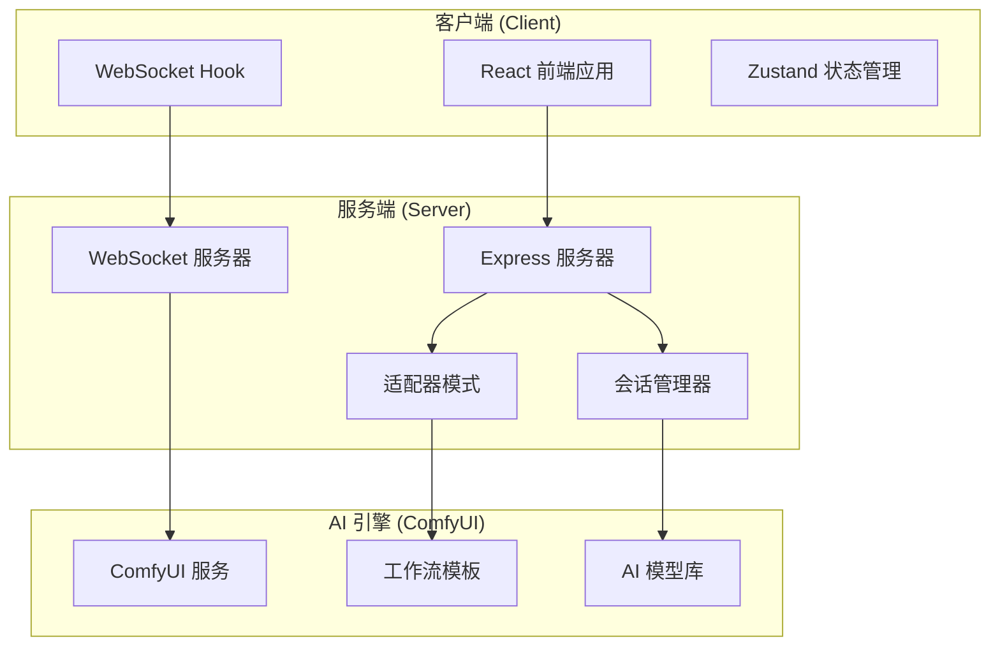
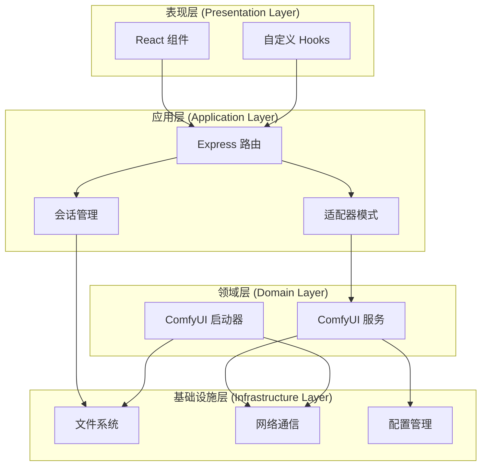
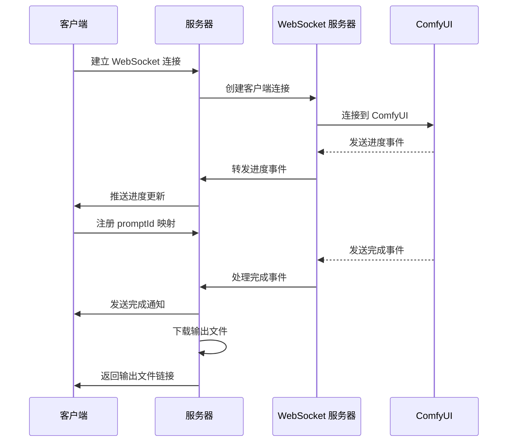
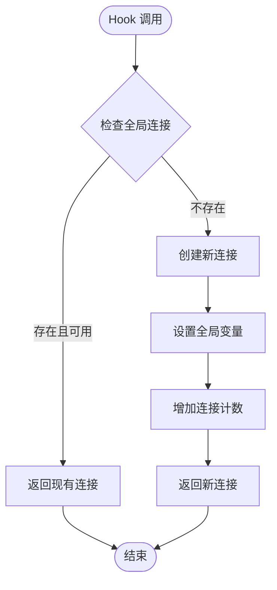
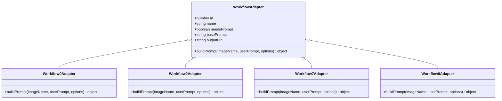
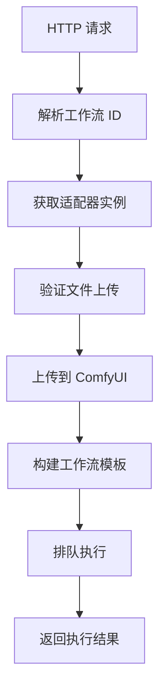
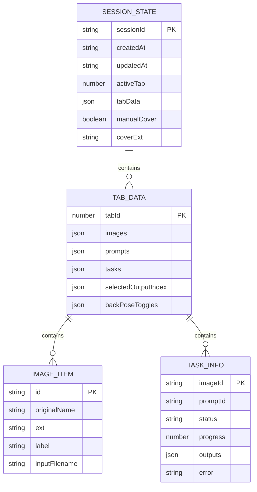
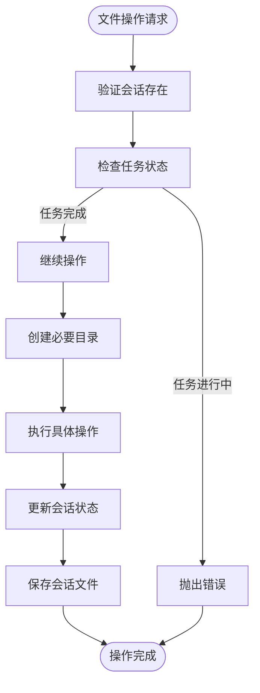
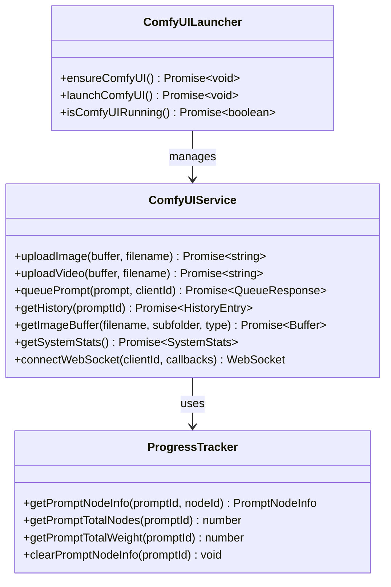

# 系统架构设计

<cite>
**本文档引用的文件**
- [README.md](file://README.md)
- [package.json](file://package.json)
- [client/package.json](file://client/package.json)
- [server/package.json](file://server/package.json)
- [server/src/index.ts](file://server/src/index.ts)
- [client/src/main.tsx](file://client/src/main.tsx)
- [server/src/services/comfyui.ts](file://server/src/services/comfyui.ts)
- [client/src/hooks/useWebSocket.ts](file://client/src/hooks/useWebSocket.ts)
- [server/src/adapters/index.ts](file://server/src/adapters/index.ts)
- [server/src/routes/workflow.ts](file://server/src/routes/workflow.ts)
- [server/src/services/sessionManager.ts](file://server/src/services/sessionManager.ts)
- [server/src/types/index.ts](file://server/src/types/index.ts)
- [client/src/types/index.ts](file://client/src/types/index.ts)
- [server/src/config/paths.ts](file://server/src/config/paths.ts)
- [server/src/services/comfyuiLauncher.ts](file://server/src/services/comfyuiLauncher.ts)
</cite>

## 目录
1. [引言](#引言)
2. [项目结构](#项目结构)
3. [核心组件](#核心组件)
4. [架构概览](#架构概览)
5. [详细组件分析](#详细组件分析)
6. [依赖关系分析](#依赖关系分析)
7. [性能考量](#性能考量)
8. [故障排除指南](#故障排除指南)
9. [结论](#结论)
10. [附录](#附录)

## 引言

CorineKit Pix2Real 是一个基于本地 Web UI 的批量图像/视频处理系统，通过 ComfyUI 实现 AI 图像生成和编辑功能。该项目采用前后端分离架构，结合适配器模式和单例模式，提供了完整的图像处理工作流解决方案。

### 系统目标
- 提供本地化的 Web 界面进行批量图像/视频处理
- 支持多种 AI 工作流（动漫转真人、人物精修、图像放大、视频生成等）
- 实现实时进度跟踪和 WebSocket 通信
- 维护会话状态和持久化存储
- 适配多种 AI 模型和工作流模板

## 项目结构

项目采用典型的前后端分离架构，主要分为三个核心部分：



**图表来源**
- [server/src/index.ts:157-494](file://server/src/index.ts#L157-L494)
- [client/src/main.tsx:1-11](file://client/src/main.tsx#L1-L11)

### 目录结构说明

- **client/**: React 前端应用，包含组件、Hooks、服务和类型定义
- **server/**: Express 后端服务，包含路由、服务、适配器和配置
- **ComfyUI_API/**: 工作流 JSON 模板文件
- **output/**: 生成的输出文件（git 忽略）
- **model_meta/**: 模型元数据和缩略图

**章节来源**
- [README.md:41-62](file://README.md#L41-L62)

## 核心组件

### 前端组件

前端采用 React + TypeScript 架构，使用 Zustand 进行状态管理，主要组件包括：

- **App 组件**: 应用主入口，负责整体布局和状态协调
- **PhotoWall**: 图片墙组件，显示处理结果
- **Sidebar**: 侧边栏，包含工作流配置面板
- **DropZone**: 拖拽上传区域
- **WebSocket Hook**: 单例模式的 WebSocket 连接管理

### 后端组件

后端采用 Express + TypeScript 架构，核心组件包括：

- **主服务器**: 处理 HTTP 请求和 WebSocket 连接
- **适配器模式**: 每个工作流对应一个适配器类
- **会话管理器**: 管理用户会话和持久化存储
- **ComfyUI 服务**: 与 AI 引擎通信的服务层

**章节来源**
- [client/src/components/App.tsx:61-422](file://client/src/components/App.tsx#L61-L422)
- [server/src/index.ts:1-516](file://server/src/index.ts#L1-L516)

## 架构概览

系统采用分层架构设计，实现了清晰的关注点分离：



**图表来源**
- [server/src/index.ts:1-516](file://server/src/index.ts#L1-L516)
- [server/src/adapters/index.ts:1-33](file://server/src/adapters/index.ts#L1-L33)
- [server/src/services/sessionManager.ts:1-539](file://server/src/services/sessionManager.ts#L1-L539)

### 架构模式

1. **适配器模式**: 每个工作流都有对应的适配器类，实现统一的接口
2. **单例模式**: WebSocket 连接采用模块级全局变量确保唯一性
3. **工厂模式**: 会话管理器提供会话创建和管理功能
4. **观察者模式**: WebSocket 实现事件驱动的实时通信

## 详细组件分析

### WebSocket 通信系统

WebSocket 系统是整个架构的核心通信机制，实现了客户端与 ComfyUI 之间的实时数据传输。



**图表来源**
- [server/src/index.ts:168-494](file://server/src/index.ts#L168-L494)
- [client/src/hooks/useWebSocket.ts:29-278](file://client/src/hooks/useWebSocket.ts#L29-L278)

#### 单例模式实现

前端使用模块级全局变量实现 WebSocket 连接的单例管理：



**图表来源**
- [client/src/hooks/useWebSocket.ts:9-278](file://client/src/hooks/useWebSocket.ts#L9-L278)

**章节来源**
- [client/src/hooks/useWebSocket.ts:1-278](file://client/src/hooks/useWebSocket.ts#L1-L278)
- [server/src/index.ts:168-494](file://server/src/index.ts#L168-L494)

### 适配器模式实现

适配器模式为不同的工作流提供了统一的接口抽象：



**图表来源**
- [server/src/types/index.ts:1-8](file://server/src/types/index.ts#L1-L8)
- [server/src/adapters/index.ts:1-33](file://server/src/adapters/index.ts#L1-L33)

#### 工作流路由处理

后端路由系统根据工作流 ID 调用相应的适配器：



**图表来源**
- [server/src/routes/workflow.ts:750-799](file://server/src/routes/workflow.ts#L750-L799)

**章节来源**
- [server/src/adapters/index.ts:1-33](file://server/src/adapters/index.ts#L1-L33)
- [server/src/routes/workflow.ts:1-800](file://server/src/routes/workflow.ts#L1-L800)

### 会话管理系统

会话管理系统负责用户状态的持久化和恢复：



**图表来源**
- [server/src/services/sessionManager.ts:66-100](file://server/src/services/sessionManager.ts#L66-L100)

#### 文件操作流程

会话管理器提供了完整的文件操作流程：



**图表来源**
- [server/src/services/sessionManager.ts:256-360](file://server/src/services/sessionManager.ts#L256-L360)

**章节来源**
- [server/src/services/sessionManager.ts:1-539](file://server/src/services/sessionManager.ts#L1-L539)

### ComfyUI 集成

ComfyUI 集成层提供了与 AI 引擎的完整接口：



**图表来源**
- [server/src/services/comfyui.ts:1-472](file://server/src/services/comfyui.ts#L1-L472)
- [server/src/services/comfyuiLauncher.ts:1-131](file://server/src/services/comfyuiLauncher.ts#L1-L131)

**章节来源**
- [server/src/services/comfyui.ts:1-472](file://server/src/services/comfyui.ts#L1-L472)
- [server/src/services/comfyuiLauncher.ts:1-131](file://server/src/services/comfyuiLauncher.ts#L1-L131)

## 依赖关系分析

系统依赖关系体现了清晰的层次结构：

```mermaid
graph TB
subgraph "客户端依赖"
A[react@^19.0.0]
B[react-dom@^19.0.0]
C[zustand@^5.0.0]
D[lucide-react@^0.468.0]
end
subgraph "服务端依赖"
E[express@^4.21.0]
F[cors@^2.8.5]
G[ws@^8.18.0]
H[node-fetch@^3.3.2]
I[multer@^1.4.5-lts.1]
end
subgraph "开发依赖"
J[@types/react@^19.0.0]
K[@types/react-dom@^19.0.0]
L[@types/express@^5.0.0]
M[@types/ws@^8.5.13]
N[concurrently@^9.1.0]
end
A --> J
B --> K
E --> L
F --> M
G --> N
```

**图表来源**
- [client/package.json:11-25](file://client/package.json#L11-L25)
- [server/package.json:11-27](file://server/package.json#L11-L27)

### 第三方服务集成

系统集成了多个第三方服务和工具：

- **ComfyUI**: 主要的 AI 图像生成引擎
- **Node.js**: 运行时环境
- **Express**: Web 服务器框架
- **WebSocket**: 实时通信协议
- **Multer**: 文件上传处理
- **Zustand**: 状态管理库

**章节来源**
- [package.json:1-15](file://package.json#L1-L15)
- [client/package.json:1-26](file://client/package.json#L1-L26)
- [server/package.json:1-28](file://server/package.json#L1-L28)

## 性能考量

### 连接池管理

系统采用了高效的连接管理策略：

1. **单例 WebSocket 连接**: 避免重复建立连接，减少资源消耗
2. **连接计数机制**: 确保正确的连接生命周期管理
3. **自动重连**: 断线后自动恢复连接

### 内存优化

- **事件缓冲**: 对于已经处理的事件进行缓冲，避免重复传输
- **文件流处理**: 大文件采用流式处理，避免内存溢出
- **会话状态压缩**: 仅保存必要的状态信息

### 并发控制

- **工作流队列**: 通过 ComfyUI 队列系统控制并发执行
- **任务状态跟踪**: 实时跟踪任务执行状态
- **资源释放**: 任务完成后及时释放相关资源

## 故障排除指南

### 常见问题及解决方案

#### ComfyUI 连接问题

**症状**: WebSocket 连接失败，无法接收进度更新

**诊断步骤**:
1. 检查 ComfyUI 服务是否正常运行
2. 验证网络连接和端口开放情况
3. 查看防火墙设置

**解决方法**:
- 确保 ComfyUI 在 `http://localhost:8188` 上运行
- 检查代理设置和 CORS 配置
- 重启 ComfyUI 服务

#### 会话状态异常

**症状**: 会话数据丢失或损坏

**诊断步骤**:
1. 检查 `config.json` 文件是否存在
2. 验证会话目录权限
3. 查看会话文件格式

**解决方法**:
- 重新创建会话
- 检查磁盘空间和权限
- 清理损坏的会话文件

#### 文件上传失败

**症状**: 图片或视频上传失败

**诊断步骤**:
1. 检查文件大小限制
2. 验证文件格式支持
3. 查看磁盘空间

**解决方法**:
- 减小文件大小或调整限制
- 确认文件格式正确
- 清理磁盘空间

**章节来源**
- [server/src/services/comfyuiLauncher.ts:24-53](file://server/src/services/comfyuiLauncher.ts#L24-L53)
- [server/src/services/sessionManager.ts:124-133](file://server/src/services/sessionManager.ts#L124-L133)

## 结论

CorineKit Pix2Real 展现了一个设计良好的分布式系统架构，通过以下关键设计实现了高效的功能：

### 设计优势

1. **清晰的分层架构**: 表现层、应用层、领域层和基础设施层职责明确
2. **灵活的适配器模式**: 支持多种工作流的扩展和维护
3. **高效的通信机制**: WebSocket 实现实时状态同步
4. **可靠的会话管理**: 完整的状态持久化和恢复机制
5. **健壮的错误处理**: 全面的异常捕获和恢复策略

### 技术决策分析

1. **适配器模式的应用**: 通过统一接口抽象不同工作流，提高了代码复用性和可维护性
2. **单例模式的 WebSocket 管理**: 确保连接的唯一性和资源的有效利用
3. **模块化设计**: 清晰的模块划分便于团队协作和独立开发
4. **异步处理**: 采用异步模式处理长时间运行的任务，提升用户体验

### 改进建议

1. **监控和日志**: 增强系统的可观测性，添加更详细的日志记录
2. **缓存策略**: 实现多级缓存机制，提升系统性能
3. **安全加固**: 添加身份认证和授权机制
4. **API 版本控制**: 实现向后兼容的 API 版本管理

## 附录

### 技术栈详情

**前端技术栈**:
- React 19.0.0: 用户界面框架
- TypeScript 5.7.0: 类型安全
- Zustand 5.0.0: 状态管理
- Vite 6.0.0: 构建工具

**后端技术栈**:
- Node.js 18+: 运行时环境
- Express 4.21.0: Web 框架
- TypeScript 5.7.0: 类型安全
- WebSocket 8.18.0: 实时通信

**开发工具**:
- concurrently 9.1.0: 并行开发
- @types/*: 类型定义
- tsx: TypeScript 运行器

### 部署要求

**硬件要求**:
- CPU: 至少 4 核心
- 内存: 至少 8GB RAM
- 存储: 至少 50GB 可用空间

**软件要求**:
- Node.js 18+
- Python 3.8+ (用于 ComfyUI)
- Git (可选)

**网络要求**:
- 本地网络连接
- 防火墙允许端口 3000 和 8188
- Internet 连接 (首次安装依赖)

### 兼容性说明

- **操作系统**: Windows 10+, macOS 10.15+, Linux
- **浏览器**: Chrome 90+, Firefox 88+, Safari 14+
- **ComfyUI**: 1.x 版本兼容
- **AI 模型**: 支持常见 Stable Diffusion 模型格式