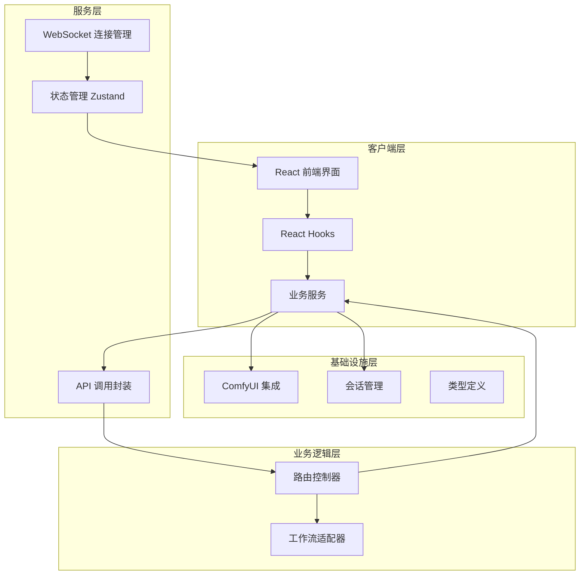
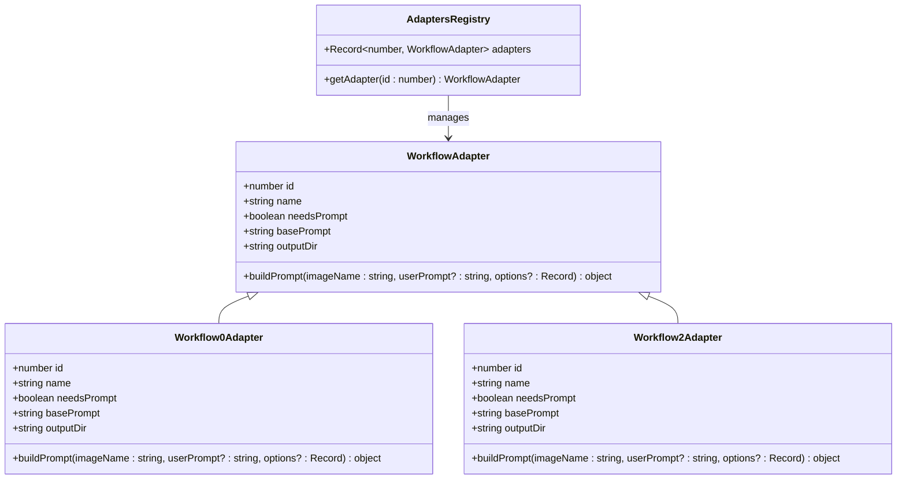
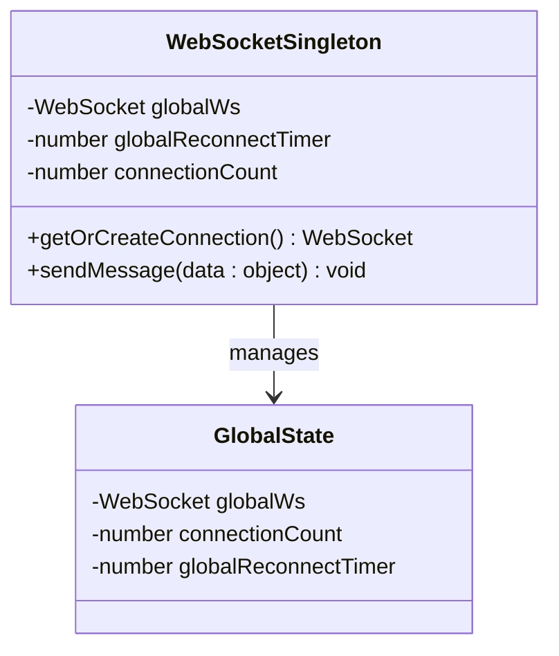
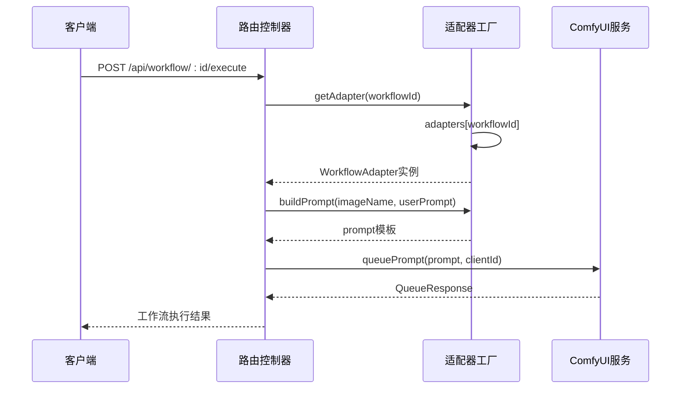
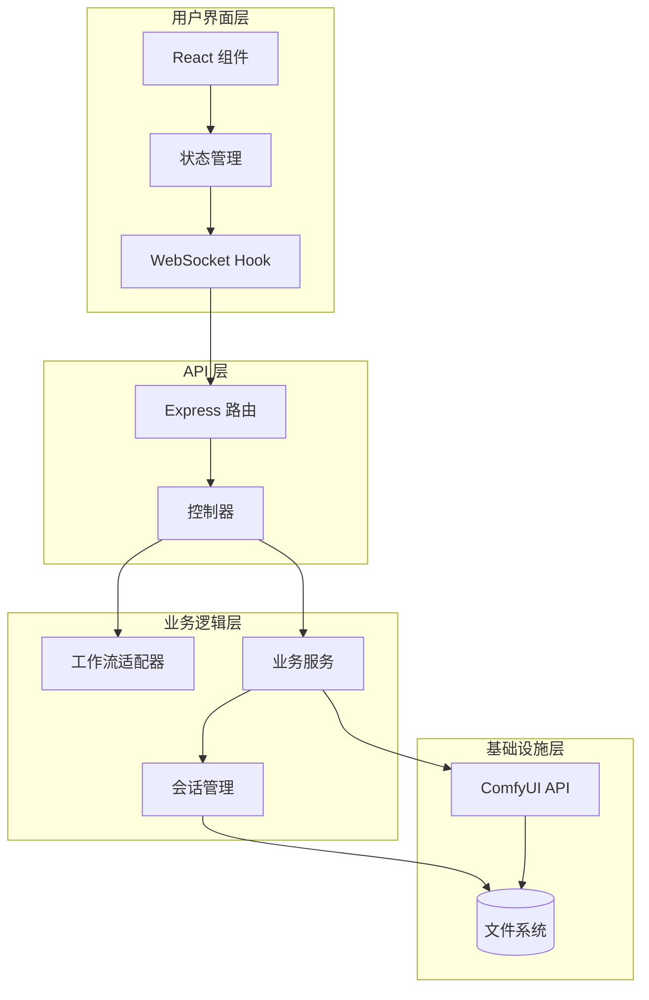
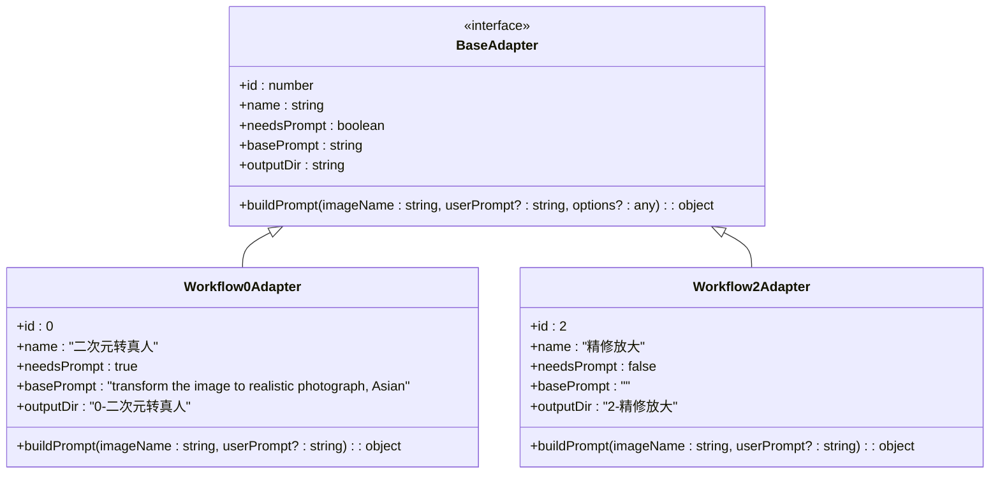
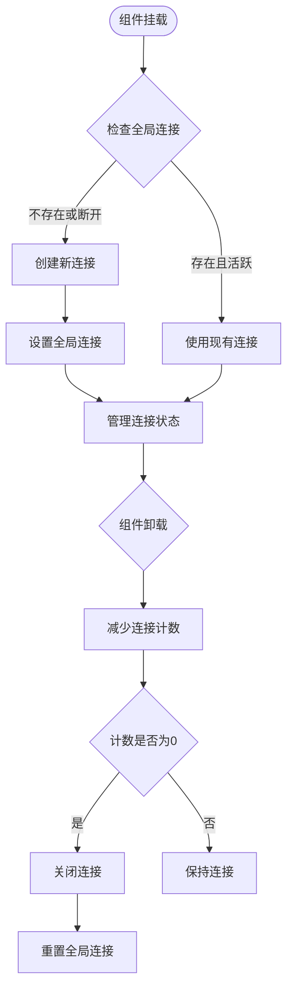
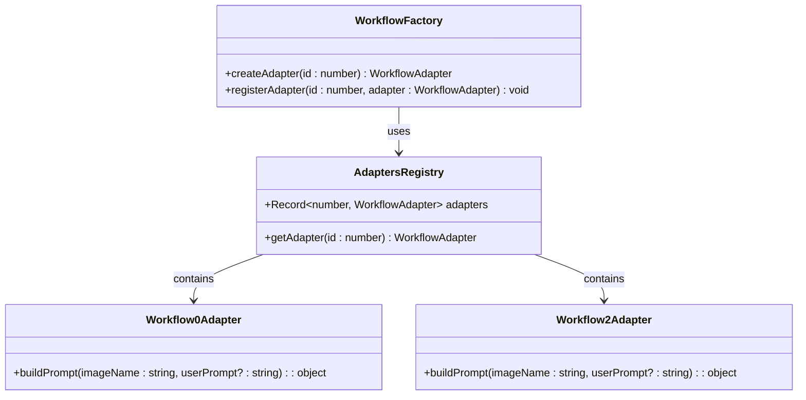
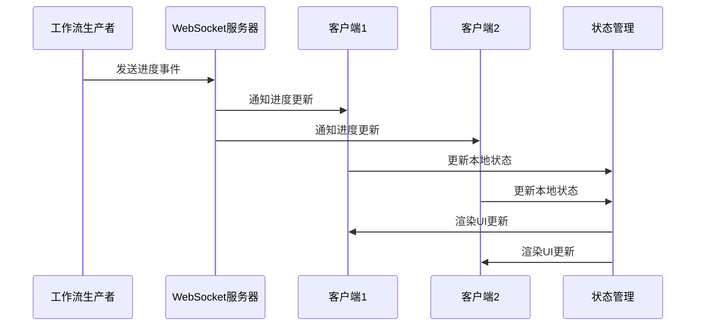
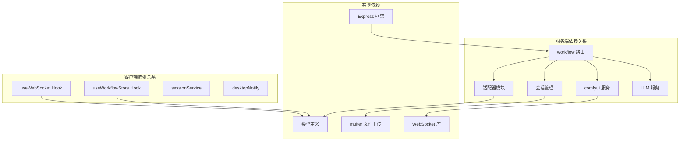

# 设计模式应用

<cite>
**本文档引用的文件**
- [server/src/adapters/index.ts](file://server/src/adapters/index.ts)
- [server/src/adapters/BaseAdapter.ts](file://server/src/adapters/BaseAdapter.ts)
- [server/src/adapters/Workflow0Adapter.ts](file://server/src/adapters/Workflow0Adapter.ts)
- [server/src/routes/workflow.ts](file://server/src/routes/workflow.ts)
- [server/src/services/comfyui.ts](file://server/src/services/comfyui.ts)
- [server/src/services/sessionManager.ts](file://server/src/services/sessionManager.ts)
- [server/src/types/index.ts](file://server/src/types/index.ts)
- [client/src/hooks/useWebSocket.ts](file://client/src/hooks/useWebSocket.ts)
- [client/src/hooks/useWorkflowStore.ts](file://client/src/hooks/useWorkflowStore.ts)
- [client/src/services/sessionService.ts](file://client/src/services/sessionService.ts)
</cite>

## 目录
1. [简介](#简介)
2. [项目结构](#项目结构)
3. [核心组件](#核心组件)
4. [架构概览](#架构概览)
5. [详细组件分析](#详细组件分析)
6. [依赖关系分析](#依赖关系分析)
7. [性能考虑](#性能考虑)
8. [故障排除指南](#故障排除指南)
9. [结论](#结论)

## 简介

CorineKit Pix2Real 是一个基于 ComfyUI 的图像生成工作流系统，通过多种设计模式实现了高度模块化和可扩展的架构。本文档深入分析项目中应用的设计模式，重点阐述适配器模式在工作流系统中的实现、单例模式在 WebSocket 服务器中的应用、工厂模式在工作流创建中的使用，以及观察者模式在进度追踪中的体现。

该项目采用前后端分离架构，后端使用 TypeScript + Express 提供 REST API，前端使用 React + TypeScript 构建用户界面。系统支持多种图像生成工作流，包括动漫转真人、精修放大、区域编辑等功能，并提供了完整的进度追踪和状态管理机制。

## 项目结构

项目采用清晰的分层架构，主要分为以下几个层次：

**图表来源**
- [client/src/hooks/useWebSocket.ts:9-12](file://client/src/hooks/useWebSocket.ts#L9-L12)
- [server/src/adapters/index.ts:14-30](file://server/src/adapters/index.ts#L14-L30)
- [server/src/routes/workflow.ts:1-29](file://server/src/routes/workflow.ts#L1-L29)

**章节来源**
- [client/src/hooks/useWebSocket.ts:1-278](file://client/src/hooks/useWebSocket.ts#L1-L278)
- [server/src/adapters/index.ts:1-33](file://server/src/adapters/index.ts#L1-L33)
- [server/src/routes/workflow.ts:1-800](file://server/src/routes/workflow.ts#L1-L800)

## 核心组件

### 适配器模式实现

项目使用适配器模式来统一不同工作流的接口，使得系统可以灵活地支持多种图像生成工作流。

**图表来源**
- [server/src/types/index.ts:1-8](file://server/src/types/index.ts#L1-L8)
- [server/src/adapters/Workflow0Adapter.ts:9-34](file://server/src/adapters/Workflow0Adapter.ts#L9-L34)
- [server/src/adapters/index.ts:14-30](file://server/src/adapters/index.ts#L14-L30)

### 单例模式实现

WebSocket 连接管理采用了单例模式，确保在整个应用中只有一个 WebSocket 实例在运行。

**图表来源**
- [client/src/hooks/useWebSocket.ts:9-12](file://client/src/hooks/useWebSocket.ts#L9-L12)
- [client/src/hooks/useWebSocket.ts:29-52](file://client/src/hooks/useWebSocket.ts#L29-L52)

### 工厂模式实现

工作流创建过程中使用了工厂模式，通过适配器注册表来创建不同类型的工作流实例。

**图表来源**
- [server/src/routes/workflow.ts:750-799](file://server/src/routes/workflow.ts#L750-L799)
- [server/src/adapters/index.ts:28-30](file://server/src/adapters/index.ts#L28-L30)

**章节来源**
- [server/src/types/index.ts:1-8](file://server/src/types/index.ts#L1-L8)
- [server/src/adapters/Workflow0Adapter.ts:1-35](file://server/src/adapters/Workflow0Adapter.ts#L1-L35)
- [server/src/adapters/index.ts:1-33](file://server/src/adapters/index.ts#L1-L33)

## 架构概览

系统采用事件驱动架构，通过 WebSocket 实现实时通信，结合状态管理模式实现完整的进度追踪。

**图表来源**
- [client/src/hooks/useWebSocket.ts:1-278](file://client/src/hooks/useWebSocket.ts#L1-L278)
- [server/src/routes/workflow.ts:1-800](file://server/src/routes/workflow.ts#L1-L800)
- [server/src/services/comfyui.ts:1-472](file://server/src/services/comfyui.ts#L1-L472)

## 详细组件分析

### 适配器模式分析

#### 设计模式选择原因
- **统一接口**：不同工作流具有相似的输入输出模式，但内部实现差异很大
- **可扩展性**：新增工作流时无需修改现有代码结构
- **灵活性**：支持动态选择和配置不同的工作流

#### 实现方式
适配器模式通过定义统一的 `WorkflowAdapter` 接口，为每个具体工作流实现相应的适配器类。

**图表来源**
- [server/src/adapters/BaseAdapter.ts:1-4](file://server/src/adapters/BaseAdapter.ts#L1-L4)
- [server/src/adapters/Workflow0Adapter.ts:9-34](file://server/src/adapters/Workflow0Adapter.ts#L9-L34)

#### 带来的益处
- **代码复用**：统一的工作流执行逻辑
- **易于维护**：每个工作流的实现相互独立
- **测试友好**：可以单独测试每个适配器

**章节来源**
- [server/src/adapters/BaseAdapter.ts:1-4](file://server/src/adapters/BaseAdapter.ts#L1-L4)
- [server/src/adapters/Workflow0Adapter.ts:1-35](file://server/src/adapters/Workflow0Adapter.ts#L1-L35)
- [server/src/adapters/index.ts:1-33](file://server/src/adapters/index.ts#L1-L33)

### 单例模式分析

#### 设计模式选择原因
- **资源管理**：WebSocket 连接是昂贵的系统资源
- **状态一致性**：确保所有组件共享同一连接状态
- **避免冲突**：防止多个连接实例造成状态混乱

#### 实现方式
通过全局变量和闭包实现单例模式，确保在整个应用生命周期内只有一个 WebSocket 实例。

**图表来源**
- [client/src/hooks/useWebSocket.ts:29-52](file://client/src/hooks/useWebSocket.ts#L29-L52)
- [client/src/hooks/useWebSocket.ts:254-277](file://client/src/hooks/useWebSocket.ts#L254-L277)

#### 带来的益处
- **资源节约**：避免重复建立连接
- **状态同步**：确保所有组件看到一致的状态
- **性能提升**：减少网络开销和延迟

**章节来源**
- [client/src/hooks/useWebSocket.ts:1-278](file://client/src/hooks/useWebSocket.ts#L1-L278)

### 工厂模式分析

#### 设计模式选择原因
- **解耦**：工作流创建逻辑与具体实现分离
- **扩展性**：新增工作流时只需添加适配器，无需修改工厂代码
- **配置灵活**：支持运行时动态选择工作流

#### 实现方式
通过适配器注册表实现工厂模式，根据工作流 ID 返回相应的适配器实例。

**图表来源**
- [server/src/adapters/index.ts:14-30](file://server/src/adapters/index.ts#L14-L30)

#### 带来的益处
- **代码组织**：清晰的工作流分类和管理
- **易于扩展**：支持无限数量的工作流扩展
- **运行时配置**：支持动态工作流选择

**章节来源**
- [server/src/adapters/index.ts:1-33](file://server/src/adapters/index.ts#L1-L33)
- [server/src/routes/workflow.ts:750-799](file://server/src/routes/workflow.ts#L750-L799)

### 观察者模式分析

#### 设计模式选择原因
- **事件驱动**：工作流执行是异步事件驱动的过程
- **状态追踪**：需要实时监控工作流的执行状态
- **解耦通信**：生产者和消费者之间松耦合

#### 实现方式
通过 WebSocket 事件和状态管理实现观察者模式，客户端订阅工作流状态变化。

**图表来源**
- [client/src/hooks/useWebSocket.ts:45-162](file://client/src/hooks/useWebSocket.ts#L45-L162)
- [client/src/hooks/useWorkflowStore.ts:624-647](file://client/src/hooks/useWorkflowStore.ts#L624-L647)

#### 带来的益处
- **实时反馈**：用户可以即时看到工作流执行状态
- **用户体验**：提供流畅的交互体验
- **系统解耦**：观察者和被观察者松耦合

**章节来源**
- [client/src/hooks/useWebSocket.ts:1-278](file://client/src/hooks/useWebSocket.ts#L1-L278)
- [client/src/hooks/useWorkflowStore.ts:1-800](file://client/src/hooks/useWorkflowStore.ts#L1-L800)

## 依赖关系分析

系统采用模块化设计，各组件之间的依赖关系清晰明确。

**图表来源**
- [client/src/hooks/useWebSocket.ts:1-8](file://client/src/hooks/useWebSocket.ts#L1-L8)
- [server/src/routes/workflow.ts:1-29](file://server/src/routes/workflow.ts#L1-L29)
- [server/src/services/comfyui.ts:1-7](file://server/src/services/comfyui.ts#L1-L7)

**章节来源**
- [server/src/types/index.ts:1-52](file://server/src/types/index.ts#L1-L52)
- [server/src/services/comfyui.ts:1-472](file://server/src/services/comfyui.ts#L1-L472)

## 性能考虑

### 适配器模式的性能优势
- **延迟加载**：适配器按需加载，减少启动时间
- **缓存策略**：工作流模板缓存，避免重复解析
- **内存优化**：适配器实例复用，减少内存占用

### 单例模式的性能优势
- **连接复用**：避免重复建立 WebSocket 连接
- **状态同步**：减少状态同步开销
- **资源控制**：统一管理网络资源

### 工厂模式的性能优势
- **对象池**：适配器对象池化，减少 GC 压力
- **预编译**：工作流模板预编译，提高执行效率
- **并发控制**：工作流执行并发控制，避免资源竞争

## 故障排除指南

### WebSocket 连接问题
- **连接失败**：检查服务器地址和端口配置
- **连接中断**：查看重连机制是否正常工作
- **消息丢失**：确认事件监听器是否正确注册

### 工作流执行问题
- **适配器错误**：验证适配器实现是否正确
- **参数错误**：检查工作流参数配置
- **资源不足**：监控 GPU/内存使用情况

### 状态同步问题
- **进度不同步**：检查 WebSocket 事件处理逻辑
- **状态不一致**：验证状态管理器的更新机制
- **UI 不刷新**：确认状态变更通知是否正确触发

**章节来源**
- [client/src/hooks/useWebSocket.ts:232-244](file://client/src/hooks/useWebSocket.ts#L232-L244)
- [server/src/services/comfyui.ts:304-375](file://server/src/services/comfyui.ts#L304-L375)

## 结论

CorineKit Pix2Real 项目通过精心设计的多种设计模式，成功构建了一个高度模块化、可扩展且易于维护的图像生成工作流系统。适配器模式确保了工作流的统一接口和灵活扩展，单例模式优化了资源管理和状态一致性，工厂模式提供了优雅的工作流创建机制，观察者模式实现了高效的进度追踪和状态同步。

这些设计模式的综合应用不仅提高了系统的可维护性和可测试性，还为未来的功能扩展奠定了坚实的基础。通过事件驱动架构和模块化设计，系统能够轻松支持新的工作流类型和功能特性，同时保持良好的性能表现和用户体验。