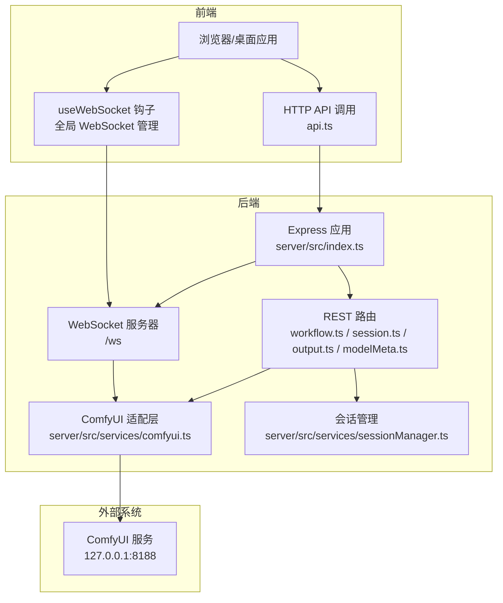
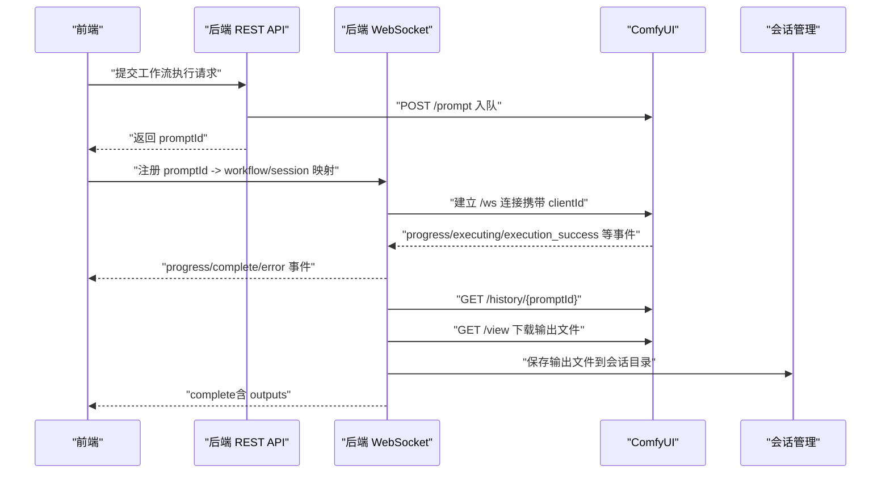
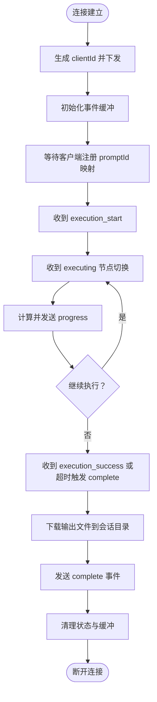
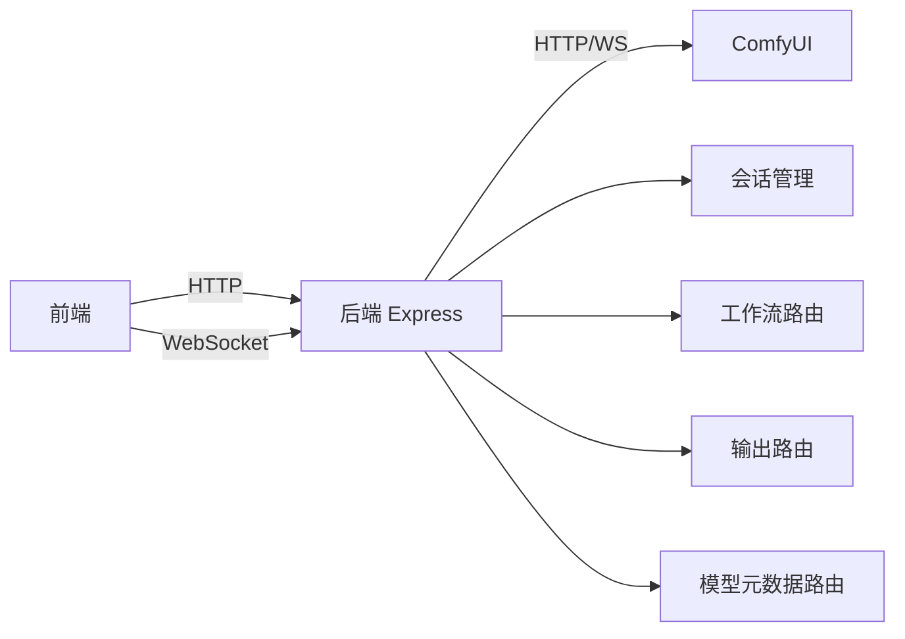
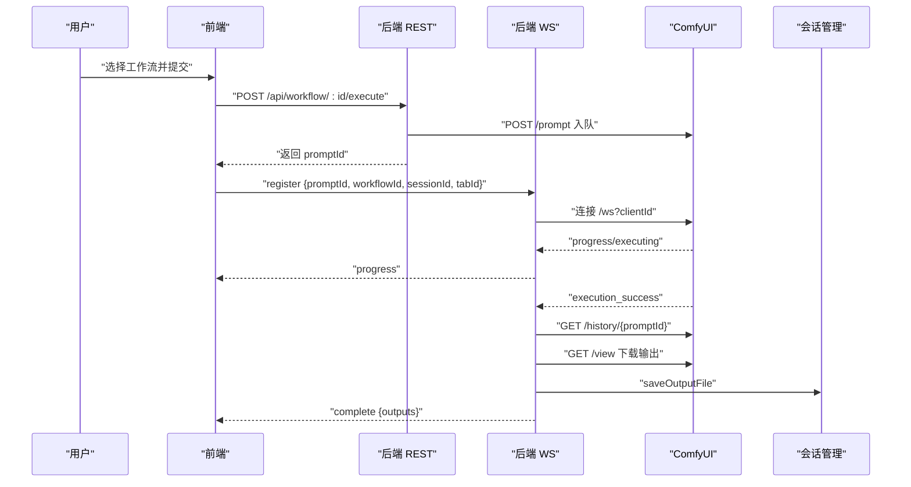

# 通信机制设计

<cite>
**本文引用的文件**
- [server/src/index.ts](file://server/src/index.ts)
- [client/src/hooks/useWebSocket.ts](file://client/src/hooks/useWebSocket.ts)
- [server/src/services/comfyui.ts](file://server/src/services/comfyui.ts)
- [server/src/routes/workflow.ts](file://server/src/routes/workflow.ts)
- [server/src/services/sessionManager.ts](file://server/src/services/sessionManager.ts)
- [client/src/types/index.ts](file://client/src/types/index.ts)
- [server/src/types/index.ts](file://server/src/types/index.ts)
- [server/src/services/comfyuiLauncher.ts](file://server/src/services/comfyuiLauncher.ts)
- [client/src/services/api.ts](file://client/src/services/api.ts)
- [server/src/routes/output.ts](file://server/src/routes/output.ts)
- [server/src/routes/session.ts](file://server/src/routes/session.ts)
- [server/src/routes/modelMeta.ts](file://server/src/routes/modelMeta.ts)
</cite>

## 目录
1. [引言](#引言)
2. [项目结构](#项目结构)
3. [核心组件](#核心组件)
4. [架构总览](#架构总览)
5. [详细组件分析](#详细组件分析)
6. [依赖关系分析](#依赖关系分析)
7. [性能考量](#性能考量)
8. [故障排查指南](#故障排查指南)
9. [结论](#结论)
10. [附录](#附录)

## 引言
本设计文档聚焦 CorineKit Pix2Real 的通信机制，系统性阐述三类通信方式：
- HTTP RESTful API：用于工作流提交、资源管理、元数据维护等。
- WebSocket 实时通信：用于进度事件、完成/错误通知与客户端注册。
- 与 ComfyUI 的双向通信：服务端作为代理，桥接前端与 ComfyUI 的消息与数据。

文档将深入解释 WebSocket 服务器的实现原理（连接管理、消息缓冲、进度事件处理、错误恢复）、消息格式与事件类型、连接状态管理与性能优化，并提供端到端的通信流程图与异步通信模式说明。

## 项目结构
项目采用前后端分离架构：
- 前端（React + TypeScript）：负责用户界面与交互，通过 HTTP API 与 WebSocket 与后端通信。
- 后端（Node.js + Express + ws）：提供 REST API、WebSocket 服务、与 ComfyUI 的桥接与会话管理。

图表来源
- [server/src/index.ts:157-494](file://server/src/index.ts#L157-L494)
- [server/src/routes/workflow.ts:1-800](file://server/src/routes/workflow.ts#L1-L800)
- [server/src/routes/session.ts:1-163](file://server/src/routes/session.ts#L1-L163)
- [server/src/routes/output.ts:1-139](file://server/src/routes/output.ts#L1-L139)
- [server/src/routes/modelMeta.ts:1-272](file://server/src/routes/modelMeta.ts#L1-L272)
- [server/src/services/comfyui.ts:168-472](file://server/src/services/comfyui.ts#L168-L472)
- [server/src/services/sessionManager.ts:1-539](file://server/src/services/sessionManager.ts#L1-L539)

章节来源
- [server/src/index.ts:118-146](file://server/src/index.ts#L118-L146)
- [server/src/routes/workflow.ts:152-161](file://server/src/routes/workflow.ts#L152-L161)

## 核心组件
- Express 应用与路由：提供 REST API，承载工作流执行、会话管理、输出文件服务与模型元数据管理。
- WebSocket 服务器：提供实时进度与结果通知，支持客户端注册与事件重放。
- ComfyUI 适配层：封装与 ComfyUI 的 HTTP 与 WebSocket 交互，负责节点权重计算、历史查询与输出下载。
- 会话管理：持久化会话状态、输入/输出/掩码文件与封面生成。
- 前端 WebSocket 钩子：全局连接管理、自动重连、消息分发与桌面通知集成。

章节来源
- [server/src/index.ts:157-494](file://server/src/index.ts#L157-L494)
- [server/src/services/comfyui.ts:168-472](file://server/src/services/comfyui.ts#L168-L472)
- [server/src/services/sessionManager.ts:1-539](file://server/src/services/sessionManager.ts#L1-L539)
- [client/src/hooks/useWebSocket.ts:1-278](file://client/src/hooks/useWebSocket.ts#L1-L278)

## 架构总览
整体通信链路如下：
- 前端通过 HTTP API 提交工作流参数与资源，后端将模板与参数转换为 ComfyUI 的 prompt 并入队。
- 后端与 ComfyUI 建立 WebSocket 连接，转发进度、完成与错误事件。
- 后端将 ComfyUI 的输出文件下载到会话目录，并通过 WebSocket 通知前端。
- 前端根据注册的 promptId 映射，将输出文件 URL 下发到对应卡片，触发 UI 更新与桌面通知。

图表来源
- [server/src/index.ts:168-494](file://server/src/index.ts#L168-L494)
- [server/src/services/comfyui.ts:168-472](file://server/src/services/comfyui.ts#L168-L472)
- [server/src/services/sessionManager.ts:37-48](file://server/src/services/sessionManager.ts#L37-L48)

## 详细组件分析

### WebSocket 服务器实现原理
- 连接管理
  - 为每个客户端生成唯一 clientId，并在连接建立时下发。
  - 维护客户端与 ComfyUI 的双向连接，客户端断开时关闭 ComfyUI 连接。
- 事件缓冲
  - 为每个 promptId 维护事件缓冲区，用于在客户端注册前的事件重放。
- 进度事件处理
  - 基于节点权重的全局进度计算，支持多轮节点（如 tiled 采样器）与阶段性节点切换。
  - 节点级进度与阶段性名称映射，确保 UI 展示友好。
- 完成与错误处理
  - 完成信号采用“execution_success”优先策略，配合延迟定时器保证历史落盘。
  - 错误事件立即传播并清理状态。
- 输出下载与会话持久化
  - 完成后从 ComfyUI 下载输出文件，保存到会话目录并返回 URL 列表。
  - 清理 prompt 相关状态，避免内存泄漏。

图表来源
- [server/src/index.ts:168-494](file://server/src/index.ts#L168-L494)

章节来源
- [server/src/index.ts:160-163](file://server/src/index.ts#L160-L163)
- [server/src/index.ts:175-185](file://server/src/index.ts#L175-L185)
- [server/src/index.ts:188-229](file://server/src/index.ts#L188-L229)
- [server/src/index.ts:240-271](file://server/src/index.ts#L240-L271)
- [server/src/index.ts:273-464](file://server/src/index.ts#L273-L464)
- [server/src/index.ts:466-494](file://server/src/index.ts#L466-L494)

### 消息格式与事件类型
- 服务端到客户端的消息类型
  - connected：连接确认，包含 clientId。
  - execution_start：工作流开始。
  - progress：进度事件，包含当前百分比、阶段名称、节点索引与总数。
  - complete：工作流完成，包含输出文件 URL 列表。
  - error：工作流错误，包含错误信息。
- 客户端到服务端的消息类型
  - register：注册 promptId 与工作流/会话映射，触发事件重放。

章节来源
- [client/src/types/index.ts:39-75](file://client/src/types/index.ts#L39-L75)
- [server/src/types/index.ts:10-30](file://server/src/types/index.ts#L10-L30)
- [server/src/index.ts:466-488](file://server/src/index.ts#L466-L488)

### 连接状态管理与错误恢复
- 全局连接生命周期
  - 单例 WebSocket 管理，连接计数控制自动重连。
  - 断线自动重连，指数退避策略（通过定时器实现）。
- 错误恢复
  - ComfyUI 侧错误事件直接透传至前端。
  - 历史查询失败时进行重试，避免“完成但空”的异常状态。
  - 完成信号采用双保险策略：execution_success 优先，若缺失则在超时后触发。

章节来源
- [client/src/hooks/useWebSocket.ts:29-277](file://client/src/hooks/useWebSocket.ts#L29-L277)
- [server/src/index.ts:335-448](file://server/src/index.ts#L335-L448)
- [server/src/services/comfyui.ts:265-375](file://server/src/services/comfyui.ts#L265-L375)

### 与 ComfyUI 的双向通信机制
- HTTP 交互
  - 上传图片/视频、入队 prompt、查询队列、删除队列项、获取系统统计、获取对象信息等。
- WebSocket 交互
  - 连接时携带 clientId，接收 progress/executing/execution_success/execution_error 等事件。
  - 对齐完成信号顺序，确保历史落盘后再触发 complete。
- 节点权重与进度计算
  - 基于节点类型与输入参数（如 steps）计算权重，支持 tiled 采样器的特殊处理。
  - 全局进度 = 已完成权重 + 当前节点权重 × 节点内部进度 / 总权重。

章节来源
- [server/src/services/comfyui.ts:9-472](file://server/src/services/comfyui.ts#L9-L472)
- [server/src/services/comfyui.ts:58-144](file://server/src/services/comfyui.ts#L58-L144)
- [server/src/services/comfyui.ts:265-375](file://server/src/services/comfyui.ts#L265-L375)

### HTTP RESTful API 设计
- 工作流执行
  - 支持多种工作流（二次元转真人、精修放大、快速出图、ZIT快出、换脸、解除装备等），通过不同路由与模板处理。
  - 支持 LoRA 动态链路与参数注入，支持参考图上传与裁剪。
- 会话管理
  - 输入/输出/掩码文件上传与持久化，会话状态保存与加载，封面生成与批量重命名。
- 输出文件服务
  - 提供工作流输出文件列表与下载，支持跨目录打开文件。
- 模型元数据管理
  - 缩略图上传/删除、昵称/触发词/分类设置与批量更新。

章节来源
- [server/src/routes/workflow.ts:152-800](file://server/src/routes/workflow.ts#L152-L800)
- [server/src/routes/session.ts:1-163](file://server/src/routes/session.ts#L1-L163)
- [server/src/routes/output.ts:1-139](file://server/src/routes/output.ts#L1-L139)
- [server/src/routes/modelMeta.ts:1-272](file://server/src/routes/modelMeta.ts#L1-L272)

### 前端 WebSocket 钩子与桌面通知
- 全局连接与自动重连
  - 单例连接，连接计数控制生命周期；断线后延迟重连。
- 消息分发
  - 根据消息类型更新工作流与智能体状态，支持批量生成的进度聚合。
- 桌面通知
  - 完成与错误时触发系统通知，支持任务标签解析与数量统计。

章节来源
- [client/src/hooks/useWebSocket.ts:1-278](file://client/src/hooks/useWebSocket.ts#L1-L278)

## 依赖关系分析
- 服务端依赖
  - Express：提供 HTTP 服务与路由。
  - ws：提供 WebSocket 服务端。
  - node-fetch：HTTP 请求 ComfyUI。
  - multer：文件上传中间件。
- 前端依赖
  - React Hooks：状态管理与副作用。
  - 自定义钩子：useWebSocket、useWorkflowStore 等。

图表来源
- [server/src/index.ts:118-146](file://server/src/index.ts#L118-L146)
- [server/src/routes/workflow.ts:1-800](file://server/src/routes/workflow.ts#L1-L800)
- [server/src/routes/session.ts:1-163](file://server/src/routes/session.ts#L1-L163)
- [server/src/routes/output.ts:1-139](file://server/src/routes/output.ts#L1-L139)
- [server/src/routes/modelMeta.ts:1-272](file://server/src/routes/modelMeta.ts#L1-L272)

## 性能考量
- WebSocket 事件缓冲
  - 避免客户端注册前的事件丢失，减少重连后的 UI 闪烁。
- 历史查询重试
  - 针对磁盘写入延迟，增加重试保障完成事件的准确性。
- 节点权重化进度
  - 基于节点类型与步骤数的权重分配，提升进度条的可感知性与一致性。
- 文件下载与存储
  - 输出文件下载后直接保存到会话目录，避免重复传输与临时文件污染。
- 自动启动 ComfyUI
  - 后端启动 ComfyUI 并轮询等待就绪，减少用户手动干预。

章节来源
- [server/src/index.ts:175-185](file://server/src/index.ts#L175-L185)
- [server/src/index.ts:350-368](file://server/src/index.ts#L350-L368)
- [server/src/services/comfyui.ts:58-144](file://server/src/services/comfyui.ts#L58-L144)
- [server/src/services/comfyuiLauncher.ts:101-130](file://server/src/services/comfyuiLauncher.ts#L101-L130)

## 故障排查指南
- WebSocket 连接问题
  - 检查后端 WebSocket 服务是否启动，确认 /ws 路径可用。
  - 查看前端连接日志与自动重连行为。
- ComfyUI 未运行
  - 后端会尝试自动启动，若失败需手动启动并确认端口 8188 可访问。
- 完成事件为空
  - 检查历史查询是否成功，确认输出文件是否写入 ComfyUI 输出目录。
- 文件打开失败
  - 确认文件路径与权限，检查跨目录打开逻辑与平台命令。

章节来源
- [server/src/index.ts:498-516](file://server/src/index.ts#L498-L516)
- [server/src/services/comfyuiLauncher.ts:24-53](file://server/src/services/comfyuiLauncher.ts#L24-L53)
- [server/src/index.ts:350-368](file://server/src/index.ts#L350-L368)
- [server/src/routes/output.ts:80-136](file://server/src/routes/output.ts#L80-L136)

## 结论
本设计文档系统梳理了 CorineKit Pix2Real 的通信机制，明确了 HTTP RESTful API、WebSocket 实时通信与与 ComfyUI 的双向通信职责与实现细节。通过事件缓冲、进度权重化、完成信号双保险与自动重连等策略，系统在复杂异步工作流下实现了稳定可靠的用户体验。建议后续持续关注 ComfyUI 版本演进对完成信号的影响，并优化大文件传输与并发任务的资源占用。

## 附录
- 通信流程图（端到端）

图表来源
- [server/src/routes/workflow.ts:750-799](file://server/src/routes/workflow.ts#L750-L799)
- [server/src/index.ts:168-494](file://server/src/index.ts#L168-L494)
- [server/src/services/comfyui.ts:198-219](file://server/src/services/comfyui.ts#L198-L219)
- [server/src/services/sessionManager.ts:37-48](file://server/src/services/sessionManager.ts#L37-L48)