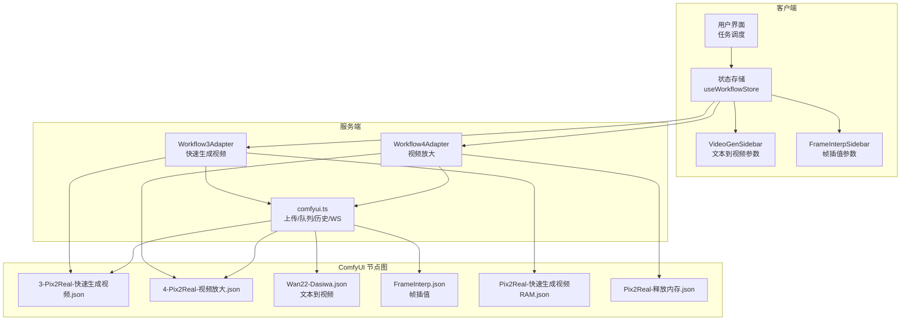
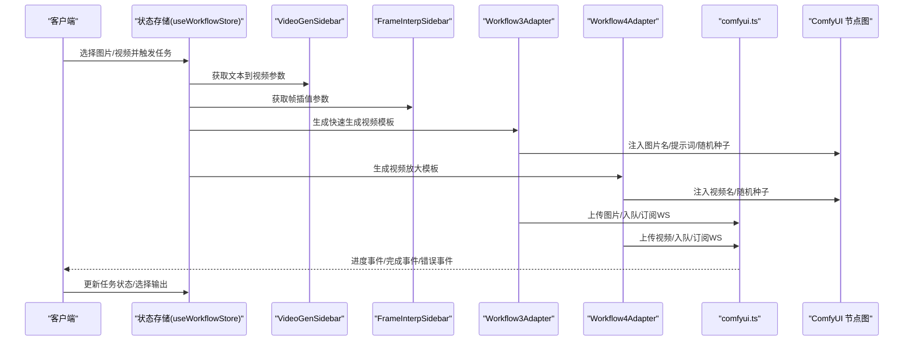
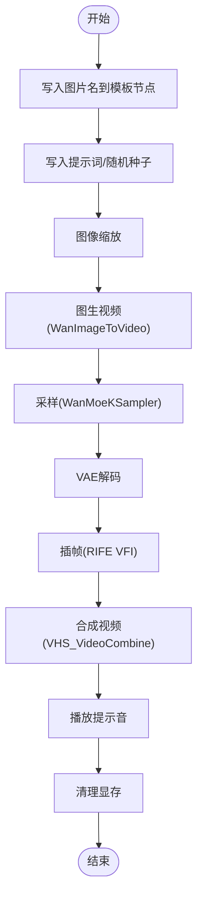
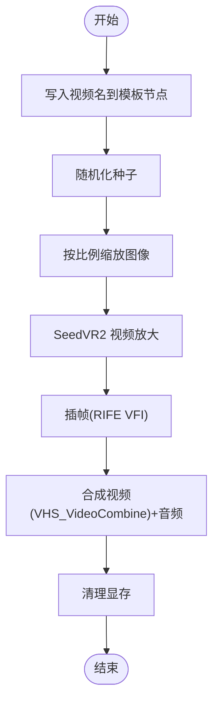
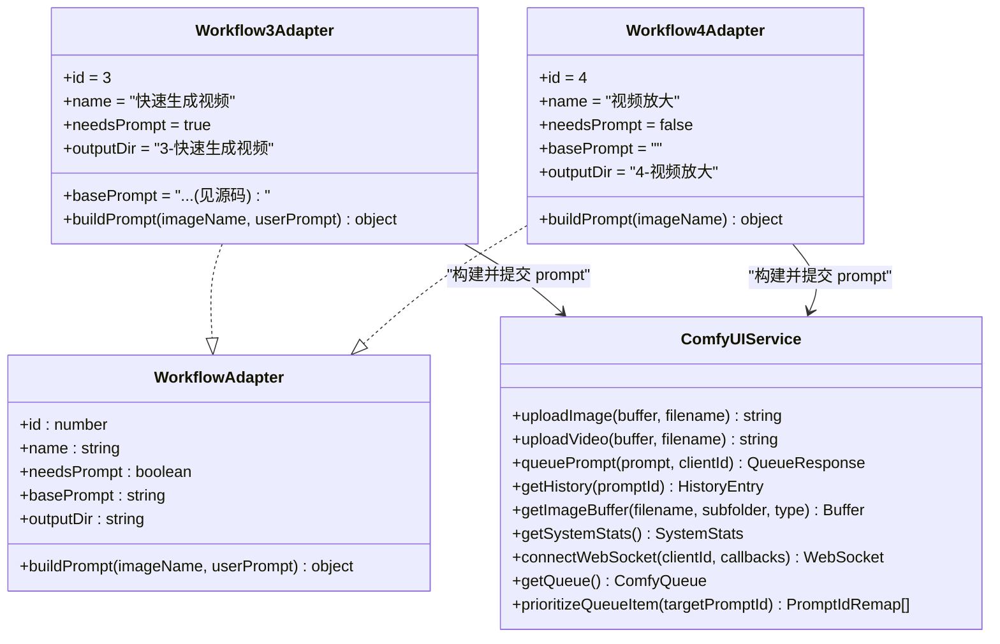
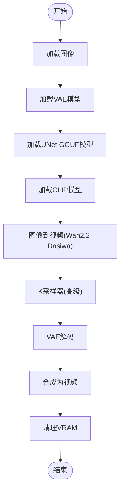
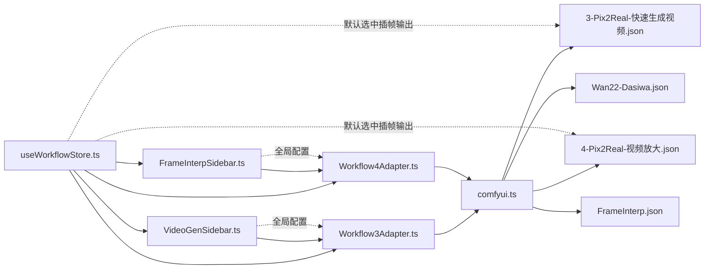

# 视频处理工作流

<cite>
**本文引用的文件**
- [3-Pix2Real-快速生成视频.json](file://ComfyUI_API/3-Pix2Real-快速生成视频.json)
- [4-Pix2Real-视频放大.json](file://ComfyUI_API/4-Pix2Real-视频放大.json)
- [Pix2Real-快速生成视频RAM.json](file://ComfyUI_API/Pix2Real-快速生成视频RAM.json)
- [Pix2Real-释放内存.json](file://ComfyUI_API/Pix2Real-释放内存.json)
- [Workflow3Adapter.ts](file://server/src/adapters/Workflow3Adapter.ts)
- [Workflow4Adapter.ts](file://server/src/adapters/Workflow4Adapter.ts)
- [comfyui.ts](file://server/src/services/comfyui.ts)
- [index.ts](file://server/src/types/index.ts)
- [useWorkflowStore.ts](file://client/src/hooks/useWorkflowStore.ts)
- [Workflow2SettingsPanel.tsx](file://client/src/components/Workflow2SettingsPanel.tsx)
- [VideoGenSidebar.tsx](file://client/src/components/VideoGenSidebar.tsx)
- [FrameInterpSidebar.tsx](file://client/src/components/FrameInterpSidebar.tsx)
- [Wan22-Dasiwa.json](file://ComfyUI_API/Wan22-Dasiwa.json)
- [FrameInterp.json](file://ComfyUI_API/FrameInterp.json)
- [App.tsx](file://client/src/components/App.tsx)
- [sidebarGroups.ts](file://client/src/data/sidebarGroups.ts)
</cite>

## 更新摘要
**所做更改**
- 新增文本到视频生成工作流（Wan22-Dasiwa模型）
- 新增帧插值工作流（RIFE算法）
- 添加VideoGenSidebar和FrameInterpSidebar组件
- 更新工作流标签页管理和侧边栏配置
- 增强视频处理功能的用户界面和参数控制

## 目录
1. [简介](#简介)
2. [项目结构](#项目结构)
3. [核心组件](#核心组件)
4. [架构总览](#架构总览)
5. [详细组件分析](#详细组件分析)
6. [新增功能详解](#新增功能详解)
7. [依赖关系分析](#依赖关系分析)
8. [性能考量](#性能考量)
9. [故障排除指南](#故障排除指南)
10. [结论](#结论)
11. [附录](#附录)

## 简介
本文件面向 CorineKit Pix2Real 的视频处理功能，现已扩展为包含多种视频处理工作流的综合系统。涵盖快速生成视频、视频放大、文本到视频生成和帧插值四种主要工作流。我们将从系统架构、数据流、处理逻辑、参数配置、最佳实践与故障排除等方面进行深入解析，帮助用户理解视频处理与图像处理的差异（帧处理、时间轴管理、编码格式），并提供可操作的使用指南。

## 项目结构
- 视频工作流模板位于 ComfyUI_API 目录，包含快速生成视频、视频放大、文本到视频生成和帧插值四个节点图。
- 服务端通过适配器读取模板并注入运行时参数，再提交至 ComfyUI 执行。
- 客户端负责任务调度、进度展示与输出选择，对视频工作流有特殊处理（如默认选中插帧输出）。
- 新增的VideoGenSidebar和FrameInterpSidebar组件提供专门的参数配置界面。

**图表来源**
- [VideoGenSidebar.tsx:37-97](file://client/src/components/VideoGenSidebar.tsx#L37-L97)
- [FrameInterpSidebar.tsx:23-65](file://client/src/components/FrameInterpSidebar.tsx#L23-L65)
- [Workflow3Adapter.ts:1-33](file://server/src/adapters/Workflow3Adapter.ts#L1-L33)
- [Workflow4Adapter.ts:1-28](file://server/src/adapters/Workflow4Adapter.ts#L1-L28)
- [comfyui.ts:1-285](file://server/src/services/comfyui.ts#L1-L285)
- [Wan22-Dasiwa.json:1-349](file://ComfyUI_API/Wan22-Dasiwa.json#L1-L349)
- [FrameInterp.json:1-58](file://ComfyUI_API/FrameInterp.json#L1-L58)

**章节来源**
- [VideoGenSidebar.tsx:1-154](file://client/src/components/VideoGenSidebar.tsx#L1-L154)
- [FrameInterpSidebar.tsx:1-122](file://client/src/components/FrameInterpSidebar.tsx#L1-L122)
- [Workflow3Adapter.ts:1-33](file://server/src/adapters/Workflow3Adapter.ts#L1-L33)
- [Workflow4Adapter.ts:1-28](file://server/src/adapters/Workflow4Adapter.ts#L1-L28)
- [comfyui.ts:1-285](file://server/src/services/comfyui.ts#L1-L285)
- [Wan22-Dasiwa.json:1-349](file://ComfyUI_API/Wan22-Dasiwa.json#L1-L349)
- [FrameInterp.json:1-58](file://ComfyUI_API/FrameInterp.json#L1-L58)

## 核心组件
- 快速生成视频工作流（ID=3）
  - 输入：单张图片（上传后写入模板节点）、正向/负向提示词、随机种子。
  - 处理链：图像缩放 → 图生视频（WanImageToVideo）→ 采样器（WanMoeKSampler）→ VAE 解码 → 插帧（RIFE VFI）→ 合成视频（VHS_VideoCombine）→ 声音提示 → 清理显存。
  - 关键参数：分辨率、帧率、编码格式（h264 MP4）、像素格式（yuv420p）、CRF、循环次数、PingPong 等。
- 视频放大工作流（ID=4）
  - 输入：已存在的视频文件名（上传后写入模板节点）。
  - 处理链：加载视频 → 缩放到目标比例 → 种子随机化 → SeedVR2 视频放大 → RIFE 插帧 → 合成视频（含音频）→ 清理显存。
  - 关键参数：分辨率、最大分辨率、批大小、颜色校正、Temporal Overlap、Offload 设备等。
- 文本到视频生成工作流（ID=5）
  - 输入：文本提示词（正向/负向）、图像质量参数。
  - 处理链：加载图像 → VAE加载 → UNet GGUF加载 → CLIP加载 → 图像到视频（Wan2.2 Dasiwa）→ K采样器（高级）→ VAE解码 → 合成为视频 → 清理VRAM。
  - 关键参数：megapixels质量、seconds时长、fps帧率、模型权重、采样步数等。
- 帧插值工作流（ID=4）
  - 输入：现有视频文件名、插值倍率。
  - 处理链：加载视频 → RIFE VFI插值 → 合成为视频。
  - 关键参数：multiplier插值倍率（2x/4x/6x）、fast_mode、ensemble、scale_factor等。

**章节来源**
- [3-Pix2Real-快速生成视频.json:131-151](file://ComfyUI_API/3-Pix2Real-快速生成视频.json#L131-L151)
- [4-Pix2Real-视频放大.json:17-57](file://ComfyUI_API/4-Pix2Real-视频放大.json#L17-L57)
- [Wan22-Dasiwa.json:268-271](file://ComfyUI_API/Wan22-Dasiwa.json#L268-L271)
- [FrameInterp.json:14-18](file://ComfyUI_API/FrameInterp.json#L14-L18)
- [Workflow3Adapter.ts:16-31](file://server/src/adapters/Workflow3Adapter.ts#L16-L31)
- [Workflow4Adapter.ts:16-26](file://server/src/adapters/Workflow4Adapter.ts#L16-L26)

## 架构总览
下图展示了从客户端到服务端再到 ComfyUI 的完整调用链路，以及视频工作流特有的节点连接。

**图表来源**
- [useWorkflowStore.ts:6-17](file://client/src/hooks/useWorkflowStore.ts#L6-L17)
- [VideoGenSidebar.tsx:48-52](file://client/src/components/VideoGenSidebar.tsx#L48-L52)
- [FrameInterpSidebar.tsx:32-36](file://client/src/components/FrameInterpSidebar.tsx#L32-L36)
- [Workflow3Adapter.ts:16-31](file://server/src/adapters/Workflow3Adapter.ts#L16-L31)
- [Workflow4Adapter.ts:16-26](file://server/src/adapters/Workflow4Adapter.ts#L16-L26)
- [comfyui.ts:47-188](file://server/src/services/comfyui.ts#L47-L188)

## 详细组件分析

### 组件A：快速生成视频工作流（ID=3）
- 模板注入逻辑
  - 将上传的图片名写入 LoadImage 节点。
  - 将用户提示词写入 Positive CLIPTextEncode 节点（若为空则使用基础提示）。
  - 随机化采样器种子以获得不同结果。
- 处理流程
  - 图像缩放（保持比例裁剪）→ 图生视频（WanImageToVideo）→ 采样（WanMoeKSampler）→ VAE 解码 → 插帧（RIFE VFI）→ 合成视频（VHS_VideoCombine）→ 播放提示音 → 清理显存。
- 参数要点
  - 分辨率：由图像缩放节点决定，需满足模型输入要求。
  - 帧率：图生视频阶段与插帧阶段分别设置，最终输出帧率取决于插帧倍数。
  - 编码：h264 MP4，像素格式 yuv420p，CRF 控制质量。
  - 时间轴：长度由模板中的 length 决定，batch_size 控制批处理大小。
- 输出选择策略
  - 完成后默认选中包含"插帧"的输出，便于对比原版与插帧效果。

**图表来源**
- [Workflow3Adapter.ts:16-31](file://server/src/adapters/Workflow3Adapter.ts#L16-L31)
- [3-Pix2Real-快速生成视频.json:131-151](file://ComfyUI_API/3-Pix2Real-快速生成视频.json#L131-L151)
- [Pix2Real-快速生成视频RAM.json:282-302](file://ComfyUI_API/Pix2Real-快速生成视频RAM.json#L282-L302)

**章节来源**
- [Workflow3Adapter.ts:16-31](file://server/src/adapters/Workflow3Adapter.ts#L16-L31)
- [3-Pix2Real-快速生成视频.json:1-418](file://ComfyUI_API/3-Pix2Real-快速生成视频.json#L1-L418)
- [Pix2Real-快速生成视频RAM.json:1-448](file://ComfyUI_API/Pix2Real-快速生成视频RAM.json#L1-L448)
- [useWorkflowStore.ts:460-466](file://client/src/hooks/useWorkflowStore.ts#L460-L466)

### 组件B：视频放大工作流（ID=4）
- 模板注入逻辑
  - 将上传的视频名写入 VHS_LoadVideo 节点。
  - 随机化 SeedVR2VideoUpscaler 的种子。
- 处理流程
  - 加载视频 → 缩放到目标比例 → 种子随机化 → SeedVR2 视频放大 → RIFE 插帧 → 合成视频（带音频）→ 清理显存。
- 参数要点
  - 分辨率与最大分辨率：resolution/max_resolution 控制目标尺寸与上限。
  - 批大小与均匀批：batch_size/uniform_batch_size 影响显存占用与稳定性。
  - 颜色校正：color_correction（如 lab）提升视觉一致性。
  - Temporal Overlap：控制时间重叠，影响连贯性与性能。
  - Offload 设备：将部分计算卸载到 CPU，缓解显存压力。
- 输出选择策略
  - 完成后默认选中包含"插帧"的输出，便于对比放大前后的变化。

**图表来源**
- [Workflow4Adapter.ts:16-26](file://server/src/adapters/Workflow4Adapter.ts#L16-L26)
- [4-Pix2Real-视频放大.json:17-57](file://ComfyUI_API/4-Pix2Real-视频放大.json#L17-L57)

**章节来源**
- [Workflow4Adapter.ts:16-26](file://server/src/adapters/Workflow4Adapter.ts#L16-L26)
- [4-Pix2Real-视频放大.json:1-195](file://ComfyUI_API/4-Pix2Real-视频放大.json#L1-L195)
- [useWorkflowStore.ts:460-466](file://client/src/hooks/useWorkflowStore.ts#L460-L466)

### 组件C：服务端适配器与 ComfyUI 通信
- 适配器职责
  - 读取模板 JSON，动态替换输入节点（图片名/视频名、提示词、种子）。
  - 返回可直接提交给 ComfyUI 的 prompt 对象。
- ComfyUI 通信
  - 图片/视频上传、入队、历史查询、系统统计、WebSocket 进度回调、队列优先级调整等。
  - 支持删除队列项、获取系统 VRAM/内存使用情况，用于监控与优化。

**图表来源**
- [index.ts:1-8](file://server/src/types/index.ts#L1-L8)
- [Workflow3Adapter.ts:1-33](file://server/src/adapters/Workflow3Adapter.ts#L1-L33)
- [Workflow4Adapter.ts:1-28](file://server/src/adapters/Workflow4Adapter.ts#L1-L28)
- [comfyui.ts:1-285](file://server/src/services/comfyui.ts#L1-L285)

**章节来源**
- [index.ts:1-8](file://server/src/types/index.ts#L1-L8)
- [Workflow3Adapter.ts:1-33](file://server/src/adapters/Workflow3Adapter.ts#L1-L33)
- [Workflow4Adapter.ts:1-28](file://server/src/adapters/Workflow4Adapter.ts#L1-L28)
- [comfyui.ts:1-285](file://server/src/services/comfyui.ts#L1-L285)

## 新增功能详解

### 组件D：文本到视频生成工作流（ID=5）
- 模型架构
  - 使用Wan2.2 Dasiwa模型，包含高噪声和低噪声两个UNet GGUF变体。
  - 支持CLIP文本编码和VAE图像解码。
- 处理流程
  - 加载图像 → VAE加载 → UNet GGUF加载 → CLIP加载 → 图像到视频（Wan2.2 Dasiwa）→ K采样器（高级）→ VAE解码 → 合成为视频 → 清理VRAM。
- 参数配置
  - megapixels质量：0.5（草稿）/ 0.8（中等）/ 1.0（原图）
  - seconds时长：4s/6s/8s
  - fps帧率：12（草稿）/ 16（流畅）/ 24（精细）
- 侧边栏控制
  - VideoGenSidebar提供参数持久化和全局访问接口。
  - 自动保存到localStorage，支持跨会话恢复。

**图表来源**
- [Wan22-Dasiwa.json:13-48](file://ComfyUI_API/Wan22-Dasiwa.json#L13-L48)
- [Wan22-Dasiwa.json:268-271](file://ComfyUI_API/Wan22-Dasiwa.json#L268-L271)
- [VideoGenSidebar.tsx:37-97](file://client/src/components/VideoGenSidebar.tsx#L37-L97)

**章节来源**
- [Wan22-Dasiwa.json:1-349](file://ComfyUI_API/Wan22-Dasiwa.json#L1-L349)
- [VideoGenSidebar.tsx:1-154](file://client/src/components/VideoGenSidebar.tsx#L1-L154)

### 组件E：帧插值工作流（ID=4）
- 算法实现
  - 使用RIFE VFI（Video Frame Interpolation）算法。
  - 支持fast_mode/enemble/multiplier/scale_factor等参数调节。
- 处理流程
  - 加载视频 → RIFE VFI插值 → 合成为视频。
- 参数配置
  - multiplier插值倍率：2x/4x/6x
  - fast_mode：加速模式开关
  - ensemble：集成预测模式
  - scale_factor：缩放因子
- 侧边栏控制
  - FrameInterpSidebar提供插值倍率配置和持久化。
  - 全局暴露__frameInterpConfig供执行器读取。

**图表来源**
- [FrameInterp.json:14-18](file://ComfyUI_API/FrameInterp.json#L14-L18)
- [FrameInterpSidebar.tsx:23-65](file://client/src/components/FrameInterpSidebar.tsx#L23-L65)

**章节来源**
- [FrameInterp.json:1-58](file://ComfyUI_API/FrameInterp.json#L1-L58)
- [FrameInterpSidebar.tsx:1-122](file://client/src/components/FrameInterpSidebar.tsx#L1-L122)

### 组件F：客户端侧边栏组件
- VideoGenSidebar功能
  - 提供质量、时长、帧率三个维度的参数配置。
  - 使用SegmentedControl组件实现直观的按钮式选择。
  - 支持localStorage持久化和全局变量暴露。
- FrameInterpSidebar功能
  - 专注于插值倍率配置。
  - 简洁的三按钮布局，支持2x/4x/6x倍率切换。
  - 自动同步到全局配置对象。
- 集成方式
  - 在App.tsx中根据活动标签页动态渲染。
  - 与DropZone组件配合实现文件类型限制。

**章节来源**
- [VideoGenSidebar.tsx:37-97](file://client/src/components/VideoGenSidebar.tsx#L37-L97)
- [FrameInterpSidebar.tsx:23-65](file://client/src/components/FrameInterpSidebar.tsx#L23-L65)
- [App.tsx:327-330](file://client/src/components/App.tsx#L327-L330)
- [sidebarGroups.ts:4-10](file://client/src/data/sidebarGroups.ts#L4-L10)

## 依赖关系分析
- 客户端与服务端通过适配器解耦：适配器只负责模板注入，不关心具体执行细节。
- 服务端与 ComfyUI 通过 HTTP/WebSocket 交互，统一处理上传、排队、历史、进度与系统状态。
- 视频工作流在客户端层面有差异化行为：完成后默认选中"插帧"输出，便于用户对比。
- 新增的VideoGenSidebar和FrameInterpSidebar组件通过全局变量与服务端适配器通信。

**图表来源**
- [useWorkflowStore.ts:460-466](file://client/src/hooks/useWorkflowStore.ts#L460-L466)
- [VideoGenSidebar.tsx:48-52](file://client/src/components/VideoGenSidebar.tsx#L48-L52)
- [FrameInterpSidebar.tsx:32-36](file://client/src/components/FrameInterpSidebar.tsx#L32-L36)
- [Workflow3Adapter.ts:1-33](file://server/src/adapters/Workflow3Adapter.ts#L1-L33)
- [Workflow4Adapter.ts:1-28](file://server/src/adapters/Workflow4Adapter.ts#L1-L28)
- [comfyui.ts:1-285](file://server/src/services/comfyui.ts#L1-L285)

**章节来源**
- [useWorkflowStore.ts:460-466](file://client/src/hooks/useWorkflowStore.ts#L460-L466)
- [VideoGenSidebar.tsx:1-154](file://client/src/components/VideoGenSidebar.tsx#L1-L154)
- [FrameInterpSidebar.tsx:1-122](file://client/src/components/FrameInterpSidebar.tsx#L1-L122)
- [Workflow3Adapter.ts:1-33](file://server/src/adapters/Workflow3Adapter.ts#L1-L33)
- [Workflow4Adapter.ts:1-28](file://server/src/adapters/Workflow4Adapter.ts#L1-L28)
- [comfyui.ts:1-285](file://server/src/services/comfyui.ts#L1-L285)

## 性能考量
- 显存与内存管理
  - 使用"释放显存/内存"节点图在关键节点后清理缓存，避免长时间运行导致的 OOM。
  - 在视频放大中合理设置批大小与 offload 设备，平衡速度与稳定性。
  - 文本到视频生成使用PurgeVRAM V2节点清理模型缓存。
- 插帧策略
  - RIFE VFI 的 fast_mode/enemble/multiplier/scale_factor 可根据硬件能力调节，兼顾速度与质量。
  - 帧插值工作流支持clear_cache_after_n_frames参数优化内存使用。
- 编码与像素格式
  - h264 MP4 + yuv420p 兼容性最佳；CRF 数值越小质量越高但体积更大。
  - 文本到视频生成默认使用video/h264-mp4格式。
- 帧率与分辨率
  - 图生视频阶段与插帧阶段的帧率叠加会影响最终时长；分辨率越高对显存压力越大。
  - 文本到视频生成的megapixels参数直接影响计算复杂度。
- 系统监控
  - 通过系统统计接口获取 VRAM/内存使用率，动态调整批大小或关闭其他任务。
- 模型优化
  - UNet GGUF模型支持注意力补丁优化（PathchSageAttentionKJ）。
  - K采样器支持多种采样算法和调度器配置。

**章节来源**
- [Pix2Real-释放内存.json:1-39](file://ComfyUI_API/Pix2Real-释放内存.json#L1-L39)
- [4-Pix2Real-视频放大.json:71-87](file://ComfyUI_API/4-Pix2Real-视频放大.json#L71-L87)
- [3-Pix2Real-快速生成视频.json:131-151](file://ComfyUI_API/3-Pix2Real-快速生成视频.json#L131-L151)
- [Wan22-Dasiwa.json:217-221](file://ComfyUI_API/Wan22-Dasiwa.json#L217-L221)
- [FrameInterp.json:5-10](file://ComfyUI_API/FrameInterp.json#L5-L10)
- [comfyui.ts:106-125](file://server/src/services/comfyui.ts#L106-L125)

## 故障排除指南
- 无法连接 ComfyUI
  - 检查本地服务地址与端口是否正确，确认 ComfyUI 已启动且网络可达。
  - 查看 WebSocket 连接日志，确保 clientId 正确传递。
- 上传失败
  - 图片/视频上传返回非 2xx 状态时会抛出异常；检查文件类型与大小限制。
  - DropZone组件已根据标签页类型限制文件类型（视频/图片）。
- 队列卡住或执行错误
  - 使用 getQueue 获取当前队列状态，必要时删除队列项并重新入队。
  - 监听 WebSocket 的 execution_error 事件，记录异常消息以便定位问题。
- 显存不足
  - 在关键节点后插入"释放显存/内存"节点图，或降低批大小、分辨率与帧率。
  - 合理设置 offload 设备，减少 GPU 占用。
  - 文本到视频生成使用PurgeVRAM V2节点清理缓存。
- 输出未显示或未选中
  - 视频工作流完成后默认选中包含"插帧"的输出；若无该输出，请检查插帧节点是否成功执行。
- 参数配置问题
  - VideoGenSidebar和FrameInterpSidebar的配置可通过localStorage查看和修改。
  - 全局变量__videoGenConfig和__frameInterpConfig可用于调试和验证配置传递。
- 模型加载失败
  - 确认Wan2.2 Dasiwa模型文件存在于正确路径。
  - 检查UNet GGUF和VAE模型文件的完整性。
- 帧插值异常
  - 调整multiplier参数（2x/4x/6x）以适应硬件能力。
  - 启用或禁用fast_mode和ensemble模式测试性能差异。

**章节来源**
- [comfyui.ts:9-25](file://server/src/services/comfyui.ts#L9-L25)
- [comfyui.ts:27-45](file://server/src/services/comfyui.ts#L27-L45)
- [comfyui.ts:90-99](file://server/src/services/comfyui.ts#L90-L99)
- [comfyui.ts:127-188](file://server/src/services/comfyui.ts#L127-L188)
- [useWorkflowStore.ts:460-466](file://client/src/hooks/useWorkflowStore.ts#L460-L466)
- [VideoGenSidebar.tsx:29-35](file://client/src/components/VideoGenSidebar.tsx#L29-L35)
- [FrameInterpSidebar.tsx:15-21](file://client/src/components/FrameInterpSidebar.tsx#L15-L21)

## 结论
- 快速生成视频、视频放大、文本到视频生成和帧插值四条工作流均基于 ComfyUI 节点图，通过服务端适配器注入运行时参数，实现高度可配置与可扩展的视频处理管线。
- 新增的VideoGenSidebar和FrameInterpSidebar组件提供了专业化的参数配置界面，支持用户自定义视频生成质量和处理策略。
- 文本到视频生成工作流采用先进的Wan2.2 Dasiwa模型，支持高质量的图像到视频转换。
- 帧插值工作流基于RIFE算法，提供灵活的插值倍率控制和性能优化选项。
- 视频处理相较图像处理的关键差异在于：帧序列的生成与插帧、时间轴长度与帧率控制、编码格式与像素格式的选择、以及显存与内存的持续管理。
- 建议在实际使用中结合硬件能力与业务需求，合理设置分辨率、帧率、批大小与插帧策略，并利用系统监控与内存释放机制保障稳定性。

## 附录

### 参数配置速查表（视频工作流）
- 快速生成视频
  - 分辨率：由图像缩放节点决定（宽/高、裁剪方式、可整除参数）
  - 帧率：图生视频阶段与插帧阶段分别设置
  - 编码：h264 MP4，像素格式 yuv420p，CRF 控制质量
  - 时间轴：length 控制帧数，batch_size 控制批处理
- 视频放大
  - 分辨率：resolution/max_resolution 控制目标尺寸与上限
  - 批大小：batch_size/uniform_batch_size 影响稳定性
  - 颜色校正：color_correction（如 lab）
  - Temporal Overlap：控制时间重叠
  - Offload 设备：将部分计算卸载到 CPU
  - 插帧：RIFE VFI 的 fast_mode/ensemble/multiplier/scale_factor
- 文本到视频生成
  - 质量：megapixels（0.5/0.8/1.0）
  - 时长：seconds（4/6/8）
  - 帧率：fps（12/16/24）
  - 模型：Wan2.2 Dasiwa（高噪声/低噪声UNet）
  - 采样：K采样器高级配置
- 帧插值
  - 倍率：multiplier（2/4/6）
  - 模式：fast_mode/enemble
  - 缩放：scale_factor
  - 缓存：clear_cache_after_n_frames

**章节来源**
- [3-Pix2Real-快速生成视频.json:131-151](file://ComfyUI_API/3-Pix2Real-快速生成视频.json#L131-L151)
- [4-Pix2Real-视频放大.json:17-57](file://ComfyUI_API/4-Pix2Real-视频放大.json#L17-L57)
- [Wan22-Dasiwa.json:268-271](file://ComfyUI_API/Wan22-Dasiwa.json#L268-L271)
- [FrameInterp.json:14-18](file://ComfyUI_API/FrameInterp.json#L14-L18)
- [VideoGenSidebar.tsx:3-7](file://client/src/components/VideoGenSidebar.tsx#L3-L7)
- [FrameInterpSidebar.tsx:3-5](file://client/src/components/FrameInterpSidebar.tsx#L3-L5)

### 工作流标签页配置
- 视频处理组：包含标签页3（文本到视频生成）和标签页4（帧插值）
- 标签页映射：通过sidebarGroups.ts定义分组结构
- 动态渲染：App.tsx根据activeTab条件渲染对应侧边栏组件

**章节来源**
- [sidebarGroups.ts:4-10](file://client/src/data/sidebarGroups.ts#L4-L10)
- [App.tsx:327-330](file://client/src/components/App.tsx#L327-L330)