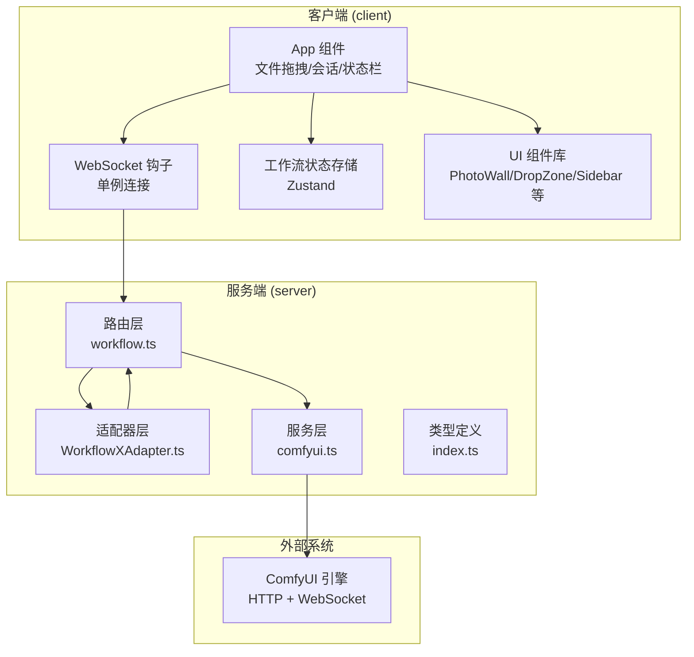
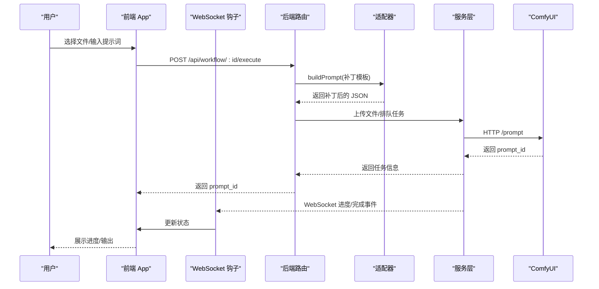
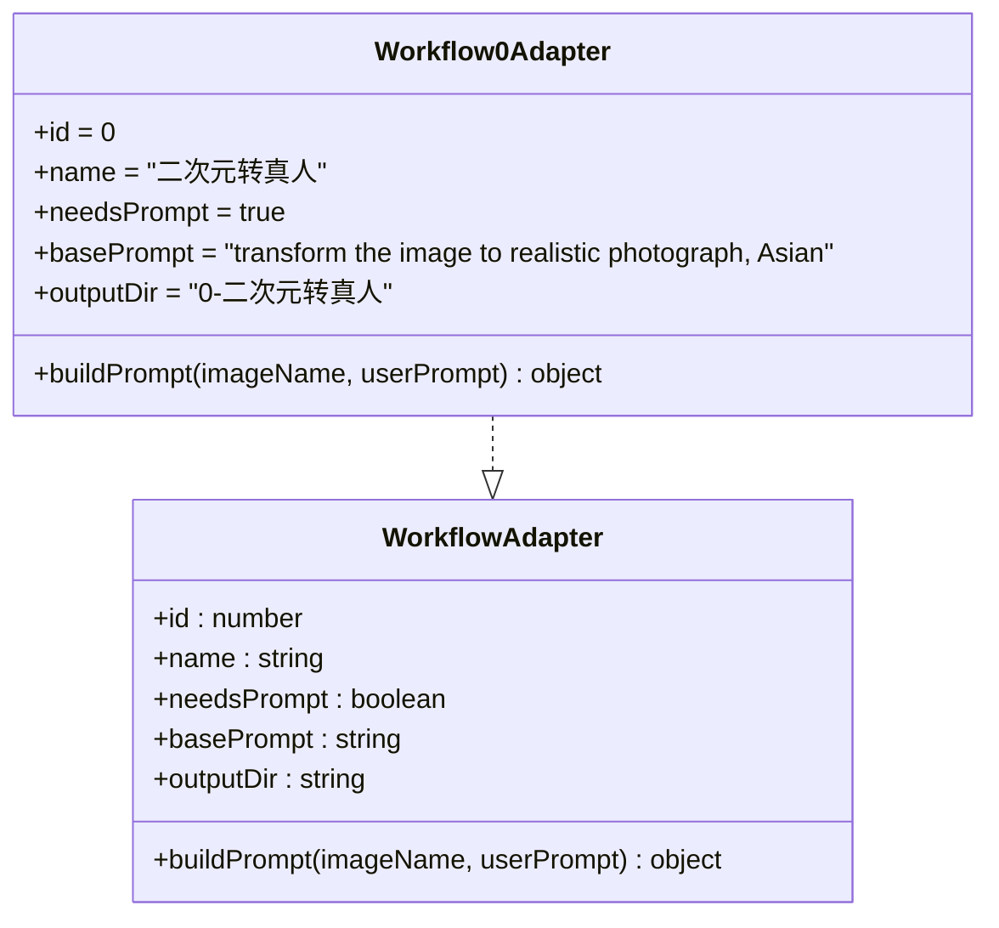
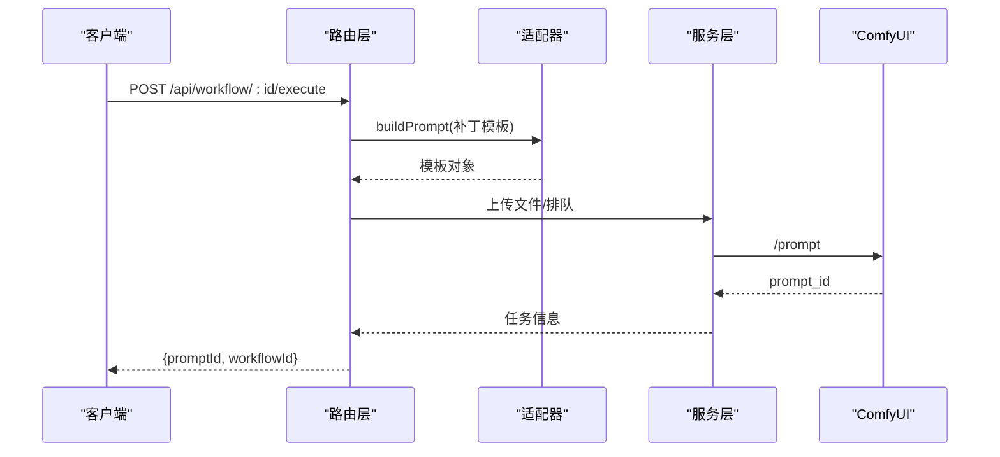
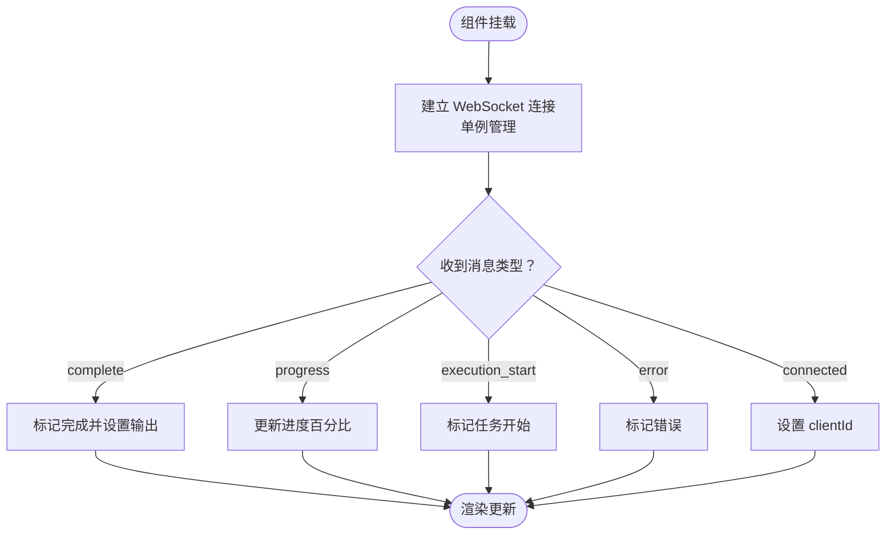
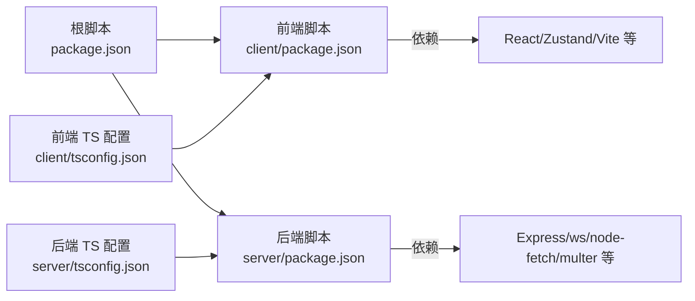

# 贡献指南

<cite>
**本文档引用的文件**
- [README.md](file://README.md)
- [package.json](file://package.json)
- [client/package.json](file://client/package.json)
- [server/package.json](file://server/package.json)
- [client/tsconfig.json](file://client/tsconfig.json)
- [server/tsconfig.json](file://server/tsconfig.json)
- [client/src/components/App.tsx](file://client/src/components/App.tsx)
- [client/src/hooks/useWorkflowStore.ts](file://client/src/hooks/useWorkflowStore.ts)
- [client/src/hooks/useWebSocket.ts](file://client/src/hooks/useWebSocket.ts)
- [client/src/types/index.ts](file://client/src/types/index.ts)
- [server/src/adapters/BaseAdapter.ts](file://server/src/adapters/BaseAdapter.ts)
- [server/src/adapters/index.ts](file://server/src/adapters/index.ts)
- [server/src/adapters/Workflow0Adapter.ts](file://server/src/adapters/Workflow0Adapter.ts)
- [server/src/routes/workflow.ts](file://server/src/routes/workflow.ts)
- [server/src/services/comfyui.ts](file://server/src/services/comfyui.ts)
- [server/src/types/index.ts](file://server/src/types/index.ts)
- [.gitignore](file://.gitignore)
</cite>

## 目录
1. [简介](#简介)
2. [项目结构](#项目结构)
3. [核心组件](#核心组件)
4. [架构总览](#架构总览)
5. [详细组件分析](#详细组件分析)
6. [依赖关系分析](#依赖关系分析)
7. [性能考虑](#性能考虑)
8. [故障排除指南](#故障排除指南)
9. [结论](#结论)
10. [附录](#附录)

## 简介
本指南面向希望为 CorineKit Pix2Real 项目做出贡献的开发者，涵盖代码规范（TypeScript 编码标准、组件开发规范）、工作流适配器开发与扩展、API 接口设计、开发流程（分支管理、代码审查、测试与发布）、以及不同类型的贡献示例（bug 修复、功能增强、文档改进）。目标是帮助贡献者快速理解项目架构、遵循统一规范并高效协作。

## 项目结构
项目采用前后端分离架构，前端使用 Vite + React + TypeScript，后端使用 Express + TypeScript，通过适配器模式对接多个 ComfyUI 工作流，并通过 WebSocket 实时推送进度。

图表来源
- [client/src/components/App.tsx:54-335](file://client/src/components/App.tsx#L54-L335)
- [client/src/hooks/useWebSocket.ts:1-99](file://client/src/hooks/useWebSocket.ts#L1-L99)
- [client/src/hooks/useWorkflowStore.ts:1-645](file://client/src/hooks/useWorkflowStore.ts#L1-L645)
- [server/src/routes/workflow.ts:1-862](file://server/src/routes/workflow.ts#L1-L862)
- [server/src/adapters/index.ts:1-31](file://server/src/adapters/index.ts#L1-L31)
- [server/src/services/comfyui.ts:1-285](file://server/src/services/comfyui.ts#L1-L285)

章节来源
- [README.md:41-79](file://README.md#L41-L79)
- [package.json:1-15](file://package.json#L1-L15)

## 核心组件
- 前端应用入口与状态管理
  - App 组件负责页面布局、拖拽处理、欢迎页与各侧边栏的切换。
  - Zustand 状态存储管理多标签页图像列表、任务队列、提示词、输出索引等。
  - WebSocket 钩子提供单例连接，接收进度、完成、错误事件并更新状态。
- 后端路由与适配器
  - 路由层根据工作流 ID 分发请求，上传文件、构建模板、调用 ComfyUI 并返回任务 ID。
  - 适配器层封装每个工作流的 JSON 模板补丁逻辑，统一 buildPrompt 接口。
  - 服务层封装 ComfyUI 的 HTTP/WS 客户端，提供上传、排队、历史查询、系统统计等能力。
- 类型系统
  - 前后端共享类型定义，确保消息协议一致（如 WSMessage、TaskInfo、WorkflowAdapter）。

章节来源
- [client/src/components/App.tsx:54-335](file://client/src/components/App.tsx#L54-L335)
- [client/src/hooks/useWorkflowStore.ts:96-645](file://client/src/hooks/useWorkflowStore.ts#L96-L645)
- [client/src/hooks/useWebSocket.ts:1-99](file://client/src/hooks/useWebSocket.ts#L1-L99)
- [server/src/routes/workflow.ts:1-862](file://server/src/routes/workflow.ts#L1-L862)
- [server/src/adapters/index.ts:1-31](file://server/src/adapters/index.ts#L1-L31)
- [server/src/services/comfyui.ts:1-285](file://server/src/services/comfyui.ts#L1-L285)
- [client/src/types/index.ts:1-58](file://client/src/types/index.ts#L1-L58)
- [server/src/types/index.ts:1-52](file://server/src/types/index.ts#L1-L52)

## 架构总览
Pix2Real 通过“适配器模式”将不同工作流的 JSON 模板标准化，仅对需要变更的节点进行补丁，从而实现可扩展的工作流体系；后端路由负责文件上传与任务派发，前端通过 WebSocket 实时接收进度并更新 UI。

图表来源
- [server/src/routes/workflow.ts:407-455](file://server/src/routes/workflow.ts#L407-L455)
- [server/src/adapters/Workflow0Adapter.ts:16-34](file://server/src/adapters/Workflow0Adapter.ts#L16-L34)
- [server/src/services/comfyui.ts:47-60](file://server/src/services/comfyui.ts#L47-L60)
- [client/src/hooks/useWebSocket.ts:26-51](file://client/src/hooks/useWebSocket.ts#L26-L51)

## 详细组件分析

### 组件 A：工作流适配器开发与扩展
- 设计要点
  - 每个适配器实现统一接口，包含工作流标识、名称、是否需要提示词、基础提示词、输出目录与 buildPrompt 方法。
  - buildPrompt 仅对必要节点进行补丁，避免全量复制模板，提升可维护性。
- 扩展步骤
  1) 在适配器目录新增适配器文件，导出实现对象。
  2) 在适配器索引中注册该适配器并导出 getAdapter。
  3) 在后端路由中添加对应 ID 的执行与批量接口，复用通用上传与排队逻辑。
  4) 在前端工作流配置中添加新工作流条目，确保 UI 正确显示。
- 关键接口参考
  - 适配器接口定义：[server/src/types/index.ts:1-8](file://server/src/types/index.ts#L1-L8)
  - 适配器索引导出：[server/src/adapters/index.ts:1-31](file://server/src/adapters/index.ts#L1-L31)
  - 典型适配器实现：[server/src/adapters/Workflow0Adapter.ts:1-35](file://server/src/adapters/Workflow0Adapter.ts#L1-L35)

图表来源
- [server/src/types/index.ts:1-8](file://server/src/types/index.ts#L1-L8)
- [server/src/adapters/Workflow0Adapter.ts:9-34](file://server/src/adapters/Workflow0Adapter.ts#L9-L34)

章节来源
- [server/src/adapters/BaseAdapter.ts:1-4](file://server/src/adapters/BaseAdapter.ts#L1-L4)
- [server/src/adapters/index.ts:1-31](file://server/src/adapters/index.ts#L1-L31)
- [server/src/adapters/Workflow0Adapter.ts:1-35](file://server/src/adapters/Workflow0Adapter.ts#L1-L35)
- [server/src/types/index.ts:1-8](file://server/src/types/index.ts#L1-L8)

### 组件 B：API 接口设计与路由扩展
- 设计原则
  - 统一的执行与批量接口，支持图片与视频输入，按需解析 per-image 提示词数组。
  - 对特殊工作流（如解除装备、换脸、文本生图）提供专用路由与参数校验。
  - 提供系统统计、内存释放、队列优先级调整、输出目录打开等辅助接口。
- 扩展建议
  - 新增路由时，先在适配器层确认模板补丁逻辑，再在路由层实现文件上传、参数解析与排队。
  - 对于需要多文件输入的工作流，使用 multer.fields 并在适配器中读取补丁节点。
- 关键接口参考
  - 通用执行接口：[server/src/routes/workflow.ts:407-455](file://server/src/routes/workflow.ts#L407-L455)
  - 专用工作流示例：[server/src/routes/workflow.ts:40-92](file://server/src/routes/workflow.ts#L40-L92)
  - 文本生图接口：[server/src/routes/workflow.ts:94-149](file://server/src/routes/workflow.ts#L94-L149)
  - ZIT 快出接口：[server/src/routes/workflow.ts:181-261](file://server/src/routes/workflow.ts#L181-L261)
  - 换脸接口：[server/src/routes/workflow.ts:263-310](file://server/src/routes/workflow.ts#L263-L310)

图表来源
- [server/src/routes/workflow.ts:407-455](file://server/src/routes/workflow.ts#L407-L455)
- [server/src/services/comfyui.ts:47-60](file://server/src/services/comfyui.ts#L47-L60)

章节来源
- [server/src/routes/workflow.ts:1-862](file://server/src/routes/workflow.ts#L1-L862)
- [server/src/services/comfyui.ts:1-285](file://server/src/services/comfyui.ts#L1-L285)

### 组件 C：前端状态与 WebSocket 流程
- 状态管理
  - 使用 Zustand 管理多标签页数据、任务队列、提示词映射、选中项与输出索引。
  - 支持批量任务、任务重映射、输出移除与会话恢复。
- WebSocket 单例连接
  - 通过模块级全局变量确保单实例连接，断线自动重连，消息分发到状态存储。
- 关键流程参考
  - 状态存储方法集：[client/src/hooks/useWorkflowStore.ts:96-645](file://client/src/hooks/useWorkflowStore.ts#L96-L645)
  - WebSocket 单例与消息分发：[client/src/hooks/useWebSocket.ts:1-99](file://client/src/hooks/useWebSocket.ts#L1-L99)
  - 应用主布局与拖拽处理：[client/src/components/App.tsx:54-335](file://client/src/components/App.tsx#L54-L335)

图表来源
- [client/src/hooks/useWebSocket.ts:26-51](file://client/src/hooks/useWebSocket.ts#L26-L51)
- [client/src/hooks/useWorkflowStore.ts:377-499](file://client/src/hooks/useWorkflowStore.ts#L377-L499)

章节来源
- [client/src/hooks/useWorkflowStore.ts:1-645](file://client/src/hooks/useWorkflowStore.ts#L1-L645)
- [client/src/hooks/useWebSocket.ts:1-99](file://client/src/hooks/useWebSocket.ts#L1-L99)
- [client/src/components/App.tsx:1-335](file://client/src/components/App.tsx#L1-L335)

## 依赖关系分析
- 语言与工具链
  - 前端：TypeScript ~5.7、React 19、Vite 6、Zustand 状态管理。
  - 后端：TypeScript ~5.7、Express 4、ws、node-fetch、multer。
- 项目脚本
  - 一键安装与开发：根目录脚本统一启动前后端。
  - 构建顺序：先前端构建，再后端编译。
- 类型与配置
  - tsconfig 严格模式开启，禁用未使用局部变量/参数检查，保证类型安全与可读性平衡。
- 外部依赖
  - ComfyUI 本地运行（默认 http://127.0.0.1:8188），通过 HTTP/WS 交互。

图表来源
- [package.json:1-15](file://package.json#L1-L15)
- [client/package.json:1-25](file://client/package.json#L1-L25)
- [server/package.json:1-28](file://server/package.json#L1-L28)
- [client/tsconfig.json:1-22](file://client/tsconfig.json#L1-L22)
- [server/tsconfig.json:1-19](file://server/tsconfig.json#L1-L19)

章节来源
- [package.json:1-15](file://package.json#L1-L15)
- [client/package.json:1-25](file://client/package.json#L1-L25)
- [server/package.json:1-28](file://server/package.json#L1-L28)
- [client/tsconfig.json:1-22](file://client/tsconfig.json#L1-L22)
- [server/tsconfig.json:1-19](file://server/tsconfig.json#L1-L19)

## 性能考虑
- 前端
  - 使用单例 WebSocket 减少连接开销与资源占用。
  - Zustand 状态按标签页隔离，避免全局重渲染。
  - 图片预览 URL 在移除时及时 revoke，防止内存泄漏。
- 后端
  - 适配器仅补丁必要节点，减少 JSON 深拷贝与序列化成本。
  - 批量执行时逐个排队，便于监控与错误定位。
  - 系统统计与内存释放接口用于资源管理与调试。
- 通用
  - 严格 tsconfig 配置有助于早期发现潜在性能问题（如未使用变量）。

章节来源
- [client/src/hooks/useWebSocket.ts:1-99](file://client/src/hooks/useWebSocket.ts#L1-L99)
- [client/src/hooks/useWorkflowStore.ts:254-329](file://client/src/hooks/useWorkflowStore.ts#L254-L329)
- [server/src/adapters/Workflow0Adapter.ts:16-34](file://server/src/adapters/Workflow0Adapter.ts#L16-L34)
- [server/src/routes/workflow.ts:457-520](file://server/src/routes/workflow.ts#L457-L520)
- [server/src/services/comfyui.ts:106-125](file://server/src/services/comfyui.ts#L106-L125)

## 故障排除指南
- 常见问题
  - ComfyUI 不可用：检查本地服务地址与端口，确认 HTTP/WS 可达。
  - WebSocket 断开重连：确认前端单例连接逻辑与后端 WS 地址一致。
  - 文件上传失败：检查 multer 配置与文件大小限制，确认 ComfyUI 上传接口正常。
  - 任务无进度：确认 ComfyUI 版本事件类型（progress/executing/execution_success），后端/前端消息解析一致。
- 排查步骤
  - 查看后端日志与错误响应体，定位具体路由与适配器。
  - 使用系统统计接口确认 VRAM/内存使用情况。
  - 使用队列优先级与取消接口进行任务调试。
- 相关参考
  - ComfyUI 客户端封装：[server/src/services/comfyui.ts:1-285](file://server/src/services/comfyui.ts#L1-L285)
  - WebSocket 事件分发：[client/src/hooks/useWebSocket.ts:26-51](file://client/src/hooks/useWebSocket.ts#L26-L51)
  - 路由错误处理：[server/src/routes/workflow.ts:88-92](file://server/src/routes/workflow.ts#L88-L92)

章节来源
- [server/src/services/comfyui.ts:1-285](file://server/src/services/comfyui.ts#L1-L285)
- [client/src/hooks/useWebSocket.ts:1-99](file://client/src/hooks/useWebSocket.ts#L1-L99)
- [server/src/routes/workflow.ts:1-862](file://server/src/routes/workflow.ts#L1-L862)

## 结论
本指南提供了从代码规范、组件扩展到开发流程与故障排除的完整贡献路径。建议贡献者在提交前对照类型定义与现有适配器/路由实现，确保新功能与既有架构保持一致，同时关注性能与可维护性。

## 附录

### A. 代码规范与最佳实践
- TypeScript 编码标准
  - 严格模式开启，合理使用类型别名与接口，避免 any。
  - 导出统一的类型定义，前后端共享，确保消息协议一致。
  - 配置文件中禁用未使用局部变量/参数检查，但保留严格类型检查。
- 组件开发规范
  - 前端组件职责单一，状态集中管理；UI 与业务逻辑解耦。
  - 适配器仅做模板补丁，不包含业务逻辑；路由层负责参数校验与调度。
- Git 提交规范
  - 提交信息格式：类型(scope): 描述（例如 feat(adapter): 新增 WorkflowX 适配器）
  - 类型建议：feat、fix、refactor、docs、test、chore
  - 每次提交聚焦一个改动点，配合小步快跑与清晰注释

章节来源
- [client/tsconfig.json:1-22](file://client/tsconfig.json#L1-L22)
- [server/tsconfig.json:1-19](file://server/tsconfig.json#L1-L19)
- [client/src/types/index.ts:1-58](file://client/src/types/index.ts#L1-L58)
- [server/src/types/index.ts:1-52](file://server/src/types/index.ts#L1-L52)

### B. 开发流程与协作规范
- 分支管理
  - 主分支保护，功能开发在特性分支进行。
  - 合并请求（MR）必须包含测试与变更说明。
- 代码审查
  - 至少一名维护者审查，关注架构一致性、性能与安全性。
- 测试要求
  - 前端：单元测试覆盖关键状态逻辑与组件行为。
  - 后端：集成测试覆盖路由、适配器与服务层交互。
- 发布流程
  - 本地验证通过后，更新版本号与变更日志，打标签并推送。

章节来源
- [README.md:16-39](file://README.md#L16-L39)
- [package.json:1-15](file://package.json#L1-L15)

### C. 贡献示例

#### 示例 1：新增工作流适配器
- 步骤
  1) 在适配器目录新增适配器文件，实现 buildPrompt。
  2) 在适配器索引中注册并导出 getAdapter。
  3) 在路由层添加 /api/workflow/:id/execute 与 /batch 接口。
  4) 在前端工作流配置中添加新工作流条目。
- 参考
  - 适配器实现：[server/src/adapters/Workflow0Adapter.ts:1-35](file://server/src/adapters/Workflow0Adapter.ts#L1-L35)
  - 适配器索引导出：[server/src/adapters/index.ts:1-31](file://server/src/adapters/index.ts#L1-L31)
  - 路由扩展：[server/src/routes/workflow.ts:407-455](file://server/src/routes/workflow.ts#L407-L455)

#### 示例 2：修复 WebSocket 断线重连问题
- 步骤
  1) 检查前端单例连接逻辑与断线回调。
  2) 确认后端 WS 地址与协议匹配（ws/wss）。
  3) 添加日志与重连定时器清理，避免重复连接。
- 参考
  - 单例连接与重连：[client/src/hooks/useWebSocket.ts:1-99](file://client/src/hooks/useWebSocket.ts#L1-L99)

#### 示例 3：优化状态存储性能
- 步骤
  1) 分析状态更新路径，避免不必要的深拷贝。
  2) 对批量任务与输出索引更新进行去抖/合并。
  3) 移除不再使用的预览 URL，释放内存。
- 参考
  - 状态更新与清理：[client/src/hooks/useWorkflowStore.ts:377-544](file://client/src/hooks/useWorkflowStore.ts#L377-L544)
  - 预览 URL 清理：[client/src/hooks/useWorkflowStore.ts:254-329](file://client/src/hooks/useWorkflowStore.ts#L254-L329)

#### 示例 4：增强 API 接口（如多模型支持）
- 步骤
  1) 在路由层增加参数解析与校验。
  2) 在适配器层扩展 buildPrompt 以支持不同模型。
  3) 在前端 UI 中暴露模型选择控件。
- 参考
  - 通用执行接口：[server/src/routes/workflow.ts:407-455](file://server/src/routes/workflow.ts#L407-L455)
  - 模型列表接口：[server/src/routes/workflow.ts:151-179](file://server/src/routes/workflow.ts#L151-L179)

#### 示例 5：改进文档与计划
- 步骤
  1) 在 docs 目录补充设计文档与实现计划。
  2) 更新 README 或新增贡献说明文件。
  3) 提供示例 JSON 模板与系统提示词。
- 参考
  - 计划文档示例：[docs/plans/2026-02-24-mask-editor-design.md](file://docs/plans/2026-02-24-mask-editor-design.md)
  - 系统提示词：[docs/SystemPrompt.txt](file://docs/SystemPrompt.txt)

章节来源
- [server/src/adapters/Workflow0Adapter.ts:1-35](file://server/src/adapters/Workflow0Adapter.ts#L1-L35)
- [server/src/adapters/index.ts:1-31](file://server/src/adapters/index.ts#L1-L31)
- [server/src/routes/workflow.ts:407-455](file://server/src/routes/workflow.ts#L407-L455)
- [client/src/hooks/useWorkflowStore.ts:377-544](file://client/src/hooks/useWorkflowStore.ts#L377-L544)
- [client/src/hooks/useWorkflowStore.ts:254-329](file://client/src/hooks/useWorkflowStore.ts#L254-L329)
- [client/src/hooks/useWebSocket.ts:1-99](file://client/src/hooks/useWebSocket.ts#L1-L99)

### D. 社区参与与沟通
- 沟通渠道
  - GitHub Issues：Bug 报告与功能请求
  - Discussions：设计讨论与使用经验分享
- 行为准则
  - 尊重与包容，遵循开源协作精神
  - 提供充分上下文与最小可复现示例
- 贡献认可
  - 代码贡献将被记录在版本历史中
  - 重要贡献者可申请维护者权限

章节来源
- [README.md:1-79](file://README.md#L1-L79)
- [.gitignore:1-34](file://.gitignore#L1-L34)