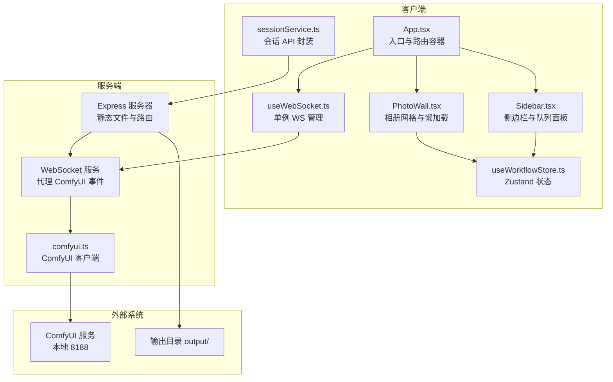
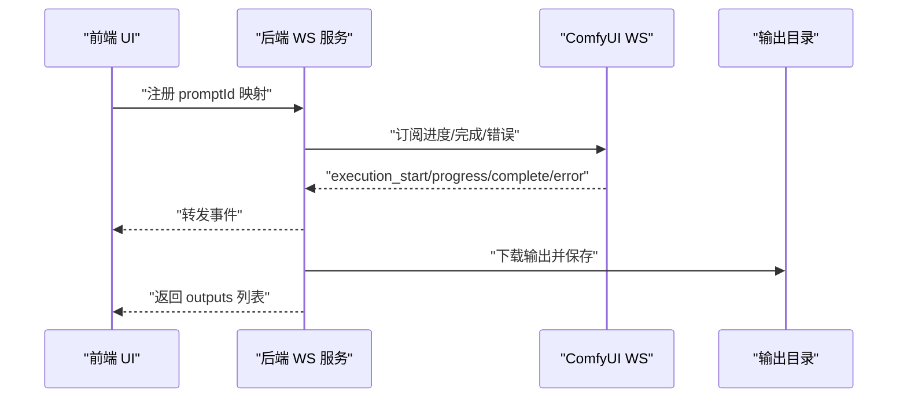
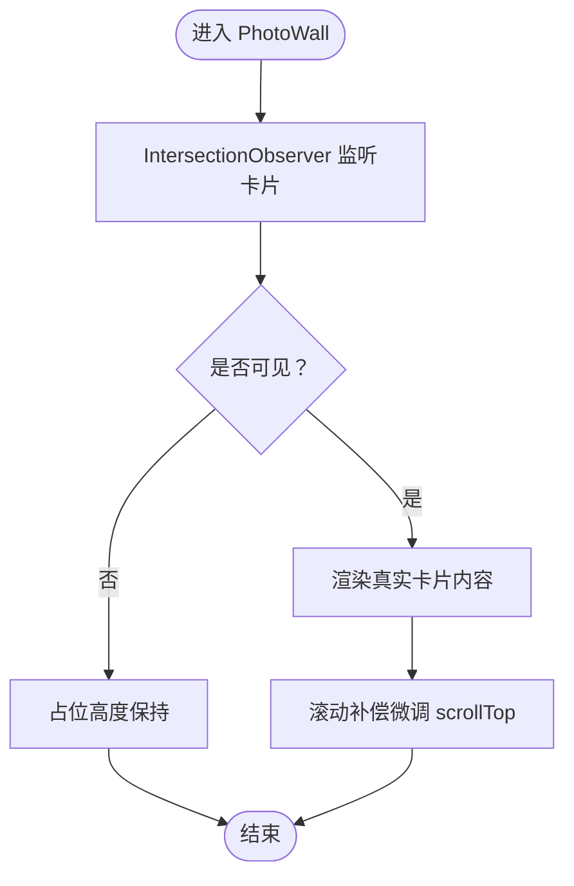
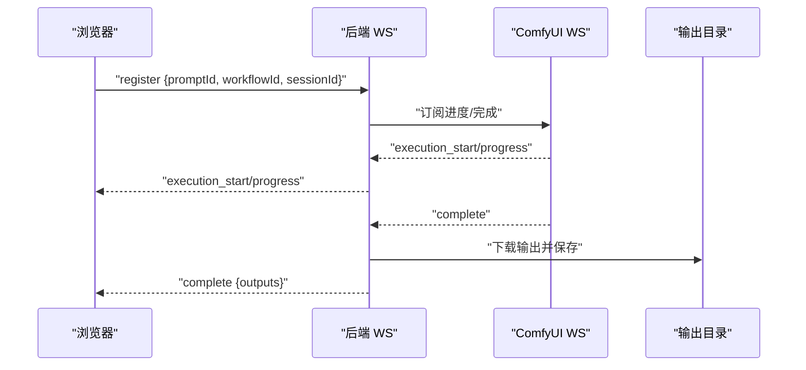
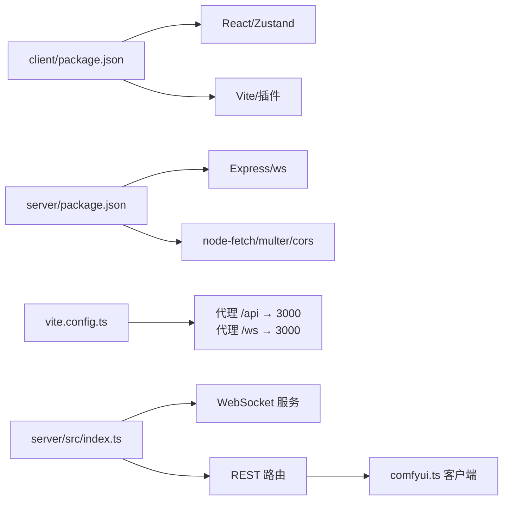

# 性能优化

<cite>
**本文引用的文件**
- [README.md](file://README.md)
- [client/package.json](file://client/package.json)
- [client/vite.config.ts](file://client/vite.config.ts)
- [client/src/main.tsx](file://client/src/main.tsx)
- [client/src/components/App.tsx](file://client/src/components/App.tsx)
- [client/src/components/Sidebar.tsx](file://client/src/components/Sidebar.tsx)
- [client/src/components/PhotoWall.tsx](file://client/src/components/PhotoWall.tsx)
- [client/src/hooks/useWebSocket.ts](file://client/src/hooks/useWebSocket.ts)
- [client/src/hooks/useWorkflowStore.ts](file://client/src/hooks/useWorkflowStore.ts)
- [client/src/hooks/useSettingsStore.ts](file://client/src/hooks/useSettingsStore.ts)
- [client/src/services/sessionService.ts](file://client/src/services/sessionService.ts)
- [server/package.json](file://server/package.json)
- [server/src/index.ts](file://server/src/index.ts)
- [server/src/services/comfyui.ts](file://server/src/services/comfyui.ts)
</cite>

## 目录
1. [简介](#简介)
2. [项目结构](#项目结构)
3. [核心组件](#核心组件)
4. [架构总览](#架构总览)
5. [详细组件分析](#详细组件分析)
6. [依赖关系分析](#依赖关系分析)
7. [性能考量与优化策略](#性能考量与优化策略)
8. [故障排查指南](#故障排查指南)
9. [结论](#结论)
10. [附录](#附录)

## 简介
本指南面向 CorineKit Pix2Real 的前端与后端性能优化，覆盖 React 组件与状态管理优化、内存泄漏防护、Bundle 分析与代码分割、Node.js 服务器优化、WebSocket 连接池与并发处理、数据库/文件系统访问优化、ComfyUI 集成的模型加载与 GPU 内存管理、缓存策略（浏览器/服务端/CDN）、性能监控与基准测试、以及资源使用优化（CPU、内存、磁盘 I/O、网络带宽）。文档同时提供可视化图示与可操作的改进建议。

## 项目结构
项目采用前后端分离架构：前端基于 Vite + React + TypeScript；后端基于 Express + WebSocket；通过 WebSocket 将 ComfyUI 的进度事件实时转发至浏览器，并将输出文件落盘到本地目录，支持会话持久化与批量处理。

图表来源
- [client/src/components/App.tsx:54-335](file://client/src/components/App.tsx#L54-L335)
- [client/src/components/PhotoWall.tsx:103-578](file://client/src/components/PhotoWall.tsx#L103-L578)
- [client/src/components/Sidebar.tsx:30-425](file://client/src/components/Sidebar.tsx#L30-L425)
- [client/src/hooks/useWorkflowStore.ts:96-645](file://client/src/hooks/useWorkflowStore.ts#L96-L645)
- [client/src/hooks/useWebSocket.ts:1-99](file://client/src/hooks/useWebSocket.ts#L1-L99)
- [client/src/services/sessionService.ts:1-134](file://client/src/services/sessionService.ts#L1-L134)
- [server/src/index.ts:42-228](file://server/src/index.ts#L42-L228)
- [server/src/services/comfyui.ts:1-285](file://server/src/services/comfyui.ts#L1-L285)

章节来源
- [README.md:41-79](file://README.md#L41-L79)
- [client/src/main.tsx:1-11](file://client/src/main.tsx#L1-L11)
- [client/vite.config.ts:1-20](file://client/vite.config.ts#L1-L20)
- [server/src/index.ts:42-228](file://server/src/index.ts#L42-L228)

## 核心组件
- 前端应用入口与路由容器：负责主题、欢迎页、会话条、状态栏、全局拖拽与视图切换。
- 相册网格 PhotoWall：按列布局展示卡片，使用 IntersectionObserver 实现懒渲染与滚动补偿，减少首屏与长列表渲染压力。
- 侧边栏 Sidebar：分组导航、队列面板、拖拽复制图片到目标标签页、轮询 ComfyUI 队列长度。
- 单例 WebSocket 管理：模块级全局连接，避免重复连接与泄漏；消息解析后写入 Zustand store。
- Zustand 状态仓库：集中管理当前标签页数据、任务状态、选择集、配置等；提供批量更新与跨标签同步逻辑。
- 会话服务：封装上传输入图、蒙版、保存/恢复会话等 API。

章节来源
- [client/src/components/App.tsx:54-335](file://client/src/components/App.tsx#L54-L335)
- [client/src/components/PhotoWall.tsx:103-578](file://client/src/components/PhotoWall.tsx#L103-L578)
- [client/src/components/Sidebar.tsx:30-425](file://client/src/components/Sidebar.tsx#L30-L425)
- [client/src/hooks/useWebSocket.ts:1-99](file://client/src/hooks/useWebSocket.ts#L1-L99)
- [client/src/hooks/useWorkflowStore.ts:96-645](file://client/src/hooks/useWorkflowStore.ts#L96-L645)
- [client/src/services/sessionService.ts:1-134](file://client/src/services/sessionService.ts#L1-L134)

## 架构总览
前端通过 WebSocket 与后端建立长连接，后端再与 ComfyUI 建立 WebSocket 连接，将进度、完成、错误事件透传给前端。后端还提供 REST 接口用于队列查询、工作流执行、输出下载与会话管理。

图表来源
- [server/src/index.ts:73-219](file://server/src/index.ts#L73-L219)
- [server/src/services/comfyui.ts:127-188](file://server/src/services/comfyui.ts#L127-L188)

章节来源
- [README.md:74-79](file://README.md#L74-L79)
- [server/src/index.ts:62-228](file://server/src/index.ts#L62-L228)

## 详细组件分析

### 前端组件与状态管理优化
- 懒渲染与滚动补偿：PhotoWall 使用 IntersectionObserver 包裹每个卡片，仅在进入视口时渲染真实内容，并在占位符转真实内容时进行微调滚动补偿，降低滚动抖动与重排成本。
- 状态拆分与不可变更新：Zustand store 将每标签页的数据结构化，使用浅拷贝与局部更新，避免不必要的重渲染；对任务状态、选择集、提示词等字段分别维护，提升更新粒度。
- 单例 WebSocket：useWebSocket 通过模块级全局变量与计数器控制连接生命周期，确保组件卸载时正确关闭，防止连接泄漏。
- 会话持久化：sessionService 对外暴露上传/保存/加载接口，前端在合适时机触发，避免频繁网络请求与重复计算。

图表来源
- [client/src/components/PhotoWall.tsx:18-97](file://client/src/components/PhotoWall.tsx#L18-L97)

章节来源
- [client/src/components/PhotoWall.tsx:103-578](file://client/src/components/PhotoWall.tsx#L103-L578)
- [client/src/hooks/useWorkflowStore.ts:96-645](file://client/src/hooks/useWorkflowStore.ts#L96-L645)
- [client/src/hooks/useWebSocket.ts:1-99](file://client/src/hooks/useWebSocket.ts#L1-L99)

### WebSocket 与后端集成
- 后端为每个浏览器客户端创建一个 ComfyUI WS 连接，缓冲早期事件并在客户端注册 promptId 后重放，保证进度不丢失。
- 支持 completion 时从 ComfyUI 下载输出到本地会话目录，完成后向前端发送 outputs 列表。
- 前端收到 completion 后更新 store 并默认选择新输出（视频工作流优先选择“插帧”项），随后清理映射与事件缓冲。

图表来源
- [server/src/index.ts:73-219](file://server/src/index.ts#L73-L219)
- [server/src/services/comfyui.ts:127-188](file://server/src/services/comfyui.ts#L127-L188)

章节来源
- [server/src/index.ts:73-219](file://server/src/index.ts#L73-L219)
- [server/src/services/comfyui.ts:127-188](file://server/src/services/comfyui.ts#L127-L188)

### 会话与队列管理
- Sidebar 轮询 /api/workflow/queue 获取运行与等待中的任务数量，用于显示队列指示器。
- PhotoWall 在批量执行时根据当前标签页构造表单并发起执行请求，成功后在 store 中标记任务状态并发送注册消息到后端。

章节来源
- [client/src/components/Sidebar.tsx:67-81](file://client/src/components/Sidebar.tsx#L67-L81)
- [client/src/components/PhotoWall.tsx:181-240](file://client/src/components/PhotoWall.tsx#L181-L240)

## 依赖关系分析
- 前端依赖：React、Zustand、lucide-react、Vite 插件生态。
- 后端依赖：Express、ws、node-fetch、multer、cors。
- 代理与端口：前端 Vite 代理 /api 与 /ws 到后端 3000；后端监听 3000，WebSocket 路径 /ws。

图表来源
- [client/package.json:11-23](file://client/package.json#L11-L23)
- [server/package.json:11-26](file://server/package.json#L11-L26)
- [client/vite.config.ts:4-19](file://client/vite.config.ts#L4-L19)
- [server/src/index.ts:42-63](file://server/src/index.ts#L42-L63)
- [server/src/services/comfyui.ts:1-285](file://server/src/services/comfyui.ts#L1-L285)

章节来源
- [client/package.json:1-25](file://client/package.json#L1-L25)
- [server/package.json:1-28](file://server/package.json#L1-L28)
- [client/vite.config.ts:1-20](file://client/vite.config.ts#L1-L20)
- [server/src/index.ts:42-63](file://server/src/index.ts#L42-L63)

## 性能考量与优化策略

### 前端性能优化
- React 组件优化
  - 使用 memo 包裹轻量组件（如 LazyCard），减少无谓重渲染。
  - 将大列表按列布局，结合 IntersectionObserver 懒渲染与滚动补偿，显著降低首屏与长列表渲染成本。
  - 避免在渲染路径中进行昂贵计算，将计算结果缓存于 store 或本地存储。
- 状态管理优化
  - 使用 Zustand 的局部更新，避免整块状态深拷贝；对任务状态、选择集、提示词等字段独立维护。
  - 通过映射与索引（如 imagePromptMap）减少跨标签遍历查找。
- 内存泄漏防护
  - 单例 WebSocket：确保连接计数与关闭逻辑一致，组件卸载时及时清理定时器与连接。
  - 图片预览 URL：移除图片时及时 revokeObjectURL，避免内存累积。
  - 拖拽状态与遮罩：拖拽结束时重置状态，避免残留引用。
- Bundle 分析与代码分割
  - 使用 Vite 的原生分析工具与可视化报告定位体积热点，按需引入图标与组件。
  - 将非关键路径组件（如设置面板、提示词助手）延迟加载，缩短首屏 JS 体积。
- 浏览器缓存与 CDN
  - 静态资源启用长期缓存策略（含子资源完整性），HTML 采用短缓存或协商缓存。
  - 输出文件（/output 与 /api/session-files）由后端静态服务提供，可配合 CDN 缓存与边缘加速。

章节来源
- [client/src/components/PhotoWall.tsx:18-97](file://client/src/components/PhotoWall.tsx#L18-L97)
- [client/src/hooks/useWorkflowStore.ts:254-329](file://client/src/hooks/useWorkflowStore.ts#L254-L329)
- [client/src/hooks/useWebSocket.ts:75-99](file://client/src/hooks/useWebSocket.ts#L75-L99)
- [client/vite.config.ts:4-19](file://client/vite.config.ts#L4-L19)

### 后端性能优化
- Node.js 服务器优化
  - 合理设置请求体大小限制（当前已放宽至 50MB），避免超大文件导致内存峰值过高。
  - 使用静态文件中间件提供输出与会话文件，减少业务逻辑开销。
- WebSocket 连接池与并发
  - 当前为每个浏览器客户端创建一个 ComfyUI WS 连接，建议在高并发场景下评估复用策略与背压处理。
  - 对事件缓冲区与映射表进行定期清理，避免长时间运行导致内存增长。
- 并发处理优化
  - /api/workflow/queue 轮询间隔 2 秒，可根据队列长度动态调整频率，降低无效请求。
  - 对批量执行请求进行节流与去重，避免重复提交相同任务。
- 数据库/文件系统访问优化
  - 输出落盘采用同步 IO，建议在高吞吐场景下考虑异步写入与队列化，避免阻塞主流程。
  - 对会话目录与输出目录进行合理的权限与配额管理，防止磁盘空间耗尽。

章节来源
- [server/src/index.ts:51-60](file://server/src/index.ts#L51-L60)
- [server/src/index.ts:62-228](file://server/src/index.ts#L62-L228)
- [server/src/services/comfyui.ts:202-221](file://server/src/services/comfyui.ts#L202-L221)

### ComfyUI 集成优化
- 模型加载策略
  - 通过 object_info 接口获取可用模型列表，避免在 UI 层硬编码，减少错误与刷新成本。
  - 对常用模型进行预热加载，缩短首次推理时间。
- GPU 内存管理
  - 结合 /system_stats 获取 VRAM 使用率，必要时触发 ComfyUI 的内存清理（如释放显存）。
  - 控制批量大小与分辨率，避免显存溢出。
- 批量处理优化
  - 优先将高优先级任务重新排队，减少等待时间。
  - 对视频类工作流（如插帧）优先选择新输出作为默认选中项，提升交互效率。

章节来源
- [server/src/services/comfyui.ts:106-125](file://server/src/services/comfyui.ts#L106-L125)
- [server/src/services/comfyui.ts:228-253](file://server/src/services/comfyui.ts#L228-L253)
- [server/src/services/comfyui.ts:255-284](file://server/src/services/comfyui.ts#L255-L284)

### 缓存策略设计与实现
- 浏览器缓存
  - 静态资源长期缓存 + 版本化文件名；HTML 采用协商缓存或短缓存。
  - 对图片预览与会话数据采用内存缓存，避免重复读取。
- 服务器缓存
  - 输出目录与会话目录由 Express 静态服务提供，可结合 CDN 边缘缓存。
  - 对队列查询与系统统计等接口增加短期缓存，降低 ComfyUI 压力。
- CDN 配置
  - 将 /output 与 /api/session-files 通过 CDN 加速，设置合适的缓存头与压缩策略。

章节来源
- [server/src/index.ts:58-60](file://server/src/index.ts#L58-L60)
- [server/src/services/comfyui.ts:202-221](file://server/src/services/comfyui.ts#L202-L221)

### 性能监控与基准测试
- 指标设置
  - 前端：首屏时间、交互就绪时间、长列表滚动帧率、WebSocket 连接成功率、任务完成时间分布。
  - 后端：请求延迟与错误率、队列长度、ComfyUI 进度事件到达延迟、磁盘写入速率。
- 分析方法
  - 使用浏览器性能面板与 React DevTools 分析渲染热点；利用 Vercel/SpeedCurve 等平台进行持续监控。
  - 后端日志与指标（如 Prometheus）采集，结合 APM 工具定位瓶颈。
- 基准与压力测试
  - 前端：模拟大量图片导入与滚动，测量滚动帧率与内存占用；验证懒渲染与滚动补偿效果。
  - 后端：并发执行多个工作流任务，观察队列响应与磁盘写入性能；评估 WebSocket 复用与背压策略。

[本节为通用指导，无需特定文件引用]

### 资源使用优化
- CPU：减少主线程阻塞，将重计算与 I/O 放入 Web Workers 或后台线程；合理设置批处理大小。
- 内存：及时释放预览 URL、清理事件缓冲与映射表、避免闭包持有大对象。
- 磁盘 I/O：异步写入、批量落盘、控制输出文件数量与格式；监控磁盘空间与 inode 使用。
- 网络带宽：启用压缩与缓存，合并请求，避免重复传输；对大文件采用分块上传与断点续传。

[本节为通用指导，无需特定文件引用]

## 故障排查指南
- WebSocket 连接异常
  - 检查代理配置是否正确指向后端 3000；确认后端 WebSocket 服务已启动且可连通 ComfyUI。
  - 查看前端控制台与后端日志，定位 onclose/onerror 触发原因。
- 任务进度缺失
  - 确认客户端在 ComfyUI 开始执行前已发送注册消息；检查事件缓冲区是否被清理过早。
- 输出未保存
  - 检查后端输出目录是否存在与权限；确认 ComfyUI 输出接口可正常访问。
- 队列信息不准确
  - 检查 /api/workflow/queue 轮询是否被拦截或跨域；确认 ComfyUI 队列接口可用。

章节来源
- [client/src/hooks/useWebSocket.ts:53-65](file://client/src/hooks/useWebSocket.ts#L53-L65)
- [server/src/index.ts:191-219](file://server/src/index.ts#L191-L219)
- [server/src/services/comfyui.ts:202-221](file://server/src/services/comfyui.ts#L202-L221)

## 结论
通过组件级懒渲染、状态级细粒度更新、单例 WebSocket 管理与合理的缓存策略，Pix2Real 在前端侧已具备良好的性能基础。后端侧应重点关注队列并发、事件缓冲清理与磁盘写入优化。结合 ComfyUI 的系统统计与模型管理能力，可在 GPU 内存与批量处理上进一步提升吞吐。建议持续引入性能监控与自动化基准测试，形成闭环优化机制。

[本节为总结性内容，无需特定文件引用]

## 附录
- 项目结构与特性概览参见项目自述文件。
- 前端构建与开发命令、后端启动与监听端口参见各 package.json 与入口文件。

章节来源
- [README.md:41-79](file://README.md#L41-L79)
- [client/package.json:6-10](file://client/package.json#L6-L10)
- [server/package.json:6-10](file://server/package.json#L6-L10)
- [server/src/index.ts:221-228](file://server/src/index.ts#L221-L228)