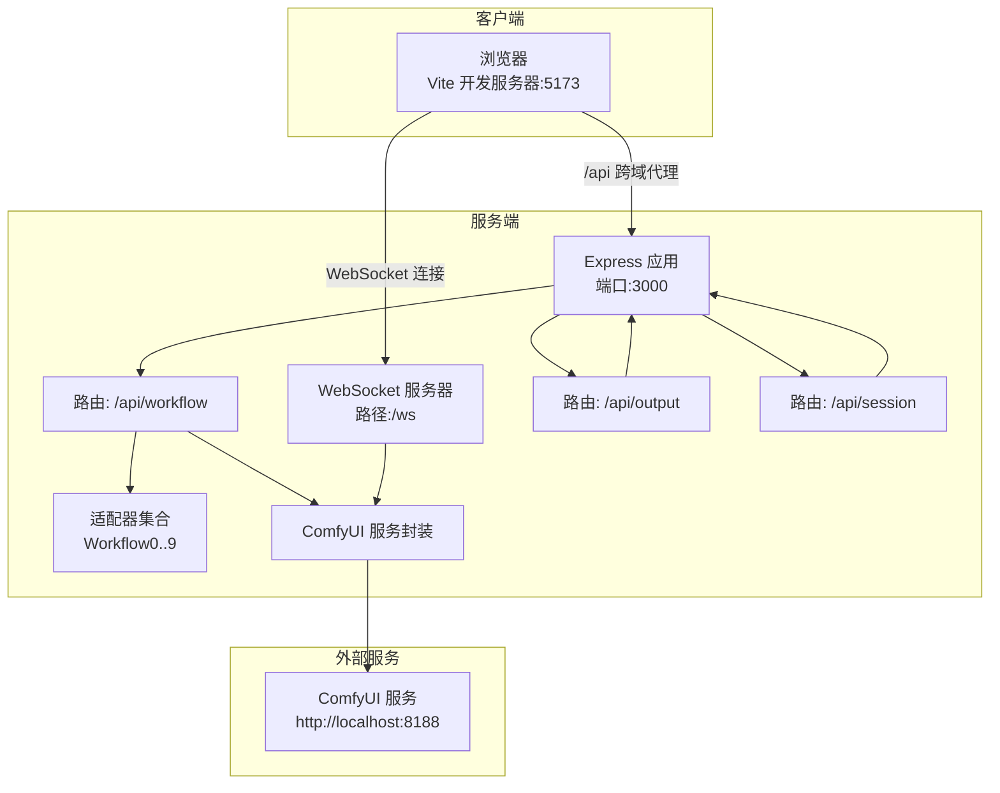
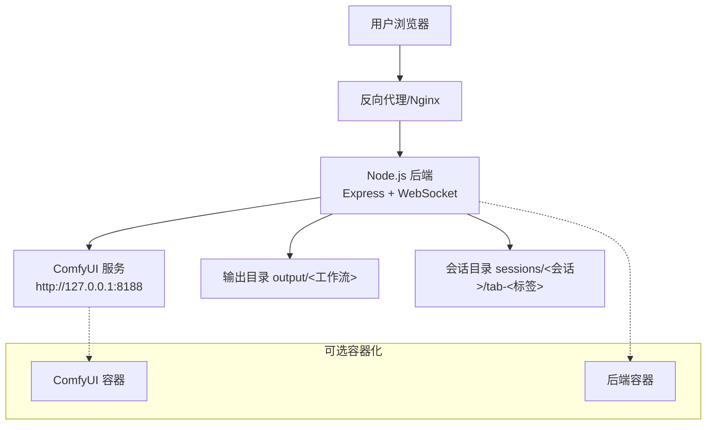
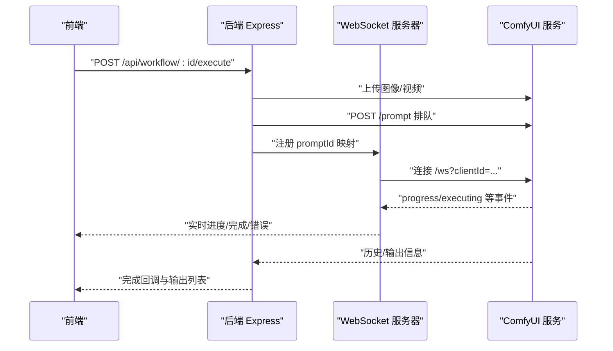
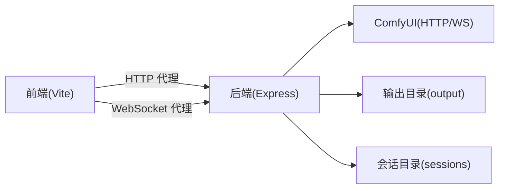

# 生产环境部署

<cite>
**本文引用的文件**
- [README.md](file://README.md)
- [package.json](file://package.json)
- [start.bat](file://start.bat)
- [stop.bat](file://stop.bat)
- [debug.bat](file://debug.bat)
- [server/package.json](file://server/package.json)
- [client/package.json](file://client/package.json)
- [server/src/index.ts](file://server/src/index.ts)
- [server/src/services/comfyui.ts](file://server/src/services/comfyui.ts)
- [server/src/adapters/index.ts](file://server/src/adapters/index.ts)
- [server/src/routes/workflow.ts](file://server/src/routes/workflow.ts)
- [server/src/routes/output.ts](file://server/src/routes/output.ts)
- [server/src/routes/session.ts](file://server/src/routes/session.ts)
- [client/vite.config.ts](file://client/vite.config.ts)
- [.gitignore](file://.gitignore)
</cite>

## 目录
1. [简介](#简介)
2. [项目结构](#项目结构)
3. [核心组件](#核心组件)
4. [架构总览](#架构总览)
5. [详细组件分析](#详细组件分析)
6. [依赖分析](#依赖分析)
7. [性能考虑](#性能考虑)
8. [故障排除指南](#故障排除指南)
9. [结论](#结论)
10. [附录](#附录)

## 简介
本指南面向在生产环境中部署 CorineKit Pix2Real 的工程团队，目标是提供从系统要求、环境准备、安装部署到服务启动顺序、脚本使用、ComfyUI 集成以及可选的 Docker 方案的完整说明。同时包含部署验证步骤与常见问题排查建议。

## 项目结构
项目采用前后端分离架构：前端为 Vite + React + TypeScript；后端为 Express + TypeScript；通过 WebSocket 实时转发 ComfyUI 执行进度；输出目录与会话数据独立管理。

图表来源
- [server/src/index.ts:42-63](file://server/src/index.ts#L42-L63)
- [client/vite.config.ts:6-18](file://client/vite.config.ts#L6-L18)
- [server/src/services/comfyui.ts:6-7](file://server/src/services/comfyui.ts#L6-L7)

章节来源
- [README.md:41-62](file://README.md#L41-L62)
- [client/vite.config.ts:6-18](file://client/vite.config.ts#L6-L18)
- [server/src/index.ts:42-63](file://server/src/index.ts#L42-L63)

## 核心组件
- 后端服务（Express）：提供 REST API、静态资源服务、WebSocket 服务器，负责与 ComfyUI 通信并转发进度事件。
- 前端（Vite + React）：本地开发服务器，通过代理访问后端 API 并建立 WebSocket 连接。
- ComfyUI 集成：后端以 HTTP 和 WebSocket 方式与 ComfyUI 交互，支持上传图像/视频、排队执行、查询队列与历史、下载输出等。
- 适配器模式：按工作流 ID 加载对应模板并动态修补节点参数，实现多工作流统一调度。
- 输出与会话：输出目录按工作流分类管理；会话数据持久化至 sessions 目录，支持输入图片、蒙版与界面状态保存。

章节来源
- [server/src/index.ts:17-40](file://server/src/index.ts#L17-L40)
- [server/src/services/comfyui.ts:6-7](file://server/src/services/comfyui.ts#L6-L7)
- [server/src/adapters/index.ts:13-24](file://server/src/adapters/index.ts#L13-L24)
- [server/src/routes/output.ts:13-20](file://server/src/routes/output.ts#L13-L20)
- [server/src/routes/session.ts:18-33](file://server/src/routes/session.ts#L18-L33)

## 架构总览
生产部署建议将前端构建产物托管于 Nginx/Apache 或 CDN，后端以 Node.js 进程运行，ComfyUI 作为独立服务或容器运行。WebSocket 与 HTTP 代理策略需确保跨域与升级成功。

图表来源
- [server/src/index.ts:221-227](file://server/src/index.ts#L221-L227)
- [server/src/services/comfyui.ts:6-7](file://server/src/services/comfyui.ts#L6-L7)
- [server/src/routes/output.ts:9-10](file://server/src/routes/output.ts#L9-L10)

## 详细组件分析

### 系统要求与环境准备
- 操作系统
  - 支持 Windows/Linux/macOS，推荐 Linux 用于生产稳定性和资源占用控制。
- 硬件配置
  - CPU：至少 8 核心，推荐 16+ 核心以提升并发处理能力。
  - 内存：至少 32GB，推荐 64GB+ 以容纳大型模型与批量任务。
  - 存储：SSD 至少 500GB 可用空间，输出目录与模型缓存占用较大。
  - 显卡：NVIDIA RTX 4090/3090/2090 级别更佳；显存≥24GB，以便运行高分辨率与大模型。
- 网络配置
  - 后端监听地址默认仅本地回环，生产需绑定内网 IP 并开放端口 3000。
  - WebSocket 路径为 /ws，需确保反向代理正确升级。
  - ComfyUI 默认监听 127.0.0.1:8188，若跨主机部署需调整服务端连接地址。
- 运行时依赖
  - Node.js 18+（仓库脚本与依赖均基于此版本生态）。
  - ComfyUI 服务可用且可被后端访问。

章节来源
- [README.md:16-20](file://README.md#L16-L20)
- [server/src/services/comfyui.ts:6-7](file://server/src/services/comfyui.ts#L6-L7)

### 依赖安装与构建
- 全量安装
  - 使用根目录提供的安装脚本一次性安装前后端依赖。
- 构建流程
  - 前端：Vite 构建产物输出至 client/dist。
  - 后端：TypeScript 编译输出至 server/dist，运行时入口为 server/src/index.ts。
- 环境变量
  - 后端可通过环境变量 PORT 设置监听端口，默认 3000。
  - 若需变更 ComfyUI 地址，可在服务端源码中修改常量（生产建议通过环境变量注入）。

章节来源
- [package.json:4-10](file://package.json#L4-L10)
- [server/package.json:6-9](file://server/package.json#L6-L9)
- [client/package.json:6-9](file://client/package.json#L6-L9)
- [server/src/index.ts:221-227](file://server/src/index.ts#L221-L227)

### 服务启动顺序与脚本使用
- start.bat
  - 自动释放被占用的 3000/5173 端口，分别启动后端与前端开发服务器，并打开浏览器。
  - 适合本地开发与快速验证。
- stop.bat
  - 查找并终止占用 3000/5173 端口的进程，便于清理。
- debug.bat
  - 与 start.bat 类似，但保留终端窗口便于调试输出。
- 生产启动建议
  - 后端：使用 PM2 或 systemd 管理 Node.js 进程，设置环境变量 PORT=3000。
  - 前端：构建后交由 Nginx 提供静态资源，或使用反向代理统一暴露。
  - ComfyUI：独立运行或容器化，确保端口 8188 可达。

章节来源
- [start.bat:10-32](file://start.bat#L10-L32)
- [start.bat:35-48](file://start.bat#L35-L48)
- [stop.bat:12-27](file://stop.bat#L12-L27)
- [debug.bat:10-32](file://debug.bat#L10-L32)
- [debug.bat:35-48](file://debug.bat#L35-L48)

### ComfyUI 服务集成部署
- 连接地址
  - 后端默认连接 http://127.0.0.1:8188，如需跨主机请修改服务端连接常量。
- 功能集成点
  - 图像/视频上传、排队执行、历史查询、输出下载、队列优先级调整、系统统计、释放内存等。
- 工作流模板
  - 通过 ComfyUI_API 目录中的 JSON 模板加载并修补节点参数，实现不同工作流的统一调度。
- WebSocket 事件
  - 后端维护每个客户端的唯一 clientId，转发进度、完成与错误事件，并在客户端注册前重放缓冲事件。

图表来源
- [server/src/routes/workflow.ts:408-455](file://server/src/routes/workflow.ts#L408-L455)
- [server/src/services/comfyui.ts:47-60](file://server/src/services/comfyui.ts#L47-L60)
- [server/src/index.ts:92-189](file://server/src/index.ts#L92-L189)

章节来源
- [server/src/services/comfyui.ts:6-7](file://server/src/services/comfyui.ts#L6-L7)
- [server/src/routes/workflow.ts:13-21](file://server/src/routes/workflow.ts#L13-L21)
- [server/src/index.ts:73-90](file://server/src/index.ts#L73-L90)

### Docker 部署方案（可选）
- ComfyUI 容器
  - 基于官方镜像或社区镜像，映射端口 8188。
  - 挂载模型与输出目录，确保权限与路径一致。
- 后端容器
  - 构建镜像包含 server/dist 与依赖，暴露端口 3000。
  - 通过环境变量设置端口与 ComfyUI 地址。
- 网络与卷
  - 使用自定义桥接网络，后端容器以服务名访问 ComfyUI。
  - 卷挂载 output 与 sessions 目录，避免容器重启丢失数据。
- 反向代理
  - 在宿主机部署 Nginx，将 /api 与 /ws 代理至后端容器，静态资源可由 Nginx 直接提供。

（本节为概念性部署建议，不直接对应具体源码）

### 部署验证步骤
- 服务连通性
  - 访问 http://localhost:3000/api/workflow 获取工作流列表。
  - 访问 http://localhost:3000/api/workflow/system-stats 获取系统统计。
- WebSocket 连接
  - 打开浏览器开发者工具 Network/WebSocket，确认连接 /ws 成功。
- 文件输出
  - 执行一次工作流，访问 http://localhost:3000/api/output/:id 列表，确认有新文件。
- 会话功能
  - 创建会话并保存状态，访问 /api/sessions 与 /api/session/:id 验证读写。

章节来源
- [server/src/routes/workflow.ts:29-38](file://server/src/routes/workflow.ts#L29-L38)
- [server/src/routes/workflow.ts:532-540](file://server/src/routes/workflow.ts#L532-L540)
- [server/src/routes/output.ts:22-53](file://server/src/routes/output.ts#L22-L53)
- [server/src/routes/session.ts:81-85](file://server/src/routes/session.ts#L81-L85)

## 依赖分析
- 前端依赖
  - React、React DOM、Vite、TypeScript、Zustand 等，开发时由 Vite 提供热更新与代理。
- 后端依赖
  - Express、ws、node-fetch、multer、cors 等，提供 REST API、WebSocket、文件上传与跨域支持。
- 关键耦合
  - 后端与 ComfyUI 的强耦合体现在 HTTP 与 WebSocket 两处接口；适配器层隔离了工作流差异。
  - 前端通过代理访问后端 API，WebSocket 通过代理升级。

图表来源
- [client/vite.config.ts:6-18](file://client/vite.config.ts#L6-L18)
- [server/src/index.ts:54-60](file://server/src/index.ts#L54-L60)
- [server/src/services/comfyui.ts:6-7](file://server/src/services/comfyui.ts#L6-L7)

章节来源
- [client/package.json:11-16](file://client/package.json#L11-L16)
- [server/package.json:11-17](file://server/package.json#L11-L17)
- [client/vite.config.ts:6-18](file://client/vite.config.ts#L6-L18)

## 性能考虑
- 并发与队列
  - 合理利用 ComfyUI 队列与优先级调整接口，避免长时间阻塞。
- 内存与显存
  - 定期调用释放内存工作流，或在 UI 中触发释放按钮。
- I/O 优化
  - 输出目录与会话目录使用 SSD；限制单次批量大小，避免磁盘 IO 抖动。
- 前端体验
  - 大文件上传建议分批或限制尺寸；WebSocket 事件去抖与缓冲减少前端压力。

（本节为通用性能建议）

## 故障排除指南
- 端口冲突
  - 使用 stop.bat 清理占用 3000/5173 的进程；或在 start.bat 中释放逻辑基础上手动终止。
- ComfyUI 不可达
  - 检查后端连接地址是否指向正确的 ComfyUI 主机与端口；确认防火墙放行 8188。
- WebSocket 连接失败
  - 确认反向代理已启用 WebSocket 升级；检查浏览器 Network 面板 Upgrade 失败原因。
- 输出为空
  - 确认工作流模板路径存在且可读；检查输出目录权限与磁盘空间。
- 会话保存异常
  - 检查 sessions 目录可写；确认请求体字段完整（sessionId、tabId、imageId/maskKey）。

章节来源
- [stop.bat:12-27](file://stop.bat#L12-L27)
- [start.bat:10-32](file://start.bat#L10-L32)
- [server/src/services/comfyui.ts:6-7](file://server/src/services/comfyui.ts#L6-L7)
- [server/src/routes/output.ts:32-37](file://server/src/routes/output.ts#L32-L37)
- [server/src/routes/session.ts:20-33](file://server/src/routes/session.ts#L20-L33)

## 结论
通过明确的系统要求、严格的环境准备、规范的部署流程与脚本配合，结合对 ComfyUI 的深度集成与 WebSocket 实时反馈，CorineKit Pix2Real 可在生产环境中稳定运行。建议在上线前完成压测与监控配置，确保高并发下的稳定性与可观测性。

## 附录
- 端口与路径
  - 后端：HTTP 3000，WebSocket /ws
  - ComfyUI：HTTP 8188
  - 前端：开发服务器 5173（生产由 Nginx 提供）
- 关键目录
  - output：工作流输出目录
  - sessions：会话数据目录
  - ComfyUI_API：工作流模板目录

章节来源
- [server/src/index.ts:221-227](file://server/src/index.ts#L221-L227)
- [server/src/routes/output.ts:9-10](file://server/src/routes/output.ts#L9-L10)
- [server/src/routes/session.ts:1-13](file://server/src/routes/session.ts#L1-L13)
- [.gitignore:10-11](file://.gitignore#L10-L11)