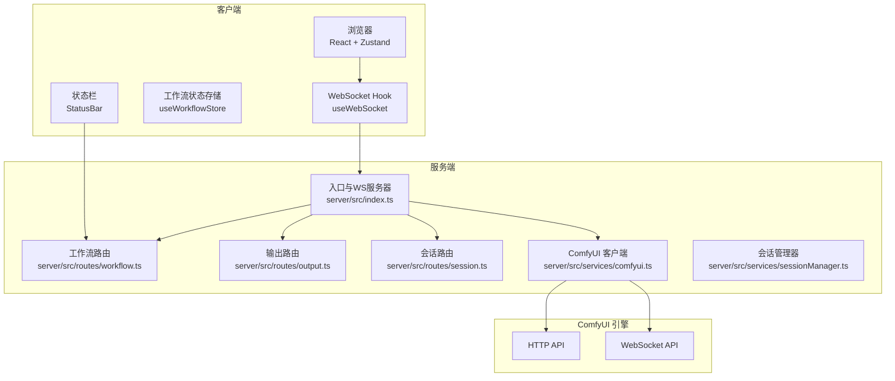
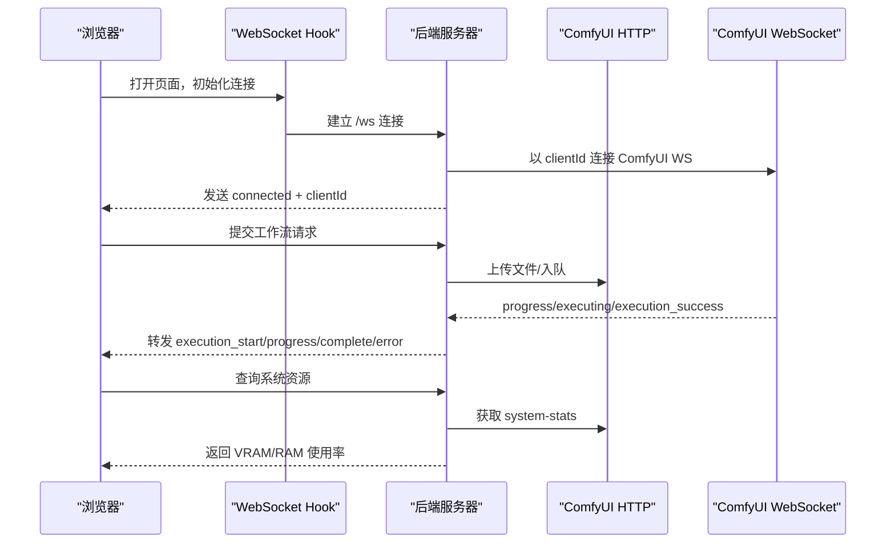
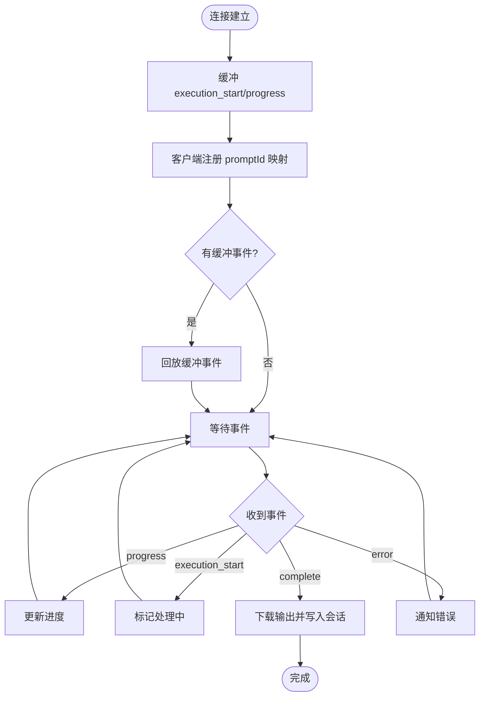
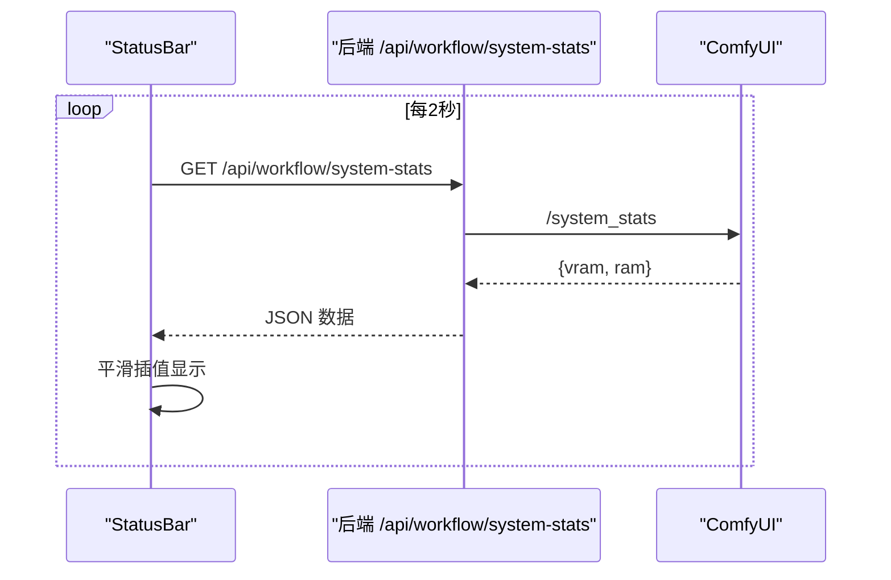
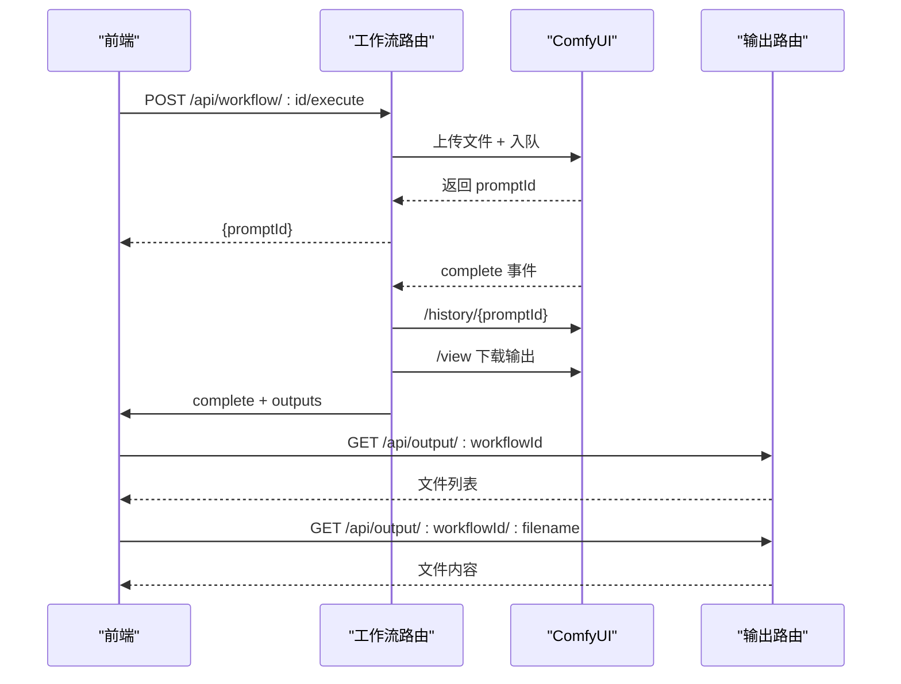
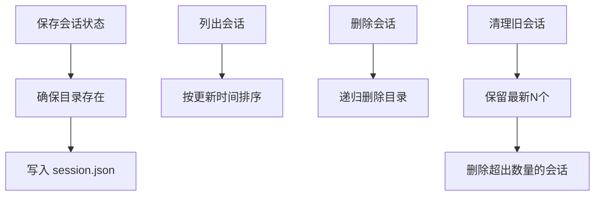
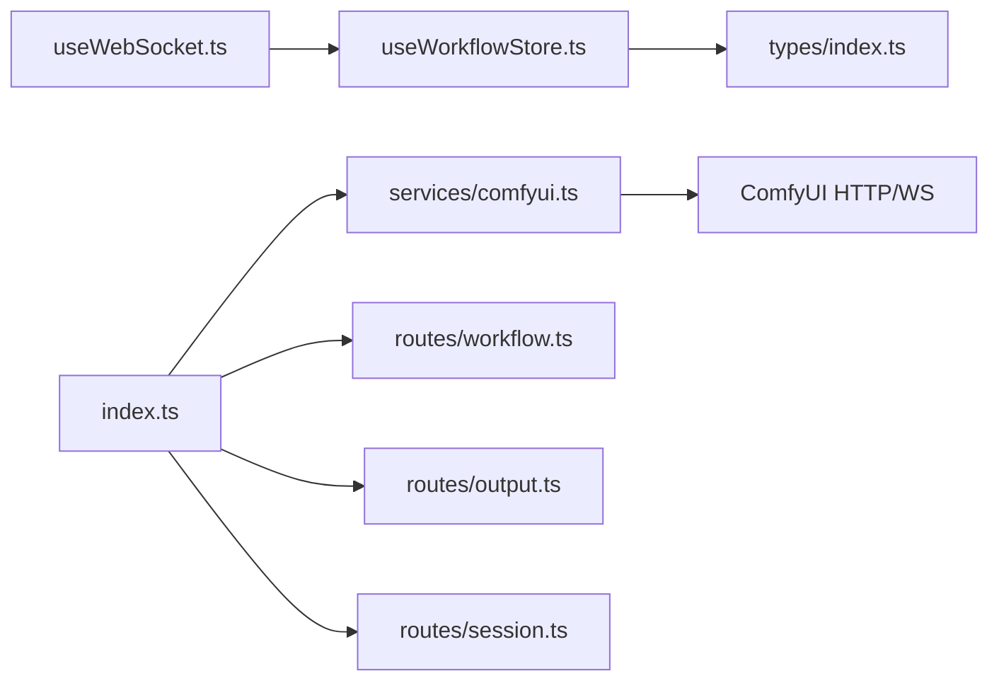

# 监控与日志

<cite>
**本文引用的文件**
- [README.md](file://README.md)
- [server/src/index.ts](file://server/src/index.ts)
- [server/src/services/comfyui.ts](file://server/src/services/comfyui.ts)
- [server/src/routes/workflow.ts](file://server/src/routes/workflow.ts)
- [server/src/routes/output.ts](file://server/src/routes/output.ts)
- [server/src/routes/session.ts](file://server/src/routes/session.ts)
- [server/src/services/sessionManager.ts](file://server/src/services/sessionManager.ts)
- [client/src/hooks/useWebSocket.ts](file://client/src/hooks/useWebSocket.ts)
- [client/src/hooks/useWorkflowStore.ts](file://client/src/hooks/useWorkflowStore.ts)
- [client/src/types/index.ts](file://client/src/types/index.ts)
- [client/src/components/StatusBar.tsx](file://client/src/components/StatusBar.tsx)
- [package.json](file://package.json)
</cite>

## 目录
1. [简介](#简介)
2. [项目结构](#项目结构)
3. [核心组件](#核心组件)
4. [架构总览](#架构总览)
5. [详细组件分析](#详细组件分析)
6. [依赖关系分析](#依赖关系分析)
7. [性能考虑](#性能考虑)
8. [故障排查指南](#故障排查指南)
9. [结论](#结论)
10. [附录](#附录)

## 简介
本指南面向 CorineKit Pix2Real 的运维与开发团队，提供一套完整的监控与日志系统配置方案。内容覆盖：
- 应用监控：健康检查端点、性能指标采集（系统资源）、错误追踪与告警
- 日志系统：前端日志记录、后端日志管理、WebSocket 连接日志、ComfyUI 集成日志
- 实时监控：WebSocket 连接状态、任务执行进度、系统资源使用
- 日志分析与告警：日志聚合、异常检测、性能阈值告警
- 监控仪表盘：Prometheus + Grafana 集成建议
- 日志清理与轮转：会话持久化与输出目录管理
- 用户行为分析与使用统计：基于会话与任务状态的统计思路

## 项目结构
项目采用前后端分离架构：
- 前端：Vite + React + TypeScript，负责 UI、WebSocket 状态管理与任务进度展示
- 后端：Express + TypeScript，负责路由、会话管理、ComfyUI 通信与输出文件服务
- ComfyUI：作为图像/视频处理引擎，通过 HTTP 与 WebSocket 与后端交互

图表来源
- [server/src/index.ts:63-228](file://server/src/index.ts#L63-L228)
- [server/src/routes/workflow.ts:29-862](file://server/src/routes/workflow.ts#L29-L862)
- [server/src/routes/output.ts:13-134](file://server/src/routes/output.ts#L13-L134)
- [server/src/routes/session.ts:18-95](file://server/src/routes/session.ts#L18-L95)
- [server/src/services/comfyui.ts:127-188](file://server/src/services/comfyui.ts#L127-L188)
- [server/src/services/sessionManager.ts:10-164](file://server/src/services/sessionManager.ts#L10-L164)
- [client/src/hooks/useWebSocket.ts:10-99](file://client/src/hooks/useWebSocket.ts#L10-L99)
- [client/src/hooks/useWorkflowStore.ts:35-645](file://client/src/hooks/useWorkflowStore.ts#L35-L645)
- [client/src/components/StatusBar.tsx:69-102](file://client/src/components/StatusBar.tsx#L69-L102)

章节来源
- [README.md:41-79](file://README.md#L41-L79)
- [package.json:4-10](file://package.json#L4-L10)

## 核心组件
- WebSocket 通道与事件分发
  - 后端为每个浏览器客户端建立到 ComfyUI 的独立 WebSocket 连接，并将进度、完成、错误事件转发给前端
  - 前端通过单例 Hook 维护全局连接，自动重连并在消息到达时更新 Zustand 状态
- 路由与服务层
  - 工作流路由：上传文件、拼接模板、入队、查询队列、优先级调整、释放显存、系统资源查询
  - 输出路由：列出/下载输出文件，跨平台打开文件
  - 会话路由：保存/加载输入图片、掩码、任务状态；列出/删除/清理旧会话
- ComfyUI 集成
  - HTTP：上传图片/视频、入队、获取历史、下载输出、查询队列、模型列表、系统资源
  - WebSocket：接收进度、执行开始、完成、错误事件
- 前端状态与 UI
  - Zustand 存储任务状态、进度、输出；StatusBar 定期拉取系统资源并平滑显示

章节来源
- [server/src/index.ts:73-219](file://server/src/index.ts#L73-L219)
- [client/src/hooks/useWebSocket.ts:10-99](file://client/src/hooks/useWebSocket.ts#L10-L99)
- [server/src/services/comfyui.ts:127-188](file://server/src/services/comfyui.ts#L127-L188)
- [server/src/routes/workflow.ts:532-579](file://server/src/routes/workflow.ts#L532-L579)
- [client/src/components/StatusBar.tsx:69-102](file://client/src/components/StatusBar.tsx#L69-L102)

## 架构总览
下图展示了从浏览器到 ComfyUI 的完整链路，以及事件在各层之间的流转。

图表来源
- [server/src/index.ts:73-189](file://server/src/index.ts#L73-L189)
- [server/src/services/comfyui.ts:127-188](file://server/src/services/comfyui.ts#L127-L188)
- [client/src/hooks/useWebSocket.ts:22-51](file://client/src/hooks/useWebSocket.ts#L22-L51)
- [client/src/components/StatusBar.tsx:69-85](file://client/src/components/StatusBar.tsx#L69-L85)

## 详细组件分析

### WebSocket 连接与事件处理
- 后端
  - 为每个客户端生成唯一 clientId 并与 ComfyUI 建立 WS 连接
  - 缓冲最近的 execution_start/progress 事件，用于客户端注册前的事件回放
  - 在 completion 时下载输出并写入会话输出目录，随后向客户端发送 complete
  - 错误时清理缓冲并发送 error
- 前端
  - 单例模式维护全局连接，断线自动重连
  - 根据消息类型更新 Zustand 状态：开始、进度、完成、错误

图表来源
- [server/src/index.ts:83-213](file://server/src/index.ts#L83-L213)
- [client/src/hooks/useWebSocket.ts:26-51](file://client/src/hooks/useWebSocket.ts#L26-L51)
- [client/src/hooks/useWorkflowStore.ts:398-499](file://client/src/hooks/useWorkflowStore.ts#L398-L499)

章节来源
- [server/src/index.ts:73-219](file://server/src/index.ts#L73-L219)
- [client/src/hooks/useWebSocket.ts:10-99](file://client/src/hooks/useWebSocket.ts#L10-L99)
- [client/src/hooks/useWorkflowStore.ts:357-499](file://client/src/hooks/useWorkflowStore.ts#L357-L499)

### 系统资源监控（VRAM/RAM）
- 后端提供 /api/workflow/system-stats 接口，调用 ComfyUI 的 system_stats 获取当前使用率
- 前端 StatusBar 每 2 秒轮询一次，使用 requestAnimationFrame 平滑过渡到目标值

图表来源
- [server/src/routes/workflow.ts:532-540](file://server/src/routes/workflow.ts#L532-L540)
- [server/src/services/comfyui.ts:106-125](file://server/src/services/comfyui.ts#L106-L125)
- [client/src/components/StatusBar.tsx:69-102](file://client/src/components/StatusBar.tsx#L69-L102)

章节来源
- [server/src/routes/workflow.ts:532-540](file://server/src/routes/workflow.ts#L532-L540)
- [server/src/services/comfyui.ts:101-125](file://server/src/services/comfyui.ts#L101-L125)
- [client/src/components/StatusBar.tsx:69-102](file://client/src/components/StatusBar.tsx#L69-L102)

### 任务执行与输出管理
- 工作流路由支持单图/批量执行，上传文件至 ComfyUI，入队后返回 promptId
- 完成回调中，后端根据 promptId 获取历史并下载输出，写入会话输出目录
- 输出路由提供列出与下载接口，支持跨平台打开文件

图表来源
- [server/src/routes/workflow.ts:407-455](file://server/src/routes/workflow.ts#L407-L455)
- [server/src/index.ts:109-175](file://server/src/index.ts#L109-L175)
- [server/src/routes/output.ts:22-73](file://server/src/routes/output.ts#L22-L73)
- [server/src/services/comfyui.ts:62-83](file://server/src/services/comfyui.ts#L62-L83)

章节来源
- [server/src/routes/workflow.ts:407-455](file://server/src/routes/workflow.ts#L407-L455)
- [server/src/index.ts:109-175](file://server/src/index.ts#L109-L175)
- [server/src/routes/output.ts:22-73](file://server/src/routes/output.ts#L22-L73)
- [server/src/services/comfyui.ts:62-83](file://server/src/services/comfyui.ts#L62-L83)

### 会话持久化与清理
- 会话管理器负责：
  - 确保会话目录存在（input/masks/output）
  - 保存输入图片、掩码与任务状态
  - 列出、删除会话，按时间保留最新 N 个会话
- 前端通过路由保存/恢复会话状态，便于离线/刷新后恢复

图表来源
- [server/src/services/sessionManager.ts:10-164](file://server/src/services/sessionManager.ts#L10-L164)
- [server/src/routes/session.ts:18-95](file://server/src/routes/session.ts#L18-L95)

章节来源
- [server/src/services/sessionManager.ts:10-164](file://server/src/services/sessionManager.ts#L10-L164)
- [server/src/routes/session.ts:18-95](file://server/src/routes/session.ts#L18-L95)

## 依赖关系分析
- 组件耦合
  - 后端 WebSocket 服务器与 ComfyUI 客户端紧密耦合，事件处理逻辑集中于一处
  - 前端 Zustand 与 WebSocket Hook 松耦合，通过消息类型解耦
- 外部依赖
  - Express + ws 提供 HTTP 与 WebSocket 服务
  - node-fetch 与 form-data 访问 ComfyUI HTTP API
  - multer 处理文件上传
- 可能的循环依赖
  - 当前结构清晰，无明显循环导入

图表来源
- [client/src/hooks/useWebSocket.ts:1-99](file://client/src/hooks/useWebSocket.ts#L1-L99)
- [client/src/hooks/useWorkflowStore.ts:1-645](file://client/src/hooks/useWorkflowStore.ts#L1-L645)
- [client/src/types/index.ts:1-58](file://client/src/types/index.ts#L1-L58)
- [server/src/index.ts:1-228](file://server/src/index.ts#L1-L228)
- [server/src/services/comfyui.ts:1-285](file://server/src/services/comfyui.ts#L1-L285)
- [server/src/routes/workflow.ts:1-862](file://server/src/routes/workflow.ts#L1-L862)
- [server/src/routes/output.ts:1-134](file://server/src/routes/output.ts#L1-L134)
- [server/src/routes/session.ts:1-95](file://server/src/routes/session.ts#L1-L95)

章节来源
- [server/src/index.ts:1-228](file://server/src/index.ts#L1-L228)
- [client/src/hooks/useWebSocket.ts:1-99](file://client/src/hooks/useWebSocket.ts#L1-L99)
- [client/src/hooks/useWorkflowStore.ts:1-645](file://client/src/hooks/useWorkflowStore.ts#L1-L645)

## 性能考虑
- WebSocket 连接复用
  - 后端为每个客户端维持一条到 ComfyUI 的 WS 连接，避免重复握手
  - 前端单例连接减少资源消耗与延迟
- 事件缓冲与回放
  - 对 execution_start/progress 事件进行缓冲，降低首包丢失风险
- 资源使用率平滑
  - StatusBar 使用插值算法平滑 VRAM/RAM 显示，提升用户体验
- 文件上传与下载
  - 使用内存存储 multer，注意大文件场景下的内存压力；可结合流式处理优化

章节来源
- [server/src/index.ts:83-90](file://server/src/index.ts#L83-L90)
- [client/src/components/StatusBar.tsx:88-102](file://client/src/components/StatusBar.tsx#L88-L102)
- [server/src/routes/workflow.ts:23-27](file://server/src/routes/workflow.ts#L23-L27)

## 故障排查指南
- WebSocket 连接问题
  - 现象：前端反复重连、无进度更新
  - 排查：确认后端 /ws 是否可达、ComfyUI WS 地址是否正确、客户端协议（ws/wss）匹配
  - 参考：后端连接日志与前端连接/断开日志
- 任务完成但无输出
  - 现象：complete 事件到达，但前端未显示输出
  - 排查：检查历史查询与 /view 下载是否成功、会话输出目录权限、文件名编码
  - 参考：后端 completion 回调与输出下载逻辑
- 系统资源不可用
  - 现象：/api/workflow/system-stats 返回 502
  - 排查：确认 ComfyUI HTTP 可达、/system_stats 接口可用
- 会话保存失败
  - 现象：保存状态或上传图片/掩码报错
  - 排查：检查 sessionsBase 目录权限、磁盘空间、路径安全（Windows 不允许冒号）

章节来源
- [server/src/index.ts:109-175](file://server/src/index.ts#L109-L175)
- [server/src/routes/workflow.ts:532-540](file://server/src/routes/workflow.ts#L532-L540)
- [server/src/services/sessionManager.ts:10-164](file://server/src/services/sessionManager.ts#L10-L164)

## 结论
本项目已具备完善的实时监控基础：WebSocket 事件驱动的任务进度、ComfyUI 系统资源查询、会话持久化与输出管理。建议在此基础上引入统一的日志与监控体系，实现日志聚合、异常检测与性能告警，进一步提升可观测性与可维护性。

## 附录

### 监控与日志配置清单（建议）
- 健康检查端点
  - 后端：/api/workflow/system-stats（已实现）
  - ComfyUI：/system_stats（已通过后端代理）
- 性能指标收集
  - VRAM/RAM 使用率：/api/workflow/system-stats
  - 队列长度与等待时间：/api/workflow/queue
  - 建议：扩展后端暴露更多指标（如队列耗时、任务成功率）
- 错误追踪
  - 后端：所有路由与服务层的 try/catch 均应记录错误日志
  - 前端：WebSocket 连接错误、消息解析失败、状态更新异常
- 日志系统
  - 前端：控制台日志（开发环境），生产环境建议接入轻量日志 SDK
  - 后端：统一使用日志库（如 pino/winston），输出到 stdout/stderr
  - ComfyUI：通过后端日志记录 HTTP/WS 请求与响应
- 实时监控
  - WebSocket：连接状态、消息速率、丢包率
  - 任务：排队时长、处理时长、失败率
  - 资源：VRAM/RAM 峰值、持续高占用时段
- 日志分析与告警
  - 日志聚合：ELK/EFK 或 Loki + Promtail
  - 异常检测：基于错误模式与异常堆栈
  - 性能阈值：队列长度、处理时长、资源使用率
- 监控仪表盘（Prometheus + Grafana）
  - 指标采集：后端暴露自定义指标（如队列长度、任务耗时、错误计数）
  - 仪表盘：连接数、任务吞吐、资源使用、错误率
- 日志清理与轮转
  - 会话输出：定期清理旧会话目录，保留最近 N 份
  - ComfyUI 临时文件：rp_temp、pa_temp 等目录定期清理
- 用户行为分析与使用统计
  - 基于会话与任务状态统计：活跃用户、常用工作流、平均处理时长、失败率
  - 前端埋点：点击热区、功能使用频率、页面停留时长（建议）