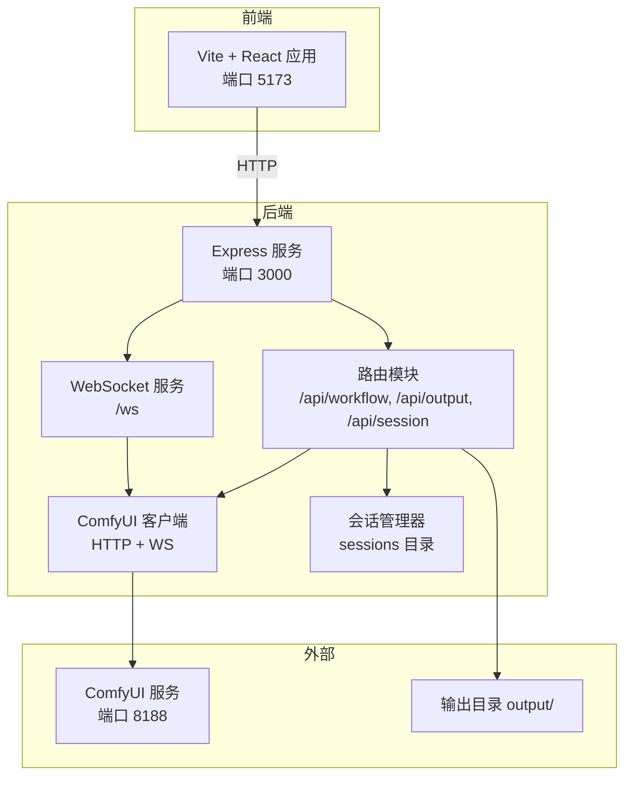
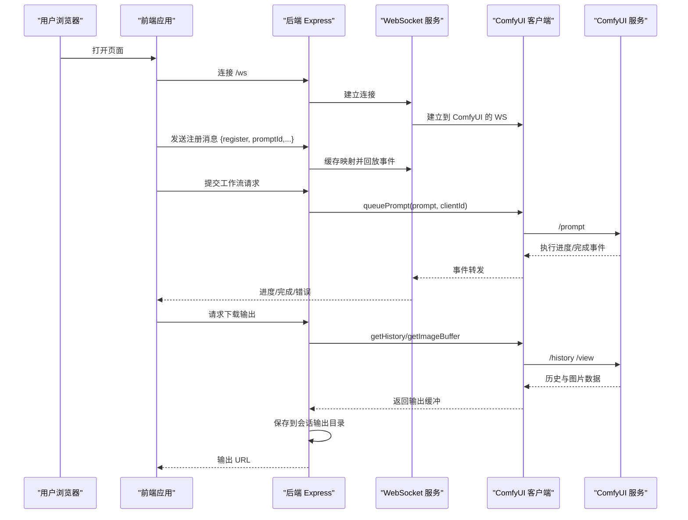
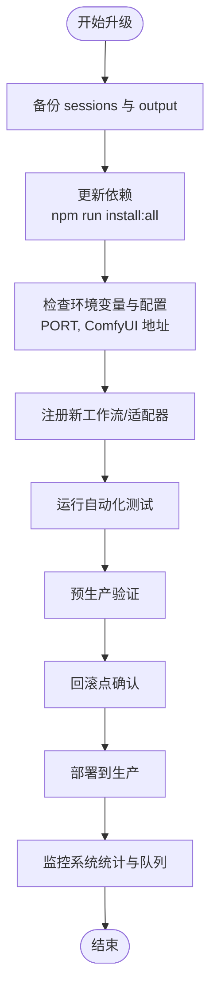
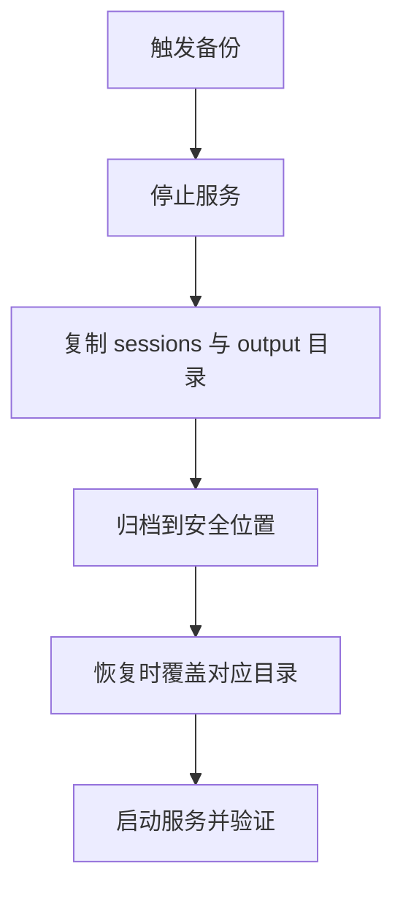
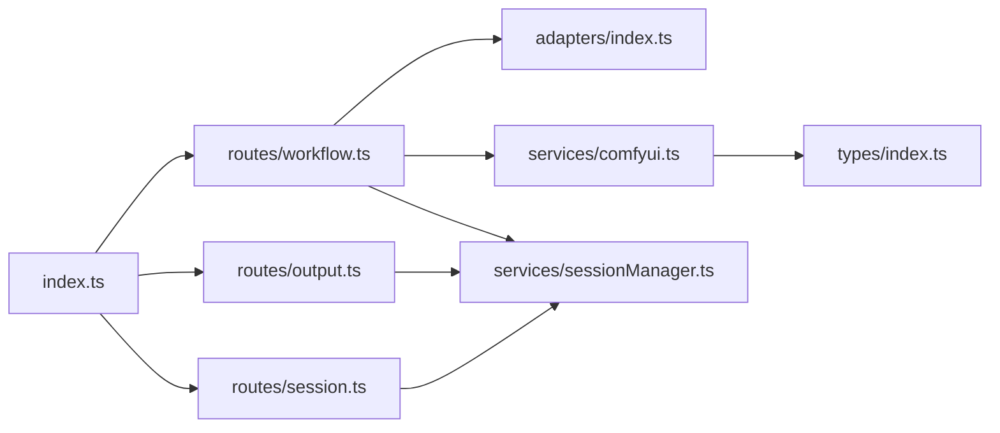

# 维护与更新

<cite>
**本文引用的文件**
- [README.md](file://README.md)
- [package.json](file://package.json)
- [server/package.json](file://server/package.json)
- [client/package.json](file://client/package.json)
- [start.bat](file://start.bat)
- [stop.bat](file://stop.bat)
- [debug.bat](file://debug.bat)
- [server/src/index.ts](file://server/src/index.ts)
- [server/src/services/comfyui.ts](file://server/src/services/comfyui.ts)
- [server/src/services/sessionManager.ts](file://server/src/services/sessionManager.ts)
- [server/src/routes/workflow.ts](file://server/src/routes/workflow.ts)
- [server/src/routes/output.ts](file://server/src/routes/output.ts)
- [server/src/routes/session.ts](file://server/src/routes/session.ts)
- [server/src/adapters/index.ts](file://server/src/adapters/index.ts)
- [server/src/types/index.ts](file://server/src/types/index.ts)
</cite>

## 目录
1. [简介](#简介)
2. [项目结构](#项目结构)
3. [核心组件](#核心组件)
4. [架构总览](#架构总览)
5. [详细组件分析](#详细组件分析)
6. [依赖关系分析](#依赖关系分析)
7. [性能注意事项](#性能注意事项)
8. [故障排查指南](#故障排查指南)
9. [结论](#结论)
10. [附录](#附录)

## 简介
本指南面向维护者与运维人员，围绕 CorineKit Pix2Real 的日常维护与版本升级，提供系统健康检查、日志与临时文件清理、缓存与会话清理、版本升级流程、配置变更管理、数据备份与恢复、紧急修复与回滚、维护窗口规划与最小化影响部署策略，以及自动化运维工具（CI/CD、自动化测试、部署脚本）的配置与使用建议。文档基于仓库现有实现进行说明，并给出可操作的维护步骤与可视化图示。

## 项目结构
项目采用前后端分离架构：前端为 Vite + React + TypeScript；后端为 Express + TypeScript；通过 WebSocket 与 ComfyUI 实时通信；输出文件与会话数据分别存储在 output 与 sessions 目录中；启动脚本负责端口占用检测与服务编排。

图表来源
- [server/src/index.ts:42-61](file://server/src/index.ts#L42-L61)
- [server/src/index.ts:62-219](file://server/src/index.ts#L62-L219)
- [server/src/routes/workflow.ts:1-27](file://server/src/routes/workflow.ts#L1-L27)
- [server/src/routes/output.ts:8-11](file://server/src/routes/output.ts#L8-L11)
- [server/src/services/comfyui.ts:6-7](file://server/src/services/comfyui.ts#L6-L7)

章节来源
- [README.md:41-79](file://README.md#L41-L79)
- [package.json:4-9](file://package.json#L4-L9)
- [server/src/index.ts:14-40](file://server/src/index.ts#L14-L40)

## 核心组件
- 后端主进程：初始化 Express、CORS、静态资源、WebSocket、路由挂载与输出目录准备。
- 路由层：工作流执行、队列与系统状态查询、输出文件访问、会话读写。
- 服务层：
  - ComfyUI 客户端：上传图像/视频、入队、历史查询、进度事件转发、系统统计与内存释放。
  - 会话管理器：会话目录与输入/掩码/输出文件保存、会话状态持久化、会话列表与清理。
- 前端：React 应用，通过 WebSocket 接收进度与完成事件，调用后端 API 执行工作流与打开输出文件夹。

章节来源
- [server/src/index.ts:14-61](file://server/src/index.ts#L14-L61)
- [server/src/routes/workflow.ts:29-38](file://server/src/routes/workflow.ts#L29-L38)
- [server/src/routes/output.ts:22-53](file://server/src/routes/output.ts#L22-L53)
- [server/src/routes/session.ts:18-33](file://server/src/routes/session.ts#L18-L33)
- [server/src/services/comfyui.ts:9-25](file://server/src/services/comfyui.ts#L9-L25)
- [server/src/services/sessionManager.ts:20-44](file://server/src/services/sessionManager.ts#L20-L44)

## 架构总览
后端通过 WebSocket 与 ComfyUI 建立连接，实时转发进度事件；前端通过 WebSocket 获取进度；工作流执行通过路由层调用 ComfyUI 客户端；输出文件与会话数据分别由静态服务与会话管理器提供。

图表来源
- [server/src/index.ts:73-219](file://server/src/index.ts#L73-L219)
- [server/src/services/comfyui.ts:47-83](file://server/src/services/comfyui.ts#L47-L83)
- [server/src/routes/workflow.ts:408-455](file://server/src/routes/workflow.ts#L408-L455)

## 详细组件分析

### 日常维护任务
- 系统健康检查
  - 端口占用与服务状态：启动脚本会检测 3000/5173 端口占用并尝试释放；停止脚本用于关闭对应进程。
  - ComfyUI 可达性：后端提供系统统计与队列查询接口，用于监控资源与排队情况。
- 日志清理
  - 后端无内置日志文件记录；若需日志，建议通过启动脚本重定向或容器日志采集。
- 临时文件清理
  - 反推提示词与提示词助理中间文件位于 rp_temp 与 pa_temp 目录，可在维护时清理。
- 缓存清理
  - 会话输出文件与输入/掩码文件由会话管理器统一管理，支持按会话删除与定期裁剪。

章节来源
- [start.bat:10-32](file://start.bat#L10-L32)
- [stop.bat:12-27](file://stop.bat#L12-L27)
- [server/src/routes/workflow.ts:698-704](file://server/src/routes/workflow.ts#L698-L704)
- [server/src/routes/workflow.ts:764-770](file://server/src/routes/workflow.ts#L764-L770)
- [server/src/services/sessionManager.ts:150-163](file://server/src/services/sessionManager.ts#L150-L163)

### 版本升级流程
- 依赖更新
  - 前端与后端分别维护 package.json，使用 npm run install:all 一次性安装所有依赖。
  - 升级前先备份 sessions 与 output 目录，避免因路径或命名变化导致的数据丢失。
- 配置迁移
  - 环境变量：后端监听 PORT（默认 3000），可通过环境变量覆盖；ComfyUI 地址硬编码于服务层，如需变更需修改源码并重新构建。
  - 路由与适配器：新增工作流需在适配器索引与路由中注册；确保输出目录映射与模板路径正确。
- 数据库结构变更
  - 本项目不使用传统数据库；会话状态为 JSON 文件，字段变更需评估兼容性并提供迁移脚本。
- API 兼容性检查
  - 新增路由或变更请求/响应格式时，需同步更新前端调用与类型定义；对向后兼容的变更可先添加新接口再逐步替换。

图表来源
- [package.json:9](file://package.json#L9)
- [server/src/index.ts:221-227](file://server/src/index.ts#L221-L227)
- [server/src/adapters/index.ts:13-28](file://server/src/adapters/index.ts#L13-L28)
- [server/src/routes/workflow.ts:29-38](file://server/src/routes/workflow.ts#L29-L38)

章节来源
- [package.json:4-9](file://package.json#L4-L9)
- [server/src/index.ts:221-227](file://server/src/index.ts#L221-L227)
- [server/src/adapters/index.ts:13-28](file://server/src/adapters/index.ts#L13-L28)
- [server/src/routes/workflow.ts:29-38](file://server/src/routes/workflow.ts#L29-L38)

### 配置变更管理
- 环境变量更新
  - PORT：后端监听端口；建议在启动脚本或容器环境中设置。
- 配置文件修改
  - ComfyUI 地址：服务层硬编码，如需动态配置需改造为环境变量并注入。
  - 工作流模板路径：路由层读取固定路径的 JSON 模板，变更模板需同步更新节点键位映射。
- 服务重启策略
  - 使用 stop.bat 停止旧服务，再用 start.bat 或 debug.bat 启动新版本；或使用容器编排进行滚动更新。

章节来源
- [server/src/index.ts:221-227](file://server/src/index.ts#L221-L227)
- [server/src/services/comfyui.ts:6-7](file://server/src/services/comfyui.ts#L6-L7)
- [server/src/routes/workflow.ts:13-21](file://server/src/routes/workflow.ts#L13-L21)
- [stop.bat:12-27](file://stop.bat#L12-L27)
- [start.bat:35-48](file://start.bat#L35-L48)

### 数据备份与恢复策略
- 会话数据备份
  - sessions 目录包含每个会话的输入、掩码、输出与状态 JSON；定期归档该目录即可。
- 输出文件备份
  - output 目录按工作流分类存放；可按目录整体备份。
- 配置备份
  - 本项目无集中式配置文件；如需备份，建议导出当前使用的 ComfyUI 模板与自定义参数。
- 恢复流程
  - 停止服务后，将备份的 sessions 与 output 目录覆盖到对应位置；启动服务后验证输出与会话状态。

图表来源
- [server/src/services/sessionManager.ts:130-148](file://server/src/services/sessionManager.ts#L130-L148)
- [server/src/index.ts:17-40](file://server/src/index.ts#L17-L40)

章节来源
- [server/src/services/sessionManager.ts:130-148](file://server/src/services/sessionManager.ts#L130-L148)
- [server/src/index.ts:17-40](file://server/src/index.ts#L17-L40)

### 补丁发布与紧急修复
- 热修复部署
  - 对于仅前端或仅后端的小改动，可单独构建并替换对应产物；或使用容器镜像滚动更新。
- 回滚策略
  - 保留上一版本的构建产物与完整备份；回滚时恢复 sessions、output 与对应版本的二进制。
- 紧急停机措施
  - 使用 stop.bat 关闭服务；必要时通过系统防火墙或负载均衡器摘除实例。

章节来源
- [stop.bat:12-27](file://stop.bat#L12-L27)
- [package.json:8](file://package.json#L8)

### 维护窗口规划与最小化影响部署
- 维护窗口选择
  - 业务低峰时段执行升级；优先在非高峰工作日进行。
- 部署策略
  - 蓝绿部署：准备两套环境，切换流量后回滚；或使用滚动更新逐步替换实例。
  - 分批发布：先在小范围实例上验证，再扩大范围。
- 最小化影响
  - 预热：升级前预热 ComfyUI 与模型加载；减少首次请求延迟。
  - 平滑切换：使用反向代理或负载均衡器进行切换，避免直接中断连接。

### 自动化运维工具配置与使用
- CI/CD 流水线
  - 建议在流水线中包含安装依赖、构建前端与后端、运行测试、打包产物与发布镜像等阶段。
- 自动化测试
  - 在路由层与服务层增加单元测试，覆盖工作流执行、队列操作、系统统计与会话管理。
- 部署脚本
  - 使用 start.bat/stop.bat/stop.bat 作为参考，结合容器编排工具（如 Docker Compose/Kubernetes）实现自动化部署与回滚。

章节来源
- [package.json:4-9](file://package.json#L4-L9)
- [client/package.json:6-10](file://client/package.json#L6-L10)
- [server/package.json:6-9](file://server/package.json#L6-L9)
- [start.bat:35-57](file://start.bat#L35-L57)
- [stop.bat:12-37](file://stop.bat#L12-L37)
- [debug.bat:36-57](file://debug.bat#L36-L57)

## 依赖关系分析
后端主进程依赖路由、服务与类型定义；路由层依赖适配器与服务层；服务层依赖 ComfyUI 客户端与会话管理器；前端通过 WebSocket 与后端交互。

图表来源
- [server/src/index.ts:8-12](file://server/src/index.ts#L8-L12)
- [server/src/routes/workflow.ts:7-10](file://server/src/routes/workflow.ts#L7-L10)
- [server/src/routes/output.ts:6](file://server/src/routes/output.ts#L6)
- [server/src/routes/session.ts:13](file://server/src/routes/session.ts#L13)
- [server/src/adapters/index.ts:1-31](file://server/src/adapters/index.ts#L1-L31)
- [server/src/services/comfyui.ts:1-4](file://server/src/services/comfyui.ts#L1-L4)
- [server/src/services/sessionManager.ts:1-6](file://server/src/services/sessionManager.ts#L1-L6)
- [server/src/types/index.ts:1-8](file://server/src/types/index.ts#L1-L8)

章节来源
- [server/src/index.ts:8-12](file://server/src/index.ts#L8-L12)
- [server/src/routes/workflow.ts:7-10](file://server/src/routes/workflow.ts#L7-L10)
- [server/src/routes/output.ts:6](file://server/src/routes/output.ts#L6)
- [server/src/routes/session.ts:13](file://server/src/routes/session.ts#L13)
- [server/src/adapters/index.ts:1-31](file://server/src/adapters/index.ts#L1-L31)
- [server/src/services/comfyui.ts:1-4](file://server/src/services/comfyui.ts#L1-L4)
- [server/src/services/sessionManager.ts:1-6](file://server/src/services/sessionManager.ts#L1-L6)
- [server/src/types/index.ts:1-8](file://server/src/types/index.ts#L1-L8)

## 性能注意事项
- 资源监控：通过系统统计接口获取 VRAM 与 RAM 使用率，结合队列长度判断并发压力。
- 内存释放：提供释放内存的工作流，便于在长时间运行后回收显存与内存。
- 大文件处理：后端对 JSON 与上传大小有明确限制，注意控制批量大小与单次请求体积。
- WebSocket 事件缓冲：在客户端注册前可能错过部分事件，服务端已实现事件缓冲与重放机制。

章节来源
- [server/src/routes/workflow.ts:532-540](file://server/src/routes/workflow.ts#L532-L540)
- [server/src/routes/workflow.ts:542-559](file://server/src/routes/workflow.ts#L542-L559)
- [server/src/index.ts:51](file://server/src/index.ts#L51)
- [server/src/index.ts:83-90](file://server/src/index.ts#L83-L90)

## 故障排查指南
- 启动失败
  - 检查端口占用并使用 stop.bat 清理；确认 ComfyUI 是否在 8188 端口可用。
- WebSocket 不通
  - 查看连接日志与事件缓冲逻辑；确认客户端是否发送了注册消息。
- 输出缺失
  - 检查 ComfyUI 历史与视图接口是否返回数据；确认会话输出目录权限与路径。
- 队列异常
  - 使用队列查询与优先级调整接口；必要时删除特定队列项。

章节来源
- [start.bat:10-32](file://start.bat#L10-L32)
- [stop.bat:12-27](file://stop.bat#L12-L27)
- [server/src/index.ts:73-219](file://server/src/index.ts#L73-L219)
- [server/src/services/comfyui.ts:62-83](file://server/src/services/comfyui.ts#L62-L83)
- [server/src/routes/workflow.ts:561-579](file://server/src/routes/workflow.ts#L561-L579)

## 结论
本指南基于现有代码实现了从日常维护到版本升级、配置变更、数据保护与应急响应的全链路操作建议。建议在生产环境中引入自动化测试与 CI/CD，配合蓝绿/滚动部署策略，最小化升级对用户的影响，并建立完善的备份与回滚机制。

## 附录
- 启动/停止/调试脚本用途
  - start.bat：检测端口、启动前后端、打开浏览器。
  - stop.bat：查找并终止占用端口的进程。
  - debug.bat：以保留窗口方式启动服务，便于调试。

章节来源
- [start.bat:35-57](file://start.bat#L35-L57)
- [stop.bat:12-37](file://stop.bat#L12-L37)
- [debug.bat:36-57](file://debug.bat#L36-L57)