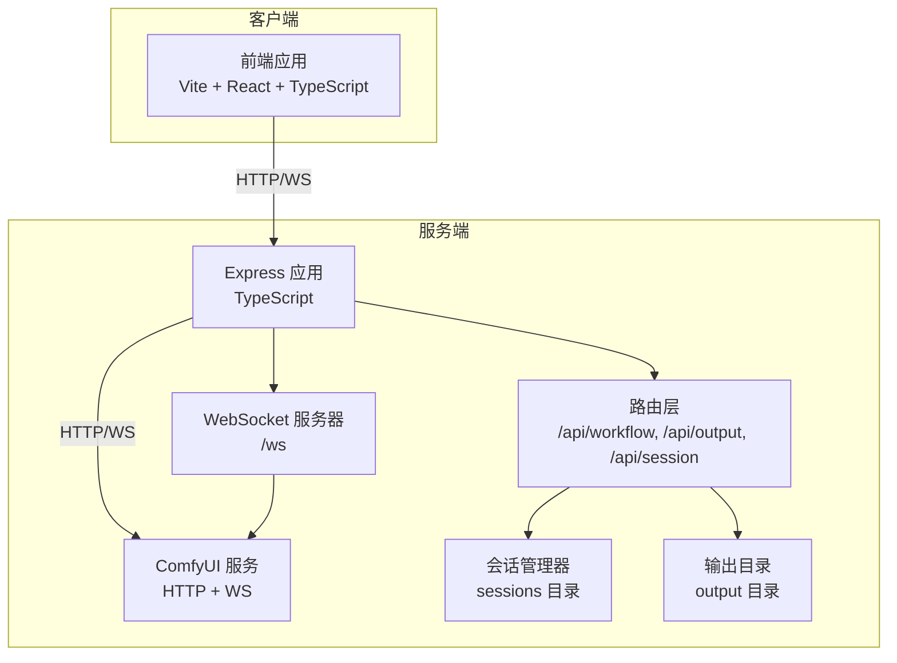
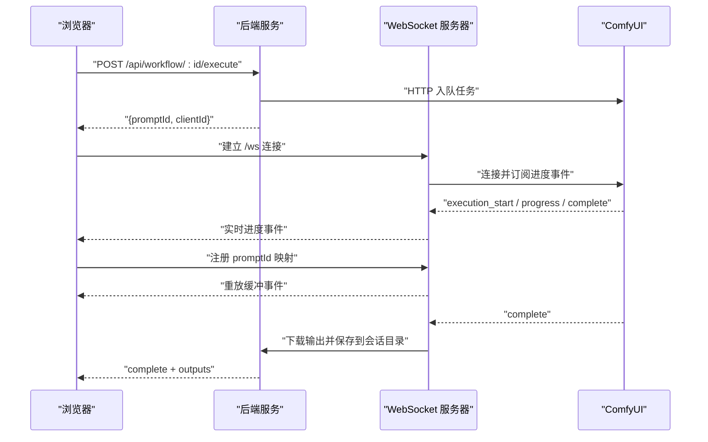
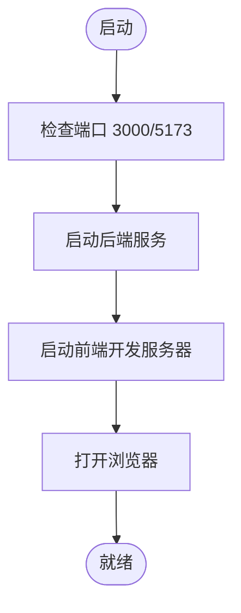
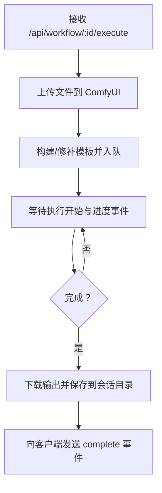
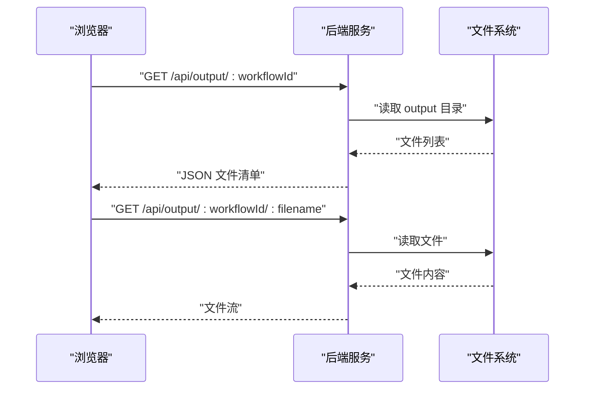
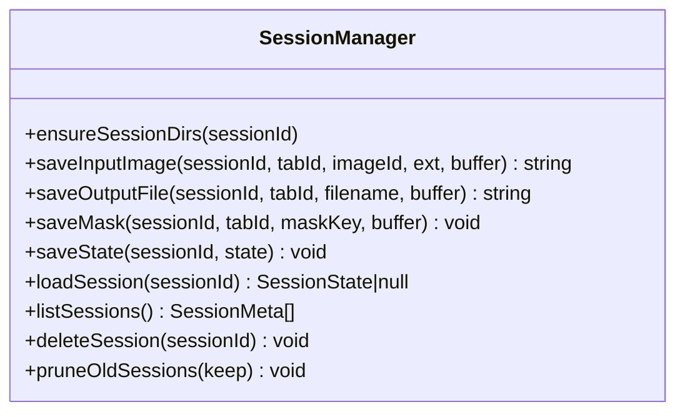
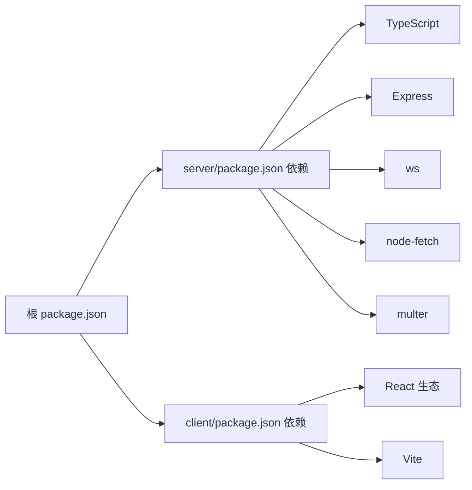

# 部署与运维

<cite>
**本文引用的文件**
- [README.md](file://README.md)
- [package.json](file://package.json)
- [server/package.json](file://server/package.json)
- [client/package.json](file://client/package.json)
- [server/src/index.ts](file://server/src/index.ts)
- [server/src/services/comfyui.ts](file://server/src/services/comfyui.ts)
- [server/src/services/sessionManager.ts](file://server/src/services/sessionManager.ts)
- [server/src/routes/workflow.ts](file://server/src/routes/workflow.ts)
- [server/src/routes/output.ts](file://server/src/routes/output.ts)
- [server/src/routes/session.ts](file://server/src/routes/session.ts)
- [start.bat](file://start.bat)
- [stop.bat](file://stop.bat)
- [debug.bat](file://debug.bat)
</cite>

## 目录
1. [简介](#简介)
2. [项目结构](#项目结构)
3. [核心组件](#核心组件)
4. [架构总览](#架构总览)
5. [详细组件分析](#详细组件分析)
6. [依赖关系分析](#依赖关系分析)
7. [性能考虑](#性能考虑)
8. [故障排除指南](#故障排除指南)
9. [结论](#结论)
10. [附录](#附录)

## 简介
本指南面向生产环境部署与运维，围绕 CorineKit Pix2Real 的后端服务（Express + TypeScript）、前端界面（Vite + React + TypeScript）以及与 ComfyUI 的集成进行说明。内容涵盖环境准备、依赖安装、服务启动与停止、性能优化、监控与日志、维护与更新、故障排除及安全最佳实践。

## 项目结构
- 后端服务：基于 Express + TypeScript，提供工作流执行、输出管理、会话持久化、WebSocket 进度转发等功能。
- 前端界面：基于 Vite + React + TypeScript，负责用户交互、实时进度展示、文件上传与下载。
- ComfyUI 集成：通过 HTTP 与 WebSocket 与本地 ComfyUI 通信，实现任务排队、进度事件转发、输出下载与保存。
- 输出目录：静态输出目录与会话目录分离，便于文件访问与清理。
- 批量与多工作流：支持单图与批量处理，内置多个工作流模板，部分工作流支持模型切换与参数定制。

**图表来源**
- [server/src/index.ts:42-63](file://server/src/index.ts#L42-L63)
- [server/src/routes/workflow.ts:1-38](file://server/src/routes/workflow.ts#L1-L38)
- [server/src/routes/output.ts:1-21](file://server/src/routes/output.ts#L1-L21)
- [server/src/routes/session.ts:1-16](file://server/src/routes/session.ts#L1-L16)
- [server/src/services/comfyui.ts:1-10](file://server/src/services/comfyui.ts#L1-L10)

**章节来源**
- [README.md:41-62](file://README.md#L41-L62)
- [server/src/index.ts:14-41](file://server/src/index.ts#L14-L41)

## 核心组件
- 服务入口与静态资源
  - 启动端口、CORS、JSON 请求体大小限制、静态输出与会话文件服务、WebSocket 路由。
- 工作流路由
  - 支持多工作流执行、批量处理、队列查询与优先级调整、系统统计、释放显存、导出混合结果、提示词反推与提示词助理。
- 输出路由
  - 列表与下载输出文件，跨平台打开文件与文件夹。
- 会话路由
  - 输入图片、遮罩、状态保存与加载、会话列表与清理。
- ComfyUI 服务
  - 图像/视频上传、任务入队、历史查询、进度事件、系统统计、队列优先级调整。
- 会话管理
  - 会话目录结构、输入/输出/遮罩保存、会话状态序列化与清理。

**章节来源**
- [server/src/index.ts:42-63](file://server/src/index.ts#L42-L63)
- [server/src/routes/workflow.ts:1-38](file://server/src/routes/workflow.ts#L1-L38)
- [server/src/routes/output.ts:1-21](file://server/src/routes/output.ts#L1-L21)
- [server/src/routes/session.ts:1-16](file://server/src/routes/session.ts#L1-L16)
- [server/src/services/comfyui.ts:1-10](file://server/src/services/comfyui.ts#L1-L10)
- [server/src/services/sessionManager.ts:1-16](file://server/src/services/sessionManager.ts#L1-L16)

## 架构总览
后端采用“HTTP + WebSocket”双通道模式：
- HTTP 负责请求处理、文件上传与下载、会话管理、工作流执行与队列控制。
- WebSocket 将 ComfyUI 的进度事件实时转发至浏览器，支持事件缓冲与重放。

**图表来源**
- [server/src/index.ts:73-219](file://server/src/index.ts#L73-L219)
- [server/src/services/comfyui.ts:127-188](file://server/src/services/comfyui.ts#L127-L188)
- [server/src/routes/workflow.ts:408-455](file://server/src/routes/workflow.ts#L408-L455)

**章节来源**
- [server/src/index.ts:63-219](file://server/src/index.ts#L63-L219)
- [server/src/services/comfyui.ts:127-188](file://server/src/services/comfyui.ts#L127-L188)

## 详细组件分析

### 组件一：服务启动与生命周期
- 端口与静态资源
  - HTTP 端口默认 3000；静态输出目录与会话目录挂载。
- CORS 与请求体大小
  - 仅允许本地开发源，JSON 体大小限制为 50MB。
- WebSocket
  - 单实例连接，客户端首次连接即分配唯一 clientId，并缓冲最近的 execution_start/progress 事件以避免漏掉首卡进度。
- 日志
  - 控制台输出连接、完成、错误与事件缓冲等信息。

**图表来源**
- [start.bat:10-48](file://start.bat#L10-L48)
- [server/src/index.ts:221-227](file://server/src/index.ts#L221-L227)

**章节来源**
- [server/src/index.ts:42-63](file://server/src/index.ts#L42-L63)
- [server/src/index.ts:221-227](file://server/src/index.ts#L221-L227)
- [start.bat:1-57](file://start.bat#L1-L57)

### 组件二：工作流执行与队列管理
- 多工作流支持
  - 通用执行接口支持单图与批量处理；特定工作流支持模型选择、参数定制与专用模板。
- 文件上传
  - 使用内存存储，支持图像与视频上传；批量上传最多 50 张。
- 队列控制
  - 查询队列、取消队列项、优先级调整（将目标项置前并重新入队）。
- 系统统计
  - 获取 ComfyUI 的 VRAM 与 RAM 使用率，用于监控与调度决策。
- 释放显存
  - 通过专用工作流模板触发显存回收。

**图表来源**
- [server/src/routes/workflow.ts:408-455](file://server/src/routes/workflow.ts#L408-L455)
- [server/src/services/comfyui.ts:47-60](file://server/src/services/comfyui.ts#L47-L60)
- [server/src/index.ts:109-175](file://server/src/index.ts#L109-L175)

**章节来源**
- [server/src/routes/workflow.ts:408-520](file://server/src/routes/workflow.ts#L408-L520)
- [server/src/services/comfyui.ts:202-221](file://server/src/services/comfyui.ts#L202-L221)
- [server/src/services/comfyui.ts:522-579](file://server/src/services/comfyui.ts#L522-L579)

### 组件三：输出与文件管理
- 输出列表与下载
  - 按工作流 ID 列出输出文件，支持按文件名下载。
- 打开文件与文件夹
  - 跨平台打开文件或输出目录；支持会话文件路径解析。
- 会话文件
  - 输入图片、遮罩与输出文件统一保存在 sessions 目录下，便于持久化与清理。

**图表来源**
- [server/src/routes/output.ts:22-73](file://server/src/routes/output.ts#L22-L73)
- [server/src/routes/output.ts:75-131](file://server/src/routes/output.ts#L75-L131)

**章节来源**
- [server/src/routes/output.ts:1-134](file://server/src/routes/output.ts#L1-L134)
- [server/src/services/sessionManager.ts:20-57](file://server/src/services/sessionManager.ts#L20-L57)

### 组件四：会话管理
- 目录结构
  - 每个会话包含多个标签页，每个标签页含 input、masks、output 三个子目录。
- 数据持久化
  - 保存输入图片、遮罩与会话状态 JSON；支持加载、列出、删除与裁剪旧会话。
- 清理策略
  - 可按数量保留最新会话，其余删除。

**图表来源**
- [server/src/services/sessionManager.ts:1-164](file://server/src/services/sessionManager.ts#L1-L164)

**章节来源**
- [server/src/services/sessionManager.ts:1-164](file://server/src/services/sessionManager.ts#L1-L164)
- [server/src/routes/session.ts:1-95](file://server/src/routes/session.ts#L1-L95)

## 依赖关系分析
- 后端依赖
  - Express、CORS、Multer、node-fetch、ws、TypeScript 编译与运行时。
- 前端依赖
  - React、React DOM、Vite、TypeScript、Lucide React、Zustand。
- 开发工具
  - concurrently 并行启动前后端、tsx 热重载、vite 预览。

**图表来源**
- [package.json:1-15](file://package.json#L1-L15)
- [server/package.json:1-28](file://server/package.json#L1-L28)
- [client/package.json:1-25](file://client/package.json#L1-L25)

**章节来源**
- [package.json:1-15](file://package.json#L1-L15)
- [server/package.json:1-28](file://server/package.json#L1-L28)
- [client/package.json:1-25](file://client/package.json#L1-L25)

## 性能考虑
- 内存使用优化
  - 合理设置请求体大小上限，避免大体积上传导致内存峰值过高。
  - 使用内存存储上传文件时注意并发与队列长度，必要时限制批量大小。
  - 定期调用释放显存接口，降低长时运行的显存占用。
- 并发处理优化
  - 后端对每个客户端维持一个 ComfyUI WebSocket 连接，避免重复连接带来的额外开销。
  - 对于批量任务，建议分批提交并结合队列优先级调整，确保关键任务优先完成。
- 缓存策略
  - 输出文件可直接通过静态服务提供，减少后端 IO 压力。
  - 会话状态 JSON 仅在需要时读写，避免频繁磁盘 IO。
- 监控与指标
  - 定期拉取系统统计（VRAM/内存），结合任务队列长度与完成时间评估吞吐。
  - 记录关键事件（连接、完成、错误）以便定位瓶颈。

[本节为通用性能建议，无需具体文件引用]

## 故障排除指南
- 无法连接 ComfyUI
  - 确认 ComfyUI 在本地 8188 端口运行；后端通过固定地址访问，若更改请同步修改。
  - 检查网络策略与防火墙是否放行本地回环。
- 端口冲突
  - 启动前自动检测并释放 3000/5173 端口；如仍失败，手动结束占用进程。
- 上传失败或超时
  - 检查请求体大小限制与网络带宽；对大文件建议分批上传。
- 进度不显示或延迟
  - 确保 WebSocket 正常连接；客户端需先注册 promptId 映射，否则可能错过早期事件。
- 输出缺失
  - 确认 ComfyUI 输出类型为 output；后端仅下载类型为 output 的图像与视频。
- 会话文件无法打开
  - 确认路径解析正确，Windows 下注意冒号替换规则。

**章节来源**
- [server/src/services/comfyui.ts:6-7](file://server/src/services/comfyui.ts#L6-L7)
- [start.bat:10-32](file://start.bat#L10-L32)
- [server/src/index.ts:73-219](file://server/src/index.ts#L73-L219)
- [server/src/index.ts:112-152](file://server/src/index.ts#L112-L152)
- [server/src/routes/output.ts:84-104](file://server/src/routes/output.ts#L84-L104)

## 结论
本指南提供了从环境准备、安装部署、服务启停到性能优化、监控运维、故障排除与安全实践的完整路径。生产环境中建议：
- 固定后端端口与静态资源路径，启用 HTTPS 与访问控制；
- 配置反向代理与负载均衡，合理划分队列与并发；
- 建立完善的日志与告警体系，定期清理输出与会话；
- 对敏感参数与路径进行最小权限配置，避免暴露内部细节。

[本节为总结性内容，无需具体文件引用]

## 附录

### A. 生产环境部署清单
- 系统要求
  - Node.js 18+；ComfyUI 本地运行（默认 8188）。
- 环境变量
  - 可通过环境变量覆盖端口等配置（后端监听环境端口）。
- 依赖安装
  - 根目录执行安装脚本，分别安装前后端依赖。
- 服务启动
  - 使用启动脚本或手动启动后端与前端；确认端口开放。
- 服务停止
  - 使用停止脚本释放占用端口。

**章节来源**
- [README.md:16-21](file://README.md#L16-L21)
- [package.json:4-10](file://package.json#L4-L10)
- [start.bat:1-57](file://start.bat#L1-L57)
- [stop.bat:1-37](file://stop.bat#L1-L37)
- [server/src/index.ts:221-227](file://server/src/index.ts#L221-L227)

### B. 监控与日志配置
- 控制台日志
  - 连接、完成、错误与事件缓冲等均输出到控制台，便于本地排查。
- 系统统计
  - 定期查询 VRAM/内存使用率，结合队列长度评估系统健康度。
- 建议
  - 生产环境接入集中式日志系统（如 ELK/Fluentd）收集后端与 ComfyUI 日志；
  - 设置告警阈值（队列堆积、错误率、内存/显存使用率）。

**章节来源**
- [server/src/index.ts:73-219](file://server/src/index.ts#L73-L219)
- [server/src/routes/workflow.ts:532-540](file://server/src/routes/workflow.ts#L532-L540)

### C. 维护与更新流程
- 版本升级
  - 更新依赖后重新构建前后端；验证工作流与输出功能。
- 数据迁移
  - 会话目录结构稳定，迁移时保持 sessions 与 output 目录一致性。
- 配置变更
  - 修改 CORS、端口、静态路径等需同步前后端配置；重启服务生效。

**章节来源**
- [server/src/index.ts:42-63](file://server/src/index.ts#L42-L63)
- [server/src/services/sessionManager.ts:6-6](file://server/src/services/sessionManager.ts#L6-L6)

### D. 安全配置与最佳实践
- 访问控制
  - 生产环境启用 CORS 白名单与鉴权机制；限制静态资源访问范围。
- 文件上传
  - 严格校验文件类型与大小；对会话文件路径进行安全解析。
- 传输安全
  - 使用 HTTPS 与 WSS；在反向代理层强制加密。
- 最小权限
  - 仅授予 ComfyUI 访问所需目录；避免在输出目录写入敏感信息。

**章节来源**
- [server/src/index.ts:46-49](file://server/src/index.ts#L46-L49)
- [server/src/routes/output.ts:84-104](file://server/src/routes/output.ts#L84-L104)
- [server/src/routes/workflow.ts:24-27](file://server/src/routes/workflow.ts#L24-L27)