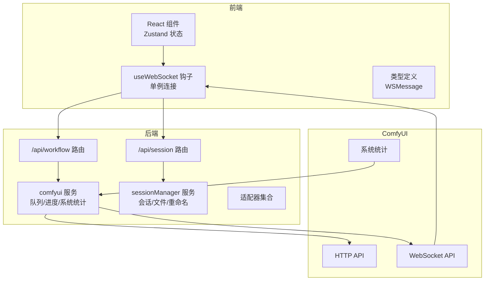
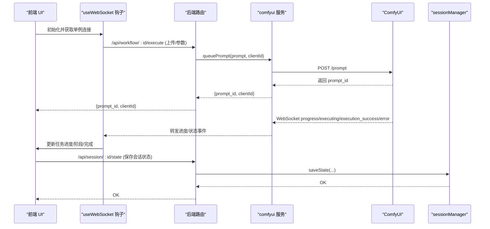
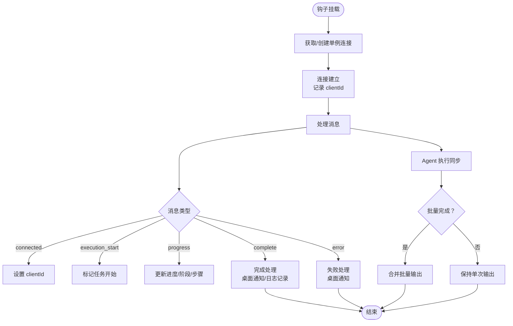
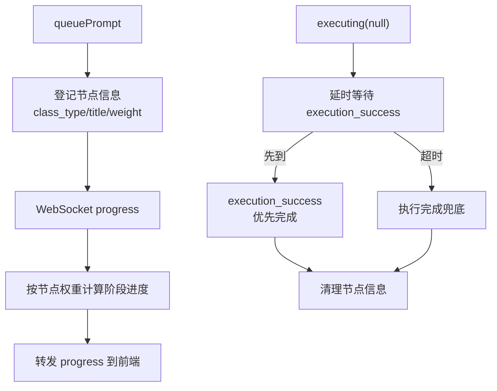
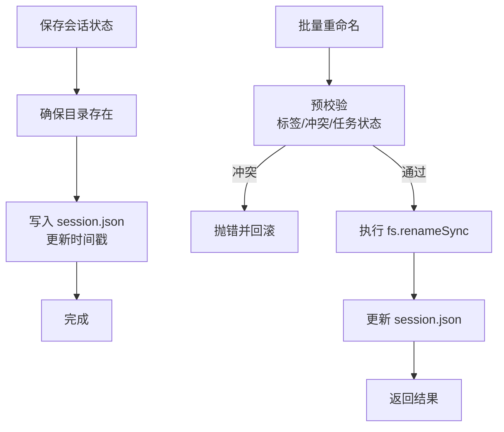
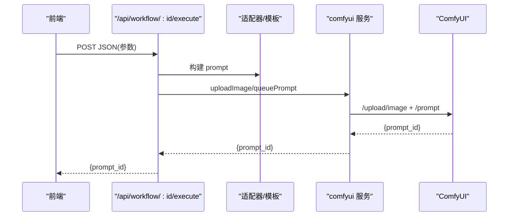
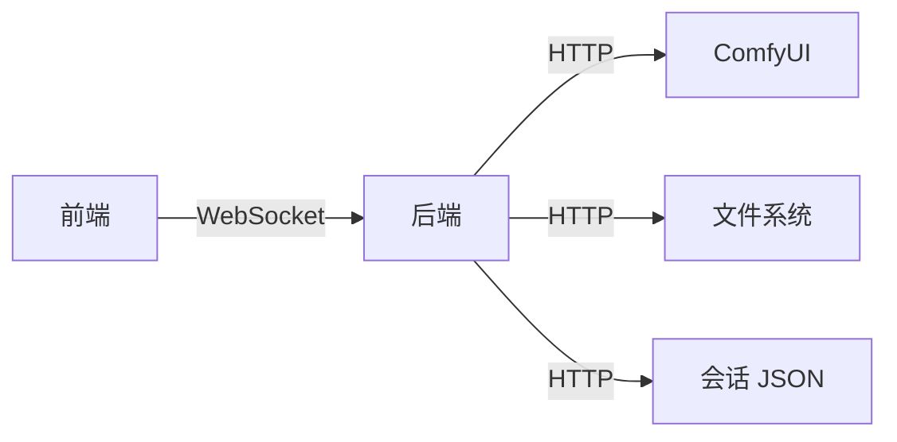

# 性能监控

<cite>
**本文引用的文件**
- [README.md](file://README.md)
- [useWebSocket.ts](file://client/src/hooks/useWebSocket.ts)
- [index.ts](file://client/src/types/index.ts)
- [comfyui.ts](file://server/src/services/comfyui.ts)
- [session.ts](file://server/src/routes/session.ts)
- [workflow.ts](file://server/src/routes/workflow.ts)
- [sessionManager.ts](file://server/src/services/sessionManager.ts)
- [index.ts](file://server/src/adapters/index.ts)
- [Workflow7Adapter.ts](file://server/src/adapters/Workflow7Adapter.ts)
- [Workflow9Adapter.ts](file://server/src/adapters/Workflow9Adapter.ts)
- [sessionService.ts](file://client/src/services/sessionService.ts)
- [package.json](file://client/package.json)
- [package.json](file://server/package.json)
</cite>

## 目录
1. [简介](#简介)
2. [项目结构](#项目结构)
3. [核心组件](#核心组件)
4. [架构总览](#架构总览)
5. [详细组件分析](#详细组件分析)
6. [依赖关系分析](#依赖关系分析)
7. [性能考量](#性能考量)
8. [故障排查指南](#故障排查指南)
9. [结论](#结论)
10. [附录](#附录)

## 简介
本文件面向性能监控与优化，围绕前端实时进度、后端 ComfyUI 服务、WebSocket 连接与消息链路、会话管理与并发、以及日志与告警策略进行系统化说明。目标是帮助开发者建立可观察、可诊断、可优化的性能监控体系，并提供定位瓶颈与解决问题的方法论。

## 项目结构
- 前端（React + TypeScript + Zustand）通过 WebSocket 实时接收 ComfyUI 的进度事件，驱动 UI 更新与任务状态管理。
- 后端（Express + TypeScript）负责工作流路由、ComfyUI 交互、会话持久化与文件 I/O。
- ComfyUI 作为推理引擎，提供系统统计、队列与历史查询、WebSocket 事件推送等能力。

图表来源
- [useWebSocket.ts:1-278](file://client/src/hooks/useWebSocket.ts#L1-L278)
- [index.ts:1-76](file://client/src/types/index.ts#L1-L76)
- [workflow.ts:1-800](file://server/src/routes/workflow.ts#L1-L800)
- [session.ts:1-163](file://server/src/routes/session.ts#L1-L163)
- [comfyui.ts:1-472](file://server/src/services/comfyui.ts#L1-L472)
- [sessionManager.ts:1-539](file://server/src/services/sessionManager.ts#L1-L539)
- [index.ts:1-33](file://server/src/adapters/index.ts#L1-L33)

章节来源
- [README.md: 41-79:41-79](file://README.md#L41-L79)
- [package.json: 1-L26:1-26](file://client/package.json#L1-L26)
- [package.json: 1-L28:1-28](file://server/package.json#L1-L28)

## 核心组件
- 前端 WebSocket 单例连接与消息分发：集中处理 connected/execution_start/progress/complete/error 等事件，更新任务状态与 UI。
- 后端 ComfyUI 服务：封装上传、入队、进度、历史、系统统计、队列优先级调整等接口，并在 WebSocket 层面处理去重、防抖与完成信号协调。
- 会话管理服务：负责会话目录、输入/输出/掩码文件的保存与读取、会话状态序列化、封面生成、卡片资产重命名（含批量事务性重命名）。
- 工作流路由：针对不同工作流构建模板、注入参数、上传资源、提交队列，并返回 promptId 与客户端标识。
- 类型系统：统一前后端 WebSocket 消息结构，便于监控与日志解析。

章节来源
- [useWebSocket.ts: 1-L278:1-278](file://client/src/hooks/useWebSocket.ts#L1-L278)
- [comfyui.ts: 1-L472:1-472](file://server/src/services/comfyui.ts#L1-L472)
- [sessionManager.ts: 1-L539:1-539](file://server/src/services/sessionManager.ts#L1-L539)
- [workflow.ts: 1-L800:1-800](file://server/src/routes/workflow.ts#L1-L800)
- [index.ts:1-76](file://client/src/types/index.ts#L1-L76)

## 架构总览
下图展示从前端发起工作流到 ComfyUI 执行再到前端进度回传的关键路径，以及后端对会话与文件系统的持久化。

图表来源
- [workflow.ts: 750-L800:750-800](file://server/src/routes/workflow.ts#L750-L800)
- [comfyui.ts: 168-L196:168-196](file://server/src/services/comfyui.ts#L168-L196)
- [comfyui.ts: 304-L375:304-375](file://server/src/services/comfyui.ts#L304-L375)
- [useWebSocket.ts: 45-L163:45-163](file://client/src/hooks/useWebSocket.ts#L45-L163)
- [session.ts: 54-L71:54-71](file://server/src/routes/session.ts#L54-L71)
- [sessionManager.ts: 102-L122:102-122](file://server/src/services/sessionManager.ts#L102-L122)

## 详细组件分析

### 前端 WebSocket 监控与进度聚合
- 单例连接：通过模块级变量与计数器确保同一页面内仅维持一个 WebSocket 连接，避免重复订阅与资源浪费。
- 事件分发：onmessage 中解析消息类型，分别更新任务状态、进度阶段、步骤索引与总数，并在完成时触发桌面通知。
- Agent 执行同步：对智能生成场景，支持批量 promptId 的匹配与累计完成，最终一次性汇总输出。
- 发送消息：提供 sendMessage 方法，仅在连接处于 OPEN 状态时发送，避免异常发送。

图表来源
- [useWebSocket.ts: 29-L278:29-278](file://client/src/hooks/useWebSocket.ts#L29-L278)
- [index.ts:39-76](file://client/src/types/index.ts#L39-L76)

章节来源
- [useWebSocket.ts: 1-L278:1-278](file://client/src/hooks/useWebSocket.ts#L1-L278)
- [index.ts:1-76](file://client/src/types/index.ts#L1-L76)

### 后端 ComfyUI 服务与进度权重化
- 节点权重与阶段进度：通过节点 class_type 与 inputs 计算权重，结合 ComfyUI progress 消息中的节点字段，生成阶段名称与全局百分比。
- 完成信号协调：兼容新旧版本的完成信号，采用“执行成功”优先、“执行中止”延时兜底，避免“卡牌完成但无输出”的问题。
- 系统统计：提供 RAM/VRAM 使用率查询，便于资源监控与阈值告警。

图表来源
- [comfyui.ts: 47-L167:47-167](file://server/src/services/comfyui.ts#L47-L167)
- [comfyui.ts: 304-L375:304-375](file://server/src/services/comfyui.ts#L304-L375)
- [comfyui.ts: 244-L263:244-263](file://server/src/services/comfyui.ts#L244-L263)

章节来源
- [comfyui.ts: 1-L472:1-472](file://server/src/services/comfyui.ts#L1-L472)

### 会话管理与并发优化
- 目录与文件 I/O：按会话与标签页划分 input/mask/output 子目录，确保并发写入时的隔离与一致性。
- 事务性批量重命名：在应用层预校验所有冲突与任务状态，通过一次性重命名与状态落盘保证原子性，避免竞态。
- 会话状态保存：支持常规保存与页面卸载时的 beacon 异步保存，降低主线程阻塞风险。

图表来源
- [sessionManager.ts: 11-L18:11-18](file://server/src/services/sessionManager.ts#L11-L18)
- [sessionManager.ts: 102-L122:102-122](file://server/src/services/sessionManager.ts#L102-L122)
- [sessionManager.ts: 381-L539:381-539](file://server/src/services/sessionManager.ts#L381-L539)
- [session.ts: 54-L71:54-71](file://server/src/routes/session.ts#L54-L71)

章节来源
- [sessionManager.ts: 1-L539:1-539](file://server/src/services/sessionManager.ts#L1-L539)
- [session.ts: 1-L163:1-163](file://server/src/routes/session.ts#L1-L163)

### 工作流执行与资源使用
- 工作流路由：针对不同工作流（如快速出图、ZIT快出、二次元转真人、精修放大等）构建模板、注入参数、上传资源并提交队列。
- 模型与 LoRA：提供模型列表查询接口，便于前端选择与后端校验。
- 释放内存与优先级：提供释放内存模板与队列优先级调整接口，辅助资源回收与紧急任务加速。

图表来源
- [workflow.ts: 269-L405:269-405](file://server/src/routes/workflow.ts#L269-L405)
- [workflow.ts: 485-L593:485-593](file://server/src/routes/workflow.ts#L485-L593)
- [workflow.ts: 644-L748:644-748](file://server/src/routes/workflow.ts#L644-L748)
- [index.ts:1-33](file://server/src/adapters/index.ts#L1-L33)
- [Workflow7Adapter.ts: 1-L14:1-14](file://server/src/adapters/Workflow7Adapter.ts#L1-L14)
- [Workflow9Adapter.ts: 1-L14:1-14](file://server/src/adapters/Workflow9Adapter.ts#L1-L14)

章节来源
- [workflow.ts: 1-L800:1-800](file://server/src/routes/workflow.ts#L1-L800)
- [index.ts:1-33](file://server/src/adapters/index.ts#L1-L33)
- [Workflow7Adapter.ts: 1-L14:1-14](file://server/src/adapters/Workflow7Adapter.ts#L1-L14)
- [Workflow9Adapter.ts: 1-L14:1-14](file://server/src/adapters/Workflow9Adapter.ts#L1-L14)

## 依赖关系分析
- 前端依赖：React、Zustand、node-fetch（用于会话日志上报）、WebSocket（浏览器内置）。
- 后端依赖：Express、ws（WebSocket 服务器）、node-fetch、multer（文件上传）、form-data（multipart）。
- 关键耦合点：前端 useWebSocket 与后端 comfyui 服务的 WebSocket 事件桥接；工作流路由与适配器模板；会话路由与 sessionManager 的状态持久化。

图表来源
- [useWebSocket.ts: 37-L39:37-39](file://client/src/hooks/useWebSocket.ts#L37-L39)
- [comfyui.ts: 6-L7:6-7](file://server/src/services/comfyui.ts#L6-L7)
- [sessionManager.ts: 102-L122:102-122](file://server/src/services/sessionManager.ts#L102-L122)

章节来源
- [package.json: 1-L26:1-26](file://client/package.json#L1-L26)
- [package.json: 1-L28:1-28](file://server/package.json#L1-L28)

## 性能考量
- WebSocket 连接管理
  - 单例连接减少连接数与 CPU/内存占用；断线重连采用指数退避策略，避免风暴重试。
  - 仅在 OPEN 状态发送消息，降低无效发送成本。
- 进度聚合与 UI 渲染
  - 前端按类型分流处理，避免重复渲染；建议在 UI 层做节流/防抖与虚拟滚动，降低大列表渲染压力。
- ComfyUI 节点权重
  - 基于节点类型与采样步数的权重估算，使进度条更贴合实际耗时；对 tiled 采样进行保守估算，避免进度过早饱和。
- 会话与文件 I/O
  - 目录提前创建，减少运行时 mkdir 成本；批量重命名采用预校验与一次性落盘，避免中间态与竞态。
- 资源监控
  - 定期拉取系统统计（RAM/VRAM），结合阈值触发告警或降级策略（如限速/排队）。

章节来源
- [useWebSocket.ts: 29-L278:29-278](file://client/src/hooks/useWebSocket.ts#L29-L278)
- [comfyui.ts: 58-L144:58-144](file://server/src/services/comfyui.ts#L58-L144)
- [comfyui.ts: 244-L263:244-263](file://server/src/services/comfyui.ts#L244-L263)
- [sessionManager.ts: 11-L18:11-18](file://server/src/services/sessionManager.ts#L11-L18)
- [sessionManager.ts: 381-L539:381-539](file://server/src/services/sessionManager.ts#L381-L539)

## 故障排查指南
- WebSocket 断连与重连
  - 现象：连接断开后自动重连。
  - 排查：确认前端连接计数与模块级变量状态；检查后端 WebSocket 地址与协议（ws/wss）。
- 进度不更新或卡住
  - 现象：progress 消息缺失或长时间无响应。
  - 排查：确认 ComfyUI 版本与完成信号（execution_success）是否可用；检查节点权重与 total 是否为 0。
- 任务完成但无输出
  - 现象：前端显示完成但历史为空。
  - 排查：确认后端对“执行中止”与“执行成功”的延时协调逻辑是否生效；必要时手动调用历史查询接口。
- 会话保存失败
  - 现象：PUT/POST /api/session/:id/state 返回错误。
  - 排查：检查 sessions 目录权限、磁盘空间、JSON 结构合法性；确认路径配置可运行时切换。
- 工作流提交失败
  - 现象：/api/workflow/:id/execute 返回错误。
  - 排查：检查模型/LoRA 是否存在；确认上传文件格式与大小限制；查看友好错误映射。

章节来源
- [useWebSocket.ts: 232-L244:232-244](file://client/src/hooks/useWebSocket.ts#L232-L244)
- [comfyui.ts: 304-L375:304-375](file://server/src/services/comfyui.ts#L304-L375)
- [session.ts: 54-L71:54-71](file://server/src/routes/session.ts#L54-L71)
- [workflow.ts: 126-L150:126-150](file://server/src/routes/workflow.ts#L126-L150)

## 结论
本项目通过前端单例 WebSocket、后端节点权重化进度与完成信号协调、会话事务性重命名与状态持久化，形成了较为完善的性能监控与可观测性基础。建议在此基础上引入系统统计阈值告警、前端 FPS/内存采样、后端请求耗时与队列长度监控，以及日志分级与结构化输出，以进一步提升稳定性与可维护性。

## 附录

### 日志记录策略
- 错误日志
  - 前端：对 WebSocket 错误、任务失败、桌面通知异常进行捕获与记录。
  - 后端：对队列提交失败、系统统计获取失败、文件操作异常进行错误堆栈记录。
- 访问日志
  - 后端路由层可接入中间件记录请求路径、参数摘要与响应状态，便于审计与性能分析。
- 性能日志
  - 前端：记录任务开始/完成时间、阶段耗时、消息到达延迟（基于时间戳差值）。
  - 后端：记录队列入队时间、ComfyUI 执行耗时、系统统计采样周期与阈值触发。

章节来源
- [useWebSocket.ts: 41-L43:41-43](file://client/src/hooks/useWebSocket.ts#L41-L43)
- [useWebSocket.ts: 150-L158:150-158](file://client/src/hooks/useWebSocket.ts#L150-L158)
- [comfyui.ts: 370-L372:370-372](file://server/src/services/comfyui.ts#L370-L372)
- [workflow.ts: 211-L214:211-214](file://server/src/routes/workflow.ts#L211-L214)

### 监控告警配置建议
- 连接健康：WebSocket 连接断开次数、重连耗时、消息丢帧率。
- 执行健康：任务超时阈值、阶段耗时分布、失败率。
- 资源健康：RAM/VRAM 使用率峰值、持续高占用时长、释放内存后恢复情况。
- 会话健康：保存失败率、批量重命名冲突率、磁盘空间预警。

章节来源
- [comfyui.ts: 244-L263:244-263](file://server/src/services/comfyui.ts#L244-L263)
- [sessionManager.ts: 220-L226:220-226](file://server/src/services/sessionManager.ts#L220-L226)

### 性能分析工具使用
- 前端
  - 浏览器性能面板：录制与分析任务执行路径、布局与绘制热点。
  - React DevTools Profiler：定位组件重渲染热点。
- 后端
  - Node.js Profiler：CPU/Heap 分析，定位阻塞点。
  - 压测工具：对关键路由（/api/workflow/:id/execute、/api/session/:id/state）进行并发压测，观察吞吐与延迟曲线。
- ComfyUI
  - 系统统计接口：周期性采集 VRAM/内存使用，结合任务执行时段进行关联分析。

章节来源
- [comfyui.ts: 244-L263:244-263](file://server/src/services/comfyui.ts#L244-L263)
- [workflow.ts: 1-L800:1-800](file://server/src/routes/workflow.ts#L1-L800)
- [session.ts: 1-L163:1-163](file://server/src/routes/session.ts#L1-L163)