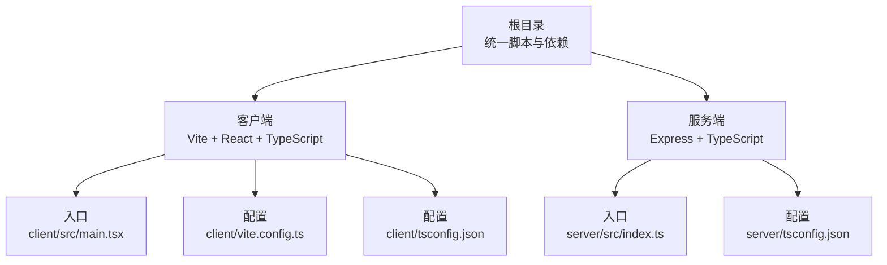
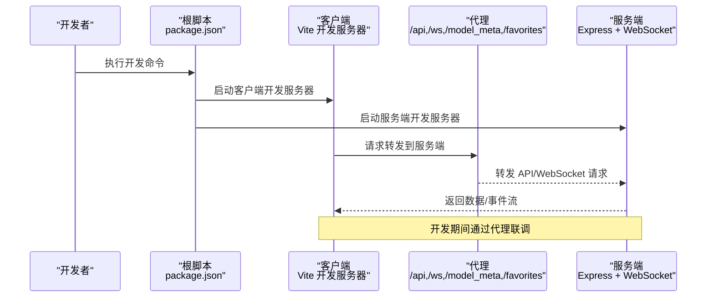
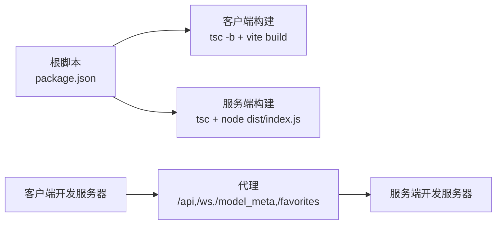

# 构建与打包

<cite>
**本文引用的文件**
- [根 package.json](file://package.json)
- [客户端 Vite 配置](file://client/vite.config.ts)
- [客户端包管理配置](file://client/package.json)
- [客户端 TypeScript 配置](file://client/tsconfig.json)
- [服务端包管理配置](file://server/package.json)
- [服务端 TypeScript 配置](file://server/tsconfig.json)
- [服务端入口](file://server/src/index.ts)
- [客户端入口](file://client/src/main.tsx)
- [启动脚本（Windows）](file://start.bat)
- [调试脚本（Windows）](file://debug.bat)
- [停止脚本（Windows）](file://stop.bat)
</cite>

## 目录
1. [简介](#简介)
2. [项目结构](#项目结构)
3. [核心组件](#核心组件)
4. [架构总览](#架构总览)
5. [详细组件分析](#详细组件分析)
6. [依赖关系分析](#依赖关系分析)
7. [性能考虑](#性能考虑)
8. [故障排查指南](#故障排查指南)
9. [结论](#结论)
10. [附录](#附录)

## 简介
本文件面向开发者，系统梳理本项目的构建与打包流程，覆盖以下方面：
- 前端应用的 Vite 构建配置、代理与开发服务器、资源优化与代码分割策略
- TypeScript 编译流程，区分服务端与客户端编译配置差异
- Electron 应用打包（若适用）与主/渲染进程打包策略（本仓库未包含 Electron 打包配置）
- 资源文件处理，包括静态资源、图标与配置文件的打包规则
- 构建优化技巧，包括压缩、缓存与性能优化
- 构建脚本的使用方法与可定制化选项，帮助开发者掌握完整构建流程

## 项目结构
本项目采用前后端分离的多包结构：
- 根目录提供统一的开发与构建脚本，协调客户端与服务端的启动与打包
- 客户端（client）使用 Vite 进行开发与构建，包含 React 与 TypeScript
- 服务端（server）使用 Node.js + Express + TypeScript，提供 API、WebSocket 与静态资源服务

图表来源
- [根 package.json:1-15](file://package.json#L1-L15)
- [客户端入口:1-11](file://client/src/main.tsx#L1-L11)
- [客户端 Vite 配置:1-28](file://client/vite.config.ts#L1-L28)
- [客户端 TypeScript 配置:1-22](file://client/tsconfig.json#L1-L22)
- [服务端入口:1-516](file://server/src/index.ts#L1-L516)
- [服务端 TypeScript 配置:1-19](file://server/tsconfig.json#L1-L19)

章节来源
- [根 package.json:1-15](file://package.json#L1-L15)
- [客户端入口:1-11](file://client/src/main.tsx#L1-L11)
- [客户端 Vite 配置:1-28](file://client/vite.config.ts#L1-L28)
- [客户端 TypeScript 配置:1-22](file://client/tsconfig.json#L1-L22)
- [服务端入口:1-516](file://server/src/index.ts#L1-L516)
- [服务端 TypeScript 配置:1-19](file://server/tsconfig.json#L1-L19)

## 核心组件
- 统一构建脚本：通过根目录脚本统一启动客户端与服务端，支持并行开发与一键构建
- 客户端构建链路：先执行 TypeScript 编译，再进行 Vite 构建，输出静态资源
- 服务端构建链路：TypeScript 编译输出到 dist 目录，运行时由 Node.js 启动
- 开发服务器与代理：Vite 开发服务器代理 /api、/ws、/model_meta、/favorites 到本地服务端
- 资源与静态文件：服务端静态挂载 output、session-files、model_meta、favorites 等目录

章节来源
- [根 package.json:4-10](file://package.json#L4-L10)
- [客户端包管理配置:6-10](file://client/package.json#L6-L10)
- [客户端 Vite 配置:6-26](file://client/vite.config.ts#L6-L26)
- [服务端入口:118-146](file://server/src/index.ts#L118-L146)

## 架构总览
下图展示从开发到构建的关键流程与交互：

图表来源
- [根 package.json:4-10](file://package.json#L4-L10)
- [客户端 Vite 配置:6-26](file://client/vite.config.ts#L6-L26)
- [服务端入口:121-146](file://server/src/index.ts#L121-L146)

## 详细组件分析

### 客户端构建与 Vite 配置
- 插件与开发服务器
  - 使用 React 插件，启用 JSX 与类型检查
  - 开发服务器默认端口与代理配置，将 /api、/ws、/model_meta、/favorites 转发至服务端
- 构建顺序
  - 先执行 TypeScript 编译，再进行 Vite 构建，确保类型安全与模块解析正确
- 资源优化与代码分割
  - Vite 默认按需打包与动态导入实现代码分割
  - 生产构建自动进行 Tree Shaking、最小化与资源内联/外链策略
- 静态资源处理
  - public 目录下的静态资源在构建后原样复制到输出目录
  - 代码中通过相对路径引用的资源会被 Vite 处理并参与产物优化

章节来源
- [客户端 Vite 配置:1-28](file://client/vite.config.ts#L1-L28)
- [客户端包管理配置:6-10](file://client/package.json#L6-L10)
- [客户端入口:1-11](file://client/src/main.tsx#L1-L11)

### TypeScript 编译流程（客户端 vs 服务端）
- 客户端（浏览器环境）
  - 目标与模块：ES2020 + ESNext 模块，bundler 模式，noEmit（由 Vite 处理）
  - 严格性与检查：严格模式、跳过库检查、允许 TS 扩展名导入
  - JSX：使用 react-jsx
- 服务端（Node 环境）
  - 目标与模块：ES2022 + ESNext 模块，bundler 模式
  - 输出：dist 目录，rootDir 指向 src
  - 兼容性：esModuleInterop，JSON 模块解析，声明文件生成
- 差异总结
  - 客户端侧重浏览器兼容与构建器集成；服务端侧重 Node 运行时与严格类型输出

章节来源
- [客户端 TypeScript 配置:2-19](file://client/tsconfig.json#L2-L19)
- [服务端 TypeScript 配置:2-16](file://server/tsconfig.json#L2-L16)

### 服务端构建与运行
- 构建流程
  - TypeScript 编译输出到 dist，随后由 Node.js 运行
- 运行时特性
  - 启动 Express 服务，启用 CORS，挂载路由与静态资源
  - 启动 WebSocket 服务，连接 ComfyUI 并向客户端推送进度与结果
  - 自动创建输出目录、会话目录与模型元数据目录

章节来源
- [服务端包管理配置:6-10](file://server/package.json#L6-L10)
- [服务端入口:118-146](file://server/src/index.ts#L118-L146)
- [服务端入口:496-516](file://server/src/index.ts#L496-L516)

### Electron 应用打包（现状与建议）
- 现状
  - 本仓库未发现 Electron 主进程或渲染进程的打包配置文件
- 建议
  - 若需要 Electron 打包，可在根目录新增打包配置（如 electron-builder 或 @electron/forge），分别针对主进程（Node 环境）与渲染进程（Vite 构建产物）制定独立构建与打包策略
  - 主进程使用服务端类似的 TypeScript 配置，渲染进程复用现有 Vite 配置
  - 注意资源路径、图标与配置文件的打包规则，确保打包后路径与运行时一致

[本节为概念性建议，不直接分析具体文件，故无“章节来源”]

### 资源文件处理
- 静态资源
  - public 目录下的静态资源在构建后原样复制到输出目录
- 图标与配置文件
  - 本仓库未见 Electron 图标与配置文件的打包配置，若后续引入 Electron，需在打包配置中显式声明图标与额外资源路径
- 服务端静态挂载
  - 服务端对 output、session-files、model_meta、favorites 等目录进行静态挂载，便于客户端访问

章节来源
- [服务端入口:134-146](file://server/src/index.ts#L134-L146)

### 构建脚本与使用方法
- 根脚本
  - 开发：并行启动客户端与服务端
  - 构建：依次构建客户端与服务端
  - 安装：安装客户端与服务端依赖
- Windows 启动/调试/停止脚本
  - 自动检查端口占用并释放
  - 分别启动服务端与客户端开发服务器，并打开浏览器
  - 提供一键停止所有相关服务的功能

章节来源
- [根 package.json:4-10](file://package.json#L4-L10)
- [启动脚本（Windows）:1-57](file://start.bat#L1-L57)
- [调试脚本（Windows）:1-57](file://debug.bat#L1-L57)
- [停止脚本（Windows）:1-46](file://stop.bat#L1-L46)

## 依赖关系分析
- 脚本耦合
  - 根脚本依赖客户端与服务端各自的构建与启动脚本
- 构建耦合
  - 客户端构建顺序：tsc -b → vite build
  - 服务端构建顺序：tsc → node dist/index.js
- 运行时耦合
  - 客户端开发服务器通过代理访问服务端 API 与 WebSocket
  - 服务端静态资源与会话目录对外暴露，供客户端访问

图表来源
- [根 package.json:4-10](file://package.json#L4-L10)
- [客户端包管理配置:6-10](file://client/package.json#L6-L10)
- [服务端包管理配置:6-10](file://server/package.json#L6-L10)
- [客户端 Vite 配置:6-26](file://client/vite.config.ts#L6-L26)
- [服务端入口:121-146](file://server/src/index.ts#L121-L146)

章节来源
- [根 package.json:4-10](file://package.json#L4-L10)
- [客户端包管理配置:6-10](file://client/package.json#L6-L10)
- [服务端包管理配置:6-10](file://server/package.json#L6-L10)
- [客户端 Vite 配置:6-26](file://client/vite.config.ts#L6-L26)
- [服务端入口:121-146](file://server/src/index.ts#L121-L146)

## 性能考虑
- 代码分割
  - 利用 Vite 的动态导入实现按需加载，减少首屏体积
- 资源优化
  - 生产构建自动进行 Tree Shaking、最小化与资源内联/外链策略
- 缓存策略
  - 服务端静态资源可通过 CDN 或浏览器缓存策略进一步优化
- 开发体验
  - 代理避免跨域问题，提升联调效率
  - 并行启动脚本缩短整体等待时间

[本节提供通用指导，不直接分析具体文件，故无“章节来源”]

## 故障排查指南
- 端口占用
  - 启动/调试脚本会自动检测并释放 3000、5173、8188 端口占用
- 代理不通
  - 确认服务端已启动且监听端口正确
  - 检查客户端代理配置与目标地址
- 构建失败
  - 客户端：先确认 tsc -b 是否通过，再执行 vite build
  - 服务端：确认 dist 目录生成且 index.js 可运行

章节来源
- [启动脚本（Windows）:10-32](file://start.bat#L10-L32)
- [调试脚本（Windows）:10-32](file://debug.bat#L10-L32)
- [停止脚本（Windows）:12-36](file://stop.bat#L12-L36)
- [客户端包管理配置:6-10](file://client/package.json#L6-L10)
- [服务端包管理配置:6-10](file://server/package.json#L6-L10)

## 结论
本项目采用清晰的多包结构与脚本化构建流程，客户端通过 Vite 实现高效的开发与构建，服务端通过 TypeScript 编译与 Node.js 运行提供稳定的 API 与 WebSocket 能力。结合代理与静态资源挂载，实现了良好的开发体验与运行时性能。若未来引入 Electron，建议在根目录补充相应的打包配置，明确区分主/渲染进程的构建策略与资源处理规则。

[本节为总结性内容，不直接分析具体文件，故无“章节来源”]

## 附录
- 快速参考
  - 开发：根脚本并行启动客户端与服务端
  - 构建：先客户端后服务端
  - 停止：一键释放相关端口并关闭服务
- 自定义建议
  - 在 Vite 配置中添加产物命名策略与公共路径
  - 在服务端 tsconfig 中根据需要调整输出目录与模块解析策略
  - 如引入 Electron，为主进程与渲染进程分别维护独立的构建与打包配置

[本节为辅助信息，不直接分析具体文件，故无“章节来源”]