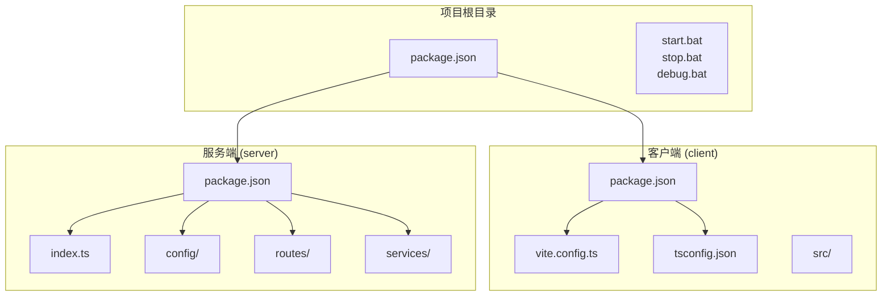
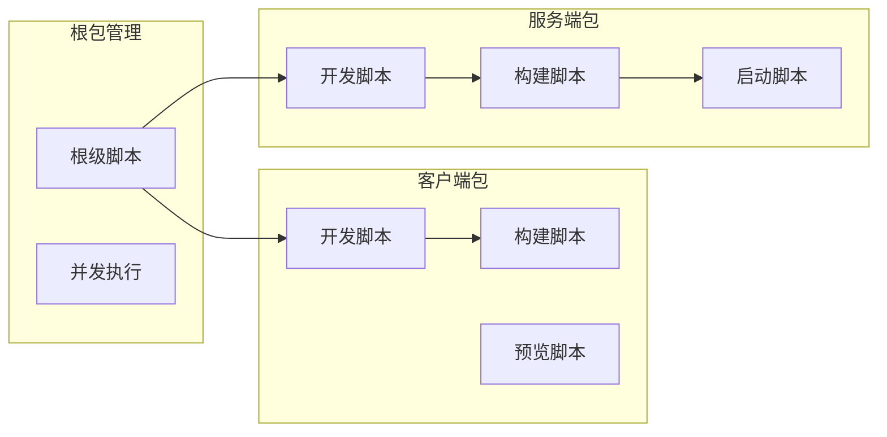
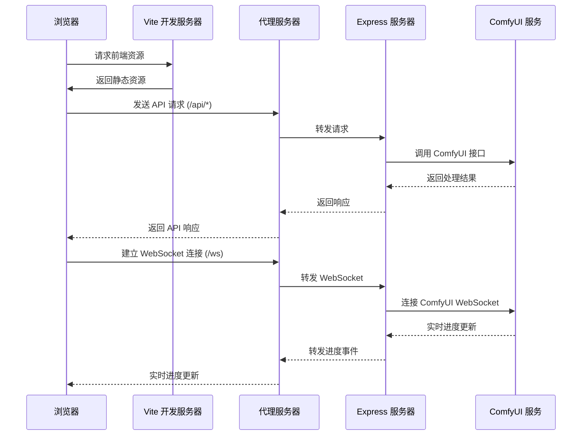
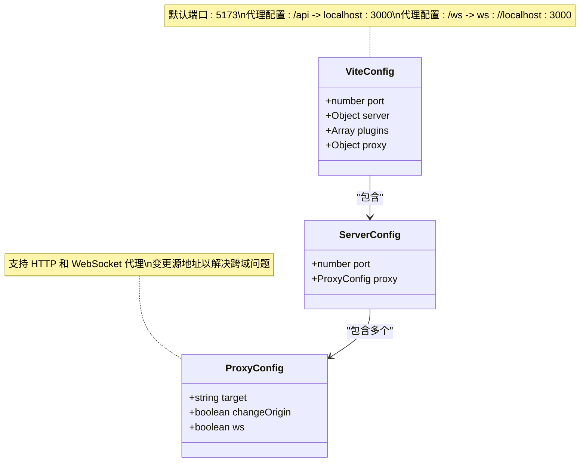
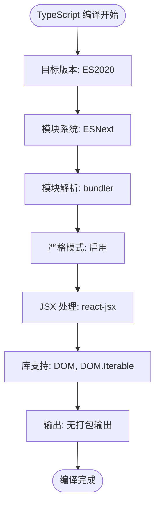
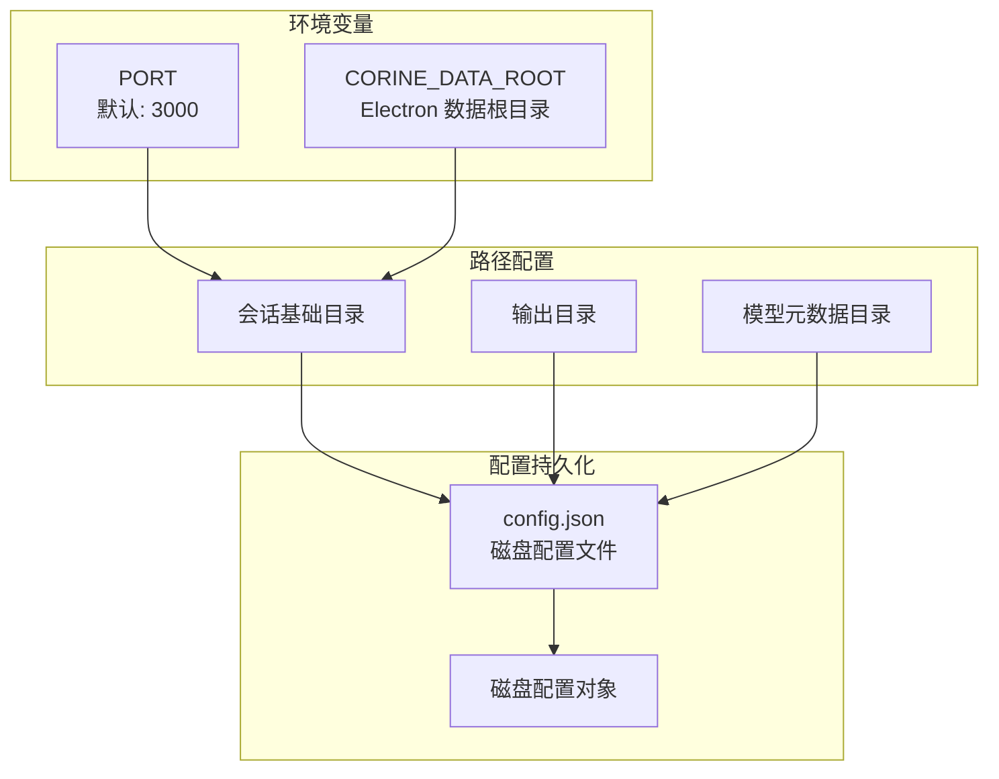
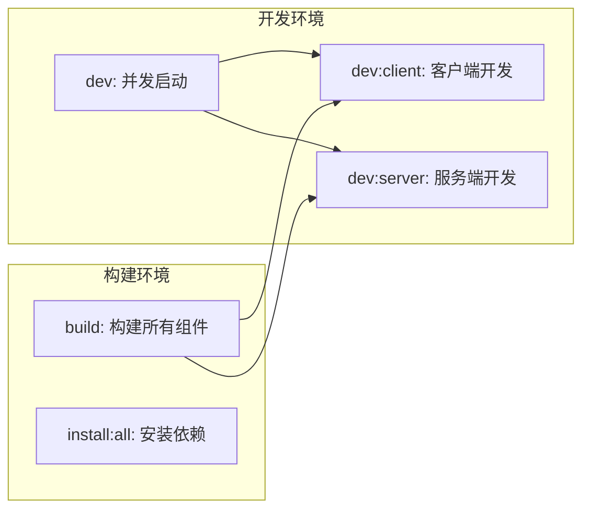
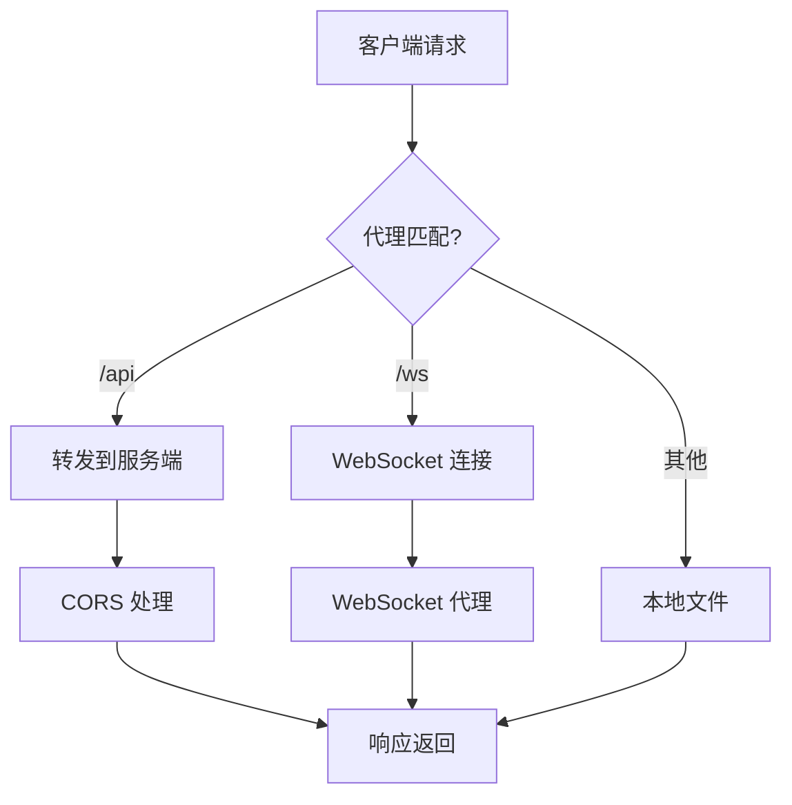
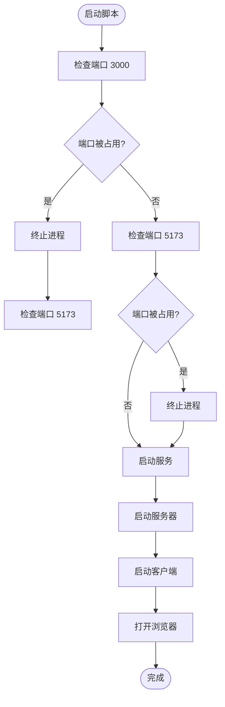

# 环境配置管理

<cite>
**本文档引用的文件**
- [client/package.json](file://client/package.json)
- [client/vite.config.ts](file://client/vite.config.ts)
- [client/tsconfig.json](file://client/tsconfig.json)
- [package.json](file://package.json)
- [server/package.json](file://server/package.json)
- [server/src/index.ts](file://server/src/index.ts)
- [server/src/config/paths.ts](file://server/src/config/paths.ts)
- [server/src/routes/settings.ts](file://server/src/routes/settings.ts)
- [start.bat](file://start.bat)
- [stop.bat](file://stop.bat)
- [debug.bat](file://debug.bat)
</cite>

## 目录
1. [简介](#简介)
2. [项目结构](#项目结构)
3. [核心组件](#核心组件)
4. [架构概览](#架构概览)
5. [详细组件分析](#详细组件分析)
6. [依赖关系分析](#依赖关系分析)
7. [性能考虑](#性能考虑)
8. [故障排除指南](#故障排除指南)
9. [结论](#结论)

## 简介

本项目是一个基于 React 和 Express 的 AI 图像生成应用，采用前后端分离架构。本文档详细说明了环境配置管理，包括开发环境、测试环境和生产环境的配置差异与设置方法，涵盖 package.json 脚本配置、Vite 开发服务器配置、TypeScript 编译配置、环境变量管理以及配置验证和故障排除方法。

## 项目结构

项目采用 Monorepo 结构，包含客户端、服务端和共享资源：



**图表来源**
- [package.json:1-15](file://package.json#L1-L15)
- [client/package.json:1-26](file://client/package.json#L1-L26)
- [server/package.json:1-28](file://server/package.json#L1-L28)

**章节来源**
- [package.json:1-15](file://package.json#L1-L15)
- [client/package.json:1-26](file://client/package.json#L1-L26)
- [server/package.json:1-28](file://server/package.json#L1-L28)

## 核心组件

### 包管理配置

项目使用 npm 作为包管理器，采用工作区模式管理多个包：



**图表来源**
- [package.json:4-10](file://package.json#L4-L10)
- [client/package.json:6-10](file://client/package.json#L6-L10)
- [server/package.json:6-10](file://server/package.json#L6-L10)

**章节来源**
- [package.json:1-15](file://package.json#L1-L15)
- [client/package.json:1-26](file://client/package.json#L1-L26)
- [server/package.json:1-28](file://server/package.json#L1-L28)

## 架构概览

系统采用前后端分离架构，前端使用 Vite 进行开发服务器配置，后端使用 Express 提供 API 服务：



**图表来源**
- [client/vite.config.ts:6-26](file://client/vite.config.ts#L6-L26)
- [server/src/index.ts:118-158](file://server/src/index.ts#L118-L158)

## 详细组件分析

### Vite 开发服务器配置

Vite 配置文件定义了开发服务器的核心参数：



**图表来源**
- [client/vite.config.ts:4-27](file://client/vite.config.ts#L4-L27)

#### 代理配置详解

| 代理路径 | 目标地址 | 类型 | 功能 |
|---------|---------|------|------|
| `/api` | `http://localhost:3000` | HTTP | API 请求转发 |
| `/ws` | `ws://localhost:3000` | WebSocket | 实时进度通信 |
| `/model_meta` | `http://localhost:3000` | HTTP | 模型元数据访问 |
| `/favorites` | `http://localhost:3000` | HTTP | 收藏夹资源 |

**章节来源**
- [client/vite.config.ts:1-28](file://client/vite.config.ts#L1-L28)

### TypeScript 编译配置

TypeScript 配置文件定义了编译选项和模块解析策略：



**图表来源**
- [client/tsconfig.json:2-19](file://client/tsconfig.json#L2-L19)

#### 关键配置说明

| 配置项 | 值 | 作用 |
|-------|-----|------|
| `target` | ES2020 | 目标 JavaScript 版本 |
| `module` | ESNext | 模块系统类型 |
| `moduleResolution` | bundler | 模块解析策略 |
| `jsx` | react-jsx | JSX 编译选项 |
| `strict` | true | 启用严格模式检查 |
| `noEmit` | true | 不生成输出文件 |

**章节来源**
- [client/tsconfig.json:1-22](file://client/tsconfig.json#L1-L22)

### 环境变量管理

服务端支持多种环境变量配置：



**图表来源**
- [server/src/index.ts:496](file://server/src/index.ts#L496)
- [server/src/config/paths.ts:16](file://server/src/config/paths.ts#L16)
- [server/src/config/paths.ts:24-26](file://server/src/config/paths.ts#L24-L26)

#### 路径配置管理

| 配置项 | 默认值 | 说明 |
|-------|--------|------|
| `sessionsBase` | `项目根/sessions` | 会话数据存储目录 |
| `outputBase` | `项目根/output` | 输出文件存储目录 |
| `modelMetaBase` | `项目根/model_meta` | 模型元数据目录 |
| `favoritesBase` | `项目根/favorites` | 收藏夹目录 |

**章节来源**
- [server/src/config/paths.ts:1-156](file://server/src/config/paths.ts#L1-L156)

### 脚本配置详解

#### 根级脚本



**图表来源**
- [package.json:4-10](file://package.json#L4-L10)

#### 客户端脚本

| 脚本名称 | 命令 | 用途 |
|---------|------|------|
| `dev` | `vite` | 启动开发服务器 |
| `build` | `tsc -b && vite build` | TypeScript 编译和构建 |
| `preview` | `vite preview` | 预览构建结果 |

#### 服务端脚本

| 脚本名称 | 命令 | 用途 |
|---------|------|------|
| `dev` | `tsx watch src/index.ts` | TypeScript 监听开发 |
| `build` | `tsc` | TypeScript 编译 |
| `start` | `node dist/index.js` | 生产环境启动 |

**章节来源**
- [package.json:1-15](file://package.json#L1-L15)
- [client/package.json:1-26](file://client/package.json#L1-L26)
- [server/package.json:1-28](file://server/package.json#L1-L28)

## 依赖关系分析

项目依赖关系展示了各组件间的耦合度：

```mermaid
graph TB
subgraph "客户端依赖"
React[react@^19.0.0]
ReactDOM[react-dom@^19.0.0]
Vite[vite@^6.0.0]
TS[typescript@~5.7.0]
PluginReact[@vitejs/plugin-react@^4.3.0]
end
subgraph "服务端依赖"
Express[express@^4.21.0]
WS[ws@^8.18.0]
Multer[multer@^1.4.5-lts.1]
Fetch[node-fetch@^3.3.2]
CORS[cors@^2.8.5]
end
subgraph "开发工具"
TSX[tsx@^4.19.0]
Concurrently[concurrently@^9.1.0]
end
React --> Vite
Vite --> PluginReact
Express --> WS
Express --> Multer
Express --> Fetch
Express --> CORS
```

**图表来源**
- [client/package.json:11-24](file://client/package.json#L11-L24)
- [server/package.json:11-26](file://server/package.json#L11-L26)
- [package.json:11](file://package.json#L11)

**章节来源**
- [client/package.json:1-26](file://client/package.json#L1-L26)
- [server/package.json:1-28](file://server/package.json#L1-L28)
- [package.json:1-15](file://package.json#L1-L15)

## 性能考虑

### 端口配置优化

系统使用以下端口配置：
- **客户端**: 5173 (Vite 开发服务器)
- **服务端**: 3000 (Express 服务器)
- **ComfyUI**: 8188 (AI 模型处理)

### 代理性能优化



**图表来源**
- [client/vite.config.ts:8-25](file://client/vite.config.ts#L8-L25)
- [server/src/index.ts:122-125](file://server/src/index.ts#L122-L125)

## 故障排除指南

### 端口冲突解决

启动脚本提供了自动端口检测和清理功能：



**图表来源**
- [start.bat:10-32](file://start.bat#L10-L32)
- [debug.bat:10-32](file://debug.bat#L10-L32)

### 常见问题诊断

#### 1. 服务端启动失败

**症状**: 服务器无法启动或端口占用
**解决方案**:
- 使用 `stop.bat` 停止所有服务
- 检查端口占用情况
- 确认 Node.js 环境配置

#### 2. 客户端无法连接服务端

**症状**: 前端页面显示连接错误
**解决方案**:
- 检查 Vite 代理配置
- 确认服务端 CORS 设置
- 验证网络连接

#### 3. TypeScript 编译错误

**症状**: 构建失败或类型检查错误
**解决方案**:
- 检查 tsconfig.json 配置
- 确认模块解析设置
- 验证导入路径正确性

**章节来源**
- [start.bat:1-57](file://start.bat#L1-L57)
- [stop.bat:1-46](file://stop.bat#L1-L46)
- [debug.bat:1-57](file://debug.bat#L1-L57)

## 结论

本项目的环境配置管理采用了现代化的开发实践，通过 Vite 提供高效的开发体验，通过 TypeScript 确保代码质量，通过 Express 提供稳定的后端服务。配置文件清晰地分离了开发、测试和生产环境的需求，同时提供了完善的故障排除机制。

关键优势包括：
- **模块化配置**: 清晰的配置文件分离
- **自动化脚本**: 简化的开发流程
- **环境隔离**: 明确的环境变量管理
- **监控机制**: 完善的故障排除工具

建议在团队协作中：
1. 保持配置文件的一致性
2. 定期更新依赖版本
3. 完善环境变量文档
4. 建立配置验证流程