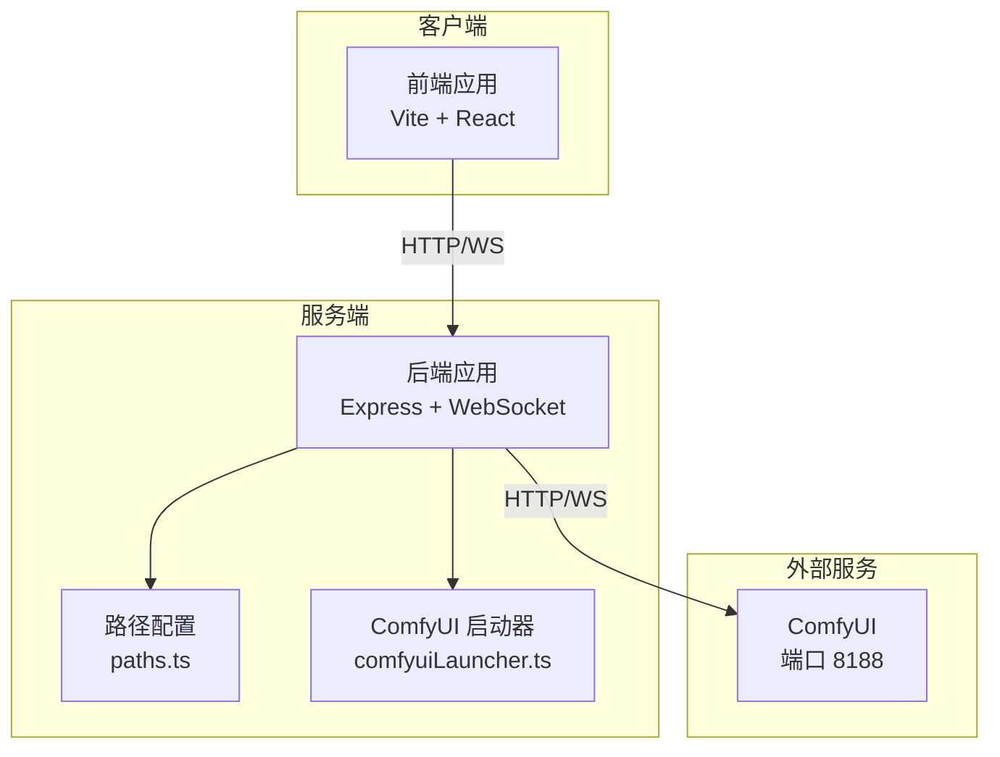
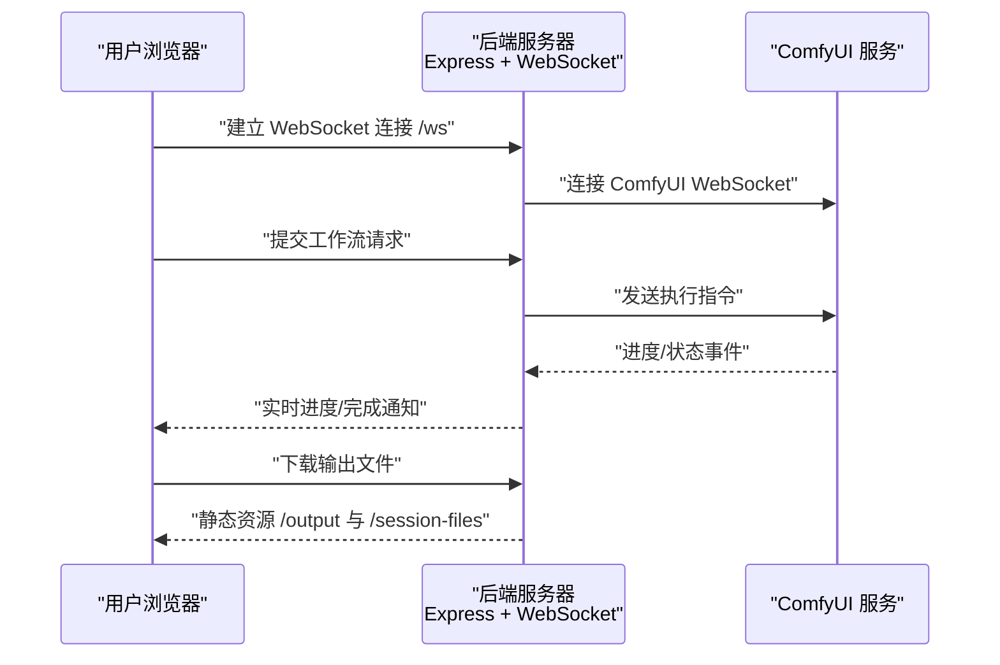
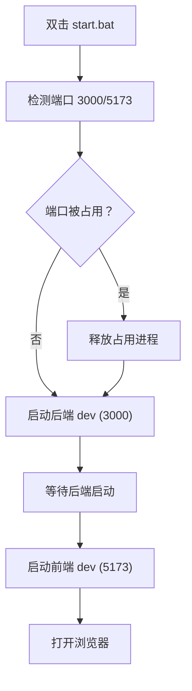
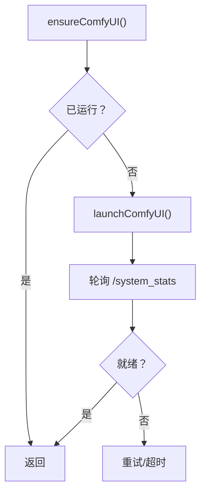
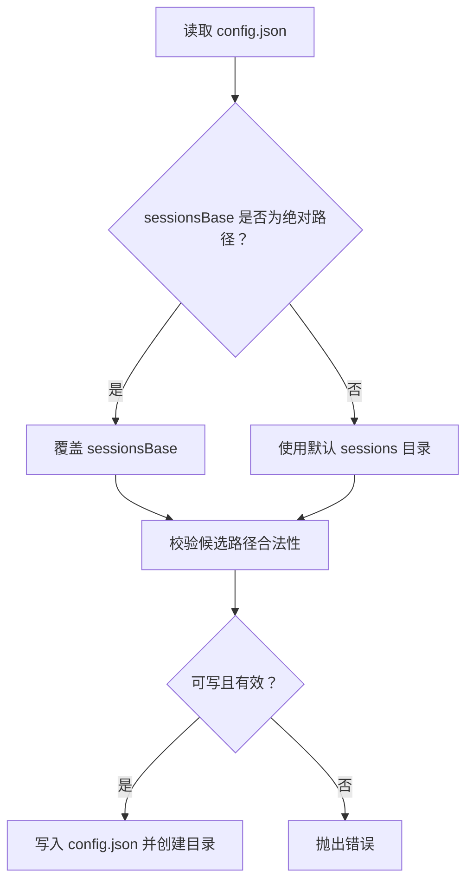
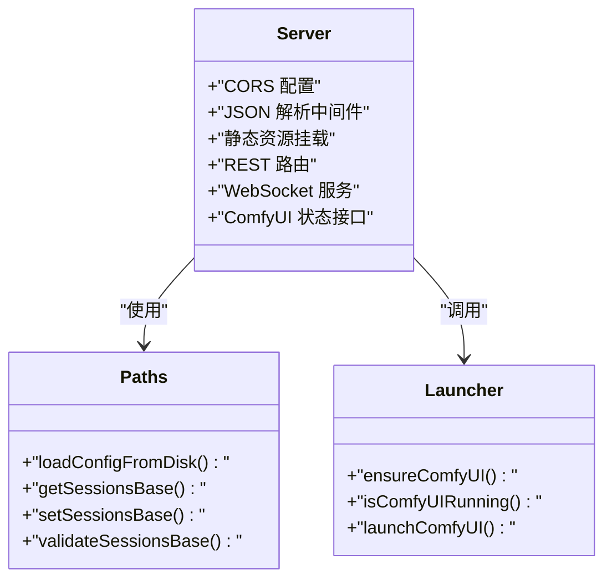
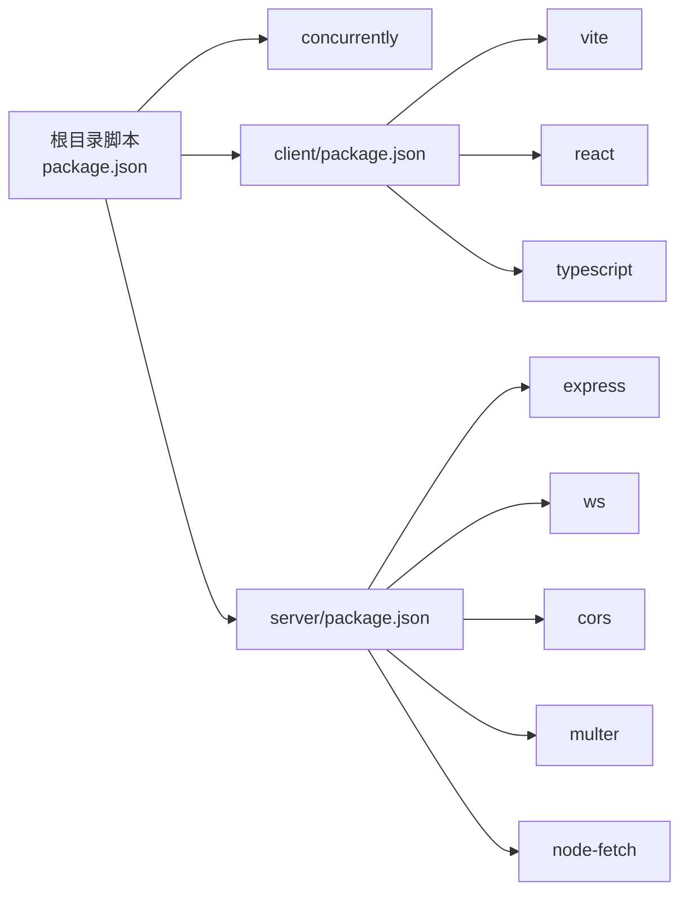

# 部署策略

<cite>
**本文引用的文件**
- [start.bat](file://start.bat)
- [stop.bat](file://stop.bat)
- [debug.bat](file://debug.bat)
- [start.vbs](file://start.vbs)
- [package.json](file://package.json)
- [server/package.json](file://server/package.json)
- [client/package.json](file://client/package.json)
- [server/src/index.ts](file://server/src/index.ts)
- [server/src/services/comfyuiLauncher.ts](file://server/src/services/comfyuiLauncher.ts)
- [server/src/config/paths.ts](file://server/src/config/paths.ts)
- [README.md](file://README.md)
</cite>

## 目录
1. [简介](#简介)
2. [项目结构](#项目结构)
3. [核心组件](#核心组件)
4. [架构总览](#架构总览)
5. [详细组件分析](#详细组件分析)
6. [依赖关系分析](#依赖关系分析)
7. [性能考虑](#性能考虑)
8. [故障排除指南](#故障排除指南)
9. [结论](#结论)
10. [附录](#附录)

## 简介
本文件面向 Windows 平台，提供 CorineKit Pix2Real 的部署策略与运维指南。内容涵盖：
- 开发与生产环境的部署差异
- 批处理脚本与应用程序启动方式
- 自动化部署与 CI/CD 集成建议
- 应用启动/停止机制与服务注册
- 部署验证方法（健康检查与功能测试）
- 常见问题排查与安全部署最佳实践

## 项目结构
该项目采用前后端分离架构：
- 前端：Vite + React + TypeScript，位于 client/，提供交互界面与实时进度展示
- 后端：Express + TypeScript，位于 server/，负责路由、WebSocket 进度转发、与 ComfyUI 的通信
- ComfyUI：本地运行的服务，提供图像/视频处理能力，默认监听 8188 端口
- 资源目录：output/（输出）、sessions/（会话数据）、model_meta/（模型元数据）

图表来源
- [server/src/index.ts:118-146](file://server/src/index.ts#L118-L146)
- [server/src/services/comfyuiLauncher.ts:101-130](file://server/src/services/comfyuiLauncher.ts#L101-L130)
- [server/src/config/paths.ts:13-20](file://server/src/config/paths.ts#L13-L20)

章节来源
- [README.md:41-62](file://README.md#L41-L62)
- [server/src/index.ts:118-146](file://server/src/index.ts#L118-L146)

## 核心组件
- 启动与停止脚本
  - start.bat：开发环境一键启动，自动释放占用端口，分别启动后端（3000）与前端（5173），并打开浏览器
  - stop.bat：停止所有相关服务（3000/5173/8188）
  - debug.bat：以保留窗口的方式启动，便于调试
  - start.vbs：通过 VBScript 启动 start.bat，适合双击快捷方式
- 包管理与构建
  - 顶层 package.json：聚合脚本，支持并发启动前后端、统一安装与构建
  - server/package.json：后端脚本（dev/build/start）
  - client/package.json：前端脚本（dev/build/preview）
- 服务与路径配置
  - server/src/index.ts：Express 服务器、WebSocket、静态资源、ComfyUI 状态接口
  - server/src/config/paths.ts：集中化路径管理，支持 sessions 目录覆盖与持久化
  - server/src/services/comfyuiLauncher.ts：自动检测与启动 ComfyUI，支持环境变量覆盖路径

章节来源
- [start.bat:1-57](file://start.bat#L1-L57)
- [stop.bat:1-46](file://stop.bat#L1-L46)
- [debug.bat:1-57](file://debug.bat#L1-L57)
- [start.vbs:1-5](file://start.vbs#L1-L5)
- [package.json:4-13](file://package.json#L4-L13)
- [server/package.json:6-9](file://server/package.json#L6-L9)
- [client/package.json:6-9](file://client/package.json#L6-L9)
- [server/src/index.ts:496-516](file://server/src/index.ts#L496-L516)
- [server/src/config/paths.ts:35-100](file://server/src/config/paths.ts#L35-L100)
- [server/src/services/comfyuiLauncher.ts:101-130](file://server/src/services/comfyuiLauncher.ts#L101-L130)

## 架构总览
后端通过 WebSocket 与 ComfyUI 实时通信，将进度事件转发至前端；同时提供 REST 接口与静态资源服务。路径配置模块支持运行时切换 sessions 目录，便于生产环境的数据隔离。

图表来源
- [server/src/index.ts:157-158](file://server/src/index.ts#L157-L158)
- [server/src/index.ts:272-464](file://server/src/index.ts#L272-L464)
- [server/src/index.ts:134-145](file://server/src/index.ts#L134-L145)

## 详细组件分析

### 组件一：启动与停止机制
- 启动流程
  - start.bat：检测并释放 3000/5173 端口，后台启动后端 dev，再启动前端 dev，并打开浏览器
  - debug.bat：与 start.bat 类似，但使用 cmd 窗口保留，便于查看日志
  - start.vbs：简化双击启动
- 停止流程
  - stop.bat：扫描并终止 3000/5173/8188 端口对应的进程
- 生产环境差异
  - 开发：使用 npm run dev（热重载）
  - 生产：使用 npm run build 构建前端与后端，后端使用 node dist/index.js 启动

图表来源
- [start.bat:10-48](file://start.bat#L10-L48)

章节来源
- [start.bat:1-57](file://start.bat#L1-L57)
- [debug.bat:1-57](file://debug.bat#L1-L57)
- [stop.bat:1-46](file://stop.bat#L1-L46)
- [start.vbs:1-5](file://start.vbs#L1-L5)
- [package.json:4-13](file://package.json#L4-L13)

### 组件二：ComfyUI 自动启动与健康检查
- 自动启动
  - ensureComfyUI：检测运行状态，若未运行则按路径启动，并轮询等待就绪
  - 默认路径可通过环境变量覆盖
- 健康检查
  - isComfyUIRunning：通过 /system_stats 接口判断服务可用性
- 生产环境建议
  - 在生产环境确保 ComfyUI 已预先启动并稳定运行，减少自动启动带来的不确定性

图表来源
- [server/src/services/comfyuiLauncher.ts:101-130](file://server/src/services/comfyuiLauncher.ts#L101-L130)
- [server/src/services/comfyuiLauncher.ts:24-53](file://server/src/services/comfyuiLauncher.ts#L24-L53)

章节来源
- [server/src/services/comfyuiLauncher.ts:101-130](file://server/src/services/comfyuiLauncher.ts#L101-L130)
- [server/src/services/comfyuiLauncher.ts:16-18](file://server/src/services/comfyuiLauncher.ts#L16-L18)

### 组件三：路径与数据目录管理
- sessions 目录可运行时覆盖，变更后无需重启
- 校验逻辑包括：绝对路径、不可嵌套在 session tab 子目录、可写性探测
- 输出与模型元数据目录在首次访问时自动创建

图表来源
- [server/src/config/paths.ts:35-100](file://server/src/config/paths.ts#L35-L100)
- [server/src/config/paths.ts:106-137](file://server/src/config/paths.ts#L106-L137)

章节来源
- [server/src/config/paths.ts:35-100](file://server/src/config/paths.ts#L35-L100)
- [server/src/config/paths.ts:106-137](file://server/src/config/paths.ts#L106-L137)

### 组件四：后端服务与路由
- 路由
  - /api/workflow, /api/output, /api/session, /api/models, /api/agent, /api/favorites, /api/settings
  - 静态资源：/output, /api/session-files, /model_meta, /favorites
- WebSocket
  - /ws：客户端连接，后端与 ComfyUI 建立连接，转发进度与完成事件
- ComfyUI 状态
  - /api/comfyui/status：查询 ComfyUI 运行状态

图表来源
- [server/src/index.ts:118-146](file://server/src/index.ts#L118-L146)
- [server/src/index.ts:148-155](file://server/src/index.ts#L148-L155)
- [server/src/index.ts:496-516](file://server/src/index.ts#L496-L516)
- [server/src/config/paths.ts:35-100](file://server/src/config/paths.ts#L35-L100)
- [server/src/services/comfyuiLauncher.ts:101-130](file://server/src/services/comfyuiLauncher.ts#L101-L130)

章节来源
- [server/src/index.ts:118-146](file://server/src/index.ts#L118-L146)
- [server/src/index.ts:148-155](file://server/src/index.ts#L148-L155)
- [server/src/index.ts:496-516](file://server/src/index.ts#L496-L516)

## 依赖关系分析
- 顶层脚本依赖 concurrently 并发启动前后端
- 后端依赖 Express、ws、cors、multer、node-fetch 等
- 前端依赖 Vite、React、TypeScript 等
- ComfyUI 为外部依赖，需本地运行于 8188 端口

图表来源
- [package.json:11-12](file://package.json#L11-L12)
- [server/package.json:11-18](file://server/package.json#L11-L18)
- [client/package.json:11-17](file://client/package.json#L11-L17)

章节来源
- [package.json:4-13](file://package.json#L4-L13)
- [server/package.json:6-9](file://server/package.json#L6-L9)
- [client/package.json:6-9](file://client/package.json#L6-L9)

## 性能考虑
- WebSocket 进度计算采用权重化全局百分比，避免 UI 卡顿与进度回退
- 多轮节点（如 tiled sampler）使用 tick 计数，提升稳定性
- 输出下载延迟与历史记录确认，降低“空卡”风险
- 建议在生产环境启用后端构建产物与静态资源缓存，减少冷启动时间

章节来源
- [server/src/index.ts:240-271](file://server/src/index.ts#L240-L271)
- [server/src/index.ts:325-333](file://server/src/index.ts#L325-L333)
- [server/src/index.ts:350-371](file://server/src/index.ts#L350-L371)

## 故障排除指南
- 端口冲突
  - 现象：启动失败或端口被占用
  - 处理：使用 stop.bat 停止相关进程，或手动释放端口
- ComfyUI 未运行
  - 现象：后端启动后仍提示 ComfyUI 不可用
  - 处理：确认 ComfyUI 已在 8188 端口运行；如需自定义路径，设置环境变量覆盖默认路径
- 跨平台路径问题
  - 现象：Windows 下路径分隔符导致异常
  - 处理：使用绝对路径并通过路径校验函数进行验证
- 输出为空或“空卡”
  - 现象：任务完成但无输出
  - 处理：等待历史记录就绪后再下载；检查 ComfyUI 输出目录是否存在文件
- 权限不足
  - 现象：无法写入 sessions 或输出目录
  - 处理：以管理员权限运行，或调整目录权限

章节来源
- [stop.bat:12-36](file://stop.bat#L12-L36)
- [server/src/services/comfyuiLauncher.ts:16-18](file://server/src/services/comfyuiLauncher.ts#L16-L18)
- [server/src/config/paths.ts:106-137](file://server/src/config/paths.ts#L106-L137)
- [server/src/index.ts:350-371](file://server/src/index.ts#L350-L371)

## 结论
本部署策略围绕 Windows 平台的一键启动/停止、路径与数据目录的集中化管理、以及 ComfyUI 的自动启动与健康检查展开。开发与生产环境的关键差异在于启动方式与依赖管理：前者强调快速迭代，后者强调稳定性与可维护性。结合本文提供的验证与排障建议，可在不同环境中实现可靠的交付与运维。

## 附录

### A. 开发服务器与生产环境部署差异
- 开发环境
  - 启动：npm run dev（并发启动前后端）
  - 端口：3000（后端）、5173（前端）、8188（ComfyUI）
  - 自动启动：后端自动检测并启动 ComfyUI
- 生产环境
  - 构建：npm run build（分别构建 client 与 server）
  - 启动：后端使用 node dist/index.js
  - 依赖：ComfyUI 需预先稳定运行，避免自动启动

章节来源
- [package.json:4-13](file://package.json#L4-L13)
- [server/package.json:6-9](file://server/package.json#L6-L9)
- [server/src/index.ts:496-516](file://server/src/index.ts#L496-L516)
- [server/src/services/comfyuiLauncher.ts:101-130](file://server/src/services/comfyuiLauncher.ts#L101-L130)

### B. 自动化部署与版本发布建议
- CI/CD 集成
  - 步骤：拉取代码 → 安装依赖（npm ci）→ 构建（npm run build）→ 部署到目标服务器 → 启动后端
  - 建议：使用制品库缓存 node_modules，缩短构建时间
- 版本发布
  - 建议：语义化版本号，配合 Git 标签与发布说明
  - 注意：生产环境需固定 ComfyUI 版本，确保一致性

### C. 部署验证方法
- 健康检查
  - /api/comfyui/status：确认 ComfyUI 可用
  - /api/session-files：确认 sessions 目录可访问
- 功能测试
  - 浏览器访问 http://localhost:5173，发起一次简单工作流，观察进度与输出

章节来源
- [server/src/index.ts:148-155](file://server/src/index.ts#L148-L155)
- [server/src/index.ts:137-139](file://server/src/index.ts#L137-L139)

### D. 安全部署最佳实践
- 权限管理
  - 仅授予必要目录的读写权限；避免使用管理员权限长期运行服务
- 访问控制
  - CORS 限制为本地回环地址；生产环境建议进一步收紧
- 数据隔离
  - 使用路径配置模块切换 sessions 目录，避免与其他应用共享数据
- 环境变量
  - 通过环境变量覆盖 ComfyUI 路径与数据根目录，便于多实例部署

章节来源
- [server/src/index.ts:122-125](file://server/src/index.ts#L122-L125)
- [server/src/config/paths.ts:18-20](file://server/src/config/paths.ts#L18-L20)
- [server/src/services/comfyuiLauncher.ts:16-18](file://server/src/services/comfyuiLauncher.ts#L16-L18)